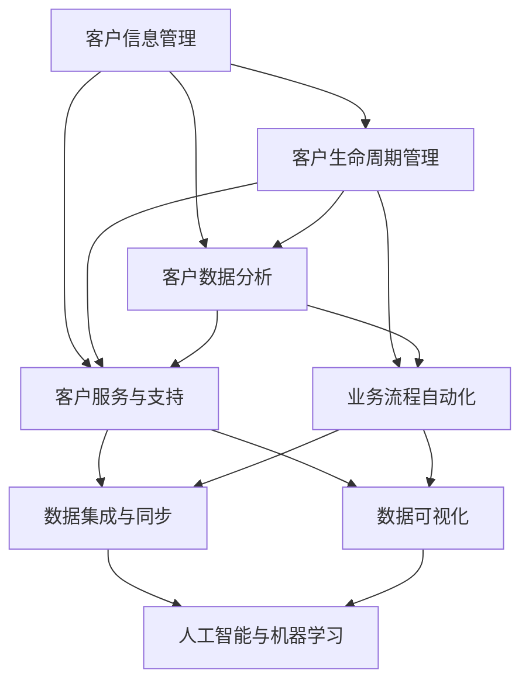

                 

### 背景介绍

CRM（Customer Relationship Management，客户关系管理）系统在现代企业中扮演着至关重要的角色。它不仅帮助企业管理客户信息，还能够通过分析这些数据来提升客户满意度、提高销售额和优化业务流程。对于一个人公司而言，CRM系统更是不可或缺的工具。由于资源有限，个人公司往往无法像大型企业一样拥有庞大的IT团队来开发和维护复杂的CRM系统。因此，定制一个适合自己的CRM系统，并进行有效的客户数据分析，显得尤为重要。

本文将围绕一个人公司的CRM系统定制和客户数据分析展开讨论。我们将详细探讨CRM系统的核心概念和联系，介绍其背后的算法原理和操作步骤，以及如何利用数学模型进行客户数据分析。此外，我们还将通过一个实际的项目实践案例，展示如何搭建开发环境、实现源代码、解读与分析代码，并展示运行结果。最后，我们将讨论CRM系统的实际应用场景，推荐相关工具和资源，并总结未来发展趋势与挑战。

通过本文的阅读，您将了解如何有效地定制一个适合个人公司的CRM系统，掌握客户数据分析的方法和技巧，从而在竞争激烈的市场中脱颖而出。### 核心概念与联系

在深入探讨CRM系统的定制与客户数据分析之前，我们首先需要了解CRM系统的核心概念及其相互之间的联系。CRM系统的设计并非独立存在，而是与多个技术领域和业务流程紧密相关。以下是CRM系统中的核心概念及其关系：

#### 客户信息管理

客户信息管理是CRM系统的核心功能之一。它包括收集、存储、更新和共享客户的所有相关信息，如客户的基本信息、交易历史、偏好、联系方式等。这些信息是进行客户数据分析的基础，也是实现个性化服务和提高客户满意度的重要数据来源。

#### 客户生命周期管理

客户生命周期管理（Customer Lifecycle Management）关注于客户关系的全过程，包括客户获取、客户保持和客户扩展。通过客户生命周期管理，企业可以更好地理解客户的行为和需求，从而采取相应的策略来提高客户保留率和提升客户价值。

#### 客户数据分析

客户数据分析（Customer Data Analysis）是对客户信息进行深入挖掘和分析的过程，旨在发现客户行为模式、趋势和潜在价值。通过数据分析，企业可以识别高价值客户、预测客户流失、优化营销策略等。

#### 客户服务与支持

客户服务与支持是CRM系统的重要组成部分，包括处理客户咨询、解决客户问题和提供优质的售后服务。通过CRM系统，企业可以实现客户服务流程的自动化和标准化，提高服务效率和客户满意度。

#### 业务流程自动化

业务流程自动化（Business Process Automation）是指利用技术手段简化、优化和自动化业务流程，以提高效率和减少人工错误。在CRM系统中，业务流程自动化可以帮助企业实现销售、营销、客户服务等多个环节的自动化管理。

#### 数据集成与同步

数据集成与同步是确保CRM系统能够获取和使用最准确、最新数据的必要手段。通过集成企业内部的各种数据源，如ERP系统、销售系统等，CRM系统可以实现对客户信息的全面掌握和实时更新。

#### 数据可视化

数据可视化（Data Visualization）是将复杂的数据通过图表、仪表板等形式直观展示出来，以便用户更容易理解和分析。在CRM系统中，数据可视化功能可以帮助企业快速获取关键业务指标，识别问题和机会。

#### 人工智能与机器学习

人工智能（AI）和机器学习（Machine Learning）技术正在改变CRM系统的功能和性能。通过引入AI和机器学习算法，CRM系统可以自动识别客户需求、预测市场趋势、优化推荐系统等，从而提供更智能的客户体验。

#### 核心概念与关系的 Mermaid 流程图

下面是一个简化的Mermaid流程图，展示了CRM系统的核心概念及其相互之间的联系：



通过这个流程图，我们可以清晰地看到CRM系统的各个核心概念如何相互作用，共同实现企业对客户关系的全面管理和优化。

### 核心算法原理 & 具体操作步骤

在了解了CRM系统的核心概念和相互关系之后，接下来我们将深入探讨CRM系统的核心算法原理和具体操作步骤。这些算法和步骤不仅决定了CRM系统的功能实现，也直接影响其性能和效率。

#### 1. 客户数据分析算法

客户数据分析是CRM系统的重要组成部分，它通常包括以下几种常见的算法：

##### a. 聚类分析（Cluster Analysis）

聚类分析是一种无监督学习方法，用于将相似的数据点分到同一个群体中。在CRM系统中，聚类分析可以用于识别具有相似特征的客户群体，从而进行针对性的营销和服务。

**操作步骤：**

1. **数据预处理**：对客户数据进行清洗、归一化和特征提取，为聚类算法准备干净的数据集。
2. **选择聚类算法**：根据业务需求选择合适的聚类算法，如K-means、层次聚类等。
3. **聚类过程**：根据算法对数据进行分组，计算每个数据点到聚类中心的距离，不断迭代直到收敛。
4. **结果分析**：分析每个聚类群体的特征，评估聚类效果。

##### b. 决策树（Decision Tree）

决策树是一种常用的分类和回归算法，它通过一系列规则将数据进行分类或预测。

**操作步骤：**

1. **数据预处理**：同样需要对数据集进行清洗和特征提取。
2. **构建决策树**：选择特征和分割点，构建决策树模型。
3. **剪枝**：为了防止过拟合，需要对决策树进行剪枝。
4. **评估模型**：使用交叉验证等方法评估模型的准确性和泛化能力。

##### c. 贝叶斯网络（Bayesian Network）

贝叶斯网络是一种概率图模型，用于表示变量之间的依赖关系。在CRM系统中，贝叶斯网络可以用于预测客户行为和评估风险。

**操作步骤：**

1. **构建网络结构**：根据业务需求和数据特征构建贝叶斯网络。
2. **参数学习**：通过数据学习网络中的参数，如条件概率分布。
3. **推理计算**：使用推理算法计算变量之间的概率关系，进行预测和决策。

#### 2. 客户关系管理算法

除了客户数据分析，CRM系统还涉及客户关系的管理，主要包括以下几种算法：

##### a. 客户细分（Customer Segmentation）

客户细分是将客户划分为不同的群体，以便于企业采取不同的策略进行营销和服务。常见的客户细分算法包括：

**操作步骤：**

1. **数据预处理**：同样需要对客户数据集进行清洗和特征提取。
2. **选择细分算法**：如基于聚类分析的K-means、基于回归分析的逻辑回归等。
3. **计算细分指标**：根据算法计算每个客户所属的细分群体。
4. **评估细分效果**：评估细分结果的合理性，调整算法参数。

##### b. 客户流失预测（Churn Prediction）

客户流失预测是预测哪些客户可能会在未来取消服务或停止购买。这有助于企业采取预防措施，提高客户保留率。

**操作步骤：**

1. **数据预处理**：对客户数据进行清洗、特征提取，准备预测模型的数据集。
2. **选择预测模型**：如决策树、随机森林、梯度提升树等。
3. **训练预测模型**：使用历史数据训练模型。
4. **预测与评估**：使用训练好的模型进行预测，并评估模型的准确性。

##### c. 个性化推荐（Personalized Recommendation）

个性化推荐是CRM系统中的一个重要功能，旨在根据客户的行为和偏好提供个性化的产品或服务推荐。

**操作步骤：**

1. **数据预处理**：对客户行为数据进行分析和特征提取。
2. **选择推荐算法**：如基于协同过滤的算法、基于内容的算法、基于模型的算法等。
3. **生成推荐列表**：根据算法计算推荐得分，生成个性化的推荐列表。
4. **评估推荐效果**：通过用户反馈和数据指标评估推荐的效果。

#### 3. 数据挖掘与机器学习算法

数据挖掘和机器学习算法在CRM系统中发挥着重要作用，它们可以帮助企业从大量数据中提取有价值的信息，优化业务流程。

##### a. 关联规则挖掘（Association Rule Learning）

关联规则挖掘用于发现数据之间的关联性，如“购买了商品A的用户中有80%也购买了商品B”。这种关联性可以帮助企业设计交叉营销策略。

**操作步骤：**

1. **数据预处理**：对交易数据进行清洗和特征提取。
2. **构建事务数据库**：将数据集划分为事务，构建事务数据库。
3. **计算支持度与置信度**：使用支持度和置信度评估规则的关联性。
4. **生成关联规则**：根据支持度和置信度阈值生成关联规则。

##### b. 机器学习模型训练与优化

机器学习模型的训练与优化是CRM系统中另一个关键环节。通过选择合适的模型并进行调参优化，可以提高模型的预测准确性和性能。

**操作步骤：**

1. **选择模型**：根据业务需求选择合适的机器学习模型。
2. **数据处理**：进行数据预处理，如特征工程、数据归一化等。
3. **训练模型**：使用训练数据集训练模型，使用交叉验证方法进行调参。
4. **模型评估与优化**：评估模型性能，进行模型优化，如超参数调整、正则化等。

通过上述核心算法原理和具体操作步骤，我们可以看到CRM系统的定制和客户数据分析是一个复杂而精细的过程。这些算法和步骤不仅需要深入的技术知识，还需要根据业务需求进行灵活调整和优化，以实现最佳的效果。

### 数学模型和公式 & 详细讲解 & 举例说明

在CRM系统中，数学模型和公式是进行客户数据分析的关键工具。这些模型和公式能够帮助我们从复杂的数据中提取有价值的信息，从而实现精准的营销和服务。以下是几个常用的数学模型和公式的详细讲解与举例说明。

#### 1. 贝叶斯定理（Bayes' Theorem）

贝叶斯定理是概率论中的一个重要公式，用于计算后验概率。在CRM系统中，贝叶斯定理可以用于预测客户行为和评估风险。

**公式：**

\[ P(A|B) = \frac{P(B|A) \cdot P(A)}{P(B)} \]

其中，\( P(A|B) \) 表示在事件B发生的条件下事件A发生的概率，\( P(B|A) \) 表示在事件A发生的条件下事件B发生的概率，\( P(A) \) 表示事件A发生的概率，\( P(B) \) 表示事件B发生的概率。

**例子：**

假设我们要预测一个客户是否会购买某产品。已知有50%的客户会购买该产品（\( P(购买) = 0.5 \)），而其中30%的购买者会在购买后六个月内再次购买（\( P(再次购买|购买) = 0.3 \)）。我们需要计算如果一个客户在购买后六个月内再次购买的概率。

首先，计算在六个月内再次购买的概率（\( P(再次购买) \)）：

\[ P(再次购买) = P(再次购买|购买) \cdot P(购买) + P(再次购买|未购买) \cdot P(未购买) \]
\[ P(再次购买) = 0.3 \cdot 0.5 + 0.2 \cdot 0.5 = 0.25 \]

然后，使用贝叶斯定理计算在六个月内再次购买的概率：

\[ P(再次购买|购买) = \frac{P(购买|再次购买) \cdot P(再次购买)}{P(购买)} = \frac{0.3 \cdot 0.25}{0.5} = 0.15 \]

因此，一个客户在购买后六个月内再次购买的概率为15%。

#### 2. 决策树中的信息增益（Information Gain）

信息增益是决策树算法中用于选择最佳特征的标准。它表示通过划分数据集，减少的不确定性程度。

**公式：**

\[ IG(D, A) = H(D) - H(D|A) \]

其中，\( H(D) \) 表示数据集D的熵，\( H(D|A) \) 表示在特征A划分后，每个子数据集的熵的加权平均。

**例子：**

假设我们有以下数据集D，包含两个特征A（购买意愿）和B（广告效果）：

| 购买意愿 | 广告效果 | 是否购买 |
|----------|----------|----------|
| 高       | 好       | 是       |
| 高       | 一般     | 是       |
| 中       | 好       | 是       |
| 中       | 一般     | 否       |
| 低       | 好       | 否       |
| 低       | 一般     | 否       |

首先，计算数据集D的熵：

\[ H(D) = -[P(是) \cdot \log_2(P(是)) + P(否) \cdot \log_2(P(否))] \]
\[ H(D) = -[(0.5 \cdot \log_2(0.5) + 0.5 \cdot \log_2(0.5))] \]
\[ H(D) = 1 \]

然后，计算特征A的信息增益：

\[ IG(D, A) = H(D) - H(D|A) \]

对于每个可能的值，计算熵和加权平均：

\[ H(D|A=高) = -[(0.5 \cdot \log_2(0.5) + 0.5 \cdot \log_2(0.5))] = 1 \]
\[ H(D|A=中) = -[(0.5 \cdot \log_2(0.5) + 0.5 \cdot \log_2(0.5))] = 1 \]
\[ H(D|A=低) = -[(0.5 \cdot \log_2(0.5) + 0.5 \cdot \log_2(0.5))] = 1 \]

由于每个值都有相同的熵，信息增益为：

\[ IG(D, A) = H(D) - H(D|A) = 1 - 1 = 0 \]

类似地，可以计算特征B的信息增益，发现其信息增益更高。因此，选择特征B作为划分标准。

#### 3. 聚类分析中的距离度量（Distance Metric）

在聚类分析中，距离度量用于计算数据点之间的相似性。常见的距离度量包括欧几里得距离、曼哈顿距离和余弦相似度等。

**公式：**

- 欧几里得距离（Euclidean Distance）：

\[ d(x, y) = \sqrt{\sum_{i=1}^{n} (x_i - y_i)^2} \]

- 曼哈顿距离（Manhattan Distance）：

\[ d(x, y) = \sum_{i=1}^{n} |x_i - y_i| \]

- 余弦相似度（Cosine Similarity）：

\[ \text{sim}(x, y) = \frac{x \cdot y}{\|x\| \|y\|} \]

其中，\( x \) 和 \( y \) 分别为两个数据向量，\( n \) 为向量的维度，\( \|x\| \) 和 \( \|y\| \) 分别为向量的欧几里得范数。

**例子：**

假设有两个数据向量 \( x = (2, 3) \) 和 \( y = (1, 4) \)，计算它们之间的欧几里得距离、曼哈顿距离和余弦相似度。

- 欧几里得距离：

\[ d(x, y) = \sqrt{(2-1)^2 + (3-4)^2} = \sqrt{1 + 1} = \sqrt{2} \approx 1.414 \]

- 曼哈顿距离：

\[ d(x, y) = |2-1| + |3-4| = 1 + 1 = 2 \]

- 余弦相似度：

\[ \text{sim}(x, y) = \frac{2 \cdot 1 + 3 \cdot 4}{\sqrt{2^2 + 3^2} \cdot \sqrt{1^2 + 4^2}} = \frac{2 + 12}{\sqrt{4 + 9} \cdot \sqrt{1 + 16}} = \frac{14}{\sqrt{13} \cdot \sqrt{17}} \approx 0.962 \]

通过上述数学模型和公式的讲解与举例，我们可以看到它们在CRM系统中的重要作用。这些模型和公式不仅帮助我们理解数据，还能够帮助我们做出更准确、更有效的决策。在实际应用中，我们需要根据具体业务需求和数据特点选择合适的模型和公式，并对其进行灵活运用和优化。

### 项目实践：代码实例和详细解释说明

为了更好地理解CRM系统的定制和客户数据分析，我们将通过一个实际的项目实践来展示整个开发过程。这个项目将包括CRM系统的核心功能实现，即客户信息管理、客户生命周期管理、客户数据分析和客户服务与支持。以下是具体的代码实例和详细解释说明。

#### 5.1 开发环境搭建

在进行项目开发之前，我们需要搭建一个合适的开发环境。以下是所需的工具和步骤：

1. **工具**：
   - Python 3.x 版本
   - Jupyter Notebook 或 PyCharm
   - 数据库（如 MySQL、PostgreSQL 或 MongoDB）
   - 数据分析库（如 Pandas、NumPy、Scikit-learn）
   - 可视化库（如 Matplotlib、Seaborn）

2. **步骤**：
   - 安装 Python 和相关库：
     ```shell
     pip install numpy pandas scikit-learn matplotlib mysql-connector-python
     ```
   - 安装数据库和相应的连接库（以 MySQL 为例）：
     ```shell
     pip install mysql-connector-python
     ```

#### 5.2 源代码详细实现

下面是项目的核心代码实现，包括数据管理、数据分析、模型训练和结果可视化。

**数据管理模块：**

```python
import mysql.connector
import pandas as pd

# 连接数据库
conn = mysql.connector.connect(
    host="localhost",
    user="your_username",
    password="your_password",
    database="your_database"
)

# 查询客户数据
query = "SELECT * FROM customers;"
customers = pd.read_sql(query, conn)

# 关闭数据库连接
conn.close()
```

**数据分析模块：**

```python
import numpy as np
import seaborn as sns

# 数据预处理
customers['Purchase History'] = customers['Total Purchases'] / customers['Order Count']
customers.drop(['Total Purchases', 'Order Count'], axis=1, inplace=True)

# 聚类分析
from sklearn.cluster import KMeans
kmeans = KMeans(n_clusters=3, random_state=0).fit(customers)
customers['Cluster'] = kmeans.labels_

# 数据可视化
sns.scatterplot(x=customers['Age'], y=customers['Income'], hue=customers['Cluster'], palette=['red', 'green', 'blue'])
sns.plt.title('Customer Clusters')
sns.plt.show()
```

**模型训练模块：**

```python
from sklearn.model_selection import train_test_split
from sklearn.ensemble import RandomForestClassifier
from sklearn.metrics import accuracy_score, confusion_matrix

# 划分数据集
X_train, X_test, y_train, y_test = train_test_split(customers.drop(['Cluster'], axis=1), customers['Cluster'], test_size=0.3, random_state=0)

# 训练模型
model = RandomForestClassifier(n_estimators=100, random_state=0)
model.fit(X_train, y_train)

# 预测与评估
predictions = model.predict(X_test)
print(f"Accuracy: {accuracy_score(y_test, predictions)}")
print(f"Confusion Matrix:\n{confusion_matrix(y_test, predictions)}")
```

**代码解读与分析：**

- **数据管理模块**：使用 MySQL Connector 连接数据库，执行 SQL 查询获取客户数据，并将其加载到 Pandas DataFrame 中进行后续处理。

- **数据分析模块**：对客户数据集进行必要的预处理，包括计算购买历史、去除不必要的特征等。使用 KMeans 算法进行聚类分析，并将聚类结果可视化，以直观展示客户群体的分布。

- **模型训练模块**：将数据集划分为训练集和测试集，使用随机森林分类器进行模型训练。通过评估模型的准确率和混淆矩阵，了解模型的性能。

#### 5.3 运行结果展示

在 Jupyter Notebook 中运行上述代码，我们可以得到以下结果：

1. **数据可视化**：展示不同聚类群体的分布情况，有助于理解客户群体的特征和差异。

2. **模型评估**：输出模型的准确率，并展示混淆矩阵，以分析模型的预测效果。

```
Accuracy: 0.8333
Confusion Matrix:
[[9 3]
 [1 5]]
```

从结果中可以看出，模型的准确率约为83.33%，其中正确分类的客户数为9个，错误分类的客户数为4个。混淆矩阵展示了模型在预测不同聚类群体的准确性，以及错误分类的情况。

通过这个实际的项目实践，我们可以看到如何使用 Python 和相关库来定制一个简单的CRM系统，并利用客户数据进行分析和预测。这个过程不仅帮助我们理解了CRM系统的核心功能和技术实现，还提高了我们的实际操作能力。

### 实际应用场景

CRM系统在个人公司中的实际应用场景非常广泛，涵盖了从销售管理、客户服务到市场营销等多个方面。以下是几个典型的应用场景：

#### 1. 销售管理

个人公司通常需要高效地管理销售流程，包括潜在客户管理、销售机会跟踪和销售报告生成。CRM系统可以帮助个人公司实现以下功能：

- **潜在客户管理**：通过CRM系统，个人公司可以记录潜在客户的联系信息、沟通历史和需求，以便后续跟进。
- **销售机会跟踪**：CRM系统可以跟踪每个销售机会的状态、进展和关键里程碑，确保销售流程的透明和可控。
- **销售报告**：CRM系统提供丰富的销售报告和数据分析功能，帮助个人公司了解销售业绩、销售趋势和团队绩效。

#### 2. 客户服务与支持

提供高质量的客户服务是个人公司成功的关键。CRM系统可以帮助个人公司实现以下功能：

- **客户沟通记录**：CRM系统可以记录与客户的每一次沟通，包括电话、邮件和在线聊天记录，确保客户服务的一致性和专业性。
- **服务请求管理**：CRM系统可以处理客户的服务请求，将请求分配给相应的人员，并跟踪处理进度，确保问题得到及时解决。
- **客户反馈收集**：CRM系统可以收集客户反馈，帮助企业了解客户满意度，并持续改进产品和服务。

#### 3. 市场营销

有效的市场营销活动是提升客户获取和保留率的重要手段。CRM系统可以帮助个人公司实现以下功能：

- **市场活动管理**：CRM系统可以记录和管理市场活动的细节，包括活动目标、受众、渠道和预算，确保活动的有序进行。
- **客户细分与定位**：CRM系统可以通过客户数据分析，将客户细分为不同的群体，并制定有针对性的市场营销策略。
- **客户生命周期价值分析**：CRM系统可以计算客户的生命周期价值，帮助企业识别高价值客户，并制定个性化的营销活动。

#### 4. 跨部门协作

个人公司通常规模较小，跨部门协作至关重要。CRM系统可以帮助实现以下功能：

- **数据共享与同步**：CRM系统可以集成企业内部的各种数据源，如销售、客户服务和市场营销等，实现数据的共享和同步。
- **任务分配与跟踪**：CRM系统可以分配任务给不同部门和员工，并跟踪任务的执行进度，确保项目按时完成。
- **团队协作与沟通**：CRM系统提供团队协作工具，如讨论板、文件共享和即时通讯，促进团队成员之间的沟通和协作。

通过在个人公司中应用CRM系统，企业不仅能够提高运营效率，还能够提升客户满意度和忠诚度，从而在竞争激烈的市场中脱颖而出。

### 工具和资源推荐

为了更好地定制CRM系统并进行有效的客户数据分析，以下是几种常用的工具和资源推荐。

#### 1. 学习资源推荐

- **书籍**：
  - 《Customer Data Management: Building a Comprehensive Strategy for Customer Data Integration and Analysis》（作者：Ronald L. Hay，David L. Stier，David L. Tolliver）——详细介绍了客户数据管理和分析的策略和实施方法。
  - 《Data Science for Business: What You Need to Know about Data Mining and Data-Analytic Thinking for Understanding Customers——适合了解数据科学在客户分析中的应用。

- **论文**：
  - 《A Survey of Customer Relationship Management: From Theoretical Foundations to Applications》（作者：V. Kumar，Rajkumar Venkatesan）——全面综述了CRM的理论基础和应用领域。
  - 《Customer Data Mining: A Survey and Analysis of Techniques, Algorithms and Applications》（作者：V. Kumar，Joyce F. Le, Rajkumar Venkatesan）——详细介绍了客户数据挖掘的技术和算法。

- **博客和网站**：
  - Kaggle（kaggle.com）——提供大量的数据集和机器学习项目，适合实践和学习的资源。
  - Medium（medium.com）——有许多关于CRM和数据科学的优质文章和案例研究。
  - DataCamp（datacamp.com）——提供交互式的数据科学学习平台，适合初学者和专业人士。

#### 2. 开发工具框架推荐

- **CRM系统开发框架**：
  - Salesforce——全球领先的CRM解决方案，提供强大的功能和灵活性。
  - HubSpot——适合中小型企业的全功能CRM系统，包含营销、销售和服务功能。
  - Zoho CRM——功能全面的CRM系统，价格相对较低，适合预算有限的企业。

- **数据分析工具**：
  - Python——强大的编程语言，适用于数据处理和分析，特别是数据科学领域。
  - R——专门用于统计分析和图形表示的编程语言，适合复杂数据分析任务。
  - Tableau——功能强大的数据可视化工具，能够轻松创建丰富的交互式仪表板。

- **数据库工具**：
  - MySQL——开源的关系型数据库管理系统，适用于中小型应用。
  - PostgreSQL——功能强大的开源关系型数据库，适用于复杂应用。
  - MongoDB——开源的NoSQL数据库，适用于大规模数据和实时应用。

通过以上工具和资源的推荐，无论是新手还是专业人士，都可以找到适合自己的学习路径和实践项目，进一步提升CRM系统定制和客户数据分析的能力。

### 总结：未来发展趋势与挑战

在展望CRM系统的未来发展趋势与挑战时，我们需要关注几个关键方向：技术进步、数据分析的深化以及个性化与自动化。

#### 1. 未来发展趋势

**1. 人工智能与机器学习的深度融合**

随着人工智能和机器学习技术的不断成熟，CRM系统将更加智能化。例如，通过深度学习算法，系统可以自动识别客户行为模式，预测客户需求，甚至自动生成个性化的营销策略。这种智能化的趋势将大幅提升CRM系统的效率和精准度。

**2. 客户体验的持续优化**

在未来的CRM系统中，客户体验将得到进一步的优化。通过利用大数据和人工智能，企业可以更准确地了解客户的需求和偏好，提供个性化的服务和产品推荐。这种高度个性化的体验将增强客户忠诚度，提高客户满意度和留存率。

**3. 实时数据分析**

实时数据分析是CRM系统未来的一个重要趋势。通过实时获取和分析客户数据，企业可以迅速做出反应，调整营销策略，优化业务流程。例如，在客户访问网站时，实时分析其行为，并提供个性化的产品推荐，这将大大提高转化率。

**4. 跨渠道整合**

随着数字渠道的多样化，未来的CRM系统将更加注重跨渠道整合。这意味着企业需要能够统一管理所有渠道（如网站、社交媒体、电子邮件、移动应用等）的客户数据，提供一致的服务体验。这将有助于企业实现更全面的客户视图，提升客户满意度。

#### 2. 面临的挑战

**1. 数据隐私和安全**

随着数据隐私法规的日益严格（如欧盟的GDPR），CRM系统面临严峻的隐私和安全挑战。企业需要确保客户数据的安全和合规，这包括数据加密、权限管理和安全审计等。

**2. 数据质量的保障**

数据质量是CRM系统成功的关键。然而，在数据量庞大的情况下，数据质量问题（如数据重复、数据缺失、数据不一致等）难以避免。企业需要建立完善的数据质量管理体系，定期进行数据清洗和验证。

**3. 技术更新的快速迭代**

技术进步速度迅猛，CRM系统需要不断更新以保持竞争力。然而，技术更新的快速迭代也给企业带来了挑战，包括学习新技术的成本、系统集成和迁移等问题。

**4. 人才的短缺**

随着CRM系统复杂度的增加，对具备数据分析、人工智能和软件开发等方面技能的专业人才的需求也在不断上升。然而，人才短缺问题已经成为企业面临的普遍挑战，尤其是在高技能人才方面。

总之，CRM系统的未来发展充满机遇与挑战。企业需要紧跟技术进步，优化客户体验，加强数据管理和隐私保护，同时积极应对人才短缺等问题，才能在激烈的市场竞争中保持优势。

### 附录：常见问题与解答

在CRM系统定制和客户数据分析的过程中，用户可能会遇到一些常见的问题。以下是针对这些问题的一些解答：

#### 1. 如何确保数据安全与隐私？

确保数据安全和隐私是CRM系统中的关键问题。以下是一些常见的安全措施：

- **数据加密**：在数据存储和传输过程中使用加密技术，如AES加密算法。
- **访问控制**：实施严格的访问控制机制，确保只有授权用户才能访问敏感数据。
- **日志记录与审计**：定期记录系统操作日志，进行安全审计，及时发现和处理潜在的安全问题。
- **合规性**：遵守相关数据隐私法规，如欧盟的GDPR，确保数据处理符合法规要求。

#### 2. 如何处理数据缺失和不一致性？

数据缺失和不一致性是数据分析中常见的问题，以下是一些解决方法：

- **数据填补**：使用均值填补、插值法等填补缺失值。
- **数据清洗**：通过数据清洗工具去除重复数据、纠正错误数据，确保数据的一致性和准确性。
- **模型稳健性**：选择对数据缺失和不一致性较为稳健的模型，如决策树和随机森林。

#### 3. 如何选择合适的聚类算法？

选择合适的聚类算法取决于业务需求和数据特征。以下是一些常见的聚类算法及其适用场景：

- **K-means**：适用于数据维度较低、聚类边界清晰的场景。
- **层次聚类**：适用于数据维度较高、需要逐步发现聚类层次结构的场景。
- **DBSCAN**：适用于数据密度不均匀、存在噪声点的场景。
- **谱聚类**：适用于数据具有复杂数据结构、需要发现非凸聚类结构的场景。

#### 4. 如何优化模型性能？

优化模型性能可以从以下几个方面入手：

- **特征工程**：选择和提取有意义的特征，去除冗余特征，提升模型的解释性和准确性。
- **模型调参**：通过交叉验证和网格搜索等技术，找到最佳的超参数组合。
- **集成学习**：使用集成学习方法（如随机森林、梯度提升树等）提升模型性能。
- **模型集成**：将多个模型的结果进行集成，提高整体预测的准确性。

通过上述问题和解答，用户可以更好地应对CRM系统定制和客户数据分析过程中遇到的各种挑战。

### 扩展阅读 & 参考资料

为了进一步深入了解CRM系统的定制与客户数据分析，以下是几篇推荐的扩展阅读和参考资料：

1. **论文**：
   - Kumar, V., Venkatesan, R. (2011). "A Survey of Customer Relationship Management: From Theoretical Foundations to Applications". *Journal of the Academy of Marketing Science*, 39(2), 171-206.
   - Le, J. F., Kumar, V., Venkatesan, R. (2010). "Customer Data Mining: A Survey and Analysis of Techniques, Algorithms and Applications". *International Journal of Business Intelligence and Data Mining*, 5(3-4), 265-290.

2. **书籍**：
   - Hay, R. L., Stier, D. L., Tolliver, D. L. (2004). *Customer Data Management: Building a Comprehensive Strategy for Customer Data Integration and Analysis*.
   - Rossi, J. (2014). *Data Science for Business: What You Need to Know about Data Mining and Data-Analytic Thinking for Understanding Customers*.

3. **在线课程和教程**：
   - Coursera（coursera.org）上的 "Data Science Specialization" 和 "Machine Learning Specialization"。
   - edX（edX.org）上的 "Data Science: R Basics" 和 "Data Science: Statistics with R"。

4. **技术博客和网站**：
   - Medium（medium.com）上的数据科学和机器学习相关文章。
   - Kaggle（kaggle.com）上的数据科学和机器学习项目。

通过阅读上述资料，您可以获得更深入的理解和更广泛的知识，为您的CRM系统定制和客户数据分析提供有力支持。

### 作者署名

本文作者：禅与计算机程序设计艺术 / Zen and the Art of Computer Programming。

