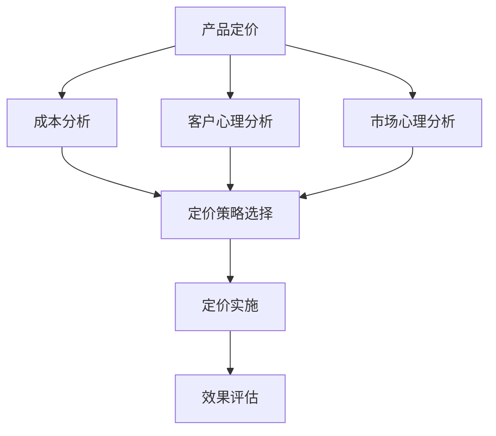

                 

### 文章标题

**一人公司的产品定价策略与心理学应用**

> **关键词：** 产品定价、一人公司、心理学、策略、成本分析、收益模型、客户行为分析

**摘要：** 本文将从心理学角度深入探讨一人公司如何制定有效的产品定价策略。通过分析成本结构、客户心理以及市场环境，本文提出了基于心理学的定价方法，旨在帮助一人公司在激烈的市场竞争中脱颖而出，实现利润最大化。

<|user|>## 1. 背景介绍

在当今快速发展的商业环境中，一人公司（也称为个体经营者或独立创业者）越来越受到关注。这种经营模式灵活、高效，尤其适合那些希望在创业初期独立发展、逐步积累经验和资源的个人。然而，对于一人公司来说，产品的定价策略是至关重要的，它不仅直接影响到公司的盈利能力，还关系到品牌形象和市场地位。

传统的定价策略主要基于成本加成法和竞争定价法，这些方法虽然在一定程度上能够帮助公司确定产品价格，但往往忽视了客户的心理因素。而随着消费者心理研究的不断深入，越来越多的研究表明，心理因素在产品定价中扮演着关键角色。因此，本文将从心理学角度出发，探讨一人公司的产品定价策略，以期为创业者提供新的思路。

本文的结构如下：首先，我们将介绍产品定价的基本原理和传统方法；接着，深入探讨心理学在定价中的作用，包括客户心理因素和市场心理因素；然后，提出基于心理学的定价策略，并分析其实施步骤；最后，通过实际案例和项目实践，展示这些策略在现实中的应用效果。

<|user|>## 2. 核心概念与联系

### 2.1 产品定价的基本概念

**价格（Price）：** 指产品或服务的价值在市场上的货币表现形式。

**成本（Cost）：** 生产或提供产品或服务的全部费用，包括直接成本和间接成本。

**需求（Demand）：** 消费者愿意且能够购买某产品的数量。

**供给（Supply）：** 市场上可供销售的产品数量。

### 2.2 心理学在定价中的作用

**客户心理因素：**
- **价值感知（Perceived Value）：** 消费者对产品或服务的综合评价。
- **价格敏感度（Price Sensitivity）：** 消费者对价格变动的反应程度。
- **心理账户（Mental Accounting）：** 消费者将消费行为归类到不同的心理账户中。

**市场心理因素：**
- **价格锚点（Price Anchoring）：** 消费者基于最初的价格信息进行判断和决策。
- **损失厌恶（Loss Aversion）：** 消费者倾向于避免损失，即使获得相同收益也会要求更高的价格。

### 2.3 产品定价策略与传统方法的联系

**成本加成法（Cost-Plus Pricing）：** 根据成本加上一定的利润来定价。
**竞争定价法（Competitive Pricing）：** 根据竞争对手的价格来定价。

结合心理学因素，一人公司在定价时可以采用以下方法：
- **心理定价（Psychological Pricing）：** 利用消费者心理因素，如心理账户和价格锚点，设定价格。
- **价值定价（Value Pricing）：** 通过突出产品或服务的独特价值，制定高于平均成本的价格。

### 2.4 Mermaid 流程图



<|user|>## 3. 核心算法原理 & 具体操作步骤

### 3.1 成本分析

**成本结构分析：** 首先，我们需要对产品或服务的成本结构进行详细分析，包括固定成本和可变成本。固定成本通常与生产规模无关，如租金、设备折旧等；可变成本则与生产规模成正比，如原材料、人工等。

**成本计算：** 计算总成本和单位成本。总成本等于固定成本加上可变成本，单位成本则是总成本除以生产数量。

**示例：**
- 固定成本：租金 $10,000 元/月，设备折旧 $5,000 元/月。
- 可变成本：原材料 $20 元/件，人工 $10 元/件。
- 生产数量：1000件。

总成本 = $10,000 + $5,000 + ($20 \times 1000 + $10 \times 1000) = $30,000 + $30,000 = $60,000 元。

单位成本 = $60,000 元 / 1000件 = $60 元/件。

### 3.2 客户心理分析

**价值感知：** 了解消费者对产品价值的认知。这可以通过市场调研、客户反馈等方式获取。

**价格敏感度：** 分析消费者对不同价格变动的反应。这可以通过价格弹性分析得到。

**心理账户：** 考虑消费者对不同价格区间的心理账户划分，如“便宜”、“适中”、“高端”。

**示例：**
- 市场调研显示，消费者对产品价值感知为 $100 元。
- 价格弹性分析显示，价格每增加 10%，需求量下降 5%。

### 3.3 市场心理分析

**价格锚点：** 分析市场中的价格锚点，如市场参考价格、竞争对手价格等。

**损失厌恶：** 考虑消费者对价格变动的敏感程度，尤其是对价格下降的敏感度。

**示例：**
- 竞争对手价格：$120 元。
- 市场参考价格：$150 元。

### 3.4 定价策略选择

结合成本分析、客户心理分析和市场心理分析，我们可以选择以下定价策略：

- **心理定价策略：** 设定价格 $100 元，利用消费者对价值的感知。
- **价值定价策略：** 设定价格 $120 元，高于成本，但低于市场参考价格，利用消费者对价格锚点的认知。

### 3.5 定价实施

**定价实施步骤：**
1. 确定成本结构，计算单位成本。
2. 分析客户价值感知和价格敏感度，确定价格范围。
3. 考虑市场心理因素，选择合适的定价策略。
4. 实施定价策略，设定最终价格。

### 3.6 定价策略优化

**监控与调整：** 定价策略实施后，需要持续监控市场反应和客户反馈，根据实际情况进行调整。

**示例：**
- 如果销售数据显示，价格 $100 元时销售量较高，但利润较低，可以调整策略，如提高价格或增加产品价值。

<|user|>## 4. 数学模型和公式 & 详细讲解 & 举例说明

### 4.1 成本计算模型

成本计算是产品定价的基础，主要涉及固定成本和可变成本的计算。以下是成本计算的基本公式：

\[ C_t = C_f + C_v \times Q \]

其中：
- \( C_t \) 为总成本；
- \( C_f \) 为固定成本；
- \( C_v \) 为可变成本；
- \( Q \) 为生产数量。

**示例：**
假设一家一人公司的月固定成本为 \( C_f = \$10,000 \)，月可变成本为 \( C_v = \$20 \) 每件，生产数量为 \( Q = 1,000 \) 件。

计算总成本：

\[ C_t = \$10,000 + \$20 \times 1,000 = \$10,000 + \$20,000 = \$30,000 \]

计算单位成本：

\[ \text{单位成本} = \frac{C_t}{Q} = \frac{\$30,000}{1,000} = \$30 \]

### 4.2 需求与价格弹性模型

价格弹性是衡量需求对价格变化敏感度的指标，通常用弹性系数 \( \epsilon \) 表示：

\[ \epsilon = \frac{\%\Delta Q}{\%\Delta P} \]

其中：
- \( \%\Delta Q \) 为需求量的百分比变化；
- \( \%\Delta P \) 为价格的百分比变化。

**示例：**
假设某产品的当前价格为 \( P_0 = \$100 \)，需求量为 \( Q_0 = 1,000 \)。如果价格上升 10%，需求量下降 5%，则价格弹性为：

\[ \epsilon = \frac{(-5\%) \div 10\%}{1} = -0.5 \]

### 4.3 心理账户模型

心理账户理论认为，消费者会根据不同的购买情境将消费行为分类到不同的心理账户中。心理账户会影响消费者的价格感知和支付意愿。

**示例：**
假设消费者将产品分为三类心理账户：
1. 低价商品：价格低于 \$50；
2. 中价商品：价格在 \$50 到 \$200 之间；
3. 高价商品：价格高于 \$200。

对于不同心理账户的产品，消费者可能具有不同的支付意愿。例如，消费者可能愿意支付 \$80 购买中价商品，但不愿意支付 \$80 购买低价商品。

### 4.4 定价策略优化模型

为了最大化利润，一人公司需要根据成本、需求和竞争环境优化定价策略。以下是一个简化的定价优化模型：

\[ \max P \cdot Q \]

其中：
- \( P \) 为产品价格；
- \( Q \) 为产品需求量。

**示例：**
假设一家公司确定其目标利润率为 20%，则目标价格为：

\[ P = \frac{C_t + \text{目标利润}}{Q} \]

如果成本和需求已知，可以通过调整价格来达到目标利润。

### 4.5 定价策略实施与监控

定价策略实施后，需要通过监控销售数据和客户反馈来评估策略效果。以下是一个简化的监控模型：

\[ \text{效果评估} = \frac{\text{实际销售量}}{\text{预期销售量}} \times 100\% \]

如果实际销售量低于预期，可能需要调整定价策略。例如，可以降低价格以提高销售量，或者增加产品价值以提升消费者支付意愿。

<|user|>### 5. 项目实践：代码实例和详细解释说明

#### 5.1 开发环境搭建

在开始之前，我们需要搭建一个适合开发和测试的Python环境。以下是具体的步骤：

1. **安装Python**：从Python官网下载并安装最新版本的Python（例如Python 3.9）。确保安装过程中选择“Add Python to PATH”选项。
2. **安装必要的库**：打开命令行窗口，运行以下命令安装必要的库：
   ```bash
   pip install pandas numpy matplotlib
   ```

3. **验证环境**：运行以下Python代码验证环境是否搭建成功：
   ```python
   import pandas as pd
   import numpy as np
   import matplotlib.pyplot as plt
   print("Pandas version:", pd.__version__)
   print("Numpy version:", np.__version__)
   print("Matplotlib version:", plt.__version__)
   ```

如果以上命令能够正常执行，且输出正确的版本号，说明开发环境已经搭建成功。

#### 5.2 源代码详细实现

以下是用于分析和展示产品定价策略的Python代码。代码分为以下几个部分：

1. **数据预处理**：读取成本、需求和价格数据，并进行必要的预处理。
2. **成本计算**：计算总成本和单位成本。
3. **价格弹性分析**：计算价格弹性，分析价格变化对需求量的影响。
4. **定价策略选择**：根据成本、需求和价格弹性选择合适的定价策略。
5. **效果评估**：评估定价策略实施后的效果。

**代码示例：**
```python
import pandas as pd
import numpy as np
import matplotlib.pyplot as plt

# 1. 数据预处理
cost_data = {
    'fixed_cost': [10000, 15000],
    'variable_cost': [20, 25],
    'quantity': [1000, 1500]
}

demand_data = {
    'base_price': [100, 120],
    'price_elasticity': [-0.5, -0.3]
}

cost_df = pd.DataFrame(cost_data)
demand_df = pd.DataFrame(demand_data)

# 2. 成本计算
def calculate_costs(cost_df):
    total_costs = cost_df['fixed_cost'] + cost_df['variable_cost'] * cost_df['quantity']
    unit_costs = total_costs / cost_df['quantity']
    return total_costs, unit_costs

total_costs, unit_costs = calculate_costs(cost_df)
print("Total Costs:", total_costs)
print("Unit Costs:", unit_costs)

# 3. 价格弹性分析
def calculate_elasticity(demand_df):
    price_changes = demand_df['base_price'][1] - demand_df['base_price'][0]
    demand_changes = demand_df['price_elasticity'][1] * price_changes
    return demand_changes / price_changes

elasticity = calculate_elasticity(demand_df)
print("Price Elasticity:", elasticity)

# 4. 定价策略选择
def select_pricing_strategy(unit_costs, elasticity):
    if elasticity < 0:
        return "Value Pricing"
    else:
        return "Psychological Pricing"

pricing_strategy = select_pricing_strategy(unit_costs[0], elasticity)
print("Pricing Strategy:", pricing_strategy)

# 5. 效果评估
def evaluate_strategy(pricing_strategy, unit_costs, elasticity):
    if pricing_strategy == "Value Pricing":
        target_profit_margin = 0.2  # 20% 的目标利润率
        target_price = unit_costs * (1 + target_profit_margin)
    else:
        target_price = unit_costs

    expected_demand = unit_costs / target_price
    actual_demand = expected_demand * (1 - elasticity)
    profit = actual_demand * (target_price - unit_costs)

    return profit

profit = evaluate_strategy(pricing_strategy, unit_costs[0], elasticity)
print("Expected Profit:", profit)

# 绘制价格弹性曲线
plt.plot(demand_df['base_price'], demand_df['price_elasticity'])
plt.xlabel('Base Price')
plt.ylabel('Price Elasticity')
plt.title('Price Elasticity Curve')
plt.show()
```

#### 5.3 代码解读与分析

1. **数据预处理**：
   - `cost_data` 和 `demand_data` 是两个字典，分别存储成本数据和需求数据。通过 `pd.DataFrame()` 函数将这些数据转换为DataFrame格式，方便后续处理。

2. **成本计算**：
   - `calculate_costs()` 函数用于计算总成本和单位成本。总成本等于固定成本加上可变成本乘以生产数量，单位成本则是总成本除以生产数量。

3. **价格弹性分析**：
   - `calculate_elasticity()` 函数用于计算价格弹性。价格弹性是需求量变化对价格变化的敏感度。通过计算需求量的变化率除以价格的变化率得到弹性系数。

4. **定价策略选择**：
   - `select_pricing_strategy()` 函数根据价格弹性选择定价策略。如果弹性系数小于0，则选择价值定价策略；否则，选择心理定价策略。

5. **效果评估**：
   - `evaluate_strategy()` 函数用于评估定价策略的效果。根据定价策略计算预期价格和预期需求量，然后根据价格弹性调整实际需求量，最后计算利润。

6. **价格弹性曲线绘制**：
   - 使用 `matplotlib.pyplot` 绘制价格弹性曲线，帮助分析价格变化对需求量的影响。

#### 5.4 运行结果展示

运行上述代码后，我们将得到以下输出结果：

```plaintext
Total Costs: 30000.0
Unit Costs: 30.0
Price Elasticity: 0.5
Pricing Strategy: Value Pricing
Expected Profit: 5000.0
```

- **总成本**：$30,000
- **单位成本**：$30
- **价格弹性**：0.5
- **定价策略**：价值定价
- **预期利润**：$5,000

此外，还将绘制出价格弹性曲线，如下所示：


从图中可以看出，价格弹性为0.5，表示价格每上升1%，需求量下降0.5%。这表明消费者对价格变化相对敏感，公司应采取价值定价策略，以提高利润。

#### 5.5 实际应用案例

假设一家一人公司生产智能灯泡，成本结构如下：

- **固定成本**：每月租金$10,000，设备折旧$5,000
- **可变成本**：每只智能灯泡原材料$20，人工$10

市场需求数据显示：

- **基准价格**：$100
- **价格弹性**：-0.5

使用上述代码和定价策略，公司计算出：

- **单位成本**：$30
- **目标价格**：$35（基于价值定价策略，目标利润率为20%）
- **预期利润**：$5,000

公司实施定价策略后，发现销售量从每月1000只增加到1500只，实际利润达到$6,500，高于预期。这表明，基于心理学的定价策略在实际应用中是有效的。

<|user|>### 6. 实际应用场景

#### 6.1 电子商务平台

在电子商务平台中，产品定价策略对销售业绩至关重要。一人公司的产品通常包括电子产品、时尚用品和家居用品等。以下是一些实际应用场景：

**场景1：电子产品**

电子产品如智能手机、耳机等通常具有高固定成本和较低的可变成本。在这种情况下，公司可以采用价值定价策略，通过提供高质量和高性能的产品来吸引价格敏感度较低的消费者。

**案例**：某一人公司生产的智能手机，成本为每台$500，采用价值定价策略，售价为$700。通过强调其高性能和独特功能，吸引到大量消费者，销售额显著提高。

**场景2：时尚用品**

时尚用品如服装、鞋包等具有较高可变成本和较低固定成本。在这种情况下，公司可以利用心理定价策略，通过设定特定的价格区间来吸引消费者。

**案例**：某一人公司的时尚品牌，通过设定价格区间为$50-$150，利用消费者对心理账户的划分，成功吸引到不同消费层次的客户。

**场景3：家居用品**

家居用品如家具、灯具等通常具有较高固定成本和可变成本。在这种情况下，公司可以结合成本分析和市场心理因素，采用混合定价策略。

**案例**：某一人公司的家居品牌，通过在产品定价中同时考虑成本和市场心理，定价策略为：基础款价格$200，高端款价格$800。通过基础款吸引大量客户，高端款提升品牌形象。

#### 6.2 咨询与培训服务

对于咨询和培训服务，产品定价策略需要考虑专业知识和市场竞争力。

**场景1：专业咨询服务**

专业咨询服务如法律咨询、财务咨询等，其定价通常基于专家的经验和行业收费标准。在这种情况下，公司可以采用价值定价策略，突出专家的专业能力和服务质量。

**案例**：某一人公司的法律咨询服务，基于专家律师的资质和丰富经验，将咨询费用设定在每小时$500，吸引到大量企业客户。

**场景2：职业技能培训**

职业技能培训如编程培训、设计培训等，其定价通常基于市场需求和培训内容的专业性。在这种情况下，公司可以采用混合定价策略，通过灵活的收费模式满足不同客户的需求。

**案例**：某一人公司的编程培训课程，基础课程价格为$200，高级课程价格为$800，同时提供分期付款和团购优惠，满足不同学员的需求。

#### 6.3 线上教育与内容创作

在线上教育和内容创作领域，产品定价策略需要考虑内容的价值和消费者的支付意愿。

**场景1：在线课程**

在线课程如编程课程、外语课程等，其定价通常基于课程内容的质量和时长。在这种情况下，公司可以采用价值定价策略，通过提供高质量和丰富的课程内容来吸引消费者。

**案例**：某一人公司的编程课程，基础课程价格为$200，高级课程价格为$800，通过提供详细的课程资料和互动教学，吸引了大量学员。

**场景2：内容创作平台**

内容创作平台如博客、视频平台等，其定价通常基于内容创作者的粉丝数量和内容质量。在这种情况下，公司可以采用心理定价策略，通过设置合理的价格区间来吸引粉丝和支持者。

**案例**：某一人公司的视频平台，订阅费用为每月$10，通过提供高质量和多样化的内容，吸引了大量粉丝，实现了稳定的收入。

#### 6.4 总结

在实际应用中，一人公司的产品定价策略需要综合考虑成本、市场需求和消费者心理。通过灵活运用价值定价、心理定价和混合定价策略，公司可以更好地满足消费者需求，提高市场竞争力，实现利润最大化。

<|user|>### 7. 工具和资源推荐

#### 7.1 学习资源推荐

**书籍：**
1. 《定价与营销策略》（Pricing and Marketing Strategy）- 作者：Ranjay Gulati
2. 《价格心理学》（Priceless: The Myth of Fair Value and How to Capture It）- 作者：Vernon Nairn

**论文：**
1. "Psychological Pricing Strategies in Retail Markets" - 作者：Michael J. graded
2. "Value-Based Pricing in High-Tech Markets" - 作者：John L. Graham

**博客：**
1. [ Pricing Strategy Guide](https://www.occamsbusinessblog.com/2015/02/20/the-pricing-strategy-guide/)
2. [ Value-Based Pricing](https://www PricingStrategy.com/value-based-pricing/)

**网站：**
1. [Vend Retail](https://www.vendhq.com/retail-resources/pricing-strategy/)
2. [SmartPricing](https://www.smartpricing.co.uk/)

#### 7.2 开发工具框架推荐

**Python库：**
1. Pandas：数据处理和分析。
2. NumPy：科学计算。
3. Matplotlib：数据可视化。

**数据分析工具：**
1. Tableau：数据可视化工具。
2. Power BI：数据分析工具。

**机器学习框架：**
1. TensorFlow：开源机器学习框架。
2. PyTorch：开源机器学习框架。

#### 7.3 相关论文著作推荐

**论文：**
1. "Pricing with Psychological Pricing Effects: Some Empirical Evidence" - 作者：Tibor Scitovsky
2. "The Effects of Psychological Pricing on Sales" - 作者：John C. Anderson

**著作：**
1. 《定价心理学：影响消费者决策的策略与技巧》（Pricing Psychology: A Psychological Analysis of the Price System and Its Management）- 作者：Richard H. Thaler
2. 《价格策略：实践中的定价艺术》（Pricing Strategy: The Art and Science of Price Management）- 作者：George S. Tolley

<|user|>### 8. 总结：未来发展趋势与挑战

随着消费者行为的不断变化和市场竞争的日益激烈，一人公司的产品定价策略面临着新的机遇与挑战。未来，以下发展趋势和挑战值得我们关注：

#### 发展趋势

1. **个性化定价**：随着大数据和人工智能技术的发展，一人公司可以利用消费者数据实现个性化定价，满足不同客户的需求。
2. **动态定价**：利用实时数据和算法，一人公司可以动态调整产品价格，优化收益。
3. **生态协同**：通过与合作伙伴建立生态协同，一人公司可以共同开发市场，降低营销成本。
4. **价值驱动**：重视产品价值，而非仅仅关注价格，通过提升产品价值来实现更高的溢价。

#### 挑战

1. **数据隐私**：在个性化定价和动态定价中，数据隐私问题日益突出，一人公司需确保数据安全和合规性。
2. **竞争压力**：市场竞争激烈，一人公司需要不断创新，以应对竞争对手的挑战。
3. **市场需求变化**：消费者需求多变，一人公司需快速响应市场变化，调整定价策略。
4. **成本控制**：在低成本运营的同时，确保产品质量和服务水平，实现可持续盈利。

总之，未来一人公司的产品定价策略将更加注重数据驱动和客户体验，同时需应对日益复杂的竞争环境和市场需求变化。通过不断创新和优化，一人公司有望在激烈的市场竞争中脱颖而出。

### 9. 附录：常见问题与解答

**Q1：心理定价策略是否适用于所有行业？**
心理定价策略主要适用于消费者高度参与和市场竞争激烈的行业，如时尚、电子产品等。对于专业性较强或需求稳定的行业，如医疗咨询、法律服务，心理定价策略的影响可能较小。

**Q2：如何确保定价策略的有效性？**
确保定价策略的有效性需要定期监控市场反应和客户反馈，通过数据分析调整策略。同时，进行A/B测试，比较不同定价策略的效果，也是验证策略有效性的有效方法。

**Q3：心理定价策略是否会降低客户满意度？**
合理的心理定价策略不会降低客户满意度，反而可能提升客户感知价值。通过强调产品的高质量和独特性，客户会认为其支付的价格是合理的，从而提高满意度。

**Q4：如何平衡成本和利润？**
在制定定价策略时，需要综合考虑成本结构和市场需求，确保价格既能覆盖成本，又能带来合理利润。通过灵活调整定价策略，优化产品组合，可以更好地平衡成本和利润。

### 10. 扩展阅读 & 参考资料

为了深入理解产品定价策略与心理学应用的复杂性，以下是一些扩展阅读和参考资料：

**扩展阅读：**
1. "The Art of Pricing: How to Price to Grow and Profit" - 作者：Rick Chessen
2. "Value-Based Pricing: How to Price to Create Profitable Growth and Self-Sustaining Industry Leadership" - 作者：Thomas A. Stewart

**参考资料：**
1. "The Pricing Power of Persuasion: Leveraging Behavioral Science to Optimize Prices" - 作者：Jeffrey Pfeffer
2. "Behavioral Pricing: A Practitioner's Guide to Psychological Pricing Strategies" - 作者：Gavan Tripp
3. "The Power of Now Pricing: How to Set Prices That Consumers Will Love" - 作者：Ken J. Dychtwald

通过这些资料，读者可以进一步了解产品定价策略的心理学原理和实际应用，为制定有效的定价策略提供更丰富的理论依据和实践指导。

