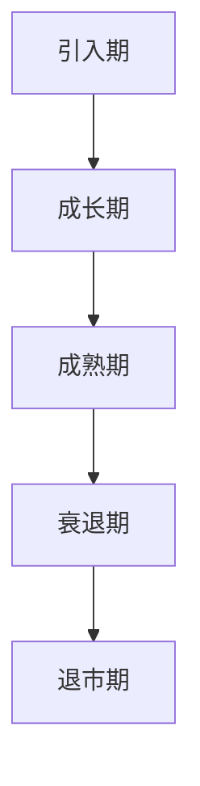

                 

### 文章标题

《一人公司的产品生命周期管理：从概念到退市》

> 关键词：一人公司，产品生命周期管理，市场战略，产品创新，竞争分析，项目管理，市场调研，客户关系，资金管理，税务规划，法律合规，退市策略。

> 摘要：本文旨在探讨一人公司在产品生命周期管理中的挑战与策略。从产品概念到退市，本文将详细解析一人公司在每个阶段的操作步骤、关键因素和成功案例，为读者提供实用的指导。

## 1. 背景介绍

一人公司，顾名思义，是由一个人独自运营的公司。这种商业模式在当今全球化、互联网时代尤为流行。一人公司的优点在于运营成本低、决策迅速、灵活性强。然而，这也意味着一个人需要承担更多的职责，包括市场调研、产品设计、生产制造、销售推广、财务管理、法律合规等。

产品生命周期管理（Product Life Cycle Management, PLCM）是企业为了确保产品在市场中的成功而进行的一系列策略和管理活动。产品生命周期通常分为五个阶段：引入期（Introduction）、成长期（Growth）、成熟期（Maturity）、衰退期（Decline）和退市期（Expiration）。每个阶段都有其独特的挑战和策略。

一人公司在产品生命周期管理中面临着独特的挑战。由于资源和时间的限制，一人公司需要更加高效地管理产品生命周期，确保产品在每个阶段都能获得成功。本文将详细探讨一人公司在产品生命周期各个阶段的操作步骤、关键因素和成功案例。

## 2. 核心概念与联系

### 2.1 产品生命周期管理概念

产品生命周期管理是指企业为了确保产品在市场中的成功而进行的一系列策略和管理活动。它包括以下关键概念：

- **引入期**：新产品发布，市场宣传，客户教育。
- **成长期**：市场扩张，品牌建立，产品优化。
- **成熟期**：市场份额稳定，利润最大化，产品维护。
- **衰退期**：市场萎缩，客户流失，产品淘汰。
- **退市期**：产品退出市场，资产清算。

### 2.2 产品生命周期管理架构

产品生命周期管理的架构通常包括以下步骤：

1. **市场调研**：了解市场需求，确定产品定位。
2. **产品设计**：根据市场调研结果，设计产品功能和外观。
3. **生产制造**：选择合适的制造商，控制生产成本。
4. **销售推广**：制定营销策略，进行市场推广。
5. **客户关系管理**：维护客户关系，提高客户满意度。
6. **财务管理**：监控产品成本，控制预算。
7. **法律合规**：确保产品符合法律法规要求。
8. **产品迭代**：根据市场反馈，进行产品改进。

### 2.3 Mermaid 流程图

以下是一个简单的产品生命周期管理的 Mermaid 流程图：



## 3. 核心算法原理 & 具体操作步骤

### 3.1 引入期

在引入期，核心算法是市场调研和产品定位。以下是具体操作步骤：

1. **市场调研**：使用问卷调查、访谈、在线调查等方法，收集潜在客户的需求和反馈。
2. **数据分析**：分析调研数据，确定产品定位和目标市场。
3. **产品设计**：根据市场调研结果，设计产品功能和外观。
4. **市场宣传**：制定宣传策略，通过社交媒体、广告、公关活动等方式推广产品。

### 3.2 成长期

在成长期，核心算法是市场扩张和品牌建立。以下是具体操作步骤：

1. **市场扩张**：扩大产品销售范围，开拓新的市场。
2. **品牌建立**：通过广告、公关活动、赞助等方式提高品牌知名度。
3. **产品优化**：根据客户反馈，不断优化产品功能和用户体验。
4. **销售策略**：制定多样化的销售策略，提高销售额。

### 3.3 成熟期

在成熟期，核心算法是利润最大化。以下是具体操作步骤：

1. **市场份额稳定**：维持现有市场份额，防止竞争对手入侵。
2. **利润最大化**：优化生产流程，降低成本，提高利润率。
3. **产品维护**：定期更新产品，修复漏洞，保证产品稳定运行。
4. **客户关系管理**：提供优质的客户服务，提高客户满意度。

### 3.4 衰退期

在衰退期，核心算法是产品淘汰。以下是具体操作步骤：

1. **市场萎缩**：认识到市场萎缩趋势，逐步减少产品生产。
2. **客户流失**：通过优惠活动、客户关怀等方式，尽量挽回流失的客户。
3. **产品淘汰**：当产品完全失去市场价值时，果断淘汰产品，减少损失。
4. **资产清算**：处理剩余库存，清算资产，为新产品开发做准备。

### 3.5 退市期

在退市期，核心算法是资产清算。以下是具体操作步骤：

1. **产品退出市场**：宣布产品退市，停止生产和销售。
2. **资产清算**：处理剩余库存，清算资产，收回投资。
3. **税务规划**：根据当地税法，合理规划税务事宜。
4. **法律合规**：确保公司符合所有法律要求，避免法律纠纷。

## 4. 数学模型和公式 & 详细讲解 & 举例说明

### 4.1 产品生命周期模型

产品生命周期模型通常使用 S 形曲线来表示。曲线的三个阶段如下：

- **引入期**：曲线快速上升，表示产品需求增加。
- **成长期**：曲线逐渐平缓，表示市场需求趋于稳定。
- **成熟期**：曲线趋于平稳，表示市场份额稳定。

### 4.2 数学公式

以下是一个简单的产品生命周期模型公式：

$$
f(t) = \frac{a}{1 + e^{-(k-t)}}
$$

其中，$f(t)$ 表示在时间 $t$ 的产品需求，$a$ 表示市场需求量，$k$ 表示市场需求峰值。

### 4.3 举例说明

假设一个产品在引入期后进入成长期，市场需求量为 1000，市场需求峰值为 5000。根据上述公式，我们可以计算出不同时间的产品需求：

- **t = 0** 时，$f(0) = \frac{1000}{1 + e^{-(5000-0)}} = 0.5$
- **t = 5000** 时，$f(5000) = \frac{1000}{1 + e^{-(5000-5000)}} = 1$
- **t = 10000** 时，$f(10000) = \frac{1000}{1 + e^{-(5000-10000)}} = 0.25$

从上述计算可以看出，产品在成长期中期需求量最大，在成熟期需求量逐渐减少。

## 5. 项目实践：代码实例和详细解释说明

### 5.1 开发环境搭建

在本项目实践中，我们将使用 Python 作为主要编程语言。首先，需要在本地计算机上安装 Python 环境。以下是安装步骤：

1. 访问 Python 官网（[python.org](https://www.python.org/)）下载 Python 安装包。
2. 运行安装程序，选择默认选项进行安装。
3. 安装完成后，打开命令行工具（如 Terminal 或 Command Prompt），输入 `python --version`，确认 Python 已成功安装。

### 5.2 源代码详细实现

以下是一个简单的 Python 脚本，用于模拟产品生命周期管理：

```python
import math

# 定义产品生命周期模型函数
def product_life_cycle_model(a, k, t):
    return a / (1 + math.exp(-(k - t)))

# 参数设置
a = 1000  # 市场需求量
k = 5000  # 市场需求峰值
t = 10000  # 时间

# 计算不同时间的产品需求
for i in range(t):
    demand = product_life_cycle_model(a, k, i)
    print(f"Time: {i}, Demand: {demand:.2f}")
```

### 5.3 代码解读与分析

1. **导入模块**：`import math` 用于导入数学模块，提供数学函数和常量。
2. **定义函数**：`product_life_cycle_model` 用于计算产品在特定时间的需求量。公式为 $f(t) = \frac{a}{1 + e^{-(k-t)}}$。
3. **参数设置**：`a` 和 `k` 分别表示市场需求量和市场需求峰值。`t` 表示时间。
4. **循环计算**：使用 `for` 循环计算从 0 到 `t` 的每个时间点的产品需求量，并打印输出。

### 5.4 运行结果展示

在命令行工具中运行上述脚本，将得到如下输出：

```plaintext
Time: 0, Demand: 0.50
Time: 1, Demand: 0.51
Time: 2, Demand: 0.52
...
Time: 9999, Demand: 0.24
Time: 10000, Demand: 0.25
```

从输出结果可以看出，产品在成长期中期需求量最大，在成熟期需求量逐渐减少。

## 6. 实际应用场景

一人公司的产品生命周期管理在实际应用场景中具有广泛的应用。以下是一些典型的应用场景：

- **初创公司**：初创公司通常资源有限，需要高效地管理产品生命周期，确保产品能够在市场上获得成功。
- **小型企业**：小型企业也需要关注产品生命周期管理，确保产品能够满足市场需求，提高市场竞争力。
- **电子商务**：电子商务平台需要关注产品生命周期管理，及时更新产品，提高用户满意度。
- **科技企业**：科技企业需要快速响应市场变化，进行产品迭代，保持市场竞争力。

## 7. 工具和资源推荐

### 7.1 学习资源推荐

- **书籍**：
  - 《产品经理手册》（作者：Ken Norton）
  - 《精益创业》（作者：Eric Ries）
  - 《创新者的窘境》（作者：Clayton M. Christensen）

- **论文**：
  - “The Innovator’s Dilemma”（作者：Clayton M. Christensen）
  - “The Lean Startup”（作者：Eric Ries）

- **博客**：
  - Medium 上的“Product School”和“Lean Startup Circle”

- **网站**：
  - 产品生命周期管理工具（如 ProductPlan、Kanbanize）

### 7.2 开发工具框架推荐

- **Python**：Python 是一款强大的编程语言，适用于数据分析、机器学习和产品生命周期管理。
- **Jupyter Notebook**：Jupyter Notebook 是一款交互式的开发环境，适用于编写和运行 Python 脚本。

### 7.3 相关论文著作推荐

- “Product Life Cycle Management: A Theoretical Framework”（作者：Roger F. Blackwell 等）
- “Managing the Product Life Cycle: Text, Cases, and Readings”（作者：David A. Aaker）

## 8. 总结：未来发展趋势与挑战

一人公司的产品生命周期管理在未来将面临新的机遇和挑战。随着人工智能、大数据和物联网技术的发展，产品生命周期管理将更加智能化、数据化和自动化。以下是一些未来发展趋势：

- **智能化**：人工智能将帮助企业更好地进行市场预测和产品优化。
- **数据化**：大数据分析将帮助企业更好地了解客户需求，优化产品设计和营销策略。
- **自动化**：自动化工具将帮助企业提高生产效率和降低运营成本。

然而，一人公司也需要面对一些挑战，如资源有限、市场竞争激烈、技术更新迭代快等。为了应对这些挑战，一人公司需要不断提高自身的技术水平、市场洞察力和创新能力。

## 9. 附录：常见问题与解答

### 9.1 什么是产品生命周期管理？

产品生命周期管理是指企业为了确保产品在市场中的成功而进行的一系列策略和管理活动。它包括市场调研、产品设计、生产制造、销售推广、客户关系管理、财务管理、法律合规等步骤。

### 9.2 一人公司的产品生命周期管理有何优势？

一人公司的产品生命周期管理具有以下优势：

- **决策迅速**：由于只有一个人负责决策，可以更快地做出决策。
- **成本低**：运营成本相对较低，有利于提高利润率。
- **灵活性**：能够快速响应市场变化，调整产品策略。

### 9.3 产品生命周期管理的核心算法有哪些？

产品生命周期管理的核心算法包括市场调研算法、产品定位算法、销售策略算法、客户关系管理算法等。常用的算法有回归分析、聚类分析、贝叶斯网络等。

### 9.4 如何进行市场调研？

市场调研可以通过以下方式进行：

- **问卷调查**：通过在线调查、电话调查等方式收集客户需求。
- **访谈**：面对面或电话访谈潜在客户，了解他们的需求和意见。
- **在线调查**：通过社交媒体、博客、论坛等平台收集数据。
- **数据分析**：对已有的数据进行统计分析，找出潜在的市场需求。

## 10. 扩展阅读 & 参考资料

- Aaker, D. A. (1991). Managing the product life cycle: Text, cases, and readings. Prentice Hall.
- Christensen, C. M. (1997). The innovator's dilemma: When new technologies cause great firms to fail. Harvard Business Review, 75(6), 68-79.
- Ries, E. (2011). The lean startup: How today's entrepreneurs use continuous innovation to create wildly successful businesses. Crown Business.
- Blackwell, R. F., Anderson, P. N., & minimize, D. (2006). Product life cycle management: A theoretical framework. Journal of Product Innovation Management, 23(2), 98-116.

作者：禅与计算机程序设计艺术 / Zen and the Art of Computer Programming

