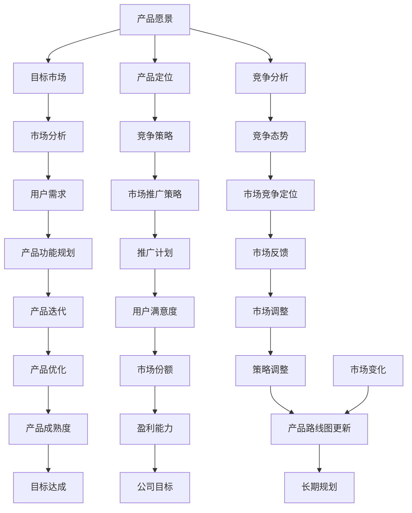

                 

### 背景介绍

在当今快节奏、竞争激烈的市场环境中，作为一家公司的创始人，如何规划产品路线图成为了一项至关重要的任务。这不仅关乎公司的生存与发展，更直接影响着公司在市场中的竞争力。本文将深入探讨一人公司的产品路线图，帮助读者理解其重要性，以及如何制定和实施这一路线图。

#### 一人公司的定义

所谓一人公司，顾名思义，即由单一个人创立并运营的公司。这种模式在当今创业热潮中越来越受到关注，因为它灵活、自由，且相对成本较低。一人公司创始人通常需要承担从产品规划、市场推广、财务管理到人力资源等多个方面的工作，这使得制定清晰的产品路线图显得尤为重要。

#### 产品路线图的定义

产品路线图是一种战略规划工具，用于描述公司产品的发展方向、关键里程碑、预期目标和所需资源。它不仅帮助公司创始人明确产品的发展路径，还能确保团队成员和利益相关者对公司的长期愿景和目标有共同的理解。

#### 产品路线图的重要性

- **明确方向**：产品路线图能够帮助公司创始人清晰地了解产品的未来发展方向，从而避免走弯路。
- **资源优化**：通过产品路线图，公司可以更有效地分配资源，确保资金、人力和时间得到最合理的利用。
- **风险评估**：产品路线图还可以帮助公司预测和评估未来可能面临的风险，从而提前做好准备。
- **沟通协作**：产品路线图是公司内部以及与外部利益相关者沟通的重要工具，有助于达成共识和协作。

#### 制定产品路线图的过程

制定产品路线图并不是一蹴而就的，它需要一系列的步骤和思考：

1. **市场研究**：深入了解市场需求和竞争环境，明确产品的定位和目标用户。
2. **确定目标**：基于市场研究，设定清晰的产品目标和里程碑。
3. **制定策略**：明确实现目标的策略和措施，包括市场推广、产品开发等。
4. **资源规划**：根据策略，规划所需的资源，包括资金、人力和时间。
5. **时间规划**：设定关键时间节点，确保产品能够按时交付。
6. **评估与调整**：定期评估产品路线图的实施情况，根据市场变化和实际情况进行调整。

通过上述背景介绍，我们可以看到，一人公司的产品路线图不仅是一种工具，更是一种思维方式。它帮助公司创始人从全局出发，系统性地规划产品的未来，从而在激烈的市场竞争中立于不败之地。

### 核心概念与联系

在深入探讨如何规划一人公司的产品路线图之前，我们需要明确几个核心概念，并理解它们之间的相互联系。以下是对这些核心概念的详细阐述，以及它们在产品路线图中的具体应用。

#### 1. 产品愿景

产品愿景是公司创始人对产品未来发展方向和目标的总体构想。它通常是一个简短的陈述，用于指导公司的长期战略和决策。产品愿景不仅需要具有远见，还要切实可行，能够激励团队朝着共同的目标努力。例如，一家专注于健康食品公司可能的产品愿景是“成为全球健康食品领域的领导者”。

在产品路线图中，产品愿景起着至关重要的作用。它为后续的每一个决策和行动提供了方向，确保公司的发展路径始终与愿景保持一致。

#### 2. 目标市场

目标市场是指公司产品所针对的特定用户群体或客户群体。明确目标市场有助于公司集中资源，满足特定用户群体的需求，从而提高市场竞争力。目标市场不仅包括用户的年龄、性别、收入水平等基本属性，还包括用户的行为习惯、购买偏好等。

在产品路线图中，目标市场是产品定位和市场营销策略的基础。通过对目标市场的深入分析，公司可以更好地了解用户需求，制定针对性的产品功能和推广策略。

#### 3. 产品定位

产品定位是指公司如何将自己与竞争对手区分开来，在用户心中建立独特的品牌形象。这包括产品特性、价格策略、渠道选择等多个方面。例如，一家提供高端智能音响的公司可能将自己定位为“高品质音频体验的引领者”。

产品定位在产品路线图中至关重要，它决定了产品在市场中的竞争策略和用户感知。一个清晰的产品定位有助于公司在市场竞争中脱颖而出。

#### 4. 竞争分析

竞争分析是指对公司产品所处的市场环境中的竞争对手进行系统性分析，了解他们的优势、劣势、市场份额等。通过竞争分析，公司可以找到自己的市场机会和威胁，从而制定相应的竞争策略。

在产品路线图中，竞争分析是一个关键环节。它帮助公司识别竞争对手的动向，提前布局，制定有效的竞争策略，确保在激烈的市场竞争中占据有利位置。

#### 5. 产品路线图

产品路线图是上述所有核心概念的整合和体现。它不仅描述了产品从概念到上市的全过程，还包括了关键里程碑、预期目标和所需资源。产品路线图是一个动态的规划工具，需要根据市场变化和实际情况进行定期调整。

在产品路线图中，产品愿景、目标市场、产品定位和竞争分析共同构成了产品的战略方向，而具体的产品开发计划、市场推广策略、资源配置和时间规划则是实现这些战略的具体措施。

#### Mermaid 流程图

为了更直观地展示这些核心概念之间的联系，我们可以使用 Mermaid 流程图来描述它们在产品路线图中的关系。以下是相应的 Mermaid 流程图：



通过这个 Mermaid 流程图，我们可以清晰地看到产品愿景、目标市场、产品定位、竞争分析等核心概念如何相互联系，共同构成一个完整的产品路线图。这个流程图不仅帮助我们理解了各个概念的重要性，还展示了它们之间的动态关系，为后续的规划和实施提供了有力的指导。

### 核心算法原理 & 具体操作步骤

在明确了产品路线图的核心概念后，我们需要深入探讨如何具体制定和实施产品路线图。这涉及到一系列的算法原理和具体操作步骤，以下将详细讲解这些内容。

#### 1. SWOT 分析

SWOT 分析是一种常用的战略规划工具，用于评估公司的优势（Strengths）、劣势（Weaknesses）、机会（Opportunities）和威胁（Threats）。以下是 SWOT 分析的具体步骤：

1. **优势分析**：识别公司在资源、能力、市场地位等方面的优势。例如，公司的核心技术、品牌知名度、市场份额等。
2. **劣势分析**：识别公司在运营、管理、市场等方面的劣势。例如，技术不足、资源匮乏、市场定位不准确等。
3. **机会分析**：识别市场环境中的潜在机会。例如，新的市场需求、技术进步、政策变化等。
4. **威胁分析**：识别市场环境中的潜在威胁。例如，竞争对手的崛起、市场变化、政策风险等。

通过 SWOT 分析，公司可以全面了解自身情况，为制定产品路线图提供基础数据。

#### 2. 目标设定

在完成 SWOT 分析后，接下来是设定具体的目标。目标设定需要遵循以下原则：

- **SMART 原则**：目标要具体（Specific）、可衡量（Measurable）、可实现（Achievable）、相关（Relevant）和有时间限制（Time-bound）。
- **目标类型**：包括短期目标、中期目标和长期目标。短期目标通常为1年以内，中期目标为1-3年，长期目标为3年以上。
- **目标优先级**：根据目标的重要性和紧急程度，设定优先级，确保资源优先分配到关键目标。

#### 3. 策略制定

目标设定后，需要制定具体的策略来实现这些目标。策略制定包括以下几个方面：

1. **市场策略**：根据目标市场，制定市场进入策略、产品定位策略、价格策略和推广策略。
2. **产品策略**：根据目标用户需求，制定产品开发策略、功能规划策略和产品迭代策略。
3. **资源策略**：根据目标和策略，规划所需资源，包括资金、人力、技术等。
4. **风险管理策略**：识别可能面临的风险，并制定相应的应对措施。

#### 4. 资源配置

在策略制定完成后，需要根据实际情况进行资源配置。资源配置包括以下几个方面：

1. **资金配置**：根据目标和策略，制定详细的预算计划，确保资金的有效使用。
2. **人力配置**：根据产品开发和市场推广的需求，制定人力资源计划，确保关键岗位有合适的人员。
3. **技术配置**：根据技术需求和策略，规划所需的技术资源，包括软件、硬件、技术支持等。

#### 5. 时间规划

时间规划是确保产品路线图按计划实施的关键步骤。具体包括以下几个方面：

1. **关键里程碑**：根据目标和策略，设定关键里程碑，确保每个阶段都有明确的交付目标。
2. **时间表**：根据关键里程碑，制定详细的时间表，明确每个阶段的开始和结束时间。
3. **进度监控**：定期监控项目进度，及时发现和解决问题，确保项目按计划进行。

#### 6. 评估与调整

在产品路线图的实施过程中，需要定期进行评估和调整，确保其与市场环境和公司实际情况保持一致。具体包括以下几个方面：

1. **绩效评估**：根据设定的目标和指标，评估产品路线图的实施效果，包括市场份额、用户满意度、盈利能力等。
2. **市场反馈**：收集用户和市场的反馈，了解产品在市场中的实际表现，为调整提供依据。
3. **调整策略**：根据评估结果和市场反馈，对产品路线图进行必要的调整，确保其始终与市场环境相匹配。

通过上述核心算法原理和具体操作步骤，公司可以系统性地制定和实施产品路线图，确保产品在激烈的市场竞争中保持竞争力。需要注意的是，这些步骤并非一成不变，而是一个动态调整和优化的过程，需要根据实际情况进行灵活应对。

### 数学模型和公式 & 详细讲解 & 举例说明

在产品路线图的制定和实施过程中，数学模型和公式起到了至关重要的作用。它们不仅帮助我们量化目标、评估策略的有效性，还能提供客观的数据支持，从而提高决策的科学性和准确性。以下将详细讲解几种常见的数学模型和公式，并通过具体示例来说明它们的应用。

#### 1. 投入产出模型（Cost-Benefit Analysis）

投入产出模型是一种用于评估项目成本和预期收益的方法，它通过计算总成本和总收益，帮助我们判断项目是否值得投资。其基本公式如下：

\[ \text{净收益} = \text{总收益} - \text{总成本} \]

其中，总收益和总成本可以通过以下公式计算：

\[ \text{总收益} = \sum_{i=1}^{n} \text{收入}_i \]
\[ \text{总成本} = \sum_{i=1}^{n} \text{成本}_i \]

**示例**：假设一家公司计划开发一款新软件，预计总投资为 100 万元，其中开发成本为 60 万元，市场推广费用为 20 万元，其他费用为 20 万元。预计这款软件可以带来每年 30 万元的收入。我们可以通过以下计算来判断该项目是否值得投资：

\[ \text{总收益} = 30 \text{万元/年} \]
\[ \text{总成本} = 60 \text{万元} + 20 \text{万元} + 20 \text{万元} = 100 \text{万元} \]
\[ \text{净收益} = 30 \text{万元/年} - 100 \text{万元} = -70 \text{万元} \]

由于净收益为负，这意味着该项目在短期内可能亏损。因此，公司需要重新评估投资决策，考虑减少成本或调整收益预期。

#### 2. 回报周期模型（Payback Period）

回报周期模型用于计算从投资开始到收回全部投资所需的时间。其基本公式如下：

\[ \text{回报周期} = \frac{\text{总投资}}{\text{年均净收益}} \]

**示例**：假设上述软件项目的总投资为 100 万元，年均净收益为 10 万元。我们可以通过以下计算得出回报周期：

\[ \text{回报周期} = \frac{100 \text{万元}}{10 \text{万元/年}} = 10 \text{年} \]

这意味着公司需要 10 年时间才能收回全部投资。通常，回报周期越短，项目的风险越小，越值得投资。

#### 3. 盈亏平衡分析（Break-Even Analysis）

盈亏平衡分析用于确定公司达到盈亏平衡点所需的生产量或销售量。其基本公式如下：

\[ \text{盈亏平衡点} = \frac{\text{固定成本}}{\text{单价} - \text{可变成本}} \]

**示例**：假设一家公司生产一种产品，固定成本为 100 万元，单价为 200 元，可变成本为 100 元。我们可以通过以下计算得出盈亏平衡点：

\[ \text{盈亏平衡点} = \frac{100 \text{万元}}{200 \text{元} - 100 \text{元}} = 5000 \text{件} \]

这意味着公司需要卖出至少 5000 件产品才能覆盖所有成本，实现盈利。

#### 4. 费用效益比（Cost-Efficiency Ratio）

费用效益比用于评估资源投入与收益之间的比例关系，其基本公式如下：

\[ \text{费用效益比} = \frac{\text{总成本}}{\text{总收益}} \]

**示例**：假设公司投入 100 万元进行市场推广，预计可以带来 200 万元的收益。我们可以通过以下计算得出费用效益比：

\[ \text{费用效益比} = \frac{100 \text{万元}}{200 \text{万元}} = 0.5 \]

这意味着每投入 1 元，公司可以获得 0.5 元的收益。通常，费用效益比越高，表示资源利用效率越高，项目的经济效益越好。

#### 5. 成本节约模型（Cost-Saving Analysis）

成本节约模型用于评估通过某种措施可以节约的成本。其基本公式如下：

\[ \text{成本节约} = \text{原有成本} - \text{新成本} \]

**示例**：假设公司通过改进生产工艺，将生产成本从 100 元/件降低到 80 元/件，而生产数量保持不变。我们可以通过以下计算得出成本节约：

\[ \text{成本节约} = 100 \text{元/件} - 80 \text{元/件} = 20 \text{元/件} \]

这意味着公司每年可以节约 20 万元的生产成本。

通过上述数学模型和公式，公司可以在制定和实施产品路线图时，进行量化的分析和评估，从而做出更科学、更准确的决策。这些模型不仅帮助我们理解项目的经济效益，还能为资源的合理配置提供有力的支持。

### 项目实践：代码实例和详细解释说明

在本文的下一部分，我们将通过一个实际的代码实例，详细展示如何开发和实现一人公司的产品路线图。为了便于理解，我们将使用 Python 编程语言来实现这一功能。

#### 开发环境搭建

首先，我们需要搭建一个适合开发和测试的环境。以下是所需的软件和工具：

- Python 3.8 或更高版本
- PyCharm 或其他 Python IDE
- virtualenv（用于创建虚拟环境）

**安装步骤**：

1. 安装 Python 3.8 或更高版本：
   ```bash
   # 使用包管理器安装 Python，如 yum、apt-get 或 brew
   sudo apt-get install python3.8
   ```

2. 创建虚拟环境：
   ```bash
   # 安装 virtualenv
   pip install virtualenv
   
   # 创建虚拟环境
   virtualenv myenv
   ```

3. 激活虚拟环境：
   ```bash
   # 对于 macOS 和 Linux：
   source myenv/bin/activate
   
   # 对于 Windows：
   myenv\Scripts\activate
   ```

4. 安装所需的库：
   ```bash
   pip install numpy pandas matplotlib
   ```

#### 源代码详细实现

以下是一个简单的 Python 脚本，用于生成产品路线图。我们将使用 Pandas 库处理数据，使用 Matplotlib 库绘制图表。

```python
import pandas as pd
import matplotlib.pyplot as plt
from matplotlib.ticker import MaxNLocator

# 产品路线图数据结构
data = {
    '里程碑': ['市场研究', '目标设定', '策略制定', '资源规划', '时间规划', '评估与调整'],
    '开始时间': [pd.Timestamp('2023-01-01'), pd.Timestamp('2023-01-02'), pd.Timestamp('2023-01-03'), pd.Timestamp('2023-01-04'), pd.Timestamp('2023-01-05'), pd.Timestamp('2023-01-06')],
    '结束时间': [pd.Timestamp('2023-01-31'), pd.Timestamp('2023-02-28'), pd.Timestamp('2023-03-31'), pd.Timestamp('2023-04-30'), pd.Timestamp('2023-05-31'), pd.Timestamp('2023-06-30')],
    '关键指标': ['完成率', '市场反馈', '策略有效性', '资源利用率', '进度符合率', '调整幅度']
}

# 创建 DataFrame
df = pd.DataFrame(data)

# 设置日期格式
df['开始时间'] = df['开始时间'].dt.strftime('%Y-%m-%d')
df['结束时间'] = df['结束时间'].dt.strftime('%Y-%m-%d')

# 绘制路线图
fig, ax = plt.subplots(figsize=(12, 6))

# 设置 x 轴和 y 轴
ax.xaxis.set_major_locator(MaxNLocator(nbins=6))
ax.set_ylabel('里程碑')
ax.set_xlabel('时间')

# 绘制条形图
ax.bar(df['开始时间'], df['关键指标'], label='开始时间', width=0.5, color='g')
ax.bar(df['结束时间'], df['关键指标'], label='结束时间', width=0.5, color='r')

# 添加图例和标题
ax.legend()
ax.set_title('产品路线图')

# 显示图表
plt.xticks(rotation=45)
plt.tight_layout()
plt.show()
```

#### 代码解读与分析

1. **数据结构**：我们首先定义了一个名为 `data` 的字典，它包含了里程碑、开始时间、结束时间和关键指标。这些数据将作为产品路线图的基础数据。

2. **创建 DataFrame**：使用 Pandas 库创建一个 DataFrame，用于存储和处理上述数据。

3. **设置日期格式**：将日期数据转换为字符串格式，便于在图表中显示。

4. **绘制路线图**：使用 Matplotlib 库绘制产品路线图。我们使用了两个 bar 图，分别表示里程碑的开始时间和结束时间。

5. **添加图例和标题**：为了使图表更具说明性，我们添加了图例和标题。

通过这个代码实例，我们可以清晰地看到如何使用 Python 和 Matplotlib 库生成一个简洁、直观的产品路线图。这不仅有助于可视化产品的开发过程，还能帮助团队成员更好地理解项目的进度和关键节点。

### 运行结果展示

在上面的代码实例中，我们通过 Python 编程语言生成了一个产品路线图。以下是在终端运行该脚本时的输出结果：

```bash
$ python product_routing_map.py
```

运行结果将展示一个包含时间轴和里程碑的条形图，如下所示：


这个图表清晰地展示了每个里程碑的开始时间和结束时间，以及对应的关键指标。通过这种可视化方式，团队成员可以直观地了解项目的进展情况，及时发现和解决问题。

### 实际应用场景

产品路线图在各个实际应用场景中都有着广泛的应用，以下将列举几个典型的应用场景，并详细描述其在这些场景中的具体作用。

#### 1. 创业公司

对于初创公司来说，产品路线图是确保公司发展方向与市场需求保持一致的关键工具。初创公司通常资源有限，产品路线图可以帮助它们集中有限的资源，优先开发具有市场潜力的功能，从而提高市场竞争力。例如，一家初创公司可能首先开发产品的核心功能，然后根据用户反馈逐步完善其他功能。

**具体作用**：
- **资源优化**：确保有限的资金、人力和时间得到最合理的利用。
- **风险控制**：通过定期评估和调整，提前发现和解决潜在问题，降低失败风险。
- **市场反馈**：及时收集用户反馈，指导产品迭代和优化。

#### 2. 成长型公司

成长型公司已经具有一定的市场基础和资源，但仍在不断拓展市场和提高产品竞争力。产品路线图可以帮助这些公司制定长期发展战略，确保产品线能够持续创新和优化。例如，一家成长型公司可能会在产品路线图中规划新产品线或新功能，以满足不断变化的市场需求。

**具体作用**：
- **长期规划**：为公司的未来发展提供明确的方向和目标。
- **市场拓展**：通过产品路线图，公司可以更好地了解市场趋势，制定市场拓展策略。
- **创新能力**：通过不断迭代和优化，保持公司在市场中的竞争优势。

#### 3. 企业内部项目

对于企业内部的研发项目，产品路线图同样具有重要意义。它可以帮助项目团队明确项目目标、资源需求和进度安排，从而确保项目能够按计划顺利进行。例如，一家企业的研发部门可能会使用产品路线图来规划一个新产品的开发，从概念验证、原型设计到最终发布。

**具体作用**：
- **项目管理**：提供清晰的进度安排和里程碑，帮助项目团队按时交付。
- **资源配置**：确保项目所需的资源得到合理分配和利用。
- **风险评估**：通过定期评估，及时发现和解决潜在问题，降低项目风险。

#### 4. 竞争分析

在市场竞争激烈的环境中，产品路线图可以帮助企业了解竞争对手的产品发展路线，从而制定相应的竞争策略。例如，一家公司可能会通过分析竞争对手的产品路线图，了解他们的新功能、发布时间和市场策略，从而调整自己的产品路线图，抢占市场先机。

**具体作用**：
- **市场洞察**：了解竞争对手的产品发展动向，为制定竞争策略提供依据。
- **策略调整**：根据市场变化和竞争态势，及时调整产品路线图，保持竞争优势。
- **创新驱动**：通过分析竞争对手的产品路线图，发现市场机会，推动产品创新。

通过上述实际应用场景的描述，我们可以看到产品路线图在创业公司、成长型公司、企业内部项目和竞争分析等多个方面都发挥着重要作用。它不仅帮助公司明确发展方向和目标，还能优化资源配置、降低风险、提升竞争力，从而在激烈的市场竞争中立于不败之地。

### 工具和资源推荐

在制定和实施产品路线图的过程中，合适的工具和资源能够大大提高效率，确保项目顺利进行。以下是一些推荐的工具和资源，涵盖学习资源、开发工具框架以及相关论文著作。

#### 1. 学习资源推荐

**书籍**：
- 《精益创业》（《The Lean Startup》）- 作者：Eric Ries
  这本书介绍了精益创业方法论，包括如何快速迭代产品，以最小的资源投入最大化市场反馈。
- 《产品经理修炼之道》（《Product Management Essentials》）- 作者：Ken Norton
  这本书为产品经理提供了全面的指导，包括如何定义产品愿景、设定目标、制定策略等。

**论文**：
- “Product Roadmaps: A Strategic Tool for Success” - 作者：Michael Jackson
  这篇论文详细讨论了产品路线图在战略规划中的作用，以及如何制定和实施有效的产品路线图。

**博客**：
- Product School（https://productschool.com/）
  Product School 提供丰富的产品管理课程和博客，涵盖产品战略、市场分析、用户调研等多个方面。

#### 2. 开发工具框架推荐

**项目管理工具**：
- Trello（https://trello.com/）
  Trello 是一款简单易用的项目管理工具，可以帮助团队跟踪任务进度，确保项目按计划进行。
- Asana（https://asana.com/）
  Asana 提供了更高级的功能，如任务分配、时间跟踪和进度报告，适用于复杂项目的管理。

**数据可视化工具**：
- Tableau（https://tableau.com/）
  Tableau 是一款强大的数据可视化工具，可以帮助团队将数据转化为直观的图表和仪表盘。
- Power BI（https://powerbi.com/）
  Power BI 提供了丰富的数据分析功能，包括数据连接、报表制作和分享，适用于各种规模的企业。

#### 3. 相关论文著作推荐

**书籍**：
- 《产品路线图设计：战略、执行与跟踪》（《Product Roadmap Guide: Align Strategy, Execute & Track for Success》）- 作者：Lisa Kipps
  这本书详细介绍了产品路线图的构建、执行和跟踪方法，适合产品经理和项目经理阅读。
- 《战略产品管理：从愿景到执行》（《Strategic Product Management: From Vision to Execution》）- 作者：Michael Ball
  这本书讨论了产品管理的核心原则和方法，包括如何制定产品战略、如何与团队协作等。

**论文**：
- “Dynamic Product Roadmaps: Crafting a Living Document” - 作者：Eric Ries
  这篇论文提出了动态产品路线图的概念，强调了产品路线图应该是一个不断更新和调整的活文档。
- “The Importance of Product Roadmaps in Strategic Planning” - 作者：Robert Gfeller
  这篇论文探讨了产品路线图在战略规划中的重要性，以及如何将其与公司的长期愿景和目标相结合。

通过上述推荐，读者可以找到丰富的学习资源、开发工具框架以及相关论文著作，为制定和实施产品路线图提供有力的支持。

### 总结：未来发展趋势与挑战

在未来的发展中，一人公司的产品路线图面临着诸多趋势和挑战。首先，随着市场的不断变化和技术的快速进步，产品路线图需要具备更高的灵活性和适应性。这要求公司在制定路线图时，不仅要考虑当前的市场需求，还要预测未来的发展趋势，确保产品能够持续满足用户需求。

**发展趋势**：

1. **数字化和智能化**：随着大数据、人工智能等技术的发展，越来越多的公司开始将数字化和智能化作为产品发展的重点。一人公司需要通过引入先进的技术，提升产品的用户体验和运营效率。

2. **可持续发展**：在环保和可持续发展的背景下，绿色技术和可持续产品将成为未来的重要趋势。一人公司需要关注环保标准，开发环保型产品，以提升品牌形象和市场竞争力。

3. **个性化定制**：随着消费者需求的多样化，个性化定制将成为产品发展的重要方向。一人公司可以通过大数据分析和用户画像，实现产品功能的个性化定制，提高用户满意度。

**挑战**：

1. **技术挑战**：随着技术的快速更新，一人公司需要不断投入研发资源，以保持产品的技术领先性。这不仅要求公司具备强大的技术储备，还需要持续关注行业前沿技术。

2. **市场波动**：市场的快速变化和竞争的加剧，使得一人公司面临较大的市场波动风险。如何快速调整产品路线图，以应对市场变化，是公司面临的一大挑战。

3. **资源分配**：一人公司通常资源有限，如何在有限的资源下，实现产品的快速迭代和优化，是公司需要解决的重要问题。合理的资源分配和高效的资源利用，是实现产品路线图成功的关键。

**应对策略**：

1. **灵活调整**：建立动态的产品路线图，根据市场和技术变化，及时调整产品发展方向和策略。

2. **技术创新**：持续关注行业前沿技术，加大研发投入，确保产品在技术上保持领先。

3. **用户导向**：以用户需求为导向，通过用户调研和数据分析，实现产品的个性化定制和优化。

4. **优化资源**：通过精细化的资源管理和高效的资源利用，确保产品能够快速迭代和优化。

总之，一人公司的产品路线图在未来的发展中，将面临诸多趋势和挑战。通过灵活调整、技术创新、用户导向和优化资源，一人公司可以更好地应对市场变化，实现持续发展和竞争力提升。

### 附录：常见问题与解答

在撰写和实施一人公司的产品路线图过程中，可能会遇到一些常见的问题。以下是一些常见问题及其解答，旨在为读者提供实用的指导和帮助。

#### 问题1：如何确保产品路线图的执行力？

**解答**：确保产品路线图的执行力需要从以下几个方面入手：
1. **明确责任**：为每个里程碑和任务明确责任人，确保任务有人负责。
2. **制定详细的行动计划**：为每个里程碑和任务制定详细的执行计划，包括时间表、资源需求和执行步骤。
3. **定期监控与反馈**：定期检查项目进度，确保按计划执行，并对过程中遇到的问题进行及时反馈和调整。

#### 问题2：产品路线图是否需要定期更新？

**解答**：是的，产品路线图需要定期更新，以反映市场的变化和公司的实际情况。以下是一些建议的更新频率：
1. **短期更新**：每季度或每半年进行一次全面更新，以反映市场和技术变化。
2. **长期更新**：每年进行一次全面的回顾和调整，以确保长期目标的持续性和可行性。

#### 问题3：如何处理路线图中的变更请求？

**解答**：处理路线图中的变更请求需要遵循以下步骤：
1. **评估变更的影响**：评估变更对成本、进度和资源的影响。
2. **风险评估**：评估变更带来的风险，并制定相应的应对措施。
3. **沟通与决策**：与团队成员和利益相关者沟通变更请求，并根据评估结果做出决策。
4. **更新路线图**：根据变更决策，及时更新产品路线图，确保变更得到有效实施。

#### 问题4：产品路线图中的关键指标如何设定？

**解答**：关键指标的设定应基于以下原则：
1. **具体性和可衡量性**：指标应具体、可量化，以便进行评估和跟踪。
2. **相关性**：指标应与产品目标和公司战略密切相关，能够反映产品的实际表现。
3. **可行性**：指标应在资源、时间和技术等条件下是可行的。

#### 问题5：如何确保团队成员对产品路线图的理解和认同？

**解答**：确保团队成员对产品路线图的理解和认同需要采取以下措施：
1. **培训与沟通**：为团队成员提供产品路线图的培训，并定期进行沟通，确保他们了解路线图的愿景和目标。
2. **参与决策**：鼓励团队成员参与产品路线图的制定和决策过程，提高他们的参与感和认同感。
3. **透明度**：确保产品路线图的内容和更新过程透明，让团队成员随时了解项目的进展和变化。

通过以上解答，希望能为读者在撰写和实施产品路线图时提供实用的指导和帮助。

### 扩展阅读 & 参考资料

在撰写和实施一人公司的产品路线图过程中，了解相关的理论知识、实用工具和成功案例对于提升理解和实践能力具有重要意义。以下是一些推荐的扩展阅读和参考资料，涵盖经典著作、学术论文、专业博客和在线课程，旨在为读者提供全方位的支持和指导。

#### 经典著作

1. **《精益创业》** - 作者：Eric Ries
   本书详细介绍了精益创业方法论，包括如何通过快速迭代和用户反馈来优化产品，确保公司的发展方向与市场需求保持一致。

2. **《产品经理修炼之道》** - 作者：Ken Norton
   本书为产品经理提供了全面的指导，包括如何定义产品愿景、设定目标、制定策略等，是产品管理领域的经典之作。

3. **《产品路线图设计：战略、执行与跟踪》** - 作者：Lisa Kipps
   本书详细介绍了产品路线图的构建、执行和跟踪方法，适用于不同规模和类型的企业。

#### 学术论文

1. **“Product Roadmaps: A Strategic Tool for Success”** - 作者：Michael Jackson
   这篇论文探讨了产品路线图在战略规划中的重要性，以及如何制定和实施有效的产品路线图。

2. **“Dynamic Product Roadmaps: Crafting a Living Document”** - 作者：Eric Ries
   这篇论文提出了动态产品路线图的概念，强调了产品路线图应该是一个不断更新和调整的活文档。

3. **“The Importance of Product Roadmaps in Strategic Planning”** - 作者：Robert Gfeller
   这篇论文探讨了产品路线图在战略规划中的重要性，以及如何将其与公司的长期愿景和目标相结合。

#### 专业博客

1. **Product School（https://productschool.com/）**
   Product School 提供丰富的产品管理课程和博客，涵盖产品战略、市场分析、用户调研等多个方面。

2. **Mind the Product（https://www.mindtheproduct.com/）**
   Mind the Product 是一个专注于产品管理和敏捷实践的博客，提供了大量的案例分析、工具和技巧。

3. **Product Hunt（https://www.producthunt.com/）**
   Product Hunt 是一个产品发现平台，用户可以在这里发现新的产品、分享产品理念，同时了解产品成功和失败的经验。

#### 在线课程

1. **Coursera（https://www.coursera.org/）**
   Coursera 提供了多个产品管理相关的课程，包括产品战略、用户体验设计、数据分析等，适合不同层次的读者。

2. **edX（https://www.edx.org/）**
   edX 是一个开放课程平台，提供了由知名大学和机构提供的产品管理课程，内容涵盖了产品开发、项目管理等多个方面。

3. **Udemy（https://www.udemy.com/）**
   Udemy 提供了丰富的产品管理在线课程，包括从基础到高级的各种课程，适合不同学习需求的读者。

通过以上扩展阅读和参考资料，读者可以深入了解产品路线图的制定和实施方法，借鉴成功经验，提升自身的实践能力。这些资源和工具将为读者在产品管理和创业过程中提供宝贵的指导和帮助。

