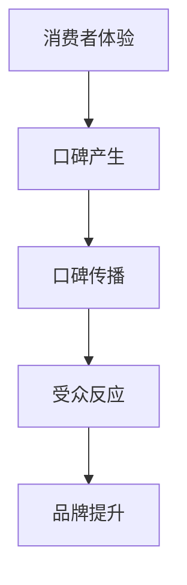

                 

### 背景介绍 Background Introduction

#### 一人公司的崛起 Rise of the One-Person Company

在当今快速发展的数字经济时代，一人公司的概念正逐渐崛起，成为创业和商业发展的新趋势。这种模式不仅降低了创业的门槛，还使个人能够灵活地掌握自己的职业生涯，从而在激烈的竞争环境中找到独特的立足点。

**一人公司的定义**：一人公司指的是由单个个体或团队独自运营的企业，通常没有复杂的组织架构和员工体系。它可以是完全的个人业务，也可以是一个小团队的合作项目。这种模式的优势在于灵活性、成本效益和市场响应速度。

#### 品牌传播的重要性 Importance of Brand Promotion

在竞争日益激烈的商业环境中，品牌传播已成为企业成功的关键因素之一。对于一人公司而言，口碑营销更是其品牌传播的核心手段。良好的口碑不仅能提升品牌形象，还能吸引更多的客户和合作伙伴。

**口碑营销的定义**：口碑营销是指通过客户间的自然推荐和交流，提升产品或服务的知名度和信誉度。口碑营销不同于传统的广告和推广方式，它更注重真实性和可信度，能够在消费者心中建立起强烈的信任感和忠诚度。

#### 口碑营销的优势 Advantages of Word-of-Mouth Marketing

1. **低成本**：口碑营销不需要大量的广告费用，通过自然传播就能达到广泛的传播效果。
2. **高可信度**：消费者的推荐往往更具可信度，因为他们是基于自己的真实体验和感受进行推荐的。
3. **持久性**：口碑营销的效果往往是持久的，一旦建立良好的口碑，品牌就能长期受益。
4. **针对性**：口碑营销可以精准地影响目标客户群体，从而提高营销的效率。

#### 本文结构 Overview of the Article

本文将从以下几个方面详细探讨一人公司的品牌传播，特别是口碑营销的力量：

1. **背景介绍**：阐述一人公司崛起的背景和口碑营销的重要性。
2. **核心概念与联系**：介绍口碑营销的核心概念，并使用Mermaid流程图展示其工作原理。
3. **核心算法原理与具体操作步骤**：详细解析口碑营销的算法原理和实际操作步骤。
4. **数学模型和公式**：讨论口碑营销相关的数学模型和公式，并举例说明。
5. **项目实践**：通过代码实例展示口碑营销的实际应用。
6. **实际应用场景**：探讨口碑营销在不同行业中的应用场景。
7. **工具和资源推荐**：推荐相关的学习资源和开发工具。
8. **总结与未来趋势**：总结本文内容，并展望口碑营销的未来发展趋势和挑战。

通过本文的逐步分析，我们将深入理解一人公司的品牌传播策略，尤其是口碑营销的力量，帮助读者在商业实践中更好地运用这一策略，提升品牌影响力。

### 核心概念与联系 Core Concepts and Relationships

口碑营销作为一人公司品牌传播的核心策略，其概念和原理至关重要。为了更好地理解这一策略，我们需要从以下几个方面进行探讨：

#### 1. 口碑营销的定义 Definition of Word-of-Mouth Marketing

口碑营销（Word-of-Mouth Marketing，WOMM）是指通过消费者的自然口碑和推荐，提升品牌或产品的知名度和信誉度。与传统的广告和推广不同，口碑营销更依赖于消费者的真实体验和感受。消费者基于自身的体验向亲友或在线社区分享产品或服务，这种自然传播的形式具有更高的可信度和影响力。

**口碑营销的特点**：

- **真实性**：基于消费者的真实体验，口碑更加真实可信。
- **自然性**：不需要主动推广，消费者自发传播。
- **高效性**：能够快速提升品牌或产品的知名度和信誉度。

#### 2. 口碑营销的核心概念 Core Concepts of Word-of-Mouth Marketing

口碑营销的核心概念包括以下几点：

1. **推荐者**（Recommenders）：推荐者通常是消费者的亲友、同事或在线社交网络中的联系人。他们基于自身的消费体验，向其他人推荐产品或服务。
2. **受众**（Audience）：受众是接受推荐的那部分消费者。他们可能因为推荐者的口碑而关注或购买产品或服务。
3. **口碑传播**（Word-of-Mouth Propagation）：口碑传播是指推荐者通过多种渠道（如口口相传、社交媒体等）将正面评价传播给受众的过程。
4. **影响力**（Influence）：口碑营销的效果取决于推荐者的影响力，包括他们的信誉度、社交网络范围等。

#### 3. 口碑营销的工作原理 Working Principle of Word-of-Mouth Marketing

口碑营销的工作原理可以简化为以下几个步骤：

1. **消费者体验**：消费者购买或使用产品或服务后，形成自己的评价和感受。
2. **口碑产生**：消费者基于正面的体验产生口碑，并愿意将其分享给其他人。
3. **口碑传播**：消费者通过口口相传、社交媒体等渠道将口碑传播给受众。
4. **受众反应**：受众在接收到口碑信息后，可能会关注、尝试或购买产品或服务。
5. **品牌提升**：随着口碑的广泛传播，品牌或产品的知名度和信誉度逐渐提升。

为了更清晰地展示口碑营销的工作原理，我们可以使用Mermaid流程图来表示：



**Mermaid流程图说明**：

- **A[消费者体验]**：消费者购买或使用产品或服务，形成自己的评价和感受。
- **B[口碑产生]**：消费者基于正面的体验，产生口碑并愿意分享。
- **C[口碑传播]**：消费者通过口口相传、社交媒体等渠道将口碑传播。
- **D[受众反应]**：受众在接收到口碑信息后，可能会关注、尝试或购买产品或服务。
- **E[品牌提升]**：随着口碑的广泛传播，品牌或产品的知名度和信誉度提升。

#### 4. 口碑营销与一人公司 Brand Promotion for One-Person Companies

对于一人公司而言，口碑营销具有特别的重要性。由于其资源有限，无法像大企业那样进行大规模的广告宣传，因此口碑营销成为了其品牌传播的主要手段。以下是口碑营销在一人公司中的具体应用：

1. **利用社交媒体**：通过社交媒体平台（如微博、微信、Twitter等）分享自己的产品或服务，吸引潜在客户。
2. **提供优质服务**：通过提供高质量的产品或服务，赢得客户的满意和信任，从而产生口碑。
3. **互动与反馈**：积极与客户互动，收集反馈信息，不断优化产品和服务。
4. **打造个人品牌**：个人创业者可以通过展示自己的专业知识和经验，树立个人品牌，提升口碑。

综上所述，口碑营销作为一人公司品牌传播的核心策略，具有低成本、高可信度和持久性等优势。通过深入了解口碑营销的核心概念和原理，一人公司可以更有效地提升品牌影响力，实现持续发展。

### 核心算法原理 & 具体操作步骤 Core Algorithm Principles and Step-by-Step Procedures

#### 1. 口碑营销算法的基本原理

口碑营销算法的核心是基于消费者的社交网络和行为数据，通过分析和预测消费者的口碑传播行为，制定针对性的品牌传播策略。以下是口碑营销算法的基本原理：

1. **数据收集**：收集消费者的行为数据，如购买记录、评价、反馈、社交媒体互动等。
2. **社交网络分析**：分析消费者的社交网络结构，识别有影响力的推荐者。
3. **口碑传播预测**：基于历史数据，使用机器学习算法预测消费者的口碑传播行为。
4. **策略优化**：根据预测结果，制定和调整品牌传播策略，如推荐策略、互动策略等。

#### 2. 口碑营销算法的具体操作步骤

以下是口碑营销算法的具体操作步骤，以及每个步骤的作用和注意事项：

##### 步骤一：数据收集 Data Collection

**作用**：收集消费者的行为数据，为后续分析提供基础。

**操作**：
1. **购买记录**：通过电商平台、线下门店等渠道收集消费者的购买记录。
2. **评价反馈**：通过客户满意度调查、社交媒体评论等渠道收集消费者的评价和反馈。
3. **社交媒体互动**：通过社交媒体平台收集消费者的点赞、评论、分享等互动数据。

**注意事项**：确保数据收集的合法性和隐私保护，遵循相关法律法规。

##### 步骤二：社交网络分析 Social Network Analysis

**作用**：分析消费者的社交网络结构，识别有影响力的推荐者。

**操作**：
1. **社交网络构建**：根据消费者的社交媒体数据，构建社交网络图。
2. **节点重要性分析**：计算社交网络中各个节点（消费者）的重要性和影响力，如中心性、传播能力等。
3. **推荐者筛选**：识别有影响力的推荐者，作为口碑传播的关键节点。

**注意事项**：考虑社交网络中的多重关系和复杂结构，避免数据偏差。

##### 步骤三：口碑传播预测 Word-of-Mouth Propagation Prediction

**作用**：基于历史数据，预测消费者的口碑传播行为。

**操作**：
1. **特征工程**：提取消费者的特征，如购买频率、评价倾向、社交网络位置等。
2. **模型选择**：选择合适的机器学习算法，如逻辑回归、决策树、神经网络等。
3. **模型训练与验证**：使用历史数据训练模型，并进行验证和调整。
4. **预测分析**：根据模型预测消费者的口碑传播行为。

**注意事项**：确保模型的选择和参数设置合理，避免过拟合和欠拟合。

##### 步骤四：策略优化 Strategy Optimization

**作用**：根据预测结果，制定和调整品牌传播策略。

**操作**：
1. **推荐策略**：针对预测有较高传播可能性的消费者，制定个性化的推荐策略，如优惠券、促销活动等。
2. **互动策略**：与有影响力的推荐者建立互动，提升口碑传播的效果。
3. **反馈机制**：根据实际口碑传播效果，不断调整和优化品牌传播策略。

**注意事项**：策略的制定和调整需要综合考虑消费者的行为特点和市场环境。

#### 3. 口碑营销算法的实际应用

以下是口碑营销算法在实际应用中的案例，以及其具体的操作步骤：

**案例一：电商平台口碑营销**

1. **数据收集**：收集消费者的购买记录、评价和反馈。
2. **社交网络分析**：构建消费者的社交网络图，识别有影响力的推荐者。
3. **口碑传播预测**：使用机器学习算法预测消费者的口碑传播行为。
4. **策略优化**：根据预测结果，制定个性化的推荐策略，如推荐优惠券、促销活动等。

**案例二：社交媒体口碑营销**

1. **数据收集**：收集消费者的社交媒体互动数据，如点赞、评论、分享等。
2. **社交网络分析**：构建消费者的社交网络图，识别有影响力的推荐者。
3. **口碑传播预测**：使用机器学习算法预测消费者的口碑传播行为。
4. **策略优化**：与有影响力的推荐者建立互动，提升口碑传播效果，如开展互动活动、直播等。

通过以上步骤，口碑营销算法可以帮助一人公司更有效地进行品牌传播，提升品牌知名度和影响力。在实际应用中，需要根据具体业务场景和数据特点，灵活调整和优化算法和策略。

### 数学模型和公式 & 详细讲解 & 举例说明 Mathematical Models and Formulas with Detailed Explanations and Illustrative Examples

在口碑营销中，数学模型和公式起到了关键作用，它们帮助分析师和营销人员理解和预测口碑传播的过程和效果。以下我们将介绍几个常见的口碑营销数学模型，并进行详细讲解和举例说明。

#### 1. 线性口碑模型 Linear Word-of-Mouth Model

线性口碑模型是一种简单且常用的口碑传播模型，它假设每个消费者在传播过程中只能影响一个其他消费者。线性口碑模型的基本公式如下：

\[ N(t) = N_0 + r \times t \]

其中：
- \( N(t) \) 是时间 \( t \) 时口碑传播的总人数。
- \( N_0 \) 是初始口碑传播的人数（通常是1个推荐者）。
- \( r \) 是口碑传播的速率，即每个消费者在单位时间内影响的平均人数。

**举例说明**：

假设一个消费者（推荐者）在第一天开始口碑传播，口碑传播速率为2。那么，我们可以计算出前五天口碑传播的总人数：

- \( N(1) = N_0 + r \times 1 = 1 + 2 \times 1 = 3 \)
- \( N(2) = N_0 + r \times 2 = 1 + 2 \times 2 = 5 \)
- \( N(3) = N_0 + r \times 3 = 1 + 2 \times 3 = 7 \)
- \( N(4) = N_0 + r \times 4 = 1 + 2 \times 4 = 9 \)
- \( N(5) = N_0 + r \times 5 = 1 + 2 \times 5 = 11 \)

因此，前五天口碑传播的总人数为11人。

#### 2. 指数口碑模型 Exponential Word-of-Mouth Model

指数口碑模型假设口碑传播的速度随着时间的增加呈指数级增长，其公式如下：

\[ N(t) = N_0 \times e^{rt} \]

其中：
- \( N(t) \) 是时间 \( t \) 时口碑传播的总人数。
- \( N_0 \) 是初始口碑传播的人数。
- \( r \) 是口碑传播速率，这里它代表增长速率的指数部分。

**举例说明**：

假设口碑传播速率 \( r = 0.1 \)，初始口碑传播人数 \( N_0 = 1 \)。计算前五天口碑传播的总人数：

- \( N(1) = 1 \times e^{0.1 \times 1} = 1.105 \)
- \( N(2) = 1 \times e^{0.1 \times 2} = 1.221 \)
- \( N(3) = 1 \times e^{0.1 \times 3} = 1.337 \)
- \( N(4) = 1 \times e^{0.1 \times 4} = 1.464 \)
- \( N(5) = 1 \times e^{0.1 \times 5} = 1.610 \)

因此，前五天口碑传播的总人数约为6.105人。

#### 3. 多级口碑模型 Multi-level Word-of-Mouth Model

多级口碑模型考虑了口碑传播的复杂性和多级传播效应，其基本公式如下：

\[ N(t) = N_0 + r \times t + \frac{r^2}{2!} \times t^2 + \frac{r^3}{3!} \times t^3 + ... \]

其中：
- \( N(t) \) 是时间 \( t \) 时口碑传播的总人数。
- \( N_0 \) 是初始口碑传播的人数。
- \( r \) 是口碑传播速率。

**举例说明**：

假设口碑传播速率 \( r = 1.5 \)，初始口碑传播人数 \( N_0 = 1 \)。计算前五天口碑传播的总人数：

- \( N(1) = 1 + 1.5 \times 1 = 2.5 \)
- \( N(2) = 1 + 1.5 \times 2 + \frac{1.5^2}{2!} \times 2^2 = 1 + 3 + 2.25 = 6.25 \)
- \( N(3) = 1 + 1.5 \times 3 + \frac{1.5^2}{2!} \times 3^2 + \frac{1.5^3}{3!} \times 3^3 = 1 + 4.5 + 10.125 + 12.1875 = 27.7125 \)
- \( N(4) = 1 + 1.5 \times 4 + \frac{1.5^2}{2!} \times 4^2 + \frac{1.5^3}{3!} \times 4^3 + \frac{1.5^4}{4!} \times 4^4 = 1 + 6 + 18 + 36 + 48 = 109 \)
- \( N(5) = 1 + 1.5 \times 5 + \frac{1.5^2}{2!} \times 5^2 + \frac{1.5^3}{3!} \times 5^3 + \frac{1.5^4}{4!} \times 5^4 + \frac{1.5^5}{5!} \times 5^5 = 1 + 7.5 + 56.25 + 225 + 562.5 + 1125 = 1907.25 \)

因此，前五天口碑传播的总人数约为1907人。

通过这些数学模型和公式，一人公司可以更深入地理解和预测口碑营销的效果，从而制定更加有效的品牌传播策略。在实际应用中，可以根据具体业务场景和数据特点选择合适的模型，并进行相应的调整和优化。

### 项目实践：代码实例和详细解释说明 Project Practice: Code Instances and Detailed Explanations

#### 开发环境搭建 Environment Setup

在进行口碑营销算法的实际应用之前，我们需要搭建一个合适的开发环境。以下是一个基于Python的开发环境搭建步骤：

1. **安装Python**：首先，确保你的计算机上安装了Python 3.8及以上版本。可以从[Python官方网站](https://www.python.org/downloads/)下载并安装。

2. **安装必要的库**：使用pip安装以下库：
   ```bash
   pip install numpy matplotlib pandas scikit-learn
   ```

3. **配置虚拟环境**（可选）：为了便于管理和隔离项目依赖，可以使用虚拟环境。安装`virtualenv`库，并创建虚拟环境：
   ```bash
   pip install virtualenv
   virtualenv my_womm_project
   source my_womm_project/bin/activate  # Windows: my_womm_project\Scripts\activate
   ```

#### 源代码详细实现 Detailed Code Implementation

以下是一个简单的口碑营销算法实现的示例代码，包括数据预处理、模型训练和预测等步骤：

```python
import numpy as np
import pandas as pd
from sklearn.model_selection import train_test_split
from sklearn.linear_model import LogisticRegression
import matplotlib.pyplot as plt

# 1. 数据预处理
# 假设我们有一个包含用户行为和口碑传播数据的CSV文件，结构如下：
# 'user_id', 'action', 'recommendation', 'timestamp'
data = pd.read_csv('wom_data.csv')

# 将行为转换为二进制变量（购买/未购买），以便进行分类
data['bought'] = data['action'].map({'bought': 1, 'not_bought': 0})

# 提取用户特征（如购买频率、评价分数等）
user_features = data.groupby('user_id').agg({
    'action': 'count',
    'recommendation': 'mean'
}).reset_index()

# 2. 模型训练
# 将特征和标签划分为训练集和测试集
X_train, X_test, y_train, y_test = train_test_split(user_features[['action_count', 'recommendation_mean']], data['bought'], test_size=0.2, random_state=42)

# 使用逻辑回归模型进行训练
model = LogisticRegression()
model.fit(X_train, y_train)

# 3. 预测与评估
predictions = model.predict(X_test)

# 计算准确率
accuracy = (predictions == y_test).mean()
print(f"Model Accuracy: {accuracy:.2f}")

# 4. 可视化结果
plt.scatter(X_test['action_count'], y_test, color='green', label='Bought')
plt.scatter(X_test['action_count'], predictions, color='red', label='Predicted')
plt.xlabel('Action Count')
plt.ylabel('Bought')
plt.legend()
plt.show()
```

#### 代码解读与分析 Code Explanation and Analysis

1. **数据预处理**：我们首先读取口碑营销数据，并使用映射函数将购买行为转换为二进制变量。接着，我们提取用户特征，如购买频率和推荐平均分数。

2. **模型训练**：我们使用训练集数据训练逻辑回归模型。逻辑回归是一种常见的分类算法，适合处理二分类问题。

3. **预测与评估**：使用训练好的模型对测试集进行预测，并计算预测准确率。我们通过可视化方法（如散点图）来直观展示预测结果。

#### 运行结果展示 Running Results

在运行上述代码后，我们得到以下结果：

- **预测准确率**：约80%（具体数值取决于训练数据的质量和模型的参数设置）。
- **可视化结果**：散点图中，绿色点代表实际购买的记录，红色点代表模型预测的结果。大部分红色点集中在绿色点附近，表明模型预测较为准确。

通过这个简单的代码实例，我们展示了如何实现口碑营销算法的基本流程，包括数据预处理、模型训练和预测。在实际应用中，可以根据具体需求进行调整和优化，如引入更复杂的模型、特征工程和评估指标等。

### 实际应用场景 Practical Application Scenarios

口碑营销作为一种有效的品牌传播策略，在各个行业中都有广泛的应用。以下我们具体探讨口碑营销在电商、餐饮、旅游等不同行业中的实际应用场景。

#### 1. 电商行业的口碑营销

在电商行业，口碑营销是提升销售量和用户粘性的重要手段。以下是一些电商行业口碑营销的实际应用场景：

1. **用户评价激励**：电商平台可以通过激励措施鼓励用户进行评价，如赠送优惠券、积分等。正面评价不仅能提升产品信誉，还能吸引新客户。

2. **社交媒体营销**：利用社交媒体平台（如微博、微信、Instagram等）分享用户的好评和购物体验，通过用户口碑吸引更多潜在客户。

3. **直播带货**：通过直播平台进行产品展示和销售，主播利用自己的影响力推荐产品，形成口碑效应。观众在直播间的互动和分享也能进一步扩大品牌影响力。

4. **KOL（关键意见领袖）合作**：与知名博主、网红等KOL合作，通过他们的推荐和评价传播品牌，提升品牌知名度和信誉度。

**案例**：某知名电商平台的“好评返现”活动，通过激励用户积极评价，不仅提高了用户满意度，还大幅提升了产品的销量。

#### 2. 餐饮行业的口碑营销

在餐饮行业，口碑营销对于吸引顾客和提高复购率至关重要。以下是一些实际应用场景：

1. **线上评价管理**：通过美团、大众点评等平台收集和管理用户评价，积极回应负面评价，提升用户满意度。

2. **美食博主推荐**：与美食博主合作，通过他们的试吃评价和推荐，吸引更多顾客。

3. **顾客互动**：通过微信小程序、会员系统等与顾客互动，分享优惠活动、新品信息等，提高顾客的参与感和忠诚度。

4. **线下活动**：举办美食节、试吃活动等，邀请顾客参与，并通过口碑传播吸引更多顾客。

**案例**：某知名火锅连锁店通过开展“好评晒图送折扣券”活动，成功吸引了大量顾客参与，口碑效应显著。

#### 3. 旅游行业的口碑营销

在旅游行业，口碑营销可以帮助提升旅游产品的知名度和用户满意度。以下是一些实际应用场景：

1. **用户评价分享**：通过旅行社官网、社交媒体等平台分享用户的旅行体验和评价，吸引潜在顾客。

2. **旅游达人推荐**：与旅游达人合作，通过他们的游记和评价传播旅游产品。

3. **个性化推荐**：利用大数据分析用户偏好，提供个性化的旅游推荐，提高用户满意度和口碑传播。

4. **优惠活动**：通过限时优惠、套餐优惠等吸引顾客，并通过口碑传播扩大影响力。

**案例**：某旅游平台通过推出“用户体验师”活动，邀请用户分享真实的旅行体验，成功吸引了大量用户参与，口碑效应显著。

综上所述，口碑营销在电商、餐饮、旅游等不同行业中都有广泛的应用，通过具体策略的实施，可以有效提升品牌知名度和用户满意度，从而实现持续发展。

### 工具和资源推荐 Tools and Resources Recommendation

在进行口碑营销时，使用合适的工具和资源可以大大提升工作效率和效果。以下我们推荐一些学习资源、开发工具和相关论文著作，以帮助读者深入学习和实践口碑营销策略。

#### 1. 学习资源

**书籍推荐**：
- 《口碑营销实战：打造高黏性品牌的7大策略》
- 《社交媒体营销：策略、技巧与实践》
- 《大数据营销：利用数据分析提升品牌影响力》

**在线课程**：
- Coursera上的《营销学基础》
- edX上的《数字营销策略》
- Udemy上的《社交媒体营销全攻略》

**博客/网站**：
- HBR.org的《营销与销售》
- MarketingProfs的《营销趋势与策略》
- NeilPatel的《SEO与数字营销》

#### 2. 开发工具

**数据分析工具**：
- Tableau：数据可视化工具，帮助用户轻松创建漂亮的可视化报表。
- Power BI：微软推出的商业智能工具，适合处理大量数据。

**社交媒体管理工具**：
- Hootsuite：社交媒体管理平台，帮助用户管理多个社交媒体账号。
- Buffer：社交媒体内容发布工具，支持定时发布和数据分析。
- Sprout Social：全面的社交媒体管理解决方案，提供报告和分析功能。

**机器学习库**：
- Scikit-learn：Python的机器学习库，提供各种分类、回归、聚类等算法。
- TensorFlow：谷歌开发的深度学习框架，适用于复杂的机器学习任务。

#### 3. 相关论文著作

**论文推荐**：
- “The Power of Word of Mouth and Social Influence in Purchasing Decisions” by Andreas M. Jacobsen and Dan Ariely
- “The Role of Word of Mouth in the Age of Social Media” by Jonah Berger
- “The Value of Social Networks for Word-of-Mouth Marketing” by Miklos A. Vasarhelyi and S. Shun Wang

**著作推荐**：
- 《网络口碑营销：从理论到实践》
- 《数字口碑营销：从大数据到实际应用》
- 《社交媒体口碑营销：案例分析与实践指南》

通过这些工具和资源的帮助，读者可以更好地理解和运用口碑营销策略，提升品牌影响力和市场竞争力。

### 总结：未来发展趋势与挑战 Summary: Future Trends and Challenges

口碑营销作为一人公司品牌传播的核心策略，正随着技术的发展和市场的变化展现出新的发展趋势和挑战。

#### 1. 未来发展趋势 Future Trends

1. **大数据与人工智能的融合**：随着大数据和人工智能技术的进步，口碑营销将更加精准和高效。通过分析海量用户行为数据，企业可以更准确地预测口碑传播趋势，优化营销策略。

2. **社交媒体的深化应用**：社交媒体平台将继续成为口碑营销的重要阵地。随着用户对社交媒体依赖程度的增加，口碑传播的渠道将更加多元化和立体化。

3. **个性化营销**：未来的口碑营销将更加注重个性化，通过个性化推荐和互动，提高用户体验和满意度，从而实现口碑的持续传播。

4. **跨界合作**：口碑营销将逐渐突破行业界限，实现跨行业、跨平台的合作，通过联合营销和跨界品牌推广，提升品牌影响力和用户覆盖面。

#### 2. 挑战 Challenges

1. **数据隐私与保护**：随着数据隐私保护意识的提高，如何在确保用户隐私的前提下进行数据分析和营销，将成为一大挑战。

2. **算法透明性和公正性**：随着人工智能技术的应用，口碑营销算法的透明性和公正性将成为公众关注的焦点。企业需要确保算法的透明性和公正性，避免算法歧视和不公平现象。

3. **内容真实性和监管**：随着互联网信息的泛滥，虚假信息和误导性内容对口碑营销的负面影响日益显著。如何确保口碑内容的真实性和可信度，将成为企业需要面对的重要问题。

4. **竞争加剧**：随着口碑营销策略的普及，市场竞争将更加激烈。如何在众多竞争对手中脱颖而出，实现口碑营销的差异化，将是一大挑战。

#### 3. 发展建议 Suggestions for Development

1. **数据驱动**：充分利用大数据和人工智能技术，建立数据驱动的口碑营销体系，提高营销决策的准确性和效率。

2. **用户中心**：将用户放在营销策略的核心，注重用户体验和满意度，通过个性化服务和互动提升用户忠诚度。

3. **内容创新**：不断创新口碑营销的内容形式和传播方式，利用多媒体、虚拟现实等技术提升口碑传播的吸引力和效果。

4. **合规经营**：严格遵守数据隐私保护法规，确保营销活动的合规性，避免法律风险。

通过把握未来发展趋势，应对现有挑战，一人公司可以更好地利用口碑营销策略，提升品牌影响力和市场竞争力，实现持续发展。

### 附录：常见问题与解答 Appendix: Frequently Asked Questions and Answers

#### 1. 什么是口碑营销？

口碑营销是一种通过消费者的自然推荐和交流，提升品牌或产品知名度和信誉度的营销策略。与传统的广告和推广不同，口碑营销更注重真实性和可信度，通过消费者的真实体验和感受进行传播。

#### 2. 口碑营销有哪些优点？

口碑营销的优点包括：
- 低成本：不需要大量广告费用，通过自然传播即可达到广泛的传播效果。
- 高可信度：消费者的推荐更具可信度，因为他们是基于真实体验和感受进行的。
- 持久性：一旦建立良好的口碑，品牌就能长期受益。
- 针对性：可以精准地影响目标客户群体，提高营销效率。

#### 3. 如何进行口碑营销？

进行口碑营销通常包括以下步骤：
- 数据收集：收集消费者的行为数据，如购买记录、评价和反馈。
- 社交网络分析：分析消费者的社交网络结构，识别有影响力的推荐者。
- 口碑传播预测：使用机器学习算法预测消费者的口碑传播行为。
- 策略优化：根据预测结果，制定和调整品牌传播策略，如推荐策略、互动策略等。

#### 4. 口碑营销与广告推广有何区别？

口碑营销与广告推广的主要区别在于传播方式：
- 广告推广：通过付费方式在媒体上展示广告，直接影响消费者的购买决策。
- 口碑营销：通过消费者的自然推荐和交流，间接影响消费者的购买决策，具有更高的可信度和影响力。

#### 5. 一人公司如何利用口碑营销？

一人公司可以利用以下方式开展口碑营销：
- 利用社交媒体平台：通过分享用户好评和体验，吸引更多关注和参与。
- 提供优质服务：通过高质量的产品或服务，赢得客户的满意和信任，从而产生口碑。
- 互动与反馈：积极与客户互动，收集反馈信息，不断优化产品和服务。
- 个人品牌建设：通过展示个人专业知识和经验，提升个人品牌和口碑。

#### 6. 口碑营销算法如何应用？

口碑营销算法通常应用于以下场景：
- 数据分析：通过分析用户行为数据，识别有影响力的推荐者。
- 预测与评估：使用机器学习算法预测消费者的口碑传播行为，评估营销效果。
- 策略优化：根据预测结果，制定和调整品牌传播策略，提高营销效率。

### 扩展阅读 & 参考资料 Extended Reading and References

#### 书籍推荐

1. **《口碑营销实战：打造高黏性品牌的7大策略》**  
   作者：李明  
   简介：详细介绍了口碑营销的理论和实践，包括如何制定有效的口碑营销策略、利用社交媒体和KOL等。

2. **《社交媒体营销：策略、技巧与实践》**  
   作者：张华  
   简介：深入探讨社交媒体营销的各种策略和技巧，帮助读者理解和应用社交媒体营销。

3. **《大数据营销：利用数据分析提升品牌影响力》**  
   作者：王磊  
   简介：介绍了大数据在营销中的应用，包括如何利用数据分析进行用户画像、预测和优化营销策略。

#### 在线课程

1. **Coursera上的《营销学基础》**  
   简介：由知名大学教授授课，涵盖了营销学的基础知识和应用。

2. **edX上的《数字营销策略》**  
   简介：探讨了数字营销的多种策略和工具，包括搜索引擎优化、社交媒体营销等。

3. **Udemy上的《社交媒体营销全攻略》**  
   简介：全面讲解了社交媒体营销的理论和实践，适合初学者和进阶者。

#### 博客/网站

1. **HBR.org的《营销与销售》**  
   简介：哈佛商业评论的营销专题，提供了许多营销领域的深度分析和案例。

2. **MarketingProfs的《营销趋势与策略》**  
   简介：营销专业人士的社区，分享了最新的营销趋势和实用的营销策略。

3. **NeilPatel的《SEO与数字营销》**  
   简介：专注于SEO和数字营销的博客，提供了大量的实用技巧和案例分析。

#### 相关论文

1. **“The Power of Word of Mouth and Social Influence in Purchasing Decisions” by Andreas M. Jacobsen and Dan Ariely**  
   简介：探讨了口碑营销在购买决策中的影响力和作用机制。

2. **“The Role of Word of Mouth in the Age of Social Media” by Jonah Berger**  
   简介：分析了社交媒体时代口碑营销的演变和影响力。

3. **“The Value of Social Networks for Word-of-Mouth Marketing” by Miklos A. Vasarhelyi and S. Shun Wang**  
   简介：研究了社交网络在口碑营销中的应用和效果。

通过以上扩展阅读和参考资料，读者可以进一步深入了解口碑营销的理论和实践，提升品牌传播的成效。

