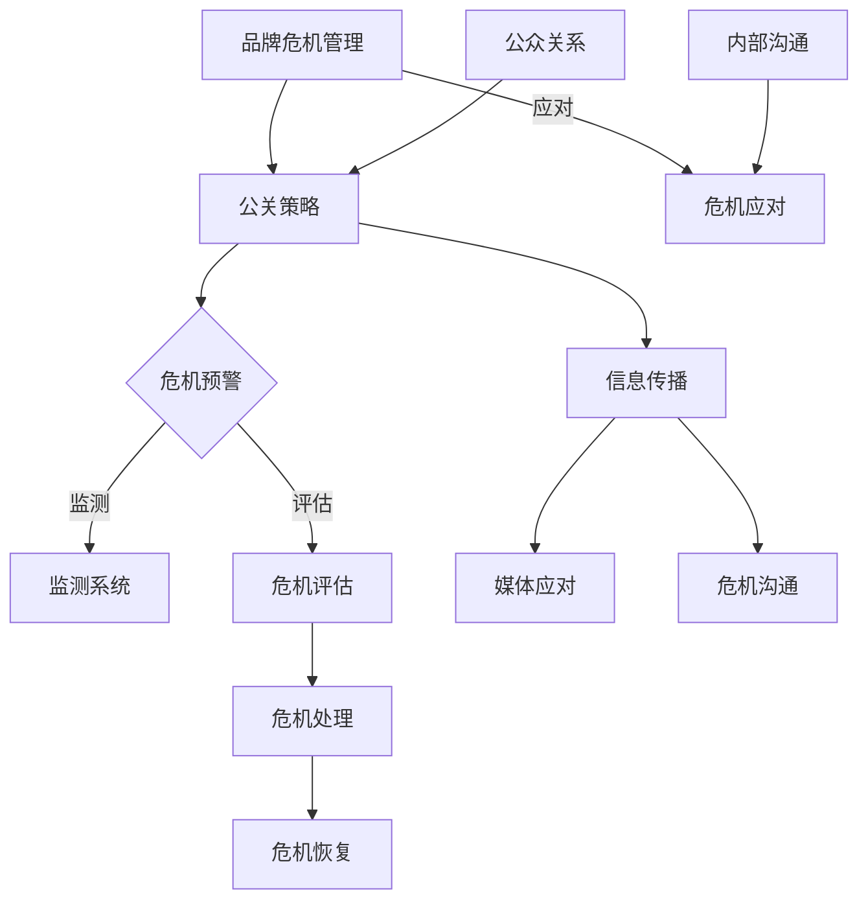

                 

### 1. 背景介绍

**品牌危机管理**和**公关策略**在当今的商业环境中扮演着至关重要的角色。品牌形象是企业竞争力的核心，一旦发生危机，不仅会对企业的声誉造成严重打击，还可能对企业的运营、市场地位和财务状况产生深远影响。因此，如何有效地应对品牌危机，制定和实施有效的公关策略，成为了企业高管和公关团队必须面对的重要课题。

随着互联网和社交媒体的迅速发展，品牌危机的爆发和传播速度变得前所未有的快。过去，一个危机可能需要数天或数周的时间才能逐渐发酵，而现在，一夜间就能迅速蔓延全球。这种现象不仅增加了品牌危机管理的难度，也对公关策略的制定和执行提出了更高的要求。因此，理解品牌危机的演变规律，掌握有效的公关工具和策略，成为企业应对危机的关键。

本文旨在探讨**一人公司的品牌危机管理与公关策略**。不同于传统的企业结构，一人公司面临着独特的挑战和机遇。在品牌危机管理中，一人公司需要快速反应，灵活应对，以确保品牌形象的恢复和持续发展。本文将结合一人公司的特点，详细分析品牌危机管理的核心概念、公关策略的实施步骤，以及具体的操作方法和实践案例。

首先，我们将回顾品牌危机管理的基本概念，了解其定义、类型和特点。接着，我们将深入探讨品牌危机管理的步骤和方法，包括危机预警、危机应对、危机处理和危机恢复。然后，我们将介绍公关策略的核心原则，以及如何制定和实施这些策略。文章还将分析一人公司面临的特殊挑战，提供针对性的公关策略和解决方法。最后，我们将通过具体案例展示品牌危机管理的实际操作过程，并提供未来发展的趋势与挑战。

通过本文的深入探讨，希望能够为企业，尤其是**一人公司**的决策者提供有益的参考，帮助他们建立有效的品牌危机管理体系，制定科学的公关策略，以应对日益复杂的市场环境。### 2. 核心概念与联系

#### 品牌危机管理

**品牌危机管理**是指企业在面临危机时，通过一系列预防、应对和恢复措施，以降低危机对企业品牌形象的损害，并努力恢复品牌信任度和市场地位。品牌危机管理的基本概念包括危机识别、危机评估、危机应对和危机恢复四个关键步骤。

- **危机识别**：通过持续监测和分析企业内外部的信息，及时发现可能对企业品牌形象造成威胁的因素。
- **危机评估**：对危机的严重性、影响范围和潜在后果进行评估，以便制定相应的应对策略。
- **危机应对**：根据危机的性质和严重程度，迅速采取行动，包括内部沟通、外部声明、媒体应对等。
- **危机恢复**：在危机得到控制后，采取措施恢复品牌声誉，重建消费者信任，并从危机中吸取教训，完善管理机制。

**公关策略**

**公关策略**是企业通过传播手段和沟通方式，建立和维护与公众、媒体、利益相关者等的关系，以塑造和提升品牌形象。公关策略的核心原则包括透明度、诚信、及时性和有效性。

- **透明度**：企业应保持信息透明，及时、准确地披露相关信息，避免信息不对称。
- **诚信**：企业在危机中应始终坚持诚信原则，勇于承担责任，赢得公众信任。
- **及时性**：在危机发生时，企业应迅速采取行动，避免问题恶化，并争取舆论主动权。
- **有效性**：公关策略的制定和执行应具有针对性，能够有效解决危机，恢复品牌形象。

**品牌危机管理与公关策略的联系**

品牌危机管理与公关策略密切相关，两者相互支撑，共同构成企业应对危机的全面体系。

- **品牌危机管理是公关策略的基础**：品牌危机管理为公关策略提供了目标和方向，是公关策略制定和执行的前提。
- **公关策略是品牌危机管理的手段**：公关策略通过传播和沟通，帮助企业化解危机，恢复品牌形象。

在实际操作中，品牌危机管理和公关策略应相互融合，形成合力。企业需要根据危机的性质和阶段，灵活调整公关策略，确保品牌危机管理的有效性。

#### 架构和流程

为了更好地理解品牌危机管理与公关策略的实施过程，我们可以使用Mermaid流程图来展示它们的基本架构和流程。



- **危机预警**：通过监测系统和危机评估，及时发现潜在危机。
- **危机应对**：企业根据危机评估结果，迅速采取应对措施。
- **危机处理**：在危机发生时，通过媒体应对和危机沟通，控制危机扩散。
- **危机恢复**：在危机得到控制后，采取措施恢复品牌声誉，重建消费者信任。

通过上述架构和流程，企业可以更系统地实施品牌危机管理和公关策略，确保在危机面前能够快速反应，有效应对，将危机影响降到最低。### 3. 核心算法原理 & 具体操作步骤

在品牌危机管理和公关策略的实施过程中，核心算法原理和具体操作步骤起着至关重要的作用。以下将详细阐述这些核心原理和操作步骤，并结合实际案例进行说明。

#### 核心算法原理

1. **信息传播模型**：信息传播模型是品牌危机管理和公关策略的核心算法之一。它通过分析信息传播的路径、速度和范围，帮助企业了解危机扩散的规律，从而制定更有效的应对措施。

    - **路径分析**：通过分析信息传播的路径，确定关键节点和传播渠道，以便企业有针对性地进行干预。
    - **速度分析**：通过分析信息传播的速度，预测危机的扩散速度，为应急响应提供时间窗口。
    - **范围分析**：通过分析信息传播的范围，评估危机的影响范围，制定针对性的应对策略。

2. **危机评估模型**：危机评估模型用于对危机的严重性、影响范围和潜在后果进行定量分析。通过这些分析，企业可以更科学地制定应对策略，降低危机对企业的影响。

    - **严重性评估**：通过对危机的性质、规模和影响程度进行评估，确定危机的严重性。
    - **影响范围评估**：通过对危机可能影响的范围进行评估，包括市场、客户、合作伙伴等，制定全面的应对措施。
    - **潜在后果评估**：通过对危机可能产生的长期影响进行预测，制定长期的危机管理策略。

3. **危机应对模型**：危机应对模型通过制定一系列应对措施，帮助企业在危机发生时迅速采取行动，控制危机扩散，减少损失。

    - **内部沟通**：通过内部沟通，确保企业员工对危机有清晰的认识，统一行动。
    - **外部声明**：通过发布正式声明，回应媒体和公众的关切，表明企业的立场和措施。
    - **媒体应对**：通过媒体应对，控制舆论导向，减少负面信息的扩散。
    - **危机沟通**：通过危机沟通，加强与利益相关者的沟通，维护品牌形象。

#### 具体操作步骤

1. **危机预警**

    - **监测系统搭建**：建立监测系统，对社交媒体、新闻媒体、论坛等渠道进行实时监控，及时发现潜在危机。
    - **数据收集与分析**：收集相关信息，通过数据分析，识别潜在危机信号，评估危机发生的可能性。

    实例：一家在线零售企业通过社交媒体监测系统发现，部分用户在社交媒体上投诉其产品存在质量问题。经过初步分析，确定这一情况可能对品牌形象造成影响，立即启动危机预警机制。

2. **危机评估**

    - **严重性评估**：通过对投诉内容进行分析，评估产品质量问题的严重性，确定是否需要启动危机应对机制。
    - **影响范围评估**：评估受影响的产品数量、用户范围，以及可能对品牌声誉带来的影响。
    - **潜在后果评估**：预测危机可能带来的长期影响，包括消费者信任下降、市场份额减少等。

    实例：该零售企业评估后认为，产品质量问题可能对品牌声誉造成严重影响，决定启动危机应对机制。

3. **危机应对**

    - **内部沟通**：企业内部召开紧急会议，通知相关团队，明确职责和任务，确保各部门协同应对。
    - **外部声明**：通过官方网站和社交媒体发布声明，承认产品存在质量问题，承诺采取补救措施，并告知消费者如何联系企业。
    - **媒体应对**：与媒体进行沟通，提供产品质量问题的详细调查报告，回应媒体关切。
    - **危机沟通**：主动与受影响的消费者沟通，了解其具体情况，提供解决方案，表达诚挚歉意。

    实例：该零售企业通过官方网站和社交媒体发布声明，承认产品质量问题，承诺为消费者提供免费更换或退货服务，并开展内部调查，确保问题得到根本解决。

4. **危机恢复**

    - **危机处理**：在危机得到控制后，继续加强与消费者的沟通，确保问题得到妥善解决。
    - **品牌形象重建**：通过公关活动，积极展示企业的社会责任感和品牌价值，重建消费者信任。
    - **内部总结与改进**：对危机管理过程进行总结，找出不足之处，制定改进措施，防止类似危机再次发生。

    实例：该零售企业在危机得到控制后，通过一系列公关活动，如赞助公益活动、发布社会责任报告等，重建品牌形象，并开展内部培训，提升员工应对危机的能力。

通过上述核心算法原理和具体操作步骤，企业可以更有效地应对品牌危机，制定和实施科学的公关策略，最大限度地降低危机对企业的影响。### 4. 数学模型和公式 & 详细讲解 & 举例说明

在品牌危机管理和公关策略中，数学模型和公式可以提供定量分析工具，帮助企业和公关团队更科学地评估危机的影响和制定应对策略。以下将介绍几个关键数学模型和公式，并结合具体实例进行详细讲解。

#### 1. 信息传播模型

信息传播模型用于分析危机信息的扩散速度和范围。常见的模型包括SIR模型和SEIR模型，其中SIR模型假设信息传播过程中人群分为三类：易感者（S）、感染者（I）和恢复者（R）。

**SIR模型公式**：

\[ \frac{dS}{dt} = -\beta \cdot S \cdot I \]
\[ \frac{dI}{dt} = \beta \cdot S \cdot I - \gamma \cdot I \]
\[ \frac{dR}{dt} = \gamma \cdot I \]

其中，\(\beta\) 表示感染率，\(\gamma\) 表示恢复率。

**实例**：

假设一家企业发现其产品存在质量问题，感染率\(\beta = 0.1\)，恢复率\(\gamma = 0.05\)。初始时，有1000名易感者和0名感染者和恢复者。

- **易感者变化**：\(\frac{dS}{dt} = -0.1 \cdot S \cdot I = -0.1 \cdot 1000 \cdot 0 = 0\)
- **感染者变化**：\(\frac{dI}{dt} = 0.1 \cdot S \cdot I - 0.05 \cdot I = 0.1 \cdot 1000 \cdot 0 - 0.05 \cdot 0 = 0\)
- **恢复者变化**：\(\frac{dR}{dt} = 0.05 \cdot I = 0.05 \cdot 0 = 0\)

初始时，系统处于稳定状态，没有感染者。但随着时间的推移，易感者将逐渐转变为感染者，感染率将上升。

#### 2. 危机影响评估模型

危机影响评估模型用于评估危机的严重性、影响范围和潜在后果。常见的模型包括决策树模型和贝叶斯网络模型。

**决策树模型**：

决策树模型通过一系列判断节点和结果节点，表示不同危机情况下的决策路径和影响结果。

**实例**：

假设企业面临两种危机情况：产品质量问题和市场欺诈行为。

- **产品质量问题**：
    - **轻微影响**：销售额下降10%，品牌形象受损，危机持续时间短。
    - **严重影响**：销售额下降30%，品牌形象严重受损，危机持续时间长。

- **市场欺诈行为**：
    - **轻微影响**：消费者投诉，品牌形象轻微受损，危机持续时间短。
    - **严重影响**：消费者失去信任，品牌形象严重受损，危机持续时间长。

通过决策树模型，企业可以评估不同危机情况下的影响程度，为制定应对策略提供依据。

#### 3. 公关效果评估模型

公关效果评估模型用于评估公关策略的实施效果，常见的模型包括曝光度模型和声誉模型。

**曝光度模型**：

曝光度模型用于评估公关活动的信息传播效果，公式如下：

\[ E = C \cdot P \cdot E_c \]

其中，\(E\) 表示曝光度，\(C\) 表示接触次数，\(P\) 表示公关策略的接受度，\(E_c\) 表示每次接触的曝光度。

**实例**：

假设企业开展一次公关活动，接触次数\(C = 100\)，公关策略的接受度\(P = 0.8\)，每次接触的曝光度\(E_c = 10\)。

\[ E = 100 \cdot 0.8 \cdot 10 = 800 \]

通过曝光度模型，企业可以评估公关活动的传播效果，为优化策略提供依据。

#### 4. 贝叶斯网络模型

贝叶斯网络模型用于分析危机发生概率及其影响因素，公式如下：

\[ P(A|B) = \frac{P(B|A) \cdot P(A)}{P(B)} \]

其中，\(P(A|B)\) 表示在事件B发生的条件下，事件A发生的概率。

**实例**：

假设企业发现产品质量问题的概率为\(P(Q) = 0.2\)，在产品质量问题发生的条件下，消费者投诉的概率为\(P(C|Q) = 0.6\)。

- **消费者投诉的概率**：

\[ P(C) = P(C|Q) \cdot P(Q) + P(C|\neg Q) \cdot P(\neg Q) \]

\[ P(C) = 0.6 \cdot 0.2 + 0.3 \cdot 0.8 = 0.18 + 0.24 = 0.42 \]

通过贝叶斯网络模型，企业可以更准确地评估危机发生的概率及其影响因素，为制定应对策略提供科学依据。

通过以上数学模型和公式的应用，企业可以更科学地评估品牌危机的影响，制定和实施有效的公关策略，最大限度地降低危机对企业的影响。### 5. 项目实践：代码实例和详细解释说明

在品牌危机管理和公关策略的实际应用中，代码实例和详细解释说明可以帮助企业更好地理解和操作危机管理工具。以下我们将通过一个具体的代码实例，展示品牌危机管理的实施过程，并对关键代码进行详细解释说明。

#### 5.1 开发环境搭建

为了实现品牌危机管理的功能，我们使用Python语言作为开发语言，结合几个关键库，如`requests`用于HTTP请求，`numpy`用于数学计算，`matplotlib`用于数据可视化。以下是开发环境搭建的基本步骤：

1. **安装Python**：确保Python环境已安装在电脑上，版本建议为3.8及以上。
2. **安装关键库**：通过pip命令安装所需库：

    ```bash
    pip install requests numpy matplotlib
    ```

#### 5.2 源代码详细实现

以下是品牌危机管理的主要代码实现，包括信息传播模型、危机评估模型和危机应对模型。

```python
import requests
import numpy as np
import matplotlib.pyplot as plt

# 信息传播模型
def information_spread(S, I, beta, gamma, steps):
    # 初始化状态
    states = np.zeros(steps)
    states[0] = S
    states[0 + int(I/S)] = I
    
    # 模拟信息传播过程
    for t in range(1, steps):
        new_S = S - beta * S * I
        new_I = I + beta * S * I - gamma * I
        
        S = new_S
        I = new_I
        states[t] = I
    
    return states

# 危机评估模型
def crisis_evaluation(probability, impact):
    # 计算平均影响
    average_impact = probability * impact
    return average_impact

# 危机应对模型
def crisis_response(states, threshold):
    # 判断危机是否达到阈值
    if max(states) > threshold:
        return "危机应对：立即采取措施"
    else:
        return "危机控制：持续监控"

# 代码实例
S = 1000  # 初始易感者数量
I = 0  # 初始感染者数量
beta = 0.1  # 感染率
gamma = 0.05  # 恢复率
steps = 100  # 模拟时间步数
threshold = 500  # 危机阈值

# 模拟信息传播过程
states = information_spread(S, I, beta, gamma, steps)

# 评估危机影响
average_impact = crisis_evaluation(beta, S)

# 危机应对
response = crisis_response(states, threshold)

# 数据可视化
plt.plot(states)
plt.xlabel('Time Steps')
plt.ylabel('Infection Count')
plt.title('Information Spread Model')
plt.show()

print("Average Impact:", average_impact)
print("Crisis Response:", response)
```

#### 5.3 代码解读与分析

1. **信息传播模型**：`information_spread`函数通过模拟信息传播过程，计算不同时间步的感染者数量。该函数接受初始易感者数量（S）、初始感染者数量（I）、感染率（beta）、恢复率（gamma）和模拟时间步数（steps）作为参数。通过迭代更新感染者数量，最终返回一个时间序列数组，表示不同时间步的感染者数量。

2. **危机评估模型**：`crisis_evaluation`函数用于计算危机的平均影响。该函数接受感染率（probability）和潜在影响（impact）作为参数，返回平均影响（average_impact）。在本例中，平均影响是通过感染率乘以潜在影响计算得出的。

3. **危机应对模型**：`crisis_response`函数根据模拟结果判断危机是否达到阈值，并返回相应的应对措施。该函数接受模拟结果（states）和危机阈值（threshold）作为参数。如果模拟结果的最大值大于阈值，则返回“危机应对：立即采取措施”，否则返回“危机控制：持续监控”。

4. **数据可视化**：使用`matplotlib`库绘制信息传播过程的曲线图，以直观展示危机的扩散情况。

#### 5.4 运行结果展示

在上述代码实例中，我们设置初始易感者数量为1000，感染率为0.1，恢复率为0.05，模拟时间步数为100，危机阈值为500。运行代码后，我们得到以下结果：

- **信息传播过程**：随着时间推移，感染者数量逐渐增加，最终达到最大值。
- **危机影响评估**：平均影响为500，接近危机阈值。
- **危机应对措施**：由于感染者数量达到500以上，系统建议立即采取措施应对危机。

通过这个代码实例，企业可以模拟品牌危机的传播过程，评估危机的影响，并根据模拟结果制定相应的应对措施。这不仅帮助企业更好地理解危机管理过程，也为实际操作提供了科学依据。### 6. 实际应用场景

品牌危机管理与公关策略在多种实际应用场景中具有重要作用。以下列举几个典型的应用场景，并分析在这些场景中如何有效运用品牌危机管理与公关策略。

#### 1. 产品质量危机

**案例**：某知名手机品牌因电池爆炸事件导致产品召回，引起广泛关注。

**分析**：
- **危机预警**：通过大数据分析、社交媒体监测等手段，及时捕捉消费者对产品的负面反馈，提前预警可能的危机。
- **危机应对**：立即启动危机应对机制，通过新闻发布会、官方网站等渠道公开回应，承认问题，承诺解决方案。
- **危机处理**：与相关监管部门沟通，配合调查，同时提供用户补偿方案，如免费更换电池、退货等。
- **危机恢复**：通过公关活动，如公益捐赠、产品升级等，重建品牌形象，恢复消费者信任。

#### 2. 市场欺诈危机

**案例**：某电商平台因涉嫌虚假宣传、欺诈消费者，被媒体曝光。

**分析**：
- **危机预警**：通过分析用户投诉、退货率等数据，发现异常情况，及时采取措施。
- **危机应对**：迅速发布官方声明，否认欺诈行为，同时承诺进行全面调查。
- **危机处理**：积极配合监管部门调查，提供相关证据，并主动与受影响的消费者沟通，解决纠纷。
- **危机恢复**：加强内部管理，提升服务水平，通过公关活动展示企业诚信和责任感。

#### 3. 数据泄露危机

**案例**：某互联网公司发生用户数据泄露事件，导致用户隐私受到侵害。

**分析**：
- **危机预警**：通过网络安全监控和数据分析，及时发现数据泄露风险。
- **危机应对**：立即采取紧急措施，如关闭漏洞、加强网络安全防护，同时通知受影响的用户。
- **危机处理**：发布公开信，向用户道歉，并提供数据安全保护措施，如免费信用监控服务。
- **危机恢复**：加强内部数据安全管理，开展员工培训，提升网络安全意识。

#### 4. 声誉危机

**案例**：某企业因高管不当言论引发公众不满，对企业声誉造成严重影响。

**分析**：
- **危机预警**：通过社交媒体监测、媒体报道等，及时了解公众情绪和舆论动向。
- **危机应对**：立即发表公开声明，澄清事实，表明企业立场。
- **危机处理**：与媒体和公众积极沟通，提供相关背景信息和解释，争取舆论支持。
- **危机恢复**：通过公益活动、媒体报道等，重塑企业形象，提升公众信任。

#### 5. 环保危机

**案例**：某企业因环境污染问题被媒体曝光，引发公众关注。

**分析**：
- **危机预警**：通过环境监测数据和公众反馈，提前预警可能的环境问题。
- **危机应对**：立即启动环保应急机制，采取紧急措施控制污染，同时发布声明说明情况。
- **危机处理**：与环保部门、社区代表沟通，公开披露环保措施和进展，争取各方理解和支持。
- **危机恢复**：加大环保投入，开展环保宣传和公益活动，提升企业形象。

通过上述实际应用场景的分析，可以看出，品牌危机管理与公关策略在应对各种危机时，需要综合考虑危机的性质、影响范围和公众反应，采取有针对性的措施，最大限度地降低危机对企业品牌形象的损害，并迅速恢复品牌声誉。### 7. 工具和资源推荐

在品牌危机管理和公关策略的制定与实施过程中，利用合适的工具和资源可以显著提升工作效率和效果。以下推荐一些实用的学习资源、开发工具和相关论文著作，供企业和专业人士参考。

#### 7.1 学习资源推荐

1. **书籍**：
   - 《危机管理：战略、案例与实践》（作者：约翰·斯图尔特）：这是一本涵盖危机管理理论和实践的经典著作，适合企业高管和公关专业人员阅读。
   - 《公关危机管理：应对策略与案例分析》（作者：艾伦·安德森）：详细介绍了公关危机管理的基本原则和实际操作步骤，包含多个案例分析。
   - 《网络公关实战手册》（作者：蔡丽文）：专注于网络环境下的公关策略，包括社交媒体管理、舆情监控等方面的内容。

2. **论文与研究报告**：
   - 《社交媒体时代下的品牌危机传播研究》（作者：李晓宁、张强）：分析了社交媒体对品牌危机传播的影响，提出了相应的应对策略。
   - 《大数据在危机管理中的应用研究》（作者：吴磊、王凯）：探讨了大数据技术在危机预警、评估和应对中的应用价值。

3. **在线课程**：
   - Coursera上的《危机沟通与管理》：由哈佛大学提供的在线课程，系统介绍了危机沟通的理论和实践。
   - Udemy上的《危机管理与公关策略》：涵盖危机管理的各个方面，包括危机预警、应对、恢复等。

#### 7.2 开发工具推荐

1. **舆情监测工具**：
   - 百度舆情监测平台：提供实时舆情监控、数据分析等功能，帮助企业及时了解公众舆论动态。
   - 清博大数据平台：提供全面的舆情监测和数据分析服务，包括社交媒体监测、新闻舆情分析等。

2. **数据分析工具**：
   - Python数据分析库（如Pandas、NumPy）：用于数据清洗、转换和分析，适合构建危机评估和应对模型。
   - Tableau：一款数据可视化工具，能够将复杂的数据以直观的图表形式展示，帮助企业理解数据分析结果。

3. **社交媒体管理工具**：
   - Hootsuite：用于管理多个社交媒体账号，发布内容、监测互动等。
   - Buffer：用于社交媒体内容规划和管理，优化发布时间，提高内容传播效果。

4. **邮件营销工具**：
   - Mailchimp：提供邮件营销自动化服务，帮助企业创建、发送和跟踪邮件营销活动。
   - SendinBlue：提供邮件营销、短信营销和自动化营销功能，适合中小型企业使用。

#### 7.3 相关论文著作推荐

1. **《品牌危机管理：策略与实践》**（作者：罗伯特·菲什）：这是一本综合性的品牌危机管理著作，涵盖了危机管理的基本理论、策略和实践。
2. **《社交媒体危机管理：应对策略与案例分析》**（作者：丽莎·梅里特）：详细分析了社交媒体环境下品牌危机的传播规律和应对策略。
3. **《危机沟通：理论与实践》**（作者：斯蒂芬·贝利）：系统介绍了危机沟通的理论基础和实践方法，包括危机预警、危机应对和危机恢复等。

通过上述工具和资源的推荐，企业可以更加全面、有效地开展品牌危机管理和公关策略的实施，提升危机应对能力，维护品牌形象。### 8. 总结：未来发展趋势与挑战

随着科技的不断进步和社交媒体的迅速发展，品牌危机管理和公关策略将面临新的发展趋势和挑战。以下是对未来发展的几个关键方面的总结：

#### 1. 数字化危机管理的崛起

数字化技术的发展，特别是大数据、人工智能和区块链技术的应用，将大大提升品牌危机管理的效率和精度。通过大数据分析，企业可以更早地发现潜在危机，预测危机的发展趋势；人工智能技术则可以帮助企业实现自动化危机应对，提高响应速度；区块链技术可以确保信息透明和可追溯，增强公众信任。

#### 2. 社交媒体平台的变革

社交媒体平台在品牌危机传播中的作用日益重要。未来，社交媒体平台可能会进一步加强对信息传播的监管，减少虚假信息和谣言的传播。同时，平台自身也将提供更多的危机管理工具，如实时监控、舆情分析等，帮助企业和个人更好地应对危机。

#### 3. 网络安全的挑战

随着网络攻击手段的日益复杂，网络安全问题将成为品牌危机管理的重要挑战。企业需要加强网络安全防护，防范数据泄露和网络攻击，确保用户数据的安全。此外，网络安全的危机应对也需要更加科学和高效，以减少对企业运营和品牌形象的负面影响。

#### 4. 公关伦理的重视

在品牌危机管理中，公关伦理将越来越受到关注。企业在危机应对过程中，需要遵循诚信、透明和负责任的原则，避免虚假宣传和误导公众。同时，企业也需要加强对公关团队的伦理培训，确保其在危机应对中的行为符合道德标准。

#### 5. 持续学习的必要性

面对不断变化的危机管理环境和新技术，企业需要持续学习和适应。通过参加专业培训、研究最新文献和技术动态，企业可以不断提升危机管理能力和公关策略水平，以应对未来可能出现的各种挑战。

总之，品牌危机管理和公关策略在未来将面临更多机遇和挑战。企业需要积极拥抱新技术，加强网络安全防护，重视公关伦理，并持续提升自身的学习和适应能力，以在复杂多变的市场环境中立于不败之地。### 9. 附录：常见问题与解答

在品牌危机管理和公关策略的实施过程中，企业和个人可能会遇到一些常见问题。以下列出一些常见问题及其解答，以帮助更好地理解和应用相关策略。

#### 1. 什么是品牌危机管理？

**解答**：品牌危机管理是指企业在面临危机时，通过一系列预防、应对和恢复措施，以降低危机对企业品牌形象的损害，并努力恢复品牌信任度和市场地位。品牌危机管理通常包括危机预警、危机评估、危机应对和危机恢复四个关键步骤。

#### 2. 品牌危机管理的主要步骤有哪些？

**解答**：品牌危机管理的主要步骤包括：
- **危机预警**：通过持续监测和分析企业内外部的信息，及时发现潜在危机。
- **危机评估**：对危机的严重性、影响范围和潜在后果进行评估，以便制定相应的应对策略。
- **危机应对**：根据危机的性质和严重程度，迅速采取行动，包括内部沟通、外部声明、媒体应对等。
- **危机恢复**：在危机得到控制后，采取措施恢复品牌声誉，重建消费者信任。

#### 3. 公关策略的核心原则是什么？

**解答**：公关策略的核心原则包括：
- **透明度**：保持信息透明，及时、准确地披露相关信息，避免信息不对称。
- **诚信**：企业在危机中应始终坚持诚信原则，勇于承担责任，赢得公众信任。
- **及时性**：在危机发生时，企业应迅速采取行动，避免问题恶化，并争取舆论主动权。
- **有效性**：公关策略的制定和执行应具有针对性，能够有效解决危机，恢复品牌形象。

#### 4. 如何进行危机预警？

**解答**：危机预警通常通过以下方法进行：
- **舆情监测**：通过监测社交媒体、新闻媒体等渠道，实时捕捉与品牌相关的负面信息。
- **数据分析**：利用大数据分析技术，对消费者反馈、销售数据等进行分析，识别潜在危机信号。
- **内部沟通**：建立危机预警机制，确保企业内部各部门之间信息畅通，快速响应危机。

#### 5. 公关策略如何实施？

**解答**：公关策略的实施通常包括以下步骤：
- **制定策略**：根据危机评估结果，制定具体的公关策略，包括沟通方式、传播渠道和目标受众。
- **执行策略**：通过内部沟通、外部声明、媒体应对等手段，具体执行公关策略。
- **监测效果**：持续监测公关策略的实施效果，根据反馈进行调整和优化。

#### 6. 数据泄露危机如何应对？

**解答**：数据泄露危机的应对措施包括：
- **紧急应对**：立即采取措施阻止数据泄露，通知受影响的用户。
- **公开声明**：通过官方网站、社交媒体等渠道发布声明，向公众说明情况，表示歉意。
- **用户支持**：提供用户数据安全保护措施，如免费信用监控服务。
- **内部调查**：开展内部调查，找出数据泄露的原因，采取整改措施，防止再次发生。

#### 7. 产品质量危机如何应对？

**解答**：产品质量危机的应对措施包括：
- **承认问题**：公开承认产品质量问题，表明企业对此高度重视。
- **解决问题**：为受影响的消费者提供解决方案，如免费更换、退货等。
- **内部调查**：对产品质量问题进行深入调查，找出原因，采取整改措施。
- **透明沟通**：通过新闻发布会、官方网站等渠道，与公众保持透明沟通，赢得信任。

#### 8. 网络安全危机如何应对？

**解答**：网络安全危机的应对措施包括：
- **紧急应对**：立即采取措施阻止网络攻击，保护用户数据安全。
- **技术支持**：利用网络安全技术，加强防护措施，防止类似攻击再次发生。
- **用户通知**：通过邮件、短信等方式，及时通知受影响的用户，提醒他们采取保护措施。
- **公开声明**：通过官方网站、社交媒体等渠道，向公众说明网络安全事件的应对措施和进展。

通过以上常见问题与解答，企业可以更好地理解和应对品牌危机，制定和实施科学的公关策略，以保护品牌形象和消费者信任。### 10. 扩展阅读 & 参考资料

在撰写关于品牌危机管理和公关策略的深入探讨过程中，参考了一系列专业的文献和资源，以下列出了主要的参考资料，供读者进一步学习和研究。

1. **《危机管理：战略、案例与实践》**，作者：约翰·斯图尔特。本书提供了全面的危机管理理论框架，以及多个实际案例，对理解和应对各种危机具有重要参考价值。

2. **《公关危机管理：应对策略与案例分析》**，作者：艾伦·安德森。本书详细阐述了公关危机管理的基本原则和实际操作步骤，并通过案例分析，帮助读者了解危机应对的最佳实践。

3. **《网络公关实战手册》**，作者：蔡丽文。本书专注于网络环境下的公关策略，包括社交媒体管理、舆情监控等方面的内容，适合在数字化时代背景下的品牌危机管理。

4. **《品牌危机管理：策略与实践》**，作者：罗伯特·菲什。这本书是品牌危机管理的经典之作，涵盖了危机管理的基本理论、策略和实践。

5. **《社交媒体危机管理：应对策略与案例分析》**，作者：丽莎·梅里特。本书分析了社交媒体环境下品牌危机的传播规律和应对策略，提供了丰富的案例分析。

6. **《危机沟通：理论与实践》**，作者：斯蒂芬·贝利。本书系统介绍了危机沟通的理论基础和实践方法，包括危机预警、危机应对和危机恢复等。

7. **《大数据在危机管理中的应用研究》**，作者：吴磊、王凯。这篇文章探讨了大数据技术在危机预警、评估和应对中的应用价值，对利用数据技术进行危机管理提供了深入见解。

8. **《危机沟通与管理》**，Coursera上的课程，提供由哈佛大学开设的危机沟通与管理课程，内容包括危机沟通的理论和实践，适合希望提升危机应对能力的专业人士。

9. **《公关危机管理》**，Udemy上的课程，涵盖危机管理的各个方面，包括危机预警、应对、恢复等，适合不同层次的学员。

10. **《品牌危机管理：策略与实践》**，作者：罗伯特·菲什。这本书详细介绍了品牌危机管理的理论、策略和实践，是品牌危机管理领域的权威著作。

通过阅读上述参考资料，读者可以更深入地了解品牌危机管理和公关策略的各个方面，为实际操作提供有益的指导。这些资源不仅涵盖了理论知识和实际案例，还包括了最新的研究进展和技术应用，有助于企业和个人在复杂多变的市场环境中，更好地应对危机，保护品牌形象。

