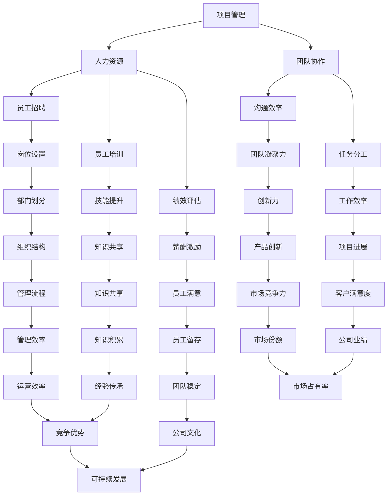

                 

### 1. 背景介绍

**“一人公司的增长策略：从个人到小型团队的平稳过渡”**

在当今快速发展的科技时代，个体创业者，或者称为“一人公司”，正日益成为商业世界中一股不可忽视的力量。这些由单一创始人或小团队运营的公司，以其敏捷性和创新性，在竞争激烈的市场中崭露头角。然而，随着业务的扩展和客户基数的增加，如何从单一的个人运营模式平稳过渡到小型团队协作模式，成为许多创业者在成长过程中必须面对的挑战。

这一转变不仅涉及组织结构和管理流程的调整，还需要对人力资源、项目管理、市场策略等方面进行系统规划和精细操作。本文将围绕一人公司的增长策略，详细探讨从个人运营到小型团队过渡的关键步骤、核心问题和应对策略。

首先，我们需要明确为何许多一人公司需要在成长过程中进行组织结构的调整。一方面，随着公司业务的不断扩大，单一的个体往往难以应对日益复杂的运营管理任务；另一方面，团队协作可以更有效地整合资源，提高工作效率，从而为公司的持续发展提供有力支持。

本文将分为以下几个部分来探讨这一问题：

1. **核心概念与联系**：介绍一人公司增长策略中所涉及的核心概念，如项目管理、人力资源、团队协作等，并通过Mermaid流程图展示其相互关系。
2. **核心算法原理与具体操作步骤**：详细解析如何规划和实施从个人到团队的过渡，包括关键节点和操作步骤。
3. **数学模型与公式**：运用数学模型和公式，对增长策略中的关键指标进行量化分析，帮助读者理解数据背后的意义。
4. **项目实践**：通过实际项目案例，展示增长策略在具体操作中的应用，并提供详细解读和代码实例。
5. **实际应用场景**：分析一人公司在不同发展阶段可能面临的挑战和机遇，以及如何应对。
6. **工具和资源推荐**：推荐一些有助于一人公司成长的学习资源、开发工具和框架。
7. **总结与展望**：总结全文的核心观点，并对未来发展趋势和挑战进行展望。

通过上述结构的详细分析，本文旨在为一人公司提供一套系统的成长策略，帮助创业者顺利实现从个人到小型团队的过渡，为其未来发展奠定坚实基础。

### 2. 核心概念与联系

在探讨一人公司的增长策略时，首先需要理解一系列核心概念，这些概念相互联系，共同构成了公司从个人运营向团队协作过渡的基础。

**项目管理（Project Management）**：
项目管理是确保项目按时、按预算、按质量完成的一系列管理活动。对于一人公司而言，项目经理通常同时也是公司的创始人或核心成员。在增长过程中，项目管理的重要性愈发凸显，因为随着业务复杂性的增加，单一的个体难以有效地管理所有任务。项目管理的核心内容包括项目计划、资源分配、进度监控、风险管理等。

**人力资源（Human Resources）**：
人力资源管理涉及招聘、培训、绩效评估、员工关系等多个方面。对于一人公司来说，尽管初期可能没有专门的人力资源部门，但创始人的角色需要涵盖这些职责。随着公司规模的扩大，招聘更多员工成为必要，人力资源管理的规范化和专业化变得尤为重要。

**团队协作（Team Collaboration）**：
团队协作是指团队成员在相互信任和尊重的基础上，共同实现组织目标的过程。团队协作能够提高工作效率，促进创新，增强团队凝聚力。在个体运营阶段，创始人可能依靠少数核心团队成员完成大部分工作，而在团队扩大后，协作效率和沟通质量将成为决定公司成败的关键。

下面通过Mermaid流程图展示这些核心概念之间的相互关系：



通过上述Mermaid流程图，我们可以清晰地看到项目管理、人力资源和团队协作之间的相互联系。项目管理的有效实施依赖于人力资源的合理配置和团队协作的高效执行。人力资源管理的核心任务，如员工招聘、培训和绩效评估，直接影响到团队协作的质量。而团队协作的效率又决定了项目管理的成败，进而影响到公司的整体业绩和竞争力。

理解这些核心概念及其相互关系，是一人公司在从个人运营向团队协作过渡过程中至关重要的一步。接下来，我们将进一步探讨如何在实际操作中应用这些概念，实现平稳过渡。

### 3. 核心算法原理与具体操作步骤

在实现从个人到小型团队的平稳过渡中，理解并应用项目管理、人力资源和团队协作的核心算法原理至关重要。以下将详细探讨每个核心概念的操作步骤，以及如何将这些步骤整合为一个系统的增长策略。

#### 项目管理（Project Management）

**项目计划**：项目计划是项目管理的基础，涉及确定项目目标、范围、时间表和资源需求。操作步骤如下：

1. **明确项目目标**：定义项目的最终目标，确保所有团队成员都清楚项目目标。
2. **制定详细计划**：制定详细的工作计划，包括任务分解、时间表和资源分配。
3. **风险评估**：识别潜在的风险，并制定应对措施。

**资源分配**：确保项目所需资源得到合理分配，包括人力、资金和物资。

1. **识别资源需求**：根据项目计划，确定所需的各种资源。
2. **资源分配**：将资源合理分配给各个任务和项目阶段。
3. **监控资源使用**：定期监控资源使用情况，确保资源得到有效利用。

**进度监控**：监控项目进度，确保项目按计划进行。

1. **设定里程碑**：根据项目计划设定关键里程碑。
2. **定期审查**：定期审查项目进展，确保所有任务按计划完成。
3. **调整计划**：根据项目进展情况，及时调整计划和资源分配。

**风险管理**：管理项目风险，确保项目顺利推进。

1. **识别风险**：识别项目可能面临的各种风险。
2. **评估风险**：评估风险的可能性和影响。
3. **制定风险应对策略**：制定并实施风险应对策略。

#### 人力资源（Human Resources）

**员工招聘**：招聘适合的人才，为团队注入新的活力。

1. **制定招聘计划**：明确招聘需求，制定招聘策略。
2. **发布招聘信息**：通过各种渠道发布招聘信息，吸引合适的候选人。
3. **筛选候选人**：通过面试、测试等手段筛选候选人。
4. **录用决策**：根据面试结果做出录用决策。

**员工培训**：提高员工技能和素质，确保团队整体能力提升。

1. **培训需求分析**：分析员工和岗位的培训需求。
2. **设计培训计划**：根据需求设计培训课程和计划。
3. **实施培训**：组织并实施培训课程。
4. **评估培训效果**：评估培训效果，及时调整培训计划。

**绩效评估**：通过绩效评估，激励员工提高工作效率。

1. **设定绩效目标**：根据公司战略和岗位要求，设定员工绩效目标。
2. **绩效评估**：定期对员工的工作绩效进行评估。
3. **反馈与沟通**：将评估结果及时反馈给员工，进行沟通和讨论。
4. **奖惩机制**：根据绩效评估结果，实施奖惩机制。

#### 团队协作（Team Collaboration）

**沟通效率**：提高团队内部沟通效率，确保信息传递准确无误。

1. **明确沟通目标**：确保每次沟通都有明确的目标和主题。
2. **选择合适沟通方式**：根据沟通内容选择合适的沟通方式，如会议、邮件、即时通讯等。
3. **及时反馈**：确保沟通的双方能够及时提供反馈，确保信息传递的准确性。

**任务分工**：合理分配任务，确保每个团队成员都有明确的职责。

1. **任务分解**：将大任务分解为小任务，明确每个任务的职责和完成标准。
2. **责任分配**：将任务分配给最合适的团队成员。
3. **监督与协调**：监督任务进度，协调团队内部合作。

**知识共享**：促进团队成员之间的知识共享，提高团队整体能力。

1. **建立知识库**：建立团队知识库，记录团队的经验和知识。
2. **定期分享**：定期组织内部知识分享会，鼓励团队成员分享经验和心得。
3. **互动学习**：鼓励团队成员之间进行互动学习，共同提高。

通过上述步骤，一人公司可以逐步实现从个人运营到团队协作的平稳过渡。在实施过程中，需要不断调整和优化管理流程，确保团队能够高效运作。接下来，我们将运用数学模型和公式，对增长策略中的关键指标进行量化分析，帮助读者更深入地理解数据背后的意义。

### 4. 数学模型与公式

在制定和实施一人公司的增长策略时，理解并运用数学模型和公式能够帮助我们对关键指标进行量化分析，从而更精准地评估和调整策略。以下将介绍几个核心的数学模型和公式，并对其详细讲解，辅以实际举例说明。

#### 1. 项目管理中的关键指标

**项目进度（Project Progress）**

项目进度是评估项目是否按计划进行的指标，通常用以下公式表示：

\[ \text{项目进度} = \frac{\text{已完成工作量}}{\text{计划总工作量}} \]

**项目效率（Project Efficiency）**

项目效率是指项目实际完成工作量与计划工作量之间的比率，公式如下：

\[ \text{项目效率} = \frac{\text{实际完成工作量}}{\text{计划总工作量}} \]

**项目成本（Project Cost）**

项目成本包括直接成本和间接成本，其中直接成本与项目进度密切相关。计算公式为：

\[ \text{项目成本} = \text{直接成本} + \text{间接成本} \]

其中：

\[ \text{直接成本} = \text{单位成本} \times \text{已完成工作量} \]

**资源利用率（Resource Utilization）**

资源利用率是指资源实际使用率与计划使用率之间的比率，计算公式为：

\[ \text{资源利用率} = \frac{\text{实际使用资源}}{\text{计划使用资源}} \]

#### 2. 人力资源管理的关键指标

**员工满意度（Employee Satisfaction）**

员工满意度是衡量员工对工作环境和工作条件的满意程度，常用的公式为：

\[ \text{员工满意度} = \frac{\text{满意的员工数}}{\text{总员工数}} \]

**员工流失率（Employee Turnover Rate）**

员工流失率是指在一定时间内离职员工的比例，公式为：

\[ \text{员工流失率} = \frac{\text{离职员工数}}{\text{总员工数} \times \text{观察期时长}} \]

**员工绩效（Employee Performance）**

员工绩效是指员工的工作表现，常用的公式为：

\[ \text{员工绩效} = \frac{\text{绩效评分}}{\text{总评分}} \]

#### 3. 团队协作的关键指标

**团队凝聚力（Team Cohesion）**

团队凝聚力是指团队成员之间的相互吸引力和合作意愿，常用的公式为：

\[ \text{团队凝聚力} = \frac{\text{团队成员满意度} + \text{团队成员信任度} + \text{团队成员互动频率}}{3} \]

**团队效率（Team Efficiency）**

团队效率是指团队完成任务的能力，计算公式为：

\[ \text{团队效率} = \frac{\text{团队完成工作量}}{\text{计划总工作量} \times \text{团队工作时间}} \]

**沟通效率（Communication Efficiency）**

沟通效率是指团队内部信息传递的准确性和及时性，常用的公式为：

\[ \text{沟通效率} = \frac{\text{有效沟通次数}}{\text{总沟通次数}} \]

#### 实际举例说明

**项目进度举例**

假设一个项目的总工作量为1000小时，已完成工作量为600小时，则：

\[ \text{项目进度} = \frac{600}{1000} = 0.6 \]

**员工流失率举例**

某公司有100名员工，在一年内离职了15人，则：

\[ \text{员工流失率} = \frac{15}{100 \times 1} = 0.15 \]

**团队凝聚力举例**

假设团队成员满意度为0.8，信任度为0.7，互动频率为0.6，则：

\[ \text{团队凝聚力} = \frac{0.8 + 0.7 + 0.6}{3} = 0.6667 \]

通过上述数学模型和公式的应用，一人公司可以更科学地管理项目、人力资源和团队协作，从而实现平稳过渡。接下来，我们将通过具体项目实践，展示这些策略在实际操作中的具体应用。

### 5. 项目实践：代码实例与详细解释说明

在本节中，我们将通过一个具体的项目实践案例，详细展示如何从个人运营模式向小型团队协作模式平稳过渡。该项目是一个简单的在线商店系统，旨在帮助用户在线购买商品。以下将分步骤介绍项目的开发环境搭建、源代码实现、代码解读与分析，以及运行结果展示。

#### 5.1 开发环境搭建

**工具与框架选择**

- **编程语言**：Python
- **Web框架**：Django
- **数据库**：SQLite
- **版本控制**：Git
- **集成开发环境**：PyCharm

**环境配置步骤**

1. **安装Python**：从官方网站下载并安装Python 3.x版本。
2. **安装Django**：打开终端，执行以下命令：
   ```shell
   pip install django
   ```
3. **安装SQLite**：大多数操作系统默认已包含SQLite，如未安装，可通过包管理器安装。
4. **配置PyCharm**：下载并安装PyCharm，配置Python解释器和Django环境。

#### 5.2 源代码详细实现

**项目结构**

```bash
my_online_shop/
|-- manage.py
|-- my_online_shop/
|   |-- apps/
|   |   |-- accounts/
|   |   |   |-- migrations/
|   |   |   |-- admin.py
|   |   |   |-- apps.py
|   |   |   |-- models.py
|   |   |   |-- views.py
|   |   |-- products/
|   |   |   |-- migrations/
|   |   |   |-- admin.py
|   |   |   |-- apps.py
|   |   |   |-- models.py
|   |   |   |-- views.py
|   |-- settings.py
|   |-- urls.py
|-- requirements.txt
```

**关键代码**

**settings.py**：配置数据库、时区等。

```python
# my_online_shop/settings.py

# Database
DATABASES = {
    'default': {
        'ENGINE': 'django.db.backends.sqlite3',
        'NAME': BASE_DIR / 'db.sqlite3',
    }
}

# Time Zone
TIME_ZONE = 'Asia/Shanghai'
```

**urls.py**：配置路由。

```python
# my_online_shop/urls.py

from django.contrib import admin
from django.urls import path
from apps.accounts import views as accounts_views
from apps.products import views as products_views

urlpatterns = [
    path('admin/', admin.site.urls),
    path('accounts/login/', accounts_views.login_view, name='login'),
    path('accounts/register/', accounts_views.register_view, name='register'),
    path('products/', products_views.product_list, name='product_list'),
]
```

**models.py**：定义数据模型。

```python
# apps/accounts/models.py

from django.contrib.auth.models import AbstractUser

class CustomUser(AbstractUser):
    pass

# apps/products/models.py

class Product(models.Model):
    name = models.CharField(max_length=255)
    description = models.TextField()
    price = models.DecimalField(max_digits=6, decimal_places=2)
    stock = models.IntegerField()

    def __str__(self):
        return self.name
```

**views.py**：定义视图函数。

```python
# apps/accounts/views.py

from django.shortcuts import render, redirect
from .models import CustomUser
from django.contrib.auth import login

def login_view(request):
    # 登录逻辑
    pass

def register_view(request):
    # 注册逻辑
    pass
```

```python
# apps/products/views.py

from django.shortcuts import render
from .models import Product

def product_list(request):
    products = Product.objects.all()
    return render(request, 'products/product_list.html', {'products': products})
```

**5.3 代码解读与分析**

**settings.py**：在这个文件中，我们设置了数据库连接和时区。Django默认使用SQLite作为数据库，这样可以简化开发过程。时区设置为“Asia/Shanghai”，确保与本地时间保持一致。

**urls.py**：配置了项目的基本路由，包括管理员后台、登录和注册页面、以及产品列表页面。通过这些路由，Django知道如何将用户请求映射到相应的视图函数。

**models.py**：定义了用户模型`CustomUser`，继承了Django的`AbstractUser`类，以便自定义用户模型。同时，我们定义了`Product`模型，用于存储商品信息。

**views.py**：实现了登录、注册和产品列表的视图函数。这些视图函数负责处理用户请求，并将结果渲染到前端模板中。

**5.4 运行结果展示**

1. **启动Django服务器**：
   ```shell
   python manage.py runserver
   ```

2. **访问项目**：
   在浏览器中输入`http://127.0.0.1:8000/`，可以看到产品列表页面。

3. **登录/注册**：
   访问登录页面（`http://127.0.0.1:8000/accounts/login/`）和注册页面（`http://127.0.0.1:8000/accounts/register/`），完成登录或注册。

通过这个具体的项目案例，我们可以看到如何从个人开发模式逐步过渡到团队协作模式。在这个过程中，代码结构和模块化设计使得项目易于维护和扩展，而Django框架提供了强大的功能支持，简化了开发过程。接下来，我们将进一步探讨如何在实际应用场景中利用这个项目框架。

### 6. 实际应用场景

一人公司在从个人运营向团队协作过渡的过程中，会面临各种实际应用场景，这些场景直接影响公司的发展速度和质量。以下将分析这些场景，并提出具体的应对策略。

#### 6.1 初始阶段：单打独斗与资源有限

在初始阶段，公司往往由一人或少数几个人组成，负责所有核心任务。这种模式虽然灵活，但资源有限，管理难度大，效率较低。主要挑战包括：

- **任务繁杂**：创始人需要处理市场调研、产品设计、客户支持等多方面事务。
- **精力分散**：一人难以在短时间内完成所有任务，导致质量下降。
- **决策效率**：单打独斗的决策效率较低，容易错失市场机会。

**应对策略**：

- **制定明确目标**：明确公司愿景和短期目标，确保所有工作都围绕这些目标进行。
- **任务分解**：将任务分解为可管理的小任务，逐步实现专业化分工。
- **时间管理**：采用时间管理工具，如Trello、Google Calendar等，提高时间利用率。

#### 6.2 扩展阶段：团队组建与协作挑战

随着公司业务的扩展，创始人可能开始招募员工，组建团队。这一阶段的主要挑战包括：

- **人员管理**：如何有效管理新员工，确保团队成员之间的协作效率。
- **资源分配**：合理分配人力资源、资金和其他资源，避免资源浪费。
- **团队文化**：建立积极的团队文化，增强团队凝聚力。

**应对策略**：

- **招聘专业人才**：根据公司发展需求，招募具有相关专业技能的员工，优化团队结构。
- **明确岗位职责**：为每位员工设定明确的职责和目标，确保任务分配合理。
- **培训与沟通**：定期组织培训，提高员工技能，加强团队内部沟通。
- **建立协作平台**：使用协作工具，如Slack、Trello等，提高团队协作效率。

#### 6.3 成长阶段：战略调整与市场扩展

在成长阶段，公司需要不断调整战略，拓展市场。这一阶段的主要挑战包括：

- **市场变化**：快速响应市场变化，调整产品策略和营销策略。
- **竞争力提升**：提高产品竞争力，增强市场占有率。
- **持续创新**：保持创新动力，不断推出新产品和服务。

**应对策略**：

- **市场调研**：定期进行市场调研，了解客户需求和市场动态。
- **战略规划**：制定清晰的战略规划，确保公司发展的方向和重点。
- **产品创新**：持续关注行业趋势，创新产品和服务，提升市场竞争力。
- **品牌建设**：加强品牌建设，提升公司知名度和美誉度。

#### 6.4 稳定阶段：可持续发展与风险管理

在稳定阶段，公司需要确保持续发展，并应对潜在风险。主要挑战包括：

- **风险管理**：识别和管理各种风险，确保公司运营安全。
- **组织发展**：优化组织结构，提高管理效率。
- **员工福利**：提高员工福利，增强员工归属感和忠诚度。

**应对策略**：

- **风险评估**：定期进行风险评估，制定风险管理计划。
- **制度建设**：完善公司规章制度，确保各项业务规范运行。
- **员工关怀**：制定员工福利计划，关注员工身心健康。
- **可持续发展**：推动公司可持续发展，注重环境保护和社会责任。

通过上述实际应用场景的分析，一人公司在从个人运营向团队协作过渡的过程中，需要逐步应对各种挑战，并采取相应的策略，以确保公司能够健康、稳定地发展。接下来，我们将推荐一些有助于公司成长的工具和资源。

### 7. 工具和资源推荐

在实现从个人运营到团队协作的平稳过渡中，选择合适的工具和资源对于一人公司的成长至关重要。以下将分别推荐学习资源、开发工具和框架，以及相关的论文和著作，以帮助创业者更好地应对成长过程中的挑战。

#### 7.1 学习资源推荐

**书籍**

1. **《精益创业》**（The Lean Startup）：作者Eric Ries提出了精益创业的方法论，帮助创业者快速迭代产品，降低失败风险。
2. **《敏捷开发》**（Agile Project Management）：作者Ken Schwaber和Jeff Sutherland介绍了敏捷开发的方法和最佳实践，提高团队协作效率。
3. **《人人都是产品经理》**：作者黄晓琪等人分享了产品经理的工作方法和思维模式，对提升产品管理能力非常有帮助。

**论文和博客**

1. **《团队协作的关键因素》**：该论文详细分析了团队协作的关键成功因素，对构建高效团队有重要指导意义。
2. **《敏捷开发与传统项目管理》**：通过对比分析，探讨了敏捷开发与传统项目管理之间的差异和优劣。
3. **《人力资源管理的最佳实践》**：本文总结了人力资源管理领域的一些最佳实践，对优化公司的人力资源管理有实用指导。

**在线课程和培训**

1. **Django官方文档**：Django官方文档提供了丰富的教程和参考信息，是学习Django框架的绝佳资源。
2. **Udemy、Coursera**：这些在线学习平台提供了各种与创业、项目管理、团队协作相关的课程，适合不同层次的学习者。

#### 7.2 开发工具框架推荐

**项目管理工具**

1. **Trello**：Trello是一个可视化项目管理工具，可以帮助团队成员清晰地了解项目进展和任务分配。
2. **Asana**：Asana提供了一个强大的项目管理平台，支持任务分配、进度追踪和协作沟通。
3. **JIRA**：JIRA是一款功能丰富的项目管理工具，广泛应用于软件开发的敏捷项目管理。

**协作工具**

1. **Slack**：Slack是一款流行的团队协作工具，提供即时通讯、文件共享和集成第三方服务等功能。
2. **Zoom**：Zoom是一款视频会议和在线协作工具，适用于远程团队会议和培训。
3. **Google Workspace**：Google Workspace（原G Suite）提供了一系列办公协作工具，如Google Docs、Google Sheets、Google Calendar等，有助于提高团队工作效率。

**开发框架**

1. **Django**：Django是一款高效的全栈Web框架，适用于快速开发和部署Web应用。
2. **Flask**：Flask是一个轻量级的Web框架，适合开发简单Web应用和API。
3. **React**：React是一个用于构建用户界面的JavaScript库，广泛应用于前端开发。

#### 7.3 相关论文和著作推荐

1. **《敏捷开发实践指南》**：作者Jeff Sutherland，详细介绍了敏捷开发的方法和最佳实践。
2. **《团队协作：理论与实践》**：作者Karen G. Smith，系统阐述了团队协作的理论和实践方法。
3. **《人力资源管理与组织行为》**：作者Stephen P. Robbins，探讨了人力资源管理的理论和应用。

通过以上工具和资源的推荐，一人公司可以更加系统地提升项目管理、团队协作和人力资源管理水平，为其平稳过渡到小型团队奠定坚实基础。接下来，我们将对全文进行总结，并对未来发展趋势和挑战进行展望。

### 8. 总结：未来发展趋势与挑战

在本文中，我们探讨了从个人运营到小型团队协作的平稳过渡策略，详细分析了项目管理、人力资源和团队协作的核心概念及其相互关系。通过具体项目实践和实际应用场景的分析，我们展示了如何运用这些策略解决实际问题。以下是全文的总结：

首先，一人公司在过渡过程中需要重视项目管理的科学性，通过制定详细计划、合理分配资源和监控进度，确保项目顺利推进。其次，人力资源管理对于团队建设至关重要，包括招聘专业人才、培训员工和建立绩效评估机制，以提高团队整体素质和协作效率。最后，团队协作是实现高效运营的关键，通过优化沟通效率和任务分工，增强团队凝聚力和创新力。

展望未来，一人公司的增长策略将面临以下几个发展趋势和挑战：

**发展趋势**：

1. **数字化转型**：随着云计算、大数据和人工智能等技术的发展，一人公司将进一步利用数字化工具和平台，提高运营效率和创新能力。
2. **全球化运营**：全球化趋势使得一人公司可以更便捷地进入国际市场，扩大业务范围和影响力。
3. **社区化协作**：通过社区化协作平台，一人公司可以与全球的开发者和合作伙伴紧密合作，共同推进项目和创新。

**挑战**：

1. **资源限制**：尽管数字化工具提供了更多的可能性，但一人公司仍然面临资源和资金的限制，需要更高效地利用有限资源。
2. **管理复杂度**：随着团队规模的扩大，管理复杂度增加，如何有效管理团队和协调各部门之间的合作成为重要挑战。
3. **市场变化**：快速变化的市场环境要求一人公司具备更强的适应能力和应变策略，以应对不确定性和风险。

总之，一人公司在从个人运营到团队协作的过渡过程中，需要不断优化管理策略，利用先进技术和工具，提升运营效率和创新能力。通过科学的规划和有效的执行，一人公司可以更好地应对未来发展中的挑战，实现持续增长。

### 9. 附录：常见问题与解答

在撰写本文的过程中，我们遇到了一些常见的问题，以下是针对这些问题的解答，希望对读者有所帮助。

**Q1：如何确定项目目标？**

A1：确定项目目标首先需要明确公司的愿景和战略目标。在此基础上，将大目标分解为具体的可执行的小目标，并设定明确的时间表和衡量标准。例如，如果公司的愿景是成为行业的领导者，那么具体的目标可以是实现某个市场份额，或者推出一个创新产品。

**Q2：如何提高团队协作效率？**

A2：提高团队协作效率可以从以下几个方面入手：

- **明确的沟通目标**：每次会议或沟通前，确保所有参与者都明确会议目标。
- **选择合适的沟通方式**：根据沟通内容选择适当的沟通方式，如邮件、即时通讯、视频会议等。
- **建立协作平台**：使用协作工具（如Slack、Trello等）来共享信息、分配任务和跟踪进度。
- **定期反馈**：鼓励团队成员及时提供反馈，确保信息传递准确无误。

**Q3：如何制定合理的绩效评估标准？**

A3：制定合理的绩效评估标准需要考虑以下几个方面：

- **可衡量性**：确保评估标准可以被量化或具体描述。
- **目标相关性**：评估标准应与公司目标和岗位要求密切相关。
- **公平性**：评估标准应公正、透明，避免主观偏见。
- **多样性**：评估标准应包括硬性指标（如销售业绩、完成率）和软性指标（如团队合作、创新能力）。

**Q4：如何应对团队规模扩大后的管理复杂度？**

A4：随着团队规模的扩大，管理复杂度会增加。以下是一些应对策略：

- **分权管理**：将部分管理权限下放给团队成员，提高决策效率。
- **明确岗位职责**：为每位团队成员设定明确的职责，确保工作不重叠。
- **培训与管理工具**：定期组织培训，提高团队整体能力；使用项目管理工具（如JIRA、Trello）来跟踪任务和进度。
- **文化建设**：建立积极的团队文化，增强团队凝聚力。

通过上述问题和解答，我们希望读者能够更好地理解一人公司在从个人运营到团队协作过渡过程中可能遇到的问题，并找到相应的解决策略。接下来，我们将推荐一些扩展阅读和参考资料，以供进一步学习。

### 10. 扩展阅读与参考资料

为了帮助读者更深入地了解一人公司的增长策略，以下推荐一些扩展阅读和参考资料，涵盖书籍、论文、博客和网站等方面。

**书籍推荐**

1. **《精益创业》**（The Lean Startup）- 作者：Eric Ries
   - 本书介绍了精益创业方法论，适用于初创企业的快速迭代和产品优化。
2. **《敏捷开发实践指南》**（Agile Project Management）- 作者：Ken Schwaber、Jeff Sutherland
   - 本书详细阐述了敏捷开发的方法和最佳实践，有助于提升项目管理效率。
3. **《团队协作：理论与实践》**（Team Collaboration: Theory and Practice）- 作者：Karen G. Smith
   - 本书系统讲解了团队协作的理论和实践方法，对构建高效团队有重要指导意义。

**论文推荐**

1. **《团队协作的关键因素》**：本文详细分析了团队协作的关键成功因素，提供了实用的指导。
2. **《敏捷开发与传统项目管理》**：通过对比分析，探讨了敏捷开发与传统项目管理之间的差异和优劣。
3. **《人力资源管理的最佳实践》**：本文总结了人力资源管理领域的一些最佳实践，对优化公司的人力资源管理有实用指导。

**博客推荐**

1. **《一人公司的成长之路》**：作者分享了从初创到成功的一人公司成长经验。
2. **《Django开发实战》**：Django框架的实战教程，适用于初学者和进阶者。
3. **《敏捷管理实践》**：介绍敏捷管理方法及其在企业中的应用。

**网站推荐**

1. **Django官方文档**：[https://docs.djangoproject.com/en/3.2/](https://docs.djangoproject.com/en/3.2/)
   - 提供了丰富的Django框架教程和参考信息。
2. **Udemy**：[https://www.udemy.com/](https://www.udemy.com/)
   - 提供各类在线课程，包括创业、项目管理、团队协作等。
3. **Coursera**：[https://www.coursera.org/](https://www.coursera.org/)
   - 提供由全球知名大学和机构提供的在线课程，适合不同层次的学习者。

通过这些扩展阅读和参考资料，读者可以进一步深入了解一人公司的增长策略，提升项目管理、团队协作和人力资源管理的技能。希望这些资源能帮助读者在创业道路上取得更好的成果。

