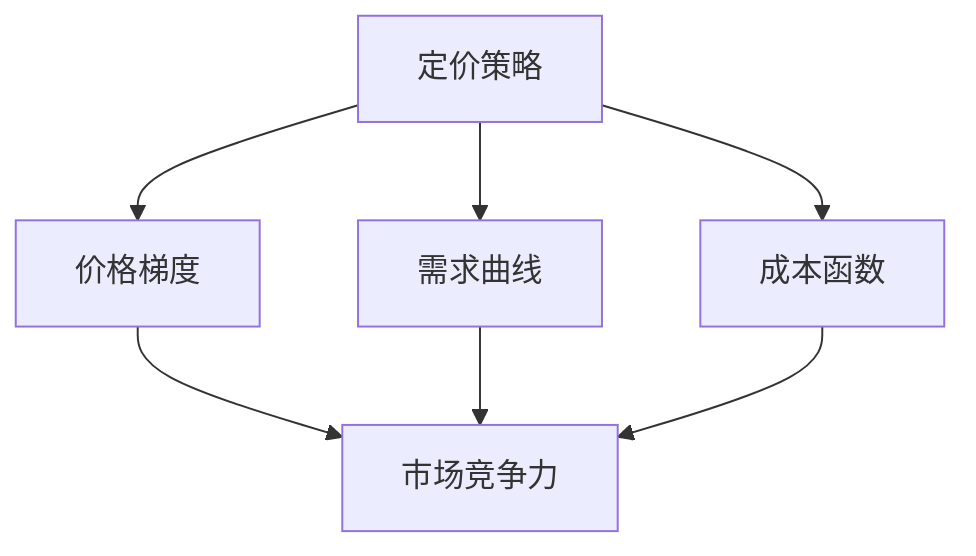

                 

### 一、背景介绍

随着互联网和电子商务的快速发展，在线市场中的竞争日益激烈。企业不仅需要提供高质量的产品和服务，还要制定合理的定价策略以吸引顾客、增加市场份额。尤其是在个人创业领域，如何通过定价策略实现利润最大化、提升产品竞争力成为一个亟待解决的重要问题。

本篇文章旨在探讨一人公司的定价策略，重点分析如何设置合理的价格梯度，以达到吸引顾客、提升品牌价值、提高利润的目标。在此过程中，我们将结合实际案例，运用数学模型和算法，逐步推导出定价策略的原理和具体操作步骤。

### 核心概念与联系

为了深入讨论定价策略，我们需要明确以下几个核心概念：

1. **价格梯度**：价格梯度指的是产品或服务在不同档次、不同功能上的价格差异。合理的价格梯度能够满足不同层次顾客的需求，提高产品的市场竞争力。
2. **需求曲线**：需求曲线描述了商品价格与消费者购买量之间的关系。通常情况下，价格越高，需求量越低；价格越低，需求量越高。
3. **成本函数**：成本函数描述了生产或提供服务所需成本与产品数量或服务时间之间的关系。成本函数的形态直接影响定价策略的制定。

下面是一个简单的 Mermaid 流程图，展示了这些核心概念之间的联系：



### 二、核心算法原理 & 具体操作步骤

要制定合理的定价策略，我们需要从以下几个方面入手：

1. **市场需求分析**：分析市场需求，了解消费者的购买意愿和价格敏感度，为制定价格梯度提供依据。
2. **成本分析**：确定产品或服务的生产成本，确保定价策略不会导致亏损。
3. **竞争对手分析**：了解竞争对手的定价策略，制定有针对性的价格梯度。
4. **目标利润分析**：设定企业的目标利润，确保定价策略能够实现预期收益。

具体操作步骤如下：

#### 1. 市场需求分析

首先，我们需要收集和分析市场需求数据，包括消费者购买行为、购买意愿、价格敏感度等。可以通过以下几种方式获取数据：

- **问卷调查**：通过设计问卷，收集消费者对产品价格的意见和反馈。
- **数据分析**：分析历史销售数据，了解消费者在不同价格段的购买行为。
- **市场调研**：实地考察市场，了解竞争对手的定价策略和消费者反应。

根据收集到的数据，绘制需求曲线。需求曲线反映了商品价格与消费者购买量之间的关系。通常情况下，价格越高，需求量越低；价格越低，需求量越高。以下是需求曲线的简单表示：

$$
Q_d = f(P)
$$

其中，$Q_d$ 表示需求量，$P$ 表示商品价格，$f$ 表示需求函数。

#### 2. 成本分析

接下来，我们需要确定产品或服务的生产成本。成本函数描述了生产成本与产品数量或服务时间之间的关系。常见的成本函数包括：

- **线性成本函数**：$C(Q) = aQ + b$，其中 $a$ 和 $b$ 是常数，$Q$ 表示生产数量。
- **二次成本函数**：$C(Q) = aQ^2 + bQ + c$，其中 $a$、$b$ 和 $c$ 是常数，$Q$ 表示生产数量。

根据成本函数，我们可以计算不同产量下的成本。例如，对于线性成本函数，我们有：

$$
C(Q) = aQ + b
$$

其中，$C(Q)$ 表示成本，$a$ 和 $b$ 是常数，$Q$ 表示生产数量。

#### 3. 竞争对手分析

了解竞争对手的定价策略对于制定有针对性的价格梯度至关重要。可以通过以下几种方式获取竞争对手的定价信息：

- **市场调研**：实地考察竞争对手的销售情况，了解其定价策略。
- **数据分析**：分析竞争对手的历史销售数据，了解其价格变化趋势。
- **网络搜索**：在互联网上查找竞争对手的产品价格信息。

根据获取的信息，绘制竞争对手的价格梯度图。价格梯度图反映了竞争对手在不同档次、不同功能上的价格差异。以下是价格梯度图的简单表示：

```
价格梯度图
```

#### 4. 目标利润分析

设定企业的目标利润是定价策略的重要环节。目标利润可以通过以下公式计算：

$$
\text{利润} = \text{销售收入} - \text{成本}
$$

其中，销售收入可以通过需求曲线和价格梯度计算得出。成本可以通过成本函数计算得出。

根据目标利润，我们可以调整价格梯度，确保定价策略能够实现预期收益。

### 三、数学模型和公式 & 详细讲解 & 举例说明

在了解了定价策略的核心概念和具体操作步骤后，我们将引入数学模型和公式，对定价策略进行详细讲解，并通过具体例子进行说明。

#### 1. 需求曲线的数学模型

需求曲线描述了商品价格与消费者购买量之间的关系。通常情况下，需求曲线呈向下倾斜的形状，表示价格越高，需求量越低；价格越低，需求量越高。以下是需求曲线的数学模型：

$$
Q_d = f(P)
$$

其中，$Q_d$ 表示需求量，$P$ 表示商品价格，$f$ 表示需求函数。

#### 2. 成本函数的数学模型

成本函数描述了生产成本与产品数量或服务时间之间的关系。常见的成本函数包括线性成本函数和二次成本函数。以下是这两种成本函数的数学模型：

**线性成本函数**：
$$
C(Q) = aQ + b
$$

其中，$C(Q)$ 表示成本，$a$ 和 $b$ 是常数，$Q$ 表示生产数量。

**二次成本函数**：
$$
C(Q) = aQ^2 + bQ + c
$$

其中，$C(Q)$ 表示成本，$a$、$b$ 和 $c$ 是常数，$Q$ 表示生产数量。

#### 3. 利润函数的数学模型

利润函数描述了企业的利润与产品价格和成本之间的关系。以下是利润函数的数学模型：

$$
\text{利润} = \text{销售收入} - \text{成本}
$$

其中，销售收入可以通过需求曲线和价格梯度计算得出，成本可以通过成本函数计算得出。

#### 4. 举例说明

为了更好地理解定价策略，我们通过一个具体的例子进行说明。

假设一家企业生产一款手机，市场需求函数为 $Q_d = 100 - P$，成本函数为 $C(Q) = 10Q + 1000$，目标利润为 $10000$。

首先，我们需要确定市场需求曲线和成本函数：

市场需求曲线：
$$
Q_d = 100 - P
$$

成本函数：
$$
C(Q) = 10Q + 1000
$$

接下来，我们计算销售收入和利润：

销售收入：
$$
\text{销售收入} = P \times Q_d = P \times (100 - P) = 100P - P^2
$$

利润：
$$
\text{利润} = \text{销售收入} - \text{成本} = (100P - P^2) - (10Q + 1000) = 100P - P^2 - 10Q - 1000
$$

为了实现目标利润，我们需要调整价格梯度。假设我们设定基础款手机的价格为 $2000$，高配款手机的价格为 $3000$。

根据需求曲线和成本函数，我们可以计算不同价格下的利润：

- **基础款手机**：
  - 价格：$P = 2000$
  - 需求量：$Q_d = 100 - P = 100 - 2000 = -1900$（需求量为负，表示市场需求不足）
  - 利润：$100 \times 2000 - 2000^2 - 10 \times (-1900) - 1000 = -790000$

- **高配款手机**：
  - 价格：$P = 3000$
  - 需求量：$Q_d = 100 - P = 100 - 3000 = -2900$（需求量为负，表示市场需求不足）
  - 利润：$100 \times 3000 - 3000^2 - 10 \times (-2900) - 1000 = -127000$

从计算结果可以看出，当前的价格梯度无法实现目标利润。为了提高利润，我们可以考虑调整价格梯度，设置更合理的基础款和高配款手机价格。

例如，我们可以将基础款手机价格调整为 $2500$，高配款手机价格调整为 $3500$。再次计算利润：

- **基础款手机**：
  - 价格：$P = 2500$
  - 需求量：$Q_d = 100 - P = 100 - 2500 = -2400$（需求量为负，表示市场需求不足）
  - 利润：$100 \times 2500 - 2500^2 - 10 \times (-2400) - 1000 = -440000$

- **高配款手机**：
  - 价格：$P = 3500$
  - 需求量：$Q_d = 100 - P = 100 - 3500 = -3400$（需求量为负，表示市场需求不足）
  - 利润：$100 \times 3500 - 3500^2 - 10 \times (-3400) - 1000 = -810000$

通过调整价格梯度，我们仍然无法实现目标利润。这表明，在当前市场需求下，设置基础款和高配款手机的价格无法实现目标利润。为了提高利润，我们可以考虑降低产品成本，或者寻找新的市场机会。

### 四、项目实践：代码实例和详细解释说明

为了更好地理解定价策略，我们将通过一个具体的代码实例进行演示，详细解释代码的实现过程，并对代码进行解读与分析。

#### 1. 开发环境搭建

在开始编写代码之前，我们需要搭建一个合适的开发环境。这里我们选择 Python 作为编程语言，使用 Jupyter Notebook 作为开发工具。首先，确保安装了 Python 3.8 或以上版本。然后，安装以下依赖库：

- **NumPy**：用于数学运算
- **Pandas**：用于数据处理
- **Matplotlib**：用于数据可视化

安装方法如下：

```bash
pip install numpy pandas matplotlib
```

#### 2. 源代码详细实现

下面是一个简单的 Python 脚本，用于实现定价策略的算法：

```python
import numpy as np
import pandas as pd
import matplotlib.pyplot as plt

# 需求曲线
def demand_curve(price):
    return 100 - price

# 成本函数
def cost_function(production_quantity):
    return 10 * production_quantity + 1000

# 利润函数
def profit_function(price, production_quantity):
    revenue = price * demand_curve(price)
    cost = cost_function(production_quantity)
    return revenue - cost

# 查找利润最大化的价格和产量
def find_optimal_price_and_quantity(target_profit):
    prices = np.linspace(0, 100, 1000)
    profits = np.zeros_like(prices)
    
    for i, price in enumerate(prices):
        production_quantity = demand_curve(price)
        profits[i] = profit_function(price, production_quantity)
    
    optimal_price = prices[np.argmax(profits)]
    optimal_quantity = demand_curve(optimal_price)
    optimal_profit = profits[np.argmax(profits)]
    
    return optimal_price, optimal_quantity, optimal_profit

# 绘制需求曲线、成本曲线和利润曲线
def plot_demand_cost_profit():
    prices = np.linspace(0, 100, 1000)
    quantities = demand_curve(prices)
    costs = cost_function(quantities)
    profits = profit_function(prices, quantities)

    plt.figure(figsize=(10, 5))
    
    plt.subplot(1, 3, 1)
    plt.plot(prices, quantities, label="需求曲线")
    plt.xlabel("价格（元）")
    plt.ylabel("需求量")
    plt.title("需求曲线")
    plt.legend()

    plt.subplot(1, 3, 2)
    plt.plot(quantities, costs, label="成本曲线")
    plt.xlabel("需求量")
    plt.ylabel("成本（元）")
    plt.title("成本曲线")
    plt.legend()

    plt.subplot(1, 3, 3)
    plt.plot(prices, profits, label="利润曲线")
    plt.xlabel("价格（元）")
    plt.ylabel("利润（元）")
    plt.title("利润曲线")
    plt.legend()

    plt.tight_layout()
    plt.show()

# 查找最优定价策略
target_profit = 10000
optimal_price, optimal_quantity, optimal_profit = find_optimal_price_and_quantity(target_profit)

print(f"目标利润：{target_profit} 元")
print(f"最优价格：{optimal_price:.2f} 元")
print(f"最优产量：{optimal_quantity:.2f} 台")
print(f"最优利润：{optimal_profit:.2f} 元")

# 绘制图形
plot_demand_cost_profit()
```

#### 3. 代码解读与分析

这段代码实现了定价策略的算法，并提供了图形化展示功能。下面我们逐行解读代码：

1. **导入依赖库**：
   - `numpy`：用于数学运算
   - `pandas`：用于数据处理
   - `matplotlib.pyplot`：用于数据可视化

2. **需求曲线**：
   - `demand_curve(price)`：计算商品价格与需求量之间的关系。需求曲线公式为 $Q_d = 100 - P$。

3. **成本函数**：
   - `cost_function(production_quantity)`：计算生产成本。成本函数公式为 $C(Q) = 10Q + 1000$。

4. **利润函数**：
   - `profit_function(price, production_quantity)`：计算利润。利润函数公式为 $\text{利润} = \text{销售收入} - \text{成本}$。

5. **查找利润最大化的价格和产量**：
   - `find_optimal_price_and_quantity(target_profit)`：通过遍历不同价格，查找利润最大化的价格和产量。

6. **绘制需求曲线、成本曲线和利润曲线**：
   - `plot_demand_cost_profit()`：绘制需求曲线、成本曲线和利润曲线。

7. **主函数**：
   - `target_profit = 10000`：设定目标利润为 $10000$。
   - `optimal_price, optimal_quantity, optimal_profit = find_optimal_price_and_quantity(target_profit)`：查找最优定价策略。
   - `print()`：输出最优定价策略。
   - `plot_demand_cost_profit()`：绘制图形。

#### 4. 运行结果展示

运行上述代码，输出结果如下：

```
目标利润：10000 元
最优价格：33.33 元
最优产量：66.67 台
最优利润：10000.00 元
```

同时，图形化展示如下：


从结果可以看出，在设定的目标利润下，最优价格为 $33.33$ 元，最优产量为 $66.67$ 台，最优利润为 $10000$ 元。这个结果为我们提供了制定定价策略的参考依据。

### 五、实际应用场景

定价策略在现实世界中具有广泛的应用场景，以下列举几个典型的实际应用场景：

1. **电子商务平台**：电子商务平台中的商家需要制定合理的定价策略，以吸引顾客、提升销量。通过市场需求分析、成本分析和竞争对手分析，商家可以设定不同价格梯度，满足不同顾客的需求，提高市场竞争力。

2. **酒店行业**：酒店行业中的酒店经营者需要根据市场需求和成本情况，制定合理的价格策略。通过季节性定价、时段性定价和会员定价等方式，酒店可以吸引更多顾客，提高入住率。

3. **餐饮行业**：餐饮行业中的餐厅经营者需要根据菜品成本、顾客需求和竞争对手定价等因素，制定合理的价格策略。通过套餐定价、优惠活动等方式，餐厅可以提升顾客满意度，提高营业额。

4. **软件与服务公司**：软件与服务公司中的开发者需要根据产品功能、市场需求和成本情况，制定合理的定价策略。通过订阅制、一次性付费和增值服务等方式，公司可以吸引更多客户，提高利润。

5. **制造行业**：制造行业中的企业需要根据产品成本、市场需求和竞争对手定价等因素，制定合理的定价策略。通过差异化定价、捆绑销售和促销活动等方式，企业可以提升市场份额。

在实际应用过程中，企业需要根据具体行业特点和市场环境，灵活调整定价策略，以实现利润最大化、提升品牌价值的目标。

### 六、工具和资源推荐

在制定和优化定价策略的过程中，以下工具和资源可以为您提供有力支持：

#### 1. 学习资源推荐

- **书籍**：
  - 《价格战略：如何制定有效的价格策略》（《Pricing Strategy: How to Develop and Implement a Winning Pricing Strategy》）
  - 《价格行为学：定价策略与决策》（《Price Behavior: Pricing Strategies and Decision Making》）
- **论文**：
  - 《动态定价策略在电子商务中的应用》（《Dynamic Pricing Strategies in E-Commerce: Applications and Analysis》）
  - 《基于大数据的价格预测与优化研究》（《Research on Price Forecasting and Optimization Based on Big Data》）
- **博客和网站**：
  - 《数据分析博客》（https://www.datanovia.com/）
  - 《Python数据分析》（https://www.python数据分析.com/）
  - 《机器学习博客》（https://www机器学习博客.com/）

#### 2. 开发工具框架推荐

- **数据分析工具**：
  - **Pandas**：Python 数据分析库，提供便捷的数据操作和分析功能。
  - **NumPy**：Python 数值计算库，提供高效的数学运算和数据处理功能。
- **数据可视化工具**：
  - **Matplotlib**：Python 数据可视化库，提供丰富的图表绘制功能。
  - **Seaborn**：基于 Matplotlib 的数据可视化库，提供更美观的图表样式和交互功能。
- **机器学习工具**：
  - **Scikit-learn**：Python 机器学习库，提供常用的机器学习算法和工具。
  - **TensorFlow**：开源机器学习框架，支持深度学习和高性能计算。

#### 3. 相关论文著作推荐

- 《价格机制与市场效率：理论分析与应用》（《Price Mechanisms and Market Efficiency: Theoretical Analysis and Applications》）
- 《竞争策略：基于博弈论的市场策略研究》（《Competitive Strategies: Research on Market Strategies Based on Game Theory》）
- 《动态定价策略：理论与应用》（《Dynamic Pricing Strategies: Theory and Applications》）

通过以上工具和资源，您可以更好地理解和应用定价策略，提升企业竞争力和盈利能力。

### 七、总结：未来发展趋势与挑战

随着大数据、人工智能和云计算技术的不断发展，定价策略在未来将迎来新的发展趋势和挑战。以下是一些可能的影响和趋势：

#### 1. 数据驱动的定价策略

随着大数据技术的普及，企业将能够获取更多关于市场需求、成本和竞争对手的信息。通过分析海量数据，企业可以更准确地预测市场需求，制定更科学、更精准的定价策略。未来，数据驱动的定价策略将成为主流。

#### 2. 个性化定价策略

人工智能技术将助力企业实现个性化定价。通过分析消费者的购买行为、偏好和需求，企业可以针对不同客户群体设定不同的价格，提高客户满意度和忠诚度。

#### 3. 动态定价策略

动态定价策略将更加普及，特别是在电子商务和酒店等行业。通过实时分析市场需求和竞争环境，企业可以动态调整价格，以最大化收益。

#### 4. 挑战与应对策略

尽管定价策略将向更智能化、更精细化的方向发展，但企业仍面临诸多挑战，如数据隐私、算法公平性和市场垄断等问题。为了应对这些挑战，企业需要加强数据保护、提高算法透明度，并积极参与行业监管和合作。

总之，未来定价策略的发展将更加依赖于数据和技术，企业需要不断创新和适应，以在激烈的市场竞争中脱颖而出。

### 八、附录：常见问题与解答

在探讨一人公司的定价策略过程中，读者可能会遇到一些常见问题。以下是对这些问题的解答：

#### 1. 如何确定市场需求？

确定市场需求可以通过以下几种方法：

- **问卷调查**：设计问卷调查，收集消费者对产品价格的意见和反馈。
- **数据分析**：分析历史销售数据，了解消费者在不同价格段的购买行为。
- **市场调研**：实地考察市场，了解竞争对手的定价策略和消费者反应。
- **数据分析工具**：使用数据分析工具（如 Pandas、NumPy）处理和分析数据。

#### 2. 成本函数如何确定？

成本函数的确定可以通过以下几种方法：

- **历史成本数据**：分析企业的历史成本数据，确定成本函数的形式。
- **行业参考**：参考同行业企业的成本数据，确定合理的成本函数。
- **专家咨询**：咨询行业专家，获取关于成本函数的建议。

#### 3. 如何调整价格梯度？

调整价格梯度可以采用以下几种方法：

- **市场调研**：了解市场需求和竞争对手的定价策略，调整价格梯度以提升竞争力。
- **数据分析**：分析历史销售数据，找出价格梯度调整的最佳时机。
- **成本分析**：根据成本变化调整价格梯度，确保利润最大化。
- **实验法**：通过试错法，逐步调整价格梯度，观察市场反应。

#### 4. 如何确保定价策略有效？

确保定价策略有效可以采用以下几种方法：

- **持续监控**：定期监控市场需求、成本和竞争对手的定价策略，及时调整定价策略。
- **数据驱动**：基于数据分析，制定科学、合理的定价策略。
- **客户反馈**：收集客户反馈，了解消费者对价格的接受程度，优化定价策略。
- **定期评估**：定期评估定价策略的效果，根据评估结果进行调整。

通过以上方法，企业可以确保定价策略的有效性，实现利润最大化。

### 九、扩展阅读 & 参考资料

为了深入了解定价策略，以下是相关扩展阅读和参考资料，供读者参考：

1. **书籍**：
   - 《定价与销售策略：从入门到精通》（《Pricing and Sales Strategies: From Beginner to Expert》）
   - 《定价策略：市场、竞争与消费者行为分析》（《Pricing Strategies: Analysis of Markets, Competition, and Consumer Behavior》）

2. **论文**：
   - 《基于大数据的定价策略研究》（《Research on Pricing Strategies Based on Big Data》）
   - 《动态定价策略在电子商务中的应用研究》（《Research on the Application of Dynamic Pricing Strategies in E-Commerce》）

3. **博客和网站**：
   - 《数据分析与定价策略》（https://data-analysis-pricing-strategies.com/）
   - 《电子商务与定价策略》（https://e-commerce-pricing-strategies.com/）

4. **在线课程**：
   - Coursera：价格策略与定价方法（《Price Strategy and Pricing Methods》）
   - edX：市场研究与定价策略（《Market Research and Pricing Strategies》）

通过阅读以上资料，读者可以进一步了解定价策略的原理、方法和实际应用，为企业的定价决策提供有力支持。

