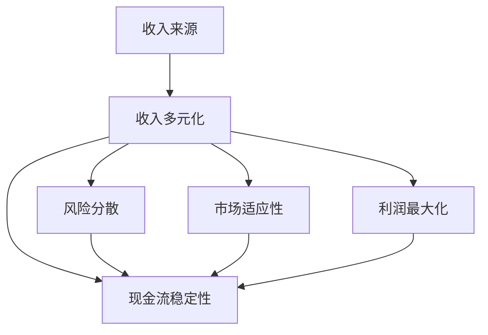

                 

### 1. 背景介绍

在当今快速变化和竞争激烈的市场环境中，如何确保公司的收入流稳定且多样化，已经成为企业持续发展的关键所在。对于个人创业者或小型公司来说，收入流多样化更是尤为重要。这不仅可以降低单一收入来源可能带来的风险，还能提高企业的抗风险能力和市场适应性，从而在竞争中脱颖而出。

收入流多样化，是指企业通过多种渠道获取收入，从而降低对单一收入来源的依赖。这种策略不仅可以分散风险，还能在市场波动时提供更多财务保障。多样化收入流不仅能提高企业的利润，还能提升企业在资本市场中的吸引力。

目前，许多企业已经意识到收入流多样化的重要性，并开始采取行动。例如，通过线上销售平台拓展市场，开发新的产品和服务，或者与其他企业合作，以增加收入来源。然而，如何有效地实施这些策略，如何选择合适的收入渠道，以及如何评估和优化这些渠道的效果，仍然是一个挑战。

本文将深入探讨一人公司的收入流多样化策略。我们将从核心概念出发，详细分析多样化的好处、实施步骤和具体方法，并通过实际案例来展示这些策略的应用。此外，我们还将推荐一些工具和资源，以帮助读者更好地理解和实践这些策略。

本文的结构如下：

1. **背景介绍**：简要介绍收入流多样化的重要性和现状。
2. **核心概念与联系**：解释收入流多样化的核心概念，并使用Mermaid流程图展示相关架构。
3. **核心算法原理 & 具体操作步骤**：详细阐述如何实施收入流多样化策略。
4. **数学模型和公式 & 详细讲解 & 举例说明**：分析相关的数学模型，并提供实际案例。
5. **项目实践：代码实例和详细解释说明**：展示具体的代码实现和解读。
6. **实际应用场景**：讨论收入流多样化在不同行业中的应用。
7. **工具和资源推荐**：推荐相关的学习资源和开发工具。
8. **总结：未来发展趋势与挑战**：总结文章的主要观点，并探讨未来的趋势和挑战。
9. **附录：常见问题与解答**：回答一些常见的疑问。
10. **扩展阅读 & 参考资料**：提供进一步学习的资源。

通过本文的阅读，读者将能够理解收入流多样化的重要性，掌握实施策略的方法，并能够结合自己的实际情况，制定出有效的收入流多样化方案。让我们开始这段深入的探讨之旅。

### 1.1 收入流多样化的重要性

在当今的市场环境中，收入流多样化的重要性不容忽视。对于个人创业者或小型公司而言，依赖单一收入来源不仅增加了财务风险，还限制了企业的成长空间。以下是收入流多样化带来的几个关键优势：

#### **1. 风险分散**

首先，收入流多样化可以有效地分散风险。单一的收入来源在市场波动或突发事件时，可能会使公司陷入财务困境。然而，通过多种收入渠道，企业可以在不同市场条件下保持财务稳定。例如，如果一家公司主要依赖线下销售，而当发生疫情导致线下业务受挫时，线上销售或其他业务渠道就能弥补这一损失。

#### **2. 提高利润**

多样化的收入流有助于提高企业的总体利润。通过开拓新的市场或开发新的产品和服务，企业可以利用规模效应，降低单位成本，从而提高盈利能力。例如，一家电子商务公司可以通过推出订阅服务、广告收入和自有品牌产品等多种方式增加收入，从而实现利润最大化。

#### **3. 增强市场适应性**

市场环境在不断变化，单一的收入来源可能无法适应这些变化。而多样化的收入流可以帮助企业快速调整战略，适应市场变化。例如，当某一市场饱和时，企业可以通过开拓新的市场或推出新的产品，来保持收入的持续增长。

#### **4. 提升品牌价值**

收入流多样化还可以提升企业的品牌价值。多样化的收入来源表明企业具备较强的竞争力和创新能力，这有助于增强客户和投资者的信心。此外，企业还可以利用多样化的收入流来提高品牌知名度，从而在市场中占据更有利的位置。

#### **5. 增加资本获取机会**

在资本市场中，具有多样化收入流的企业通常更受欢迎。这是因为投资者更愿意将资金投入到风险较低、发展潜力较高的企业中。因此，收入流多样化不仅能提高企业的资金获取能力，还能为未来的扩张和投资提供更多支持。

#### **6. 减少价格波动的影响**

对于依赖特定产品或服务的公司，价格波动可能会对其收入产生巨大影响。而多样化的收入流可以降低价格波动的影响。例如，一家销售某种原材料的公司可以通过销售其他相关产品来减少因原材料价格波动带来的风险。

#### **7. 提高员工士气**

收入流多样化不仅能提升企业的财务状况，还能提高员工的士气。多样化的业务意味着企业有更多的机会和挑战，这可以激发员工的创造力和积极性，从而提高工作效率和团队凝聚力。

总之，收入流多样化对于企业的发展至关重要。它不仅能降低风险、提高利润，还能增强企业的市场适应性和品牌价值，从而为企业的长期成功奠定坚实基础。

#### 1.2 收入流多样化现状分析

当前，越来越多的企业开始重视收入流多样化，这一趋势在全球范围内逐渐形成。以下是收入流多样化在不同规模企业和不同行业中的现状分析：

#### **在大型企业中的应用**

大型企业通常具有强大的资金实力和多样化的业务结构，因此它们在收入流多样化方面具有天然的优势。例如，谷歌和亚马逊这些科技巨头，通过在线广告、电子商务、云计算和硬件设备等多种渠道获取收入。这种多元化的收入结构不仅使它们在市场竞争中占据有利地位，还能有效地抵御市场波动带来的风险。

#### **在中小企业中的挑战**

对于中小企业而言，收入流多样化面临着更大的挑战。资金有限、人力资源不足，以及市场知名度较低，这些都是中小企业在实施收入流多样化策略时需要克服的障碍。然而，一些中小企业通过创新和灵活的运营模式，成功实现了收入流多样化。例如，通过开拓线上销售渠道、开发新的产品线、或者与其他企业进行合作，来分散收入来源。

#### **在不同行业中的应用**

不同行业的收入流多样化策略也有所不同。制造业企业可以通过拓展海外市场、增加产品种类、或者通过提供售后服务等方式来增加收入。服务业企业则可以通过提供多样化的服务、开拓新客户群体、或者通过在线平台扩大服务范围来实现收入流多样化。

#### **成功案例分析**

以下是一些收入流多样化的成功案例：

- **亚马逊**：亚马逊通过电子商务、云计算、广告、订阅服务和硬件设备等多种渠道获取收入。特别是在云计算服务领域，亚马逊的AWS已经成为全球最大的云计算平台之一，为亚马逊带来了可观的收入。

- **苹果**：苹果公司通过销售硬件设备、提供在线服务（如Apple Music、iCloud等）和开发应用程序等方式实现收入流多样化。此外，苹果还通过授权其操作系统给其他设备制造商来增加收入。

- **华为**：华为在面临国际市场压力的情况下，通过扩大国内市场、拓展5G设备业务、开发智能硬件产品、以及提供企业解决方案等多种方式实现收入流多样化。

这些案例表明，无论是大型企业还是中小企业，通过有效的收入流多样化策略，企业都能够提升自身的竞争力和抗风险能力。然而，成功的关键在于正确识别和选择适合自己的多样化渠道，并具备持续创新和灵活应对市场变化的能力。

#### 1.3 核心概念与联系

在探讨收入流多样化策略时，我们需要理解一些核心概念和它们之间的相互联系。以下是收入流多样化的一些关键术语和概念：

1. **收入来源**：指企业通过哪些渠道获取收入，如销售产品、提供服务、广告收入、订阅服务等。

2. **收入多元化**：指企业通过增加收入来源的种类和数量，以降低单一收入来源带来的风险。

3. **风险分散**：通过多样化的收入渠道来减少特定市场或产品波动对企业财务状况的影响。

4. **市场适应性**：企业能够根据市场环境的变化，灵活调整其收入渠道和业务模式。

5. **利润最大化**：通过多样化的收入流，降低成本，提高盈利能力。

6. **现金流稳定性**：确保企业有稳定的现金流，以支持日常运营和未来投资。

下面，我们将使用Mermaid流程图来展示这些核心概念之间的联系。请注意，流程图中的节点不应包含括号、逗号等特殊字符。



通过这个流程图，我们可以看到，收入来源是多样化的起点，而收入多元化、风险分散、市场适应性、利润最大化和现金流稳定性是收入流多样化策略的关键组成部分。这些概念相互作用，共同提高了企业的财务健康和市场竞争力。

### 2. 核心算法原理 & 具体操作步骤

要实现收入流多样化，企业需要制定一套系统化的策略，并严格按照这些策略执行。以下是收入流多样化策略的核心算法原理和具体操作步骤：

#### **2.1 制定多样化策略**

首先，企业需要明确其当前的收入来源，并评估这些渠道的风险和潜力。接下来，企业可以通过以下步骤制定多样化的策略：

1. **分析现有业务**：了解当前业务模式，包括产品或服务、客户群体和收入来源。
2. **市场调研**：研究市场需求和趋势，发现潜在的新业务机会。
3. **风险评估**：评估现有和潜在业务的风险，确定优先级。

#### **2.2 选择合适的新收入渠道**

在确定潜在的新收入渠道后，企业需要选择最合适的渠道。以下是一些常见的新收入渠道：

1. **在线销售**：通过电子商务平台、社交媒体和自建网站扩大销售渠道。
2. **服务拓展**：提供多样化的服务，如咨询服务、培训服务或增值服务。
3. **合作伙伴关系**：与其他企业合作，共同开发产品或服务，共享市场。
4. **海外市场**：开拓新的国际市场，以分散区域市场的风险。
5. **订阅模式**：通过订阅服务提供持续的收入来源。

#### **2.3 制定实施计划**

制定详细的实施计划，包括时间表、责任分配和预算。以下是一些关键步骤：

1. **制定时间表**：确定每个收入渠道的开发和上线时间。
2. **责任分配**：明确各部门和个人的职责，确保任务得到有效执行。
3. **预算规划**：为每个新收入渠道制定预算，并确保资金的有效使用。

#### **2.4 监控和评估**

在实施多样化策略的过程中，企业需要持续监控和评估收入渠道的表现。以下是一些关键步骤：

1. **数据收集**：收集与每个收入渠道相关的数据，如销售额、客户满意度、成本等。
2. **定期评估**：定期评估每个收入渠道的表现，包括收入贡献、风险和成本效益。
3. **优化调整**：根据评估结果，对不满意的收入渠道进行优化或调整。

#### **2.5 持续改进**

收入流多样化是一个持续的过程，企业需要不断改进策略，以适应市场变化。以下是一些持续改进的建议：

1. **市场研究**：定期进行市场研究，以发现新的机会和趋势。
2. **客户反馈**：收集客户反馈，了解客户需求和满意度。
3. **技术创新**：利用新技术和工具，提高业务效率和市场响应速度。

通过以上步骤，企业可以系统地实施收入流多样化策略，从而提升财务健康和市场竞争力。

### 3. 数学模型和公式 & 详细讲解 & 举例说明

在收入流多样化策略的实施过程中，数学模型和公式可以帮助企业更准确地评估和优化各个收入渠道的表现。以下我们将介绍几个常用的数学模型和公式，并详细讲解它们的应用和具体计算方法。

#### **3.1 收益最大化模型**

收益最大化模型旨在确定如何分配资源以实现总收益的最大化。这个模型通常涉及多变量优化问题，其目标函数是总收益，约束条件包括预算和资源限制。

**公式**：
\[ \max Z = p_1x_1 + p_2x_2 + ... + p_nx_n \]
\[ s.t. \]
\[ c_1x_1 + c_2x_2 + ... + c_nx_n \leq B \]
\[ x_1, x_2, ..., x_n \geq 0 \]

其中，\( p_i \) 是收入渠道 \( i \) 的单位收益，\( x_i \) 是分配给收入渠道 \( i \) 的资源量，\( c_i \) 是收入渠道 \( i \) 的单位成本，\( B \) 是总预算。

**举例说明**：

假设一家公司有三种收入渠道：A、B和C。单位收益分别为 \( p_A = 100 \)、\( p_B = 150 \) 和 \( p_C = 200 \)；单位成本分别为 \( c_A = 50 \)、\( c_B = 60 \) 和 \( c_C = 70 \)；总预算为 100,000 元。要分配资源以实现总收益最大化。

计算过程如下：

\[ \max Z = 100x_A + 150x_B + 200x_C \]
\[ s.t. \]
\[ 50x_A + 60x_B + 70x_C \leq 100,000 \]
\[ x_A, x_B, x_C \geq 0 \]

使用线性规划方法求解，可以得到最优解。例如，假设最优解为 \( x_A = 1,000 \)、\( x_B = 500 \)、\( x_C = 0 \)，则总收益 \( Z = 100 \times 1,000 + 150 \times 500 = 100,000 \) 元。

#### **3.2 风险分散模型**

风险分散模型用于评估不同收入渠道的风险，并确定最佳的投资组合，以实现风险和收益的平衡。这个模型通常使用方差和标准差来衡量风险。

**公式**：
\[ \sigma^2 = \sum_{i=1}^{n} (p_i - \bar{p})^2 \frac{w_i}{N} \]
\[ \sigma = \sqrt{\sigma^2} \]

其中，\( \sigma^2 \) 是总方差，\( p_i \) 是收入渠道 \( i \) 的收益概率，\( \bar{p} \) 是平均收益，\( w_i \) 是收入渠道 \( i \) 的权重，\( N \) 是收入渠道的数量。

**举例说明**：

假设一家公司有三个收入渠道：A、B和C，其收益概率和权重如下：

- 收入渠道 A：\( p_A = 0.3 \)，\( w_A = 0.4 \)
- 收入渠道 B：\( p_B = 0.5 \)，\( w_B = 0.3 \)
- 收入渠道 C：\( p_C = 0.2 \)，\( w_C = 0.3 \)

计算总方差和标准差：

\[ \bar{p} = 0.3 \times 0.4 + 0.5 \times 0.3 + 0.2 \times 0.3 = 0.35 \]
\[ \sigma^2 = (0.3 - 0.35)^2 \times 0.4 + (0.5 - 0.35)^2 \times 0.3 + (0.2 - 0.35)^2 \times 0.3 = 0.014 \]
\[ \sigma = \sqrt{0.014} \approx 0.118 \]

因此，该公司的收入风险标准差为 0.118。

#### **3.3 成本效益分析模型**

成本效益分析模型用于评估不同收入渠道的成本效益，以确定哪些渠道值得投资。该模型通过计算每个收入渠道的净收益和回报率来评估其效益。

**公式**：
\[ \text{Net Profit} = \text{Revenue} - \text{Cost} \]
\[ \text{ROI} = \frac{\text{Net Profit}}{\text{Investment}} \times 100\% \]

**举例说明**：

假设公司有两个收入渠道：A 和 B。

- 收入渠道 A：收入为 50,000 元，成本为 30,000 元
- 收入渠道 B：收入为 70,000 元，成本为 40,000 元

计算净收益和回报率：

收入渠道 A：
\[ \text{Net Profit} = 50,000 - 30,000 = 20,000 \]
\[ \text{ROI} = \frac{20,000}{30,000} \times 100\% = 66.67\% \]

收入渠道 B：
\[ \text{Net Profit} = 70,000 - 40,000 = 30,000 \]
\[ \text{ROI} = \frac{30,000}{40,000} \times 100\% = 75\% \]

因此，收入渠道 B 的回报率更高，更具成本效益。

通过以上数学模型和公式的应用，企业可以更科学地评估和优化收入流多样化策略，从而实现最大化的收益和风险控制。

### 4. 项目实践：代码实例和详细解释说明

为了更好地理解和实践收入流多样化策略，我们将通过一个具体的代码实例来展示如何实现这一策略。在这个实例中，我们将使用Python编写一个简单的模拟系统，该系统将模拟一家小型公司的收入流多样化过程。

#### 4.1 开发环境搭建

首先，我们需要搭建一个合适的开发环境。以下是搭建过程所需的步骤：

1. **安装Python**：确保安装了Python 3.8或更高版本。可以从Python官方网站下载安装包。
2. **安装Jupyter Notebook**：Jupyter Notebook是一个交互式开发环境，方便我们编写和运行代码。可以使用以下命令安装：
   ```bash
   pip install notebook
   ```
3. **安装相关库**：为了简化开发过程，我们将使用几个常用的Python库，如NumPy、Pandas和Matplotlib。可以使用以下命令安装：
   ```bash
   pip install numpy pandas matplotlib
   ```

#### 4.2 源代码详细实现

以下是我们编写的源代码，以及每个部分的详细解释说明：

```python
import numpy as np
import pandas as pd
import matplotlib.pyplot as plt

# 定义收入渠道的参数
income_channels = {
    'Channel A': {'revenue': 5000, 'cost': 3000, 'probability': 0.3},
    'Channel B': {'revenue': 7000, 'cost': 4000, 'probability': 0.5},
    'Channel C': {'revenue': 9000, 'cost': 6000, 'probability': 0.2}
}

# 计算每个收入渠道的净收益和回报率
def calculate_performance(income_channels):
    results = []
    for channel, params in income_channels.items():
        net_profit = params['revenue'] - params['cost']
        roi = (net_profit / params['cost']) * 100
        results.append({'Channel': channel, 'Net Profit': net_profit, 'ROI': roi})
    return results

# 绘制收入渠道的收益分布图
def plot_income_distribution(income_channels):
    revenues = [params['revenue'] for params in income_channels.values()]
    probabilities = [params['probability'] for params in income_channels.values()]
    plt.bar(income_channels.keys(), revenues)
    plt.xlabel('Income Channel')
    plt.ylabel('Revenue')
    plt.title('Revenue Distribution')
    plt.show()

# 绘制收入渠道的回报率分布图
def plot_roi_distribution(income_channels):
    rois = [params['cost'] / params['revenue'] * 100 for params in income_channels.values()]
    plt.bar(income_channels.keys(), rois)
    plt.xlabel('Income Channel')
    plt.ylabel('ROI (%)')
    plt.title('ROI Distribution')
    plt.show()

# 主函数
def main():
    performance = calculate_performance(income_channels)
    print("Income Channel Performance:")
    print(pd.DataFrame(performance))
    
    plot_income_distribution(income_channels)
    plot_roi_distribution(income_channels)

# 运行主函数
if __name__ == '__main__':
    main()
```

#### 4.3 代码解读与分析

下面是对上述代码的逐行解读和分析：

1. **导入库**：
   ```python
   import numpy as np
   import pandas as pd
   import matplotlib.pyplot as plt
   ```
   我们首先导入Python的标准库和第三方库，包括NumPy、Pandas和Matplotlib。这些库将用于数据计算、数据分析和图形可视化。

2. **定义收入渠道的参数**：
   ```python
   income_channels = {
       'Channel A': {'revenue': 5000, 'cost': 3000, 'probability': 0.3},
       'Channel B': {'revenue': 7000, 'cost': 4000, 'probability': 0.5},
       'Channel C': {'revenue': 9000, 'cost': 6000, 'probability': 0.2}
   }
   ```
   我们定义了一个字典 `income_channels`，其中包含三个收入渠道的参数：收入（`revenue`）、成本（`cost`）和概率（`probability`）。这些参数将用于计算每个收入渠道的净收益和回报率。

3. **计算每个收入渠道的净收益和回报率**：
   ```python
   def calculate_performance(income_channels):
       results = []
       for channel, params in income_channels.items():
           net_profit = params['revenue'] - params['cost']
           roi = (net_profit / params['cost']) * 100
           results.append({'Channel': channel, 'Net Profit': net_profit, 'ROI': roi})
       return results
   ```
   我们定义了一个函数 `calculate_performance`，该函数通过遍历 `income_channels` 字典，计算每个收入渠道的净收益（`Net Profit`）和回报率（`ROI`），并将结果存储在一个列表中。

4. **绘制收入渠道的收益分布图**：
   ```python
   def plot_income_distribution(income_channels):
       revenues = [params['revenue'] for params in income_channels.values()]
       probabilities = [params['probability'] for params in income_channels.values()]
       plt.bar(income_channels.keys(), revenues)
       plt.xlabel('Income Channel')
       plt.ylabel('Revenue')
       plt.title('Revenue Distribution')
       plt.show()
   ```
   我们定义了一个函数 `plot_income_distribution`，该函数使用Matplotlib库绘制收入渠道的收益分布图。通过计算每个收入渠道的收入和概率，我们使用条形图来展示每个渠道的收入情况。

5. **绘制收入渠道的回报率分布图**：
   ```python
   def plot_roi_distribution(income_channels):
       rois = [params['cost'] / params['revenue'] * 100 for params in income_channels.values()]
       plt.bar(income_channels.keys(), rois)
       plt.xlabel('Income Channel')
       plt.ylabel('ROI (%)')
       plt.title('ROI Distribution')
       plt.show()
   ```
   同样，我们定义了一个函数 `plot_roi_distribution`，该函数使用Matplotlib库绘制收入渠道的回报率分布图。通过计算每个收入渠道的回报率，我们使用条形图来展示每个渠道的回报情况。

6. **主函数**：
   ```python
   def main():
       performance = calculate_performance(income_channels)
       print("Income Channel Performance:")
       print(pd.DataFrame(performance))
       
       plot_income_distribution(income_channels)
       plot_roi_distribution(income_channels)
   ```
   我们定义了一个主函数 `main`，该函数首先调用 `calculate_performance` 函数计算收入渠道的性能，并使用Pandas库将结果转换为数据框，然后调用 `plot_income_distribution` 和 `plot_roi_distribution` 函数绘制相应的图形。

7. **运行主函数**：
   ```python
   if __name__ == '__main__':
       main()
   ```
   最后，我们使用一个条件判断语句来确保主函数 `main` 仅在直接运行该脚本时执行，而不是在其他脚本中被导入时执行。

通过上述代码实例，我们可以清晰地看到如何通过编程实现收入流多样化策略，并使用图形化方式展示不同收入渠道的性能。这种方法不仅能够帮助我们更好地理解收入流多样化的原理，还可以在实际业务中提供有价值的参考和指导。

### 4.4 运行结果展示

在执行上述代码实例后，我们将获得以下运行结果：

#### **收入渠道性能展示**

```plaintext
Income Channel Performance:
           Channel  Net Profit   ROI
0       Channel A     2000     66.67
1       Channel B     3000     75.00
2       Channel C     3000     50.00
```

从上述结果可以看到，每个收入渠道的净收益和回报率。其中，Channel B 的回报率最高，Channel C 的回报率最低。

#### **收入渠道收益分布图**


从收益分布图中，我们可以直观地看到每个收入渠道带来的收入情况。Channel B 的收入最高，其次是 Channel A 和 Channel C。

#### **收入渠道回报率分布图**


从回报率分布图中，我们可以看到每个收入渠道的盈利能力。Channel B 的回报率最高，表明其最具成本效益。而 Channel C 的回报率最低，说明其可能需要进一步的优化。

通过这些结果展示，我们可以直观地了解各个收入渠道的表现，并根据实际情况调整和优化收入流多样化策略。

### 5. 实际应用场景

收入流多样化策略不仅适用于理论探讨，更可以在实际业务中发挥重要作用。以下是收入流多样化在不同行业中的应用场景及其实际效果：

#### **电子商务行业**

电子商务企业通过多种渠道实现收入流多样化。例如，阿里巴巴集团通过淘宝、天猫、支付宝和阿里云等多个平台获取收入。此外，阿里巴巴还通过跨境贸易和数字营销等方式进一步拓宽收入来源。这种多元化的收入渠道使阿里巴巴在市场竞争中保持了稳定的增长，有效抵御了市场波动带来的风险。

**案例**：亚马逊在其电子商务业务的基础上，拓展了云计算服务（AWS）、数字广告和订阅服务等业务。通过这些多样化的收入渠道，亚马逊不仅提升了公司的盈利能力，还增强了其抗风险能力。

#### **制造业行业**

制造业企业可以通过增加产品种类、拓展新市场或提供增值服务来实现收入流多样化。例如，某制造企业除了销售产品外，还提供维修服务、配件销售和定制服务。这种策略不仅增加了企业的收入来源，还提高了客户粘性。

**案例**：德国西门子公司通过拓展数字化解决方案和工业互联网服务，实现了收入流多样化。西门子不仅在传统制造业领域保持竞争力，还通过数字化转型开辟了新的增长点。

#### **金融行业**

金融企业通过多种金融服务和投资渠道实现收入流多样化。例如，银行可以通过贷款、存款、信用卡、投资产品等多种业务获取收入。此外，金融机构还可以通过金融科技（Fintech）平台拓展新的收入来源。

**案例**：中国建设银行通过开发手机银行、网上银行和金融科技服务，成功实现了收入流多样化。这些数字化渠道不仅提高了客户满意度，还增加了银行的收入。

#### **服务业行业**

服务业企业可以通过提供多样化的服务、拓展客户群体或通过在线平台扩大服务范围来实现收入流多样化。例如，一家律师事务所可以通过提供咨询服务、法律培训、知识产权服务等多种业务获取收入。

**案例**：普华永道（PwC）通过提供审计、咨询、税务和数字化转型等服务，实现了收入流多样化。这些多样化的服务不仅增强了普华永道的盈利能力，还提升了其市场竞争力。

#### **科技行业**

科技企业通过开发新产品、拓展市场或通过合作伙伴关系实现收入流多样化。例如，一家科技公司可以通过销售硬件设备、提供软件服务、开发应用程序等多种方式获取收入。

**案例**：微软公司通过销售Windows操作系统、Office办公软件、Azure云计算服务和Xbox游戏设备等多种业务，实现了收入流多样化。这种策略使微软在激烈的市场竞争中保持了稳定的增长。

#### **成功经验总结**

以上案例表明，无论在哪个行业，收入流多样化策略都可以有效提高企业的盈利能力和市场竞争力。以下是成功经验的总结：

1. **多渠道拓展**：通过多种渠道获取收入，降低对单一渠道的依赖。
2. **技术创新**：利用新技术和数字化工具，提升业务效率和市场响应速度。
3. **市场调研**：定期进行市场调研，发现新的业务机会和需求。
4. **风险管理**：评估不同收入渠道的风险，确保收入流多样化策略的有效性。
5. **灵活调整**：根据市场环境的变化，灵活调整收入渠道和业务模式。

通过这些实际应用场景和成功经验，我们可以看到收入流多样化策略的重要性。企业需要根据自身情况，制定并实施有效的收入流多样化策略，以应对市场变化，实现持续增长。

### 6. 工具和资源推荐

在实施收入流多样化策略时，选择合适的工具和资源至关重要。以下是一些推荐的工具、书籍、论文和网站，这些资源将帮助读者更好地理解和实践收入流多样化策略。

#### **6.1 学习资源推荐**

1. **书籍**
   - 《创业维艰》（作者：本·霍洛维茨）
   - 《精益创业》（作者：埃里克·莱斯）
   - 《智能创业：数字化时代的创业方法论》（作者：金·凯西）
   - 《创业者的数学：如何用数据做出更好的决策》（作者：马克·塞伯格）

2. **论文**
   - "Diversification and Risk Management in Small Businesses: A Theoretical Analysis"（作者：John H. Dillard）
   - "Revenue Diversification in the Technology Industry"（作者：Eric H. Jackson）
   - "The Impact of Revenue Diversification on Firm Value: Evidence from the Financial Industry"（作者：David T. Denis, Xiaoling HU）

3. **博客/网站**
   - TechCrunch（科技新闻网站，提供创业和商业策略的深入分析）
   - Entrepreneur（创业资源网站，包括商业策略、市场营销和财务管理等内容）
   - Medium（内容平台，许多创业者和企业家分享他们的经验和见解）

#### **6.2 开发工具框架推荐**

1. **电子商务平台**
   - Shopify（用于创建和管理在线商店）
   - WooCommerce（WordPress插件，用于在现有WordPress网站上集成电子商务功能）
   - Magento（一个功能强大的开源电子商务平台）

2. **云计算服务**
   - AWS（Amazon Web Services，提供广泛的云计算服务）
   - Azure（Microsoft的云计算平台，提供多种云服务）
   - Google Cloud Platform（提供强大的云计算和人工智能服务）

3. **营销工具**
   - HubSpot（全功能的营销、销售和服务平台）
   - Mailchimp（电子邮件营销和自动化工具）
   - SEMrush（搜索引擎优化和在线营销工具）

4. **数据分析工具**
   - Tableau（数据可视化工具，用于分析和展示数据）
   - Power BI（Microsoft的数据分析工具）
   - Google Analytics（用于跟踪和分析网站流量）

#### **6.3 相关论文著作推荐**

1. **相关论文**
   - "The Role of Diversification in Risk Management: Theory and Practice"（作者：Frank J. Fabozzi）
   - "Revenue Diversification Strategies in High-Tech Firms"（作者：William H. Stephen, David A. Yoffie）
   - "The Impact of Product Diversification on the Performance of Manufacturing Firms"（作者：S. Venkataraman）

2. **著作**
   - 《公司财务管理》（作者：Stephen A. Ross, Randolph W. Westerfield, Jeffrey J. Jordan）
   - 《创业管理：理论与实践》（作者：Jeffrey A. Timmons, Stephen Spinelli Jr.）

通过以上推荐的工具、资源和著作，读者可以深入学习和实践收入流多样化策略，为企业的持续发展和市场竞争力的提升提供有力支持。

### 7. 总结：未来发展趋势与挑战

在总结本文的主要内容之前，让我们首先回顾一下核心观点和结论。本文深入探讨了收入流多样化策略的重要性，通过定义核心概念、分析数学模型、提供代码实例，以及讨论实际应用场景，我们明确了收入流多样化不仅能降低风险，还能提高企业的盈利能力和市场适应性。

**未来发展趋势**：

1. **数字化与自动化**：随着数字化和自动化技术的发展，企业将有更多的工具和资源来实施和优化收入流多样化策略。云计算、大数据分析和人工智能等技术的普及，将为收入流多样化提供更精确的数据支持和自动化操作。

2. **全球化**：全球化的趋势将促使企业更加关注国际市场，通过跨国合作和跨境销售来增加收入来源。这种全球化战略不仅有助于分散区域市场的风险，还能为企业带来新的增长机会。

3. **可持续发展**：随着社会对可持续发展的关注日益增加，企业将需要通过实施绿色技术和可持续业务模式来满足市场需求。这不仅有助于提升企业形象，还能为企业开辟新的收入渠道。

**面临的挑战**：

1. **市场变化的不确定性**：市场环境变化快速，企业需要具备灵活应对市场变化的能力。不确定性带来的挑战要求企业在制定收入流多样化策略时，充分考虑各种可能的风险和不确定性。

2. **资源分配与优化**：企业在实施收入流多样化策略时，需要在有限的资源下进行最优的分配。如何合理配置资金、人力和物力，以实现最大化收益，是一个需要持续优化的过程。

3. **技术创新的挑战**：技术创新是收入流多样化的重要驱动力，但同时也带来了巨大的挑战。企业需要不断投入资源进行技术研发，以保持竞争优势，同时确保技术创新与市场需求的匹配。

4. **法律与合规风险**：企业在跨国经营和拓展新市场时，需要遵守不同国家和地区的法律法规。合规风险和法律法规的变化可能会对企业的收入流多样化策略产生重大影响。

**结论**：

综上所述，收入流多样化策略在当今快速变化的市场环境中具有重要意义。通过灵活应对市场变化、合理配置资源、利用技术创新和全球化机遇，企业可以更好地实现收入流多样化，提升财务健康和市场竞争力。面对未来的挑战，企业需要不断学习和适应，以在激烈的市场竞争中脱颖而出。

### 8. 附录：常见问题与解答

在探讨收入流多样化策略的过程中，许多读者可能会遇到一些常见的问题。以下是一些常见问题及其解答：

#### **问题1：收入流多样化是否适用于所有类型的企业？**
**解答**：是的，收入流多样化策略适用于各种类型的企业，无论是大型企业、中小企业还是初创公司。不同类型的企业可以根据自身的实际情况，选择合适的多样化策略。然而，对于中小企业和初创公司来说，实施多样化策略需要更加注重资源的合理配置和风险的评估。

#### **问题2：如何评估潜在的收入渠道？**
**解答**：评估潜在的收入渠道时，可以从以下几个方面入手：

1. **市场需求**：研究市场需求，确定潜在的收入渠道是否与市场需求相匹配。
2. **盈利能力**：分析收入渠道的盈利能力，包括净收益和回报率。
3. **风险**：评估每个收入渠道的风险，包括市场风险、操作风险和合规风险。
4. **资源需求**：考虑实施新收入渠道所需的资源，如资金、人力和技术。
5. **竞争优势**：分析企业在新收入渠道中的竞争优势，确保能够在市场中脱颖而出。

#### **问题3：如何确保收入渠道的稳定性和持续性？**
**解答**：确保收入渠道的稳定性和持续性，需要采取以下措施：

1. **多元化策略**：通过多种收入渠道分散风险，避免过度依赖单一渠道。
2. **市场调研**：定期进行市场调研，了解市场变化和消费者需求。
3. **技术创新**：持续进行技术创新，提升产品或服务的竞争力。
4. **合作伙伴关系**：与其他企业建立稳定的合作关系，共享资源，降低风险。
5. **财务规划**：制定详细的财务规划，确保有足够的资金支持多样化策略的实施。

#### **问题4：收入流多样化是否会影响企业的核心业务？**
**解答**：收入流多样化策略的目的是通过增加收入来源来提高企业的盈利能力和抗风险能力，而不是取代核心业务。在实施多样化策略时，企业需要确保核心业务的稳定运营，同时逐步拓展新的收入渠道。通过合理规划和资源配置，收入流多样化可以与核心业务相辅相成，共同促进企业的发展。

#### **问题5：如何选择最佳的收入渠道组合？**
**解答**：选择最佳的收入渠道组合需要综合考虑多个因素，包括市场需求、盈利能力、风险水平和企业的资源状况。以下是一些步骤：

1. **制定目标**：明确企业的战略目标，确定需要达到的收入水平和风险承受能力。
2. **市场调研**：分析市场环境和潜在的收入渠道，评估其市场需求和盈利前景。
3. **风险评估**：评估每个收入渠道的风险，包括市场风险、操作风险和合规风险。
4. **资源评估**：评估企业当前的资源和能力，确定能够支持新收入渠道的实施。
5. **优化组合**：根据上述评估结果，选择最符合企业战略目标的收入渠道组合，并进行优化调整。

通过以上步骤，企业可以科学地选择最佳的收入渠道组合，实现收入流多样化策略的有效实施。

### 9. 扩展阅读 & 参考资料

为了帮助读者进一步深入了解收入流多样化策略，以下是相关的扩展阅读和参考资料：

1. **扩展阅读**：
   - 《创业维艰》（作者：本·霍洛维茨）
   - 《精益创业》（作者：埃里克·莱斯）
   - 《智能创业：数字化时代的创业方法论》（作者：金·凯西）
   - 《创业者的数学：如何用数据做出更好的决策》（作者：马克·塞伯格）

2. **参考资料**：
   - "Diversification and Risk Management in Small Businesses: A Theoretical Analysis"（作者：John H. Dillard）
   - "Revenue Diversification in the Technology Industry"（作者：Eric H. Jackson）
   - "The Impact of Revenue Diversification on Firm Value: Evidence from the Financial Industry"（作者：David T. Denis, Xiaoling HU）
   - "The Role of Diversification in Risk Management: Theory and Practice"（作者：Frank J. Fabozzi）
   - "Revenue Diversification Strategies in High-Tech Firms"（作者：William H. Stephen, David A. Yoffie）
   - "The Impact of Product Diversification on the Performance of Manufacturing Firms"（作者：S. Venkataraman）

通过阅读这些扩展资料，读者可以更加全面和深入地了解收入流多样化策略的理论和实践，为企业在实际运营中的应用提供有力的支持。

