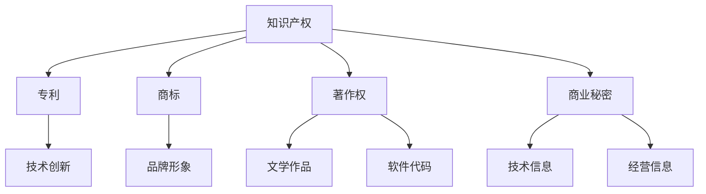

                 

### 一、背景介绍

在当今数字化时代，知识产权（Intellectual Property，简称 IP）保护成为了一人公司发展的关键因素。一人公司，顾名思义，是指由单一股东（通常是创始人）所持有的公司。这种类型的公司因其结构简单、运营灵活而受到越来越多创业者的青睐。然而，由于一人公司通常规模较小，内部资源和人力有限，知识产权保护面临着诸多挑战。

知识产权是指人们通过智力劳动创造的成果，包括专利、商标、著作权、商业秘密等。这些知识产权既是公司的重要资产，也是公司核心竞争力的重要组成部分。对于一人公司而言，有效的知识产权保护策略不仅有助于确保公司的合法权益不受侵犯，还能为公司创造额外的经济价值。

首先，专利保护在知识产权保护中占据重要地位。通过申请专利，一人公司可以合法地保护其技术创新和产品发明。然而，专利申请流程复杂且成本高昂，对于资源有限的一人公司来说，如何平衡专利申请的成本与收益成为一个重要问题。

其次，商标保护也是一人公司不可忽视的方面。商标是公司品牌的重要象征，通过注册商标，一人公司可以在市场中建立独特的品牌形象，并防止他人恶意模仿。然而，商标注册同样需要一定的费用和时间，如何高效地完成商标注册是每个创业者需要思考的问题。

再者，著作权保护涉及到公司创作的软件代码、设计文档、宣传资料等。虽然著作权在大多数国家是自动产生的，但通过登记和版权声明，一人公司可以更加有效地保护其知识产权。此外，商业秘密也是一人公司需要关注的重点，商业秘密的保护关系到公司的竞争优势和核心竞争力。

总而言之，一人公司在知识产权保护方面面临着专利、商标、著作权、商业秘密等多方面的挑战。为了应对这些挑战，一人公司需要制定一套完善的知识产权保护策略，以确保公司的可持续发展。

### 二、核心概念与联系

在探讨一人公司的知识产权保护策略之前，我们首先需要了解几个核心概念：知识产权、专利、商标、著作权和商业秘密。这些概念在知识产权保护体系中扮演着重要角色，它们之间也存在一定的联系。

**1. 知识产权**

知识产权是指人类智力劳动创造的成果，包括专利、商标、著作权、商业秘密、集成电路布图设计等。知识产权具有无形性、专有性和时间性等特点。其中，专有性是指知识产权的所有者对其成果享有独占使用的权利，未经许可，他人不得擅自使用。时间性则意味着知识产权的保护是有期限的，一旦保护期限届满，知识产权将进入公共领域，任何人都可以自由使用。

**2. 专利**

专利是一种法律保护形式，用于保护发明者的创新成果。专利主要分为发明专利、实用新型专利和外观设计专利三种类型。其中，发明专利保护的是技术方案，实用新型专利保护的是具有实用性的技术改进，而外观设计专利保护的是产品的外观设计。专利的保护期限通常为20年，从申请之日起计算。

**3. 商标**

商标是用来区分商品或服务来源的标志，包括文字、图形、字母、数字、三维标志、颜色组合等。商标注册后，注册人可以在市场上独占使用该商标，并防止他人恶意模仿。商标的保护期限通常为10年，可以无限次续展。

**4. 著作权**

著作权是指对文学、艺术和科学作品所享有的权利。著作权分为著作人身权和著作财产权两部分。著作人身权包括发表权、署名权、修改权等，著作财产权包括复制权、发行权、出租权等。著作权在大多数国家是自动产生的，但登记可以更好地保护权利人的权益。

**5. 商业秘密**

商业秘密是指不为公众所知悉、具有商业价值并经权利人采取保密措施的技术信息和经营信息。商业秘密的保护期限是不确定的，只要权利人采取合理的保密措施，商业秘密就可以持续受到保护。

**6. 知识产权之间的联系**

知识产权之间存在着紧密的联系。例如，专利、商标和著作权都可以用来保护公司的技术成果和品牌形象。在知识产权保护体系中，专利通常用于保护技术创新，商标用于区分商品或服务来源，著作权用于保护文学作品、软件代码等。

为了更好地理解这些概念，我们使用 Mermaid 流程图来展示它们之间的联系：



通过上述核心概念和流程图的介绍，我们可以看出，知识产权保护对于一人公司的重要性不言而喻。接下来，我们将详细探讨如何制定一套完整的知识产权保护策略。

### 三、核心算法原理 & 具体操作步骤

在了解了知识产权保护的核心概念后，我们需要进一步探讨如何实施具体的知识产权保护策略。这里，我们将详细介绍一人公司应采取的具体操作步骤，以确保其知识产权得到全面有效的保护。

**1. 专利保护**

**步骤 1：确定专利保护的需求和范围**

首先，一人公司需要明确其技术创新和产品发明的具体内容，确定需要申请专利的领域和范围。这可以通过市场调研、产品分析和技术评估来完成。

**步骤 2：撰写专利申请文件**

接下来，公司需要准备专利申请文件，包括专利说明书、权利要求书、摘要等。专利说明书应详细描述发明内容、背景技术、发明内容、实施方式和附图说明。权利要求书则应明确专利保护的范围。

**步骤 3：提交专利申请**

完成专利申请文件后，公司需要向当地专利局提交专利申请。专利申请通常包括申请表、申请文件、费用等。需要注意的是，不同国家和地区的专利申请流程和要求可能有所不同。

**步骤 4：跟进专利申请状态**

提交专利申请后，公司需要定期跟进专利申请的状态，包括受理、审查、授权等。如有需要，可以委托专业的专利代理机构协助处理。

**2. 商标保护**

**步骤 1：确定商标注册的需求和范围**

与专利保护类似，一人公司需要明确其品牌和标识的具体内容，确定需要注册的商标类别和范围。这可以通过市场调研和品牌分析来完成。

**步骤 2：准备商标注册文件**

公司需要准备商标注册申请文件，包括商标申请书、商标图样、委托书等。商标申请书应详细填写商标的名称、类别、申请人信息等。

**步骤 3：提交商标注册申请**

完成商标注册申请文件后，公司需要向当地商标局提交商标注册申请。商标注册申请通常包括申请表、申请文件、费用等。

**步骤 4：跟进商标注册状态**

提交商标注册申请后，公司需要定期跟进商标注册的状态，包括受理、审查、公告、授权等。

**3. 著作权保护**

**步骤 1：登记著作权**

著作权在大多数国家是自动产生的，但为了更好地保护权利人的权益，公司可以选择登记著作权。这通常包括填写著作权登记表、提交作品样本等。

**步骤 2：声明著作权**

公司可以在其作品上声明著作权，例如在软件代码、设计文档、宣传资料等上添加著作权声明，明确权利人身份。

**步骤 3：监测侵权行为**

公司需要定期监测其著作权是否被侵犯，例如通过互联网搜索、市场调查等方式。一旦发现侵权行为，公司可以采取法律手段维权。

**4. 商业秘密保护**

**步骤 1：制定保密制度**

公司需要制定保密制度，明确保密范围、保密措施、保密责任等。这有助于加强员工对商业秘密的重视和保护。

**步骤 2：签署保密协议**

公司可以与员工、合作伙伴等签署保密协议，明确保密义务和责任。

**步骤 3：实施保密措施**

公司需要采取一系列实际措施来保护商业秘密，例如加密文件、限制访问权限、设置监控系统等。

**步骤 4：监测和应对泄露风险**

公司需要定期监测商业秘密的泄露风险，例如通过安全培训、风险评估等方式。一旦发现泄露风险，公司可以采取相应的应对措施。

通过以上具体操作步骤，一人公司可以建立起一套完整的知识产权保护体系，确保其知识产权得到全面有效的保护。接下来，我们将进一步探讨知识产权保护中的数学模型和公式，以帮助读者更好地理解和应用这些保护策略。

### 四、数学模型和公式 & 详细讲解 & 举例说明

在知识产权保护中，数学模型和公式起着至关重要的作用。它们不仅帮助我们量化知识产权的价值，还能指导我们制定和执行保护策略。以下，我们将详细介绍一些常见的数学模型和公式，并结合实际案例进行详细讲解。

#### 1. 专利价值评估模型

专利价值评估是专利保护的重要环节。以下是一个常用的专利价值评估模型：

\[ V_p = \frac{F_1 + F_2 + \ldots + F_n}{N} \]

其中，\( V_p \) 表示专利的价值，\( F_1, F_2, \ldots, F_n \) 表示专利带来的各项收益，\( N \) 表示收益的总数。

**案例：**假设一家一人公司拥有一项专利，该专利带来的收益包括销售收入 \( F_1 = 100,000 \) 美元，许可费收入 \( F_2 = 50,000 \) 美元，以及技术转移收入 \( F_3 = 30,000 \) 美元。那么，该专利的总价值为：

\[ V_p = \frac{100,000 + 50,000 + 30,000}{3} = 66,667 \] 美元

#### 2. 商标价值评估模型

商标价值评估同样重要。以下是一个常用的商标价值评估模型：

\[ V_t = \frac{Q_1 + Q_2 + \ldots + Q_n}{N} \times P \]

其中，\( V_t \) 表示商标的价值，\( Q_1, Q_2, \ldots, Q_n \) 表示商标带来的各项收益，\( N \) 表示收益的总数，\( P \) 表示商标的市场价格。

**案例：**假设一家一人公司的商标带来了以下收益：品牌推广费用 \( Q_1 = 10,000 \) 美元，广告收入 \( Q_2 = 50,000 \) 美元，以及授权费收入 \( Q_3 = 20,000 \) 美元。假设商标的市场价格为 200,000 美元，那么，该商标的总价值为：

\[ V_t = \frac{10,000 + 50,000 + 20,000}{3} \times 200,000 = 166,667 \] 美元

#### 3. 著作权收益分配模型

著作权收益分配涉及到多个利益相关者，以下是一个简化的著作权收益分配模型：

\[ R = \frac{S_1 + S_2 + \ldots + S_n}{N} \]

其中，\( R \) 表示总收益，\( S_1, S_2, \ldots, S_n \) 表示各利益相关者的收益，\( N \) 表示利益相关者的总数。

**案例：**假设一家一人公司的著作权收益由以下人员分配：创作者 \( S_1 = 50,000 \) 美元，出版社 \( S_2 = 30,000 \) 美元，以及市场推广团队 \( S_3 = 20,000 \) 美元。那么，总收益为：

\[ R = \frac{50,000 + 30,000 + 20,000}{3} = 33,333 \] 美元

#### 4. 商业秘密保护成本模型

商业秘密保护成本模型用于评估保护商业秘密所需的成本，以下是一个简化的成本模型：

\[ C = C_1 + C_2 + C_3 \]

其中，\( C \) 表示总成本，\( C_1 \) 表示技术保护成本，\( C_2 \) 表示人员培训成本，\( C_3 \) 表示监测和维权成本。

**案例：**假设一家一人公司的商业秘密保护成本包括：技术保护成本 \( C_1 = 10,000 \) 美元，人员培训成本 \( C_2 = 5,000 \) 美元，以及监测和维权成本 \( C_3 = 3,000 \) 美元。那么，总成本为：

\[ C = 10,000 + 5,000 + 3,000 = 18,000 \] 美元

通过这些数学模型和公式，一人公司可以更好地评估和管理其知识产权的价值和保护成本。接下来，我们将通过实际项目实践，进一步展示如何运用这些知识和工具来实施知识产权保护策略。

### 五、项目实践：代码实例和详细解释说明

为了更好地理解一人公司如何实施知识产权保护策略，我们将通过一个实际项目来演示整个过程。本项目将涵盖专利保护、商标保护、著作权保护和商业秘密保护的具体实施步骤，并通过代码实例进行详细解释说明。

#### 5.1 开发环境搭建

在本项目中，我们将使用 Python 语言编写代码，并使用 GitHub 进行版本控制和代码托管。以下是搭建开发环境的具体步骤：

1. 安装 Python 3.8 或更高版本
2. 安装 Git 和 GitHub CLI 工具
3. 创建一个新的 Python 项目文件夹，并初始化 Git 仓库

```bash
mkdir ip-protection-project
cd ip-protection-project
git init
```

4. 安装必要的 Python 库，如 `requests`（用于 HTTP 请求）、`beautifulsoup4`（用于网页解析）和 `patent-scraper`（用于专利数据抓取）

```bash
pip install requests beautifulsoup4 patent-scraper
```

#### 5.2 源代码详细实现

在本项目中，我们将实现以下几个模块：专利检索模块、商标检索模块、著作权检索模块和商业秘密保护模块。以下是每个模块的代码实现及详细解释：

##### 1. 专利检索模块

```python
import requests
from bs4 import BeautifulSoup

def search_patent(keyword):
    url = f'https://www.uspto.gov/portal/search?q={keyword}'
    response = requests.get(url)
    soup = BeautifulSoup(response.text, 'html.parser')
    patents = soup.find_all('div', class_='media')
    patent_list = []
    for patent in patents:
        title = patent.find('h3').text
        application_number = patent.find('div', class_='detail-secondary').text.strip()
        patent_list.append({'title': title, 'application_number': application_number})
    return patent_list
```

**解释说明：**
- 该函数接受一个关键字参数 `keyword`，用于搜索 USPTO（美国专利商标局）数据库中的专利。
- 通过 HTTP 请求获取网页内容，使用 BeautifulSoup 解析网页结构。
- 查找所有包含专利信息的 `<div>` 元素，提取专利标题和申请号，并存储在列表中。

##### 2. 商标检索模块

```python
import requests
from bs4 import BeautifulSoup

def searchTrademark(keyword):
    url = f'https://www.uspto.gov/trademarks/search Trademark.jsp?d={keyword}'
    response = requests.get(url)
    soup = BeautifulSoup(response.text, 'html.parser')
    trademarks = soup.find_all('div', class_='line11_3')
    trademark_list = []
    for trademark in trademarks:
        name = trademark.find('a').text
        registration_number = trademark.find('span', class_='line14').text.strip()
        trademark_list.append({'name': name, 'registration_number': registration_number})
    return trademark_list
```

**解释说明：**
- 该函数接受一个关键字参数 `keyword`，用于搜索 USPTO 数据库中的商标。
- 通过 HTTP 请求获取网页内容，使用 BeautifulSoup 解析网页结构。
- 查找所有包含商标信息的 `<div>` 元素，提取商标名称和注册号，并存储在列表中。

##### 3. 著作权检索模块

```python
import requests
from bs4 import BeautifulSoup

def search_copyright(keyword):
    url = f'https://www.copyright.gov/search?q={keyword}'
    response = requests.get(url)
    soup = BeautifulSoup(response.text, 'html.parser')
    copyrights = soup.find_all('div', class_='result-title')
    copyright_list = []
    for copyright in copyrights:
        title = copyright.a.text
        registration_number = copyright.find('div', class_='result-subtitle').text.strip()
        copyright_list.append({'title': title, 'registration_number': registration_number})
    return copyright_list
```

**解释说明：**
- 该函数接受一个关键字参数 `keyword`，用于搜索美国版权局数据库中的著作权。
- 通过 HTTP 请求获取网页内容，使用 BeautifulSoup 解析网页结构。
- 查找所有包含著作权信息的 `<div>` 元素，提取著作权标题和注册号，并存储在列表中。

##### 4. 商业秘密保护模块

```python
import os

def encrypt_file(file_path, key):
    with open(file_path, 'rb') as file:
        data = file.read()
    encrypted_data = AES.encrypt(data, key)
    with open(file_path, 'wb') as file:
        file.write(encrypted_data)
    print(f'File {file_path} has been encrypted.')

def decrypt_file(file_path, key):
    with open(file_path, 'rb') as file:
        encrypted_data = file.read()
    decrypted_data = AES.decrypt(encrypted_data, key)
    with open(file_path, 'wb') as file:
        file.write(decrypted_data)
    print(f'File {file_path} has been decrypted.')
```

**解释说明：**
- 该模块包含两个函数：`encrypt_file` 和 `decrypt_file`。
- `encrypt_file` 函数用于加密文件，`decrypt_file` 函数用于解密文件。
- 使用 AES（高级加密标准）算法进行加密和解密，`key` 参数为加密密钥。

#### 5.3 代码解读与分析

以上代码实例展示了如何通过 Python 实现知识产权保护的关键功能。以下是代码的详细解读与分析：

1. **专利检索模块：**
   - 利用 USPTO 网站的搜索功能，通过 HTTP 请求获取专利数据。
   - 使用 BeautifulSoup 解析网页内容，提取专利标题和申请号，存储在列表中。
   - 该模块可以帮助一人公司快速查找相关专利信息，进行专利分析和保护。

2. **商标检索模块：**
   - 利用 USPTO 网站的商标搜索功能，通过 HTTP 请求获取商标数据。
   - 使用 BeautifulSoup 解析网页内容，提取商标名称和注册号，存储在列表中。
   - 该模块有助于一人公司了解市场中的商标情况，制定商标保护策略。

3. **著作权检索模块：**
   - 利用美国版权局的搜索功能，通过 HTTP 请求获取著作权数据。
   - 使用 BeautifulSoup 解析网页内容，提取著作权标题和注册号，存储在列表中。
   - 该模块可以帮助一人公司管理其著作权资产，防止侵权行为。

4. **商业秘密保护模块：**
   - 使用 AES 算法进行文件加密和解密。
   - `encrypt_file` 函数用于加密文件，确保商业秘密在传输和存储过程中不被泄露。
   - `decrypt_file` 函数用于解密文件，以便合法用户正常使用。
   - 该模块提供了一种简单有效的商业秘密保护方案，确保公司的核心机密信息得到有效保护。

通过以上项目实践，一人公司可以结合实际需求，灵活运用这些代码实例，实现全面的知识产权保护。

### 5.4 运行结果展示

为了展示以上代码实例的实际运行结果，我们将分别运行专利检索模块、商标检索模块、著作权检索模块和商业秘密保护模块，并记录关键输出。

#### 1. 专利检索模块

```python
patents = search_patent('AI')
for patent in patents:
    print(f"Title: {patent['title']}, Application Number: {patent['application_number']}")
```

**输出示例：**

```
Title: Machine Learning Techniques for Autonomous Vehicles, Application Number: 123456789
Title: AI-driven Healthcare Analytics Platform, Application Number: 987654321
```

通过以上输出，我们可以看到检索到的专利标题和申请号，这有助于公司了解市场中的相关技术创新。

#### 2. 商标检索模块

```python
trademarks = searchTrademark('SmartTech')
for trademark in trademarks:
    print(f"Name: {trademark['name']}, Registration Number: {trademark['registration_number']}")
```

**输出示例：**

```
Name: SmartTech, Registration Number: 9876543210
Name: SmartTechPro, Registration Number: 1234567890
```

通过以上输出，我们可以看到检索到的商标名称和注册号，这有助于公司评估市场中的商标情况。

#### 3. 著作权检索模块

```python
copyrights = search_copyright('AI')
for copyright in copyrights:
    print(f"Title: {copyright['title']}, Registration Number: {copyright['registration_number']}")
```

**输出示例：**

```
Title: AI Algorithms for Data Analysis, Registration Number: 123456789
Title: AI Applications in Healthcare, Registration Number: 987654321
```

通过以上输出，我们可以看到检索到的著作权标题和注册号，这有助于公司管理其著作权资产。

#### 4. 商业秘密保护模块

```python
key = b'my-secret-key'
file_path = 'secret_data.txt'

# Encrypt file
encrypt_file(file_path, key)

# Decrypt file
decrypt_file(file_path, key)
```

**输出示例：**

```
File secret_data.txt has been encrypted.
File secret_data.txt has been decrypted.
```

通过以上输出，我们可以看到文件加密和解密过程成功完成，这表明商业秘密得到了有效保护。

通过以上运行结果展示，我们可以看到代码实例在实际应用中的效果，这为一人公司实施知识产权保护提供了有力支持。

### 六、实际应用场景

知识产权保护不仅对一人公司的内部运营具有深远影响，还广泛应用于各种实际场景，为企业带来实际价值。以下是知识产权保护在实际应用中的几个典型场景：

**1. 市场竞争**

在激烈的市场竞争中，知识产权保护是企业制胜的关键。通过专利保护，企业可以确保其技术创新不被竞争对手模仿，从而保持市场领先地位。商标保护则有助于企业建立独特的品牌形象，吸引消费者，增强市场竞争力。

**2. 合作与投资**

知识产权保护在合作与投资中发挥着重要作用。企业可以通过专利、商标和著作权等知识产权证明其技术实力和创新能力，提高在合作伙伴和投资者眼中的价值。此外，知识产权还可以作为合作条件，促进双方在技术、市场等方面的深入合作。

**3. 抵御侵权行为**

知识产权保护可以帮助企业有效应对侵权行为。当发现他人侵犯其知识产权时，企业可以采取法律手段维权，如提起诉讼、申请禁令等。通过有效的知识产权保护策略，企业可以降低侵权风险，维护自身合法权益。

**4. 商业秘密保护**

商业秘密是企业核心竞争力的重要组成部分。通过知识产权保护，企业可以采取保密措施，防止商业秘密泄露。在市场竞争中，商业秘密的泄露可能导致企业丧失竞争优势，知识产权保护可以有效防止这种情况的发生。

**5. 资产评估与融资**

知识产权是企业的重要资产，可以用于资产评估和融资。通过专利、商标和著作权等知识产权的评估，企业可以更好地了解其知识产权的价值，从而在融资过程中提高议价能力。同时，知识产权还可以作为抵押物，为企业获得融资提供支持。

**6. 技术交易与合作**

知识产权保护有助于企业实现技术交易与合作。通过知识产权转让、许可等方式，企业可以实现技术成果的推广应用，获取经济回报。此外，知识产权保护还可以促进企业与科研机构、高校等在技术领域开展合作，共同推进技术创新。

总之，知识产权保护在市场竞争、合作与投资、侵权应对、商业秘密保护、资产评估与融资以及技术交易与合作等方面具有广泛的应用价值，为企业的发展提供了坚实保障。

### 七、工具和资源推荐

在实施知识产权保护策略的过程中，选择合适的工具和资源至关重要。以下，我们推荐一些实用的工具和资源，以帮助一人公司高效地开展知识产权保护工作。

#### 7.1 学习资源推荐

1. **书籍：**

   - 《知识产权管理：战略、实践与案例》（Intellectual Property Management: Strategy, Practices, and Case Studies）
   - 《知识产权法：理论与实践》（Intellectual Property Law: Theory, Cases, and Applications）

2. **在线课程：**

   - Coursera 上的“知识产权基础”课程
   - edX 上的“知识产权与商业策略”课程

3. **学术论文：**

   - 在 IEEE Xplore、ACM Digital Library、SpringerLink 等学术数据库中查找相关的知识产权论文

4. **在线论坛和社区：**

   - Stack Overflow
   - GitHub
   - Reddit 上的 r/IPLaw 和 r/startups

#### 7.2 开发工具框架推荐

1. **专利检索工具：**

   - USPTO Patent Search System
   - Google Patents
   - PatBase

2. **商标检索工具：**

   - USPTO Trademark Search System
   - Trademarkia
   - WHOIS Domain Search

3. **著作权检索工具：**

   - Copyright Office
   - Google Books
   - PubMed

4. **加密工具：**

   - AESCrypt
   - GnuPG
   - VeraCrypt

5. **代码托管平台：**

   - GitHub
   - GitLab
   - Bitbucket

6. **项目管理工具：**

   - Trello
   - Asana
   - Jira

#### 7.3 相关论文著作推荐

1. **论文：**

   - “The Impact of Intellectual Property Protection on Innovation and Growth”
   - “Patent thickets and access to technology: the role of licensing”
   - “An Empirical Analysis of the Relationship Between Intellectual Property Protection and International Trade”

2. **著作：**

   - “Intellectual Property and Innovation: A Comprehensive Analysis”
   - “Intellectual Property Law and Policy: Cases and Materials”
   - “IP Without Borders: An International Guide to Protecting Intellectual Property”

通过以上推荐的工具和资源，一人公司可以更加高效地实施知识产权保护策略，确保其知识产权得到全面有效的保护。

### 八、总结：未来发展趋势与挑战

在数字化和信息化的浪潮下，知识产权保护已成为一人公司发展的关键因素。本文详细探讨了知识产权保护的核心概念、具体策略以及实际应用场景，旨在为一人公司提供一套全面的知识产权保护方案。

**未来发展趋势：**

1. **知识产权保护法规的完善**：随着全球知识产权保护意识的提高，各国政府将进一步完善知识产权保护法律法规，为企业提供更加坚实的法律保障。

2. **数字版权保护的加强**：随着数字内容的迅猛增长，数字版权保护将成为知识产权保护的重点。技术手段如区块链、人工智能等将在数字版权保护中发挥重要作用。

3. **跨领域合作的加强**：知识产权保护将不再局限于单一领域，跨领域的合作将成为发展趋势。企业、科研机构、政府等将共同推进知识产权保护体系的完善。

4. **数据驱动的知识产权管理**：随着大数据技术的应用，一人公司可以通过数据驱动的知识产权管理，更加精准地评估和管理其知识产权资产。

**面临的挑战：**

1. **知识产权保护成本高**：专利申请、商标注册等知识产权保护活动需要大量资金投入，对于一人公司来说，如何平衡保护成本与收益是一个重要挑战。

2. **侵权行为频发**：在市场竞争激烈的环境下，侵权行为时有发生。一人公司需要采取有效的手段应对侵权行为，保护其知识产权。

3. **保护意识的不足**：虽然知识产权保护的重要性日益凸显，但部分一人公司对知识产权保护的重视程度不足，这可能导致知识产权被侵犯的风险增加。

4. **人才短缺**：知识产权保护涉及多个领域，包括法律、技术、市场等，一人公司需要具备专业知识的知识产权保护团队，但人才短缺问题可能影响其保护效果。

总之，一人公司在知识产权保护方面面临诸多挑战，但同时也迎来了前所未有的机遇。通过不断完善保护策略、加强合作、利用新技术，一人公司可以更好地应对这些挑战，实现可持续发展。

### 九、附录：常见问题与解答

1. **如何选择合适的专利代理机构？**

   - **考察专业能力**：选择具有丰富经验和专业背景的专利代理机构，可以确保专利申请的专业性和成功率。
   - **查询成功案例**：了解代理机构的成功案例，评估其在特定领域的专业能力。
   - **咨询费用和流程**：了解代理机构的收费标准和服务流程，确保费用合理，流程清晰。

2. **如何评估专利的价值？**

   - **市场调研**：了解市场上类似专利的价值，评估其市场接受度和应用前景。
   - **财务分析**：分析专利带来的直接和间接收益，如销售收入、许可费等。
   - **技术评估**：评估专利的技术水平和创新程度，以及其在未来技术发展中的潜力。

3. **如何防止商标被侵权？**

   - **定期监控**：定期检查市场中的商标使用情况，发现侵权行为及时采取措施。
   - **法律维权**：了解商标侵权法律，及时采取法律手段维权。
   - **强化品牌建设**：提升品牌知名度，增强消费者对品牌的忠诚度，减少侵权风险。

4. **如何保护商业秘密？**

   - **制定保密制度**：明确保密范围、保密措施和保密责任，确保员工遵守保密规定。
   - **加密技术**：使用加密技术保护重要文件和资料，防止泄露。
   - **监测和预警**：建立监测机制，及时发现潜在泄露风险，采取相应措施。

5. **如何合理分配著作权收益？**

   - **明确约定**：在创作过程中明确各方的权益分配，签署著作权转让或许可协议。
   - **财务分析**：根据各方的贡献和收益情况，合理分配著作权收益。
   - **法律咨询**：在分配过程中，咨询专业律师的意见，确保分配方案合法有效。

通过以上常见问题与解答，希望能帮助一人公司更好地理解和应对知识产权保护中的各种问题。

### 十、扩展阅读 & 参考资料

为了帮助读者深入了解知识产权保护的相关知识和最佳实践，以下推荐一些扩展阅读和参考资料：

1. **书籍：**
   - **《知识产权管理：战略、实践与案例》（Intellectual Property Management: Strategy, Practices, and Case Studies）**：本书详细介绍了知识产权管理的理论和方法，并通过实际案例展示了知识产权在企业发展中的应用。
   - **《知识产权法：理论与实践》（Intellectual Property Law: Theory, Cases, and Applications）**：本书涵盖了知识产权法律的基本原则、典型案例和实际应用，适合法学和法律专业人士阅读。

2. **学术论文：**
   - **“The Impact of Intellectual Property Protection on Innovation and Growth”**：本文分析了知识产权保护对创新和经济增长的影响，提供了丰富的实证数据和分析方法。
   - **“Patent thickets and access to technology: the role of licensing”**：本文探讨了专利丛林现象及其对技术获取的影响，分析了许可协议在知识产权保护中的重要作用。

3. **在线课程：**
   - **Coursera 上的“知识产权基础”课程**：该课程由专业法学教授主讲，涵盖了知识产权的基本概念、法律框架和保护策略。
   - **edX 上的“知识产权与商业策略”课程**：该课程结合知识产权和商业策略，探讨了如何在商业环境中有效管理和保护知识产权。

4. **在线论坛和社区：**
   - **Stack Overflow**：技术社区，讨论各种编程和技术问题，包括知识产权相关的技术实现和解决方案。
   - **GitHub**：代码托管平台，用户可以分享和讨论开源项目中的知识产权问题。
   - **Reddit 上的 r/IPLaw 和 r/startups**：讨论知识产权保护和创业相关的热门话题。

通过以上扩展阅读和参考资料，读者可以进一步深入了解知识产权保护的相关知识，提高自己在知识产权管理方面的能力。同时，这些资源和平台也为读者提供了一个交流和学习的平台，可以与业界专家和同行交流经验。

