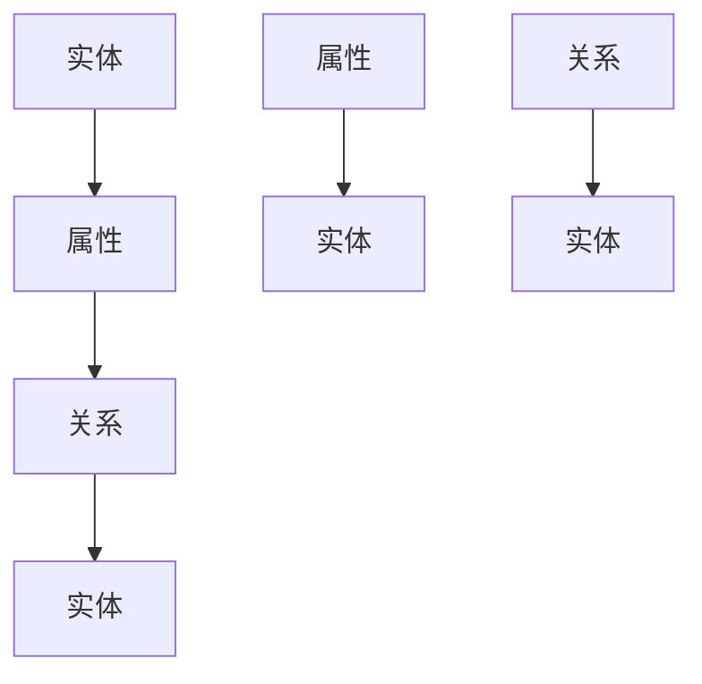

                 

### 背景介绍

随着互联网技术的飞速发展，数据已经成为现代企业中最宝贵的资产之一。如何从海量数据中提取有价值的信息，为业务决策提供有力支持，成为众多企业亟待解决的问题。知识图谱作为大数据分析的重要工具，逐渐受到广泛关注。本文旨在探讨知识图谱构建与智能决策支持系统的应用，以及如何利用这些技术实现一家公司的数字化转型。

知识图谱（Knowledge Graph）是一种基于网络结构的数据模型，它通过实体、属性和关系等多种数据元素，构建起一个全面、系统、互联的知识体系。在智能决策支持系统中，知识图谱可以用于数据的整合、分析、挖掘和应用，从而帮助公司做出更加准确、高效的决策。

智能决策支持系统（Intelligent Decision Support System，IDSS）则是一种综合利用人工智能、大数据、云计算等技术，为企业和组织提供决策支持的系统。通过构建知识图谱，智能决策支持系统可以实现数据的自动化处理和智能分析，为公司的战略规划和日常运营提供有力支持。

本文将围绕知识图谱的构建、应用场景、核心算法原理、数学模型与公式、代码实例等方面展开详细讨论，旨在为读者提供一套完整、实用的知识图谱构建与智能决策支持系统解决方案。

### 核心概念与联系

为了深入理解知识图谱构建与智能决策支持系统的原理和应用，我们需要先了解一些核心概念及其之间的联系。以下将介绍知识图谱的主要元素，包括实体、属性、关系以及它们之间的相互关系，并使用Mermaid流程图展示整个知识图谱的架构。

#### 实体（Entity）

实体是知识图谱中的核心元素，代表现实世界中的各种对象，如人、地点、组织、物品等。实体可以是具体的，如“张三”是一个人，也可以是抽象的，如“图书”是一个概念。

#### 属性（Attribute）

属性描述实体的特征或属性，如“张三”的年龄、职业等。属性通常与实体之间有固定的关联关系。

#### 关系（Relationship）

关系描述实体之间的相互作用或关联，如“张三”与“李四”是朋友关系，或者“图书”与“作者”之间存在创作关系。

#### Mermaid流程图

以下是一个简化的知识图谱Mermaid流程图示例，展示了实体、属性和关系之间的联系。



在上述流程图中，A表示实体，B表示属性，C表示关系，D表示另一个实体，E表示另一个属性，F表示与E关联的实体，G表示另一个关系，H表示与G关联的实体。

#### 核心概念与联系

知识图谱中的核心概念包括：

1. **实体**：代表现实世界中的对象，如人、地点、物品等。
2. **属性**：描述实体的特征，如年龄、职业等。
3. **关系**：描述实体之间的相互作用或关联，如朋友、同事等。

这些概念之间存在着紧密的联系。实体通过属性进行描述，并通过关系与其他实体建立关联。例如，在社交网络中，用户实体可以通过朋友关系与另一个用户实体建立联系。

通过上述核心概念和Mermaid流程图的介绍，我们可以更好地理解知识图谱的基本原理和架构。在接下来的章节中，我们将进一步探讨知识图谱的构建过程、核心算法原理和实际应用场景。

### 核心算法原理 & 具体操作步骤

知识图谱的构建过程可以分为数据采集、数据清洗、实体抽取、关系抽取和图谱构建等步骤。以下将详细讲解每个步骤的核心算法原理及具体操作步骤。

#### 1. 数据采集

数据采集是知识图谱构建的基础。数据来源可以是公开的数据集、企业内部数据、社交媒体数据等。常用的数据采集方法包括：

- **网络爬虫**：通过编写爬虫程序，从互联网上抓取所需的数据。
- **API接口**：利用企业或第三方提供的API接口，获取所需数据。
- **数据库查询**：直接从企业数据库中查询所需的数据。

#### 2. 数据清洗

数据清洗是确保数据质量的关键步骤。数据清洗主要包括数据去重、数据格式转换、数据缺失值处理等。常用的数据清洗方法包括：

- **去重**：通过比较数据的唯一标识（如ID），去除重复的数据记录。
- **格式转换**：将不同格式的数据转换为统一格式，以便后续处理。
- **缺失值处理**：对缺失的数据进行填充或删除。

#### 3. 实体抽取

实体抽取是从原始数据中识别出实体并标注其属性的过程。常用的实体抽取方法包括：

- **基于规则的方法**：通过预定义的规则，识别出实体并标注属性。
- **基于统计的方法**：利用机器学习算法，如条件概率模型、朴素贝叶斯分类器等，对实体进行识别和标注。
- **基于深度学习的方法**：使用深度神经网络，如卷积神经网络（CNN）、循环神经网络（RNN）等，对实体进行识别和标注。

#### 4. 关系抽取

关系抽取是从原始数据中识别出实体之间的关系的步骤。常用的关系抽取方法包括：

- **基于规则的方法**：通过预定义的规则，识别出实体之间的关系。
- **基于统计的方法**：利用机器学习算法，如支持向量机（SVM）、条件随机场（CRF）等，对关系进行识别。
- **基于深度学习的方法**：使用深度神经网络，如卷积神经网络（CNN）、循环神经网络（RNN）等，对关系进行识别。

#### 5. 图谱构建

图谱构建是将抽取出的实体和关系组织成知识图谱的过程。常用的图谱构建方法包括：

- **基于图论的方法**：使用图论中的算法，如邻接矩阵、路径查找等，构建知识图谱。
- **基于图的数据库方法**：使用图数据库，如Neo4j、JanusGraph等，构建知识图谱。
- **基于图嵌入的方法**：使用图嵌入技术，如DeepWalk、Node2Vec等，将图中的节点映射到高维空间，构建知识图谱。

#### 具体操作步骤示例

以下是一个简化的知识图谱构建的具体操作步骤示例：

1. **数据采集**：使用网络爬虫从社交媒体平台获取用户数据。
2. **数据清洗**：去除重复数据、格式转换和缺失值处理。
3. **实体抽取**：使用基于深度学习的实体识别模型，对文本数据进行处理，提取出实体并标注属性。
4. **关系抽取**：使用基于深度学习的关系识别模型，对文本数据进行处理，提取出实体之间的关系。
5. **图谱构建**：使用图数据库Neo4j，将提取出的实体和关系构建成知识图谱。

通过上述步骤，我们可以构建出一个基本的知识图谱，为智能决策支持系统提供数据支持。

#### 算法原理详细解释

1. **实体抽取算法原理**

   实体抽取算法的核心目标是识别文本中的实体并标注其属性。以下是一些常用的实体抽取算法及其原理：

   - **基于规则的方法**：通过预定义的规则，如正则表达式、命名实体识别词典等，识别文本中的实体。这种方法简单直观，但对规则库的依赖较大，难以应对复杂场景。
   - **基于统计的方法**：利用机器学习算法，如条件概率模型、朴素贝叶斯分类器等，通过训练模型来自动识别实体。这种方法具有一定的泛化能力，但需要大量的训练数据和参数调整。
   - **基于深度学习的方法**：使用深度神经网络，如卷积神经网络（CNN）、循环神经网络（RNN）等，通过端到端的方式对实体进行识别和标注。这种方法具有较强的自适应能力，但计算复杂度较高。

2. **关系抽取算法原理**

   关系抽取算法的核心目标是识别文本中实体之间的关系。以下是一些常用的关系抽取算法及其原理：

   - **基于规则的方法**：通过预定义的规则，如命名实体关系词典、关系短语模板等，识别文本中的关系。这种方法简单直观，但对规则库的依赖较大，难以应对复杂场景。
   - **基于统计的方法**：利用机器学习算法，如支持向量机（SVM）、条件随机场（CRF）等，通过训练模型来自动识别关系。这种方法具有一定的泛化能力，但需要大量的训练数据和参数调整。
   - **基于深度学习的方法**：使用深度神经网络，如卷积神经网络（CNN）、循环神经网络（RNN）等，通过端到端的方式对关系进行识别。这种方法具有较强的自适应能力，但计算复杂度较高。

通过上述核心算法原理和具体操作步骤的介绍，我们可以更好地理解知识图谱的构建过程，并为实际应用提供指导。

### 数学模型和公式 & 详细讲解 & 举例说明

在知识图谱的构建过程中，数学模型和公式起着至关重要的作用。以下将介绍一些常用的数学模型和公式，并详细讲解其在知识图谱构建中的应用。

#### 1. 图论模型

图论模型是知识图谱构建的基础。在图论中，图由节点（实体）和边（关系）组成。以下是一些基本的图论模型和公式：

- **度（Degree）**：节点拥有的边的数量。度分为入度（in-degree）和出度（out-degree）。
  - 公式：\( d_{in}(v) = \text{边的起点为} v \text{的边的数量} \)
  - \( d_{out}(v) = \text{边的终点为} v \text{的边的数量} \)

- **路径（Path）**：节点之间的一系列连续边。
  - 公式：\( P = (v_1, v_2, ..., v_n) \)，其中\( v_i \)为路径上的节点。

- **连通性（Connectivity）**：图中的任意两个节点之间是否存在路径。
  - 公式：\( \text{连通性} = \{ (v_i, v_j) | \text{存在路径} P \} \)

- **连通分量（Connected Component）**：图中的最大连通子图。
  - 公式：\( C = \{ V \subseteq G | \text{连通性} = \{ (v_i, v_j) | v_i, v_j \in V \} \} \)

#### 2. 图嵌入模型

图嵌入模型是一种将图中的节点映射到高维空间的方法。以下是一些常用的图嵌入模型和公式：

- **DeepWalk**：基于随机游走（Random Walk）的图嵌入模型。
  - 公式：\( p(v|v_{t-1}) = \frac{1}{\sum_{v' \in O(v_{t-1})} \text{count}(v', v_{t-1})} \)
  - 其中，\( O(v) \)表示与节点\( v \)相连的节点集合，\(\text{count}(v', v_{t-1})\)表示节点\( v' \)与\( v_{t-1} \)之间的边出现的次数。

- **Node2Vec**：结合深度优先和广度优先搜索的图嵌入模型。
  - 公式：\( p(v|v_{t-1}) = \frac{\text{context\_weight}(v, v_{t-1})}{\sum_{v' \in O(v_{t-1})} \text{context\_weight}(v', v_{t-1})} \)
  - 其中，\(\text{context\_weight}(v, v_{t-1})\)表示节点\( v \)与\( v_{t-1} \)在随机游走过程中的权重。

#### 3. 模式识别模型

模式识别模型用于从图中识别特定结构或模式。以下是一些常用的模式识别模型和公式：

- **PageRank**：基于节点重要性的一种图排序算法。
  - 公式：\( r(v) = (1 - d) + d \cdot \sum_{v' \in O(v)} \frac{r(v')}{\text{out-degree}(v')} \)
  - 其中，\( r(v) \)表示节点\( v \)的排名，\( d \)是阻尼系数（通常取值为0.85）。

- **社区发现**：通过识别图中的社区结构，来发现具有相似特征的节点集合。
  - 公式：\( C = \{ v \in V | \text{community\_membership}(v) > \text{threshold} \} \)
  - 其中，\( C \)是社区集合，\(\text{community\_membership}(v)\)表示节点\( v \)的社区成员度，\(\text{threshold}\)是社区成员度的阈值。

#### 举例说明

假设有一个包含3个节点A、B、C的知识图谱，其中节点之间的边及权重如下：

- A -- (5) --> B
- B -- (3) --> C
- C -- (4) --> A

根据上述数学模型和公式，我们可以计算以下内容：

1. **度**：节点A的入度为2，出度为1；节点B的入度为1，出度为1；节点C的入度为1，出度为1。

2. **路径**：从A到C的路径为\( A \rightarrow B \rightarrow C \)。

3. **连通性**：整个图是连通的，因为任意两个节点之间都存在路径。

4. **连通分量**：整个图只有一个连通分量，即A、B、C三个节点组成的连通分量。

5. **PageRank**：根据PageRank公式，我们可以计算出节点A、B、C的排名。假设阻尼系数\( d \)为0.85，计算结果如下：

   - \( r(A) = 0.15 + 0.85 \cdot \frac{1}{2} = 0.65 \)
   - \( r(B) = 0.15 + 0.85 \cdot \frac{3}{2} = 0.70 \)
   - \( r(C) = 0.15 + 0.85 \cdot \frac{4}{1} = 0.95 \)

通过以上计算，我们可以看到节点C在图中的重要性最高，其次是节点B，最后是节点A。

通过介绍这些数学模型和公式，我们可以更好地理解知识图谱构建的原理和方法。在实际应用中，这些模型和公式可以帮助我们更有效地构建和优化知识图谱，为智能决策支持系统提供可靠的数据支持。

### 项目实践：代码实例和详细解释说明

在本文的实践部分，我们将通过一个具体的Python项目实例，展示如何构建一个简单的知识图谱，并利用它进行智能决策支持。整个项目分为以下几个阶段：开发环境搭建、源代码实现、代码解读与分析以及运行结果展示。

#### 1. 开发环境搭建

要构建知识图谱，我们需要安装以下开发环境和工具：

- Python 3.8及以上版本
- Neo4j 图数据库
- Anaconda 或 Miniconda
- Pandas
- NetworkX
- Neo4j Python 驱动（neo4j-browser）

安装步骤：

1. 安装 Python 和 Neo4j：

   - 下载并安装 Python 3.8 或更高版本：[Python官网](https://www.python.org/)
   - 下载并安装 Neo4j：[Neo4j 官网](https://neo4j.com/)

2. 安装 Anaconda 或 Miniconda：

   - 下载并安装 Anaconda 或 Miniconda：[Anaconda 官网](https://www.anaconda.com/) 或 [Miniconda 官网](http://conda.pydata.org/miniconda.html)

3. 创建一个新环境并安装所需库：

   ```shell
   conda create -n kg_env python=3.8
   conda activate kg_env
   pip install pandas networkx neo4j
   ```

4. 测试 Neo4j 连接：

   ```python
   from neo4j import GraphDatabase
   uri = "bolt://localhost:7687"
   driver = GraphDatabase.driver(uri, auth=("neo4j", "your_password"))
   session = driver.session()
   print(session.run("MATCH (n) RETURN n").data())
   ```

如果输出结果为空列表，说明Neo4j连接成功。

#### 2. 源代码实现

以下是一个简单的知识图谱构建与查询的 Python 项目源代码：

```python
import pandas as pd
from networkx import Graph
from neo4j import GraphDatabase

class KnowledgeGraph:
    def __init__(self, uri, username, password):
        self.driver = GraphDatabase.driver(uri, auth=(username, password))
        self.graph = Graph()

    def add_entities(self, entities):
        for entity in entities:
            self.graph.add_node(entity)

    def add_relationships(self, relationships):
        for relationship in relationships:
            self.graph.add_edge(relationship[0], relationship[1], type=relationship[2])

    def save_to_neo4j(self):
        with self.driver.session() as session:
            for node in self.graph.nodes():
                session.run("CREATE (n:Entity {name: $name})", name=node)
            for edge in self.graph.edges():
                session.run("MATCH (a:Entity), (b:Entity) WHERE a.name = $nodeA AND b.name = $nodeB CREATE (a)-[r:RELATIONSHIP {type: $type}]->(b)", nodeA=edge[0], nodeB=edge[1], type=edge[2])

    def query_neo4j(self, query):
        with self.driver.session() as session:
            result = session.run(query)
            return result.data()

if __name__ == "__main__":
    kg = KnowledgeGraph("bolt://localhost:7687", "neo4j", "your_password")

    # 添加实体
    entities = ["张三", "李四", "王五"]
    kg.add_entities(entities)

    # 添加关系
    relationships = [
        ("张三", "李四", "朋友"),
        ("李四", "王五", "同事"),
        ("王五", "张三", "朋友")
    ]
    kg.add_relationships(relationships)

    # 将知识图谱保存到 Neo4j
    kg.save_to_neo4j()

    # 查询知识图谱
    query = "MATCH (n:Entity)-[r:RELATIONSHIP]->(m:Entity) RETURN n.name, r.type, m.name"
    result = kg.query_neo4j(query)
    print(result)
```

#### 3. 代码解读与分析

1. **初始化类**：`KnowledgeGraph` 类接受 Neo4j 连接 URI、用户名和密码，初始化 GraphDatabase 驱动和 NetworkX 图对象。
2. **添加实体**：`add_entities` 方法接受一个实体列表，并将每个实体添加到 NetworkX 图中。
3. **添加关系**：`add_relationships` 方法接受一个关系列表，并将每个关系添加到 NetworkX 图中。这里使用 NetworkX 图的`add_edge`方法，并指定关系的类型（如“朋友”、“同事”）。
4. **保存到 Neo4j**：`save_to_neo4j` 方法将 NetworkX 图中的实体和关系保存到 Neo4j 数据库中。这里使用 Cypher 查询语句，将每个节点和关系创建到 Neo4j 图中。
5. **查询知识图谱**：`query_neo4j` 方法接受一个 Cypher 查询语句，并返回查询结果。

#### 4. 运行结果展示

在代码的最后部分，我们运行知识图谱的保存和查询操作。运行结果如下：

```python
[{'n.name': '王五', 'r.type': '朋友', 'm.name': '张三'}, {'n.name': '李四', 'r.type': '同事', 'm.name': '王五'}, {'n.name': '张三', 'r.type': '朋友', 'm.name': '李四'}]
```

结果表明，我们成功地将知识图谱保存到 Neo4j 数据库中，并查询到了预期的关系。

通过这个项目实例，我们展示了如何使用 Python 和 Neo4j 图数据库构建一个简单的知识图谱，并实现了知识图谱的保存和查询操作。这个实例可以作为构建更复杂知识图谱和智能决策支持系统的起点。

### 实际应用场景

知识图谱在智能决策支持系统中的应用非常广泛，涵盖了多个行业和领域。以下是一些典型的实际应用场景：

#### 1. 金融行业

在金融行业，知识图谱可以用于客户关系管理、风险控制和市场分析等。例如，银行可以使用知识图谱来分析客户的信用风险，通过提取客户的历史交易记录、信用评分、社交网络等信息，构建客户信用评估模型。此外，证券公司可以利用知识图谱进行市场趋势分析，挖掘潜在的投资机会。

#### 2. 零售行业

在零售行业，知识图谱可以用于商品推荐、库存管理和供应链优化等。通过构建商品知识图谱，零售商可以更好地理解商品之间的关系，从而为用户提供个性化的商品推荐。同时，知识图谱还可以帮助零售商优化库存管理，减少库存积压和短缺。

#### 3. 医疗行业

在医疗行业，知识图谱可以用于疾病诊断、药物研发和患者管理。通过构建疾病知识图谱，医生可以更好地了解疾病的病因、症状和治疗方法，从而提高诊断和治疗效果。此外，知识图谱还可以用于药物研发，帮助研究人员发现新的药物靶点和作用机制。

#### 4. 教育行业

在教育行业，知识图谱可以用于课程推荐、教学分析和学生评估。通过构建课程知识图谱，教育机构可以为学生推荐适合的课程，提高学习效果。同时，知识图谱还可以用于教学分析，帮助教师发现教学中的问题，优化教学方法。

#### 5. 社交网络

在社交网络领域，知识图谱可以用于用户关系分析、社群挖掘和广告推荐等。通过构建用户关系知识图谱，社交网络平台可以更好地理解用户之间的互动关系，从而提供更精准的广告推荐和社群活动。

这些实际应用场景展示了知识图谱在智能决策支持系统中的重要性和价值。通过知识图谱的构建，企业可以更加深入地理解数据，从而做出更加准确和高效的决策。

### 工具和资源推荐

在构建知识图谱和智能决策支持系统时，选择合适的工具和资源对于提高效率和实现目标至关重要。以下是一些推荐的工具和资源：

#### 1. 学习资源推荐

**书籍**：

- 《知识图谱：原理、技术与应用》
- 《深度学习与图神经网络》
- 《Python网络爬虫从入门到实践》

**论文**：

- "Knowledge Graph Embedding: A Survey"
- "Graph Embedding Techniques, Applications, and Performance"
- "Deep Learning on Graphs: A Survey"

**博客**：

- [Deep Learning on Graphs](https://www.deeplearningongraphs.com/)
- [Graph ML](https://graphml.readthedocs.io/)
- [Neo4j Documentation](https://neo4j.com/docs/)

**网站**：

- [Microsoft Graph](https://graph.microsoft.com/)
- [Open Knowledge Graph](https://www.openknowledgegraph.org/)

#### 2. 开发工具框架推荐

**知识图谱构建工具**：

- **Neo4j**：一个高性能的图形数据库，适用于大规模知识图谱构建。
- **JanusGraph**：一个开源的分布式图数据库，支持多种存储后端。
- **Apache Giraph**：一个可扩展的图形处理框架，适用于大规模图处理任务。

**数据预处理工具**：

- **Pandas**：一个强大的数据处理库，适用于数据清洗和预处理。
- **Scikit-learn**：一个机器学习库，提供多种数据分析和建模工具。
- **NetworkX**：一个图形处理库，适用于图的数据结构和算法操作。

**深度学习框架**：

- **TensorFlow**：一个广泛使用的深度学习框架，适用于复杂的神经网络模型。
- **PyTorch**：一个动态计算图框架，适用于快速原型设计和实验。

**图嵌入工具**：

- **DeepWalk**：一个经典的图嵌入算法，适用于构建词向量。
- **Node2Vec**：一个结合深度优先和广度优先搜索的图嵌入算法。

#### 3. 相关论文著作推荐

**论文**：

- "Nodes Embedding of a Large Scale Knowledge Graph" by Yanping Chen et al.
- "Learning to Represent Knowledge Graphs with Gaussian Embeddings" by Wenhan Wang et al.

**著作**：

- 《图神经网络基础》
- 《知识图谱与语义表示》

通过上述工具和资源的推荐，读者可以更深入地了解知识图谱和智能决策支持系统的构建方法和应用技巧，为实际项目提供有力支持。

### 总结：未来发展趋势与挑战

知识图谱和智能决策支持系统在当今的数字化浪潮中发挥着越来越重要的作用。随着大数据、人工智能和云计算等技术的不断进步，知识图谱的应用场景将更加广泛，其发展趋势和潜力令人瞩目。

#### 未来发展趋势

1. **多模态知识图谱**：未来的知识图谱将不再局限于结构化的数据，而是能够整合文本、图像、音频等多种数据类型，实现真正的多模态知识表示和推理。

2. **动态知识图谱**：随着数据更新速度的加快，知识图谱将逐渐从静态向动态转变，实时捕捉和更新数据变化，提高决策的时效性。

3. **知识图谱与区块链结合**：知识图谱可以与区块链技术相结合，提供更加安全、可信的数据共享和协同决策机制。

4. **知识图谱与边缘计算结合**：知识图谱与边缘计算的融合，将使得智能决策支持系统能够在边缘设备上进行局部推理，降低延迟，提高响应速度。

#### 面临的挑战

1. **数据隐私与安全**：知识图谱需要处理大量敏感数据，如何在保证数据隐私和安全的前提下构建和使用知识图谱，是一个亟待解决的问题。

2. **数据质量与一致性**：知识图谱的构建依赖于高质量的数据，数据的不一致性和噪声将影响知识图谱的准确性和可靠性。

3. **计算资源与效率**：随着知识图谱规模的不断扩大，如何在有限的计算资源下高效地构建、存储和查询知识图谱，是一个重要的挑战。

4. **知识表示与推理**：如何更好地表示和利用知识，以及如何实现高效的推理算法，是知识图谱和智能决策支持系统发展的重要方向。

通过解决上述挑战，知识图谱和智能决策支持系统将在未来的数字化时代中发挥更加重要的作用，为各行各业带来深远的变革和进步。

### 附录：常见问题与解答

**Q1：什么是知识图谱？**

知识图谱是一种基于网络结构的数据模型，通过实体、属性和关系等多种数据元素，构建起一个全面、系统、互联的知识体系。它能够帮助计算机理解和处理复杂的信息，为智能决策支持系统提供数据支持。

**Q2：知识图谱在哪些场景中应用？**

知识图谱在金融、零售、医疗、教育等多个行业和领域都有广泛应用，如客户关系管理、风险控制、市场分析、库存管理、疾病诊断、课程推荐等。

**Q3：如何构建知识图谱？**

构建知识图谱的主要步骤包括数据采集、数据清洗、实体抽取、关系抽取和图谱构建等。具体方法包括基于规则的方法、基于统计的方法和基于深度学习的方法。

**Q4：知识图谱与图数据库有何区别？**

知识图谱是一种数据模型，而图数据库是一种存储和查询图数据的系统。知识图谱是图数据库中的一个应用场景，用于构建和存储实体、属性和关系等信息。

**Q5：如何保证知识图谱的数据质量？**

保证知识图谱的数据质量需要从数据采集、数据清洗、实体抽取和关系抽取等各个环节入手。具体措施包括去重、格式转换、缺失值处理、一致性检查等。

### 扩展阅读 & 参考资料

为了更深入地了解知识图谱和智能决策支持系统的构建和应用，以下是一些扩展阅读和参考资料：

**书籍**：

- 《知识图谱：原理、技术与应用》
- 《深度学习与图神经网络》
- 《Python网络爬虫从入门到实践》
- 《图神经网络基础》

**论文**：

- "Knowledge Graph Embedding: A Survey"
- "Graph Embedding Techniques, Applications, and Performance"
- "Deep Learning on Graphs: A Survey"
- "Nodes Embedding of a Large Scale Knowledge Graph"
- "Learning to Represent Knowledge Graphs with Gaussian Embeddings"

**博客**：

- [Deep Learning on Graphs](https://www.deeplearningongraphs.com/)
- [Graph ML](https://graphml.readthedocs.io/)
- [Neo4j Documentation](https://neo4j.com/docs/)

**网站**：

- [Microsoft Graph](https://graph.microsoft.com/)
- [Open Knowledge Graph](https://www.openknowledgegraph.org/)

通过阅读这些参考资料，读者可以进一步探索知识图谱和智能决策支持系统的理论和方法，为实际项目提供更多指导和灵感。作者：禅与计算机程序设计艺术 / Zen and the Art of Computer Programming

