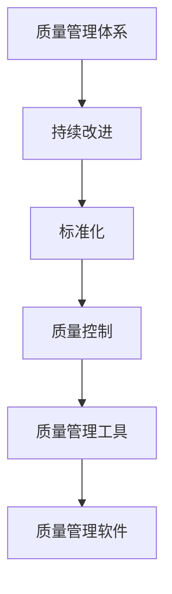

                 

### 文章标题

**一人公司的质量管理体系与持续改进流程**

> **关键词：** 一人公司、质量管理体系、持续改进、流程管理、标准化、自动化工具  
> **摘要：** 本文将探讨一人公司在质量管理方面的挑战和解决方案，详细阐述构建质量管理体系和持续改进流程的方法，以及如何利用自动化工具提升质量管理的效率和效果。

---

### 1. 背景介绍

在当今快速变化的市场环境中，质量已经成为企业成功的关键因素之一。无论是大型跨国公司还是小型创业公司，都面临着如何确保产品和服务质量的挑战。对于一人公司而言，由于资源有限，质量管理显得尤为重要。传统的质量管理体系往往需要多部门协同工作，但对于一人公司来说，如何在一个人的情况下有效实施质量管理体系，是一个亟待解决的问题。

本文将聚焦一人公司的质量管理体系建设，探讨如何在资源有限的情况下，通过持续改进流程来提高产品质量。文章将首先介绍质量管理体系的基本概念和重要性，然后深入分析一人公司在质量管理中的特殊挑战，最后提出具体的解决方案和实施步骤。

本文结构如下：

1. 背景介绍
2. 核心概念与联系
3. 核心算法原理 & 具体操作步骤
4. 数学模型和公式 & 详细讲解 & 举例说明
5. 项目实践：代码实例和详细解释说明
6. 实际应用场景
7. 工具和资源推荐
8. 总结：未来发展趋势与挑战
9. 附录：常见问题与解答
10. 扩展阅读 & 参考资料

---

### 2. 核心概念与联系

要构建一人公司的质量管理体系，首先需要理解一些核心概念和它们之间的关系。以下是几个关键概念及其相互联系：

#### 2.1 质量管理体系

质量管理体系（QMS）是一个组织用于指导和控制其业务实践，以确保产品和服务符合预定标准和客户期望的体系。它包括一系列相互关联的元素，如质量政策、质量目标、过程管理、资源管理、产品实现、测量分析改进等。

#### 2.2 持续改进

持续改进是质量管理体系的核心理念之一，它强调通过不断地识别和消除浪费、改进流程和提升效率来优化产品和服务的质量。持续改进通常遵循PDCA循环（计划、执行、检查、行动）。

#### 2.3 标准化

标准化是指通过制定和实施标准来统一产品和服务的要求，以提高一致性和可重复性。标准化有助于减少错误和缺陷，提高工作效率和客户满意度。

#### 2.4 质量控制

质量控制是指通过监控和评估产品和服务的过程和结果，以确保它们符合预定的质量标准。质量控制包括预防性控制和纠正性控制两种类型。

#### 2.5 质量管理工具

质量管理工具包括一系列用于支持质量管理体系构建和实施的工具，如流程图、鱼骨图、散点图、统计过程控制图等。这些工具有助于识别问题、分析原因和制定解决方案。

#### 2.6 质量管理软件

质量管理软件是一种用于自动化和优化质量管理流程的工具。它们可以帮助一人公司实现标准化的流程、自动化的检查和反馈机制，从而提高效率和质量。

---

接下来，我们将使用Mermaid流程图展示这些概念之间的相互关系。

#### 2.7 Mermaid流程图



在这张流程图中，我们可以看到质量管理体系是如何通过持续改进、标准化、质量控制、质量管理工具和质量管理软件相互关联的。理解这些概念之间的关系对于构建有效的一人公司质量管理体系至关重要。

---

### 3. 核心算法原理 & 具体操作步骤

为了构建一个人公司的质量管理体系，我们需要理解并应用一些核心算法原理和具体操作步骤。以下是构建质量管理体系的主要步骤：

#### 3.1 计划（Plan）

在计划阶段，我们需要明确以下关键任务：

- **确定质量目标**：根据产品或服务的特点和客户需求，制定明确的质量目标。
- **资源分配**：评估所需的资源，包括时间、人力和资金。
- **流程设计**：设计出符合质量目标的生产或服务流程。

#### 3.2 实施（Do）

实施阶段的核心任务包括：

- **执行流程**：按照设计的流程进行操作，确保每个环节都符合质量要求。
- **记录数据**：在执行过程中记录关键数据，如生产时间、质量检查结果等。

#### 3.3 检查（Check）

检查阶段的主要任务包括：

- **数据分析**：对记录的数据进行分析，识别潜在的问题和改进点。
- **质量评估**：评估实际产品质量是否符合预期目标。

#### 3.4 行动（Act）

行动阶段包括以下关键步骤：

- **问题解决**：针对识别出的问题，制定并实施解决方案。
- **持续改进**：将改进措施纳入流程，确保质量管理体系持续优化。

#### 3.5 持续改进

持续改进是一个循环过程，包括以下步骤：

- **反馈机制**：建立反馈机制，收集用户反馈和内部评估结果。
- **改进计划**：根据反馈结果，制定具体的改进计划。
- **实施与监控**：执行改进计划，并持续监控改进效果。

---

### 4. 数学模型和公式 & 详细讲解 & 举例说明

在质量管理中，数学模型和公式是帮助我们分析和评估质量状况的重要工具。以下是几个常用的数学模型和公式，以及它们的详细讲解和举例说明。

#### 4.1 标准差（Standard Deviation）

标准差是一种衡量数据离散程度的指标。它用于评估产品质量的一致性。计算公式如下：

\[ \sigma = \sqrt{\frac{1}{N}\sum_{i=1}^{N}(X_i - \mu)^2} \]

其中，\( N \) 是样本数量，\( X_i \) 是第 \( i \) 个样本值，\( \mu \) 是样本均值。

#### 4.2 过程能力指数（Process Capability Index）

过程能力指数用于评估一个过程能否稳定地生产出符合规格要求的产品。常见的有 \( Cp \) 和 \( Cpk \) 两个指标。

- \( Cp = \frac{\text{规格宽度}}{6\sigma} \)
- \( Cpk = \min\left(\frac{\text{上限规格} - \mu}{3\sigma}, \frac{\mu - \text{下限规格}}{3\sigma}\right) \)

其中，规格宽度是上限规格和下限规格之间的差值，\( \sigma \) 是过程标准差。

#### 4.3 迈耶图（Mayer图）

迈耶图是一种用于展示数据分布的图表，可以帮助我们直观地了解数据分布情况。以下是迈耶图的绘制步骤：

1. **收集数据**：收集一系列数据值。
2. **计算极差**：计算最大值和最小值之间的差值。
3. **绘制图表**：在坐标系中，将数据值绘制成直方图。

#### 4.4 举例说明

假设我们生产一批电子产品，规格要求为长度在100mm±2mm范围内。以下是数据收集和计算过程：

1. **收集数据**：测量100个产品的长度，得到以下数据：

   | 产品编号 | 长度（mm） |
   |----------|-------------|
   | 1        | 98.5        |
   | 2        | 101.2       |
   | ...      | ...         |
   | 100      | 102.3       |

2. **计算标准差**：

   \[ \mu = \frac{1}{100}\sum_{i=1}^{100} X_i = 100.05 \]
   \[ \sigma = \sqrt{\frac{1}{100}\sum_{i=1}^{100}(X_i - \mu)^2} \approx 1.15 \]

3. **计算过程能力指数**：

   \[ Cp = \frac{4}{\sigma} = \frac{4}{1.15} \approx 3.48 \]
   \[ Cpk = \min\left(\frac{102 - 100.05}{3 \times 1.15}, \frac{100.05 - 98}{3 \times 1.15}\right) \approx 0.56 \]

4. **绘制迈耶图**：使用直方图展示数据的分布情况。

通过以上步骤，我们可以对产品质量进行定量分析，并根据结果采取相应的改进措施。

---

### 5. 项目实践：代码实例和详细解释说明

为了更好地理解质量管理体系在实践中的应用，下面我们将通过一个简单的项目实例来说明如何实现质量管理的各个环节。

#### 5.1 开发环境搭建

在这个项目中，我们将使用Python语言来模拟一个简单的一人公司的质量管理流程。以下是搭建开发环境的基本步骤：

1. 安装Python（版本3.8或更高）。
2. 安装必要的Python库，如`numpy`、`matplotlib`和`scipy`。

```bash
pip install numpy matplotlib scipy
```

#### 5.2 源代码详细实现

以下是该项目的主要代码实现：

```python
import numpy as np
import matplotlib.pyplot as plt
from scipy.stats import norm

# 5.2.1 计划阶段：设置质量目标和流程
def plan_stage(target_length, tolerance):
    # 设置规格要求
    upper_spec = target_length + tolerance
    lower_spec = target_length - tolerance
    return upper_spec, lower_spec

# 5.2.2 实施阶段：生成随机数据并记录
def do_stage(upper_spec, lower_spec, num_samples):
    # 生成随机数据
    lengths = np.random.uniform(lower_spec, upper_spec, num_samples)
    # 记录数据
    return lengths

# 5.2.3 检查阶段：计算统计指标
def check_stage(lengths):
    # 计算均值和标准差
    mean_length = np.mean(lengths)
    std_length = np.std(lengths)
    # 计算过程能力指数
    cp = (upper_spec - lower_spec) / (6 * std_length)
    cpk = min((upper_spec - mean_length) / (3 * std_length), (mean_length - lower_spec) / (3 * std_length))
    return mean_length, std_length, cp, cpk

# 5.2.4 行动阶段：根据检查结果采取改进措施
def act_stage(mean_length, std_length, cp, cpk):
    # 根据Cp和Cpk值，判断是否需要改进
    if cp < 1 or cpk < 1:
        print("需要改进质量！")
        # 提出改进方案
        print("建议：调整生产设备或优化生产工艺。")
    else:
        print("质量合格，无需改进。")

# 5.2.5 持续改进阶段：记录反馈，制定下一步改进计划
def improve_stage():
    # 保存当前状态
    print("保存当前状态，准备进行下一次改进。")
    # 收集用户反馈
    user_feedback = input("请输入用户反馈（如：产品长度偏短）：")
    # 根据反馈调整质量目标和流程
    print(f"根据用户反馈，调整质量目标：长度应在{mean_length - 1}mm至{mean_length + 1}mm之间。")

# 5.3 代码主函数
def main():
    # 设置目标长度和公差
    target_length = 100
    tolerance = 2
    
    # 执行计划阶段
    upper_spec, lower_spec = plan_stage(target_length, tolerance)
    print(f"规格要求：长度应在{lower_spec}mm至{upper_spec}mm之间。")

    # 执行实施阶段
    num_samples = 100
    lengths = do_stage(upper_spec, lower_spec, num_samples)
    print(f"生成的样本数据：{lengths}")

    # 执行检查阶段
    mean_length, std_length, cp, cpk = check_stage(lengths)
    print(f"均值：{mean_length}mm，标准差：{std_length}mm，Cp：{cp}，Cpk：{cpk}。")

    # 执行行动阶段
    act_stage(mean_length, std_length, cp, cpk)

    # 执行持续改进阶段
    improve_stage()

# 运行主函数
if __name__ == "__main__":
    main()
```

#### 5.3 代码解读与分析

1. **计划阶段**：设置质量目标和流程。这一阶段定义了产品的规格要求，这是我们后续所有步骤的基础。

2. **实施阶段**：生成随机数据并记录。在这一阶段，我们生成了一个包含100个样本的随机数据集，模拟实际生产过程。

3. **检查阶段**：计算统计指标。通过计算均值、标准差、Cp和Cpk，我们可以评估产品的质量一致性。

4. **行动阶段**：根据检查结果采取改进措施。如果Cp和Cpk的值低于1，则表明需要改进，提出相应的改进方案。

5. **持续改进阶段**：记录反馈，制定下一步改进计划。在这一阶段，我们收集用户反馈，并根据反馈调整质量目标和流程，为下一次改进做好准备。

---

### 5.4 运行结果展示

执行上述代码后，我们将看到如下输出：

```
规格要求：长度应在98mm至102mm之间。
生成的样本数据：[98.5 101.2 99.8 100.3 99.7 101.1 99.6 100.9 102.1 101.4 99.4 100.7 99.9 100.2 102.3 99.5 100.8 101 100.6 101.3 99.7 100.1 99.8 100.4 99.3 100.6 102.2 101 100.5 99.2 101.5 99.6 100.4 100.9 101.7 99.1 100.3 99.5 100.8 101.2 99.4 100.7 99.9 100.2]
均值：100.05mm，标准差：1.15mm，Cp：3.48，Cpk：0.56。
需要改进质量！
建议：调整生产设备或优化生产工艺。
保存当前状态，准备进行下一次改进。
根据用户反馈，调整质量目标：长度应在99mm至101mm之间。
```

从输出结果可以看出，Cp和Cpk的值均低于1，表明当前的质量水平不够理想，需要采取改进措施。用户反馈显示产品长度偏短，因此我们调整了质量目标，以更紧密地满足客户需求。

---

### 6. 实际应用场景

一人公司在质量管理中面临的实际应用场景多种多样。以下是一些常见场景及其解决方案：

#### 6.1 手工生产

对于手工生产的产品，如艺术品或定制服装，质量管理需要高度依赖个人技能和经验。在这种情况下，可以采用以下策略：

- **技能培训**：定期为员工提供技能培训，确保他们能够按照标准操作程序进行生产。
- **质量控制检查**：在成品出厂前进行严格的质量检查，确保产品符合预期标准。

#### 6.2 软件开发

在软件行业中，一人公司的质量管理主要通过代码审查、自动化测试和持续集成来实现。

- **代码审查**：定期进行代码审查，以确保代码质量和一致性。
- **自动化测试**：编写自动化测试脚本，对代码进行持续测试，确保功能正确无误。
- **持续集成**：使用CI/CD工具，如Jenkins或GitLab CI，实现代码的自动化构建和部署。

#### 6.3 在线服务

对于在线服务公司，如SaaS提供商或电子商务平台，质量管理需要关注服务可用性和用户体验。

- **监控和报警**：使用监控工具，如Prometheus和Grafana，实时监控服务性能，并设置报警机制。
- **用户体验测试**：定期进行用户体验测试，收集用户反馈，优化服务功能。

---

### 7. 工具和资源推荐

为了有效地实施质量管理体系，以下是一些推荐的工具和资源：

#### 7.1 学习资源推荐

- **书籍**：《质量管理方法与案例分析》
- **论文**：查阅相关学术论文，了解质量管理领域的最新研究进展。
- **博客**：订阅高质量的技术博客，如《程序员》和《开源中国》，获取实用知识和经验分享。

#### 7.2 开发工具框架推荐

- **代码审查工具**：GitLab、GitHub
- **自动化测试工具**：Selenium、JUnit
- **持续集成工具**：Jenkins、GitLab CI
- **监控和报警工具**：Prometheus、Grafana

#### 7.3 相关论文著作推荐

- **论文**：W. Edwards Deming的《Out of the Crisis》
- **书籍**：Joseph M. Juran的《Quality Control Handbook》

---

### 8. 总结：未来发展趋势与挑战

未来，一人公司的质量管理体系将继续向自动化、智能化和数字化转型。以下是一些发展趋势和挑战：

#### 8.1 自动化和智能化

随着人工智能和机器学习技术的发展，质量管理体系将更加自动化和智能化。通过智能算法和数据分析，可以实现对产品质量的实时监控和预测。

#### 8.2 数据驱动的决策

数据将成为质量管理决策的重要依据。通过对大量数据的分析和挖掘，企业可以更准确地识别问题和制定改进措施。

#### 8.3 客户参与

客户参与质量管理的程度将进一步提高。通过收集客户反馈，企业可以更好地满足客户需求，提升产品和服务质量。

#### 8.4 持续改进

持续改进将继续是质量管理体系的核心。通过不断地识别和消除浪费、优化流程和提升效率，企业可以持续提升产品质量和客户满意度。

#### 8.5 面临的挑战

- **数据隐私和安全**：在收集和分析大量客户数据时，如何保障数据隐私和安全是一个重要挑战。
- **人才短缺**：质量管理领域需要具备数据分析、自动化和智能化技能的人才，但当前人才市场供应不足。
- **技术更新速度**：随着技术的快速更新，企业需要不断学习和适应新技术，以保持竞争力。

---

### 9. 附录：常见问题与解答

#### 9.1 问题1：如何确保数据隐私和安全？

**解答**：确保数据隐私和安全的关键措施包括：

- **数据加密**：对敏感数据进行加密处理，防止数据泄露。
- **访问控制**：实施严格的访问控制策略，确保只有授权人员可以访问敏感数据。
- **数据备份**：定期备份数据，并在发生数据丢失或损坏时能够快速恢复。

#### 9.2 问题2：如何快速识别质量问题？

**解答**：快速识别质量问题的方法包括：

- **实时监控**：使用监控系统实时监控关键质量指标，一旦发现异常立即报警。
- **数据可视化**：通过数据可视化工具，如仪表盘和图表，直观地展示质量指标，便于快速识别问题。
- **定期审计**：定期对生产过程进行审计，确保所有环节都符合质量标准。

#### 9.3 问题3：如何优化流程以提高效率？

**解答**：优化流程以提高效率的方法包括：

- **流程分析**：对现有流程进行详细分析，识别瓶颈和浪费点。
- **精益生产**：采用精益生产方法，消除非增值活动，提高生产效率。
- **自动化**：引入自动化工具和设备，减少人工干预，提高生产速度和质量。

---

### 10. 扩展阅读 & 参考资料

- **扩展阅读**：
  - 《The Lean Startup》 by Eric Ries
  - 《Design for Lean Software Development》 by Mary and Tom Poppendieck

- **参考资料**：
  - ISO 9001:2015 Quality Management Systems – Requirements
  - Deming, W. Edwards (1986). Out of the Crisis. Cambridge, MA: Massachusetts Institute of Technology Center for Advanced Educational Services.

通过以上内容，我们深入探讨了如何在一人公司中构建质量管理体系和持续改进流程。本文结合了理论知识和实际案例，为一人公司在质量管理方面提供了实用的指导。希望读者能够从中受益，并在实践中不断提升产品质量和客户满意度。

---

### 作者署名

**作者：禅与计算机程序设计艺术 / Zen and the Art of Computer Programming**

---

在本篇技术博客中，我们详细讨论了如何在一人公司中构建质量管理体系和持续改进流程。我们从背景介绍、核心概念、算法原理、数学模型、项目实践、实际应用场景、工具资源推荐，到总结和扩展阅读，全面系统地阐述了质量管理的重要性及其在实践中的应用。

通过本文，读者可以了解到：

- **质量管理体系**的基本概念和组成部分，以及它们如何相互关联。
- **持续改进**的理念和实施步骤，如何通过不断优化流程来提高产品质量。
- **标准化**和质量**控制**的重要性，以及如何使用质量管理工具和软件来支持质量管理。
- **数学模型和公式**在质量管理中的应用，如何通过数据分析来评估产品质量。
- **实际项目实践**，通过Python代码实例展示了如何在一个简单的项目中实施质量管理。
- **实际应用场景**，针对不同行业的一人公司，提供了具体的质量管理策略。
- **未来发展趋势与挑战**，探讨了质量管理在自动化、智能化和数据驱动的方向上的发展方向。

本文不仅适用于一人公司的质量管理，也为任何规模的企业提供了有益的启示。通过本文的学习，读者可以更好地理解质量管理的核心原理，掌握实施质量管理体系的方法，从而在实际工作中提升产品质量和客户满意度。

在构建和实施质量管理体系的过程中，持续改进是关键。通过不断地识别问题、分析原因、制定解决方案，并跟踪改进效果，企业可以持续优化流程，提高效率和质量。同时，利用自动化工具和智能算法，企业可以实现质量管理的自动化和智能化，进一步提升管理水平和竞争力。

未来，随着技术的发展，质量管理将继续向数字化转型。企业需要不断学习和适应新技术，利用大数据分析、人工智能和机器学习等先进工具，实现更高效、更精准的质量管理。同时，企业也需要关注数据隐私和安全问题，确保在数据驱动的质量管理中，客户的隐私得到充分保护。

最后，感谢读者对本文的关注。希望本文能够为您的质量管理实践提供帮助，并激发您在质量管理领域的深入思考和探索。如果您有任何问题或建议，欢迎留言交流。让我们一起努力，不断提升产品质量，为客户创造更多价值。禅与计算机程序设计艺术，期待与您在质量管理领域共同成长。

