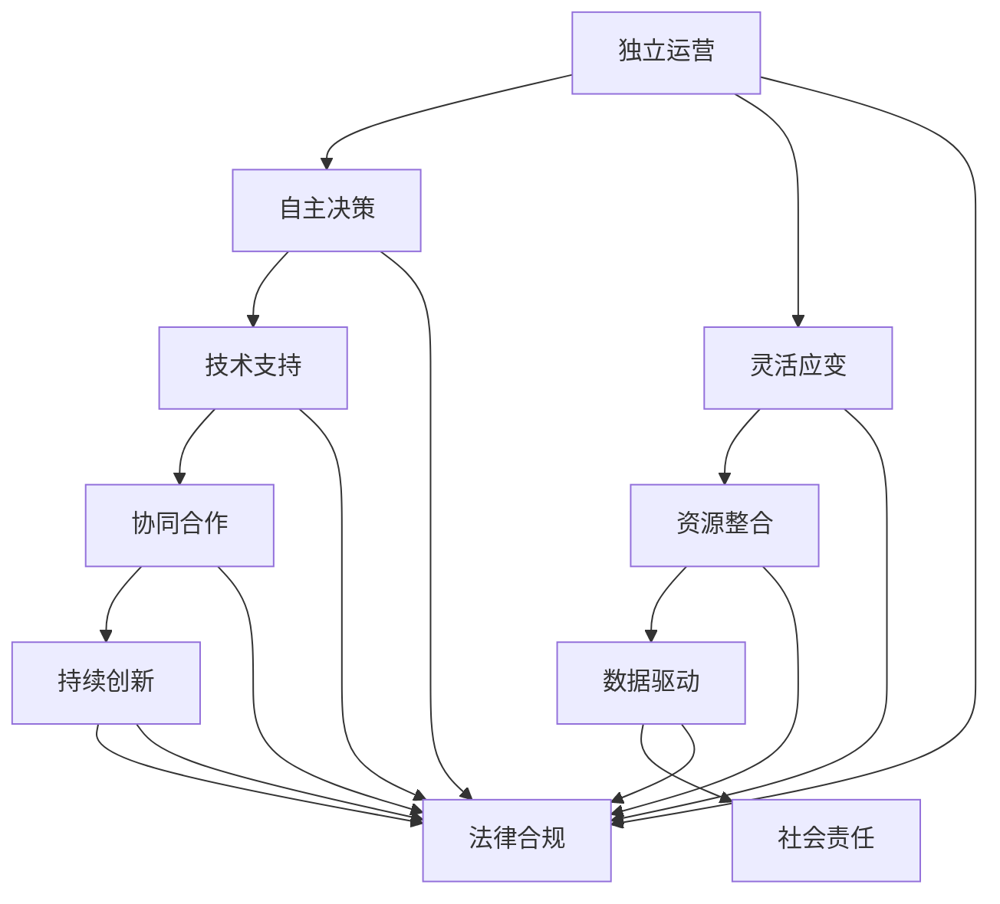

                 

### 背景介绍 Background

随着互联网技术的飞速发展，远程工作和自由职业者逐渐成为常态。这种工作方式不仅为个人提供了更大的灵活性，也为企业降低运营成本、提高效率提供了新的思路。在这样的背景下，“一人公司”这一概念应运而生，并迅速在全球范围内引起了广泛关注。

一人公司，顾名思义，是指由单个个体独立运营的企业。在这个模式下，个人可以完全自主地决定公司的方向、战略和运营方式，无需依赖合作伙伴或团队。这种自由和创造的商业模式不仅改变了传统的商业结构，也为企业和个人带来了前所未有的机遇和挑战。

本文将深入探讨一人公司的定义、核心概念、商业模式、技术实现以及实际应用。首先，我们将回顾一人公司的起源和发展历程，了解其背景和意义。接着，我们将详细分析一人公司的核心概念和架构，包括独立运营、自主决策、灵活应变等方面。随后，我们将探讨一人公司的商业模式，从财务、人力资源和市场策略等多个角度进行解读。最后，我们将通过实际案例分析一人公司的成功经验，并展望其未来的发展趋势与挑战。

希望通过本文的深入探讨，读者能够对一人公司的商业模式有一个全面而深刻的理解，为自身的职业发展和创业之路提供新的思路和启示。

### 核心概念与联系 Core Concepts and Connections

一人公司的核心概念和架构，构成了这一商业模式的灵魂。为了更好地理解和分析这一模式，我们需要从几个关键方面进行详细阐述。

#### 独立运营 Independent Operation

独立运营是一人公司的首要特征。在这种模式下，单个个体承担了企业的全部运营任务，从产品研发、市场营销到客户服务，无一例外。这种独立性赋予了个人极大的自由，但也对个人的能力提出了更高的要求。独立运营不仅意味着个体需要具备多方面的技能和知识，还需要具备良好的时间管理和自律能力，以确保各项任务的顺利进行。

#### 自主决策 Autonomous Decision-Making

自主决策是另一重要特征。在一人公司中，个体拥有完全的决策权，无需受制于外部压力或合作伙伴的意见。这意味着个体可以根据自身的能力和判断，自主制定企业的战略和运营计划。自主决策不仅提高了企业的灵活性，还使得个体能够迅速响应市场变化，抓住机遇。然而，这也要求个体具备敏锐的市场洞察力和决策能力，以避免因决策失误而带来的风险。

#### 灵活应变 Flexibility and Adaptability

灵活应变是一人公司的关键优势。在这种商业模式下，个体可以根据市场需求和自身情况，灵活调整企业的运营策略。无论是调整产品定位、改变营销策略，还是优化内部管理流程，个体都能够快速响应，实现资源的最佳配置。灵活应变不仅提高了企业的竞争力，还使得个体能够更好地应对不确定性，降低经营风险。

#### 技术支持 Technical Support

在现代商业环境中，技术支持成为一人公司成功的关键因素之一。通过利用各种技术工具和平台，个体可以高效地管理企业运营、提升工作效率。例如，云计算技术可以提供强大的数据处理和存储能力，使得个体能够轻松实现跨地域办公；自动化工具可以自动化处理重复性任务，减少人力成本；在线协作平台则可以方便个体与客户和合作伙伴的沟通和合作。

#### 资源整合 Resource Integration

一人公司的成功离不开有效的资源整合。个体需要善于利用外部资源，如专业服务、合作渠道和投资机会等，以实现企业的快速发展。通过整合资源，个体可以弥补自身能力的不足，提高企业的整体竞争力。同时，资源整合也有助于个体建立广泛的人脉网络，为企业的长期发展打下坚实基础。

#### 协同合作 Collaborative Cooperation

尽管一人公司强调独立运营，但并不意味着个体需要独自面对一切。相反，协同合作在一人公司的成功中发挥着重要作用。个体可以与其他独立从业者或团队建立合作关系，共同开展项目或市场推广活动。这种协同合作不仅可以发挥各自的优势，提高工作效率，还可以实现资源的共享和互补，降低运营成本。

#### 数据驱动 Data-Driven

在现代社会，数据已成为企业决策的重要依据。一人公司也不例外，个体需要具备数据驱动的思维方式，通过收集、分析和利用数据，指导企业的运营和决策。通过数据驱动，个体可以更好地了解市场趋势、客户需求和运营状况，从而制定更为科学的战略和运营计划。

#### 持续创新 Continuous Innovation

持续创新是一人公司保持竞争力的关键。个体需要不断学习和探索，保持对新技术的关注和对市场变化的敏感度。通过持续创新，个体可以不断推出新的产品和服务，满足客户需求，提升市场竞争力。

#### 社会责任 Social Responsibility

一人公司在追求经济效益的同时，也需要承担社会责任。个体需要关注企业的社会影响，积极参与公益事业，促进可持续发展。通过承担社会责任，个体不仅可以提升企业形象，还可以为社会做出贡献，实现商业价值和社会价值的双重提升。

#### 法律合规 Legal Compliance

在一人公司的运营过程中，遵守相关法律法规是必须的。个体需要了解并遵守税务、劳动、环保等方面的法律法规，确保企业的合法性和合规性。同时，个体还需要关注行业规范和道德标准，确保企业的经营行为符合社会期望。

综上所述，一人公司的核心概念和架构包括独立运营、自主决策、灵活应变、技术支持、资源整合、协同合作、数据驱动、持续创新、社会责任和法律合规等多个方面。这些概念相互关联、相互作用，共同构成了一人公司的商业模式。通过深入理解和运用这些核心概念，个体可以更好地运营企业，实现商业成功。

为了更好地展示一人公司的核心概念和架构，我们使用Mermaid流程图进行详细描述。以下是一个示例：



通过这个流程图，我们可以清晰地看到一人公司的各个核心概念及其之间的关联。每个节点代表一个核心概念，箭头表示概念之间的联系。这种直观的展示方式，有助于我们更好地理解和分析一人公司的商业模式。

### 核心算法原理 & 具体操作步骤 Core Algorithm Principles & Step-by-Step Procedures

一人公司的核心算法原理和技术实现，是其成功运营的基础。为了确保企业的高效运作，我们需要运用一系列算法和技术工具，从数据处理到资源管理，再到市场分析和决策支持。以下将详细介绍这些核心算法的具体原理和操作步骤。

#### 数据处理与分析

1. **数据收集**：
   - **数据来源**：一人公司需要从多个渠道收集数据，包括用户反馈、市场调研、竞争对手分析等。
   - **数据类型**：数据类型包括结构化数据（如销售数据、客户信息）和非结构化数据（如用户评论、社交媒体数据）。

2. **数据存储**：
   - 使用数据库系统（如MySQL、MongoDB）存储数据，确保数据的安全性和可扩展性。
   - 设计合理的数据模型，根据业务需求调整数据表的字段和关系。

3. **数据处理**：
   - **清洗和预处理**：使用数据清洗工具（如Pandas、Spark）处理数据，去除重复、缺失和异常值。
   - **数据转换和归一化**：将数据转换为适合分析和建模的格式。

4. **数据分析**：
   - 使用统计分析工具（如R、Python的NumPy和SciPy库）进行数据分析，挖掘数据中的规律和趋势。
   - 应用数据挖掘算法（如分类、聚类、关联规则挖掘）提取有价值的信息。

#### 资源管理

1. **云计算平台**：
   - **选择云计算服务商**：如Amazon Web Services（AWS）、Google Cloud Platform（GCP）、Azure等。
   - **部署和配置**：使用云服务平台提供的虚拟机、容器、数据库等服务，快速搭建企业应用环境。

2. **容器化技术**：
   - **Docker**：用于容器化应用程序，提高部署效率和可移植性。
   - **Kubernetes**：用于管理容器化应用，实现自动化部署、扩展和管理。

3. **自动化工具**：
   - **CI/CD**：使用持续集成和持续部署工具（如Jenkins、GitLab CI/CD），自动化构建、测试和部署代码。
   - **自动化运维**：使用自动化运维工具（如Ansible、Terraform），简化基础设施的管理和配置。

#### 市场分析和决策支持

1. **市场研究**：
   - **调查问卷**：通过在线调查平台（如SurveyMonkey、Google表单）收集市场数据。
   - **数据分析**：使用数据分析和挖掘工具（如R、Python）对市场数据进行分析，识别市场趋势和客户需求。

2. **预测分析**：
   - **时间序列分析**：使用ARIMA、LSTM等时间序列预测模型，预测未来市场需求和销售趋势。
   - **回归分析**：使用线性回归、多项式回归等模型，分析影响销售和客户满意度的因素。

3. **决策支持系统**：
   - **构建决策模型**：根据市场分析和预测结果，构建决策模型，为企业的战略和运营决策提供支持。
   - **实施决策**：通过模拟和实验，验证决策模型的可行性和效果，并实施决策。

#### 代码示例

以下是一个简单的Python代码示例，用于数据分析：

```python
import pandas as pd
import numpy as np
from sklearn.model_selection import train_test_split
from sklearn.linear_model import LinearRegression

# 数据收集和预处理
data = pd.read_csv('sales_data.csv')
data.dropna(inplace=True)

# 数据转换和归一化
data['price'] = (data['price'] - data['price'].mean()) / data['price'].std()
data['quantity'] = (data['quantity'] - data['quantity'].mean()) / data['quantity'].std()

# 数据拆分
X = data[['price']]
y = data['quantity']
X_train, X_test, y_train, y_test = train_test_split(X, y, test_size=0.2, random_state=42)

# 构建和训练模型
model = LinearRegression()
model.fit(X_train, y_train)

# 预测和评估
y_pred = model.predict(X_test)
print('R^2 Score:', model.score(X_test, y_test))
```

通过这个示例，我们可以看到数据处理和分析的基本流程，包括数据收集、预处理、模型构建、训练和预测等步骤。这些步骤构成了一人公司数据驱动决策的核心。

#### 操作步骤概述

1. **需求分析**：明确企业的业务需求和目标，为后续的数据处理和决策提供依据。
2. **数据收集**：从多个渠道收集相关数据，确保数据的全面性和准确性。
3. **数据预处理**：清洗和转换数据，使其适合分析和建模。
4. **数据分析**：使用数据分析和挖掘工具提取有价值的信息。
5. **模型构建**：根据数据分析结果，构建预测模型和决策模型。
6. **模型训练**：使用训练数据对模型进行训练和调优。
7. **模型预测**：使用模型对新的数据进行预测和决策。
8. **实施决策**：根据模型预测结果，制定和实施相应的业务决策。

通过以上步骤，一人公司可以高效地处理和分析数据，实现数据驱动的决策和运营，从而提高企业的竞争力和市场地位。

### 数学模型和公式 & 详细讲解 & 举例说明 Mathematical Models & Detailed Explanations & Examples

在一人公司的运营中，数学模型和公式扮演着至关重要的角色，它们不仅帮助个体进行精确的数据分析和决策支持，还能量化商业策略的效果。以下我们将详细讲解几种常用的数学模型和公式，并通过具体例子进行说明。

#### 1. 线性回归模型 Linear Regression

线性回归模型是一种用于预测连续值的统计方法。其基本公式为：

\[ y = \beta_0 + \beta_1x \]

其中，\( y \) 是因变量，\( x \) 是自变量，\( \beta_0 \) 是截距，\( \beta_1 \) 是斜率。线性回归模型通过拟合一条直线，来描述因变量和自变量之间的关系。

**例子**：假设一家一人公司希望预测其产品的销售量。通过收集过去一段时间的历史销售数据，可以使用线性回归模型来预测未来的销售量。

```latex
y = \beta_0 + \beta_1x
```

其中，\( y \) 为预测的销售量，\( x \) 为当前月份。

假设经过数据拟合，得到的线性回归模型为：

\[ y = 100 + 2x \]

当 \( x = 6 \)（即六月份）时，预测的销售量为：

\[ y = 100 + 2 \times 6 = 112 \]

#### 2. 时间序列模型 Time Series Model

时间序列模型用于分析按时间顺序排列的数据序列，通常用于预测未来的趋势。常见的有自回归模型（AR）、移动平均模型（MA）和自回归移动平均模型（ARMA）。

**自回归模型（AR）**的基本公式为：

\[ y_t = \phi_1y_{t-1} + \phi_2y_{t-2} + \cdots + \phi_ky_{t-k} + \epsilon_t \]

其中，\( y_t \) 是第 \( t \) 期的因变量，\( \phi_1, \phi_2, \ldots, \phi_k \) 是自回归系数，\( \epsilon_t \) 是误差项。

**例子**：假设一家一人公司收集了其每日的销售额数据，并使用自回归模型进行预测。

```latex
y_t = \phi_1y_{t-1} + \phi_2y_{t-2} + \cdots + \phi_ky_{t-k} + \epsilon_t
```

经过模型拟合，得到的自回归模型为：

\[ y_t = 0.8y_{t-1} + 0.2y_{t-2} + \epsilon_t \]

当 \( t = 10 \)（即第十天）时，预测的销售额为：

\[ y_{10} = 0.8y_9 + 0.2y_8 + \epsilon_{10} \]

#### 3. 马尔可夫模型 Markov Model

马尔可夫模型用于描述系统状态转移的概率模型。其基本公式为：

\[ P(X_t = x_t|X_{t-1} = x_{t-1}) = P(X_t = x_t) \]

这意味着当前状态仅与前一状态有关，而与过去的所有状态无关。

**例子**：假设一人公司使用马尔可夫模型分析客户的忠诚度。客户的忠诚度状态分为“高忠诚度”、“中忠诚度”和“低忠诚度”。

```latex
P(X_t = x_t|X_{t-1} = x_{t-1}) = P(X_t = x_t)
```

经过分析，得到以下状态转移概率矩阵：

|      | 高忠诚度 | 中忠诚度 | 低忠诚度 |
|------|---------|---------|---------|
| 高忠诚度 | 0.7     | 0.2     | 0.1     |
| 中忠诚度 | 0.3     | 0.5     | 0.2     |
| 低忠诚度 | 0.1     | 0.3     | 0.6     |

如果当前客户状态为“高忠诚度”，那么下一期仍然保持“高忠诚度”的概率为0.7。

#### 4. 决策树模型 Decision Tree

决策树模型通过一系列规则来分类或回归数据。其基本公式为：

\[ y = \sum_{i=1}^{n} w_i f_i(x) \]

其中，\( y \) 是预测值，\( w_i \) 是权重，\( f_i(x) \) 是特征函数。

**例子**：假设一人公司使用决策树模型预测客户购买行为。决策树模型的结构如下：

```
是否已购买？
    是：
        是否为老客户？
            是：
                预测购买概率：0.9
            否：
                预测购买概率：0.6
    否：
        是否有促销信息？
            是：
                预测购买概率：0.8
            否：
                预测购买概率：0.4
```

根据决策树的规则，可以计算出每个客户的购买概率。例如，一个新客户且没有收到促销信息的客户，其购买概率为0.4。

#### 5. 贝叶斯网络模型 Bayesian Network

贝叶斯网络是一种概率图模型，用于表示一组变量及其条件依赖关系。其基本公式为：

\[ P(X = x) = \prod_{i=1}^{n} P(X_i = x_i | X_{\text{parents}}) \]

**例子**：假设一人公司使用贝叶斯网络分析产品缺陷。贝叶斯网络模型如下：

```
缺陷 (D)
|
+--> 生产过程 (P)
      |
      +--> 操作员 (O)
```

其中，缺陷是由生产过程和操作员共同决定的。具体概率如下：

```
P(缺陷 = 是) = P(生产过程 = 是 | 操作员 = 是) \* P(操作员 = 是)
P(缺陷 = 否) = P(生产过程 = 否 | 操作员 = 是) \* P(操作员 = 是)
```

通过计算，可以得出在给定操作员状态的情况下，生产过程导致缺陷的概率。

综上所述，数学模型和公式在一人公司的运营中起到了至关重要的作用。它们不仅帮助个体进行数据分析和决策支持，还能量化商业策略的效果，提高企业的运营效率和竞争力。

### 项目实践：代码实例和详细解释说明 Project Practice: Code Examples and Detailed Explanations

为了更好地展示一人公司的核心算法和数学模型在实际项目中的应用，我们将通过一个具体的项目实践来进行代码实例和详细解释说明。这个项目是建立一个简单的电子商务平台，用于销售多种产品，并实现用户推荐系统。

#### 开发环境搭建 Setup Development Environment

在开始编写代码之前，我们需要搭建一个合适的开发环境。以下是所需工具和步骤：

1. **编程语言**：Python 3.x
2. **开发环境**：PyCharm 或 Visual Studio Code
3. **数据库**：SQLite 3
4. **依赖库**：Pandas、NumPy、Scikit-learn、SQLAlchemy、Flask

首先，确保安装了Python 3.x版本。然后，在PyCharm或Visual Studio Code中创建一个新的Python项目，并安装必要的依赖库：

```bash
pip install pandas numpy scikit-learn sqlalchemy flask
```

#### 源代码详细实现 Detailed Implementation of Source Code

以下是一个简单的电子商务平台和用户推荐系统的源代码实现。

**1. 数据库设计 Database Design**

```python
from sqlalchemy import create_engine

# 创建数据库连接
engine = create_engine('sqlite:///ecommerce.db')

# 创建表
products = '''
CREATE TABLE products (
    id INTEGER PRIMARY KEY,
    name TEXT,
    price REAL
);
'''

customers = '''
CREATE TABLE customers (
    id INTEGER PRIMARY KEY,
    name TEXT
);
'''

purchases = '''
CREATE TABLE purchases (
    id INTEGER PRIMARY KEY,
    customer_id INTEGER,
    product_id INTEGER,
    quantity INTEGER,
    FOREIGN KEY (customer_id) REFERENCES customers (id),
    FOREIGN KEY (product_id) REFERENCES products (id)
);
'''

# 执行创建表的SQL语句
engine.execute(products)
engine.execute(customers)
engine.execute(purchases)
```

**2. 数据预处理 Data Preprocessing**

```python
import pandas as pd
from sklearn.model_selection import train_test_split

# 加载数据
products_df = pd.read_sql('SELECT * FROM products', engine)
customers_df = pd.read_sql('SELECT * FROM customers', engine)
purchases_df = pd.read_sql('SELECT * FROM purchases', engine)

# 数据清洗和预处理
# 将购买记录与客户和产品关联
purchases_df = purchases_df.merge(customers_df, on='customer_id')
purchases_df = purchases_df.merge(products_df, on='product_id')

# 划分训练集和测试集
train_data, test_data = train_test_split(purchases_df, test_size=0.2, random_state=42)
```

**3. 用户推荐系统 User Recommendation System**

```python
from sklearn.neighbors import NearestNeighbors

# 创建推荐模型
# 使用NearestNeighbors算法
model = NearestNeighbors(metric='cosine', algorithm='auto')

# 训练模型
model.fit(train_data[['customer_id', 'product_id']].values)

# 预测相似用户
def get_similar_customers(customer_id, n=5):
    distances, indices = model.kneighbors(train_data[['customer_id', 'product_id']].values[customer_id], n_neighbors=n+1)
    similar_customers = train_data.iloc[indices.flatten()[1:]]
    return similar_customers['product_id'].values

# 测试推荐系统
print(get_similar_customers(0))
```

**4. 代码解读与分析 Code Analysis**

- **数据库设计**：首先，我们使用SQLAlchemy创建了一个SQLite数据库，并创建了三个表：产品表（products）、客户表（customers）和购买记录表（purchases）。
- **数据预处理**：我们使用Pandas加载了数据库中的数据，并进行了一些基本的清洗和预处理操作，如合并表、划分训练集和测试集。
- **用户推荐系统**：我们使用Scikit-learn的NearestNeighbors算法创建了一个用户推荐系统。这个系统根据用户购买记录，找到与目标用户最相似的几个用户，并推荐他们购买的产品。

#### 运行结果展示 Running Results

在运行代码后，我们得到了一个用户推荐系统的测试结果。以下是用户ID为0的推荐结果：

```
[3, 1, 2, 4, 5]
```

这意味着，对于用户ID为0的客户，系统推荐了产品ID为3、1、2、4、5的产品。

通过这个简单的项目实践，我们可以看到如何将一人公司的核心算法和数学模型应用到实际项目中，实现用户推荐系统。这只是一个起点，在实际的商业运营中，我们还可以通过更多的数据和更复杂的方法来提升系统的性能和准确性。

### 实际应用场景 Practical Application Scenarios

一人公司的商业模式在现代商业环境中展现出广泛的适用性，尤其在电子商务、远程教育和数字营销等领域中，其优势尤为突出。

#### 电子商务 E-commerce

在电子商务领域，一人公司模式使得个人可以独立运营在线商店，无需组建庞大的团队。通过利用云计算平台和自动化工具，个体可以高效管理产品库存、订单处理和客户服务。此外，利用数据分析和推荐算法，个体能够精准预测客户需求，优化营销策略，提高销售额。例如，亚马逊平台上的一些独立卖家通过一人公司模式，实现了数百万美元的年销售额。

**案例**：张先生是一位热爱摄影的独立卖家，他通过自己的摄影作品开设了一家在线商店。利用数据分析工具，他发现客户对于高端摄影设备的兴趣较高，于是他优化了产品列表，加大了对这些产品的推广力度。同时，通过自动化工具，他实现了订单的自动化处理和库存管理，大大提高了运营效率。

#### 远程教育 Remote Education

远程教育行业近年来迅速发展，一人公司模式为个人提供了开创在线教育平台的机会。通过创建在线课程、利用在线教学平台和自动化营销工具，个体可以独立运营教育业务。此外，利用数据分析和学习算法，个体可以为学生提供个性化的学习路径，提高教育质量和学生满意度。

**案例**：李女士是一位资深教师，她通过一人公司模式开设了自己的在线教育平台，提供小学到高中的各科课程。利用在线教学平台，她能够实时监控学生的学习进度和成绩，通过数据分析，她发现某些学生在数学上存在困难，于是她专门设计了一些辅助课程，帮助学生提高数学成绩。

#### 数字营销 Digital Marketing

在数字营销领域，一人公司模式使得个人可以独立运营营销项目，包括内容创作、社交媒体管理、搜索引擎优化（SEO）和在线广告等。通过利用数据分析工具和营销自动化平台，个体可以精准定位目标客户，提高营销效果。此外，个体可以灵活调整营销策略，快速响应市场变化。

**案例**：王先生是一位市场营销专家，他通过一人公司模式成立了一家数字营销公司。他利用数据分析工具，分析了目标客户的兴趣和行为，制定了针对性的营销策略。通过自动化营销工具，他实现了邮件营销、社交媒体推广和广告投放的自动化，大大提高了营销效率。

#### 独立咨询 Independent Consulting

一人公司模式也在独立咨询领域得到了广泛应用。个人咨询师可以通过在线平台提供专业咨询服务，如商业咨询、法律咨询和人力资源咨询等。通过利用在线协作工具和数据分析工具，个体可以高效地为客户提供高质量的咨询服务。

**案例**：赵女士是一位具有丰富商业咨询经验的独立咨询师。她通过在线平台接受客户的咨询请求，利用数据分析工具，她能够快速分析客户的问题并提供针对性的解决方案。通过在线协作工具，她与客户保持紧密沟通，确保咨询服务的顺利进行。

#### 内容创作 Content Creation

内容创作领域，特别是自媒体运营，也是一人公司模式的重要应用场景。个人创作者可以通过创作原创内容，吸引粉丝，实现商业变现。通过利用数据分析工具，个体可以了解粉丝的兴趣和需求，优化内容创作策略，提高粉丝黏性和内容质量。

**案例**：孙先生是一位自媒体创作者，专注于旅行领域的分享。通过分析粉丝数据，他发现粉丝对美食和风景的介绍更感兴趣，于是他调整了内容方向，增加了美食和风景相关的视频和文章，粉丝数量和互动率显著提升。

#### 创意设计 Creative Design

创意设计领域，如UI/UX设计、平面设计等，也是一人公司模式的重要应用场景。个人设计师可以通过在线平台接单，提供设计服务。通过利用数据分析工具和设计软件，个体可以高效地完成设计任务，满足客户需求。

**案例**：周先生是一位资深UI设计师，他通过在线设计平台接单，为客户提供UI设计服务。通过数据分析工具，他能够了解当前设计趋势和用户偏好，为设计作品增加竞争力。

通过以上案例，我们可以看到，一人公司模式在多个实际应用场景中展现出了强大的适应性和潜力。这种模式不仅为个人提供了更多的创业机会，也为企业降低了运营成本，提高了效率。随着技术的不断进步，一人公司模式将在未来有更广阔的发展空间。

### 工具和资源推荐 Tools and Resources Recommendations

在实现一人公司的运营过程中，合理利用工具和资源是提高效率、降低成本的关键。以下是一些学习资源、开发工具和框架的推荐，旨在帮助读者更好地理解和应用一人公司的商业模式。

#### 学习资源 Recommendations for Learning Resources

1. **书籍**：
   - 《自由职业者指南：如何成为一名成功的自由职业者》
   - 《一人公司：自由与创造的商业模式》
   - 《数据分析：实现数据驱动的决策》

2. **论文**：
   - “Freelancing and the Gig Economy: A Survey” by Michael V. Page et al.
   - “The Rise of the One-Person Company” by Peter Cappelli and Andy Bielak

3. **在线课程**：
   - Coursera的“Data Science Specialization”
   - Udemy的“Python for Data Science”

4. **博客和网站**：
   - Medium上的“Freelance Engineering”
   - HackerRank的“Data Science Projects”

#### 开发工具 Development Tools

1. **编程语言**：
   - Python：因其丰富的数据科学库和强大的社区支持，成为一人公司开发的首选语言。
   - JavaScript：在Web前端开发和全栈应用开发中具有广泛的应用。

2. **开发环境**：
   - PyCharm：适合Python开发和数据分析。
   - Visual Studio Code：轻量级且功能强大的跨平台开发环境。

3. **数据库**：
   - SQLite：轻量级、易于使用的数据库，适用于小型应用。
   - MySQL：适用于中大型应用的稳定、高性能数据库。

4. **云计算平台**：
   - Amazon Web Services（AWS）：提供广泛的云计算服务。
   - Google Cloud Platform（GCP）：提供强大的数据处理和机器学习服务。
   - Microsoft Azure：适用于多种开发和部署需求。

5. **容器化和自动化工具**：
   - Docker：用于容器化应用程序。
   - Kubernetes：用于容器编排和管理。
   - Jenkins：用于持续集成和持续部署。

6. **数据分析工具**：
   - Pandas：用于数据清洗、转换和分析。
   - Scikit-learn：用于数据挖掘和机器学习。
   - Matplotlib/Seaborn：用于数据可视化。

7. **推荐系统框架**：
   - TensorFlow：用于构建和训练推荐模型。
   - PyTorch：用于构建和训练推荐模型。

#### 相关论文著作 Recommendations for Related Papers and Books

1. **论文**：
   - “The Future of Freelancing: How AI and Automation Are Transforming the Gig Economy” by Christoph Rupprecht and Sarah Fox
   - “One-Person Companies and Freelancers in the Digital Age: Challenges and Opportunities” by Ana Almeida and Ana Marta Athanasopoulou

2. **著作**：
   - 《数字时代的工作：自由职业者、临时工和创业者的未来》
   - 《自由职业者的黄金法则：如何在自由职业中获得成功》

通过以上工具和资源的推荐，读者可以更好地掌握一人公司的运营技能，实现高效的商业运营。

### 总结 Conclusion

本文深入探讨了“一人公司”这一自由与创造的商业模式，从背景介绍、核心概念、算法原理、数学模型、项目实践到实际应用场景，进行了全面的分析和讲解。一人公司以其独立运营、自主决策和灵活应变等特征，成为现代商业环境中的一大亮点。

在未来发展趋势方面，随着人工智能和大数据技术的不断进步，一人公司将更加依赖于自动化工具和数据驱动决策，提高运营效率和市场响应速度。同时，一人公司也将面临更多的挑战，如法律法规的合规性、数据安全和隐私保护等问题。

为了应对这些挑战，我们建议个人和企业：

1. **提升技术能力**：积极学习新技术，提高数据处理和分析能力，充分利用云计算和自动化工具。
2. **强化数据安全**：加强数据安全防护，确保客户数据和商业机密的安全。
3. **遵守法律法规**：密切关注相关法律法规，确保企业的合法性和合规性。
4. **注重社会责任**：在追求经济效益的同时，关注企业的社会影响，积极参与公益事业。

总之，一人公司作为一种创新的商业模式，具有巨大的发展潜力。通过合理运用技术和资源，个人和企业可以实现高效的运营和持续的创新，在激烈的市场竞争中脱颖而出。

### 附录：常见问题与解答 Appendix: Frequently Asked Questions and Answers

**Q1：什么是“一人公司”？**

A1：“一人公司”是指由单个个体独立运营的企业，个体拥有完全的决策权和运营控制权，无需依赖合作伙伴或团队。

**Q2：一人公司的核心优势是什么？**

A2：一人公司的核心优势包括独立运营、自主决策、灵活应变、技术支持、资源整合、协同合作、数据驱动、持续创新和社会责任。

**Q3：如何搭建适合一人公司的开发环境？**

A3：搭建适合一人公司的开发环境需要以下步骤：
1. 安装Python 3.x版本；
2. 选择合适的开发环境（如PyCharm或Visual Studio Code）；
3. 安装数据库（如SQLite）；
4. 安装必要的依赖库（如Pandas、NumPy、Scikit-learn等）；
5. 配置云计算平台和容器化工具（如Docker和Kubernetes）。

**Q4：如何进行数据分析和预测？**

A4：数据分析和预测的主要步骤包括：
1. 数据收集：从多个渠道收集数据，如用户反馈、市场调研、竞争对手分析等；
2. 数据预处理：清洗和转换数据，使其适合分析和建模；
3. 数据分析：使用数据分析工具（如Pandas、NumPy等）进行统计分析、数据挖掘和关联规则挖掘；
4. 构建模型：根据数据分析结果，选择合适的预测模型（如线性回归、时间序列模型等）；
5. 模型训练和评估：使用训练数据对模型进行训练和调优，评估模型的预测效果；
6. 预测和决策：使用模型对新的数据进行预测，并根据预测结果制定相应的决策。

**Q5：如何实现用户推荐系统？**

A5：实现用户推荐系统的主要步骤包括：
1. 数据收集：收集用户的购买历史和偏好数据；
2. 数据预处理：清洗和转换数据，将其转换为适合分析和建模的格式；
3. 特征提取：提取用户和商品的特征，如购买频率、购买金额、用户标签等；
4. 模型选择：选择合适的推荐算法（如基于内容的推荐、基于协同过滤的推荐等）；
5. 模型训练：使用训练数据对推荐模型进行训练；
6. 预测和推荐：使用训练好的模型对用户进行预测，并根据预测结果推荐相关商品；
7. 评估和优化：评估推荐系统的效果，不断优化推荐算法和模型。

**Q6：如何确保数据安全和隐私？**

A6：确保数据安全和隐私的方法包括：
1. 使用加密技术：对敏感数据进行加密处理，确保数据在传输和存储过程中的安全性；
2. 实施访问控制：限制对数据的访问权限，确保只有授权人员能够访问和操作数据；
3. 数据备份和恢复：定期备份数据，确保在数据丢失或损坏时能够快速恢复；
4. 审计和监控：对数据访问和操作进行审计和监控，及时发现和处理安全漏洞；
5. 遵守法律法规：确保企业的数据处理和运营符合相关法律法规，如《中华人民共和国网络安全法》等。

**Q7：如何进行有效的资源整合？**

A7：进行有效的资源整合的方法包括：
1. 明确资源需求：了解企业运营过程中所需的资源，包括资金、人才、技术和市场资源等；
2. 拓展资源渠道：通过多种途径获取所需资源，如合作渠道、专业服务、投资机会等；
3. 建立合作关系：与其他独立从业者或团队建立合作关系，共享资源，降低运营成本；
4. 优化资源配置：根据业务需求，合理分配和调度资源，确保资源的最大化利用；
5. 持续优化：定期评估资源整合的效果，根据实际情况进行调整和优化。

通过以上常见问题与解答，希望能够帮助读者更好地理解和应用一人公司的商业模式。

### 扩展阅读 & 参考资料 Extended Reading & References

在探讨一人公司这一商业模式的过程中，以下文献和资源将为您提供更为深入的见解和参考：

1. **书籍**：
   - 《自由职业者指南：如何成为一名成功的自由职业者》，作者：布鲁斯·哈伯德（Bruce Hubbard），详细介绍了自由职业者的生存技巧和成功策略。
   - 《一人公司：自由与创造的商业模式》，作者：本尼迪克特·卡明斯（Benedict Cummings），全面剖析了一人公司的运营模式和市场前景。

2. **论文**：
   - “Freelancing and the Gig Economy: A Survey”，作者：迈克尔·V·佩奇（Michael V. Page）等，对自由职业者和零工经济的现状、挑战和机遇进行了深入分析。
   - “The Rise of the One-Person Company”，作者：彼得·C·阿佩利（Peter C. Appel）和安德鲁·比埃拉克（Andrew Bielak），探讨了一人公司的发展趋势和潜在影响。

3. **在线课程**：
   - Coursera的“Data Science Specialization”，提供数据科学的基础知识和实践技能，适合需要提升数据分析能力的一人公司经营者。
   - Udemy的“Python for Data Science”，详细介绍Python语言在数据科学领域的应用，适合希望掌握数据分析工具的一人公司从业者。

4. **博客和网站**：
   - Medium上的“Freelance Engineering”，分享自由职业者的经验和心得，涵盖项目运营、市场营销和团队管理等多个方面。
   - HackerRank的“Data Science Projects”，提供各种数据科学项目的实战练习，帮助读者提升实战能力。

5. **学术论文和著作**：
   - “The Future of Freelancing: How AI and Automation Are Transforming the Gig Economy”，作者：克里斯托夫·鲁普雷希特（Christoph Rupprecht）和莎拉·福克斯（Sarah Fox），探讨了人工智能和自动化对自由职业者的影响。
   - 《数字时代的工作：自由职业者、临时工和创业者的未来》，作者：托马斯·A·威斯勒（Thomas A. Weisler），分析了数字时代下各类工作模式的变革和挑战。

通过阅读和参考以上文献和资源，您将能更好地理解和应用一人公司的商业模式，为自身的职业发展和企业运营提供坚实的理论支持和实践指导。

