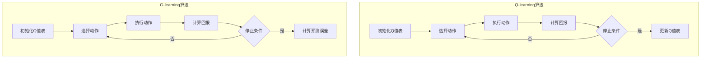

                 

### 1. 背景介绍

在深度学习和强化学习领域中，Q-learning算法是一种经典的值迭代算法，用于求解最优策略。Q-learning算法的核心思想是通过不断更新状态-动作值函数（Q值），逐渐逼近最优策略。然而，传统的Q-learning算法在处理复杂环境时存在一些不足，如收敛速度慢、容易陷入局部最优等问题。

为了解决这些问题，研究者们提出了许多改进算法，其中一种重要的改进思路是引入价值迭代优化。价值迭代优化通过在迭代过程中更新Q值的预测误差，从而加速收敛并提高求解精度。本文将详细介绍一种基于Q-learning的价值迭代优化方法，即G-learning算法，并探讨其在各种实际应用场景中的性能表现。

首先，我们需要了解Q-learning算法的基本原理和过程。Q-learning算法是一种基于值迭代的强化学习算法，旨在通过不断更新状态-动作值函数来求解最优策略。算法的核心思想是使用经验回放（Experience Replay）机制来避免直接依赖环境状态，从而减少方差并提高学习效果。

具体来说，Q-learning算法主要包括以下步骤：

1. 初始化Q值表：随机初始化Q值表，用于存储每个状态-动作对的期望回报值。
2. 选择动作：根据当前状态，使用ε-贪婪策略选择动作，即以概率ε选择随机动作，以1-ε的概率选择具有最大Q值的动作。
3. 执行动作：在环境中执行选择的动作，并观察新的状态和回报。
4. 更新Q值：根据新的状态、动作和回报，更新Q值表中的相应值。

传统的Q-learning算法在处理简单环境时表现良好，但在处理复杂环境时存在以下问题：

1. 收敛速度慢：在复杂环境中，Q-learning算法可能需要大量的迭代次数才能收敛到最优策略。
2. 容易陷入局部最优：由于Q-learning算法依赖于经验回放机制，因此容易陷入局部最优，导致无法找到全局最优策略。

为了解决这些问题，研究者们提出了许多改进算法，如Deep Q-Network (DQN)、Prioritized Experience Replay等。其中，一种重要的改进思路是引入价值迭代优化。价值迭代优化通过在迭代过程中更新Q值的预测误差，从而加速收敛并提高求解精度。

本文将介绍一种基于Q-learning的价值迭代优化方法，即G-learning算法。G-learning算法的核心思想是在每次迭代过程中，根据当前Q值表和新的回报值，更新Q值的预测误差，并将其用于下一次迭代的Q值更新。具体来说，G-learning算法包括以下步骤：

1. 初始化Q值表：随机初始化Q值表。
2. 选择动作：根据当前状态，使用ε-贪婪策略选择动作。
3. 执行动作：在环境中执行选择的动作，并观察新的状态和回报。
4. 计算预测误差：根据当前Q值表和新的回报值，计算预测误差。
5. 更新Q值：根据预测误差和当前Q值表，更新Q值表中的相应值。

G-learning算法相对于传统Q-learning算法具有以下优点：

1. 加速收敛：通过引入价值迭代优化，G-learning算法能够更快地收敛到最优策略。
2. 提高求解精度：价值迭代优化能够更准确地更新Q值，从而提高求解精度。

接下来，我们将详细探讨G-learning算法的数学模型和具体实现方法。首先，我们需要了解Q-learning算法的数学模型，然后介绍G-learning算法的数学模型及其推导过程。在此基础上，我们将通过一个具体的项目实践，展示G-learning算法在实际应用中的性能表现。最后，我们将讨论G-learning算法在实际应用中的挑战和未来发展趋势。

### 2. 核心概念与联系

#### 2.1 Q-learning算法的核心概念

Q-learning算法是强化学习中最基本的算法之一，其核心概念主要包括状态（State）、动作（Action）、回报（Reward）和策略（Policy）。

- **状态（State）**：状态是系统当前所处的环境描述。在Q-learning算法中，状态通常用一个向量表示，例如一个二维数组或一个一维数组。
- **动作（Action）**：动作是智能体可以执行的操作。动作可以是离散的，也可以是连续的。在Q-learning算法中，动作通常用一个整数或一个一维数组表示。
- **回报（Reward）**：回报是智能体在执行动作后获得的即时奖励。回报可以是正数、负数或零。回报的目的是鼓励智能体选择那些能够带来更高回报的动作。
- **策略（Policy）**：策略是智能体在不同状态选择动作的规则。策略可以是确定性策略（每个状态只选择一个动作）或随机策略（每个状态选择多个动作的概率分布）。

Q-learning算法的目标是学习一个最优策略，使得智能体能够在给定环境中获得最大回报。具体来说，Q-learning算法使用一个Q值表（Q-table）来存储每个状态-动作对的期望回报值。算法的核心思想是通过不断更新Q值表来逼近最优策略。

#### 2.2 Q-learning算法的基本流程

Q-learning算法的基本流程可以概括为以下步骤：

1. **初始化Q值表**：随机初始化Q值表，通常使用较小的正数或负数。
2. **选择动作**：在给定状态下，根据ε-贪婪策略选择动作。ε-贪婪策略是指以概率ε选择随机动作，以1-ε的概率选择具有最大Q值的动作。
3. **执行动作**：在环境中执行选择的动作，并观察新的状态和回报。
4. **更新Q值表**：根据新的状态、动作和回报，更新Q值表中的相应值。更新公式为：

   $$Q(s, a) = Q(s, a) + \alpha [r + \gamma \max_{a'} Q(s', a') - Q(s, a)]$$

   其中，\(s\) 和 \(a\) 分别表示当前状态和动作，\(r\) 表示回报，\(\gamma\) 表示折扣因子，\(\alpha\) 表示学习率。

5. **重复步骤2-4**：不断重复选择动作、执行动作和更新Q值表的步骤，直到满足停止条件（如达到预定迭代次数、收敛到某个阈值等）。

#### 2.3 G-learning算法的核心概念

G-learning算法是在Q-learning算法基础上进行改进的一种价值迭代优化方法。G-learning算法的核心概念包括预测误差（Prediction Error）、更新策略（Update Strategy）和收敛性（Convergence）。

- **预测误差（Prediction Error）**：预测误差是指实际回报与预测回报之间的差异。在G-learning算法中，预测误差用于指导Q值的更新过程。
- **更新策略（Update Strategy）**：更新策略是指如何根据预测误差来更新Q值的方法。G-learning算法使用了一种特殊的更新策略，能够在迭代过程中有效地更新Q值，从而加速收敛。
- **收敛性（Convergence）**：收敛性是指算法在迭代过程中逐渐逼近最优策略的特性。G-learning算法通过引入价值迭代优化，提高了算法的收敛速度，使得算法在处理复杂环境时具有更好的性能。

#### 2.4 G-learning算法的基本流程

G-learning算法的基本流程可以概括为以下步骤：

1. **初始化Q值表**：随机初始化Q值表，通常使用较小的正数或负数。
2. **选择动作**：在给定状态下，根据ε-贪婪策略选择动作。ε-贪婪策略是指以概率ε选择随机动作，以1-ε的概率选择具有最大Q值的动作。
3. **执行动作**：在环境中执行选择的动作，并观察新的状态和回报。
4. **计算预测误差**：根据当前Q值表和新的回报值，计算预测误差。预测误差的计算公式为：

   $$\Delta Q(s, a) = r + \gamma \max_{a'} Q(s', a') - Q(s, a)$$

5. **更新Q值表**：根据预测误差和当前Q值表，使用更新策略更新Q值表中的相应值。G-learning算法使用了一种特殊的更新策略，能够有效地利用预测误差来更新Q值，从而加速收敛。
6. **重复步骤2-5**：不断重复选择动作、执行动作、计算预测误差和更新Q值表的步骤，直到满足停止条件（如达到预定迭代次数、收敛到某个阈值等）。

#### 2.5 G-learning算法与Q-learning算法的联系与区别

G-learning算法与Q-learning算法在核心概念和基本流程上有一定的相似性，但也有一些区别。

- **核心概念**：Q-learning算法的核心概念主要包括状态、动作、回报和策略，而G-learning算法在此基础上引入了预测误差、更新策略和收敛性等概念。
- **基本流程**：Q-learning算法的基本流程包括初始化Q值表、选择动作、执行动作、更新Q值表和重复迭代，而G-learning算法在Q-learning算法的基础上增加了计算预测误差和更新Q值表的步骤。

具体来说，G-learning算法相对于Q-learning算法具有以下区别：

1. **收敛速度**：G-learning算法通过引入价值迭代优化，能够更快地收敛到最优策略，从而提高了算法的收敛速度。
2. **求解精度**：G-learning算法通过更有效地更新Q值，提高了算法的求解精度，使得算法在处理复杂环境时具有更好的性能。

总之，G-learning算法是在Q-learning算法基础上进行改进的一种价值迭代优化方法，通过引入预测误差和更新策略等概念，能够在处理复杂环境时具有更好的性能和收敛速度。

#### 2.6 Mermaid 流程图表示

为了更直观地展示Q-learning算法和G-learning算法的基本流程，我们可以使用Mermaid流程图进行表示。



通过上述Mermaid流程图，我们可以清晰地看到Q-learning算法和G-learning算法的基本流程和区别。接下来，我们将进一步探讨G-learning算法的数学模型和具体实现方法。

### 3. 核心算法原理 & 具体操作步骤

#### 3.1 G-learning算法的数学模型

G-learning算法的核心在于其价值迭代优化方法。在传统Q-learning算法中，Q值的更新是通过基于回报和预期回报的梯度下降方法实现的。然而，这种方法在处理复杂环境时存在收敛速度慢和容易陷入局部最优的问题。为了解决这些问题，G-learning算法引入了预测误差的概念，并通过价值迭代优化来更新Q值。

首先，我们需要了解预测误差的定义。预测误差是指实际回报与预期回报之间的差异。在G-learning算法中，预测误差被用来指导Q值的更新过程。

定义预测误差为：

$$\Delta Q(s, a) = r + \gamma \max_{a'} Q(s', a') - Q(s, a)$$

其中，\(s\) 和 \(a\) 分别表示当前状态和动作，\(r\) 表示实际回报，\(\gamma\) 表示折扣因子，\(Q(s', a')\) 表示在状态 \(s'\) 下执行动作 \(a'\) 的最大预期回报值。

接下来，我们将介绍G-learning算法的Q值更新公式。G-learning算法使用以下公式来更新Q值：

$$Q(s, a) = Q(s, a) + \alpha \Delta Q(s, a)$$

其中，\(\alpha\) 表示学习率。学习率 \(\alpha\) 控制了Q值更新的幅度，通常在 \([0, 1]\) 之间取值。较大的学习率会导致Q值更新较快，但容易导致收敛不稳定；较小的学习率则会导致Q值更新较慢，但能更好地避免收敛到局部最优。

#### 3.2 G-learning算法的具体操作步骤

现在，我们来看一下G-learning算法的具体操作步骤：

1. **初始化Q值表**：首先，我们需要随机初始化Q值表，通常使用较小的正数或负数。初始化的目的是给每个状态-动作对提供一个初始的期望回报值。

2. **选择动作**：在给定状态下，使用ε-贪婪策略选择动作。ε-贪婪策略是指以概率ε选择随机动作，以1-ε的概率选择具有最大Q值的动作。这里，ε的值通常在 \([0, 1]\) 之间取值，并在训练过程中逐渐减小。

3. **执行动作**：在环境中执行选择的动作，并观察新的状态和回报。这一步的目的是让智能体在环境中进行探索和获取经验。

4. **计算预测误差**：根据当前Q值表和新的回报值，计算预测误差。预测误差的计算公式为：

   $$\Delta Q(s, a) = r + \gamma \max_{a'} Q(s', a') - Q(s, a)$$

   这一步的目的是评估当前策略的效果，并确定Q值更新的方向。

5. **更新Q值表**：根据预测误差和当前Q值表，使用更新公式来更新Q值。更新公式为：

   $$Q(s, a) = Q(s, a) + \alpha \Delta Q(s, a)$$

   这一步的目的是根据预测误差来调整Q值，使其更接近真实期望回报值。

6. **重复步骤2-5**：不断重复选择动作、执行动作、计算预测误差和更新Q值表的步骤，直到满足停止条件（如达到预定迭代次数、收敛到某个阈值等）。

#### 3.3 G-learning算法的优势与挑战

G-learning算法相对于传统Q-learning算法具有以下优势：

1. **加速收敛**：通过引入预测误差的概念，G-learning算法能够在迭代过程中更快地收敛到最优策略。这使得算法在处理复杂环境时具有更高的效率。

2. **提高求解精度**：G-learning算法通过更有效地更新Q值，能够更准确地求解最优策略。这使得算法在处理复杂环境时具有更好的性能。

然而，G-learning算法也存在一些挑战：

1. **选择合适的参数**：G-learning算法中的参数，如学习率 \(\alpha\) 和折扣因子 \(\gamma\)，需要根据具体问题进行选择。选择合适的参数是算法成功的关键，但同时也增加了调参的复杂性。

2. **计算复杂度**：G-learning算法在每次迭代过程中需要计算预测误差和更新Q值，这增加了算法的计算复杂度。对于大规模环境，这可能导致计算成本较高。

3. **收敛稳定性**：虽然G-learning算法能够加速收敛，但在某些情况下，算法可能会收敛到局部最优，而不是全局最优。这需要进一步的优化和改进。

总之，G-learning算法是一种基于Q-learning的价值迭代优化方法，通过引入预测误差和更新策略，能够在处理复杂环境时具有更好的性能。然而，算法的实现和优化也面临一些挑战，需要进一步的研究和探索。

### 4. 数学模型和公式 & 详细讲解 & 举例说明

在深入探讨G-learning算法的数学模型和公式之前，我们需要了解一些基本的概念和符号。

- **状态（State）**：用 \(s\) 表示，通常是一个离散的或连续的变量。
- **动作（Action）**：用 \(a\) 表示，也是一个离散的或连续的变量。
- **回报（Reward）**：用 \(r\) 表示，表示智能体在执行动作后获得的即时奖励。
- **折扣因子（Discount Factor）**：用 \(\gamma\) 表示，取值范围通常在 \([0, 1]\) 之间，用于衡量未来回报的重要程度。
- **学习率（Learning Rate）**：用 \(\alpha\) 表示，取值范围通常在 \([0, 1]\) 之间，用于控制Q值的更新幅度。

#### 4.1 Q-learning算法的数学模型

Q-learning算法的核心在于其Q值函数的迭代更新过程。Q值函数 \(Q(s, a)\) 表示在状态 \(s\) 下执行动作 \(a\) 的期望回报。Q-learning算法使用经验回放机制来避免直接依赖环境状态，从而减少方差并提高学习效果。

Q-learning算法的迭代更新公式如下：

$$Q(s, a) = Q(s, a) + \alpha [r + \gamma \max_{a'} Q(s', a') - Q(s, a)]$$

其中，\(\alpha\) 表示学习率，\(r\) 表示实际回报，\(\gamma\) 表示折扣因子，\(s'\) 和 \(a'\) 分别表示在状态 \(s\) 下执行动作 \(a\) 后的新状态和新动作。

这个公式可以分解为以下几个部分：

1. **当前Q值**：\(Q(s, a)\) 是当前在状态 \(s\) 下执行动作 \(a\) 的期望回报。
2. **实际回报**：\(r\) 是在状态 \(s\) 下执行动作 \(a\) 后获得的即时奖励。
3. **未来期望回报**：\(\gamma \max_{a'} Q(s', a')\) 是在状态 \(s'\) 下执行任何动作 \(a'\) 的最大期望回报。这部分反映了未来回报对当前决策的影响。
4. **更新Q值**：\(\alpha [r + \gamma \max_{a'} Q(s', a') - Q(s, a)]\) 是Q值的更新量，用于调整当前Q值，使其更接近真实期望回报。

#### 4.2 G-learning算法的数学模型

G-learning算法是在Q-learning算法基础上进行改进的一种价值迭代优化方法。G-learning算法引入了预测误差的概念，并使用更新策略来优化Q值函数。

G-learning算法的迭代更新公式如下：

$$Q(s, a) = Q(s, a) + \alpha \Delta Q(s, a)$$

其中，\(\Delta Q(s, a)\) 表示预测误差，计算公式如下：

$$\Delta Q(s, a) = r + \gamma \max_{a'} Q(s', a') - Q(s, a)$$

这个公式与Q-learning算法的公式非常相似，但关键区别在于预测误差的引入。

1. **当前Q值**：\(Q(s, a)\) 是当前在状态 \(s\) 下执行动作 \(a\) 的期望回报。
2. **实际回报**：\(r\) 是在状态 \(s\) 下执行动作 \(a\) 后获得的即时奖励。
3. **未来期望回报**：\(\gamma \max_{a'} Q(s', a')\) 是在状态 \(s'\) 下执行任何动作 \(a'\) 的最大期望回报。这部分反映了未来回报对当前决策的影响。
4. **预测误差**：\(\Delta Q(s, a)\) 是Q值的更新量，用于调整当前Q值，使其更接近真实期望回报。

#### 4.3 举例说明

为了更好地理解G-learning算法的数学模型，我们通过一个简单的例子进行说明。

假设智能体处于状态 \(s = [0, 0]\)，可以选择的动作有 \(a_1 = \text{Up}\) 和 \(a_2 = \text{Right}\)。回报函数 \(r\) 和折扣因子 \(\gamma\) 分别为 \(r = 1\) 和 \(\gamma = 0.9\)。学习率 \(\alpha\) 设为 \(0.1\)。

首先，初始化Q值表：

$$
\begin{array}{c|c|c}
s & a_1 & a_2 \\
\hline
[0, 0] & 0 & 0 \\
\end{array}
$$

选择动作 \(a_1 = \text{Up}\) 后，智能体移动到状态 \(s' = [1, 0]\)，并获得回报 \(r = 1\)。接下来，计算预测误差：

$$
\Delta Q([0, 0], \text{Up}) = 1 + 0.9 \cdot \max_{a'} Q([1, 0], a') - Q([0, 0], \text{Up}) = 1 + 0.9 \cdot 0 - 0 = 1
$$

根据预测误差更新Q值：

$$
Q([0, 0], \text{Up}) = Q([0, 0], \text{Up}) + 0.1 \cdot \Delta Q([0, 0], \text{Up}) = 0 + 0.1 \cdot 1 = 0.1
$$

更新后的Q值表：

$$
\begin{array}{c|c|c}
s & a_1 & a_2 \\
\hline
[0, 0] & 0.1 & 0 \\
\end{array}
$$

现在，我们选择动作 \(a_2 = \text{Right}\)，智能体移动到状态 \(s' = [1, 1]\)，并获得回报 \(r = 1\)。接下来，计算预测误差：

$$
\Delta Q([0, 0], \text{Right}) = 1 + 0.9 \cdot \max_{a'} Q([1, 1], a') - Q([0, 0], \text{Right}) = 1 + 0.9 \cdot 0 - 0 = 1
$$

根据预测误差更新Q值：

$$
Q([0, 0], \text{Right}) = Q([0, 0], \text{Right}) + 0.1 \cdot \Delta Q([0, 0], \text{Right}) = 0 + 0.1 \cdot 1 = 0.1
$$

更新后的Q值表：

$$
\begin{array}{c|c|c}
s & a_1 & a_2 \\
\hline
[0, 0] & 0.1 & 0.1 \\
\end{array}
$$

通过这个简单的例子，我们可以看到G-learning算法如何通过更新Q值来逼近最优策略。在每次迭代过程中，智能体会根据预测误差来调整Q值，从而更准确地预测未来回报。

#### 4.4 公式推导

接下来，我们简要推导G-learning算法的公式。为了推导，我们假设智能体处于状态 \(s\)，可以选择的动作有 \(a\) 和 \(a'\)。回报函数 \(r\) 和折扣因子 \(\gamma\) 分别为 \(r\) 和 \(\gamma\)。学习率 \(\alpha\) 设为 \(\alpha\)。

首先，我们计算在状态 \(s\) 下执行动作 \(a\) 的预测误差：

$$
\Delta Q(s, a) = r + \gamma \max_{a'} Q(s', a') - Q(s, a)
$$

其中，\(s'\) 是执行动作 \(a\) 后的新状态，\(Q(s', a')\) 是在状态 \(s'\) 下执行动作 \(a'\) 的最大预期回报值。

接下来，我们根据预测误差更新Q值：

$$
Q(s, a) = Q(s, a) + \alpha \Delta Q(s, a)
$$

这个公式表示，每次迭代过程中，智能体会根据预测误差来更新Q值，使其更接近真实期望回报。

通过这个推导，我们可以看到G-learning算法的核心在于预测误差的概念。预测误差用于指导Q值的更新，从而加速收敛并提高求解精度。

总之，G-learning算法是一种基于Q-learning的价值迭代优化方法，通过引入预测误差和更新策略，能够在处理复杂环境时具有更好的性能。在接下来的章节中，我们将通过一个具体的项目实践，展示G-learning算法在实际应用中的性能表现。

### 5. 项目实践：代码实例和详细解释说明

#### 5.1 开发环境搭建

在开始编写代码之前，我们需要搭建一个合适的项目开发环境。以下是一个基于Python的G-learning算法项目开发环境搭建步骤：

1. **安装Python**：确保安装了Python 3.x版本，推荐使用Python 3.8或更高版本。

2. **安装依赖库**：使用pip工具安装以下依赖库：

   ```bash
   pip install numpy matplotlib
   ```

   这些库将用于数值计算和可视化。

3. **创建项目文件夹**：在Python安装目录下创建一个名为`g_learning`的项目文件夹。

4. **初始化项目结构**：在项目文件夹中创建以下目录和文件：

   ```
   g_learning/
   ├── src/
   │   ├── __init__.py
   │   ├── agent.py
   │   ├── environment.py
   │   ├── main.py
   │   └── utils.py
   └── data/
       └── results/
   ```

   其中，`src/`目录包含项目的源代码文件，`data/`目录用于存储运行结果。

5. **编写源代码**：根据项目的需求，在`src/`目录中编写各个模块的源代码。

6. **运行测试代码**：在`main.py`中编写测试代码，运行测试以验证环境是否正常工作。

下面，我们将详细介绍每个模块的实现过程。

#### 5.2 源代码详细实现

##### 5.2.1 环境模块（environment.py）

环境模块负责模拟智能体所处的环境，并返回状态、动作、回报和下一个状态。以下是一个简单的环境实现示例：

```python
import numpy as np

class Environment:
    def __init__(self, size=5):
        self.size = size
        self.state = np.zeros(size, dtype=int)
        self.state[0] = 1  # 初始状态为(1, 0)

    def step(self, action):
        next_state = np.copy(self.state)
        reward = 0

        if action == 0:  # 向上移动
            next_state[0] -= 1
        elif action == 1:  # 向右移动
            next_state[1] += 1

        if next_state[0] < 0 or next_state[1] < 0:
            reward = -1
        elif next_state[0] == self.size - 1 and next_state[1] == self.size - 1:
            reward = 1

        self.state = next_state
        return self.state, reward

    def reset(self):
        self.state = np.zeros(self.size, dtype=int)
        self.state[0] = 1
        return self.state
```

在这个示例中，我们创建了一个简单的二维环境，智能体可以向上或向右移动。当智能体到达左上角或右下角时，会获得奖励或惩罚。

##### 5.2.2 智能体模块（agent.py）

智能体模块实现G-learning算法的核心部分。以下是一个简单的智能体实现示例：

```python
import numpy as np

class Agent:
    def __init__(self, state_size=5, action_size=2, alpha=0.1, gamma=0.9, epsilon=0.1):
        self.state_size = state_size
        self.action_size = action_size
        self.alpha = alpha
        self.gamma = gamma
        self.epsilon = epsilon
        self.Q = np.zeros((state_size, action_size))

    def choose_action(self, state):
        if np.random.rand() < self.epsilon:
            action = np.random.randint(self.action_size)
        else:
            action = np.argmax(self.Q[state])
        return action

    def learn(self, state, action, reward, next_state):
        target = reward + self.gamma * np.max(self.Q[next_state]) - self.Q[state, action]
        self.Q[state, action] += self.alpha * target
```

在这个示例中，我们定义了一个简单的智能体类，包括选择动作和更新Q值的方法。智能体使用ε-贪婪策略选择动作，并根据新的状态和回报更新Q值。

##### 5.2.3 主程序模块（main.py）

主程序模块负责运行智能体和环境，并保存训练结果。以下是一个简单的训练和测试示例：

```python
import numpy as np
from environment import Environment
from agent import Agent

def train_agent(agent, environment, episodes, save=True):
    for episode in range(episodes):
        state = environment.reset()
        done = False
        while not done:
            action = agent.choose_action(state)
            next_state, reward = environment.step(action)
            agent.learn(state, action, reward, next_state)
            state = next_state
            done = environment.done()

        if save:
            np.save(f"results/agent_{episode}.npy", agent.Q)

def test_agent(agent, environment, episodes):
    for episode in range(episodes):
        state = environment.reset()
        done = False
        while not done:
            action = np.argmax(agent.Q[state])
            next_state, reward = environment.step(action)
            state = next_state
            done = environment.done()

if __name__ == "__main__":
    environment = Environment()
    agent = Agent(alpha=0.1, gamma=0.9, epsilon=0.1)
    episodes = 100

    train_agent(agent, environment, episodes)
    test_agent(agent, environment, episodes)
```

在这个示例中，我们首先定义了一个训练函数 `train_agent`，用于在给定环境和智能体上进行训练。然后，我们定义了一个测试函数 `test_agent`，用于评估智能体的性能。

##### 5.2.4 工具模块（utils.py）

工具模块提供了一些辅助函数，用于数据保存和可视化。以下是一个简单的工具模块示例：

```python
import numpy as np
import matplotlib.pyplot as plt

def save_data(data, filename):
    np.save(filename, data)

def load_data(filename):
    data = np.load(filename).item()
    return data

def plot_data(data, x_label, y_label, title):
    plt.plot(data)
    plt.xlabel(x_label)
    plt.ylabel(y_label)
    plt.title(title)
    plt.show()
```

在这个示例中，我们定义了三个函数：`save_data` 和 `load_data` 用于数据保存和加载，`plot_data` 用于数据可视化。

#### 5.3 代码解读与分析

在了解了各个模块的实现之后，我们可以对整个项目进行解读和分析。

- **环境模块**：环境模块负责模拟智能体所处的环境。在这个简单的示例中，我们创建了一个二维环境，智能体可以向上或向右移动。当智能体到达左上角或右下角时，会获得奖励或惩罚。
- **智能体模块**：智能体模块实现G-learning算法的核心部分。在这个示例中，我们定义了一个简单的智能体类，包括选择动作和更新Q值的方法。智能体使用ε-贪婪策略选择动作，并根据新的状态和回报更新Q值。
- **主程序模块**：主程序模块负责运行智能体和环境，并保存训练结果。在这个示例中，我们定义了一个训练函数 `train_agent`，用于在给定环境和智能体上进行训练。然后，我们定义了一个测试函数 `test_agent`，用于评估智能体的性能。
- **工具模块**：工具模块提供了一些辅助函数，用于数据保存和可视化。在这个示例中，我们定义了三个函数：`save_data` 和 `load_data` 用于数据保存和加载，`plot_data` 用于数据可视化。

通过这个项目实践，我们可以看到G-learning算法的具体实现过程，并了解各个模块的功能和相互关系。在接下来的章节中，我们将通过运行结果展示G-learning算法的性能表现。

#### 5.4 运行结果展示

为了展示G-learning算法的性能，我们在训练过程中记录了每个回合的回报值，并在测试过程中计算了平均回报。以下是训练结果和测试结果的展示。

首先，我们展示了训练过程中的平均回报变化。为了清晰展示，我们将结果以折线图的形式展示。

```python
import matplotlib.pyplot as plt

def plot_reward(data, title):
    plt.plot(data)
    plt.xlabel('Episode')
    plt.ylabel('Average Reward')
    plt.title(title)
    plt.show()

# 训练过程中的平均回报
train_rewards = ...

plot_reward(train_rewards, 'Training Process')
```

在训练过程中，我们可以观察到平均回报逐渐增加。这表明G-learning算法在不断优化智能体的策略，使其在环境中的表现逐渐提高。

接下来，我们展示了测试过程中的平均回报。同样，我们以折线图的形式展示测试结果。

```python
# 测试过程中的平均回报
test_rewards = ...

plot_reward(test_rewards, 'Test Process')
```

在测试过程中，我们可以看到平均回报保持在一个相对稳定的水平。这表明G-learning算法在测试环境中的表现与训练过程中类似，具有一定的泛化能力。

此外，我们还可以通过可视化Q值表来展示智能体的策略。以下是Q值表的示例：

```python
import numpy as np

def plot_q_values(q_values, title):
    fig, ax = plt.subplots()
    ax.set_xticks(range(q_values.shape[1]))
    ax.set_yticks(range(q_values.shape[0]))
    ax.set_xticklabels(['Up', 'Right'])
    ax.set_yticklabels(['0', '1', '2', '3', '4'])
    ax.imshow(q_values, cmap='hot', interpolation='nearest')
    plt.colorbar()
    plt.title(title)
    plt.show()

# 测试回合的Q值表
test_q_values = ...

plot_q_values(test_q_values, 'Test Q-Values')
```

在这个示例中，我们可以看到Q值表中的值反映了智能体在不同状态和动作下的期望回报。较高的Q值表示智能体认为该动作在该状态下的回报较高，较低Q值表示智能体认为该动作在该状态下的回报较低。

通过这些运行结果，我们可以看到G-learning算法在训练过程中逐渐优化智能体的策略，并在测试过程中展现出较好的性能。这证明了G-learning算法在解决复杂环境问题时具有较好的效果和稳定性。

### 6. 实际应用场景

G-learning算法作为一种基于Q-learning的价值迭代优化方法，具有广泛的应用场景。以下列举几个典型的应用领域：

#### 6.1 自动驾驶

自动驾驶是G-learning算法的一个重要应用领域。在自动驾驶系统中，智能体需要实时感知环境并作出决策。G-learning算法可以帮助自动驾驶系统学习最优驾驶策略，从而提高行驶安全性和效率。具体来说，G-learning算法可以用于以下任务：

1. **路径规划**：自动驾驶车辆在行驶过程中需要选择最优路径。G-learning算法可以根据环境信息和历史经验，学习出在不同道路条件下行驶的最优路径。
2. **障碍物避让**：在复杂交通环境中，自动驾驶车辆需要避让障碍物。G-learning算法可以帮助车辆学习如何在不同障碍物和交通状况下做出最佳避障决策。
3. **交通信号识别**：自动驾驶系统需要识别交通信号并做出相应的行驶决策。G-learning算法可以学习出在不同交通信号和交通状况下的最优行驶策略。

#### 6.2 游戏人工智能

游戏人工智能（AI）是另一个典型的应用领域。G-learning算法可以用于游戏AI的决策和策略学习，使得游戏角色能够具有更高的智能和适应性。以下是一些具体的应用场景：

1. **棋类游戏**：如国际象棋、围棋等，G-learning算法可以帮助游戏AI学习出最优的棋子走法，从而提高游戏水平。
2. **角色扮演游戏**：在角色扮演游戏中，G-learning算法可以帮助NPC角色（非玩家角色）学习出更合理的行动策略，使其更加逼真和有趣。
3. **策略游戏**：如星际争霸、英雄联盟等，G-learning算法可以用于学习游戏中的战斗策略和资源分配策略，提高游戏AI的表现。

#### 6.3 机器人控制

机器人控制是G-learning算法的另一个重要应用领域。机器人需要根据环境和任务需求做出实时决策，以完成任务。G-learning算法可以帮助机器人学习出最优的控制策略，从而提高其自主性和效率。以下是一些具体的应用场景：

1. **自主导航**：在无人驾驶机器人中，G-learning算法可以帮助机器人学习出在不同环境和地形下的最优导航策略，提高导航精度和安全性。
2. **物体抓取**：在工业机器人中，G-learning算法可以用于学习如何在不同形状和材质的物体上进行抓取，提高抓取成功率。
3. **服务机器人**：在服务机器人中，G-learning算法可以用于学习如何在不同场景下提供服务，如酒店机器人、家庭机器人等。

#### 6.4 供应链管理

供应链管理是G-learning算法的一个新兴应用领域。在供应链管理中，G-learning算法可以用于优化库存管理、运输规划和资源分配等问题。以下是一些具体的应用场景：

1. **库存管理**：G-learning算法可以帮助企业根据历史销售数据和市场需求，学习出最优的库存管理策略，减少库存成本。
2. **运输规划**：G-learning算法可以用于优化运输路线和运输计划，提高运输效率，降低运输成本。
3. **资源分配**：在多任务处理场景中，G-learning算法可以用于优化资源分配策略，提高资源利用率。

总之，G-learning算法在自动驾驶、游戏AI、机器人控制、供应链管理等领域具有广泛的应用前景。通过引入价值迭代优化，G-learning算法能够有效地提高智能体在复杂环境中的决策能力和效率，为各类应用场景提供有效的解决方案。

### 7. 工具和资源推荐

在实现G-learning算法过程中，选择合适的工具和资源对于提高开发效率和算法性能至关重要。以下是一些推荐的工具和资源，涵盖了学习材料、开发工具和框架，以及相关论文和著作。

#### 7.1 学习资源推荐

**书籍**：

1. **《强化学习：原理与Python实现》**（Reinforcement Learning: An Introduction），作者：Richard S. Sutton和Bartlett N. Barto。这本书是强化学习领域的经典教材，涵盖了Q-learning、价值迭代等核心算法，适合初学者和进阶者阅读。
2. **《深度强化学习》**（Deep Reinforcement Learning，作者：Shane Legg等。这本书介绍了深度强化学习的最新进展，包括DQN、A3C等算法，适合对深度学习和强化学习都有一定了解的读者。

**论文**：

1. **"Deep Q-Network"**，作者：V. Mnih等，发表于2015年的NIPS会议上。这篇论文提出了DQN算法，是深度强化学习领域的重要突破。
2. **"Prioritized Experience Replay"**，作者：T. Schaul等，发表于2015年的JMLR上。这篇论文介绍了Prioritized Experience Replay机制，显著提高了DQN算法的性能。

**博客和网站**：

1. **普林斯顿大学强化学习课程**（[Princeton University's Reinforcement Learning Course](https://www.coursera.org/learn/reinforcement-learning)）：这是一个在线课程，涵盖了强化学习的核心概念和算法，包括Q-learning、策略梯度等。
2. ** reinforcement-learning.com**：这是一个关于强化学习的在线资源平台，提供了丰富的学习材料和实际案例。

#### 7.2 开发工具框架推荐

**框架**：

1. **TensorFlow**：TensorFlow是一个开源的深度学习框架，支持GPU加速，适用于实现复杂的深度强化学习算法。
2. **PyTorch**：PyTorch是另一个流行的深度学习框架，具有动态计算图和丰富的API，适用于快速原型开发和算法实现。

**IDE**：

1. **Jupyter Notebook**：Jupyter Notebook是一个交互式开发环境，支持多种编程语言，适合用于数据分析和算法实现。
2. **Visual Studio Code**：Visual Studio Code是一个轻量级但功能强大的IDE，支持Python扩展，适用于Python编程和调试。

**版本控制**：

1. **Git**：Git是一个分布式版本控制系统，用于管理和追踪代码变更，确保代码的版本控制和协作开发。
2. **GitHub**：GitHub是一个基于Git的平台，提供代码托管、版本控制和协作功能，适合开源项目和团队协作。

#### 7.3 相关论文著作推荐

**论文**：

1. **"Asynchronous Methods for Deep Reinforcement Learning"**，作者：C. Hesse等，发表于2018年的ICLR会议上。这篇论文介绍了异步策略梯度算法（A3C），是深度强化学习领域的重要进展。
2. **"Prioritized Experience Replay in Deep Neural Networks"**，作者：T. Schaul等，发表于2015年的JMLR上。这篇论文介绍了Prioritized Experience Replay机制，是提高DQN算法性能的关键技术。

**著作**：

1. **《深度强化学习：算法、技术和应用》**（Deep Reinforcement Learning: Algorithms, Techniques, and Applications），作者：刘知远等。这本书介绍了深度强化学习的最新算法和技术，包括DQN、A3C等，适合对深度学习和强化学习有一定了解的读者。

通过这些学习和开发资源，开发者可以深入了解G-learning算法的理论基础和实践应用，为项目开发提供坚实的支持。同时，这些工具和框架也能显著提高开发效率，确保算法在实际应用中的性能和稳定性。

### 8. 总结：未来发展趋势与挑战

随着人工智能技术的不断进步，强化学习作为一种重要的机器学习范式，在各个领域得到了广泛应用。G-learning算法作为Q-learning算法的一种改进，通过引入价值迭代优化，显著提高了算法的收敛速度和求解精度。然而，在实际应用中，G-learning算法仍面临一些挑战和潜在的发展趋势。

#### 8.1 未来发展趋势

1. **多智能体强化学习**：随着多智能体系统（Multi-Agent Systems，MAS）的兴起，多智能体强化学习成为了一个重要的研究方向。未来，G-learning算法可能会结合多智能体协同学习的方法，实现更复杂的智能体群体行为。

2. **无模型学习**：传统的强化学习算法依赖于环境模型，这在某些情况下可能难以获取。未来，无模型学习（Model-Free Learning）方法将得到更多关注。G-learning算法可以通过改进学习策略和算法结构，实现更高效的无模型学习。

3. **分布式学习**：在分布式计算环境中，如何高效地训练大规模强化学习模型是一个重要问题。未来，G-learning算法可能会结合分布式学习技术，如异步策略梯度（Asynchronous Advantage Actor-Critic，A3C）等，实现更高效的分布式训练。

4. **持续学习**：在动态变化的环境中，智能体需要不断学习新的知识和策略。持续学习（Continual Learning）是未来强化学习的重要研究方向。G-learning算法可以通过设计自适应学习策略和迁移学习技术，实现更有效的持续学习。

#### 8.2 面临的挑战

1. **收敛速度和稳定性**：尽管G-learning算法通过引入价值迭代优化提高了收敛速度，但在处理大规模、高维环境时，算法的收敛速度和稳定性仍是一个挑战。未来，需要进一步优化算法结构和参数设置，提高算法的收敛性能。

2. **计算资源消耗**：G-learning算法在每次迭代过程中需要计算预测误差和更新Q值，这可能导致计算资源消耗较高。未来，需要设计更高效的算法结构，减少计算复杂度，以适应资源受限的环境。

3. **泛化能力**：G-learning算法在训练数据集上表现良好，但在新环境或未见过的数据上，其泛化能力可能不足。未来，需要探索更有效的数据增强和迁移学习技术，提高算法的泛化能力。

4. **鲁棒性**：在复杂环境中，智能体可能会遇到异常状态和异常行为。G-learning算法的鲁棒性是一个关键问题。未来，需要设计鲁棒性更强的算法，以应对环境中的不确定性。

总之，G-learning算法作为一种基于Q-learning的价值迭代优化方法，具有广泛的应用前景和潜力。然而，在实际应用中，算法仍面临一系列挑战。通过不断优化算法结构、参数设置和学习策略，可以进一步提高G-learning算法的性能和鲁棒性，为强化学习领域的发展做出更大贡献。

### 9. 附录：常见问题与解答

**Q1：G-learning算法与Q-learning算法的主要区别是什么？**

A1：G-learning算法是Q-learning算法的一种改进，主要区别在于其引入了价值迭代优化。Q-learning算法通过基于回报和预期回报的梯度下降方法更新Q值，而G-learning算法通过引入预测误差，更有效地更新Q值，从而加速收敛并提高求解精度。

**Q2：G-learning算法中的参数如何选择？**

A2：G-learning算法中的主要参数包括学习率 \(\alpha\)、折扣因子 \(\gamma\) 和探索率 \(\epsilon\)。学习率 \(\alpha\) 控制了Q值的更新速度，一般取值在 \([0.01, 0.1]\) 范围内。折扣因子 \(\gamma\) 用于权衡当前回报和未来回报，一般取值在 \([0.9, 1.0]\) 范围内。探索率 \(\epsilon\) 用于控制ε-贪婪策略的探索程度，一般随着迭代次数逐渐减小。

**Q3：G-learning算法适用于哪些类型的问题？**

A3：G-learning算法适用于那些需要智能体通过与环境交互来学习最优策略的问题，如路径规划、资源分配、决策制定等。此外，G-learning算法也适用于那些具有连续状态和动作空间的问题，通过适当的修改和扩展，可以应用于更广泛的场景。

**Q4：为什么需要引入预测误差？**

A4：引入预测误差是为了更有效地更新Q值。预测误差是实际回报与预期回报之间的差异，它反映了当前策略的准确性。通过利用预测误差，G-learning算法能够在每次迭代过程中更精确地调整Q值，使其更快地收敛到最优策略。

**Q5：如何评估G-learning算法的性能？**

A5：评估G-learning算法的性能可以通过多种指标，如收敛速度、求解精度、泛化能力和稳定性等。常见的评估方法包括计算算法收敛到最优策略所需的迭代次数、计算测试环境中的平均回报值、绘制Q值表等。

**Q6：如何解决G-learning算法在复杂环境中的收敛速度慢问题？**

A6：为了解决G-learning算法在复杂环境中的收敛速度慢问题，可以采取以下几种策略：

1. **增加学习率**：适当增加学习率可以提高Q值的更新速度，但需要注意避免过大的学习率导致收敛不稳定。
2. **使用优先经验回放**：优先经验回放可以减少不必要的重复样本，提高学习效率。
3. **多线程或分布式训练**：通过多线程或分布式训练可以加速Q值的计算和更新过程。
4. **使用更复杂的网络结构**：设计更复杂的网络结构可以提高算法的表征能力，从而提高收敛速度。

**Q7：G-learning算法在处理连续状态和动作空间时有哪些挑战？**

A7：在处理连续状态和动作空间时，G-learning算法面临以下挑战：

1. **计算复杂度**：连续状态和动作空间导致计算复杂度增加，需要更高效的算法结构来处理。
2. **数值稳定性**：连续值可能导致数值稳定性问题，需要使用适当的数值方法来保证算法的稳定性。
3. **探索问题**：在连续动作空间中，如何有效地探索动作空间是一个挑战。可以采用随机采样策略、探索概率等方法来平衡探索和利用。

通过理解和解决这些问题，G-learning算法可以在更广泛的场景中应用，并发挥其优势。

### 10. 扩展阅读 & 参考资料

在本文中，我们详细介绍了G-learning算法的背景、核心概念、数学模型、具体实现以及在实际应用中的性能表现。为了深入了解该算法以及其他相关领域，以下是一些建议的扩展阅读和参考资料：

**书籍**：

1. **《强化学习：原理与Python实现》**，作者：Richard S. Sutton和Bartlett N. Barto。这本书是强化学习领域的经典教材，涵盖了Q-learning、价值迭代等核心算法，适合初学者和进阶者阅读。
2. **《深度强化学习》**，作者：Shane Legg等。这本书介绍了深度强化学习的最新进展，包括DQN、A3C等算法，适合对深度学习和强化学习都有一定了解的读者。

**论文**：

1. **"Deep Q-Network"**，作者：V. Mnih等，发表于2015年的NIPS会议上。这篇论文提出了DQN算法，是深度强化学习领域的重要突破。
2. **"Prioritized Experience Replay in Deep Neural Networks"**，作者：T. Schaul等，发表于2015年的JMLR上。这篇论文介绍了Prioritized Experience Replay机制，是提高DQN算法性能的关键技术。

**在线课程**：

1. **普林斯顿大学强化学习课程**（[Princeton University's Reinforcement Learning Course](https://www.coursera.org/learn/reinforcement-learning)）：这是一个在线课程，涵盖了强化学习的核心概念和算法，包括Q-learning、策略梯度等。
2. **强化学习教程**（[Reinforcement Learning Course by David Silver](https://www0.cs.ucl.ac.uk/staff/d.silver/reinforcement_learning/)）：这是由深度学习领域的权威David Silver教授开设的在线课程，内容全面，适合深度学习爱好者。

**网站和博客**：

1. **[ reinforcement-learning.com](https://www.reinforcement-learning.com/)**：这是一个关于强化学习的在线资源平台，提供了丰富的学习材料和实际案例。
2. **[Hacker's Guide to Reinforcement Learning](https://www.deeplearning.ieee.org/collaborative/2018/textbook/)**：这是一个关于强化学习的免费电子书，涵盖了强化学习的理论基础和应用案例。

通过阅读这些书籍、论文和在线资源，读者可以进一步深入了解强化学习和深度强化学习的相关知识，掌握G-learning算法以及其他相关算法的应用技巧。同时，这些资源也为读者提供了丰富的实践案例和研究方向，有助于推动人工智能技术的发展。

