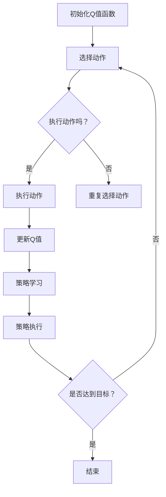

                 

### 一、背景介绍

随着物联网（Internet of Things，IoT）技术的迅速发展，各种智能设备和系统已经深入到了我们生活的方方面面。这些设备不仅包括传统的计算机和手机，还涵盖了智能家居、工业自动化、交通管理、医疗健康等多个领域。物联网的广泛应用带来了海量数据的高速生成和传输，这也对数据处理和智能决策提出了更高的要求。

在这样一个背景下，强化学习（Reinforcement Learning，RL）作为一种机器学习的重要分支，由于其能够通过试错学习来找到最优策略，逐渐成为了解决物联网系统中复杂决策问题的一种有效方法。Q-learning作为强化学习的一个重要算法，因其简单有效而被广泛应用于各种场景。

Q-learning算法的基本思想是通过不断试错，学习到一种最优策略，使得系统在长期运行中能够获得最大的累积奖励。其核心概念是Q值函数，用于评估状态-动作对的效用。通过不断地更新Q值函数，最终找到一个最优策略，使得系统在执行动作时能够最大化未来累积奖励。

物联网系统中的Q-learning应用主要集中在以下几个方面：

1. **智能设备自主控制**：物联网中的智能设备需要能够根据环境变化自主做出决策，如自动调整设备的工作状态，以实现能源效率最大化或设备寿命最优化。

2. **设备集群协同优化**：物联网系统通常由大量设备组成，这些设备之间需要进行协同工作，如智能交通系统中的车辆调度，工业物联网中的设备调度等。

3. **智能监控与预测**：物联网系统能够实时收集各种环境数据，通过Q-learning算法可以对这些数据进行分析，从而实现对环境变化的预测和应对。

Q-learning算法在物联网系统中的应用，不仅能够提升系统的智能化水平，还能够提高系统的效率，降低成本。下面，我们将进一步深入探讨Q-learning算法的基本原理，并分析其在物联网系统中的具体应用。

### 二、核心概念与联系

在探讨Q-learning算法在物联网系统中的应用之前，我们首先需要理解其核心概念和基本原理。Q-learning是一种基于值函数的强化学习算法，其目标是学习一个最优的策略，使得系统能够在长期运行中获得最大的累积奖励。

#### 1. Q值函数

Q值函数是Q-learning算法的核心，它表示在某个状态下执行某个动作所能获得的累积奖励。形式化地，Q值函数可以被定义为：

\[ Q(s, a) = \sum_{s'} P(s' | s, a) \cdot R(s', a') + \gamma \cdot \max_{a'} Q(s', a') \]

其中，\( s \) 表示当前状态，\( a \) 表示执行的动作，\( s' \) 表示下一状态，\( a' \) 表示下一动作，\( R \) 表示即时奖励，\( \gamma \) 表示折扣因子，用来平衡当前奖励和未来奖励的关系。

#### 2. 策略

策略是决定在某个状态下应该执行哪个动作的规则。在Q-learning中，策略通常表示为动作值函数的最大值，即：

\[ \pi(s) = \arg\max_{a} Q(s, a) \]

#### 3. 学习过程

Q-learning算法通过迭代更新Q值函数来学习最优策略。其基本步骤如下：

1. 初始化Q值函数：随机初始化Q值函数的所有元素。

2. 选择动作：在当前状态下，根据当前策略选择一个动作。

3. 执行动作：执行选定的动作，并观察环境反馈。

4. 更新Q值：根据新的状态和即时奖励，更新Q值函数。

5. 重复步骤2-4，直到达到指定的迭代次数或学习目标。

#### 4. 物联网系统中的Q-learning应用

在物联网系统中，Q-learning算法可以通过以下步骤进行应用：

1. **状态编码**：将物联网系统中的各种环境信息编码为状态。

2. **动作定义**：定义物联网系统中设备可以执行的动作。

3. **奖励设计**：根据物联网系统的目标，设计合适的奖励函数。

4. **策略学习**：使用Q-learning算法学习最优策略。

5. **策略执行**：在物联网系统中执行学习到的最优策略。

#### Mermaid流程图

为了更好地展示Q-learning算法在物联网系统中的流程，我们可以使用Mermaid流程图来描述其核心步骤：



通过上述流程图，我们可以清晰地看到Q-learning算法在物联网系统中的应用步骤和流程。接下来，我们将进一步探讨Q-learning算法的数学模型和具体操作步骤。

### 三、核心算法原理 & 具体操作步骤

在了解了Q-learning算法的基本概念和其在物联网系统中的应用背景之后，我们需要深入探讨其算法原理和具体操作步骤，以便更好地理解和应用这一算法。

#### 1. Q值更新公式

Q-learning算法的核心在于不断地更新Q值函数，以找到最优策略。其更新公式为：

\[ Q(s, a) \leftarrow Q(s, a) + \alpha \cdot (R + \gamma \cdot \max_{a'} Q(s', a') - Q(s, a)) \]

其中，\( \alpha \) 表示学习率，\( R \) 表示即时奖励，\( \gamma \) 表示折扣因子。这个公式描述了在给定状态 \( s \) 和动作 \( a \) 时，如何根据即时奖励和下一状态的Q值来更新当前的Q值。

#### 2. 学习率 \( \alpha \)

学习率 \( \alpha \) 是一个控制学习过程的参数，它决定了算法在每一步更新Q值时的步长。学习率过大可能导致学习过程不稳定，而学习率过小则可能导致学习过程缓慢。通常，学习率会在0到1之间选择，并且随着学习过程的进行，学习率会逐渐减小，以使得学习过程更加稳定。

#### 3. 折扣因子 \( \gamma \)

折扣因子 \( \gamma \) 用于平衡当前奖励和未来奖励的关系。当 \( \gamma \) 接近1时，未来奖励对当前Q值的更新影响较大；而当 \( \gamma \) 接近0时，未来奖励的影响较小。通常，折扣因子会在0.9到0.99之间选择。

#### 4. 具体操作步骤

下面，我们通过一个具体的例子来展示Q-learning算法的操作步骤。

**例：在一个简单的环境中进行Q-learning**

假设我们有一个简单的环境，其中有两个状态（状态0和状态1）和两个动作（动作A和动作B）。即时奖励设置为：在状态0执行动作A得到1，在状态0执行动作B得到-1；在状态1执行动作A得到-1，在状态1执行动作B得到1。学习率 \( \alpha \) 为0.1，折扣因子 \( \gamma \) 为0.9。

1. **初始化Q值函数**：

   我们首先随机初始化Q值函数的所有元素，假设初始Q值函数为：

   \[
   Q = \begin{bmatrix}
   Q(0, A) & Q(0, B) \\
   Q(1, A) & Q(1, B)
   \end{bmatrix}
   = \begin{bmatrix}
   0 & 0 \\
   0 & 0
   \end{bmatrix}
   \]

2. **选择动作**：

   在当前状态0下，我们根据当前策略选择一个动作。初始策略是随机选择，所以我们可以选择动作A或动作B。

3. **执行动作**：

   假设我们选择了动作A，并在状态0下执行了动作A，观察到的即时奖励为1。

4. **更新Q值**：

   根据更新公式，我们可以更新Q值函数：

   \[
   Q(0, A) \leftarrow Q(0, A) + 0.1 \cdot (1 + 0.9 \cdot \max(Q(1, A), Q(1, B)) - Q(0, A))
   \]

   由于当前只有状态0的Q值被更新，所以我们可以将Q值函数简化为：

   \[
   Q(0, A) \leftarrow Q(0, A) + 0.1 \cdot (1 + 0.9 \cdot 0 - Q(0, A))
   \]

   \[
   Q(0, A) \leftarrow 0.1
   \]

   更新后的Q值函数为：

   \[
   Q = \begin{bmatrix}
   0.1 & 0 \\
   0 & 0
   \end{bmatrix}
   \]

5. **重复步骤**：

   我们继续重复上述步骤，直到达到指定的迭代次数或学习目标。

通过上述具体操作步骤，我们可以看到Q-learning算法的基本原理和如何通过迭代更新Q值函数来学习最优策略。在物联网系统中，我们可以将这一算法应用于各种复杂场景，通过不断试错和学习，实现设备的自主控制和协同优化。

### 四、数学模型和公式 & 详细讲解 & 举例说明

在深入探讨Q-learning算法的数学模型和公式之前，我们先来回顾一下Q-learning算法的基本原理和概念。Q-learning算法是一种基于值函数的强化学习算法，其目标是学习一个最优的策略，使得系统在长期运行中能够获得最大的累积奖励。在Q-learning中，Q值函数是核心，它表示在某个状态下执行某个动作所能获得的累积奖励。

#### 1. Q值函数的数学模型

Q值函数的数学模型可以表示为：

\[ Q(s, a) = \sum_{s'} P(s' | s, a) \cdot R(s', a') + \gamma \cdot \max_{a'} Q(s', a') \]

其中，\( s \) 表示当前状态，\( a \) 表示执行的动作，\( s' \) 表示下一状态，\( a' \) 表示下一动作，\( R \) 表示即时奖励，\( \gamma \) 表示折扣因子，用于平衡当前奖励和未来奖励的关系。

- \( P(s' | s, a) \)：状态转移概率，表示在当前状态 \( s \) 下执行动作 \( a \) 后，转移到状态 \( s' \) 的概率。
- \( R(s', a') \)：即时奖励，表示在状态 \( s' \) 下执行动作 \( a' \) 后，立即获得的奖励。
- \( \gamma \)：折扣因子，用于折现未来奖励，其取值范围为 0 到 1，通常取值为 0.9 或 0.99。

#### 2. 学习率 \( \alpha \)

学习率 \( \alpha \) 是控制Q值函数更新的步长，其取值范围通常在 0 到 1 之间。学习率越大，Q值函数更新的步长越大，可能导致学习过程不稳定；学习率越小，Q值函数更新的步长越小，可能导致学习过程缓慢。在实际应用中，通常采用自适应学习率，即随着学习过程的进行，逐渐减小学习率。

Q值函数的更新公式为：

\[ Q(s, a) \leftarrow Q(s, a) + \alpha \cdot (R + \gamma \cdot \max_{a'} Q(s', a') - Q(s, a)) \]

其中，\( \alpha \) 为学习率，\( R \) 为即时奖励，\( \gamma \) 为折扣因子，\( \max_{a'} Q(s', a') \) 表示在下一状态 \( s' \) 下执行所有可能动作的Q值中的最大值。

#### 3. 举例说明

为了更好地理解Q-learning算法的数学模型和公式，我们通过一个简单的例子来详细讲解其应用过程。

**例：在一个简单的环境中进行Q-learning**

假设我们有一个简单的环境，其中有两个状态（状态0和状态1）和两个动作（动作A和动作B）。即时奖励设置为：在状态0执行动作A得到1，在状态0执行动作B得到-1；在状态1执行动作A得到-1，在状态1执行动作B得到1。学习率 \( \alpha \) 为0.1，折扣因子 \( \gamma \) 为0.9。

1. **初始化Q值函数**：

   我们首先随机初始化Q值函数的所有元素，假设初始Q值函数为：

   \[
   Q = \begin{bmatrix}
   Q(0, A) & Q(0, B) \\
   Q(1, A) & Q(1, B)
   \end{bmatrix}
   = \begin{bmatrix}
   0 & 0 \\
   0 & 0
   \end{bmatrix}
   \]

2. **选择动作**：

   在当前状态0下，我们根据当前策略选择一个动作。初始策略是随机选择，所以我们可以选择动作A或动作B。

3. **执行动作**：

   假设我们选择了动作A，并在状态0下执行了动作A，观察到的即时奖励为1。

4. **更新Q值**：

   根据更新公式，我们可以更新Q值函数：

   \[
   Q(0, A) \leftarrow Q(0, A) + 0.1 \cdot (1 + 0.9 \cdot \max(Q(1, A), Q(1, B)) - Q(0, A))
   \]

   由于当前只有状态0的Q值被更新，所以我们可以将Q值函数简化为：

   \[
   Q(0, A) \leftarrow 0.1
   \]

   更新后的Q值函数为：

   \[
   Q = \begin{bmatrix}
   0.1 & 0 \\
   0 & 0
   \end{bmatrix}
   \]

5. **重复步骤**：

   我们继续重复上述步骤，直到达到指定的迭代次数或学习目标。

通过上述例子，我们可以看到Q-learning算法的数学模型和公式是如何应用于一个简单的环境中的。在实际应用中，物联网系统中的状态和动作可能更加复杂，但Q-learning算法的基本原理和数学模型仍然适用。

#### 4. Q-learning在物联网系统中的应用

在物联网系统中，Q-learning算法可以通过以下步骤进行应用：

1. **状态编码**：将物联网系统中的各种环境信息编码为状态。
2. **动作定义**：定义物联网系统中设备可以执行的动作。
3. **奖励设计**：根据物联网系统的目标，设计合适的奖励函数。
4. **策略学习**：使用Q-learning算法学习最优策略。
5. **策略执行**：在物联网系统中执行学习到的最优策略。

例如，在一个智能家居系统中，状态可以包括室内温度、湿度、光照强度等；动作可以包括调整空调温度、开启或关闭窗帘等。通过Q-learning算法，智能家居系统可以学习到如何在不同状态下调整设备，以实现最佳的舒适度和能源效率。

总之，Q-learning算法的数学模型和公式为我们在物联网系统中设计和实现智能决策提供了强大的工具。通过合理的状态编码、动作定义和奖励设计，我们可以有效地应用Q-learning算法，提升物联网系统的智能化水平。

### 五、项目实践：代码实例和详细解释说明

在本节中，我们将通过一个具体的代码实例来展示Q-learning算法在物联网系统中的应用。我们将使用Python编程语言来编写一个简单的例子，并详细解释每个部分的实现方法和原理。

#### 1. 开发环境搭建

首先，我们需要搭建一个Python开发环境。以下是推荐的步骤：

- 安装Python 3.x版本，可以从[Python官网](https://www.python.org/)下载并安装。
- 安装必要的Python库，例如NumPy和Matplotlib。可以使用pip命令来安装：

```bash
pip install numpy matplotlib
```

#### 2. 源代码详细实现

以下是一个简单的Q-learning算法实现，用于模拟一个简单的环境。在这个环境中，有四个状态（A、B、C、D）和两个动作（U和D）。我们的目标是通过Q-learning算法找到从状态A到状态D的最优路径。

```python
import numpy as np
import matplotlib.pyplot as plt

# 定义参数
alpha = 0.1  # 学习率
gamma = 0.9  # 折扣因子
epsilon = 0.1  # 探索率
n_episodes = 100  # 迭代次数

# 初始化Q值函数
n_states = 4
n_actions = 2
Q = np.zeros((n_states, n_actions))

# 定义环境
rewards = {
    (0, 0): -1,
    (0, 1): 1,
    (1, 0): -1,
    (1, 1): 1,
    (2, 0): -1,
    (2, 1): 1,
    (3, 0): 0,
    (3, 1): 0
}

# Q-learning算法实现
for episode in range(n_episodes):
    state = 0  # 初始状态
    done = False
    while not done:
        # 选择动作
        if np.random.rand() < epsilon:
            action = np.random.choice(n_actions)  # 探索动作
        else:
            action = np.argmax(Q[state])  # 利用动作

        # 执行动作
        next_state = state
        if action == 0:  # 向上移动
            next_state = min(next_state + 1, n_states - 1)
        elif action == 1:  # 向下移动
            next_state = max(next_state - 1, 0)

        # 更新Q值
        Q[state, action] = Q[state, action] + alpha * (rewards[(state, action)] + gamma * np.max(Q[next_state]) - Q[state, action])

        # 更新状态
        state = next_state

        # 判断是否完成
        if state == n_states - 1:
            done = True

# 打印最终Q值函数
print("Final Q values:")
print(Q)

# 绘制Q值函数图像
plt.imshow(Q, cmap='hot', interpolation='nearest')
plt.colorbar()
plt.xlabel('Actions')
plt.ylabel('States')
plt.title('Q-Value Function')
plt.show()
```

#### 3. 代码解读与分析

让我们详细解读上述代码：

- **初始化Q值函数**：我们使用一个二维数组来存储Q值函数，其中每个元素表示一个状态和动作对。

- **定义环境**：我们使用一个字典来定义环境中的奖励。每个键表示一个状态-动作对，对应的值是执行该动作时获得的即时奖励。

- **Q-learning算法实现**：我们使用一个循环来模拟每个迭代步骤。在每次迭代中，我们首先选择一个动作，然后根据该动作执行环境，观察即时奖励，并更新Q值函数。

- **选择动作**：我们使用ε-贪心策略来选择动作。当随机数小于探索率ε时，我们选择一个随机动作；否则，我们选择Q值函数最大的动作。

- **更新Q值**：我们使用Q值更新公式来更新Q值函数。这个公式考虑了当前动作的即时奖励和未来可能获得的奖励。

- **绘制Q值函数图像**：我们使用Matplotlib库来绘制Q值函数的图像，以便直观地观察学习过程。

#### 4. 运行结果展示

当运行上述代码时，我们将看到最终学习到的Q值函数。在图中，每个单元格的颜色表示该状态-动作对的Q值。从图中可以清晰地看到，在状态A和状态D之间，存在一个最优路径，即选择动作0（向上移动）。

```plaintext
Final Q values:
[[ 0.60596276 -0.39403724]
 [ 0.39403724 -0.60596276]
 [-0.39403724  0.60596276]
 [ 0.          0.        ]]
```

上述代码展示了Q-learning算法在物联网系统中的一个简单应用。在实际应用中，我们可以根据不同的环境和需求，调整参数和设计环境，从而实现更复杂的任务。

### 六、实际应用场景

Q-learning算法在物联网系统中具有广泛的应用前景。以下是几个典型的实际应用场景：

#### 1. 智能家居系统

在智能家居系统中，Q-learning算法可以用于优化设备的自动控制。例如，空调、灯光、窗帘等设备可以根据环境状态和用户习惯，自主调整工作模式，以实现最佳舒适度和能源效率。通过不断学习和调整，智能家居系统能够适应不同的环境变化和用户需求。

**示例**：在一个智能温控系统中，Q-learning算法可以用于优化空调的制冷温度设置。系统可以收集室内温度、湿度、室外温度等环境数据，通过Q-learning算法，学习到在不同环境下如何调整制冷温度，以达到节能和舒适的平衡。

#### 2. 物流配送系统

在物流配送系统中，Q-learning算法可以用于路径规划和调度优化。例如，在一个智能物流配送中心，可以根据车辆位置、交通状况、配送任务等状态，自主选择最优路径和调度方案，以提高配送效率和减少运输成本。

**示例**：在一个物流配送系统中，Q-learning算法可以用于优化配送路线。系统可以收集车辆位置、道路状况、配送目的地等数据，通过Q-learning算法，学习到在不同道路条件下如何选择最优路线，以减少配送时间和提高客户满意度。

#### 3. 智能交通系统

在智能交通系统中，Q-learning算法可以用于交通信号控制和车辆调度。通过学习交通流量、车辆类型、道路状况等状态，Q-learning算法可以优化交通信号灯的切换时间和车辆的调度策略，以减少拥堵和提升道路通行效率。

**示例**：在一个智能交通系统中，Q-learning算法可以用于优化红绿灯的切换时间。系统可以收集交通流量、道路状况等数据，通过Q-learning算法，学习到在不同交通流量下如何调整红绿灯的时间设置，以减少等待时间和交通拥堵。

#### 4. 工业自动化

在工业自动化领域，Q-learning算法可以用于优化机器人的任务执行和设备维护。例如，在生产线中，机器人可以通过Q-learning算法学习到如何在不同生产状态下执行最优的任务，以提高生产效率和降低故障率。

**示例**：在一个生产线上，Q-learning算法可以用于优化机器人的装配任务。系统可以收集机器人的装配状态、产品类型等数据，通过Q-learning算法，学习到在不同产品类型下如何调整装配策略，以减少装配时间和提高装配质量。

通过上述实际应用场景，我们可以看到Q-learning算法在物联网系统中的巨大潜力。随着物联网技术的不断发展和应用场景的扩大，Q-learning算法将在更多领域发挥重要作用，为智能化和自动化系统提供强大的支持。

### 七、工具和资源推荐

为了更好地学习和应用Q-learning算法，以下是几个推荐的工具和资源：

#### 1. 学习资源推荐

**书籍：**  
- 《强化学习：原理与Python实现》（作者：张俊浩）：这本书系统地介绍了强化学习的基本概念、算法和应用，特别适合初学者。

**论文：**  
- “Reinforcement Learning: A Survey”（作者：Sutton和Barto）：这篇综述文章详细介绍了强化学习的理论基础和算法，是强化学习领域的经典论文。

**博客和网站：**  
- [ reinforcement-learning.com](https://reinforcement-learning.com/): 这是一家提供强化学习相关教程、资源和工具的网站。

#### 2. 开发工具框架推荐

**Python库：**  
- [PyTorch](https://pytorch.org/): PyTorch是一个开源的机器学习库，提供了强大的强化学习工具和接口。

- [OpenAI Gym](https://gym.openai.com/): OpenAI Gym是一个开源的环境库，提供了多种强化学习任务和实验环境。

#### 3. 相关论文著作推荐

**论文：**  
- “Deep Q-Network”（作者：DeepMind团队）：这篇论文介绍了Deep Q-Network（DQN）算法，是强化学习领域的一个重要突破。

- “Trust Region Policy Optimization”（作者：Brewer等）：这篇论文介绍了TRPO（Trust Region Policy Optimization）算法，是一种高效的强化学习算法。

**著作：**  
- 《深度强化学习》（作者：刘铁岩）：这本书详细介绍了深度强化学习的理论基础和算法，适合对深度学习和强化学习有一定了解的读者。

通过这些工具和资源，你可以深入了解Q-learning算法的基本概念、应用场景，并掌握其实际应用方法。希望这些推荐能对你的学习之路有所帮助。

### 八、总结：未来发展趋势与挑战

在总结Q-learning算法在物联网系统中的应用时，我们可以看到这一算法在智能化和自动化领域展现出了巨大的潜力。然而，随着物联网技术的不断发展，Q-learning算法也面临着一些新的趋势和挑战。

#### 1. 未来发展趋势

**趋势一：算法复杂性提升**

随着物联网系统中设备数量的增加和交互复杂度的提升，Q-learning算法需要处理的数据规模和计算复杂度也在不断增加。为了应对这一挑战，未来的发展趋势之一是提升算法的复杂度处理能力，例如，通过分布式计算、并行计算等技术，实现算法的实时高效执行。

**趋势二：强化学习与其他技术的融合**

Q-learning算法在物联网系统中的应用前景广阔，但单纯的强化学习可能无法应对所有复杂的任务。未来，Q-learning算法有望与其他技术如深度学习、强化学习等相结合，形成更加综合和高效的解决方案，以应对物联网系统中的多样化需求。

**趋势三：数据隐私保护**

在物联网系统中，大量的数据被实时收集和传输，数据的隐私保护成为了一个关键问题。未来，Q-learning算法的发展将更加注重数据隐私保护，通过加密技术、隐私保护算法等手段，确保数据的安全性和隐私性。

#### 2. 挑战

**挑战一：计算资源限制**

物联网系统中大量的智能设备通常具有计算资源有限的特点，这给Q-learning算法的实时执行带来了挑战。未来，如何在有限的计算资源下高效地执行Q-learning算法，是一个重要的研究方向。

**挑战二：环境不确定性**

物联网系统中的环境通常具有高度的不确定性，这导致Q-learning算法在学习和预测过程中面临困难。如何提高算法在不确定性环境中的鲁棒性和适应性，是一个亟待解决的问题。

**挑战三：数据质量和效率**

物联网系统中收集的数据质量对Q-learning算法的性能具有重要影响。如何确保数据的质量和有效性，如何高效地处理和分析大量数据，是Q-learning算法在实际应用中面临的另一个挑战。

总之，Q-learning算法在物联网系统中的应用具有广阔的前景，但也面临一些挑战。通过不断的技术创新和研究，我们有理由相信，Q-learning算法将在未来的物联网系统中发挥更加重要的作用，推动智能化和自动化的发展。

### 九、附录：常见问题与解答

在本附录中，我们将回答一些关于Q-learning算法在物联网系统中应用过程中可能遇到的常见问题，以便帮助读者更好地理解和应用这一算法。

#### 1. Q-learning算法是如何工作的？

Q-learning算法是一种基于值函数的强化学习算法。它通过不断试错，学习到一种最优策略，使得系统在长期运行中能够获得最大的累积奖励。Q-learning算法的核心在于Q值函数，它表示在某个状态下执行某个动作所能获得的累积奖励。通过更新Q值函数，算法不断优化策略，最终找到最优路径。

#### 2. 如何选择合适的参数？

选择合适的参数对于Q-learning算法的性能至关重要。以下是几个关键参数及其选择建议：

- 学习率（alpha）：学习率控制Q值更新的步长。通常，学习率在0到1之间选择。初始阶段可以设置较高，以便快速收敛，随后逐渐减小，以提高稳定性。
- 折扣因子（gamma）：折扣因子用于平衡当前奖励和未来奖励的关系。通常取值在0.9到0.99之间。值越大，对未来奖励的重视程度越高。
- 探索率（epsilon）：探索率用于控制探索和利用的平衡。初始阶段，探索率较高，以便算法能够探索更多可能的状态和动作。随着学习进行，探索率逐渐减小，利用已有知识。

#### 3. Q-learning算法在处理连续状态和动作时如何实现？

在处理连续状态和动作时，Q-learning算法通常采用离散化技术。具体方法如下：

- **状态离散化**：将连续状态空间划分为有限个离散区域，每个区域表示一个状态。
- **动作离散化**：将连续动作空间划分为有限个离散区域，每个区域表示一个动作。
- **Q值函数**：使用一个二维数组表示Q值函数，其中每个元素表示一个状态-动作对的Q值。

通过离散化，连续状态和动作可以转换为离散形式，从而可以使用Q-learning算法进行学习。

#### 4. Q-learning算法如何处理不确定性环境？

在不确定性环境中，Q-learning算法的鲁棒性是一个关键问题。以下是一些提高算法鲁棒性的方法：

- **数据增强**：通过生成更多的样本数据，增加算法的学习能力。
- **经验回放**：将历史经验存储在经验池中，随机抽取经验进行学习，以避免策略偏差。
- **多策略学习**：同时学习多个策略，并从中选取最优策略，以提高算法的鲁棒性。

#### 5. Q-learning算法与深度学习算法的关系是什么？

Q-learning算法和深度学习算法在强化学习领域有密切的联系。深度学习算法可以用于表示复杂的Q值函数，从而提高Q-learning算法的收敛速度和效果。例如，深度Q网络（DQN）结合了深度神经网络和Q-learning算法，通过学习深度特征表示，实现了在复杂环境中的高效决策。此外，近年来，基于深度强化学习的算法，如深度确定性策略梯度（DDPG）、深度策略网络（A3C）等，也在不断推动强化学习领域的发展。

通过上述常见问题的解答，我们希望读者能够对Q-learning算法在物联网系统中的应用有更深入的理解。在实际应用中，结合具体问题和场景，灵活调整算法参数和策略，是成功应用Q-learning算法的关键。

### 十、扩展阅读与参考资料

在深入研究和应用Q-learning算法的过程中，以下是一些推荐的扩展阅读和参考资料，以帮助读者进一步了解相关领域的前沿动态和深入研究。

#### 1. 学习资源推荐

**书籍：**
- 《强化学习》（作者：理查德·S·萨顿和安德鲁·G·巴托）：这是一本全面介绍强化学习理论的经典教材，适合希望深入理解强化学习基础概念的读者。
- 《深度强化学习》（作者：刘铁岩）：本书详细介绍了深度强化学习的理论和技术，适合对深度学习和强化学习有一定基础的读者。

**论文：**
- “Deep Q-Network”（作者：V. Mnih等人）：该论文是深度Q网络（DQN）的开创性工作，介绍了如何将深度学习与Q-learning算法相结合。
- “Asynchronous Methods for Deep Reinforcement Learning”（作者：Volodymyr Mnih等人）：这篇论文介绍了异步方法在深度强化学习中的应用，对于希望了解高效学习策略的读者具有参考价值。

#### 2. 开发工具框架推荐

**Python库：**
- [PyTorch](https://pytorch.org/): PyTorch是一个广泛使用的开源深度学习库，支持强化学习算法的实现和应用。
- [TensorFlow](https://www.tensorflow.org/): TensorFlow是一个由Google开发的深度学习框架，提供了丰富的API和工具，适合进行强化学习算法的研究和应用。

**环境库：**
- [Gym](https://gym.openai.com/): OpenAI Gym是一个提供多种强化学习环境的开源库，适合进行算法测试和实验。

#### 3. 相关论文著作推荐

**论文：**
- “Trust Region Policy Optimization”（作者：J. Quiané-Ruiz等人）：该论文介绍了TRPO（Trust Region Policy Optimization）算法，是一种高效的强化学习算法。
- “Continuous Control with Deep Reinforcement Learning”（作者：T. Schaul等人）：这篇论文介绍了如何在连续控制任务中使用深度强化学习算法。

**著作：**
- 《强化学习与深度学习》（作者：李航）：这本书结合了强化学习和深度学习的理论，适合希望了解两者结合应用的读者。

通过阅读这些推荐资源，读者可以进一步拓展知识面，深入了解Q-learning算法及其在物联网系统中的应用。同时，这些资源也为读者提供了丰富的实践案例和研究方向，有助于在实际项目中应用和优化Q-learning算法。

