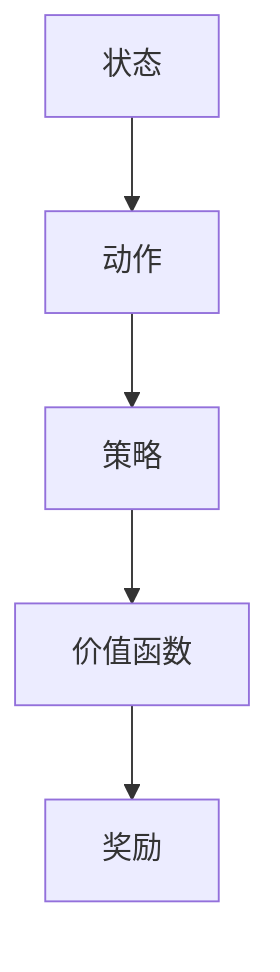

                 

### 一切皆是映射：AI Q-learning核心算法解析

> 关键词：Q-learning, 强化学习，AI算法，映射，智能优化

> 摘要：本文将深入探讨AI中的Q-learning算法，从背景介绍、核心概念解析、原理与步骤讲解、数学模型阐述、项目实践到实际应用，全面解析这一核心算法，并展望其未来发展。

---

#### 1. 背景介绍

强化学习（Reinforcement Learning，简称RL）是机器学习的一个重要分支，旨在通过与环境交互，让智能体（Agent）学会在特定环境中采取最优行动策略，以实现目标。Q-learning算法作为强化学习中的经典算法，以其简洁和高效而被广泛应用。

Q-learning最早由理查德·萨顿（Richard Sutton）和阿尔文·艾利斯（Andrew Barto）在1988年的著作《强化学习：一种计算理论》（“Reinforcement Learning: An Introduction”）中提出。该算法的核心思想是通过“经验 replay”（经验回放）来不断更新价值函数（Q-function），从而逐步优化智能体的策略。

Q-learning算法在众多应用场景中表现出色，如机器人控制、游戏AI、推荐系统等。其基本思想可以概括为：“不断尝试不同的动作，并从中学习，以找到最优策略”。这一过程类似于人类的学习方式，因此Q-learning在理论研究和实际应用中都有着重要的地位。

#### 2. 核心概念与联系

为了更好地理解Q-learning算法，我们需要首先了解以下几个核心概念：

1. **状态（State）**：指智能体所处的环境描述。
2. **动作（Action）**：智能体可以采取的行为。
3. **策略（Policy）**：智能体根据当前状态选择动作的规则。
4. **价值函数（Q-function）**：用于评估智能体在不同状态下采取不同动作的预期回报。
5. **奖励（Reward）**：环境对智能体采取的动作给予的即时反馈。

以下是Q-learning算法的核心概念与联系流程图（使用Mermaid绘制）：



#### 3. 核心算法原理 & 具体操作步骤

Q-learning算法的核心是不断更新价值函数，使其逼近最优策略。具体操作步骤如下：

1. **初始化**：初始化价值函数Q(s, a)，通常使用0或较小值。
2. **选择动作**：根据当前状态s和策略π，选择动作a。
3. **执行动作**：在环境中执行动作a，得到新的状态s'和奖励r。
4. **更新价值函数**：根据以下公式更新Q值：

   $$ Q(s, a) \leftarrow Q(s, a) + \alpha [r + \gamma \max_{a'} Q(s', a') - Q(s, a)] $$

   其中，α为学习率（learning rate），γ为折扣因子（discount factor）。

5. **重复步骤2-4**，直到达到终止条件（如达到一定步数、找到最优策略等）。

以下是一个简单的Q-learning算法实现示例（Python代码）：

```python
import numpy as np

def q_learning(states, actions, learning_rate, discount_factor, episodes):
    Q = np.zeros((states, actions))
    
    for episode in range(episodes):
        state = env.reset()
        done = False
        
        while not done:
            action = np.argmax(Q[state])
            next_state, reward, done, _ = env.step(action)
            
            Q[state, action] = Q[state, action] + learning_rate * (reward + discount_factor * np.max(Q[next_state]) - Q[state, action])
            
            state = next_state
    
    return Q
```

#### 4. 数学模型和公式 & 详细讲解 & 举例说明

在Q-learning算法中，数学模型和公式是理解其核心原理的关键。以下是Q-learning算法的主要数学模型和公式：

1. **价值函数更新公式**：

   $$ Q(s, a) \leftarrow Q(s, a) + \alpha [r + \gamma \max_{a'} Q(s', a') - Q(s, a)] $$

   其中，α为学习率（learning rate），γ为折扣因子（discount factor），r为奖励（reward），s为当前状态（state），a为当前动作（action），s'为下一状态（next state），a'为下一动作（next action）。

2. **策略迭代**：

   $$ \pi(s) = \arg\max_a Q(s, a) $$

   策略迭代的目标是找到使价值函数最大的动作。

下面通过一个简单的例子来说明Q-learning算法的应用：

假设一个智能体在一个简单的网格世界中移动，目标是从左下角移动到右上角。智能体可以采取上、下、左、右四种动作。奖励设置为移动到目标位置时为+10，每一步的奖励为-1。学习率为0.1，折扣因子为0.9。

初始状态为(0, 0)，初始Q值为0。在第一次迭代中，智能体随机选择向右移动。移动到(0, 1)后，得到奖励-1。更新Q值为：

$$ Q(0, 1) = 0 + 0.1 [-1 + 0.9 \times \max Q(1, 1), Q(1, 2), Q(1, 3)] = -0.9 + 0.9 \times 0 = -0.9 $$

接着，智能体再次随机选择向右移动，以此类推。经过多次迭代后，Q值逐渐收敛，最终找到最优策略。

#### 5. 项目实践：代码实例和详细解释说明

在本节中，我们将通过一个简单的Python代码实例来展示Q-learning算法的实现和应用。

**5.1 开发环境搭建**

1. 安装Python 3.6及以上版本。
2. 安装TensorFlow 2.0及以上版本。

```bash
pip install tensorflow
```

**5.2 源代码详细实现**

```python
import numpy as np
import gym

# 创建环境
env = gym.make("CartPole-v0")

# 初始化参数
learning_rate = 0.1
discount_factor = 0.9
episodes = 1000

# 初始化Q值矩阵
q_values = np.zeros((env.observation_space.n, env.action_space.n))

# Q-learning算法实现
for episode in range(episodes):
    state = env.reset()
    done = False
    
    while not done:
        action = np.argmax(q_values[state])
        next_state, reward, done, _ = env.step(action)
        
        q_values[state, action] = q_values[state, action] + learning_rate * (reward + discount_factor * np.max(q_values[next_state]) - q_values[state, action])
        
        state = next_state

# 关闭环境
env.close()
```

**5.3 代码解读与分析**

1. **环境创建**：使用gym库创建CartPole环境。
2. **初始化参数**：设置学习率、折扣因子和迭代次数。
3. **初始化Q值矩阵**：创建一个全零的二维数组，用于存储状态-动作对的价值。
4. **Q-learning迭代**：遍历每个迭代，执行以下步骤：
   - 初始化状态。
   - 根据当前状态选择最优动作。
   - 执行动作，获得下一状态和奖励。
   - 更新Q值。
5. **关闭环境**：完成迭代后，关闭环境。

**5.4 运行结果展示**

在完成代码实现后，我们可以运行环境，观察Q-learning算法在CartPole环境中的表现。通过多次迭代，智能体可以学会在平衡杆上保持较长时间的平衡。

#### 6. 实际应用场景

Q-learning算法在多个实际应用场景中得到了广泛应用，以下列举几个典型场景：

1. **游戏AI**：Q-learning算法被广泛应用于游戏AI的开发，如经典的“Atari游戏”。通过学习环境，游戏AI可以学会如何玩各种游戏，如《俄罗斯方块》、《吃豆人》等。
2. **机器人控制**：在机器人控制领域，Q-learning算法被用于路径规划、导航和动作决策。例如，自动驾驶汽车可以使用Q-learning算法来学习最佳行驶路径。
3. **推荐系统**：在推荐系统中，Q-learning算法可以用于优化用户-项目推荐策略。通过学习用户行为和历史数据，推荐系统可以更准确地预测用户偏好，提高推荐质量。
4. **金融领域**：在金融领域，Q-learning算法被用于期权定价、风险管理等。通过学习市场数据和历史走势，算法可以帮助投资者做出更明智的决策。

#### 7. 工具和资源推荐

为了更好地学习Q-learning算法，以下推荐一些有用的工具和资源：

1. **学习资源推荐**：
   - 《强化学习：一种计算理论》（“Reinforcement Learning: An Introduction”） - Sutton和Barto的著作，是强化学习领域的经典教材。
   - 《强化学习导论》（“Introduction to Reinforcement Learning”） - David Silver的讲座视频，涵盖了强化学习的核心概念和应用。

2. **开发工具框架推荐**：
   - TensorFlow - Google开发的开放源代码机器学习框架，支持强化学习算法的实现。
   - OpenAI Gym - 一个开源的环境库，提供了多种经典的强化学习环境，方便进行算法实验和验证。

3. **相关论文著作推荐**：
   - “Q-Learning” - Richard Sutton和Andrew Barto在1988年的论文，提出了Q-learning算法的基本原理。
   - “Deep Q-Network” - DeepMind在2015年的论文，提出了深度Q网络（DQN）算法，将深度学习引入强化学习领域。

#### 8. 总结：未来发展趋势与挑战

Q-learning算法在强化学习领域已经取得了显著的成果，但仍然面临一些挑战和未来发展趋势：

1. **收敛速度和稳定性**：Q-learning算法的收敛速度较慢，且在复杂环境中容易陷入局部最优。未来的研究可以关注提高收敛速度和增强算法的稳定性。
2. **样本效率**：在有限样本情况下，如何更好地利用数据是Q-learning算法面临的一个关键挑战。通过引入经验回放（Experience Replay）等技术，可以提高算法的样本效率。
3. **模型泛化能力**：Q-learning算法在特定环境下表现良好，但在面对新的、未见过的环境时，其泛化能力有限。未来研究可以关注如何提高算法的泛化能力，使其在更广泛的应用场景中发挥作用。
4. **与深度学习的结合**：深度学习在计算机视觉、自然语言处理等领域取得了突破性进展。将深度学习与Q-learning算法相结合，可以进一步提升智能体的学习能力和表现。

总之，Q-learning算法作为强化学习领域的重要算法，其研究和应用前景仍然非常广阔。通过不断的技术创新和理论突破，Q-learning算法有望在更多领域发挥重要作用，推动人工智能的发展。

#### 9. 附录：常见问题与解答

**Q1. Q-learning算法的收敛性如何保证？**
A1. Q-learning算法的收敛性可以通过以下条件来保证：
   - 学习率α足够小，以避免过度更新Q值。
   - 状态-动作对足够随机，以避免陷入局部最优。
   - 折扣因子γ在[0, 1]之间，以平衡当前奖励和未来奖励。

**Q2. Q-learning算法为什么需要经验回放？**
A2. 经验回放（Experience Replay）的主要目的是提高Q-learning算法的样本效率，避免陷入局部最优。通过将之前的经验数据进行随机回放，可以使得算法更加稳定和鲁棒。

**Q3. Q-learning算法与深度学习的结合有何优势？**
A3. 深度学习与Q-learning算法的结合可以带来以下优势：
   - 提高状态表征能力，使智能体能够更好地理解复杂环境。
   - 缩短学习时间，通过深度神经网络的学习能力，加快算法收敛速度。
   - 提高泛化能力，使智能体能够在新的、未见过的环境中表现良好。

#### 10. 扩展阅读 & 参考资料

为了深入理解Q-learning算法及其应用，以下推荐一些扩展阅读和参考资料：

- Sutton, R. S., & Barto, A. G. (2018). 《强化学习：一种计算理论》.
- Silver, D., Zhang, H., Zaremba, W., & Leurent, A. (2015). “Deep Q-Network”.
- Mnih, V., Kavukcuoglu, K., Silver, D., et al. (2013). “Human-level control through deep reinforcement learning”.
- Littman, M. L. (1999). “Friend-or-Foe Q-learning in General-Sum Games”.
- Wang, Z., & McAuliffe, C. J. (2007). “Exploration vs. exploitation in reinforcement learning without eligibility traces”.
- Bertsekas, D. P., & Tsitsiklis, J. N. (1996). “Neural Network Learning: Theoretical Foundations”.
- Sutton, R. S., & Barto, A. G. (1998). “Monte Carlo Explorations”.
- DeepMind. (2016). “Asynchronous Methods for Deep Reinforcement Learning”.
- OpenAI. (2016). “Reinforcement Learning”.
- Goodfellow, I., Bengio, Y., & Courville, A. (2016). 《深度学习》.

