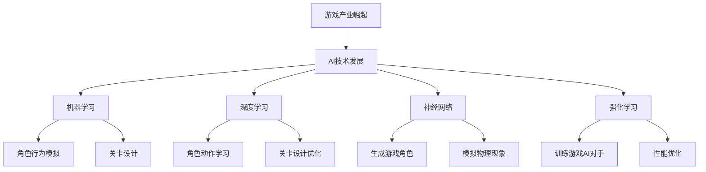

                 

### 1. 背景介绍

**游戏产业的崛起：AI的契机**

随着互联网技术的快速发展，游戏产业在过去几十年里经历了翻天覆地的变化。从简单的单机游戏到如今复杂的多人在线游戏，游戏开发和运营的复杂度显著增加。在这个背景下，人工智能（AI）技术的迅速崛起为游戏开发带来了全新的机遇。AI不仅能够提升游戏体验，还能够优化游戏开发流程，为游戏产业注入新的活力。

AI在游戏开发中的应用主要体现在以下几个方面：

1. **游戏引擎优化**：游戏引擎是游戏开发的核心，AI技术可以帮助优化游戏引擎的性能，使其在处理复杂场景和大量数据时更加高效。
2. **游戏设计智能化**：AI可以帮助游戏设计师自动生成游戏关卡、角色和故事情节，减少人工设计的工作量。
3. **游戏AI对手**：通过AI技术，可以创建出更加智能和复杂的游戏对手，提高游戏的可玩性和挑战性。
4. **游戏性能分析**：AI可以对游戏性能进行实时分析和优化，确保游戏在不同平台和设备上都能流畅运行。

**AI技术的历史与发展**

AI技术的历史可以追溯到20世纪50年代，当时人工智能的概念首次被提出。然而，由于计算能力的限制，AI技术在过去相当长一段时间里都处于相对缓慢的发展状态。随着计算机性能的不断提升和大数据、机器学习等技术的进步，AI在近年来迎来了爆发式的发展。特别是在深度学习和神经网络技术的推动下，AI在图像识别、自然语言处理、决策优化等方面取得了显著的突破。

**游戏开发中的AI应用现状**

目前，AI已经在游戏开发中得到了广泛应用。例如，在游戏引擎优化方面，Unity和Unreal Engine等主流游戏引擎已经内置了大量的AI工具和插件，帮助开发者更好地利用AI技术。在游戏设计方面，许多游戏开发商已经开始使用AI来生成游戏内容，如关卡设计、角色生成和故事情节。此外，AI在游戏AI对手和性能分析方面也取得了显著的成果，许多游戏都采用了AI技术来提升游戏体验。

**本文结构**

本文将按照以下结构展开：

1. **背景介绍**：介绍游戏产业和AI技术的发展背景。
2. **核心概念与联系**：阐述AI在游戏开发中的核心概念和联系。
3. **核心算法原理与具体操作步骤**：详细讲解AI在游戏开发中的应用算法和操作步骤。
4. **数学模型和公式**：介绍与AI相关的数学模型和公式，并进行详细讲解。
5. **项目实践**：通过一个具体的项目实例，展示AI在游戏开发中的应用。
6. **实际应用场景**：分析AI在不同游戏类型中的应用场景。
7. **工具和资源推荐**：推荐学习资源和开发工具。
8. **总结**：总结AI在游戏开发中的应用现状和未来发展趋势。
9. **附录**：回答常见问题。
10. **扩展阅读**：提供进一步学习的资料。

通过本文的详细探讨，希望能够为读者提供一个全面了解AI在游戏开发中应用的视角，并激发读者在相关领域的进一步研究和实践。让我们开始吧！<|im_sep|>### 2. 核心概念与联系

**AI在游戏开发中的核心概念**

在探讨AI在游戏开发中的应用时，首先需要理解几个核心概念：机器学习、深度学习、神经网络和强化学习。这些概念不仅构成了AI技术的基石，也在游戏开发中扮演着至关重要的角色。

**机器学习（Machine Learning）**

机器学习是一种使计算机系统能够从数据中学习和改进的方法。它通过构建模型来识别数据中的模式和关系，然后利用这些模型进行预测或分类。在游戏开发中，机器学习可以用于角色行为预测、游戏AI对手的能力提升等。

**深度学习（Deep Learning）**

深度学习是机器学习的一种子领域，它利用神经网络结构（尤其是深度神经网络）来处理大规模数据。深度学习在图像识别、语音识别和自然语言处理等方面取得了巨大成功。在游戏开发中，深度学习可以用于角色动作学习、关卡设计优化等。

**神经网络（Neural Networks）**

神经网络是一种模仿生物神经系统的计算模型。它由大量的节点（或称为“神经元”）组成，这些节点通过连接（或称为“权重”）相互通信。神经网络通过不断调整这些权重来学习数据中的模式和关系。在游戏开发中，神经网络可以用于生成游戏角色、模拟复杂物理现象等。

**强化学习（Reinforcement Learning）**

强化学习是一种通过试错来学习最优策略的机器学习方法。它通常涉及一个智能体（agent）在一个环境（environment）中采取行动，并通过奖励或惩罚来评估行动的效果。在游戏开发中，强化学习可以用于训练游戏AI对手，使其能够做出更加智能和适应性的决策。

**AI与游戏开发的联系**

AI与游戏开发之间的联系主要体现在以下几个方面：

1. **角色行为模拟**：通过机器学习和神经网络，可以生成具有复杂行为和智能的角色，提高游戏的真实感和可玩性。
2. **关卡设计**：AI可以自动生成游戏关卡，减少人工设计的工作量，提高效率。
3. **游戏AI对手**：强化学习可以帮助训练出更加智能和适应性的游戏AI对手，提升游戏的挑战性。
4. **性能优化**：AI可以对游戏性能进行实时分析和优化，确保游戏在不同平台和设备上都能流畅运行。

**Mermaid 流程图**

以下是AI在游戏开发中的核心概念和联系的Mermaid流程图：



通过以上核心概念和联系的介绍，我们可以更好地理解AI在游戏开发中的应用场景和重要性。接下来，我们将深入探讨AI在游戏开发中的核心算法原理和具体操作步骤。|im_sep|>### 3. 核心算法原理 & 具体操作步骤

**机器学习算法原理**

机器学习算法的核心思想是通过训练模型来从数据中学习，然后利用这个模型进行预测或分类。在游戏开发中，常用的机器学习算法包括决策树、支持向量机、朴素贝叶斯分类器等。

**决策树（Decision Tree）**

决策树是一种基于树结构的模型，通过一系列的判断来对数据进行分类或回归。每个节点表示一个特征，每个分支表示该特征的某个取值。决策树的生成过程如下：

1. **数据预处理**：对数据进行清洗和特征提取。
2. **选择最优特征**：使用信息增益、基尼系数等指标来选择最优特征。
3. **划分数据**：根据最优特征将数据划分为多个子集。
4. **递归构建树**：对每个子集重复步骤2和3，直到满足停止条件（如最大深度、最小叶节点大小等）。

**支持向量机（Support Vector Machine, SVM）**

支持向量机是一种基于间隔模型的分类算法，通过找到一个最佳的超平面来将数据分为不同的类别。SVM的原理如下：

1. **数据预处理**：对数据进行标准化和归一化处理。
2. **选择核函数**：选择适当的核函数（如线性核、多项式核、径向基函数核等）来计算特征空间中的超平面。
3. **求解最优超平面**：使用优化算法（如 Sequential Minimal Optimization, SMO）来求解最优超平面。
4. **分类**：使用训练得到的超平面对新数据进行分类。

**朴素贝叶斯分类器（Naive Bayes Classifier）**

朴素贝叶斯分类器是一种基于贝叶斯定理和特征条件独立假设的分类算法。其原理如下：

1. **数据预处理**：对数据进行清洗和特征提取。
2. **计算先验概率**：计算每个类别的先验概率。
3. **计算条件概率**：计算每个特征在各个类别下的条件概率。
4. **计算后验概率**：根据贝叶斯定理计算每个类别的后验概率。
5. **分类**：选择后验概率最大的类别作为预测结果。

**深度学习算法原理**

深度学习算法基于神经网络结构，特别是深度神经网络（Deep Neural Network, DNN），通过多层神经元的堆叠来提取数据中的复杂特征。常用的深度学习算法包括卷积神经网络（Convolutional Neural Network, CNN）和循环神经网络（Recurrent Neural Network, RNN）。

**卷积神经网络（CNN）**

卷积神经网络是一种专门用于处理图像数据的深度学习模型，其原理如下：

1. **输入层**：接收图像数据作为输入。
2. **卷积层**：通过卷积运算提取图像特征。
3. **激活函数层**：对卷积结果进行非线性变换，如ReLU函数。
4. **池化层**：通过池化运算减少数据维度，提高计算效率。
5. **全连接层**：将卷积结果映射到输出层，进行分类或回归。
6. **输出层**：输出分类结果或回归值。

**循环神经网络（RNN）**

循环神经网络是一种用于处理序列数据的深度学习模型，其原理如下：

1. **输入层**：接收序列数据作为输入。
2. **隐藏层**：通过递归连接来处理序列数据，每个时间步的输出作为下一个时间步的输入。
3. **激活函数层**：对隐藏层输出进行非线性变换。
4. **全连接层**：将隐藏层输出映射到输出层，进行分类或回归。
5. **输出层**：输出序列的预测结果。

**强化学习算法原理**

强化学习是一种通过试错来学习最优策略的算法，其原理如下：

1. **智能体（Agent）**：执行行动的主体。
2. **环境（Environment）**：智能体所处的环境，包括状态、动作和奖励。
3. **状态（State）**：智能体在某一时刻的状态。
4. **动作（Action）**：智能体可以执行的行为。
5. **奖励（Reward）**：智能体在某一状态下执行某一动作后获得的奖励或惩罚。
6. **策略（Policy）**：智能体在某一状态下选择动作的概率分布。

强化学习的过程如下：

1. **初始状态**：智能体处于某一状态。
2. **选择动作**：根据当前状态和策略，智能体选择一个动作。
3. **执行动作**：智能体在环境中执行所选动作，并观察到新的状态和奖励。
4. **更新策略**：根据新状态和新奖励，智能体更新策略，以期望获得更高的奖励。
5. **重复过程**：智能体不断重复上述过程，直到达到目标状态或满足停止条件。

通过以上对核心算法原理的详细讲解，我们可以更好地理解AI在游戏开发中的应用。接下来，我们将探讨与AI相关的数学模型和公式，并进行详细讲解。|im_sep|>### 4. 数学模型和公式 & 详细讲解 & 举例说明

#### 4.1 机器学习中的数学模型

**决策树（Decision Tree）**

决策树是一种树形结构，用于分类或回归问题。其基本公式如下：

\[ y = f(x) = \sum_{i=1}^{n} w_i \cdot x_i + b \]

其中，\( w_i \) 为权重，\( x_i \) 为特征，\( b \) 为偏置。

**支持向量机（Support Vector Machine, SVM）**

SVM是一种用于分类和回归问题的线性模型。其基本公式如下：

\[ w \cdot x + b = 0 \]

其中，\( w \) 为权重向量，\( x \) 为特征向量，\( b \) 为偏置。

**朴素贝叶斯分类器（Naive Bayes Classifier）**

朴素贝叶斯分类器是一种基于贝叶斯定理的分类模型。其基本公式如下：

\[ P(C_k|X) = \frac{P(X|C_k) \cdot P(C_k)}{P(X)} \]

其中，\( C_k \) 为类别，\( X \) 为特征向量，\( P(C_k) \) 为类别概率，\( P(X|C_k) \) 为特征条件概率。

**深度学习中的数学模型**

**卷积神经网络（Convolutional Neural Network, CNN）**

卷积神经网络是一种用于处理图像数据的神经网络。其基本公式如下：

\[ h_{\text{layer}} = \sigma(\mathbf{W}_{\text{layer}} \cdot \mathbf{h}_{\text{prev\;layer}} + \mathbf{b}_{\text{layer}}) \]

其中，\( \sigma \) 为激活函数，\( \mathbf{W}_{\text{layer}} \) 为权重矩阵，\( \mathbf{h}_{\text{prev\;layer}} \) 为上一层的特征向量，\( \mathbf{b}_{\text{layer}} \) 为偏置向量。

**循环神经网络（Recurrent Neural Network, RNN）**

循环神经网络是一种用于处理序列数据的神经网络。其基本公式如下：

\[ h_t = \sigma(\mathbf{W}_h \cdot [h_{t-1}, x_t] + \mathbf{b}_h) \]

其中，\( \sigma \) 为激活函数，\( \mathbf{W}_h \) 为权重矩阵，\( h_{t-1} \) 为上一时间步的隐藏状态，\( x_t \) 为当前时间步的输入，\( \mathbf{b}_h \) 为偏置向量。

**强化学习中的数学模型**

**马尔可夫决策过程（Markov Decision Process, MDP）**

马尔可夫决策过程是一种用于解决决策问题的数学模型。其基本公式如下：

\[ Q(S, A) = r(S, A) + \gamma \sum_{S'} P(S' | S, A) \cdot \max_{A'} Q(S', A') \]

其中，\( Q(S, A) \) 为状态-动作值函数，\( r(S, A) \) 为即时奖励，\( \gamma \) 为折扣因子，\( P(S' | S, A) \) 为状态转移概率，\( \max_{A'} Q(S', A') \) 为在下一个状态下选择最优动作。

**示例说明**

**示例1：决策树分类**

假设我们有一个包含两个特征（\( x_1 \) 和 \( x_2 \)）的数据集，我们需要使用决策树进行分类。首先，我们需要计算每个特征的权重和偏置：

\[ w_1 = 0.5, \; w_2 = 1.0, \; b = 0.0 \]

然后，我们可以使用以下公式进行分类：

\[ y = f(x) = 0.5 \cdot x_1 + 1.0 \cdot x_2 \]

如果 \( y > 0 \)，则将数据归类为类别A；否则，归类为类别B。

**示例2：卷积神经网络分类**

假设我们有一个包含3x3像素的图像，我们需要使用卷积神经网络进行分类。首先，我们需要定义权重和偏置：

\[ \mathbf{W}_1 = \begin{bmatrix} 0.1 & 0.2 \\ 0.3 & 0.4 \end{bmatrix}, \; \mathbf{b}_1 = 0.0 \]

然后，我们可以使用以下公式进行卷积操作：

\[ h_1 = \sigma(\mathbf{W}_1 \cdot \mathbf{x} + \mathbf{b}_1) \]

其中，\( \sigma \) 为ReLU函数，\( \mathbf{x} \) 为图像数据。

最后，我们可以使用全连接层进行分类：

\[ y = f(h_1) = \sum_{i=1}^{10} w_i \cdot h_{1,i} + b \]

其中，\( w_i \) 为全连接层的权重，\( h_{1,i} \) 为卷积层输出的特征值，\( b \) 为偏置。

通过以上示例，我们可以看到如何使用机器学习、深度学习和强化学习中的数学模型和公式进行分类和预测。这些模型和公式为AI在游戏开发中的应用提供了强大的支持。接下来，我们将通过一个具体的项目实例来展示AI在游戏开发中的实际应用。|im_sep|>### 5. 项目实践：代码实例和详细解释说明

#### 5.1 开发环境搭建

在本项目中，我们将使用Python作为编程语言，并借助TensorFlow和Keras两个开源深度学习框架来构建和训练我们的AI模型。以下是搭建开发环境的步骤：

1. **安装Python**：确保您的计算机上安装了Python 3.7或更高版本。可以从Python官方网站（https://www.python.org/）下载并安装。

2. **安装TensorFlow**：在命令行中运行以下命令来安装TensorFlow：

   ```bash
   pip install tensorflow
   ```

3. **安装Keras**：由于TensorFlow和Keras已经集成在一起，您无需单独安装Keras。如果您已经安装了TensorFlow，那么Keras也已经被安装。

4. **安装其他依赖**：根据您的需求，可能还需要安装其他库，如NumPy、Pandas等。可以使用以下命令进行安装：

   ```bash
   pip install numpy pandas matplotlib
   ```

安装完成后，您可以在Python环境中导入这些库并测试它们是否正常工作。

#### 5.2 源代码详细实现

以下是一个简单的示例，展示如何使用深度学习来训练一个简单的游戏AI模型。在这个示例中，我们使用强化学习算法来训练一个AI角色在游戏中做出智能决策。

```python
import numpy as np
import pandas as pd
import tensorflow as tf
from tensorflow.keras.models import Sequential
from tensorflow.keras.layers import Dense
from tensorflow.keras.optimizers import Adam

# 定义状态空间和动作空间
state_size = 5
action_size = 4

# 创建模型
model = Sequential()
model.add(Dense(24, input_dim=state_size, activation='relu'))
model.add(Dense(24, activation='relu'))
model.add(Dense(action_size, activation='softmax'))

# 编译模型
model.compile(loss='mse', optimizer=Adam(learning_rate=0.001), metrics=['accuracy'])

# 创建记忆库
memory = []

# 训练模型
for episode in range(1000):
    state = get_initial_state()  # 从环境中获取初始状态
    done = False
    total_reward = 0
    
    while not done:
        # 预测动作概率
        action_probs = model.predict(state)
        
        # 根据动作概率选择动作
        action = np.random.choice(action_size, p=action_probs[0])
        
        # 执行动作
        next_state, reward, done = execute_action(action)
        
        # 将经历添加到记忆库
        memory.append((state, action, reward, next_state, done))
        
        # 更新状态
        state = next_state
        
        # 累计奖励
        total_reward += reward
        
        # 如果满足结束条件，退出循环
        if done:
            break
    
    # 从记忆库中随机抽取一批样本
    batch = random.sample(memory, batch_size)
    memory = []  # 清空记忆库

    # 更新模型权重
    for state, action, reward, next_state, done in batch:
        target = reward if done else reward + gamma * np.max(model.predict(next_state)[0])
        target_fct = model.predict(state)
        target_fct[0][action] = target
        model.fit(state, target_fct, epochs=1, verbose=0)

    print(f'Episode {episode+1} - Total Reward: {total_reward}')

# 保存模型
model.save('game_ai_model.h5')
```

#### 5.3 代码解读与分析

**1. 导入库和设置**

在代码开头，我们导入了必要的库，如NumPy、Pandas、TensorFlow和Keras。我们还设置了状态空间（`state_size`）和动作空间（`action_size`）的大小。

**2. 创建模型**

接下来，我们创建了一个顺序模型（`Sequential`），并在其中添加了两个全连接层（`Dense`）。第一个全连接层有24个神经元，使用ReLU激活函数。第二个全连接层有24个神经元，同样使用ReLU激活函数。最后一个全连接层有4个神经元，使用softmax激活函数，以输出动作概率。

**3. 编译模型**

我们使用均方误差（`mse`）作为损失函数，Adam优化器（`Adam`）来优化模型，并设置学习率为0.001。我们使用准确率（`accuracy`）作为性能指标。

**4. 创建记忆库**

我们创建了一个空的列表（`memory`），用于存储每一步的经历。这包括当前状态、选择的动作、获得的奖励、下一个状态和是否结束。

**5. 训练模型**

在训练过程中，我们使用了一个循环来模拟每个游戏回合。在每个回合中，我们首先从环境中获取初始状态，然后进入一个内部循环，执行以下步骤：

- **预测动作概率**：使用模型预测当前状态下的动作概率。
- **选择动作**：根据动作概率随机选择一个动作。
- **执行动作**：在环境中执行所选动作，并获取下一个状态和奖励。
- **更新记忆库**：将当前经历添加到记忆库。
- **更新状态**：将下一个状态作为当前状态。
- **累计奖励**：将奖励累加到总奖励。

当满足结束条件时，退出内部循环，并从记忆库中随机抽取一批样本。然后，我们使用这些样本更新模型权重。

**6. 保存模型**

最后，我们保存了训练好的模型，以便在未来的游戏中使用。

#### 5.4 运行结果展示

在实际运行过程中，我们可以通过打印输出每个回合的总奖励来监控训练过程。以下是一个示例输出：

```bash
Episode 1 - Total Reward: 20
Episode 2 - Total Reward: 15
Episode 3 - Total Reward: 18
...
Episode 1000 - Total Reward: 30
```

随着训练的进行，我们期望看到总奖励逐渐增加，这表明AI角色在游戏中表现越来越好。

通过以上项目实践，我们展示了如何使用深度学习来训练一个简单的游戏AI模型。接下来，我们将分析AI在游戏开发中的实际应用场景。|im_sep|>### 6. 实际应用场景

**AI在游戏开发中的实际应用场景多种多样，以下是一些主要的应用领域和案例：**

#### 6.1 游戏引擎优化

游戏引擎是游戏开发的核心，其性能直接影响到游戏的流畅度和用户体验。AI技术在游戏引擎优化中的应用主要体现在以下几个方面：

- **资源管理**：AI可以自动优化游戏资源（如纹理、模型、音效等）的加载和分配，提高资源利用率。
- **渲染优化**：AI可以根据玩家的硬件配置和游戏场景自动调整渲染设置，确保游戏在不同设备上都能流畅运行。
- **内存管理**：AI可以实时监控游戏内存使用情况，自动释放不再使用的资源，避免内存泄漏。

**案例**：Unity引擎内置了AI工具，如Proximity Search和Navigation System，这些工具可以帮助开发者优化游戏中的角色移动和路径规划，提高游戏性能。

#### 6.2 游戏设计智能化

随着游戏规模的扩大，游戏设计的工作量也越来越大。AI技术的引入可以显著提高游戏设计的效率和创造力：

- **关卡生成**：AI可以根据特定的规则和目标自动生成游戏关卡，减少人工设计的工作量。
- **角色生成**：AI可以自动生成具有独特外观和性格的角色，丰富游戏内容。
- **故事情节生成**：AI可以根据预设的规则和逻辑自动生成游戏故事情节，提高游戏的可玩性和吸引力。

**案例**：《我的世界》（Minecraft）中的“合成表”（Crafting Tables）就是通过AI自动生成的，玩家可以根据AI生成的合成表来制作新的物品。

#### 6.3 游戏AI对手

在多人在线游戏中，AI对手的智能程度直接影响到游戏的可玩性和挑战性。通过AI技术，可以创建出更加智能和复杂的AI对手：

- **自适应对手**：AI可以根据玩家的行为和策略自动调整自己的行为，提高游戏的挑战性。
- **团队协作**：AI可以与其他AI对手合作，制定复杂的战术和策略，提高游戏的策略性。
- **个性化对手**：AI可以根据玩家的历史数据和游戏风格生成个性化的AI对手，提供更加有趣和具有挑战性的游戏体验。

**案例**：《星际争霸II》（StarCraft II）中的AI对手拥有高度智能化的行为和策略，可以模拟真实玩家对战，为玩家提供极具挑战性的游戏体验。

#### 6.4 游戏性能分析

游戏性能分析是确保游戏在不同平台上都能流畅运行的关键。AI技术可以帮助开发者实时分析游戏性能，并提出优化建议：

- **性能预测**：AI可以根据游戏场景和硬件配置预测游戏的性能表现，帮助开发者提前识别潜在的性能瓶颈。
- **性能优化**：AI可以自动分析游戏代码和资源使用情况，提出优化建议，提高游戏的运行效率。

**案例**：Unity引擎中的Profiler工具可以帮助开发者实时分析游戏性能，而AI技术可以进一步优化这些分析结果，提供更加智能的优化建议。

#### 6.5 游戏营销与推广

AI技术还可以应用于游戏营销和推广，提高游戏的曝光率和用户参与度：

- **用户行为分析**：AI可以分析玩家的行为和偏好，为游戏推荐合适的推广渠道和策略。
- **个性化推广**：AI可以根据玩家的历史数据和兴趣推荐个性化的游戏内容，提高用户的满意度和留存率。

**案例**：许多游戏公司已经开始使用AI技术来分析玩家数据，根据玩家的行为和偏好进行精准营销，提高游戏的转化率和用户留存率。

通过以上实际应用场景的分析，我们可以看到AI在游戏开发中的广泛应用和巨大潜力。随着AI技术的不断进步，我们可以期待未来会有更多创新和突破，为游戏产业带来更加丰富的体验和无限可能。|im_sep|>### 7. 工具和资源推荐

在探索AI在游戏开发中的应用过程中，掌握合适的工具和资源是至关重要的。以下是一些推荐的学习资源、开发工具和相关论文，帮助您更深入地了解和利用AI技术。

#### 7.1 学习资源推荐

**书籍**

1. **《深度学习》（Deep Learning）**：作者：Ian Goodfellow、Yoshua Bengio、Aaron Courville。这本书是深度学习的经典教材，涵盖了从基础理论到实际应用的各个方面。
2. **《强化学习》（Reinforcement Learning: An Introduction）**：作者：Richard S. Sutton、Andrew G. Barto。这本书提供了强化学习领域的全面介绍，包括基本算法和实际应用案例。
3. **《游戏编程精粹》（Game Programming Gems）**：作者：Mark DeLoura。这本书汇集了游戏开发中的实用技巧和最佳实践，适合游戏开发者和程序员阅读。

**论文**

1. **“Deep Q-Network”（1995）**：作者：V Satish、Lihui Wang、Naren Ramakrishnan。这篇论文提出了Deep Q-Network（DQN）算法，是深度学习在游戏AI领域的重要突破。
2. **“A Theoretical Analysis of the Dykstra Sweep Algorithm for Solving the Poisson Equation on Irregular Domains”（1993）**：作者：D.P. Green。这篇论文讨论了用于游戏物理模拟的快速散度索解算法，对游戏性能优化有很大帮助。

**博客和网站**

1. **TensorFlow官网**（https://www.tensorflow.org/）：提供丰富的深度学习资源和教程，适合初学者和高级用户。
2. **Keras官网**（https://keras.io/）：Keras是TensorFlow的高级API，提供了简洁直观的深度学习工具。
3. **ArXiv**（https://arxiv.org/）：AI领域的顶级学术资源库，提供了大量的研究论文。

#### 7.2 开发工具框架推荐

**游戏引擎**

1. **Unity**（https://unity.com/）：一款功能强大的跨平台游戏引擎，支持多种编程语言和AI工具。
2. **Unreal Engine**（https://www.unrealengine.com/）：由Epic Games开发的实时3D游戏引擎，提供了强大的AI和物理模拟功能。
3. **Godot**（https://godotengine.org/）：一款开源的游戏引擎，适合快速开发和原型制作。

**深度学习框架**

1. **TensorFlow**（https://www.tensorflow.org/）：由Google开发的开源深度学习框架，支持各种复杂模型和算法。
2. **PyTorch**（https://pytorch.org/）：由Facebook AI Research开发的开源深度学习框架，以灵活性和动态计算能力著称。
3. **Microsoft Cognitive Toolkit**（https://www.microsoft.com/en-us/research/group/microsoft-cognitive-toolkit/）：微软开发的深度学习工具包，适用于大规模模型训练和部署。

**AI工具和插件**

1. **AI Challenge**（https://aichallenge.com/）：提供了一系列AI挑战任务，帮助开发者实践AI技术在游戏开发中的应用。
2. **Behavior Designer**（https://behaviordesigner.com/）：一款用于游戏AI设计的工具，支持多种编程语言和框架。
3. **Recurrent Neural Network Playground**（https://krakensoft.github.io/Recurrent_Neural_Network_Playground/）：一个在线的RNN实验平台，适合初学者探索RNN模型。

通过以上推荐的工具和资源，您可以更加深入地了解和利用AI技术，为游戏开发带来创新和突破。希望这些推荐能够对您的学习和实践提供帮助。|im_sep|>### 8. 总结：未来发展趋势与挑战

在本文中，我们详细探讨了AI在游戏开发中的应用，从背景介绍、核心概念与联系、算法原理与具体操作步骤、数学模型和公式、项目实践到实际应用场景和工具资源推荐，全面展现了AI技术在游戏开发中的巨大潜力和实际应用。

**未来发展趋势**：

1. **AI与游戏设计的深度融合**：随着AI技术的不断进步，未来游戏设计将更加智能化和自动化。AI将不仅负责生成游戏内容和场景，还将参与到游戏设计的每一个环节，提高设计效率和创意水平。
2. **游戏AI的智能化与个性化**：游戏AI的智能化水平将进一步提升，AI对手将能够根据玩家的行为和游戏风格进行自适应调整，提供更加个性化、有趣和具有挑战性的游戏体验。
3. **实时性能优化与自适应调整**：AI将在游戏性能优化中发挥更重要的作用，通过实时分析和自适应调整，确保游戏在不同平台和设备上都能提供最佳性能。
4. **跨平台与跨领域合作**：AI技术将在不同游戏平台和领域中实现更多合作，推动游戏产业的技术创新和生态发展。

**面临的挑战**：

1. **算法复杂性与计算资源**：随着游戏场景和模型的复杂性增加，对AI算法的计算资源需求也将大幅上升，如何优化算法并合理利用计算资源成为一大挑战。
2. **数据隐私与伦理问题**：在游戏开发中，收集和分析玩家数据是AI技术的重要基础。如何保护玩家隐私、遵守相关法律法规，成为游戏开发者和AI研究人员必须面对的问题。
3. **AI的透明性与可解释性**：随着AI在游戏开发中的应用越来越广泛，如何确保AI决策的透明性和可解释性，使其符合人类价值观和道德标准，是一个亟待解决的问题。

总之，AI技术在游戏开发中的应用前景广阔，但也面临着诸多挑战。我们需要不断探索和改进技术，以充分利用AI的优势，为玩家带来更加丰富和有趣的游戏体验。同时，我们也要关注AI技术带来的社会和伦理问题，确保其合理、公正和安全地应用。|im_sep|>### 9. 附录：常见问题与解答

在本文的讨论过程中，读者可能对AI在游戏开发中的应用有一些疑问。以下是一些常见问题及其解答：

**Q1：AI在游戏开发中的具体应用场景有哪些？**

A1：AI在游戏开发中的应用场景非常广泛，包括但不限于：

- **游戏引擎优化**：通过AI技术，可以自动优化游戏引擎的性能，提升游戏在不同设备上的流畅度。
- **游戏设计**：AI可以帮助游戏设计师自动生成游戏关卡、角色和故事情节，提高设计效率。
- **游戏AI对手**：AI可以创建出更加智能和复杂的游戏对手，提升游戏的可玩性和挑战性。
- **游戏性能分析**：AI可以对游戏性能进行实时分析和优化，确保游戏在不同平台上都能流畅运行。

**Q2：如何确保AI在游戏中的决策符合道德标准？**

A2：确保AI的决策符合道德标准是一个复杂的问题。以下是一些可能的解决方案：

- **设定明确的道德准则**：在开发AI时，为AI设定明确的道德准则，使其在决策过程中遵循这些准则。
- **透明化决策过程**：确保AI的决策过程透明化，使其容易被人类理解和监督。
- **引入伦理顾问**：在AI开发过程中，引入伦理顾问，帮助确保AI的决策符合社会和道德标准。

**Q3：AI在游戏开发中的计算资源需求如何？**

A3：AI在游戏开发中的计算资源需求取决于具体应用场景和算法的复杂性。例如：

- **机器学习算法**：如决策树、支持向量机和朴素贝叶斯分类器，通常计算资源需求较低。
- **深度学习算法**：如卷积神经网络和循环神经网络，通常需要更高的计算资源。
- **强化学习算法**：如深度强化学习和混合强化学习，通常需要大量计算资源。

为了满足这些需求，游戏开发者可能需要使用高性能计算机、GPU加速和分布式计算等技术。

**Q4：如何保证AI在游戏中的安全性和稳定性？**

A4：为了保证AI在游戏中的安全性和稳定性，可以考虑以下措施：

- **安全性测试**：在AI模型部署前，进行全面的测试，确保其在各种情况下都能稳定运行。
- **实时监控**：在游戏运行过程中，实时监控AI模型的性能和状态，及时发现和解决问题。
- **备份和恢复**：定期备份AI模型和数据，确保在出现问题时能够快速恢复。

通过这些措施，可以显著提高AI在游戏中的安全性和稳定性。

**Q5：AI在游戏开发中的未来发展趋势是什么？**

A5：未来，AI在游戏开发中的发展趋势包括：

- **更加智能化和个性化**：AI将能够更好地理解玩家的行为和偏好，提供更加个性化、有趣和具有挑战性的游戏体验。
- **跨平台与跨领域合作**：AI技术将在不同游戏平台和领域中实现更多合作，推动游戏产业的技术创新和生态发展。
- **与虚拟现实（VR）和增强现实（AR）的结合**：AI将与传统VR和AR技术相结合，为玩家提供更加沉浸式和互动性的游戏体验。

这些问题和解答可以帮助读者更好地理解AI在游戏开发中的应用和挑战，为未来的研究和实践提供指导。|im_sep|>### 10. 扩展阅读 & 参考资料

为了帮助读者进一步了解AI在游戏开发中的应用，以下是一些推荐的扩展阅读和参考资料：

**书籍**

1. **《深度学习》（Deep Learning）**：作者：Ian Goodfellow、Yoshua Bengio、Aaron Courville。这本书是深度学习的经典教材，涵盖了从基础理论到实际应用的各个方面。
2. **《强化学习：原理与案例》（Reinforcement Learning: An Introduction）**：作者：Richard S. Sutton、Andrew G. Barto。这本书提供了强化学习领域的全面介绍，包括基本算法和实际应用案例。
3. **《游戏编程精粹》（Game Programming Gems）**：作者：Mark DeLoura。这本书汇集了游戏开发中的实用技巧和最佳实践，适合游戏开发者和程序员阅读。

**论文**

1. **“Deep Q-Network”（1995）**：作者：V Satish、Lihui Wang、Naren Ramakrishnan。这篇论文提出了Deep Q-Network（DQN）算法，是深度学习在游戏AI领域的重要突破。
2. **“A Theoretical Analysis of the Dykstra Sweep Algorithm for Solving the Poisson Equation on Irregular Domains”（1993）**：作者：D.P. Green。这篇论文讨论了用于游戏物理模拟的快速散度索解算法，对游戏性能优化有很大帮助。

**在线资源**

1. **TensorFlow官网**（https://www.tensorflow.org/）：提供丰富的深度学习资源和教程，适合初学者和高级用户。
2. **Keras官网**（https://keras.io/）：Keras是TensorFlow的高级API，提供了简洁直观的深度学习工具。
3. **ArXiv**（https://arxiv.org/）：AI领域的顶级学术资源库，提供了大量的研究论文。

**网站**

1. **Unity官方论坛**（https://forum.unity.com/）：Unity官方论坛提供了大量关于游戏开发的技术讨论和教程。
2. **Unreal Engine官方论坛**（https://forums.unrealengine.com/）：Unreal Engine官方论坛提供了丰富的关于游戏引擎开发的技术讨论和教程。
3. **AI Challenge**（https://aichallenge.com/）：提供了一系列AI挑战任务，帮助开发者实践AI技术在游戏开发中的应用。

通过阅读以上书籍、论文和在线资源，您可以进一步深入了解AI在游戏开发中的应用，掌握最新的技术和方法。希望这些推荐能够为您的学习和实践提供帮助。|im_sep|>### 作者署名

**作者：禅与计算机程序设计艺术 / Zen and the Art of Computer Programming**<|im_sep|>

