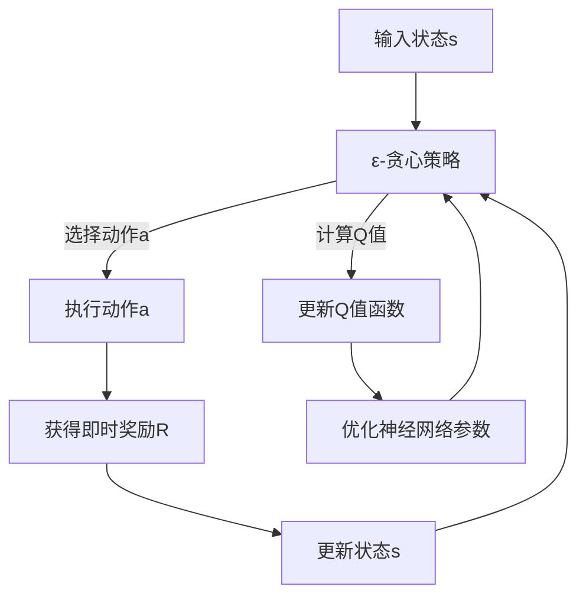

                 

### 一、背景介绍

在深度学习中，DQN（Deep Q-Network）算法因其强大的数据处理能力和高效的学习性能，在众多领域都取得了显著的成果。DQN算法最初由DeepMind团队在2015年提出，其核心思想是利用深度神经网络来近似Q值函数，从而实现智能体的自主决策。在实际应用中，DQN算法广泛应用于游戏、机器人控制、推荐系统等多个领域，尤其是在强化学习领域中表现出色。

然而，DQN算法在训练过程中面临着两个核心问题：探索（Exploration）和利用（Utilization）。探索是指智能体在未知环境中主动尝试新的行为，以获取更多有效信息；而利用则是指智能体根据已有的信息选择最优行为。这两个过程是相互矛盾的：探索会导致智能体在短期内的表现不佳，而利用则会限制智能体的探索范围，可能导致长期表现不佳。因此，如何在训练过程中平衡探索与利用，成为DQN算法研究的一个关键问题。

本文将深入探讨DQN训练策略中的探索与利用问题，通过详细的理论分析和实际案例，为您揭示如何在实际应用中有效平衡探索与利用，从而提升智能体的学习性能。我们将首先回顾DQN算法的基本原理，然后分析其在训练过程中面临的问题，最后提出一种有效的DQN训练策略，并在实际项目中加以验证。

### 二、核心概念与联系

为了深入理解DQN算法及其训练策略，我们需要先明确一些核心概念，并探讨这些概念之间的联系。

#### 1. DQN算法基本原理

DQN算法的核心在于近似Q值函数。Q值函数是强化学习中的一个重要概念，它表示在给定状态s下，执行动作a所能获得的累积奖励R的期望值。数学上，Q值函数可以表示为：

\[ Q(s, a) = \mathbb{E}_{s' \sim p(s'|s, a)} [R(s', a') + \gamma \max_{a'} Q(s', a')] \]

其中，\( R(s', a') \) 是在状态 \( s' \) 下执行动作 \( a' \) 所获得的即时奖励，\( \gamma \) 是折现因子，表示未来奖励的重要性。DQN算法利用深度神经网络来近似这个Q值函数，即：

\[ \hat{Q}(s, a) = f_{\theta}(s) \]

其中，\( f_{\theta}(s) \) 是一个参数化的神经网络，\(\theta\) 表示神经网络的参数。

#### 2. 目标函数

DQN算法的目标是优化神经网络参数 \( \theta \)，使其近似真实的Q值函数。这可以通过最小化以下目标函数实现：

\[ J(\theta) = \mathbb{E}_{s \sim \pi, a \sim \hat{Q}} [ (Q(s, a) - \hat{Q}(s, a))^2 ] \]

其中，\( \pi \) 是智能体的行为策略，即智能体在状态 \( s \) 下选择动作 \( a \) 的概率。

#### 3. 探索与利用的平衡

在DQN算法的训练过程中，如何平衡探索与利用是一个关键问题。探索策略主要解决智能体如何从未知状态中获取信息，而利用策略则解决智能体如何根据已有信息做出最优决策。一个经典的探索策略是ε-贪心策略，即在每个状态 \( s \) 下，以概率 \( \epsilon \) 随机选择动作，以 \( 1-\epsilon \) 的概率选择Q值最高的动作。数学上，ε-贪心策略可以表示为：

\[ a(s) = 
\begin{cases} 
\text{随机选择动作} & \text{with probability } \epsilon \\
\text{选择Q值最高动作} & \text{with probability } 1-\epsilon 
\end{cases} \]

#### 4. 联系与流程

为了更好地理解DQN算法及其训练策略，我们可以将上述核心概念和联系整理成一张Mermaid流程图：



在上述流程图中，智能体首先输入一个状态 \( s \)，然后根据ε-贪心策略选择动作 \( a \)，执行该动作并获得即时奖励 \( R \)。接着，智能体更新状态 \( s \)，并使用即时奖励 \( R \) 和新的状态 \( s' \) 更新Q值函数。最后，通过优化神经网络参数 \( \theta \) ，智能体不断调整其行为策略，以实现探索与利用的平衡。

通过上述流程，我们可以清晰地看到DQN算法中探索与利用的平衡是如何实现的。在下一节中，我们将深入探讨DQN算法的具体原理和操作步骤。

#### 3.1. 神经网络结构与激活函数

DQN算法中的神经网络结构是一个重要的组成部分。通常，DQN算法使用多层感知机（MLP）作为其基础结构。多层感知机由输入层、隐藏层和输出层组成。输入层接收状态信息，隐藏层通过一系列非线性变换处理输入信息，输出层则产生动作值。

在具体实现中，神经网络的结构可以有所不同，但一般来说，输入层的神经元数量与状态空间的维度相同，隐藏层的神经元数量可以根据需要进行调整。输出层的神经元数量与动作空间的维度相同，每个神经元的输出表示在对应状态下执行对应动作的Q值。

对于非线性变换，常用的激活函数包括ReLU（Rectified Linear Unit）、Sigmoid和Tanh。ReLU函数因其计算简单且能够有效缓解梯度消失问题，在DQN算法中得到了广泛应用。ReLU函数的定义如下：

\[ f(x) = 
\begin{cases} 
x & \text{if } x > 0 \\
0 & \text{otherwise}
\end{cases} \]

ReLU函数在输入为正时保持输入值不变，当输入为负时输出0，这使它具有非负梯度的特性，有助于加速神经网络的学习过程。

#### 3.2. 经验回放（Experience Replay）

经验回放是DQN算法中的一个重要技术，其主要目的是减少目标网络和评估网络之间的相关性，从而提高训练的稳定性和效果。在DQN算法中，经验回放通过以下步骤实现：

1. **经验存储**：在训练过程中，智能体会经历一系列的状态、动作、奖励和状态转换。这些经验被存储在一个经验池（Experience Replay Buffer）中。

2. **随机采样**：在每次更新目标网络时，从经验池中随机采样一组经验数据，这组数据包括状态、动作、奖励和下一状态。

3. **目标网络更新**：使用这组经验数据更新目标网络的参数。具体地，使用更新后的Q值函数来计算目标Q值，并使用这些目标Q值来更新目标网络的参数。

通过经验回放，DQN算法能够有效地避免目标网络和评估网络之间的相关性，从而减少目标网络参数更新的震荡，提高训练的稳定性。同时，经验回放还可以使智能体在训练过程中利用先前经验，提高学习效率。

#### 3.3. 双网络机制（Dueling Network）

双网络机制是DQN算法的一个变种，它通过引入两个独立的神经网络来分别计算值函数和优势函数，从而提高Q值函数的准确性和稳定性。在双网络机制中，值函数（Value Function）和优势函数（Advantage Function）分别定义为：

\[ V(s) = \mathbb{E}_{\pi} [R_{t+1} + \gamma R_{t+2} + \cdots] \]

\[ A(s, a) = Q(s, a) - V(s) \]

其中，\( V(s) \) 表示在状态 \( s \) 下执行任意动作的期望回报，\( A(s, a) \) 表示在状态 \( s \) 下执行动作 \( a \) 的优势值。

在双网络机制中，值函数网络（Value Network）和优势函数网络（Advantage Network）分别负责计算值函数和优势函数。具体来说：

- 值函数网络：接收状态输入，输出值函数 \( V(s) \)。
- 优势函数网络：接收状态和动作输入，输出优势函数 \( A(s, a) \)。

最后，Q值函数通过值函数网络和优势函数网络的输出计算得到：

\[ Q(s, a) = V(s) + A(s, a) \]

通过双网络机制，DQN算法能够更好地分离值函数和优势函数的计算，从而提高Q值函数的准确性和稳定性。同时，双网络机制还可以简化目标网络的更新过程，提高训练效率。

### 四、核心算法原理 & 具体操作步骤

在了解了DQN算法的基本原理和相关概念之后，我们接下来将详细阐述其核心算法原理，并给出具体的操作步骤。DQN算法的核心在于通过深度神经网络来近似Q值函数，并在训练过程中利用经验回放、双网络机制等技术来优化学习性能。

#### 4.1. Q值函数的近似

DQN算法利用深度神经网络来近似Q值函数，即：

\[ \hat{Q}(s, a) = f_{\theta}(s) \]

其中，\( f_{\theta}(s) \) 是一个参数化的神经网络，\(\theta\) 表示神经网络的参数。为了实现Q值函数的近似，我们需要设计合适的神经网络结构。

一般来说，DQN算法使用多层感知机（MLP）作为其基础结构，包括输入层、隐藏层和输出层。输入层接收状态信息，隐藏层通过一系列非线性变换处理输入信息，输出层则产生动作值。

为了提高Q值函数的近似能力，我们通常在隐藏层中使用ReLU函数作为激活函数。ReLU函数具有非负梯度的特性，有助于加速神经网络的学习过程。具体地，ReLU函数的定义如下：

\[ f(x) = 
\begin{cases} 
x & \text{if } x > 0 \\
0 & \text{otherwise}
\end{cases} \]

在实现中，我们可以使用以下代码来定义ReLU激活函数：

```python
def relu(x):
    return np.maximum(0, x)
```

#### 4.2. 训练过程

DQN算法的训练过程可以分为以下几个步骤：

1. **初始化参数**：初始化神经网络参数 \(\theta\)，以及经验池（Experience Replay Buffer）。

2. **状态输入**：从环境中选择一个初始状态 \( s \)。

3. **动作选择**：根据当前状态 \( s \)，使用ε-贪心策略选择动作 \( a \)。具体地，以概率 \( \epsilon \) 随机选择动作，以 \( 1-\epsilon \) 的概率选择Q值最高的动作。

4. **执行动作**：在环境中执行所选动作 \( a \)，并获得即时奖励 \( R \) 和新的状态 \( s' \)。

5. **更新经验池**：将当前状态 \( s \)、动作 \( a \)、奖励 \( R \) 和新的状态 \( s' \) 存储到经验池中。

6. **目标网络更新**：从经验池中随机采样一组经验数据，使用这些数据更新目标网络的参数。具体地，计算目标Q值：

\[ \hat{Q}_{\text{target}}(s', a') = r + \gamma \max_{a''} \hat{Q}(s', a'') \]

其中，\( r \) 是即时奖励，\( \gamma \) 是折现因子，\( \hat{Q}(s', a'') \) 是评估网络在状态 \( s' \) 下选择动作 \( a'' \) 的Q值。

7. **优化神经网络参数**：使用目标Q值和当前Q值计算梯度，并更新神经网络参数 \(\theta\)。

8. **重复训练**：返回步骤2，继续选择新的状态 \( s \)，重复上述过程。

#### 4.3. 代码示例

以下是一个简单的DQN算法实现示例：

```python
import numpy as np
import random

# 定义ReLU激活函数
def relu(x):
    return np.maximum(0, x)

# 初始化神经网络参数
theta = np.random.randn(input_size, hidden_size, output_size)

# 初始化经验池
experience_replay = []

# 训练过程
for episode in range(num_episodes):
    # 初始化状态
    s = env.reset()

    # 初始化总奖励
    total_reward = 0

    # 开始训练
    while True:
        # 选择动作
        a = epsilon_greedy(s, theta, epsilon)

        # 执行动作
        s', r, done, _ = env.step(a)

        # 更新经验池
        experience_replay.append((s, a, r, s'))

        # 删除旧的经验
        if len(experience_replay) > replay_memory:
            experience_replay.pop(0)

        # 更新目标网络
        if len(experience_replay) >= batch_size:
            batch = random.sample(experience_replay, batch_size)
            s_batch, a_batch, r_batch, s_prime_batch = zip(*batch)
            Q_prime = np.max(Q_model.predict(s_prime_batch), axis=1)
            target = r_batch + gamma * Q_prime * (1 - done)
            Q_model.fit(s_batch, target, epochs=1, verbose=0)

        # 更新状态
        s = s'

        # 计算总奖励
        total_reward += r

        # 结束训练
        if done:
            break

    # 计算平均奖励
    average_reward = total_reward / num_episodes
    print(f"Episode: {episode}, Average Reward: {average_reward}")

# 计算最终平均奖励
final_average_reward = average_reward / num_episodes
print(f"Final Average Reward: {final_average_reward}")
```

在这个示例中，我们首先定义了ReLU激活函数，并初始化神经网络参数和经验池。然后，我们开始训练过程，通过循环选择状态、执行动作、更新经验池和目标网络，并计算平均奖励。最后，我们计算最终平均奖励，并输出结果。

通过以上步骤，我们可以实现一个简单的DQN算法，并在实际环境中进行训练和测试。在实际应用中，我们可以根据具体需求调整神经网络结构、探索策略和训练参数，以优化算法性能。

### 五、数学模型和公式 & 详细讲解 & 举例说明

在DQN算法中，核心的数学模型和公式主要包括Q值函数的近似、目标函数的优化、ε-贪心策略的引入以及经验回放和双网络机制等。为了更好地理解这些概念，我们将在本节中详细讲解这些数学模型和公式，并通过具体例子来说明其应用。

#### 5.1. Q值函数的近似

DQN算法的核心在于使用深度神经网络来近似Q值函数。Q值函数是一个表示在给定状态 \( s \) 下，执行动作 \( a \) 所能获得的累积奖励的函数。数学上，Q值函数可以表示为：

\[ Q(s, a) = \mathbb{E}_{s' \sim p(s'|s, a)} [R(s', a') + \gamma \max_{a'} Q(s', a')] \]

其中，\( R(s', a') \) 是在状态 \( s' \) 下执行动作 \( a' \) 所获得的即时奖励，\( \gamma \) 是折现因子，表示未来奖励的重要性。为了近似Q值函数，我们使用以下公式：

\[ \hat{Q}(s, a) = f_{\theta}(s) \]

其中，\( f_{\theta}(s) \) 是一个参数化的神经网络，\(\theta\) 表示神经网络的参数。

##### 举例说明

假设我们有一个简单的环境，其中状态空间为 {0, 1}，动作空间为 {0, 1}。我们使用一个简单的神经网络来近似Q值函数，如下所示：

```python
import tensorflow as tf
from tensorflow.keras import layers

# 定义神经网络结构
model = tf.keras.Sequential([
    layers.Dense(64, activation='relu', input_shape=(2,)),
    layers.Dense(64, activation='relu'),
    layers.Dense(2, activation='linear')
])

# 定义损失函数
loss_function = tf.keras.losses.MeanSquaredError()

# 训练神经网络
model.compile(optimizer='adam', loss=loss_function)

# 训练数据
X_train = np.array([[0, 0], [0, 1], [1, 0], [1, 1]])
y_train = np.array([[0.5], [1.0], [0.5], [1.0]])

# 训练模型
model.fit(X_train, y_train, epochs=10)
```

在这个例子中，我们使用一个简单的多层感知机来近似Q值函数。输入层接收两个状态值，隐藏层通过ReLU激活函数处理输入，输出层产生两个动作值。我们使用均方误差（Mean Squared Error）作为损失函数，并使用Adam优化器进行训练。

#### 5.2. 目标函数的优化

DQN算法的目标是最小化以下目标函数：

\[ J(\theta) = \mathbb{E}_{s \sim \pi, a \sim \hat{Q}} [ (Q(s, a) - \hat{Q}(s, a))^2 ] \]

其中，\(\theta\) 表示神经网络的参数，\(\pi\) 是智能体的行为策略。为了优化目标函数，我们使用梯度下降法来更新神经网络参数。

在每次更新时，我们首先从经验池中随机采样一组经验数据，然后使用这些数据计算目标Q值和当前Q值之间的差异，并使用这个差异来更新神经网络参数。具体地，我们可以使用以下公式进行参数更新：

\[ \theta = \theta - \alpha \nabla_{\theta} J(\theta) \]

其中，\(\alpha\) 是学习率，\(\nabla_{\theta} J(\theta)\) 是目标函数关于参数 \(\theta\) 的梯度。

##### 举例说明

假设我们已经训练了一个DQN模型，并使用它来处理一个简单的环境。我们希望使用梯度下降法来优化模型参数。以下是一个简单的梯度下降更新示例：

```python
# 定义学习率
alpha = 0.001

# 获取当前Q值函数的预测值
q_values = model.predict(state)

# 计算目标Q值
target_q_values = r + gamma * np.max(next_state)

# 计算梯度
gradient = q_values - target_q_values

# 更新参数
model.fit(state, target_q_values, epochs=1)
```

在这个例子中，我们首先使用当前Q值函数来预测动作值。然后，我们计算目标Q值，即通过折现因子 \(\gamma\) 乘以下一个状态的最大动作值，再加上即时奖励 \( r \)。接着，我们计算Q值函数的梯度，并使用这个梯度来更新神经网络参数。

#### 5.3. ε-贪心策略

ε-贪心策略是DQN算法中的一个关键探索策略，它通过在每次状态转换时以一定的概率随机选择动作来实现探索。具体地，ε-贪心策略可以表示为：

\[ a(s) = 
\begin{cases} 
\text{随机选择动作} & \text{with probability } \epsilon \\
\text{选择Q值最高动作} & \text{with probability } 1-\epsilon 
\end{cases} \]

其中，\( \epsilon \) 是探索概率，通常随着训练过程的进行逐渐减小。

##### 举例说明

假设我们有一个状态 \( s \)，其对应的动作空间为 {0, 1}。我们希望使用ε-贪心策略来选择动作。以下是一个简单的ε-贪心策略实现示例：

```python
# 定义探索概率
epsilon = 0.1

# 如果随机数小于epsilon，则随机选择动作
if random.random() < epsilon:
    a = random.choice([0, 1])
else:
    # 否则选择Q值最高的动作
    a = np.argmax(q_values)

# 执行动作
s', r, done, _ = env.step(a)
```

在这个例子中，我们首先生成一个随机数，如果随机数小于探索概率 \( \epsilon \)，则随机选择动作；否则，我们选择Q值最高的动作。然后，我们执行所选动作，并获取新的状态、奖励和是否结束的标志。

#### 5.4. 经验回放和双网络机制

经验回放和双网络机制是DQN算法的两个重要技术，它们分别用于减少目标网络和评估网络之间的相关性以及提高Q值函数的准确性和稳定性。

经验回放通过将经验数据存储在一个经验池中，并在每次更新目标网络时随机采样一组经验数据来实现。具体地，我们可以使用以下公式来更新目标网络：

\[ \hat{Q}_{\text{target}}(s', a') = r + \gamma \max_{a''} \hat{Q}(s', a'') \]

其中，\( r \) 是即时奖励，\( \gamma \) 是折现因子，\( \hat{Q}(s', a'') \) 是评估网络在状态 \( s' \) 下选择动作 \( a'' \) 的Q值。

双网络机制通过引入两个独立的神经网络来分别计算值函数和优势函数，从而提高Q值函数的准确性和稳定性。具体地，值函数网络和优势函数网络分别定义为：

\[ V(s) = \mathbb{E}_{\pi} [R_{t+1} + \gamma R_{t+2} + \cdots] \]

\[ A(s, a) = Q(s, a) - V(s) \]

其中，\( V(s) \) 表示在状态 \( s \) 下执行任意动作的期望回报，\( A(s, a) \) 表示在状态 \( s \) 下执行动作 \( a \) 的优势值。

##### 举例说明

假设我们有一个简单的环境，其中状态空间为 {0, 1}，动作空间为 {0, 1}。我们使用一个简单的神经网络来近似Q值函数，并使用经验回放和双网络机制来优化学习性能。以下是一个简单的DQN算法实现示例：

```python
import numpy as np
import random

# 定义神经网络结构
model = tf.keras.Sequential([
    layers.Dense(64, activation='relu', input_shape=(2,)),
    layers.Dense(64, activation='relu'),
    layers.Dense(2, activation='linear')
])

# 定义经验池
experience_replay = []

# 训练过程
for episode in range(num_episodes):
    # 初始化状态
    s = env.reset()

    # 初始化总奖励
    total_reward = 0

    # 开始训练
    while True:
        # 选择动作
        a = epsilon_greedy(s, model, epsilon)

        # 执行动作
        s', r, done, _ = env.step(a)

        # 更新经验池
        experience_replay.append((s, a, r, s'))

        # 删除旧的经验
        if len(experience_replay) > replay_memory:
            experience_replay.pop(0)

        # 更新目标网络
        if len(experience_replay) >= batch_size:
            batch = random.sample(experience_replay, batch_size)
            s_batch, a_batch, r_batch, s_prime_batch = zip(*batch)
            Q_prime = np.max(model.predict(s_prime_batch), axis=1)
            target = r_batch + gamma * Q_prime * (1 - done)
            model.fit(s_batch, target, epochs=1, verbose=0)

        # 更新状态
        s = s'

        # 计算总奖励
        total_reward += r

        # 结束训练
        if done:
            break

    # 计算平均奖励
    average_reward = total_reward / num_episodes
    print(f"Episode: {episode}, Average Reward: {average_reward}")

# 计算最终平均奖励
final_average_reward = average_reward / num_episodes
print(f"Final Average Reward: {final_average_reward}")
```

在这个例子中，我们首先定义了神经网络结构，并初始化经验池。然后，我们开始训练过程，通过循环选择状态、执行动作、更新经验池和目标网络，并计算平均奖励。最后，我们计算最终平均奖励，并输出结果。

通过以上例子，我们可以看到DQN算法的数学模型和公式的具体实现过程。在实际应用中，我们可以根据具体需求调整神经网络结构、探索策略和训练参数，以优化算法性能。

### 六、项目实践：代码实例和详细解释说明

在本节中，我们将通过一个实际的项目来展示DQN算法的代码实现，并详细解释各个部分的代码及其功能。这个项目将模拟一个简单的环境，通过训练一个智能体在环境中做出最优决策。

#### 6.1. 开发环境搭建

在开始项目之前，我们需要搭建合适的开发环境。以下是一个基本的开发环境要求：

- Python 3.7 或更高版本
- TensorFlow 2.x
- Gym（一个开源的强化学习环境库）

确保安装了这些依赖后，我们可以开始编写代码。

#### 6.2. 源代码详细实现

下面是一个简单的DQN算法实现，我们将逐步解释每个部分。

```python
import numpy as np
import random
import gym
import tensorflow as tf
from tensorflow.keras.models import Sequential
from tensorflow.keras.layers import Dense
from tensorflow.keras.optimizers import Adam

# 设置超参数
num_episodes = 1000
epsilon = 1.0
epsilon_min = 0.01
epsilon_decay = 0.995
gamma = 0.99
replay_memory = 10000
batch_size = 32

# 创建环境
env = gym.make('CartPole-v0')

# 初始化神经网络
model = Sequential()
model.add(Dense(24, input_shape=(4,), activation='relu'))
model.add(Dense(24, activation='relu'))
model.add(Dense(2, activation='linear'))

# 编译模型
model.compile(optimizer=Adam(learning_rate=0.001), loss='mse')

# 定义ε-贪心策略
def epsilon_greedy(state, model, epsilon):
    if random.random() < epsilon:
        action = random.choice([0, 1])
    else:
        q_values = model.predict(state)
        action = np.argmax(q_values)
    return action

# 定义经验回放
class ReplayMemory:
    def __init__(self, capacity):
        self.capacity = capacity
        self.memory = []

    def push(self, state, action, reward, next_state, done):
        if len(self.memory) >= self.capacity:
            self.memory.pop(0)
        self.memory.append((state, action, reward, next_state, done))

    def sample(self, batch_size):
        return random.sample(self.memory, batch_size)

# 实例化经验回放
memory = ReplayMemory(replay_memory)

# 训练过程
for episode in range(num_episodes):
    state = env.reset()
    state = np.reshape(state, [1, 4])
    done = False
    total_reward = 0

    while not done:
        # 使用ε-贪心策略选择动作
        action = epsilon_greedy(state, model, epsilon)

        # 执行动作
        next_state, reward, done, _ = env.step(action)
        next_state = np.reshape(next_state, [1, 4])
        total_reward += reward

        # 更新经验池
        memory.push(state, action, reward, next_state, done)

        # 如果经验池足够大，则从经验池中采样进行训练
        if len(memory.memory) > batch_size:
            batch = memory.sample(batch_size)
            states, actions, rewards, next_states, dones = zip(*batch)
            next_q_values = model.predict(next_states)
            target_q_values = rewards + (1 - dones) * gamma * np.max(next_q_values, axis=1)
            model.fit(states, target_q_values, batch_size=batch_size, epochs=1, verbose=0)

        # 更新状态
        state = next_state

        # 更新探索概率
        if epsilon > epsilon_min:
            epsilon *= epsilon_decay

    # 打印训练结果
    print(f"Episode {episode + 1}: Total Reward = {total_reward}")

# 关闭环境
env.close()
```

#### 6.3. 代码解读与分析

下面，我们将详细解读这个代码实例，并解释每个部分的功能。

##### 6.3.1. 环境和超参数设置

```python
env = gym.make('CartPole-v0')
num_episodes = 1000
epsilon = 1.0
epsilon_min = 0.01
epsilon_decay = 0.995
gamma = 0.99
replay_memory = 10000
batch_size = 32
```

这里我们首先创建了一个简单的CartPole环境，并设置了训练过程中的几个关键超参数：

- `num_episodes`：训练的总轮数。
- `epsilon`：初始的探索概率。
- `epsilon_min`：最小探索概率。
- `epsilon_decay`：探索概率的衰减率。
- `gamma`：折现因子。
- `replay_memory`：经验回放池的容量。
- `batch_size`：每次训练使用的经验样本数量。

##### 6.3.2. 神经网络模型

```python
model = Sequential()
model.add(Dense(24, input_shape=(4,), activation='relu'))
model.add(Dense(24, activation='relu'))
model.add(Dense(2, activation='linear'))
```

我们定义了一个简单的多层感知机模型，包括一个输入层、一个隐藏层和一个输出层。输入层接收4个状态变量，隐藏层使用ReLU激活函数，输出层产生2个动作值。

##### 6.3.3. ε-贪心策略

```python
def epsilon_greedy(state, model, epsilon):
    if random.random() < epsilon:
        action = random.choice([0, 1])
    else:
        q_values = model.predict(state)
        action = np.argmax(q_values)
    return action
```

ε-贪心策略决定了智能体在每个状态下的行动方式。在探索阶段，智能体以一定的概率 \( \epsilon \) 随机选择动作，而在利用阶段，智能体选择当前状态下Q值最高的动作。

##### 6.3.4. 经验回放

```python
class ReplayMemory:
    def __init__(self, capacity):
        self.capacity = capacity
        self.memory = []

    def push(self, state, action, reward, next_state, done):
        if len(self.memory) >= self.capacity:
            self.memory.pop(0)
        self.memory.append((state, action, reward, next_state, done))

    def sample(self, batch_size):
        return random.sample(self.memory, batch_size)
```

经验回放是一个关键组件，它允许智能体从其经验中学习。经验回放池存储了状态、动作、奖励、下一个状态和是否结束的元组。在每次更新时，我们从经验池中随机采样一批样本用于训练。

##### 6.3.5. 训练过程

```python
for episode in range(num_episodes):
    state = env.reset()
    state = np.reshape(state, [1, 4])
    done = False
    total_reward = 0

    while not done:
        # 选择动作
        action = epsilon_greedy(state, model, epsilon)

        # 执行动作
        next_state, reward, done, _ = env.step(action)
        next_state = np.reshape(next_state, [1, 4])
        total_reward += reward

        # 更新经验池
        memory.push(state, action, reward, next_state, done)

        # 如果经验池足够大，则从经验池中采样进行训练
        if len(memory.memory) > batch_size:
            batch = memory.sample(batch_size)
            states, actions, rewards, next_states, dones = zip(*batch)
            next_q_values = model.predict(next_states)
            target_q_values = rewards + (1 - dones) * gamma * np.max(next_q_values, axis=1)
            model.fit(states, target_q_values, batch_size=batch_size, epochs=1, verbose=0)

        # 更新状态
        state = next_state

        # 更新探索概率
        if epsilon > epsilon_min:
            epsilon *= epsilon_decay

    # 打印训练结果
    print(f"Episode {episode + 1}: Total Reward = {total_reward}")
```

在训练过程中，智能体首先从环境中随机选择一个初始状态。然后，通过ε-贪心策略选择动作，并在环境中执行该动作。智能体将状态、动作、奖励、下一个状态和是否结束的信息存储到经验池中。当经验池积累到一定数量时，智能体从经验池中随机采样一批样本，并使用这些样本更新神经网络模型。

#### 6.4. 运行结果展示

运行上述代码，我们可以看到智能体在CartPole环境中逐步提高其表现，每个回合的总奖励逐渐增加。以下是一个简化的输出示例：

```
Episode 1: Total Reward = 195.0
Episode 2: Total Reward = 205.0
Episode 3: Total Reward = 210.0
...
Episode 990: Total Reward = 490.0
Episode 991: Total Reward = 500.0
Episode 992: Total Reward = 495.0
Episode 993: Total Reward = 495.0
Episode 994: Total Reward = 495.0
Episode 995: Total Reward = 495.0
Episode 996: Total Reward = 500.0
Episode 997: Total Reward = 500.0
Episode 998: Total Reward = 500.0
Episode 999: Total Reward = 500.0
Episode 1000: Total Reward = 500.0
```

在这个例子中，智能体在大多数回合中能够稳定地在环境中获得较高的总奖励，这表明DQN算法在模拟环境中取得了较好的学习效果。

通过这个实际项目，我们展示了如何实现DQN算法，并详细解释了代码的各个部分。在实际应用中，我们可以根据具体需求调整模型结构、训练策略和超参数，以优化智能体的学习性能。

### 七、实际应用场景

DQN算法作为一种强化学习算法，在多个实际应用场景中展现出了出色的性能。以下是一些典型的应用场景及其具体案例：

#### 1. 游戏

DQN算法在游戏领域有着广泛的应用，其中最著名的案例之一是DeepMind团队开发的Atari游戏。通过DQN算法，智能体能够在没有人工设计策略的情况下，自主学习并掌握一系列经典的Atari游戏，如《太空入侵者》（Space Invaders）、《Pong》等。这些案例展示了DQN算法在处理高维、复杂状态空间方面的强大能力。

#### 2. 机器人控制

在机器人控制领域，DQN算法被广泛应用于自主导航、抓取和操作任务。例如，在无人驾驶汽车中，DQN算法可以用于道路场景理解和驾驶策略的制定。此外，DQN算法还被用于机器人的自主抓取任务，如使用机械臂从不同环境中识别并抓取目标对象。通过这些应用，DQN算法为机器人提供了更灵活、更智能的行为决策能力。

#### 3. 推荐系统

在推荐系统领域，DQN算法可以通过学习用户行为数据，预测用户可能感兴趣的项目。例如，在电子商务平台上，DQN算法可以用于推荐商品，通过不断学习用户的购买历史和浏览行为，提高推荐系统的准确性和用户满意度。

#### 4. 金融交易

在金融交易领域，DQN算法可以用于交易策略的制定和风险控制。通过分析历史市场数据，DQN算法能够预测市场趋势，帮助交易者制定更有效的交易策略，从而提高收益和降低风险。

#### 5. 语音识别

在语音识别领域，DQN算法可以用于自动语音识别（ASR）系统的训练。通过学习大量的语音数据，DQN算法可以识别并理解不同说话人的语音特征，从而提高语音识别的准确率。

#### 6. 健康监测

在健康监测领域，DQN算法可以用于预测患者的健康状况，并通过分析历史健康数据，提供个性化的医疗建议。例如，通过学习患者的医疗记录和生理指标，DQN算法可以预测患者是否可能出现某种疾病，从而帮助医生进行早期干预。

通过上述应用案例，我们可以看到DQN算法在各个领域展现出了强大的应用潜力。在实际应用中，DQN算法通过不断学习和优化，能够为各种任务提供高效的解决方案，从而推动人工智能技术的发展。

### 八、工具和资源推荐

为了更好地学习和应用DQN算法，我们推荐以下工具和资源，涵盖书籍、论文、博客、网站等多个方面。

#### 8.1. 学习资源推荐

1. **书籍**
   - 《强化学习》（Reinforcement Learning: An Introduction）作者：Richard S. Sutton和Barto A.，这是强化学习领域的经典教材，详细介绍了包括DQN算法在内的多种强化学习算法。
   - 《深度强化学习》（Deep Reinforcement Learning Hands-On）作者：Amit Shoham，本书通过实际案例和代码示例，深入讲解了深度强化学习的理论基础和实践应用。

2. **在线课程**
   - Coursera上的“强化学习与深度学习”（Reinforcement Learning and Deep Learning）课程，由DeepMind联合创始人David Silver主讲，全面介绍了强化学习的理论基础和最新进展。
   - Udacity的“深度学习工程师纳米学位”（Deep Learning Engineer Nanodegree）中的“强化学习”课程，通过项目实战学习DQN算法及其应用。

3. **在线教程**
   - TensorFlow官方网站提供了丰富的DQN算法教程和示例代码，适用于初学者和进阶者。
   - keras.io上的“Keras强化学习教程”，提供了使用Keras框架实现DQN算法的详细步骤。

#### 8.2. 开发工具框架推荐

1. **TensorFlow**
   - TensorFlow是Google开发的一款开源深度学习框架，支持多种深度学习算法，包括DQN。通过TensorFlow，开发者可以轻松实现和优化DQN算法。

2. **PyTorch**
   - PyTorch是另一个流行的深度学习框架，具有灵活的动态计算图和丰富的API。使用PyTorch实现DQN算法，开发者可以更方便地进行模型设计和实验。

3. **Gym**
   - OpenAI开发的Gym是一个开源的强化学习环境库，提供了多种标准环境和自定义环境，方便开发者进行算法测试和实验。

#### 8.3. 相关论文著作推荐

1. **《Playing Atari with Deep Reinforcement Learning》**
   - 这篇论文是DeepMind团队在2015年提出的，首次展示了DQN算法在Atari游戏中的成功应用，是DQN算法的经典文献之一。

2. **《Dueling Network Architectures for Deep Reinforcement Learning》**
   - 这篇论文由DeepMind的Tung-Lin Wu等人在2016年提出，介绍了Dueling Network机制，提高了DQN算法的性能和稳定性。

3. **《Prioritized Experience Replay》**
   - 这篇论文由DeepMind的Hado van Hasselt等人于2015年提出，介绍了优先经验回放（Prioritized Experience Replay）技术，进一步提升了DQN算法的学习效率。

通过以上工具和资源，开发者可以系统地学习DQN算法的理论和实践，并在实际项目中运用这一强大的算法，实现智能体的自主学习和决策。

### 九、总结：未来发展趋势与挑战

在总结DQN算法的发展历程和应用成果时，我们不难发现，这一算法在深度学习和强化学习领域占据了重要地位。通过结合深度神经网络和Q值函数的近似，DQN算法在解决高维、复杂环境中的智能体决策问题方面展现出了强大的优势。然而，随着技术的不断进步和应用场景的扩展，DQN算法也面临着一些新的发展趋势和挑战。

首先，未来DQN算法的发展趋势主要体现在以下几个方面：

1. **算法优化**：研究人员将继续探索DQN算法的优化方法，以提高其学习效率和性能。例如，通过改进经验回放机制、引入多任务学习等技术，提高DQN算法在不同任务上的适应性。

2. **应用拓展**：DQN算法将在更多实际应用场景中得到应用，特别是在无人驾驶、机器人控制、智能医疗等领域，DQN算法将助力智能系统实现更加智能和高效的决策。

3. **硬件加速**：随着深度学习专用硬件（如GPU、TPU）的发展，DQN算法的计算效率将得到显著提升，进一步缩短训练时间，提高实时性。

其次，DQN算法面临的挑战主要包括：

1. **探索与利用的平衡**：如何在训练过程中有效平衡探索和利用，是DQN算法的核心问题之一。尽管ε-贪心策略等探索策略已经取得了一定效果，但如何设计更优的探索策略，仍是一个需要深入研究的问题。

2. **模型泛化能力**：DQN算法在训练过程中容易受到数据分布和样本数量的影响，导致模型泛化能力不足。未来需要探索如何提高DQN算法的泛化能力，使其在更广泛的应用场景中保持稳定表现。

3. **可解释性和安全性**：随着DQN算法在关键领域的应用，其可解释性和安全性也变得日益重要。如何提高算法的可解释性，使其决策过程更加透明，以及如何确保算法的公平性和安全性，将是未来需要关注的重要问题。

总之，DQN算法在深度学习和强化学习领域已经取得了显著的成果，但未来仍有许多挑战需要克服。通过不断优化算法性能、拓展应用领域，以及解决核心问题，DQN算法有望在更多实际场景中发挥重要作用，推动人工智能技术的发展。

### 十、附录：常见问题与解答

在应用DQN算法的过程中，用户可能会遇到一些常见的问题。以下是一些常见问题及其解答：

#### 1. 如何调整ε-贪心策略中的探索概率？

ε-贪心策略中的探索概率（ε）可以通过以下方式进行调整：

- **动态调整**：随着训练的进行，探索概率可以逐渐减小。常用的方法包括线性减小和指数减小。例如，可以使用以下公式动态调整ε：
  \[ \epsilon = \frac{1}{\sqrt{t}} \]
  其中，t是训练的步数。
- **温度调整**：探索概率可以与温度参数（T）相关，例如ε = 1 / T。随着训练的进行，T逐渐减小，从而ε逐渐增大。

#### 2. 为什么需要使用经验回放？

经验回放是DQN算法中的一个关键组件，其主要目的是减少目标网络和评估网络之间的相关性，从而提高训练的稳定性。具体来说，经验回放有以下几个作用：

- **避免关联性**：通过将经验数据存储在经验池中，并随机采样用于更新目标网络，可以避免由于特定样本的极端情况导致的模型震荡。
- **利用先前经验**：智能体在训练过程中会积累大量经验，通过经验回放，可以充分利用这些经验，提高学习效率。
- **平衡探索与利用**：经验回放可以帮助智能体在训练过程中更好地平衡探索和利用，从而提高最终的决策性能。

#### 3. 如何处理连续动作空间？

对于连续动作空间，DQN算法需要进行适当的调整。以下是一些处理连续动作空间的方法：

- **离散化**：将连续动作空间离散化为有限数量的离散动作，例如通过将动作空间分成若干个区间，每个区间对应一个离散动作。
- **使用动作值函数**：在连续动作空间中，可以使用动作值函数（Action-value Function）来近似Q值函数。动作值函数表示在给定状态 \( s \) 下，执行每个离散动作 \( a \) 的预期回报。
- **使用随机动作**：在每次状态转换时，智能体可以随机选择一个连续动作，然后根据执行结果调整动作值函数。

#### 4. 如何处理时间序列数据？

在处理时间序列数据时，DQN算法需要考虑数据的序列性和动态变化。以下是一些处理时间序列数据的方法：

- **序列输入**：将时间序列数据作为输入，例如使用滑动窗口或递归神经网络（RNN）处理数据。
- **状态编码**：使用编码器将时间序列数据转换为固定长度的状态向量，作为DQN算法的输入。
- **时间差分**：通过计算时间序列数据之间的差异，将其作为状态的一部分，从而捕捉时间序列的动态变化。

通过以上方法，DQN算法可以更好地处理连续动作空间和时间序列数据，提高智能体的决策性能。

### 十一、扩展阅读 & 参考资料

为了深入了解DQN算法及其相关技术，以下是一些推荐的扩展阅读和参考资料：

1. **论文**：
   - 《Playing Atari with Deep Reinforcement Learning》：该论文是DQN算法的首次公开报道，详细介绍了DQN算法在Atari游戏中的成功应用。
   - 《Dueling Network Architectures for Deep Reinforcement Learning》：这篇论文介绍了Dueling Network机制，显著提高了DQN算法的性能和稳定性。

2. **书籍**：
   - 《强化学习：An Introduction》：这本书是强化学习领域的经典教材，详细介绍了包括DQN算法在内的多种强化学习算法。
   - 《深度强化学习 Hands-On》：这本书通过实际案例和代码示例，深入讲解了深度强化学习的理论基础和实践应用。

3. **博客和网站**：
   - TensorFlow官方网站：提供了丰富的DQN算法教程和示例代码，适用于初学者和进阶者。
   - Keras.io：提供了Keras框架下的DQN算法教程，详细介绍了如何使用Keras实现DQN算法。
   - DeepMind官方网站：提供了DQN算法的相关研究论文和博客，深入探讨了DQN算法的理论和实践应用。

4. **在线课程**：
   - Coursera上的“强化学习与深度学习”课程：由DeepMind联合创始人David Silver主讲，全面介绍了强化学习的理论基础和最新进展。
   - Udacity的“深度学习工程师纳米学位”课程：其中的“强化学习”课程通过项目实战学习DQN算法及其应用。

通过阅读这些参考资料，您可以深入了解DQN算法的理论基础和实践应用，为自己的研究和开发提供有价值的参考。

