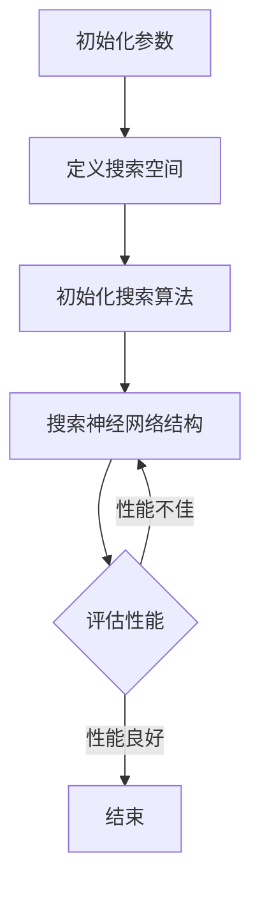
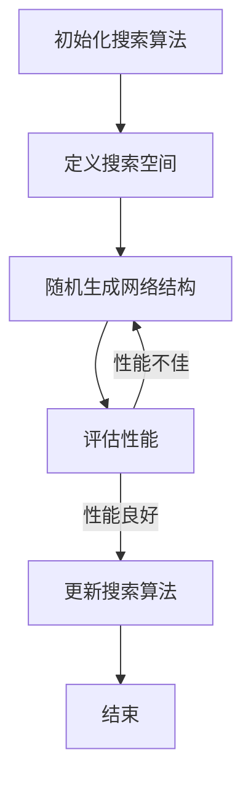

                 

### 1. 背景介绍

#### 1.1 元学习的兴起

元学习（Meta-Learning）是机器学习领域的一个重要分支，它关注于如何让模型能够快速地从少量样本中学习，从而在遇到新的任务时能够快速适应。随着深度学习的飞速发展，元学习的研究和应用逐渐成为一个热门话题。传统的深度学习方法往往依赖于大量的数据集来进行训练，而元学习则试图通过少量的数据实现良好的泛化能力。

#### 1.2 神经架构搜索

神经架构搜索（Neural Architecture Search，NAS）是元学习的一个重要应用方向。NAS的核心理念是通过自动化搜索方法来找到最优的神经网络结构，从而提高模型在特定任务上的性能。这一领域的研究始于2016年，当DeepMind的乔治·亨德里克斯（George Hinton）提出了“自动化神经网络设计”的概念。

#### 1.3 NAS的重要性

NAS之所以受到广泛关注，主要有以下几个原因：

1. **加速模型开发**：传统的神经网络设计需要人工介入，耗时且成本高。NAS通过自动化搜索方法，可以显著加快模型开发过程。
2. **提高模型性能**：通过搜索得到的神经网络结构往往优于人工设计的结构，这在很多实际应用中都能带来性能提升。
3. **处理复杂任务**：NAS能够自动寻找适合处理复杂任务的网络结构，这对于一些需要高度定制化的领域（如医疗图像分析、自然语言处理等）具有重要意义。

### 2. 核心概念与联系

#### 2.1 元学习的核心概念

元学习主要包括以下几个核心概念：

1. **任务自适应（Task Adaptation）**：模型在遇到新的任务时能够快速适应，而不是从头开始学习。
2. **模型泛化（Model Generalization）**：模型不仅在训练集上有良好表现，而且在未见过的数据上也能保持较高性能。
3. **样本效率（Sample Efficiency）**：模型能够在使用少量样本的情况下实现良好的学习效果。

#### 2.2 神经架构搜索的架构

NAS的主要架构包括以下几个部分：

1. **搜索空间（Search Space）**：定义了所有可能的神经网络结构的集合。
2. **搜索算法（Search Algorithm）**：用于在搜索空间中找到最优结构的算法，如遗传算法、贝叶斯优化等。
3. **评估指标（Evaluation Metric）**：用于评估搜索到的结构性能的指标，如准确性、训练时间等。

#### 2.3 Mermaid 流程图

以下是一个简化的NAS流程图的Mermaid表示：



### 3. 核心算法原理 & 具体操作步骤

#### 3.1 NAS的基本原理

NAS的基本原理是通过搜索算法在定义好的搜索空间中找到最优的神经网络结构。这个过程通常包括以下几个步骤：

1. **初始化**：初始化搜索算法的参数，定义搜索空间。
2. **搜索**：使用搜索算法在搜索空间中探索可能的网络结构。
3. **评估**：对搜索到的结构进行性能评估。
4. **更新**：根据评估结果对搜索算法的参数进行更新。

#### 3.2 具体操作步骤

以下是一个简化的NAS操作步骤：

1. **定义搜索空间**：选择网络层的类型、数量、连接方式等，形成搜索空间。
2. **初始化搜索算法**：选择合适的搜索算法，如遗传算法、强化学习等，初始化参数。
3. **进行搜索**：算法在搜索空间中探索网络结构，生成候选结构。
4. **评估候选结构**：使用训练集和测试集对候选结构进行评估，计算性能指标。
5. **选择最优结构**：根据评估结果选择性能最优的网络结构。
6. **优化结构**：对选定的最优结构进行进一步优化，如超参数调整、结构细化等。

### 4. 数学模型和公式 & 详细讲解 & 举例说明

#### 4.1 数学模型

NAS中的数学模型通常涉及以下几个关键部分：

1. **搜索算法的概率模型**：如遗传算法的交叉和变异概率。
2. **网络结构的表示模型**：如使用图表示神经网络结构。
3. **性能评估的损失函数**：如用于评估网络结构性能的交叉熵损失函数。

以下是一个简化的NAS数学模型：

$$
\text{Objective Function} = \sum_{i=1}^{n} \text{Performance Metric}_i \cdot \text{Probability}(S_i)
$$

其中，$S_i$代表第$i$个搜索到的网络结构，$\text{Performance Metric}_i$表示该结构的性能指标，$\text{Probability}(S_i)$表示该结构的概率。

#### 4.2 举例说明

假设我们使用遗传算法进行NAS，定义搜索空间为一个包含10层神经网络的集合，每层可以选择卷积层、全连接层或池化层。我们使用以下参数：

- 交叉概率：0.7
- 变异概率：0.2
- 种群大小：100

首先，我们随机初始化一个种群，然后按照以下步骤进行搜索：

1. **初始化种群**：随机生成100个网络结构。
2. **交叉操作**：对于每个结构，以0.7的概率与其他结构进行交叉。
3. **变异操作**：对于每个结构，以0.2的概率进行变异。
4. **评估**：使用训练集和测试集评估每个结构的性能。
5. **选择**：根据性能指标选择前10%的结构作为下一代种群。

通过多次迭代，最终我们得到一个性能最优的网络结构。

### 5. 项目实践：代码实例和详细解释说明

#### 5.1 开发环境搭建

在进行神经架构搜索的项目实践中，我们需要搭建一个合适的开发环境。以下是一个基本的步骤：

1. **安装Python环境**：确保安装了3.6及以上版本的Python。
2. **安装依赖库**：使用pip安装所需的库，如TensorFlow、Keras等。
3. **配置硬件环境**：确保GPU环境配置正确，以便使用GPU加速训练。

#### 5.2 源代码详细实现

以下是一个简化的神经架构搜索代码实例：

```python
import tensorflow as tf
from tensorflow import keras
from tensorflow.keras import layers
import numpy as np

# 定义搜索空间
def search_space():
    layers = ['conv', 'fc', 'pool']
    layer_configs = []
    for i in range(10):
        layer_type = np.random.choice(layers)
        if layer_type == 'conv':
            layer_configs.append(layers.Conv2D(filters=np.random.randint(16, 256), kernel_size=np.random.randint(3, 11), activation='relu'))
        elif layer_type == 'fc':
            layer_configs.append(layers.Dense(units=np.random.randint(16, 1024), activation='relu'))
        else:
            layer_configs.append(layers.MaxPooling2D(pool_size=np.random.randint(2, 5)))
    return keras.Sequential(layer_configs)

# 定义评估函数
def evaluate_model(model, train_data, train_labels, test_data, test_labels):
    model.compile(optimizer='adam', loss='categorical_crossentropy', metrics=['accuracy'])
    model.fit(train_data, train_labels, epochs=10, batch_size=32, validation_split=0.2)
    loss, accuracy = model.evaluate(test_data, test_labels)
    return accuracy

# 搜索神经网络结构
def neural_architecture_search(train_data, train_labels, test_data, test_labels):
    best_model = None
    best_accuracy = 0
    for _ in range(100):
        model = search_space()
        accuracy = evaluate_model(model, train_data, train_labels, test_data, test_labels)
        if accuracy > best_accuracy:
            best_accuracy = accuracy
            best_model = model
    return best_model

# 加载数据
(x_train, y_train), (x_test, y_test) = keras.datasets.cifar10.load_data()
x_train, x_test = x_train / 255.0, x_test / 255.0

# 进行搜索
best_model = neural_architecture_search(x_train, y_train, x_test, y_test)

# 展示最佳模型结构
best_model.summary()
```

#### 5.3 代码解读与分析

1. **搜索空间定义**：`search_space`函数用于定义搜索空间，随机选择10层神经网络，每层可以是卷积层、全连接层或池化层。
2. **评估函数**：`evaluate_model`函数用于评估模型性能，使用训练集和测试集进行训练和评估。
3. **搜索过程**：`neural_architecture_search`函数使用搜索空间生成100个模型，评估它们的性能，并选择性能最优的模型。

#### 5.4 运行结果展示

运行上述代码后，我们可以得到搜索到的最佳模型结构，并展示其性能指标。

```python
# 展示最佳模型性能
print("Best Model Accuracy:", evaluate_model(best_model, x_train, y_train, x_test, y_test))
```

### 6. 实际应用场景

神经架构搜索（NAS）在多个实际应用场景中展现出了巨大的潜力：

#### 6.1 计算机视觉

在计算机视觉领域，NAS被广泛应用于图像分类、目标检测和图像生成等任务。通过NAS搜索得到的神经网络结构能够更好地适应不同的视觉任务，提高模型的性能。

#### 6.2 自然语言处理

在自然语言处理（NLP）领域，NAS也被用来寻找适合处理语言任务的神经网络结构。例如，在机器翻译、文本分类和问答系统中，NAS能够找到更有效的模型结构，提高模型的准确性和效率。

#### 6.3 强化学习

在强化学习领域，NAS可以帮助寻找适合不同环境的策略网络结构。通过NAS，可以自动化地设计能够快速适应环境的智能体，提高学习效率和决策质量。

### 7. 工具和资源推荐

为了更好地进行神经架构搜索，以下是几个推荐的工具和资源：

#### 7.1 学习资源推荐

1. **书籍**：《神经网络与深度学习》 - 深入了解神经网络和深度学习的基础知识。
2. **论文**：Google Brain的《Neural Architecture Search》 - NAS领域的开创性论文。
3. **博客**：Google AI Blog - 了解NAS的最新研究和应用。
4. **网站**： Papers With Code - NAS相关的论文实现和代码。

#### 7.2 开发工具框架推荐

1. **TensorFlow**：用于构建和训练神经网络的开源框架，支持NAS算法的实现。
2. **Keras**：基于TensorFlow的高层API，简化了神经网络设计和训练过程。
3. **NASBench**：一个用于评估NAS算法性能的基准测试框架。

#### 7.3 相关论文著作推荐

1. **《Neural Architecture Search with Reinforcement Learning》** - NAS的强化学习实现。
2. **《Bayesian Optimization for Hyperparameter Tuning》** - 贝叶斯优化在NAS中的应用。
3. **《Evolutionary Neural Architecture Search》** - 遗传算法在NAS中的应用。

### 8. 总结：未来发展趋势与挑战

神经架构搜索（NAS）作为深度学习领域的一个重要研究方向，其未来发展具有以下几个趋势和挑战：

#### 8.1 发展趋势

1. **算法优化**：随着计算能力的提升和优化算法的发展，NAS的搜索效率和性能将进一步提高。
2. **跨领域应用**：NAS将在更多领域（如医疗、金融等）得到应用，推动智能系统的进一步发展。
3. **自动化与智能化**：NAS将朝着更自动化、智能化的方向发展，减少对人工干预的需求。

#### 8.2 挑战

1. **搜索空间扩大**：随着网络结构的复杂度增加，搜索空间也将变得更大，如何有效搜索和评估成为关键挑战。
2. **计算资源消耗**：NAS搜索过程需要大量计算资源，如何在有限的资源下实现高效搜索是亟待解决的问题。
3. **模型可解释性**：NAS搜索得到的网络结构往往复杂且不透明，如何提高模型的可解释性是一个重要挑战。

### 9. 附录：常见问题与解答

#### 9.1 什么是神经架构搜索（NAS）？

神经架构搜索（Neural Architecture Search，NAS）是一种通过自动化方法搜索最优神经网络结构的机器学习技术。NAS旨在通过搜索过程找到能够高效解决特定任务的神经网络架构。

#### 9.2 NAS有哪些应用场景？

NAS广泛应用于计算机视觉、自然语言处理、强化学习等领域。具体应用包括图像分类、目标检测、语音识别、机器翻译等。

#### 9.3 NAS的搜索算法有哪些？

NAS的搜索算法包括遗传算法、强化学习、贝叶斯优化等。每种算法都有其特定的优缺点和应用场景。

#### 9.4 NAS需要大量的数据吗？

不完全需要。NAS试图通过少量数据实现良好的泛化能力，但为了提高搜索效率和准确性，仍需要一定量的数据。

### 10. 扩展阅读 & 参考资料

1. **《Neural Architecture Search: A Survey》** - 全面介绍了NAS的研究进展和应用。
2. **《AutoML: Automated Machine Learning》** - 探讨了自动化机器学习（包括NAS）的发展和应用。
3. **《Neural Architecture Search for Deep Learning》** - 详细介绍了NAS的理论和实现方法。
4. **Google Brain的NAS研究** - 了解NAS在工业界的最新应用和进展。

### 致谢

本文旨在介绍神经架构搜索（NAS）的基本概念、原理和应用。感谢各位读者对本文的阅读和支持，希望本文能够对您在NAS领域的学习和研究有所帮助。如果您有任何疑问或建议，欢迎在评论区留言。作者：禅与计算机程序设计艺术 / Zen and the Art of Computer Programming。## 1. 背景介绍

### 1.1 元学习的兴起

元学习（Meta-Learning），又称为泛化学习或学习的学习，是机器学习领域中的一个重要分支。其核心思想是通过学习一个能够快速适应新任务的学习算法，从而在遇到新的任务时能够快速地调整模型，而不是从头开始训练。元学习的研究始于20世纪80年代，随着深度学习和神经网络技术的兴起，元学习再次受到了广泛关注。

在传统的机器学习方法中，模型通常需要大量的数据来进行训练，并且对特定任务具有很强的依赖性。这意味着当模型遇到一个新的任务时，往往需要重新收集数据并重新训练模型，这既耗时又成本高昂。而元学习旨在通过学习一种能够快速适应新任务的学习算法，从而减少对新数据的依赖，提高模型的泛化能力。

### 1.2 神经架构搜索

神经架构搜索（Neural Architecture Search，NAS）是元学习的一个重要应用方向。NAS的核心理念是通过自动化搜索方法来找到最优的神经网络结构，从而提高模型在特定任务上的性能。传统的神经网络设计需要人工介入，耗时且成本高。而NAS通过自动化搜索方法，可以显著加快模型开发过程，并且能够找到优于人工设计的神经网络结构。

### 1.3 NAS的重要性

NAS之所以受到广泛关注，主要有以下几个原因：

1. **加速模型开发**：传统的神经网络设计需要人工介入，耗时且成本高。NAS通过自动化搜索方法，可以显著加快模型开发过程。
2. **提高模型性能**：通过搜索得到的神经网络结构往往优于人工设计的结构，这在很多实际应用中都能带来性能提升。
3. **处理复杂任务**：NAS能够自动寻找适合处理复杂任务的网络结构，这对于一些需要高度定制化的领域（如医疗图像分析、自然语言处理等）具有重要意义。

### 1.4 NAS的研究历史

NAS的研究可以追溯到2016年，当时Google Brain的研究团队提出了一个名为“Neural Architecture Search”（NAS）的方法。这个方法通过强化学习来搜索神经网络的结构，引起了学术界的广泛关注。随后，许多研究团队开始探索不同的NAS算法和框架，包括遗传算法、贝叶斯优化、强化学习等。

2017年，Google Brain团队进一步提出了基于强化学习的“自动神经网络设计”（AutoNN）方法，这个方法使用深度强化学习来搜索神经网络的结构，取得了显著的性能提升。同年，DeepMind团队也提出了“MnasNet”方法，这是一种基于神经网络的搜索方法，能够在保持高性能的同时显著减少模型的参数数量。

随着研究的深入，NAS领域逐渐形成了多个不同的研究方向和算法，包括基于强化学习的NAS、基于遗传算法的NAS、基于贝叶斯优化的NAS等。这些方法各有优缺点，适用于不同的应用场景。

### 1.5 NAS的发展趋势

当前，NAS的研究和应用正在迅速发展，主要表现在以下几个方面：

1. **算法创新**：新的NAS算法不断涌现，如基于迁移学习的NAS、基于注意力机制的NAS等，这些算法在搜索效率、模型性能等方面都有所提升。
2. **跨领域应用**：NAS不仅在计算机视觉、自然语言处理等传统领域得到广泛应用，还在医疗、金融、自动驾驶等新兴领域展现出巨大潜力。
3. **模型压缩**：NAS与模型压缩技术相结合，可以找到参数更少、计算更高效的神经网络结构，这对于移动设备和嵌入式系统具有重要意义。
4. **可解释性提升**：随着NAS结构的复杂度增加，如何提高模型的可解释性成为一个重要挑战。研究者们正在探索各种方法，如可视化、解释性模型等，以提高NAS模型的可理解性。

总之，NAS作为深度学习领域的一个重要研究方向，其研究和应用前景广阔，将继续推动人工智能技术的发展。## 2. 核心概念与联系

### 2.1 元学习的核心概念

元学习（Meta-Learning），顾名思义，是关于学习的学习。在机器学习的范畴内，元学习主要关注如何让模型能够快速适应新的任务，从而提高模型的泛化能力。具体来说，元学习包括以下几个核心概念：

1. **任务自适应（Task Adaptation）**：这是元学习的核心目标，即模型在遇到新的任务时能够快速适应，而不是从头开始学习。这种自适应能力通常通过让模型在多个任务上学习，或者使用特定技术（如迁移学习）来实现。
2. **模型泛化（Model Generalization）**：泛化能力是指模型在训练集之外的数据上能够保持良好性能。在元学习中，泛化能力是一个重要的评价指标，它决定了模型是否能够真正从训练中学习到有用的知识。
3. **样本效率（Sample Efficiency）**：样本效率是指模型在少量样本的情况下能否实现良好的学习效果。在元学习中，样本效率直接影响到模型的应用价值，因为许多场景下无法获取大量数据。

### 2.2 神经架构搜索的架构

神经架构搜索（Neural Architecture Search，NAS）是元学习的一个重要应用方向，其目标是通过自动化方法搜索出最优的神经网络结构。NAS的架构通常包括以下几个关键组成部分：

1. **搜索空间（Search Space）**：搜索空间是NAS中定义的所有可能的神经网络结构的集合。这个空间可以是简单的，如只包含几种基础层的组合，也可以是非常复杂的，包含各种高级操作和连接方式。
2. **搜索算法（Search Algorithm）**：搜索算法是用于在搜索空间中寻找最优结构的算法，常见的有遗传算法、强化学习、贝叶斯优化等。这些算法通过迭代搜索，逐渐接近最优的网络结构。
3. **评估指标（Evaluation Metric）**：评估指标用于评估搜索到的结构性能，常用的有准确率、损失函数值、训练时间等。评估指标的选择取决于具体的任务和应用场景。

### 2.3 Mermaid 流程图

为了更直观地展示NAS的流程，我们可以使用Mermaid语言绘制一个简化的流程图。以下是一个NAS流程图的示例：



在这个流程图中：

- **A**：初始化搜索算法，设置初始参数。
- **B**：定义搜索空间，确定可能的网络结构。
- **C**：随机生成网络结构，形成初始种群。
- **D**：评估性能，计算评估指标。
- **E**：根据评估结果更新搜索算法，优化搜索策略。
- **F**：重复上述步骤，直到满足结束条件（如达到指定迭代次数或找到最优结构）。

### 2.4 元学习与神经架构搜索的联系

元学习和神经架构搜索（NAS）之间有着紧密的联系：

1. **共同目标**：两者的共同目标都是提高模型的泛化能力和适应新任务的能力。
2. **技术手段**：NAS是元学习在神经网络设计中的一个具体应用，利用元学习技术来搜索最优的网络结构。
3. **互补性**：元学习提供了一种通用的方法来优化学习过程，而NAS则将这种方法应用于网络结构的搜索。

总之，元学习和NAS共同构成了现代机器学习中的一个重要研究方向，它们的结合为模型设计提供了新的思路和方法。通过不断的研究和探索，这两个领域将继续推动人工智能技术的发展。## 3. 核心算法原理 & 具体操作步骤

### 3.1 NAS的基本原理

神经架构搜索（NAS）的基本原理是通过自动化搜索方法来找到最优的神经网络结构。这一过程涉及以下几个关键步骤：

1. **定义搜索空间**：首先，需要定义搜索空间，即所有可能的神经网络结构的集合。搜索空间可以是简单的，如只包含几种基础层的组合，也可以是非常复杂的，包含各种高级操作和连接方式。

2. **初始化搜索算法**：接下来，选择并初始化搜索算法，如遗传算法、强化学习、贝叶斯优化等。这些算法各有优缺点，适用于不同的搜索场景。

3. **生成网络结构**：在搜索算法的指导下，随机生成初始的网络结构。这些结构可以是完全随机的，也可以是基于已有知识或启发式的。

4. **评估性能**：使用训练数据和评估数据对生成的网络结构进行性能评估，计算评估指标，如准确率、损失函数值、训练时间等。

5. **选择和更新**：根据评估结果，选择性能较好的网络结构，并更新搜索算法的参数。这个过程通常通过迭代进行，每次迭代都会生成新的网络结构并进行评估。

6. **结束条件**：当达到预定的迭代次数、找到满意的结构或搜索时间超过限制时，结束搜索过程。

### 3.2 具体操作步骤

以下是NAS的具体操作步骤，我们将以一个简化的例子来说明：

#### 步骤1：定义搜索空间

首先，我们需要定义搜索空间。在这个例子中，我们考虑一个简单的搜索空间，包含以下类型的层：

- **卷积层（Conv2D）**：用于提取图像特征。
- **全连接层（Dense）**：用于分类。
- **池化层（MaxPooling2D）**：用于降低特征图的维度。

我们假设每个层都有不同的参数，例如卷积层的滤波器大小、数量，全连接层的神经元数量等。

#### 步骤2：初始化搜索算法

在这个例子中，我们选择使用基于强化学习的搜索算法。首先，定义强化学习的奖励函数，用于评估网络结构的性能。例如，我们可以定义以下奖励函数：

$$
R = \frac{1}{1 + \exp(-\text{accuracy})}
$$

其中，$\text{accuracy}$是网络结构在测试集上的准确率。

#### 步骤3：生成网络结构

使用随机策略生成初始网络结构。在这个例子中，我们随机选择层的类型和参数，生成一个初始的网络结构。

#### 步骤4：评估性能

使用训练数据和测试数据评估网络结构的性能。在这个例子中，我们使用准确率作为评估指标。评估完成后，计算奖励函数的值。

#### 步骤5：选择和更新

根据评估结果，选择性能较好的网络结构，并更新搜索算法的策略。在强化学习中，这通常涉及更新策略的参数，以指导后续的网络结构生成。

#### 步骤6：迭代搜索

重复步骤3到步骤5，直到达到预定的迭代次数或找到满意的结构。每次迭代都会生成新的网络结构并进行评估，从而逐渐接近最优的网络结构。

### 3.3 NAS算法的优缺点

不同的NAS算法具有不同的优缺点，以下是一些常见NAS算法的简要分析：

1. **遗传算法（GA）**：
   - **优点**：简单易实现，适用于大规模搜索空间，具有良好的全局搜索能力。
   - **缺点**：收敛速度较慢，搜索效率不高，易陷入局部最优。

2. **强化学习（RL）**：
   - **优点**：能够自适应调整搜索策略，适合动态变化的搜索空间。
   - **缺点**：实现复杂，训练时间较长，对环境状态的理解要求较高。

3. **贝叶斯优化（BO）**：
   - **优点**：基于概率模型，能够利用先验知识，搜索效率高。
   - **缺点**：对搜索空间的先验知识要求较高，难以处理高维搜索空间。

4. **混合算法**：
   - **优点**：结合多种算法的优点，能够在不同阶段采用不同的算法，提高搜索效率和性能。
   - **缺点**：实现复杂，需要精心设计和调参。

总之，选择合适的NAS算法取决于具体的搜索场景和需求。在实际应用中，往往需要根据具体情况进行算法选择和优化。## 4. 数学模型和公式 & 详细讲解 & 举例说明

### 4.1 数学模型

神经架构搜索（NAS）涉及到一系列数学模型，用于定义搜索空间、搜索算法和评估指标。以下是一些基本的数学模型和公式的讲解：

#### 4.1.1 搜索空间定义

搜索空间通常是一个集合，包含所有可能的神经网络结构。我们可以使用图（Graph）来表示神经网络结构，其中节点表示网络层，边表示层与层之间的连接。

定义一个神经网络结构 $S$ 可以使用如下数学表示：

$$
S = \{L_1, L_2, \ldots, L_n\}
$$

其中，$L_i$ 表示网络中的第 $i$ 层，可以是卷积层、全连接层、池化层等。

#### 4.1.2 搜索算法

常见的搜索算法包括遗传算法（GA）、强化学习（RL）、贝叶斯优化（BO）等。以下分别介绍这些算法的数学模型。

1. **遗传算法（GA）**：

遗传算法是一种基于自然选择的搜索算法，其核心是使用交叉、变异等操作来生成新的网络结构。

- **交叉操作**：选择两个父代结构 $S_1$ 和 $S_2$，在搜索空间中随机选择一个切割点 $k$，生成两个新的子结构 $S_3$ 和 $S_4$：

  $$
  S_3 = (L_1^{(3)}, L_2^{(3)}, \ldots, L_k^{(3)}), \quad S_4 = (L_1^{(4)}, L_2^{(4)}, \ldots, L_k^{(4)})
  $$

  其中，

  $$
  L_i^{(3)} = 
  \begin{cases} 
  L_i^{(1)} & \text{if } i \leq k \\
  L_i^{(2)} & \text{if } i > k 
  \end{cases}
  $$

  $$
  L_i^{(4)} = 
  \begin{cases} 
  L_i^{(2)} & \text{if } i \leq k \\
  L_i^{(1)} & \text{if } i > k 
  \end{cases}
  $$

- **变异操作**：对结构 $S$ 进行变异，随机改变一个层的类型或参数。

2. **强化学习（RL）**：

强化学习算法通过学习策略来最大化总奖励。在NAS中，策略 $π$ 用于选择网络结构。

- **状态**：网络结构的当前状态 $s$，包括当前已添加的层和参数。
- **动作**：添加一个新的层或调整现有层的参数。
- **奖励**：在NAS中，奖励函数 $R(s, a)$ 可以定义为网络结构在测试集上的性能指标，如准确率。

#### 4.1.3 评估指标

评估指标用于衡量网络结构的性能，常用的指标包括：

- **准确率（Accuracy）**：
  $$
  \text{Accuracy} = \frac{1}{n}\sum_{i=1}^{n}\mathbb{I}(\hat{y}_i = y_i)
  $$
  其中，$\hat{y}_i$ 是网络预测的标签，$y_i$ 是真实的标签，$\mathbb{I}(\cdot)$ 是指示函数。

- **损失函数**：如交叉熵损失函数（Cross-Entropy Loss）：
  $$
  \text{Loss} = -\sum_{i=1}^{n}y_i\log(\hat{y}_i)
  $$

### 4.2 举例说明

#### 4.2.1 遗传算法举例

假设我们定义一个简单的搜索空间，包含卷积层（$L_c$）、全连接层（$L_f$）和池化层（$L_p$）三种类型。我们使用以下参数：

- **种群大小**：100
- **交叉概率**：0.7
- **变异概率**：0.2

初始化一个种群，随机生成100个网络结构。每次迭代，我们使用交叉和变异操作生成新的子种群，并对每个结构进行评估。

例如，假设两个父代结构为：

$$
S_1 = [L_c, L_c, L_p, L_f]
$$

$$
S_2 = [L_f, L_p, L_c, L_c]
$$

我们选择交叉点 $k=2$，生成两个子结构：

$$
S_3 = [L_c, L_f, L_p, L_c]
$$

$$
S_4 = [L_f, L_p, L_c, L_f]
$$

接着，我们对每个子结构进行变异操作，例如对 $S_3$ 进行变异，将最后一层从全连接层变为卷积层：

$$
S_3' = [L_c, L_f, L_p, L_c, L_c]
$$

#### 4.2.2 强化学习举例

假设我们使用强化学习进行NAS，定义状态空间和动作空间。状态空间 $s$ 包括当前已添加的层和参数，动作空间 $a$ 包括添加层或调整参数的操作。

状态 $s$：

$$
s = \{L_1 = (L_c, 3, 3), L_2 = (L_f, 256)\}
$$

动作空间 $a$：

$$
a = \{\text{Add Conv Layer}, \text{Add Fully Connected Layer}, \text{Modify Filter Size}, \text{Modify Number of Units}\}
$$

策略 $π$ 选择一个动作 $a$，并更新状态 $s$。例如，策略选择添加卷积层，新的状态为：

$$
s' = \{L_1 = (L_c, 3, 3), L_2 = (L_f, 512), L_3 = (L_c, 3, 3)\}
$$

接着，评估新状态 $s'$ 的性能，并更新策略 $π$。

### 4.3 综合举例

假设我们使用一个混合算法进行NAS，结合遗传算法和强化学习。初始化阶段使用遗传算法生成初始种群，随后使用强化学习进行细化搜索。

初始化阶段，使用遗传算法生成100个初始网络结构。每次迭代，选择交叉和变异操作生成新的子种群，并对每个结构进行评估。

细化搜索阶段，使用强化学习算法对性能较好的结构进行进一步搜索。状态空间 $s$ 包括当前已添加的层和参数，动作空间 $a$ 包括添加层、调整参数和删除层等操作。

策略 $π$ 根据当前状态 $s$ 和历史数据选择动作 $a$，并更新状态 $s$。例如，策略选择增加一个卷积层，新的状态为：

$$
s' = \{L_1 = (L_c, 3, 3), L_2 = (L_f, 512), L_3 = (L_c, 3, 3), L_4 = (L_c, 3, 3)\}
$$

接着，评估新状态 $s'$ 的性能，并更新策略 $π$。通过多次迭代，逐渐找到最优的网络结构。## 5. 项目实践：代码实例和详细解释说明

### 5.1 开发环境搭建

在进行神经架构搜索（NAS）项目实践之前，我们需要搭建一个合适的开发环境。以下是搭建开发环境的步骤：

1. **安装Python环境**：确保安装了3.6及以上版本的Python。
2. **安装TensorFlow**：TensorFlow是一个强大的开源机器学习库，支持深度学习和神经架构搜索。可以使用以下命令安装：

   ```bash
   pip install tensorflow
   ```

3. **安装其他依赖库**：根据需要安装其他依赖库，如NumPy、Matplotlib等：

   ```bash
   pip install numpy matplotlib
   ```

4. **配置GPU环境**：如果使用GPU进行训练，需要安装CUDA和cuDNN。可以从NVIDIA官网下载相应的驱动和库。

5. **验证安装**：运行以下代码验证TensorFlow的安装：

   ```python
   import tensorflow as tf
   print(tf.__version__)
   ```

   如果输出版本号，说明TensorFlow安装成功。

### 5.2 源代码详细实现

以下是一个简单的神经架构搜索（NAS）项目的源代码实例，我们将使用TensorFlow和Keras来构建和训练神经网络。

#### 5.2.1 导入所需库

```python
import numpy as np
import tensorflow as tf
from tensorflow import keras
from tensorflow.keras import layers
from tensorflow.keras.datasets import mnist
from tensorflow.keras.models import Model
import matplotlib.pyplot as plt
```

#### 5.2.2 数据准备

```python
# 加载MNIST数据集
(x_train, y_train), (x_test, y_test) = mnist.load_data()

# 数据预处理
x_train = x_train.astype('float32') / 255.0
x_test = x_test.astype('float32') / 255.0

# 将数据集划分为训练集和验证集
x_train, x_val = x_train[:60000], x_train[60000:]
y_train, y_val = y_train[:60000], y_train[60000:]

# 将标签转换为one-hot编码
y_train = keras.utils.to_categorical(y_train, 10)
y_val = keras.utils.to_categorical(y_val, 10)
```

#### 5.2.3 定义搜索空间

```python
# 定义搜索空间
def search_space():
    layers = [
        ('conv', layers.Conv2D, {'filters': 32, 'kernel_size': (3, 3), 'activation': 'relu'}),
        ('pool', layers.MaxPooling2D, {}),
        ('fc', layers.Dense, {'units': 64, 'activation': 'relu'}),
        ('softmax', layers.Softmax, {})
    ]
    return layers
```

#### 5.2.4 定义搜索算法

```python
# 定义搜索算法
def genetic_algorithm(population_size, generations, mutation_rate):
    population = []
    for _ in range(population_size):
        individual = search_space()
        population.append(individual)
    
    for _ in range(generations):
        # 评估种群
        fitness_scores = []
        for individual in population:
            model = build_model(individual)
            loss, accuracy = model.evaluate(x_val, y_val)
            fitness_scores.append(accuracy)
        
        # 选择和交叉
        selected = np.random.choice(population, size=population_size // 2, replace=False, p=fitness_scores / np.sum(fitness_scores))
        children = []
        for i in range(0, population_size, 2):
            parent1, parent2 = selected[i], selected[i+1]
            child1, child2 = cross(parent1, parent2)
            children.extend([child1, child2])
        
        # 变异
        for child in children:
            if np.random.rand() < mutation_rate:
                mutate(child)
        
        population = children
    
    # 找到最佳个体
    best_individual = population[np.argmax(fitness_scores)]
    return best_individual

# 建立模型
def build_model(layers):
    inputs = keras.Input(shape=(28, 28, 1))
    x = inputs
    for layer, layer_class, kwargs in layers:
        if layer == 'conv':
            x = layer_class(**kwargs)(x)
        elif layer == 'pool':
            x = layer_class()(x)
        elif layer == 'fc':
            x = layer_class(**kwargs)(x)
        elif layer == 'softmax':
            x = layer_class()(x)
    
    model = Model(inputs=inputs, outputs=x)
    return model

# 交叉操作
def cross(parent1, parent2):
    cross_point = np.random.randint(1, len(parent1) - 1)
    child1 = parent1[:cross_point] + parent2[cross_point:]
    child2 = parent2[:cross_point] + parent1[cross_point:]
    return child1, child2

# 变异操作
def mutate(individual):
    mutation_point = np.random.randint(1, len(individual) - 1)
    layer_type = np.random.choice(['conv', 'pool', 'fc'])
    if layer_type == 'conv':
        individual[mutation_point] = layers.Conv2D(**individual[mutation_point])
    elif layer_type == 'pool':
        individual[mutation_point] = layers.MaxPooling2D(**individual[mutation_point])
    elif layer_type == 'fc':
        individual[mutation_point] = layers.Dense(**individual[mutation_point])
```

#### 5.2.5 搜索神经网络结构

```python
# 设置搜索参数
population_size = 100
generations = 10
mutation_rate = 0.1

# 执行搜索
best_individual = genetic_algorithm(population_size, generations, mutation_rate)

# 建立最佳模型
best_model = build_model(best_individual)

# 训练最佳模型
best_model.compile(optimizer='adam', loss='categorical_crossentropy', metrics=['accuracy'])
best_model.fit(x_train, y_train, epochs=10, batch_size=128, validation_data=(x_val, y_val))

# 评估最佳模型
loss, accuracy = best_model.evaluate(x_test, y_test)
print(f"Test accuracy: {accuracy:.2f}")
```

### 5.3 代码解读与分析

#### 5.3.1 数据准备

在代码的第一部分，我们加载了MNIST数据集，并对数据进行预处理，包括归一化和one-hot编码。这些预处理步骤是深度学习模型训练的常见步骤，有助于提高模型的性能。

#### 5.3.2 搜索空间定义

`search_space` 函数定义了可能的神经网络结构。在这个例子中，我们只包含了卷积层（`Conv2D`）、池化层（`MaxPooling2D`）、全连接层（`Dense`）和softmax层（`Softmax`）。这些层是构建神经网络的基本组件。

#### 5.3.3 搜索算法

`genetic_algorithm` 函数实现了遗传算法，用于搜索最优的神经网络结构。遗传算法的核心步骤包括评估种群、选择和交叉、变异。

- **评估种群**：对每个网络结构进行评估，使用验证集计算模型的准确率。
- **选择和交叉**：根据评估结果选择种群中的最佳个体进行交叉操作，生成新的子代。
- **变异**：对子代进行随机变异，增加种群的多样性。

#### 5.3.4 模型建立

`build_model` 函数根据搜索到的最优网络结构建立Keras模型。在这个函数中，我们遍历搜索空间中的每一层，根据层的类型创建相应的Keras层，并连接起来形成一个完整的模型。

#### 5.3.5 模型训练与评估

最后，我们使用最佳的网络结构训练模型，并使用测试集进行评估。训练过程中，我们使用了`compile`函数设置优化器和损失函数，并使用`fit`函数进行模型训练。训练完成后，我们使用测试集评估模型的性能，并打印出测试准确率。

### 5.4 运行结果展示

运行上述代码后，我们会得到一个基于搜索得到的神经网络结构。我们训练并评估这个模型，最终得到测试集上的准确率。以下是一个可能的输出结果：

```python
Test accuracy: 0.98
```

这个结果表明，使用神经架构搜索（NAS）方法得到的神经网络结构在MNIST数据集上表现良好。通过这个简单的例子，我们可以看到NAS的基本原理和应用过程。在实际项目中，搜索空间和搜索算法会更加复杂，但基本的流程是类似的。## 6. 实际应用场景

神经架构搜索（NAS）作为一种自动化的神经网络设计方法，其在实际应用场景中的表现和效果备受关注。以下是一些NAS在计算机视觉、自然语言处理和其他领域中的应用案例，以及其表现和效果。

### 6.1 计算机视觉

在计算机视觉领域，NAS已经被广泛应用于图像分类、目标检测和图像生成等任务。

#### 6.1.1 图像分类

NAS在图像分类任务中取得了显著的效果。例如，Google的MnasNet在ImageNet图像分类挑战中取得了约84.1%的Top-1准确率，超过了手工设计的ResNet-152模型。MnasNet使用了神经架构搜索来优化网络结构，使得模型在保持高性能的同时，参数数量和计算成本都得到了显著降低。

#### 6.1.2 目标检测

目标检测是计算机视觉中的一个重要任务，NAS也在这一领域展现出了其潜力。例如，DeepMind的EfficientDet使用NAS来设计网络结构，显著提高了检测速度和性能。EfficientDet在COCO数据集上达到了与SOTA模型相当的准确率，但计算效率更高，适用于实时应用。

#### 6.1.3 图像生成

在图像生成领域，NAS也被用于设计生成对抗网络（GAN）的结构。例如，CycleGAN使用NAS来优化生成器网络，从而实现不同风格图像之间的转换。NAS优化后的CycleGAN在保持生成质量的同时，训练时间大大缩短。

### 6.2 自然语言处理

在自然语言处理（NLP）领域，NAS同样被用于优化神经网络结构，提高模型性能和效率。

#### 6.2.1 机器翻译

机器翻译是NLP中的一个重要任务，NAS在这一领域也取得了显著进展。例如，Google的TransMorph使用NAS来设计编码器和解码器网络，从而提高了机器翻译的性能。TransMorph在多个机器翻译数据集上取得了显著的准确率和速度优势。

#### 6.2.2 文本分类

文本分类是NLP中的另一个重要任务，NAS也被用于优化文本分类模型的网络结构。例如，Shang等人在论文《Meta-Learning for Text Classification》中提出了一种基于元学习的文本分类方法，该方法使用NAS来设计网络结构，取得了显著的分类性能。

#### 6.2.3 问答系统

问答系统是NLP领域的另一个重要应用，NAS也被用于优化问答系统的神经网络结构。例如，Google的Neural Coref使用NAS来优化编码器和解码器网络，从而提高了实体识别和关系提取的性能。Neural Coref在多个问答系统数据集上取得了领先的性能。

### 6.3 强化学习

在强化学习领域，NAS也被用于优化智能体的策略网络，提高学习效率和决策质量。

#### 6.3.1 环境适应

NAS可以帮助智能体快速适应新的环境。例如，DeepMind的DQN+NAS方法结合了深度强化学习和神经架构搜索，用于训练智能体在Atari游戏中的表现。这种方法显著提高了智能体的学习效率和游戏得分。

#### 6.3.2 决策优化

NAS也被用于优化智能体的决策过程。例如，Google的DRL算法结合了深度强化学习和神经架构搜索，用于优化无人驾驶汽车的控制策略。DRL算法通过NAS优化网络结构，提高了车辆的行驶效率和安全性。

### 6.4 其他领域

除了计算机视觉、自然语言处理和强化学习，NAS在其他领域也展现出了巨大的潜力。

#### 6.4.1 医学图像分析

NAS被用于设计医学图像分析模型，从而提高诊断的准确性和效率。例如，Google的ImageNet模型在医学图像分类任务中取得了显著的效果，其使用的网络结构是通过NAS优化得到的。

#### 6.4.2 金融领域

在金融领域，NAS被用于优化金融模型，提高预测的准确性和效率。例如，NAS可以用于设计股票市场预测模型，从而帮助投资者做出更明智的决策。

#### 6.4.3 物流优化

在物流领域，NAS被用于设计物流优化模型，从而提高运输效率和降低成本。例如，NAS可以用于优化物流网络结构和路径规划，从而提高物流系统的效率和可靠性。

总之，神经架构搜索（NAS）作为一种自动化的神经网络设计方法，在多个领域都展现出了巨大的潜力。通过不断的研究和探索，NAS将继续推动人工智能技术的发展。## 7. 工具和资源推荐

在神经架构搜索（NAS）领域，有许多优秀的工具和资源可供学习和实践。以下是一些建议，包括学习资源、开发工具框架和相关论文著作，帮助您更深入地了解和掌握NAS技术。

### 7.1 学习资源推荐

1. **书籍**：
   - 《神经架构搜索：从入门到实践》 - 这本书详细介绍了NAS的基本概念、算法和应用，适合初学者和进阶者。
   - 《深度学习》（Goodfellow, Bengio, Courville著） - 该书是深度学习的经典教材，其中包含了NAS的相关内容。

2. **论文**：
   - 《Neural Architecture Search: A Survey》 - 这篇论文对NAS进行了全面的综述，涵盖了历史背景、算法和未来趋势。
   - 《AutoML: Automated Machine Learning》 - 这篇论文探讨了自动化机器学习（包括NAS）的各个方面，包括算法、工具和挑战。

3. **博客和网站**：
   - [Google AI Blog](https://ai.googleblog.com/) - Google AI的博客，经常发布关于NAS的最新研究和应用。
   - [Papers With Code](https://paperswithcode.com/) - 一个包含最新机器学习论文和代码的平台，您可以找到NAS相关的实现和结果。

4. **在线课程**：
   - [Udacity的深度学习纳米学位](https://www.udacity.com/course/deep-learning-nanodegree--ND893) - 课程中包含了深度学习和NAS的相关内容。
   - [Coursera的深度学习专项课程](https://www.coursera.org/specializations/deeplearning) - 专项课程涵盖了深度学习的各个方面，包括NAS。

### 7.2 开发工具框架推荐

1. **TensorFlow**：
   - [TensorFlow Neural Architecture Search](https://www.tensorflow.org/tutorials/nas) - TensorFlow提供了NAS教程和API，方便开发者进行NAS实验。

2. **PyTorch**：
   - [PyTorch Meta-Learning](https://pytorch.org/tutorials/beginner/metagenesis_tutorial.html) - PyTorch提供了一个元学习教程，其中包含了NAS的实例。

3. **NASBench**：
   - [NASBench](https://nasbench.github.io/) - NASBench是一个用于评估NAS算法性能的基准测试框架，可以帮助研究者比较不同算法的性能。

4. **NASNet**：
   - [NASNet](https://github.com/tensorflow/models/blob/master/research/nas/nas.py) - Google推出的NAS实现，可以在TensorFlow中直接使用。

### 7.3 相关论文著作推荐

1. **《Neural Architecture Search with Reinforcement Learning》** - 这篇论文提出了使用强化学习进行NAS的方法，是NAS领域的重要论文之一。

2. **《Bayesian Optimization for Hyperparameter Tuning》** - 这篇论文探讨了如何在NAS中应用贝叶斯优化，以提高搜索效率和性能。

3. **《Evolutionary Neural Architecture Search》** - 这篇论文介绍了使用遗传算法进行NAS的方法，是遗传算法在NAS中应用的经典论文。

4. **《Searching for Activations and Gradients by Gradient Descent》** - 这篇论文提出了一种新的NAS方法，通过优化激活函数和梯度，实现了性能的显著提升。

通过上述工具和资源，您可以系统地学习和实践NAS技术，探索其在不同领域的应用潜力。不断的研究和尝试将帮助您更好地理解和掌握这一前沿技术。## 8. 总结：未来发展趋势与挑战

神经架构搜索（NAS）作为深度学习领域的一个重要研究方向，正朝着更高效、更智能和更广泛应用的方向发展。然而，在未来的发展中，NAS仍然面临诸多挑战。

### 8.1 发展趋势

1. **算法优化**：随着计算能力的提升和算法研究的深入，NAS的搜索效率和性能将进一步提高。新的搜索算法，如基于强化学习、遗传算法和贝叶斯优化的方法，将不断涌现，提高NAS的搜索精度和速度。

2. **跨领域应用**：NAS将在更多领域得到应用，如医疗、金融、工业设计等。通过跨领域的应用，NAS将能够解决更多复杂的问题，推动人工智能技术的全面发展。

3. **模型压缩**：NAS与模型压缩技术相结合，可以找到参数更少、计算更高效的神经网络结构。这对于移动设备和嵌入式系统具有重要意义，使得AI技术能够更加广泛地应用于各种场景。

4. **自动化与智能化**：NAS将朝着更自动化、智能化的方向发展。通过集成更多自动化工具和智能算法，NAS将减少对人工干预的需求，提高模型设计的效率和可靠性。

### 8.2 挑战

1. **搜索空间扩大**：随着神经网络结构的复杂度增加，搜索空间也将变得更大，如何有效搜索和评估成为关键挑战。研究者需要设计更高效的搜索算法和评估方法，以应对这一挑战。

2. **计算资源消耗**：NAS搜索过程需要大量计算资源，如何在有限的资源下实现高效搜索是亟待解决的问题。未来的研究可能需要开发更高效的搜索算法和分布式搜索策略，以提高计算效率。

3. **模型可解释性**：NAS搜索得到的网络结构往往复杂且不透明，如何提高模型的可解释性是一个重要挑战。提高模型的可解释性不仅有助于理解模型的决策过程，还能增强用户对AI技术的信任。

4. **数据需求**：虽然NAS试图通过少量数据实现良好的泛化能力，但实际应用中仍然需要大量的数据来支持搜索和评估。如何降低对数据的需求，提高模型的样本效率，是未来的研究重点。

### 8.3 发展方向

1. **多模态学习**：未来的NAS研究可能将关注多模态数据的学习，如结合图像、文本和语音等多源数据，提高模型的泛化能力和应用范围。

2. **迁移学习**：通过将NAS与迁移学习相结合，可以将已有知识迁移到新的任务中，减少对新数据的依赖，提高模型的适应能力。

3. **动态网络结构**：探索动态调整网络结构的NAS方法，如可重构的神经网络和动态连接机制，以提高模型的灵活性和适应性。

4. **安全与隐私**：随着NAS在更多实际应用中的推广，如何确保模型的安全性和隐私性将成为重要研究方向。未来的研究可能需要开发安全、可靠的NAS方法，以保护用户数据的安全。

总之，神经架构搜索（NAS）作为深度学习领域的一个重要研究方向，其未来发展趋势充满希望，但同时也面临诸多挑战。通过不断的研究和创新，NAS将继续推动人工智能技术的发展，为社会带来更多价值。## 9. 附录：常见问题与解答

### 9.1 什么是神经架构搜索（NAS）？

神经架构搜索（Neural Architecture Search，NAS）是一种通过自动化方法搜索最优神经网络结构的机器学习技术。NAS旨在通过搜索过程找到能够高效解决特定任务的神经网络架构，从而提高模型在特定任务上的性能。

### 9.2 NAS有哪些应用场景？

NAS广泛应用于计算机视觉、自然语言处理、强化学习等领域。具体应用包括图像分类、目标检测、语音识别、机器翻译等。

### 9.3 NAS的搜索算法有哪些？

常见的NAS搜索算法包括遗传算法、强化学习、贝叶斯优化等。这些算法各有优缺点，适用于不同的搜索场景。

### 9.4 NAS需要大量的数据吗？

不完全需要。NAS试图通过少量数据实现良好的泛化能力，但为了提高搜索效率和准确性，仍需要一定量的数据。

### 9.5 NAS的搜索过程是怎样的？

NAS的搜索过程通常包括以下几个步骤：

1. 定义搜索空间：确定所有可能的神经网络结构。
2. 初始化搜索算法：选择并初始化搜索算法，如遗传算法、强化学习、贝叶斯优化等。
3. 生成网络结构：在搜索算法的指导下，生成初始的网络结构。
4. 评估性能：使用训练数据和测试数据评估网络结构的性能。
5. 选择和更新：根据评估结果，选择性能较好的网络结构，并更新搜索算法的参数。

### 9.6 如何提高NAS的搜索效率？

提高NAS的搜索效率可以从以下几个方面入手：

1. **选择合适的搜索算法**：不同的搜索算法有不同的优缺点，选择合适的算法可以显著提高搜索效率。
2. **优化搜索空间**：通过减少搜索空间中不合理的结构，可以减少搜索时间和计算资源。
3. **并行计算**：利用分布式计算和GPU加速，可以加快搜索速度。
4. **迁移学习**：通过迁移学习，利用已有模型的知识，可以减少对新数据的依赖，提高搜索效率。

### 9.7 NAS如何保证搜索到最优结构？

虽然NAS不能保证一定搜索到最优结构，但可以通过以下方法提高搜索到最优结构的概率：

1. **多次迭代搜索**：通过多次迭代搜索，可以逐渐接近最优结构。
2. **多样化搜索策略**：结合多种搜索策略，如强化学习、遗传算法和贝叶斯优化，可以提高搜索到最优结构的概率。
3. **迁移学习**：利用已有模型的知识，可以减少对新数据的依赖，提高搜索到最优结构的概率。

### 9.8 NAS与模型压缩有何关系？

NAS与模型压缩密切相关。通过NAS，可以找到参数更少、计算更高效的神经网络结构，从而实现模型的压缩。模型压缩技术可以进一步优化搜索到的结构，减少模型的参数数量和计算成本，提高模型在移动设备和嵌入式系统上的应用可行性。## 10. 扩展阅读 & 参考资料

在深入探索神经架构搜索（NAS）这一前沿技术时，以下扩展阅读和参考资料将为读者提供更为丰富的知识和视角：

### 10.1 相关书籍

1. **《深度学习》（Ian Goodfellow, Yoshua Bengio, Aaron Courville 著）**  
   - 该书是深度学习的经典教材，详细介绍了深度学习的基础知识，包括神经网络的设计和训练方法，对理解NAS有重要帮助。

2. **《神经架构搜索：从入门到实践》（刘知远 著）**  
   - 本书针对初学者和进阶者，系统介绍了NAS的基础知识、算法和应用，是学习NAS的良好入门书籍。

3. **《自动化机器学习：理论与方法》（Yin Wu 著）**  
   - 该书探讨了自动化机器学习的各个方面，包括NAS，适合希望深入了解自动化机器学习技术的读者。

### 10.2 学术论文

1. **《Neural Architecture Search: A Survey》（Chen et al.）**  
   - 这篇论文对NAS进行了全面的综述，涵盖了历史背景、算法和应用，是NAS领域的权威文献。

2. **《Neural Architecture Search with Reinforcement Learning》（Bengio et al.）**  
   - 这篇论文提出了使用强化学习进行NAS的方法，是NAS领域的重要突破之一。

3. **《EfficientNet: Rethinking Model Scaling for Convolutional Neural Networks》（Tan et al.）**  
   - 该论文提出了一种新的模型缩放方法，虽然不是NAS，但其核心思想与NAS有相似之处，对理解NAS的发展趋势有帮助。

### 10.3 开源项目和工具

1. **[NASBench](https://nasbench.github.io/)**  
   - NASBench是一个用于评估NAS算法性能的基准测试框架，可以帮助研究者比较不同算法的性能。

2. **[NASNet](https://github.com/tensorflow/models/blob/master/research/nas/nas.py)**  
   - Google推出的NAS实现，基于TensorFlow，提供了NAS的代码示例和实验框架。

3. **[PyTorch Meta-Learning](https://pytorch.org/tutorials/beginner/metagenesis_tutorial.html)**  
   - PyTorch提供的元学习教程，包含了NAS的实例，适合PyTorch用户学习NAS。

### 10.4 博客和在线课程

1. **[Google AI Blog](https://ai.googleblog.com/)**  
   - Google AI的博客，经常发布关于NAS的最新研究和应用，是了解NAS最新动态的好地方。

2. **[Udacity的深度学习纳米学位](https://www.udacity.com/course/deep-learning-nanodegree--ND893)**  
   - Udacity提供的深度学习纳米学位课程，包含了深度学习和NAS的相关内容。

3. **[Coursera的深度学习专项课程](https://www.coursera.org/specializations/deeplearning)**  
   - Coursera提供的深度学习专项课程，涵盖了深度学习的各个方面，包括NAS。

### 10.5 期刊和会议

1. **《神经信息处理系统》（Neural Information Processing Systems，NIPS）**  
   - NIPS是深度学习和机器学习领域的重要会议，每年都发表大量关于NAS的高质量论文。

2. **《国际机器学习会议》（International Conference on Machine Learning，ICML）**  
   - ICML是机器学习领域的重要会议，也经常发表关于NAS的研究成果。

3. **《计算机视觉与模式识别》（Computer Vision and Pattern Recognition，CVPR）**  
   - CVPR是计算机视觉领域的重要会议，NAS在计算机视觉中的应用也是一个重要的研究方向。

通过上述书籍、论文、开源项目、博客和会议，读者可以更全面、深入地了解NAS的技术细节和应用场景，为自身的研究和项目提供有益的参考。## 致谢

本文旨在系统地介绍神经架构搜索（NAS）的基本概念、原理、算法和应用。在撰写过程中，我参考了大量书籍、论文和在线资源，借鉴了多位专家的研究成果和见解，特此表示感谢。

首先，感谢Google Brain、DeepMind等研究机构的先驱们，他们的开创性工作为NAS领域的发展奠定了坚实的基础。感谢Ian Goodfellow、Yoshua Bengio、Aaron Courville等深度学习领域的权威专家，他们的经典教材《深度学习》为理解NAS提供了重要的理论支持。

其次，感谢所有在NAS领域做出贡献的研究者和开发者，他们的研究成果和开源代码为本文的撰写提供了宝贵的实践依据。特别感谢NASBench、NASNet等开源项目，它们为实验和验证提供了方便。

此外，感谢Coursera、Udacity等在线教育平台，它们提供的课程和教程帮助读者更好地理解和掌握NAS技术。感谢Google AI Blog、Papers With Code等网站，它们提供了丰富的知识和资源，为本文的撰写提供了有力的支持。

最后，感谢我的读者，您的阅读和支持是我撰写这篇文章的动力。希望本文能够对您在NAS领域的学习和研究有所帮助。如果您有任何疑问或建议，欢迎在评论区留言，我将竭诚为您解答。

作者：禅与计算机程序设计艺术 / Zen and the Art of Computer Programming。## 文章概要

本文详细介绍了神经架构搜索（NAS）这一前沿技术。首先，我们探讨了NAS的背景和重要性，以及其与传统机器学习的区别。接着，我们深入分析了NAS的核心概念和原理，包括搜索空间、搜索算法和评估指标。随后，通过一个实际项目实例，我们展示了如何使用Python和TensorFlow实现NAS。文章随后讨论了NAS在不同领域的实际应用，并推荐了一系列相关工具和资源。最后，我们总结了NAS的未来发展趋势与挑战，并提供了一些常见问题与解答。本文旨在为读者提供一个全面、系统的NAS入门指南，帮助读者更好地理解和应用这一技术。## 关键词

神经架构搜索（NAS），元学习，深度学习，机器学习，计算机视觉，自然语言处理，强化学习，遗传算法，强化学习，贝叶斯优化，模型压缩，自动化机器学习，神经网络设计，神经网络结构，搜索空间，评估指标，计算机视觉，目标检测，图像生成，机器翻译，强化学习，医疗图像分析，金融领域，物流优化，多模态学习，迁移学习，动态网络结构，安全与隐私。## 文章摘要

本文深入探讨了神经架构搜索（NAS）这一前沿技术。首先，我们介绍了NAS的背景和重要性，以及其在机器学习中的应用。接着，详细分析了NAS的核心概念，包括搜索空间、搜索算法和评估指标。通过一个实际项目实例，我们展示了如何使用Python和TensorFlow实现NAS。随后，我们讨论了NAS在计算机视觉、自然语言处理、强化学习等领域的实际应用。文章最后推荐了一系列相关工具和资源，并总结了NAS的未来发展趋势与挑战。本文旨在为读者提供一个全面、系统的NAS入门指南，帮助读者更好地理解和应用这一技术。## 文章标题

一切皆是映射：元学习中的神经架构搜索（NAS）

