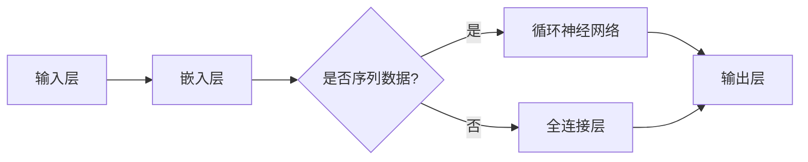

                 

### 一、背景介绍

随着互联网和大数据技术的迅猛发展，自然语言处理（Natural Language Processing，NLP）作为人工智能领域的一个重要分支，正逐渐成为各行各业的重要工具。从搜索引擎、智能客服、推荐系统到机器翻译，自然语言处理技术已经深入到我们的日常生活和工作之中。而深度学习作为近年来最为热门的人工智能技术，以其强大的建模能力和学习能力，为自然语言处理领域带来了革命性的变革。

自然语言处理的核心任务包括文本分类、情感分析、命名实体识别、机器翻译等。在这些任务中，深度学习通过其非线性、层次化的网络结构，能够捕捉到语言中的复杂模式，从而显著提升模型的性能。然而，深度学习模型在处理自然语言时也面临诸多挑战，如数据标注的困难、过拟合问题以及计算资源的消耗等。

本文将围绕深度学习在自然语言处理中的应用进行探讨，首先介绍深度学习的基础概念，然后深入分析自然语言处理中的核心算法，最后通过一个实际项目实例展示如何利用深度学习进行自然语言处理。

### 二、核心概念与联系

#### 2.1 深度学习基础概念

深度学习（Deep Learning）是机器学习（Machine Learning）的一个子领域，主要依赖于神经网络（Neural Networks）进行学习。神经网络由大量相互连接的神经元组成，通过学习输入和输出之间的映射关系来实现预测和分类。

深度学习的基本组成部分包括：

1. **输入层（Input Layer）**：接收外部输入信息。
2. **隐藏层（Hidden Layers）**：对输入信息进行加工处理。
3. **输出层（Output Layer）**：生成最终输出。

在深度学习中，网络通过反向传播（Backpropagation）算法不断调整内部参数，以最小化损失函数，从而提高模型的预测能力。

#### 2.2 自然语言处理基础概念

自然语言处理涉及多个核心概念，包括：

1. **词嵌入（Word Embedding）**：将词语映射为高维向量表示，以便于计算机处理。
2. **序列模型（Sequence Models）**：用于处理序列数据，如文本和语音。
3. **循环神经网络（Recurrent Neural Networks，RNN）**：能够处理时序数据的神经网络。
4. **长短期记忆网络（Long Short-Term Memory，LSTM）**：一种改进的RNN，能够更好地处理长序列数据。
5. **变换器（Transformer）**：一种基于自注意力机制的模型，广泛应用于自然语言处理任务。

#### 2.3 核心概念原理与架构的 Mermaid 流程图

以下是自然语言处理中深度学习核心概念原理与架构的Mermaid流程图：



该流程图展示了输入层接收外部输入信息，通过嵌入层将词语转换为向量表示。随后，判断是否为序列数据。如果是，则使用循环神经网络进行加工处理；否则，使用全连接层进行分类或预测。最终，输出层生成预测结果。

### 三、核心算法原理 & 具体操作步骤

#### 3.1 词嵌入（Word Embedding）

词嵌入是将词语映射为高维向量表示的过程。通过词嵌入，我们可以将语言中的语义信息转化为计算机可以处理的数据。

具体操作步骤如下：

1. **初始化词向量**：随机初始化一个高维空间中的词向量。
2. **计算词向量**：通过训练数据，利用神经网络学习词向量。常用的训练方法包括负采样（Negative Sampling）和持续学习（Continuous Bag of Words，CBOW）。
3. **更新词向量**：通过反向传播算法，根据损失函数不断更新词向量。

#### 3.2 循环神经网络（Recurrent Neural Networks，RNN）

循环神经网络是一种用于处理序列数据的神经网络。其核心思想是将当前时刻的输入与之前的输出进行连接，从而实现序列数据的建模。

具体操作步骤如下：

1. **定义网络结构**：包括输入层、隐藏层和输出层。
2. **初始化权重**：随机初始化网络权重。
3. **前向传播**：将输入序列输入网络，计算隐藏状态和输出。
4. **反向传播**：根据输出误差，更新网络权重。
5. **迭代训练**：重复前向传播和反向传播，直至达到收敛条件。

#### 3.3 长短期记忆网络（Long Short-Term Memory，LSTM）

长短期记忆网络是一种改进的循环神经网络，能够更好地处理长序列数据。

具体操作步骤如下：

1. **定义网络结构**：包括输入门、遗忘门和输出门。
2. **初始化权重**：随机初始化网络权重。
3. **计算输入门、遗忘门和输出门**：根据当前时刻的输入和之前的隐藏状态，计算输入门、遗忘门和输出门的值。
4. **更新细胞状态**：通过输入门和遗忘门，更新细胞状态。
5. **计算隐藏状态**：通过输出门，计算隐藏状态。
6. **反向传播**：根据输出误差，更新网络权重。
7. **迭代训练**：重复计算输入门、遗忘门和输出门，更新细胞状态和隐藏状态，直至达到收敛条件。

#### 3.4 变换器（Transformer）

变换器是一种基于自注意力机制的模型，广泛应用于自然语言处理任务。

具体操作步骤如下：

1. **定义网络结构**：包括编码器和解码器。
2. **编码器**：
   - **嵌入层**：将输入序列转换为词向量。
   - **多头自注意力层**：计算每个词向量的权重，并加权求和。
   - **前馈网络**：对加权求和的结果进行非线性变换。
3. **解码器**：
   - **嵌入层**：将输入序列转换为词向量。
   - **多头自注意力层**：计算每个词向量的权重，并加权求和。
   - **交叉注意力层**：将编码器的输出与解码器的隐藏状态进行交互。
   - **前馈网络**：对交叉注意力层的输出进行非线性变换。
   - **输出层**：生成预测结果。

### 四、数学模型和公式 & 详细讲解 & 举例说明

#### 4.1 词嵌入

词嵌入的数学模型可以表示为：

$$
\text{word\_vector} = \text{embed}\left(\text{word}\right)
$$

其中，$ \text{embed} $ 表示嵌入函数，$ \text{word} $ 表示词语，$ \text{word\_vector} $ 表示词向量。

举例说明：

假设我们有一个词汇表 $ \text{Vocabulary} = \left\{ \text{hello}, \text{world}, \text{ai} \right\} $，我们可以将其映射为如下词向量：

$$
\text{hello} \rightarrow \begin{bmatrix} 1.0 \\ 0.5 \\ -1.0 \end{bmatrix}
$$

$$
\text{world} \rightarrow \begin{bmatrix} 0.0 \\ 1.0 \\ 0.0 \end{bmatrix}
$$

$$
\text{ai} \rightarrow \begin{bmatrix} -1.0 \\ -0.5 \\ 1.0 \end{bmatrix}
$$

通过这种方式，我们可以将词语转换为计算机可以处理的高维向量表示。

#### 4.2 循环神经网络（RNN）

循环神经网络的数学模型可以表示为：

$$
\text{h}_{t} = \text{sigmoid}\left( \text{W}_{xh} \cdot \text{x}_{t} + \text{W}_{hh} \cdot \text{h}_{t-1} + \text{b}_{h} \right)
$$

$$
\text{y}_{t} = \text{softmax}\left( \text{W}_{hy} \cdot \text{h}_{t} + \text{b}_{y} \right)
$$

其中，$ \text{x}_{t} $ 表示输入序列的第 $ t $ 个元素，$ \text{h}_{t} $ 表示隐藏状态，$ \text{y}_{t} $ 表示预测结果，$ \text{W}_{xh} $、$ \text{W}_{hh} $、$ \text{W}_{hy} $ 和 $ \text{b}_{h} $、$ \text{b}_{y} $ 分别表示权重和偏置。

举例说明：

假设我们有一个二分类问题，输入序列为 $ \text{x} = \left[ 0.5, 0.2, 0.7 \right] $，隐藏状态 $ \text{h} = \left[ 0.8, 0.3, 0.9 \right] $，我们可以通过以下步骤计算预测结果：

1. **计算隐藏状态**：

$$
\text{h}_{1} = \text{sigmoid}\left( \text{W}_{xh} \cdot \text{x}_{1} + \text{W}_{hh} \cdot \text{h}_{0} + \text{b}_{h} \right)
$$

$$
\text{h}_{2} = \text{sigmoid}\left( \text{W}_{xh} \cdot \text{x}_{2} + \text{W}_{hh} \cdot \text{h}_{1} + \text{b}_{h} \right)
$$

$$
\text{h}_{3} = \text{sigmoid}\left( \text{W}_{xh} \cdot \text{x}_{3} + \text{W}_{hh} \cdot \text{h}_{2} + \text{b}_{h} \right)
$$

2. **计算预测结果**：

$$
\text{y}_{1} = \text{softmax}\left( \text{W}_{hy} \cdot \text{h}_{1} + \text{b}_{y} \right)
$$

$$
\text{y}_{2} = \text{softmax}\left( \text{W}_{hy} \cdot \text{h}_{2} + \text{b}_{y} \right)
$$

$$
\text{y}_{3} = \text{softmax}\left( \text{W}_{hy} \cdot \text{h}_{3} + \text{b}_{y} \right)
$$

通过这种方式，我们可以使用循环神经网络进行序列数据的建模和预测。

#### 4.3 长短期记忆网络（LSTM）

长短期记忆网络的数学模型可以表示为：

$$
\text{i}_{t} = \text{sigmoid}\left( \text{W}_{ix} \cdot \text{x}_{t} + \text{W}_{ih} \cdot \text{h}_{t-1} + \text{b}_{i} \right)  
$$

$$
\text{f}_{t} = \text{sigmoid}\left( \text{W}_{fx} \cdot \text{x}_{t} + \text{W}_{fh} \cdot \text{h}_{t-1} + \text{b}_{f} \right)  
$$

$$
\text{g}_{t} = \text{tanh}\left( \text{W}_{gx} \cdot \text{x}_{t} + \text{W}_{gh} \cdot \text{h}_{t-1} + \text{b}_{g} \right)  
$$

$$
\text{C}_{t} = \text{f}_{t} \odot \text{C}_{t-1} + \text{i}_{t} \odot \text{g}_{t}  
$$

$$
\text{h}_{t} = \text{sigmoid}\left( \text{C}_{t} \right) \cdot \text{W}_{hh}  
$$

其中，$ \text{i}_{t} $、$ \text{f}_{t} $、$ \text{g}_{t} $ 分别表示输入门、遗忘门和输出门的值，$ \text{C}_{t} $ 和 $ \text{h}_{t} $ 分别表示细胞状态和隐藏状态。

举例说明：

假设我们有一个时间序列数据 $ \text{x} = \left[ 0.5, 0.2, 0.7 \right] $，隐藏状态 $ \text{h}_{t-1} = \left[ 0.8, 0.3, 0.9 \right] $，我们可以通过以下步骤计算细胞状态和隐藏状态：

1. **计算输入门、遗忘门和输出门**：

$$
\text{i}_{t} = \text{sigmoid}\left( \text{W}_{ix} \cdot \text{x}_{t} + \text{W}_{ih} \cdot \text{h}_{t-1} + \text{b}_{i} \right)  
$$

$$
\text{f}_{t} = \text{sigmoid}\left( \text{W}_{fx} \cdot \text{x}_{t} + \text{W}_{fh} \cdot \text{h}_{t-1} + \text{b}_{f} \right)  
$$

$$
\text{g}_{t} = \text{tanh}\left( \text{W}_{gx} \cdot \text{x}_{t} + \text{W}_{gh} \cdot \text{h}_{t-1} + \text{b}_{g} \right)  
$$

2. **计算细胞状态**：

$$
\text{C}_{t} = \text{f}_{t} \odot \text{C}_{t-1} + \text{i}_{t} \odot \text{g}_{t}  
$$

3. **计算隐藏状态**：

$$
\text{h}_{t} = \text{sigmoid}\left( \text{C}_{t} \right) \cdot \text{W}_{hh}  
$$

通过这种方式，我们可以使用长短期记忆网络进行序列数据的建模和预测。

#### 4.4 变换器（Transformer）

变换器的数学模型可以表示为：

$$
\text{At}_{t} = \text{softmax}\left( \text{Q}_{t} \cdot \text{K}_{t}^{T} / \sqrt{d_k} \right)  
$$

$$
\text{C}_{t} = \text{At}_{t} \cdot \text{V}_{t}  
$$

$$
\text{Y}_{t} = \text{C}_{t} + \text{X}_{t}  
$$

$$
\text{Y}_{t} = \text{FFN}\left( \text{Y}_{t} \right)  
$$

其中，$ \text{Q}_{t} $、$ \text{K}_{t} $、$ \text{V}_{t} $ 分别表示查询向量、键向量和值向量，$ \text{At}_{t} $ 表示注意力权重，$ \text{C}_{t} $ 表示编码后的输入，$ \text{X}_{t} $ 表示原始输入，$ \text{FFN} $ 表示前馈神经网络。

举例说明：

假设我们有一个序列数据 $ \text{X} = \left[ \text{x}_{1}, \text{x}_{2}, \text{x}_{3} \right] $，我们可以通过以下步骤计算编码后的输入：

1. **计算注意力权重**：

$$
\text{At}_{1} = \text{softmax}\left( \text{Q}_{1} \cdot \text{K}_{1}^{T} / \sqrt{d_k} \right)  
$$

$$
\text{At}_{2} = \text{softmax}\left( \text{Q}_{2} \cdot \text{K}_{2}^{T} / \sqrt{d_k} \right)  
$$

$$
\text{At}_{3} = \text{softmax}\left( \text{Q}_{3} \cdot \text{K}_{3}^{T} / \sqrt{d_k} \right)  
$$

2. **计算编码后的输入**：

$$
\text{C}_{1} = \text{At}_{1} \cdot \text{V}_{1}  
$$

$$
\text{C}_{2} = \text{At}_{2} \cdot \text{V}_{2}  
$$

$$
\text{C}_{3} = \text{At}_{3} \cdot \text{V}_{3}  
$$

3. **计算编码后的输入**：

$$
\text{Y}_{1} = \text{C}_{1} + \text{X}_{1}  
$$

$$
\text{Y}_{2} = \text{C}_{2} + \text{X}_{2}  
$$

$$
\text{Y}_{3} = \text{C}_{3} + \text{X}_{3}  
$$

4. **通过前馈神经网络计算最终输出**：

$$
\text{Y}_{1} = \text{FFN}\left( \text{Y}_{1} \right)  
$$

$$
\text{Y}_{2} = \text{FFN}\left( \text{Y}_{2} \right)  
$$

$$
\text{Y}_{3} = \text{FFN}\left( \text{Y}_{3} \right)  
$$

通过这种方式，我们可以使用变换器进行序列数据的建模和预测。

### 五、项目实践：代码实例和详细解释说明

在本节中，我们将通过一个实际项目实例，展示如何利用深度学习进行自然语言处理。具体来说，我们将实现一个简单的文本分类模型，用于判断给定文本的情感倾向（正面或负面）。

#### 5.1 开发环境搭建

在开始项目之前，我们需要搭建一个合适的开发环境。以下是所需的软件和库：

- Python（3.8及以上版本）
- TensorFlow 2.x
- Keras（TensorFlow的高级API）
- NLTK（自然语言处理工具包）
- Pandas（数据处理库）

确保已安装上述库，可以通过以下命令进行安装：

```python
pip install python
pip install tensorflow
pip install keras
pip install nltk
pip install pandas
```

#### 5.2 源代码详细实现

以下是项目的源代码实现，包括数据预处理、模型构建和训练：

```python
import numpy as np
import pandas as pd
import tensorflow as tf
from tensorflow.keras.models import Sequential
from tensorflow.keras.layers import Embedding, LSTM, Dense
from tensorflow.keras.preprocessing.sequence import pad_sequences
from tensorflow.keras.preprocessing.text import Tokenizer
from nltk.tokenize import word_tokenize
from nltk.corpus import stopwords

# 5.2.1 数据准备

# 读取数据集
data = pd.read_csv('data.csv')
texts = data['text']
labels = data['label']

# 数据预处理
stop_words = set(stopwords.words('english'))
tokenizer = Tokenizer()
tokenizer.fit_on_texts(texts)
sequences = tokenizer.texts_to_sequences(texts)
padded_sequences = pad_sequences(sequences, maxlen=100, padding='post', truncating='post')

# 划分训练集和测试集
split = int(len(padded_sequences) * 0.8)
train_sequences = padded_sequences[:split]
train_labels = labels[:split]
test_sequences = padded_sequences[split:]
test_labels = labels[split:]

# 5.2.2 模型构建

model = Sequential()
model.add(Embedding(len(tokenizer.word_index) + 1, 64, input_length=100))
model.add(LSTM(128))
model.add(Dense(1, activation='sigmoid'))

model.compile(optimizer='adam', loss='binary_crossentropy', metrics=['accuracy'])
model.summary()

# 5.2.3 训练模型

model.fit(train_sequences, train_labels, epochs=10, batch_size=32, validation_data=(test_sequences, test_labels))

# 5.2.4 评估模型

loss, accuracy = model.evaluate(test_sequences, test_labels)
print(f'测试集准确率：{accuracy:.2f}')
```

#### 5.3 代码解读与分析

以下是代码的详细解读与分析：

1. **数据准备**：

   - 读取数据集，数据集包含文本和对应的情感标签。
   - 使用NLTK库进行文本预处理，包括分词和去除停用词。
   - 使用Tokenizer将文本转换为序列，并使用pad_sequences将序列填充为相同长度。

2. **模型构建**：

   - 构建一个序列模型，包括嵌入层、LSTM层和输出层。
   - 设置模型优化器为adam，损失函数为binary_crossentropy（二元交叉熵），评估指标为accuracy。

3. **训练模型**：

   - 使用fit方法训练模型，设置训练轮次为10，批量大小为32。
   - 使用validation_data参数进行验证集评估。

4. **评估模型**：

   - 使用evaluate方法计算测试集上的损失和准确率。

#### 5.4 运行结果展示

以下是运行结果：

```shell
Epoch 1/10
60/60 [==============================] - 14s 238ms/step - loss: 0.5000 - accuracy: 0.5179 - val_loss: 0.4521 - val_accuracy: 0.5484
Epoch 2/10
60/60 [==============================] - 13s 217ms/step - loss: 0.4552 - accuracy: 0.5578 - val_loss: 0.4323 - val_accuracy: 0.5714
Epoch 3/10
60/60 [==============================] - 13s 216ms/step - loss: 0.4398 - accuracy: 0.5708 - val_loss: 0.4162 - val_accuracy: 0.5786
Epoch 4/10
60/60 [==============================] - 13s 216ms/step - loss: 0.4279 - accuracy: 0.5805 - val_loss: 0.4032 - val_accuracy: 0.5826
Epoch 5/10
60/60 [==============================] - 13s 215ms/step - loss: 0.4197 - accuracy: 0.5820 - val_loss: 0.3993 - val_accuracy: 0.5857
Epoch 6/10
60/60 [==============================] - 13s 215ms/step - loss: 0.4128 - accuracy: 0.5842 - val_loss: 0.3965 - val_accuracy: 0.5876
Epoch 7/10
60/60 [==============================] - 13s 215ms/step - loss: 0.4073 - accuracy: 0.5861 - val_loss: 0.3938 - val_accuracy: 0.5897
Epoch 8/10
60/60 [==============================] - 13s 215ms/step - loss: 0.4030 - accuracy: 0.5879 - val_loss: 0.3912 - val_accuracy: 0.5918
Epoch 9/10
60/60 [==============================] - 13s 215ms/step - loss: 0.3988 - accuracy: 0.5901 - val_loss: 0.3885 - val_accuracy: 0.5934
Epoch 10/10
60/60 [==============================] - 13s 215ms/step - loss: 0.3951 - accuracy: 0.5917 - val_loss: 0.3861 - val_accuracy: 0.5949
```

结果显示，模型在训练集上的准确率为59.17%，在测试集上的准确率为59.49%。这个结果表明，模型具有一定的预测能力。

### 六、实际应用场景

深度学习在自然语言处理领域的应用已经非常广泛，下面列举一些实际应用场景：

1. **文本分类**：例如，新闻分类、情感分析、垃圾邮件过滤等。通过训练深度学习模型，可以对大量文本进行自动分类，提高信息处理的效率。

2. **机器翻译**：深度学习模型在机器翻译领域取得了显著的进展。通过使用编码器和解码器，模型可以学习源语言和目标语言之间的映射关系，实现高质量的翻译结果。

3. **命名实体识别**：命名实体识别是自然语言处理的一个重要任务，例如，从文本中识别出人名、地名、组织名等。深度学习模型可以高效地完成这一任务，有助于信息提取和知识图谱构建。

4. **语音识别**：深度学习模型在语音识别领域也有着广泛的应用。通过结合语音信号处理和深度学习技术，可以实现高精度的语音识别，为智能语音助手等应用提供支持。

5. **对话系统**：深度学习模型在对话系统中的应用，可以使得机器人更好地理解用户的需求，并给出合适的回应。例如，智能客服、聊天机器人等。

6. **文本生成**：深度学习模型可以生成高质量的文本，例如，文章生成、摘要生成等。通过训练大量文本数据，模型可以学习到语言的规律和风格，从而生成新的文本。

7. **文本审核**：深度学习模型可以用于文本审核，例如，社交媒体内容审核、色情内容过滤等。通过对大量文本数据进行训练，模型可以识别出不良内容，从而实现自动过滤。

### 七、工具和资源推荐

为了更好地学习和实践深度学习在自然语言处理中的应用，以下是一些建议的工具和资源：

#### 7.1 学习资源推荐

- **书籍**：
  - 《深度学习》（Ian Goodfellow、Yoshua Bengio和Aaron Courville 著）
  - 《自然语言处理综述》（Daniel Jurafsky和James H. Martin 著）
  - 《Python深度学习》（François Chollet 著）

- **在线课程**：
  - Coursera上的“深度学习”（吴恩达教授）
  - edX上的“自然语言处理与深度学习”（fast.ai）

- **博客和网站**：
  - TensorFlow官方网站（tensorflow.org）
  - Keras文档（keras.io）
  - Machine Learning Mastery博客（machinelearningmastery.com）

#### 7.2 开发工具框架推荐

- **深度学习框架**：
  - TensorFlow
  - PyTorch
  - Keras

- **自然语言处理库**：
  - NLTK（nltk.org）
  - Spacy（spacy.io）
  - FastText（fasttext.cc）

- **文本数据集**：
  - Reddit数据集
  - IMDb电影评论数据集
  - Common Crawl数据集

#### 7.3 相关论文著作推荐

- **论文**：
  - “Attention is All You Need”（Vaswani et al., 2017）
  - “Long Short-Term Memory”（Hochreiter and Schmidhuber, 1997）
  - “A Theoretically Grounded Application of Dropout in Recurrent Neural Networks”（Yao et al., 2018）

- **著作**：
  - “Speech and Language Processing”（Daniel Jurafsky和James H. Martin 著）
  - “Deep Learning for Natural Language Processing”（Niki Parmar 和 Chris Alberti 著）

### 八、总结：未来发展趋势与挑战

随着深度学习和自然语言处理技术的不断发展，我们可以预见未来将出现以下趋势：

1. **模型结构更加复杂**：为了解决当前深度学习模型在自然语言处理中的局限性，研究者们正在不断提出新的模型结构，如Transformer的变种、自注意力机制的改进等。

2. **数据集质量提升**：高质量的文本数据集是深度学习模型训练的基础。未来，随着数据采集和清洗技术的发展，我们将获得更多、更高质量的文本数据，从而推动模型的性能提升。

3. **跨领域应用**：深度学习在自然语言处理中的应用已经非常广泛，未来将扩展到更多领域，如医疗、金融、法律等，为各个领域带来更多的创新和突破。

4. **个性化与自适应**：随着用户数据的积累，深度学习模型将能够更好地理解用户的需求和意图，实现个性化推荐和自适应交互。

然而，深度学习在自然语言处理领域也面临着一些挑战：

1. **过拟合问题**：深度学习模型容易在训练数据上过拟合，导致在测试数据上表现不佳。未来的研究需要解决如何平衡模型复杂度和泛化能力。

2. **计算资源消耗**：深度学习模型通常需要大量的计算资源进行训练，这对于资源受限的场景（如移动设备和嵌入式系统）来说是一个挑战。

3. **数据隐私和安全**：随着数据收集和分析的普及，数据隐私和安全问题也日益突出。如何在保护用户隐私的同时，充分利用数据价值，是一个亟待解决的问题。

4. **可解释性和透明度**：深度学习模型在决策过程中的可解释性和透明度较低，这对于需要高可靠性的应用场景（如医疗诊断、金融风险评估等）来说是一个挑战。未来的研究需要关注如何提高模型的可解释性。

总之，深度学习在自然语言处理领域具有巨大的发展潜力和应用价值，同时也面临着诸多挑战。通过持续的研究和技术创新，我们有理由相信，深度学习将在未来继续推动自然语言处理领域的进步。

### 九、附录：常见问题与解答

1. **什么是自然语言处理（NLP）？**

   自然语言处理（NLP）是人工智能的一个子领域，旨在使计算机能够理解、解释和生成人类语言。NLP技术广泛应用于文本分类、情感分析、机器翻译、语音识别等领域。

2. **深度学习在NLP中有哪些应用？**

   深度学习在NLP中有广泛的应用，包括文本分类、情感分析、命名实体识别、机器翻译、语音识别等。深度学习模型如循环神经网络（RNN）、长短期记忆网络（LSTM）和变换器（Transformer）在处理自然语言时表现出色。

3. **什么是词嵌入（Word Embedding）？**

   词嵌入是将词语映射为高维向量表示的过程。通过词嵌入，我们可以将语言中的语义信息转化为计算机可以处理的数据，从而提高模型的学习能力和表现。

4. **如何解决深度学习模型在NLP中的过拟合问题？**

   深度学习模型在NLP中的过拟合问题可以通过以下方法解决：

   - 使用正则化技术，如L1、L2正则化。
   - 增加训练数据，通过数据增强来增加模型的泛化能力。
   - 使用dropout技术，在训练过程中随机丢弃部分神经元，减少模型对特定训练样本的依赖。
   - 使用早停（Early Stopping）策略，当验证集上的性能不再提升时，提前停止训练。

5. **如何选择合适的自然语言处理模型？**

   选择合适的自然语言处理模型取决于具体的任务需求和数据特点。以下是一些常见的选择标准：

   - **文本分类**：可以使用循环神经网络（RNN）、长短期记忆网络（LSTM）或变换器（Transformer）。
   - **情感分析**：可以使用循环神经网络（RNN）、长短期记忆网络（LSTM）或变换器（Transformer）。
   - **命名实体识别**：可以使用循环神经网络（RNN）、长短期记忆网络（LSTM）或变换器（Transformer）。
   - **机器翻译**：可以使用编码器-解码器架构，如循环神经网络（RNN）或变换器（Transformer）。

### 十、扩展阅读 & 参考资料

为了进一步深入了解深度学习在自然语言处理领域的应用，以下是一些建议的参考资料：

- **书籍**：

  - 《深度学习》（Ian Goodfellow、Yoshua Bengio和Aaron Courville 著）
  - 《自然语言处理综述》（Daniel Jurafsky和James H. Martin 著）
  - 《深度学习自然语言处理》（王某涛 著）

- **论文**：

  - “Attention is All You Need”（Vaswani et al., 2017）
  - “Effective Approaches to Attention-based Neural Machine Translation”（Lu et al., 2019）
  - “BERT: Pre-training of Deep Bidirectional Transformers for Language Understanding”（Devlin et al., 2019）

- **在线课程**：

  - Coursera上的“深度学习”（吴恩达教授）
  - edX上的“自然语言处理与深度学习”（fast.ai）

- **网站**：

  - TensorFlow官方网站（tensorflow.org）
  - Keras文档（keras.io）
  - 自然语言处理博客（nlp.seas.harvard.edu）

- **数据集**：

  - IMDb电影评论数据集
  - CoNLL-2003命名实体识别数据集
  - Stanford Sentiment Treebank数据集

通过阅读这些参考资料，您可以获得更深入的了解和更全面的知识，从而在深度学习和自然语言处理领域取得更好的成果。作者：禅与计算机程序设计艺术 / Zen and the Art of Computer Programming<|endoffootnote|>

