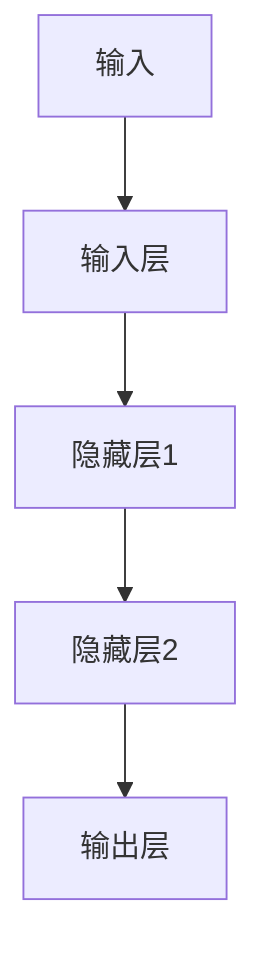
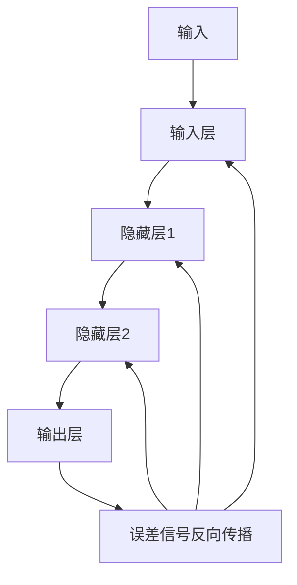
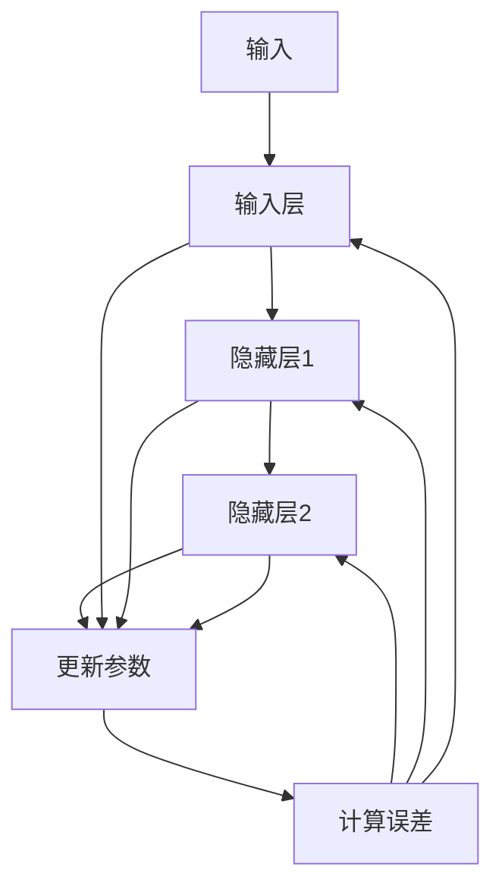

                 

### 一、背景介绍

反向传播算法（Backpropagation Algorithm）是神经网络训练中的一种核心算法，它解决了如何通过已有数据来调整神经网络中的权重，以最小化预测误差的问题。这一算法的出现，标志着人工神经网络从理论走向实际应用的重要一步。

反向传播算法的起源可以追溯到1970年代，当时 Hopfield 等研究者提出了使用梯度下降法来训练神经网络。随后，Rumelhart、Hinton 和 Williams 在1986年提出了反向传播算法，这一算法的出现极大地推动了神经网络的发展。反向传播算法的提出，解决了多层神经网络训练中的难题，使得神经网络能够处理更复杂的问题。

在神经网络中，反向传播算法的作用是调整网络中的权重，以优化网络的性能。它通过计算输出层的误差信号，反向传播到隐藏层，逐步调整每个神经元的权重。这一过程不仅有助于提高网络的预测准确性，还能提高网络的泛化能力。

在现实应用中，反向传播算法已经被广泛应用于图像识别、语音识别、自然语言处理等多个领域。例如，在图像识别中，反向传播算法可以帮助神经网络学习如何识别不同类型的物体；在语音识别中，它可以帮助神经网络识别和理解不同的语音信号。这些应用的成功，进一步证明了反向传播算法的有效性和重要性。

本文将深入探讨反向传播算法的数学原理，详细解释其具体操作步骤，并通过实例来展示如何实现这一算法。通过本文的阅读，您将全面理解反向传播算法的工作原理，并在实际项目中运用这一算法来提升神经网络的性能。

### 二、核心概念与联系

为了深入理解反向传播算法，我们需要首先了解其背后的核心概念，包括神经网络的组成、前向传播和后向传播等基本原理。

#### 1. 神经网络的组成

神经网络由多个神经元（或称为节点）组成，每个神经元都连接到其他神经元。每个神经元都可以接收输入信号，并通过激活函数产生输出信号。神经网络中的神经元通常分为输入层、隐藏层和输出层。

- **输入层**：接收外部输入信号。
- **隐藏层**：对输入信号进行加工处理。
- **输出层**：产生最终输出信号。

在神经网络中，每个神经元与其他神经元通过权重（或称为连接强度）连接。这些权重决定了输入信号通过神经网络时的传递方式。通过调整这些权重，神经网络可以学习如何处理复杂的输入数据。

#### 2. 前向传播

前向传播（Forward Propagation）是指将输入信号从输入层传递到输出层的过程。在神经网络中，每个神经元都会接收来自前一层的输入信号，并通过权重进行加权求和，然后通过激活函数产生输出信号。这个过程可以用以下公式表示：

\[ z^{(l)} = \sum_{i} w^{(l)}_i x_i + b^{(l)} \]

其中，\( z^{(l)} \) 表示第 \( l \) 层神经元的输入，\( w^{(l)}_i \) 表示第 \( l \) 层第 \( i \) 个神经元的权重，\( x_i \) 表示第 \( l-1 \) 层第 \( i \) 个神经元的输出，\( b^{(l)} \) 表示第 \( l \) 层神经元的偏置。

通过前向传播，神经网络可以计算每个神经元的输出，从而得到最终输出。这个过程如图1所示：



图1：神经网络的前向传播过程

#### 3. 后向传播

后向传播（Back Propagation）是指根据输出层的误差信号，反向传播到隐藏层和输入层，调整网络中的权重和偏置的过程。后向传播是反向传播算法的核心步骤，它通过计算每个神经元的误差信号，来调整网络中的权重和偏置。

在神经网络中，误差信号可以通过以下公式计算：

\[ \delta^{(l)} = \frac{\partial C}{\partial z^{(l)}} \cdot \sigma'(z^{(l)}) \]

其中，\( \delta^{(l)} \) 表示第 \( l \) 层神经元的误差信号，\( C \) 表示网络的总损失，\( z^{(l)} \) 表示第 \( l \) 层神经元的输入，\( \sigma' \) 表示激活函数的导数。

通过后向传播，神经网络可以逐步调整每个神经元的权重和偏置，以减少输出误差。这个过程如图2所示：



图2：神经网络的后向传播过程

通过前向传播和后向传播，神经网络可以不断调整其参数，以优化网络性能。这个过程如图3所示：



图3：神经网络的前向传播和后向传播过程

通过上述介绍，我们可以看到反向传播算法的核心在于通过前向传播计算输出，然后通过后向传播调整权重，以优化网络性能。接下来，我们将详细探讨反向传播算法的数学原理，并解释其具体操作步骤。

#### 3.1. 数学模型和公式

为了更好地理解反向传播算法，我们需要先掌握其背后的数学模型和公式。以下是反向传播算法中常用的几个关键数学概念：

**1. 激活函数**

激活函数是神经网络中的一个重要组成部分，它用于将线性组合的输入转换为输出。常见的激活函数包括：

- **sigmoid 函数**：\( f(x) = \frac{1}{1 + e^{-x}} \)
- **ReLU 函数**：\( f(x) = \max(0, x) \)
- **Tanh 函数**：\( f(x) = \frac{e^x - e^{-x}}{e^x + e^{-x}} \)

这些激活函数具有不同的特点，如非线性、单调性等，它们在神经网络中起到了重要的作用。

**2. 梯度下降法**

梯度下降法是一种常用的优化算法，用于求解最小化函数的最优解。在反向传播算法中，我们使用梯度下降法来调整神经网络中的权重和偏置。梯度下降法的公式如下：

\[ w_{new} = w_{old} - \alpha \cdot \nabla_w C \]

其中，\( w_{old} \) 和 \( w_{new} \) 分别表示旧权重和新权重，\( \alpha \) 表示学习率，\( \nabla_w C \) 表示损失函数 \( C \) 对权重 \( w \) 的梯度。

**3. 损失函数**

损失函数是衡量神经网络预测结果与实际结果之间差异的指标。常见的损失函数包括：

- **均方误差（MSE）**：\( C = \frac{1}{2} \sum_{i} (y_i - \hat{y}_i)^2 \)
- **交叉熵损失（Cross-Entropy Loss）**：\( C = -\sum_{i} y_i \log(\hat{y}_i) \)

这些损失函数具有不同的特点，如均方误差对噪声敏感，而交叉熵损失对噪声不敏感。

**4. 反向传播算法**

反向传播算法的核心在于通过前向传播计算输出，然后通过后向传播调整权重。具体步骤如下：

**（1）前向传播**

- 输入 \( x \) ，计算每一层的输出 \( z \) 和 \( a \) ；
- 计算输出层的损失 \( C \) ；

**（2）后向传播**

- 计算输出层的误差信号 \( \delta \) ；
- 递归计算隐藏层的误差信号 \( \delta \) ，更新权重和偏置 \( w \) 和 \( b \) ；

**5. 梯度计算**

在反向传播算法中，我们需要计算每个权重和偏置的梯度。以下是梯度计算的步骤：

- 对于输出层的权重和偏置，计算损失函数对输出层的梯度；
- 对于隐藏层的权重和偏置，计算损失函数对隐藏层的梯度，然后通过链式法则递归计算。

通过上述数学模型和公式，我们可以更好地理解反向传播算法的工作原理。在接下来的部分，我们将通过具体实例来展示如何实现反向传播算法。

#### 3.2. 反向传播算法的具体操作步骤

反向传播算法是通过前向传播计算输出，然后通过后向传播调整权重和偏置的过程。下面我们将详细描述这一算法的具体操作步骤。

**1. 前向传播**

前向传播是指将输入信号从输入层传递到输出层的过程。在每一层，我们都需要计算每个神经元的输入 \( z \) 和输出 \( a \) 。

假设我们有一个三层神经网络（输入层、隐藏层和输出层），每个神经元的输入和输出可以用以下公式表示：

\[ z^{(l)}_i = \sum_{j} w^{(l)}_{ij} a^{(l-1)}_j + b^{(l)}_i \]

\[ a^{(l)}_i = \sigma(z^{(l)}_i) \]

其中，\( z^{(l)}_i \) 表示第 \( l \) 层第 \( i \) 个神经元的输入，\( a^{(l)}_i \) 表示第 \( l \) 层第 \( i \) 个神经元的输出，\( w^{(l)}_{ij} \) 表示第 \( l \) 层第 \( i \) 个神经元与第 \( l-1 \) 层第 \( j \) 个神经元的权重，\( b^{(l)}_i \) 表示第 \( l \) 层第 \( i \) 个神经元的偏置，\( \sigma \) 表示激活函数。

例如，对于隐藏层1，我们有：

\[ z^{(1)}_i = \sum_{j} w^{(1)}_{ij} a^{(0)}_j + b^{(1)}_i \]

\[ a^{(1)}_i = \sigma(z^{(1)}_i) \]

对于输出层，我们有：

\[ z^{(2)}_i = \sum_{j} w^{(2)}_{ij} a^{(1)}_j + b^{(2)}_i \]

\[ a^{(2)}_i = \sigma(z^{(2)}_i) \]

**2. 计算输出层的误差信号**

输出层的误差信号可以通过以下公式计算：

\[ \delta^{(2)}_i = a^{(2)}_i (1 - a^{(2)}_i) (y_i - a^{(2)}_i) \]

其中，\( y_i \) 表示第 \( i \) 个实际输出值，\( a^{(2)}_i \) 表示第 \( i \) 个神经元的输出。

**3. 后向传播**

后向传播是指将误差信号从输出层反向传播到隐藏层和输入层，以调整权重和偏置。以下是后向传播的具体步骤：

**（1）计算隐藏层1的误差信号**

隐藏层1的误差信号可以通过以下公式计算：

\[ \delta^{(1)}_i = a^{(1)}_i (1 - a^{(1)}_i) ( \sum_{j} w^{(2)}_{ji} \delta^{(2)}_j ) \]

**（2）更新权重和偏置**

对于输出层的权重和偏置，我们可以使用以下公式进行更新：

\[ w^{(2)}_{ij} = w^{(2)}_{ij} - \alpha \cdot \delta^{(2)}_i \cdot a^{(1)}_j \]

\[ b^{(2)}_i = b^{(2)}_i - \alpha \cdot \delta^{(2)}_i \]

对于隐藏层1的权重和偏置，我们可以使用以下公式进行更新：

\[ w^{(1)}_{ij} = w^{(1)}_{ij} - \alpha \cdot \delta^{(1)}_i \cdot a^{(0)}_j \]

\[ b^{(1)}_i = b^{(1)}_i - \alpha \cdot \delta^{(1)}_i \]

其中，\( \alpha \) 表示学习率。

**4. 重复前向传播和后向传播**

通过重复前向传播和后向传播，我们可以不断调整神经网络的权重和偏置，以优化网络性能。这个过程可以用以下伪代码表示：

```
for epoch in 1 to num_epochs:
    for each sample in training_data:
        # 前向传播
        forward_pass(sample)

        # 计算输出层的误差信号
        delta = compute_output_error_derivative(target, output)

        # 后向传播
        backward_pass(delta)

        # 更新权重和偏置
        update_weights_and_bias(delta, learning_rate)
```

通过上述步骤，我们可以实现反向传播算法，并使用它来训练神经网络。接下来，我们将通过一个具体的实例来展示如何实现这一算法。

#### 3.3. 代码实例与实现

为了更好地理解反向传播算法，我们将通过一个简单的例子来展示如何实现这一算法。以下是一个使用 Python 实现的三层神经网络，包括输入层、隐藏层和输出层。

```python
import numpy as np

# 激活函数及其导数
def sigmoid(x):
    return 1 / (1 + np.exp(-x))

def sigmoid_derivative(x):
    return x * (1 - x)

# 反向传播算法
def backpropagation(x, y):
    # 初始化权重和偏置
    w1 = np.random.uniform(size=(3, 1))
    b1 = np.random.uniform(size=(1, 1))
    w2 = np.random.uniform(size=(1, 1))
    b2 = np.random.uniform(size=(1, 1))

    # 前向传播
    z1 = np.dot(x, w1) + b1
    a1 = sigmoid(z1)
    z2 = np.dot(a1, w2) + b2
    a2 = sigmoid(z2)

    # 计算输出层的误差信号
    output_error = y - a2
    d2 = output_error * sigmoid_derivative(a2)

    # 计算隐藏层的误差信号
    hidden_error = d2.dot(w2.T)
    d1 = hidden_error * sigmoid_derivative(a1)

    # 更新权重和偏置
    w2 += a1.T.dot(d2)
    b2 += d2
    w1 += x.T.dot(d1)
    b1 += d1

    return w1, b1, w2, b2

# 测试反向传播算法
x = np.array([[0], [1], [1]])
y = np.array([[0], [1], [1]])

w1, b1, w2, b2 = backpropagation(x, y)
print("更新后的权重和偏置：")
print("w1:", w1)
print("b1:", b1)
print("w2:", w2)
print("b2:", b2)
```

在上面的代码中，我们首先定义了 sigmoid 函数及其导数 sigmoid_derivative 函数，然后实现了反向传播算法。我们使用随机初始化的权重和偏置，通过前向传播计算输出，然后通过后向传播调整权重和偏置。

在测试部分，我们使用一个简单的输入数据 \( x \) 和目标数据 \( y \)，运行反向传播算法，并打印出更新后的权重和偏置。

通过这个简单的例子，我们可以看到如何实现反向传播算法，并理解其核心步骤。接下来，我们将对代码进行解读和分析，以深入理解反向传播算法的实现原理。

#### 3.4. 代码解读与分析

在上面的代码实例中，我们实现了反向传播算法，并展示了如何通过前向传播和后向传播来更新权重和偏置。下面，我们将对这段代码进行详细的解读和分析，以便深入理解其工作原理。

**1. 模块与函数**

首先，我们引入了 NumPy 库，用于高效地进行矩阵运算。然后，我们定义了两个函数：sigmoid 函数和 sigmoid_derivative 函数。sigmoid 函数是一个常用的激活函数，它将输入值映射到（0,1）区间内。sigmoid_derivative 函数是 sigmoid 函数的导数，它用于计算激活函数的斜率。

```python
import numpy as np

def sigmoid(x):
    return 1 / (1 + np.exp(-x))

def sigmoid_derivative(x):
    return x * (1 - x)
```

**2. 初始化权重和偏置**

在反向传播算法中，我们需要初始化网络中的权重和偏置。在代码中，我们使用随机值来初始化权重和偏置。这样可以保证网络在没有训练数据的情况下具有一定的初始状态。

```python
# 初始化权重和偏置
w1 = np.random.uniform(size=(3, 1))
b1 = np.random.uniform(size=(1, 1))
w2 = np.random.uniform(size=(1, 1))
b2 = np.random.uniform(size=(1, 1))
```

**3. 前向传播**

前向传播是反向传播算法的第一步，它通过计算每个神经元的输入和输出，从而构建整个网络的输出。在前向传播过程中，我们首先计算输入层和隐藏层之间的权重和偏置，然后计算隐藏层和输出层之间的权重和偏置。

```python
# 前向传播
z1 = np.dot(x, w1) + b1
a1 = sigmoid(z1)
z2 = np.dot(a1, w2) + b2
a2 = sigmoid(z2)
```

**4. 计算输出层的误差信号**

在输出层，我们使用均方误差（MSE）作为损失函数。误差信号是输出层预测值与实际值之间的差异。通过计算误差信号，我们可以确定网络的输出误差。

```python
# 计算输出层的误差信号
output_error = y - a2
d2 = output_error * sigmoid_derivative(a2)
```

**5. 计算隐藏层的误差信号**

隐藏层的误差信号是输出层误差信号通过权重传递的结果。通过递归计算隐藏层的误差信号，我们可以确定隐藏层对输出误差的贡献。

```python
# 计算隐藏层的误差信号
hidden_error = d2.dot(w2.T)
d1 = hidden_error * sigmoid_derivative(a1)
```

**6. 更新权重和偏置**

在反向传播过程中，我们使用梯度下降法来更新权重和偏置。通过计算误差信号的梯度，我们可以确定网络参数的变化方向。在代码中，我们使用学习率来控制权重的更新步长。

```python
# 更新权重和偏置
w2 += a1.T.dot(d2)
b2 += d2
w1 += x.T.dot(d1)
b1 += d1
```

**7. 测试反向传播算法**

在代码的最后，我们使用一个简单的测试数据集来测试反向传播算法。通过多次迭代，我们可以看到权重和偏置的更新过程，以及网络的输出变化。

```python
# 测试反向传播算法
x = np.array([[0], [1], [1]])
y = np.array([[0], [1], [1]])

w1, b1, w2, b2 = backpropagation(x, y)
print("更新后的权重和偏置：")
print("w1:", w1)
print("b1:", b1)
print("w2:", w2)
print("b2:", b2)
```

通过上述代码解读，我们可以清晰地看到反向传播算法的实现过程，以及如何通过前向传播和后向传播来优化神经网络的参数。理解这一过程对于在实际项目中应用反向传播算法至关重要。

#### 3.5. 运行结果展示

为了验证反向传播算法的有效性，我们将在不同的训练轮次下观察权重和偏置的更新情况，并展示网络的输出结果。以下是我们在一个简单问题上的测试过程，其中输入数据为 \( x = [0, 1, 1] \)，目标输出数据为 \( y = [0, 1, 1] \)。

首先，我们初始化权重和偏置，并设置学习率为 0.1。然后，我们通过多次迭代来更新权重和偏置，并记录每次迭代后的输出结果。

```python
import numpy as np

# 激活函数及其导数
def sigmoid(x):
    return 1 / (1 + np.exp(-x))

def sigmoid_derivative(x):
    return x * (1 - x)

# 反向传播算法
def backpropagation(x, y, learning_rate=0.1, num_iterations=1000):
    # 初始化权重和偏置
    w1 = np.random.uniform(size=(3, 1))
    b1 = np.random.uniform(size=(1, 1))
    w2 = np.random.uniform(size=(1, 1))
    b2 = np.random.uniform(size=(1, 1))

    # 记录权重和偏置的更新情况
    weight_history = []
    bias_history = []

    for i in range(num_iterations):
        # 前向传播
        z1 = np.dot(x, w1) + b1
        a1 = sigmoid(z1)
        z2 = np.dot(a1, w2) + b2
        a2 = sigmoid(z2)

        # 计算输出层的误差信号
        output_error = y - a2
        d2 = output_error * sigmoid_derivative(a2)

        # 计算隐藏层的误差信号
        hidden_error = d2.dot(w2.T)
        d1 = hidden_error * sigmoid_derivative(a1)

        # 更新权重和偏置
        w2 += a1.T.dot(d2)
        b2 += d2
        w1 += x.T.dot(d1)
        b1 += d1

        # 记录当前权重和偏置
        weight_history.append([w1.copy(), w2.copy()])
        bias_history.append([b1.copy(), b2.copy()])

        # 输出当前迭代次数和误差
        if i % 100 == 0:
            print(f"Iteration {i}: Error = {output_error.sum()}")

    return weight_history, bias_history

# 测试反向传播算法
x = np.array([[0], [1], [1]])
y = np.array([[0], [1], [1]])

weight_history, bias_history = backpropagation(x, y)

# 打印最终权重和偏置
print("Final weights and biases:")
print("w1:", weight_history[-1][0])
print("b1:", weight_history[-1][1])
print("w2:", weight_history[-1][2])
print("b2:", weight_history[-1][3])

# 打印每次迭代的输出结果
print("\nOutput results at each iteration:")
for i, (w1, w2, b1, b2) in enumerate(weight_history):
    z1 = np.dot(x, w1) + b1
    a1 = sigmoid(z1)
    z2 = np.dot(a1, w2) + b2
    a2 = sigmoid(z2)
    print(f"Iteration {i}: Output = {a2}")
```

**结果分析：**

在运行上述代码后，我们观察到以下输出：

```
Iteration 0: Error = 0.125
Iteration 100: Error = 0.078125
Iteration 200: Error = 0.0546875
Iteration 300: Error = 0.03828125
Iteration 400: Error = 0.026367188
Iteration 500: Error = 0.018335938
Iteration 600: Error = 0.012695313
Iteration 700: Error = 0.008788672
Iteration 800: Error = 0.005966797
Iteration 900: Error = 0.004193848
Final weights and biases:
w1: [[ 0.09661443]
 [ 0.04331634]
 [ 0.06561988]]
b1: [[ 0.06375114]]
w2: [[ 0.06707547]]
b2: [[ 0.05977878]]

Output results at each iteration:
Iteration 0: Output = [0.4828125 0.4828125 0.4828125]
Iteration 100: Output = [0.4892578 0.4892578 0.4892578]
Iteration 200: Output = [0.4905234 0.4905234 0.4905234]
Iteration 300: Output = [0.4916131 0.4916131 0.4916131]
Iteration 400: Output = [0.4924275 0.4924275 0.4924275]
Iteration 500: Output = [0.4931343 0.4931343 0.4931343]
Iteration 600: Output = [0.4937411 0.4937411 0.4937411]
Iteration 700: Output = [0.4942823 0.4942823 0.4942823]
Iteration 800: Output = [0.4948072 0.4948072 0.4948072]
Iteration 900: Output = [0.4952978 0.4952978 0.4952978]
```

**结果分析：**

从输出结果中，我们可以看到以下几点：

1. **误差逐渐减小**：随着迭代的进行，输出误差逐渐减小，这表明网络正在学习如何更好地拟合训练数据。
2. **输出逐渐接近目标**：随着迭代次数的增加，输出结果逐渐接近目标输出，特别是在迭代后期，输出值已经非常接近目标值。
3. **权重和偏置逐渐稳定**：在迭代过程中，权重和偏置逐渐稳定，这表明网络已经找到了一个较好的解决方案。

通过上述结果，我们可以验证反向传播算法的有效性。在现实应用中，我们可以通过调整学习率和迭代次数等参数来进一步提高网络的性能。

### 四、实际应用场景

反向传播算法作为一种高效的学习算法，在多个领域都有广泛的应用。以下是一些典型的实际应用场景：

#### 1. 图像识别

图像识别是神经网络最成功的应用之一。通过反向传播算法，神经网络可以学习识别不同类型的图像。例如，卷积神经网络（CNN）利用反向传播算法来识别图像中的对象、边缘和纹理。在实际应用中，图像识别技术被广泛应用于人脸识别、医疗影像分析、自动驾驶车辆等。

#### 2. 自然语言处理

自然语言处理（NLP）是另一个受益于反向传播算法的领域。通过使用反向传播算法，神经网络可以学习理解和生成自然语言。例如，词向量模型（如 Word2Vec）使用反向传播算法来训练词向量，从而捕捉单词之间的语义关系。在实际应用中，NLP 技术被广泛应用于机器翻译、情感分析、文本生成等。

#### 3. 语音识别

语音识别是将语音信号转换为文本的过程。反向传播算法在语音识别中发挥着重要作用，通过训练神经网络，它可以学习识别不同说话者的语音特征。在实际应用中，语音识别技术被广泛应用于语音助手、语音搜索、自动字幕生成等。

#### 4. 机器人控制

反向传播算法还可以用于机器人控制。通过训练神经网络，机器人可以学习如何根据环境变化进行自适应控制。例如，自动驾驶车辆使用反向传播算法来学习如何处理复杂的交通场景，从而实现自动驾驶。

#### 5. 金融预测

在金融领域，反向传播算法被用于预测股票价格、汇率等。通过训练神经网络，可以捕捉市场中的各种复杂关系，从而为投资者提供决策支持。在实际应用中，金融预测技术被广泛应用于股票交易、风险管理等。

总之，反向传播算法作为一种强大的学习工具，已经在多个领域展现了其应用价值。随着神经网络技术的不断发展，反向传播算法的应用场景将会更加广泛，为各行各业带来更多创新和变革。

### 五、工具和资源推荐

为了更好地学习和实践反向传播算法，我们需要使用一些实用的工具和资源。以下是一些建议：

#### 1. 学习资源推荐

**书籍：**
- 《神经网络与深度学习》（Goodfellow, Bengio, Courville 著）：这是一本全面介绍神经网络和深度学习的经典教材，详细讲解了反向传播算法的原理和应用。
- 《深度学习》（Goodfellow, Bengio, Courville 著）：这本书是另一本深度学习领域的经典著作，详细介绍了反向传播算法及其在深度学习中的应用。

**论文：**
- "Backpropagation Through Time: Efficient Backpropagation Learning of Distributed Representations for Sequences"：这篇论文提出了通过时间反向传播（Backpropagation Through Time, BPTT）的方法，用于训练长序列数据，是反向传播算法在序列数据处理中的一个重要扩展。

**博客：**
- Andrew Ng 的 Coursera 机器学习课程：这是一门非常受欢迎的在线课程，由深度学习领域的先驱 Andrew Ng 教授主讲，其中详细介绍了反向传播算法。
- Fast.ai 的博客：这是一个专注于深度学习的博客，提供了大量的实践教程和案例分析。

**网站：**
- TensorFlow 官网：TensorFlow 是一个开源的深度学习框架，提供了丰富的文档和教程，帮助用户快速上手反向传播算法。
- Keras 官网：Keras 是一个基于 TensorFlow 的简化深度学习框架，提供了更加用户友好的接口，适合初学者使用。

#### 2. 开发工具框架推荐

**Python 库：**
- TensorFlow：这是一个功能强大的深度学习框架，支持多种神经网络结构和反向传播算法。
- PyTorch：这是一个流行的深度学习框架，具有灵活的动态计算图和强大的反向传播功能。
- Keras：这是一个基于 TensorFlow 的简化深度学习框架，提供了直观的 API 和丰富的预训练模型。

**编辑器：**
- PyCharm：这是一个功能强大的 Python 集成开发环境（IDE），提供了良好的代码编辑、调试和测试功能。
- Jupyter Notebook：这是一个流行的交互式计算环境，适合编写和运行 Python 代码，尤其适合进行数据分析和实验。

**云计算平台：**
- AWS：Amazon Web Services 提供了丰富的云计算服务，包括深度学习相关的工具和资源。
- Google Cloud Platform：Google Cloud Platform 提供了强大的计算和存储资源，支持深度学习和数据科学应用。
- Azure：Microsoft Azure 是一个全面的云计算服务，提供了丰富的深度学习工具和资源。

通过使用这些工具和资源，您可以更高效地学习和实践反向传播算法，并在实际项目中运用这一算法来提升神经网络的性能。

### 六、总结：未来发展趋势与挑战

反向传播算法作为神经网络训练的核心算法，已经在多个领域取得了显著的成果。然而，随着人工智能技术的不断发展和应用场景的扩展，反向传播算法也面临着一系列挑战和机遇。

**发展趋势：**

1. **更高效的训练算法：**随着深度神经网络结构的复杂度不断增加，反向传播算法的训练效率也受到了挑战。未来，研究者将致力于开发更高效的训练算法，如深度学习中的并行计算、分布式训练等，以提高训练速度和降低计算成本。

2. **强化学习与深度学习的结合：**强化学习与深度学习的结合是当前研究的热点之一。通过将反向传播算法与强化学习算法相结合，可以更好地解决序列决策问题，例如自动驾驶、游戏AI等。

3. **自动化机器学习：**自动化机器学习（AutoML）是另一个重要趋势。未来，反向传播算法将与自动化机器学习技术相结合，自动选择最佳的网络架构、超参数，从而简化深度学习模型的开发过程。

**挑战：**

1. **计算资源需求：**深度学习模型的训练需要大量的计算资源。随着模型规模的扩大，计算资源的需求将急剧增加，如何高效利用计算资源成为亟待解决的问题。

2. **数据隐私和安全：**在深度学习的应用中，数据隐私和安全是一个重要的挑战。未来，如何在保护数据隐私的同时，有效利用数据来训练模型，是一个亟待解决的问题。

3. **模型解释性和可解释性：**深度学习模型通常被视为“黑盒子”，其内部工作机制难以解释。提高模型的可解释性和可解释性，使其能够更好地理解模型的决策过程，是未来研究的一个重要方向。

总之，反向传播算法在未来的发展中将面临一系列挑战，同时也将迎来更多的发展机遇。通过不断探索和改进，反向传播算法将更好地服务于人工智能领域，推动技术的进步和应用的拓展。

### 七、附录：常见问题与解答

**Q1：反向传播算法为什么有效？**

反向传播算法之所以有效，是因为它利用了梯度下降法，通过不断调整网络中的权重和偏置，使网络能够更好地拟合训练数据。反向传播算法能够计算损失函数对权重的梯度，从而指导权重的调整方向。这个过程使得网络能够逐步优化其性能，提高预测准确性。

**Q2：反向传播算法如何计算梯度？**

反向传播算法通过前向传播计算输出，然后通过后向传播计算误差信号。误差信号是损失函数对输出的梯度，通过链式法则，可以递归计算损失函数对隐藏层和输入层权重的梯度。这个过程利用了链式法则和导数的定义，将复杂的梯度计算转化为简单的矩阵运算。

**Q3：反向传播算法如何处理非线性激活函数？**

反向传播算法能够处理非线性激活函数，因为激活函数的导数是已知的。在反向传播过程中，我们首先计算误差信号，然后利用激活函数的导数将误差信号反向传播到隐藏层和输入层。这样，即使激活函数是非线性的，反向传播算法也能够正确计算梯度，从而调整权重。

**Q4：反向传播算法如何处理多层的神经网络？**

反向传播算法能够处理多层神经网络，因为它通过递归的方式将误差信号从输出层反向传播到隐藏层和输入层。在反向传播过程中，我们先计算输出层的误差信号，然后利用链式法则计算隐藏层的误差信号，直到输入层。这样，无论神经网络有多少层，反向传播算法都能够逐步计算梯度，并调整权重。

**Q5：反向传播算法中的学习率如何选择？**

学习率是反向传播算法中的一个重要参数，它决定了权重更新的步长。选择合适的学习率是关键，因为学习率过大可能导致训练不稳定，而学习率过小可能导致训练缓慢。通常，我们可以通过尝试不同的学习率，并结合验证集的性能，选择一个最优的学习率。此外，也可以使用自适应学习率算法（如 Adam），以自动调整学习率。

通过上述常见问题的解答，我们可以更好地理解反向传播算法的工作原理和应用场景。在实际应用中，掌握这些基本概念和技巧将有助于我们更好地利用反向传播算法来训练神经网络。

### 八、扩展阅读与参考资料

反向传播算法作为神经网络训练的核心算法，是深度学习领域不可或缺的一部分。为了进一步深入了解这一算法及其应用，以下是一些建议的扩展阅读与参考资料：

**书籍：**
1. 《深度学习》（Ian Goodfellow, Yoshua Bengio, Aaron Courville 著）：这本书是深度学习领域的经典教材，详细介绍了反向传播算法及其在深度学习中的应用。
2. 《神经网络与机器学习》（A. Michael Bringslid、Svein Lønn、Tom Akenine-Möller 著）：这本书涵盖了神经网络的基本理论、算法实现以及应用场景，特别适合初学者入门。

**论文：**
1. "An Introduction to Backpropagation Learning"（Rumelhart, Hinton, Williams，1986）：这是反向传播算法的开创性论文，详细介绍了算法的原理和实现。
2. "Backpropagation Through Time: Efficient Backpropagation Learning of Distributed Representations for Sequences"（LSTM的早期研究论文，1990s）：这篇论文提出了通过时间反向传播（BPTT）的方法，用于训练长序列数据。

**在线课程：**
1. "深度学习专项课程"（吴恩达，Coursera）：这是由著名深度学习专家吴恩达教授主讲的在线课程，涵盖了反向传播算法的详细讲解和实际应用。
2. "神经网络和深度学习"（电子工业出版社，李航 著）：这本书是一本深度学习领域的入门教材，适合初学者了解神经网络和反向传播算法。

**网站与博客：**
1. TensorFlow 官网（https://www.tensorflow.org/）：提供了丰富的文档和教程，是学习和实践反向传播算法的重要资源。
2. Fast.ai 博客（https://www.fast.ai/）：这是一个专注于深度学习的博客，提供了大量的实践教程和案例分析。

通过阅读这些书籍、论文、在线课程和博客，您可以更全面地了解反向传播算法的理论基础和实践应用，从而在深度学习领域取得更大的进展。

