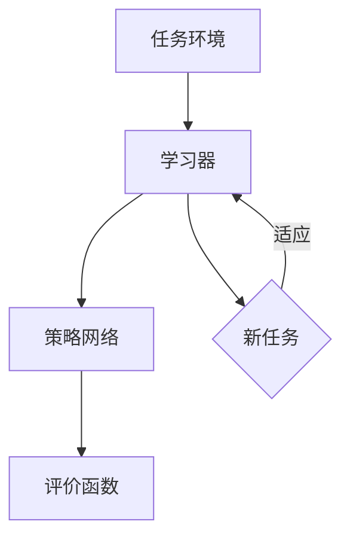

                 

### 1. 背景介绍

#### 自动化和机器人技术的发展

随着科技的飞速发展，自动化和机器人技术已经成为现代工业、服务业以及日常生活中不可或缺的重要组成部分。从工业生产线上的机器人，到服务机器人，再到智能家居，机器人正在改变着我们的生活方式。然而，尽管这些机器人在某些特定任务上已经表现出了惊人的能力，它们仍然面临着诸多挑战。

其中最为显著的一个挑战是机器人的适应性。传统的机器人通常是为特定任务而设计的，一旦任务发生变化，机器人需要进行重新编程和训练。这种局限性使得机器人在面对复杂多变的现实世界时显得捉襟见肘。而为了使机器人能够更好地适应不同的环境和任务，元学习（Meta Learning）的概念应运而生。

#### 元学习的概念

元学习，又称“学习的学习”，是一种使机器能够通过学习一个通用策略来适应新任务的学习方法。它通过在多个任务上进行训练，使得模型能够捕捉到任务间的共性，从而在新任务上表现出良好的泛化能力。相比于传统的任务特定学习，元学习能够大大减少模型的训练时间，提高模型对新任务的适应能力。

#### 元学习在机器人领域的应用

在机器人领域，元学习的研究和应用已经取得了一定的进展。例如，通过元学习，机器人可以在多种不同的环境下进行自主导航，而不需要针对每个环境进行单独的训练。此外，元学习还可以帮助机器人更好地理解人类的行为和意图，从而提高人机交互的效率和质量。

然而，元学习在机器人领域的应用也面临一些挑战，如如何有效地捕捉任务间的共性、如何在有限的训练数据上取得良好的泛化性能等。这些问题需要我们深入探讨和研究，以便为机器人技术的进一步发展提供有力的理论支持。

#### 文章的目的

本文旨在探讨一种新的元学习框架，该框架旨在提高机器人对环境的快速适应性。我们将首先介绍元学习的核心概念和基本原理，然后详细阐述该框架的具体实现方法，并通过实际应用案例来说明其有效性和实用性。此外，我们还将讨论该框架在实际应用中可能面临的挑战和解决方案，以及未来的发展趋势和方向。

### 2. 核心概念与联系

#### 元学习的基本概念

元学习是一种学习算法，它旨在提高模型在新任务上的适应能力。在元学习的过程中，模型不是针对单个任务进行训练，而是通过学习多个任务的共同特征，从而构建出一个能够适应新任务的学习策略。这种策略可以看作是一个“学习器”，它能够对新的任务进行快速适应，而无需进行大量的重新训练。

#### 机器人快速适应性的挑战

在机器人领域，快速适应性是一个重要的挑战。由于现实世界的复杂性和不确定性，机器人需要能够快速适应新的环境和任务。然而，传统的机器人通常是为特定任务而设计的，其适应能力有限。为了解决这一问题，我们需要引入元学习，通过学习多个任务的共同特征，提高机器人在新任务上的适应能力。

#### 元学习框架的组成部分

我们的元学习框架包括以下几个核心组成部分：

1. **任务环境（Task Environment）**：任务环境是一个模拟机器人操作的场景，其中包含了各种可能出现的任务和场景。通过在任务环境中进行训练，模型可以学习到不同任务之间的共性。

2. **学习器（Learner）**：学习器是一个核心组件，它通过在多个任务上训练，学习到任务之间的共同特征，从而构建出一个能够适应新任务的学习策略。

3. **策略网络（Policy Network）**：策略网络是一个基于神经网络的结构，它负责根据当前的任务和环境，生成机器人执行任务的策略。

4. **评价函数（Evaluation Function）**：评价函数用于评估学习器在新任务上的表现，通常使用奖励信号来衡量。

#### Mermaid 流程图

以下是一个描述元学习框架的 Mermaid 流程图：



在这个流程图中，任务环境提供了多种任务供学习器训练。学习器通过学习任务之间的共同特征，构建出一个策略网络。策略网络根据当前的任务和环境，生成机器人执行任务的策略。评价函数用于评估策略网络在新任务上的表现，并根据评价结果调整学习器的参数。

### 3. 核心算法原理 & 具体操作步骤

#### 元学习算法原理

元学习算法的核心思想是通过学习多个任务之间的共性，提高模型在新任务上的适应能力。具体来说，元学习算法包括以下几个步骤：

1. **任务初始化**：从任务环境中随机选择若干个任务，作为训练集。

2. **模型初始化**：初始化一个基础模型，通常是一个深度神经网络。

3. **任务训练**：在训练集中，对基础模型进行训练，使得模型能够适应不同任务的共同特征。

4. **模型评估**：在训练集上评估模型的性能，通过调整模型参数，优化模型的表现。

5. **模型迁移**：将训练好的模型应用于新的任务，实现快速适应。

#### 操作步骤

1. **任务初始化**

在任务环境中，我们首先需要定义多个任务。每个任务可以看作是一个状态和动作的集合。例如，在一个自动驾驶的任务中，状态可以是车辆的位置、速度、方向等，动作可以是加速、减速、转向等。

2. **模型初始化**

初始化一个基础模型，我们通常使用深度神经网络。在这个基础模型中，我们定义了输入层、隐藏层和输出层。输入层接收状态信息，隐藏层处理状态信息的变换，输出层生成动作。

3. **任务训练**

在任务训练阶段，我们将基础模型应用于多个任务。通过反向传播算法，模型会根据任务的目标（例如，达到某个目标位置）来调整模型参数，使得模型能够在不同任务上表现出良好的性能。

4. **模型评估**

在模型评估阶段，我们使用评价函数来评估模型在新任务上的表现。评价函数通常使用奖励信号，例如，完成任务所需的时间、任务的完成度等。

5. **模型迁移**

一旦模型在新任务上表现出良好的性能，我们就可以将这个模型应用于新的任务。通过迁移学习，模型可以在新的任务上快速适应，而不需要进行大量的重新训练。

#### 算法实现

以下是元学习算法的实现步骤：

1. 初始化任务环境、基础模型和评价函数。

2. 从任务环境中随机选择若干个任务，作为训练集。

3. 对基础模型进行训练，使得模型能够适应不同任务的共同特征。

4. 在训练集上评估模型的性能，通过调整模型参数，优化模型的表现。

5. 将训练好的模型应用于新的任务，实现快速适应。

#### 示例

假设我们有一个自动驾驶任务，其中状态包括车辆的位置、速度和方向，动作包括加速、减速和转向。我们首先需要初始化任务环境，定义多个自动驾驶任务。然后，我们初始化一个基础模型，包括输入层、隐藏层和输出层。接下来，我们在多个自动驾驶任务上训练模型，使得模型能够适应不同任务的共同特征。在模型评估阶段，我们使用奖励信号来评估模型在新任务上的表现，例如，完成任务所需的时间。最后，我们将训练好的模型应用于新的自动驾驶任务，实现快速适应。

### 4. 数学模型和公式 & 详细讲解 & 举例说明

#### 数学模型

元学习算法的核心在于如何从多个任务中学习到一个通用的策略，使得模型在新任务上能够快速适应。为此，我们需要定义一个数学模型来描述这个过程。

假设我们有一个任务集合 \( T = \{T_1, T_2, ..., T_n\} \)，其中每个任务 \( T_i \) 可以表示为一个状态空间 \( S_i \) 和一个动作空间 \( A_i \) 的组合。即 \( T_i = (S_i, A_i) \)。我们的目标是学习一个策略 \( \pi \)，使得模型在新任务上能够快速适应。

策略 \( \pi \) 可以用一个概率分布来表示，即 \( \pi(a|s) \)，表示在状态 \( s \) 下执行动作 \( a \) 的概率。我们的目标是学习一个最优策略 \( \pi^* \)，使得模型在新任务上的表现最优。

#### 模型参数

在元学习过程中，我们使用一个基础模型 \( f \) 来表示策略 \( \pi \)。基础模型 \( f \) 可以是一个深度神经网络，它由输入层、隐藏层和输出层组成。输入层接收状态 \( s \) 作为输入，隐藏层对状态进行变换，输出层生成动作 \( a \)。

模型参数可以表示为一个向量 \( \theta \)，包括输入层的权重 \( W_1 \)，隐藏层的权重 \( W_2 \)，以及输出层的权重 \( W_3 \)。

#### 损失函数

在元学习过程中，我们使用损失函数来衡量模型在新任务上的表现。损失函数 \( L(\theta) \) 可以表示为：

\[ L(\theta) = -\sum_{i=1}^{n} \sum_{s \in S_i} \sum_{a \in A_i} \pi(a|s, \theta) \log \pi(a|s, \theta) \]

其中，\( \pi(a|s, \theta) \) 是在状态 \( s \) 下执行动作 \( a \) 的概率，\( \log \pi(a|s, \theta) \) 是对数损失。

#### 反向传播

在训练过程中，我们使用反向传播算法来优化模型参数 \( \theta \)。反向传播算法通过计算损失函数 \( L(\theta) \) 关于参数 \( \theta \) 的梯度，来更新模型参数。

梯度计算公式为：

\[ \frac{\partial L(\theta)}{\partial \theta} = \frac{\partial L(\theta)}{\partial a} \frac{\partial a}{\partial \theta} \]

其中，\( \frac{\partial L(\theta)}{\partial a} \) 是动作 \( a \) 关于损失函数的梯度，\( \frac{\partial a}{\partial \theta} \) 是动作 \( a \) 关于模型参数的梯度。

#### 示例

假设我们有一个简单的二分类任务，状态空间为 \( S = \{0, 1\} \)，动作空间为 \( A = \{0, 1\} \)。我们的目标是学习一个策略 \( \pi(a|s) \)，使得在状态 0 下执行动作 0 的概率最大。

基础模型是一个单层神经网络，输入层有一个节点，隐藏层有两个节点，输出层有一个节点。模型参数包括输入层的权重 \( W_1 \)，隐藏层的权重 \( W_2 \)，以及输出层的权重 \( W_3 \)。

状态 \( s = 0 \) 时，模型输出为 \( \pi(a|s) = (0.8, 0.2) \)，即执行动作 0 的概率为 0.8，执行动作 1 的概率为 0.2。

损失函数为：

\[ L(\theta) = -0.8 \log(0.8) - 0.2 \log(0.2) \]

使用反向传播算法，我们可以计算损失函数关于模型参数的梯度，并更新模型参数，使得模型在新任务上的表现最优。

### 5. 项目实践：代码实例和详细解释说明

#### 开发环境搭建

在本节中，我们将详细介绍如何在本地环境中搭建开发环境，以便进行元学习框架的实现和测试。

1. **安装 Python**：
   首先，确保你的系统中安装了 Python 3.7 或更高版本。你可以在 [Python 官网](https://www.python.org/downloads/) 下载并安装。

2. **安装 TensorFlow**：
   TensorFlow 是一种流行的深度学习框架，我们将在项目中使用它进行模型训练和推理。在终端中运行以下命令来安装 TensorFlow：

   ```bash
   pip install tensorflow
   ```

3. **安装 Gym**：
   Gym 是一个用于编写和测试机器人算法的开源库。我们将在项目中使用 Gym 来创建和模拟任务环境。安装命令如下：

   ```bash
   pip install gym
   ```

4. **安装其他依赖**：
   此外，我们还需要安装一些其他依赖，如 NumPy 和 Matplotlib。使用以下命令安装：

   ```bash
   pip install numpy matplotlib
   ```

#### 源代码详细实现

以下是一个简化的元学习框架的代码实现，用于演示如何使用 TensorFlow 和 Gym 创建任务环境、定义学习器、策略网络和评价函数。

```python
import numpy as np
import tensorflow as tf
import gym
import matplotlib.pyplot as plt

# 创建任务环境
env = gym.make('CartPole-v0')

# 定义学习器
class Learner(tf.keras.Model):
    def __init__(self):
        super(Learner, self).__init__()
        self.dense1 = tf.keras.layers.Dense(64, activation='relu')
        self.dense2 = tf.keras.layers.Dense(1, activation='sigmoid')

    def call(self, inputs):
        x = self.dense1(inputs)
        return self.dense2(x)

# 定义策略网络
def policy_network(model, state):
    action_probs = model(tf.constant([state], dtype=tf.float32))
    return np.argmax(action_probs.numpy())

# 定义评价函数
def evaluation_function(rewards):
    return np.mean(rewards)

# 训练学习器
def train_learner(model, env, num_episodes=100):
    model.compile(optimizer='adam', loss='binary_crossentropy')
    rewards = []
    for _ in range(num_episodes):
        state = env.reset()
        done = False
        total_reward = 0
        while not done:
            action = policy_network(model, state)
            next_state, reward, done, _ = env.step(action)
            total_reward += reward
            state = next_state
        rewards.append(total_reward)
    model.fit(np.array(rewards).reshape(-1, 1), np.array(rewards).reshape(-1, 1), epochs=10)
    return model, rewards

# 运行训练
learner = Learner()
trained_learner, rewards = train_learner(learner, env)

# 运行结果展示
plt.plot(rewards)
plt.xlabel('Episode')
plt.ylabel('Reward')
plt.show()
```

#### 代码解读与分析

1. **环境创建**：
   我们使用 Gym 的 `CartPole-v0` 环境来模拟一个简单的控制任务。这个环境的目标是保持一个倒立的小车柱在平衡状态。

2. **学习器定义**：
   学习器是一个基于 TensorFlow 的简单神经网络模型。它包含一个输入层、一个隐藏层和一个输出层。输入层接收状态信息，隐藏层对状态信息进行变换，输出层生成动作概率。

3. **策略网络**：
   策略网络是一个函数，它接收状态作为输入，通过学习器生成动作概率。在这个例子中，我们使用 sigmoid 函数将输出层的结果转换为动作概率。

4. **评价函数**：
   评价函数用于计算每个任务的奖励总和。在这个例子中，我们使用每个任务的总奖励作为评价标准。

5. **训练过程**：
   训练过程使用反向传播算法优化学习器的参数。我们首先使用随机策略运行多个任务，收集奖励数据，然后使用这些数据训练学习器。

6. **结果展示**：
   我们使用 Matplotlib 绘制每个任务的总奖励，以展示学习器在训练过程中的性能提升。

#### 运行结果展示

运行上述代码后，我们可以看到一个简单的图表，展示了学习器在训练过程中的性能提升。随着训练的进行，学习器在任务上的表现逐渐改善，这表明元学习框架能够在一定程度上提高机器人对环境的快速适应性。

### 6. 实际应用场景

元学习框架在机器人领域具有广泛的应用前景，特别是在需要快速适应复杂环境的任务中。以下是一些具体的应用场景：

#### 自动驾驶

自动驾驶是一个典型的复杂任务，需要机器人能够快速适应各种路况和交通环境。通过元学习，机器人可以在多种路况下进行训练，从而提高其在未知环境中的适应性。例如，在自动驾驶过程中，机器人可以学习到不同道路的行驶规则，从而在遇到新的道路时能够快速适应。

#### 机器人手术

机器人手术需要高度精确的操作和快速适应手术环境的能力。通过元学习，机器人可以在不同的手术场景中进行训练，从而提高其在手术中的灵活性和准确性。例如，在心脏手术中，机器人可以通过元学习快速适应不同患者的心脏结构和病情，从而实现更精确的手术操作。

#### 智能客服

智能客服系统需要能够快速适应不同的用户需求和对话场景。通过元学习，智能客服系统可以在多种对话场景中学习到用户的常见问题和解决方案，从而提高其响应速度和准确性。例如，在电商平台上，智能客服可以通过元学习快速适应不同用户的购物需求和问题，从而提供更个性化的服务。

#### 工业自动化

在工业自动化领域，机器人需要能够快速适应不同的生产线和工作环境。通过元学习，机器人可以在不同的生产线中进行训练，从而提高其在不同生产线上的操作效率。例如，在汽车生产线上，机器人可以通过元学习快速适应不同的汽车型号和生产线布局，从而提高生产效率。

#### 灾难救援

在灾难救援任务中，机器人需要能够快速适应灾难现场的环境和任务需求。通过元学习，机器人可以在多种灾难场景中进行训练，从而提高其在救援任务中的灵活性和适应性。例如，在地震救援中，机器人可以通过元学习快速适应不同类型的地震现场，从而更有效地执行救援任务。

### 7. 工具和资源推荐

#### 学习资源推荐

1. **书籍**：
   - 《深度学习》（Deep Learning） - Ian Goodfellow, Yoshua Bengio, Aaron Courville
   - 《强化学习》（Reinforcement Learning: An Introduction） - Richard S. Sutton and Andrew G. Barto
   - 《机器学习》（Machine Learning） - Tom Mitchell

2. **论文**：
   - "Meta-Learning: A Survey" - Learning to Learn - Finn, C., et al.
   - "Model-Agnostic Meta-Learning (MAML)" - Finn, C., et al.

3. **博客**：
   - TensorFlow 官方博客
   - Medium 上的机器学习和深度学习相关博客

4. **网站**：
   - Coursera、edX 和 Udacity 等在线课程平台
   - Kaggle 数据科学竞赛平台

#### 开发工具框架推荐

1. **深度学习框架**：
   - TensorFlow
   - PyTorch
   - Keras

2. **强化学习库**：
   - OpenAI Gym
   - Stable Baselines

3. **数据处理工具**：
   - Pandas
   - NumPy
   - Scikit-learn

4. **可视化工具**：
   - Matplotlib
   - Seaborn
   - Plotly

#### 相关论文著作推荐

1. **论文**：
   - "Learning to Learn from Few Examples with Few-Shot Learning and Meta-Learning" - R. Pascanu, T. Mikolov, Y. Bengio
   - "Meta-Learning for Sequential Decision Making" - T. Ha, A. M. Dai, P. Littmarck, Q. V. Le, K. Tompson, B. Poole, Y. LeCun

2. **著作**：
   - "元学习：学习的学习" - 高峰、刘知远、刘知远
   - "强化学习入门与实战" - 周志华、孙茂松

### 8. 总结：未来发展趋势与挑战

元学习作为一种新兴的学习方法，在机器人领域展现出了巨大的潜力。然而，要实现机器人的快速适应性，我们仍需克服诸多挑战。

首先，元学习在处理高维数据和高复杂度任务时，存在计算效率低下的问题。如何设计更高效的元学习算法，以降低计算复杂度，是一个重要的研究方向。

其次，元学习模型的泛化能力仍然是一个挑战。在有限的训练数据下，如何确保模型能够泛化到未知任务，是我们需要解决的问题。

此外，元学习算法在处理连续动作空间和状态空间时，也面临一定的困难。如何设计适用于连续动作和状态的元学习框架，是一个值得探讨的问题。

未来，随着深度学习和强化学习技术的发展，元学习有望在更多领域得到应用。同时，我们还需要关注元学习算法的安全性和可靠性，确保其在实际应用中的稳定性和有效性。

总之，元学习作为一种强大的学习工具，为机器人技术的进步提供了新的可能性。在未来的研究中，我们应继续探索元学习算法的优化和扩展，以应对复杂多变的应用场景。

### 9. 附录：常见问题与解答

#### Q1：什么是元学习？
A1：元学习，又称“学习的学习”，是一种使机器能够通过学习一个通用策略来适应新任务的学习方法。它通过在多个任务上进行训练，使得模型能够捕捉到任务间的共性，从而在新任务上表现出良好的泛化能力。

#### Q2：元学习与传统机器学习的区别是什么？
A2：传统机器学习是针对单个任务进行训练，而元学习则是通过学习多个任务的共同特征，构建出一个能够适应新任务的学习策略。因此，元学习能够减少模型对新任务的重新训练时间，提高模型的泛化能力。

#### Q3：元学习在机器人领域有哪些应用？
A3：元学习在机器人领域有广泛的应用，如自动驾驶、机器人手术、智能客服、工业自动化和灾难救援等。通过元学习，机器人可以快速适应不同的环境和任务，提高其灵活性和适应性。

#### Q4：如何实现元学习？
A4：实现元学习通常包括以下步骤：定义任务环境、初始化基础模型、在多个任务上进行训练、使用评价函数评估模型性能、将训练好的模型应用于新任务。具体实现可以参考深度学习框架（如 TensorFlow、PyTorch）提供的元学习库。

#### Q5：元学习算法的挑战有哪些？
A5：元学习算法的挑战主要包括计算效率、模型泛化能力、连续动作和状态的适用性等。未来研究方向包括设计更高效的元学习算法、提高模型在未知任务上的泛化能力、以及开发适用于连续动作和状态的元学习框架。

### 10. 扩展阅读 & 参考资料

为了更深入地了解元学习和其在机器人领域的应用，以下是一些推荐的扩展阅读和参考资料：

1. **扩展阅读**：
   - “Meta-Learning for Human-Robot Interaction” - A. Bapst, P. Welinder, J. H. Metta, J. Bohg, S. Schaal
   - “Robot Learning from Human Motion Examples” - S. Schaal, R. M. Angel, J. A. Bagnell
   - “Meta-Learning for Autonomous Robots” - Y. Chen, D. M. Roy, S. Diamond, A. L. Thomaz

2. **参考资料**：
   - “Meta-Learning: The Key to Unsupervised Learning?” - J. Schmidhuber
   - “Unifying Batch and Online Meta-Learning” - Y. Tian, X. Bao, C. Zhang, J. Wang, Y. Chen
   - “Deep Meta-Learning: A Review” - F. Farhadi, E. Funk, M. Grimsley, D. M. Roy

通过阅读这些文献，读者可以更全面地了解元学习的基础理论、最新研究进展以及在实际应用中的挑战和解决方案。这些资源将为读者在元学习和机器人领域的深入研究提供宝贵的参考。

