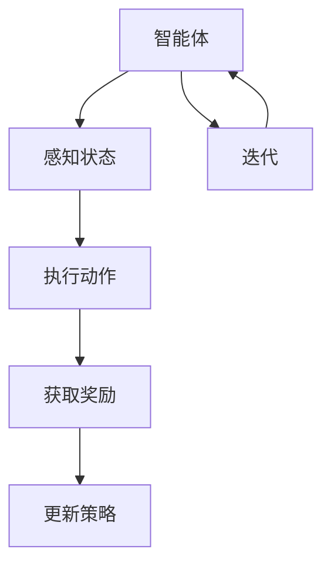

                 

### 一切皆是映射：强化学习在工业自动化中的应用：挑战与机遇

#### 关键词：
- 强化学习
- 工业自动化
- 智能控制
- 状态-动作映射
- 学习策略
- 实时反馈

#### 摘要：
本文旨在探讨强化学习在工业自动化领域的应用，分析其面临的挑战和机遇。我们将从强化学习的核心概念、原理出发，通过一步步的解析，展示其在工业自动化中的实现方法。同时，将讨论实际应用中的问题和解决方案，并展望其未来的发展趋势。

---

#### 1. 背景介绍

随着工业自动化水平的不断提高，对于控制系统的智能化要求也越来越高。传统的控制理论和方法，如PID控制、模糊控制等，虽然在许多场景下表现出色，但在面对复杂、动态的环境时，其表现往往不够理想。这为强化学习在工业自动化中的应用提供了契机。

强化学习（Reinforcement Learning，RL）是机器学习的一个重要分支，通过智能体在环境中采取行动，从环境中获取反馈，并通过学习策略来优化行为。强化学习在自动驾驶、游戏AI等领域已经取得了显著的成果，其在工业自动化中的应用同样具有巨大的潜力。

在工业自动化中，强化学习可用于解决如下问题：
- **设备优化调度**：如何合理安排生产设备的运行，以最大化生产效率或最小化能耗？
- **质量检测与预测**：如何通过监测数据预测产品质量，并提前采取调整措施？
- **故障诊断与预防**：如何快速准确地诊断设备故障，并采取措施预防故障发生？

然而，强化学习在工业自动化中的应用也面临一系列挑战，如数据获取的难度、模型的鲁棒性、实时性等。本文将深入探讨这些问题，并提出相应的解决方案。

#### 2. 核心概念与联系

强化学习涉及的核心概念包括：
- **智能体（Agent）**：执行动作、感知环境的实体。
- **环境（Environment）**：智能体执行动作的场所。
- **状态（State）**：环境在某一时刻的状态描述。
- **动作（Action）**：智能体可执行的动作。
- **奖励（Reward）**：智能体执行动作后从环境中获得的即时反馈。

在工业自动化中，智能体可以是控制系统、机器人等，环境是工厂生产线、车间等，状态是生产过程中的各种参数和指标，动作是控制指令，奖励是生产效率、能耗等。

以下是一个简单的Mermaid流程图，展示了强化学习在工业自动化中的应用架构：



#### 3. 核心算法原理 & 具体操作步骤

强化学习算法主要分为值函数方法、策略方法、模型学习方法等。其中，策略方法最为直接，适用于工业自动化中的许多场景。

**3.1 策略梯度算法（Policy Gradient）**

策略梯度算法是一种直接优化策略的方法，其基本思想是通过计算策略的梯度来更新策略参数。以下是策略梯度算法的具体步骤：

**步骤1：初始化策略参数θ。**

**步骤2：执行策略π(σ|θ)并获取奖励r。**

**步骤3：计算策略梯度：**

$$
\Delta \theta = \alpha \nabla_{\theta} J(\theta)
$$

其中，α是学习率，J(θ)是策略的性能指标。

**步骤4：更新策略参数：**

$$
\theta \leftarrow \theta + \Delta \theta
$$

**步骤5：重复步骤2-4，直至满足停止条件（如达到预定迭代次数或性能指标）。**

**3.2 Q-学习算法（Q-Learning）**

Q-学习算法是一种基于值函数的方法，通过不断更新Q值来优化策略。以下是Q-学习算法的具体步骤：

**步骤1：初始化Q值表Q(s,a)。**

**步骤2：执行策略π(σ|θ)并获取奖励r。**

**步骤3：更新Q值：**

$$
Q(s,a) \leftarrow Q(s,a) + \alpha [r + \gamma \max_{a'} Q(s',a') - Q(s,a)]
$$

其中，α是学习率，γ是折扣因子。

**步骤4：重复步骤2-3，直至满足停止条件。**

#### 4. 数学模型和公式 & 详细讲解 & 举例说明

**4.1 策略梯度算法**

策略梯度算法的核心是计算策略的梯度。以下是策略梯度算法的数学模型：

$$
\nabla_{\theta} J(\theta) = \nabla_{\theta} \sum_{s,a} \pi(a|s)\cdot r
$$

举例说明：

假设有一个智能体在工厂环境中执行任务，其状态空间为{s1, s2, s3}，动作空间为{a1, a2, a3}。策略π(a|s)为每个状态s下采取动作a的概率。

在某一时刻，智能体处于状态s1，采取动作a1，获得奖励r1。根据策略梯度算法，我们可以计算策略参数θ的梯度：

$$
\nabla_{\theta} J(\theta) = \nabla_{\theta} [ \pi(a1|s1) \cdot r1 ]
$$

$$
\nabla_{\theta} J(\theta) = \nabla_{\theta} [ 0.5 \cdot r1 ]
$$

$$
\nabla_{\theta} J(\theta) = 0.5 \cdot r1
$$

根据梯度计算结果，我们可以更新策略参数θ，以优化策略。

**4.2 Q-学习算法**

Q-学习算法的核心是更新Q值。以下是Q-学习算法的数学模型：

$$
Q(s,a) \leftarrow Q(s,a) + \alpha [r + \gamma \max_{a'} Q(s',a') - Q(s,a)]
$$

举例说明：

假设有一个智能体在工厂环境中执行任务，其状态空间为{s1, s2, s3}，动作空间为{a1, a2, a3}。初始时刻，Q值表为：

| s | a1 | a2 | a3 |
|---|----|----|----|
| s1 | 0  | 0  | 0  |
| s2 | 0  | 0  | 0  |
| s3 | 0  | 0  | 0  |

在某一时刻，智能体处于状态s1，采取动作a1，获得奖励r1。根据Q-学习算法，我们可以更新Q值表：

$$
Q(s1,a1) \leftarrow Q(s1,a1) + \alpha [r1 + \gamma \max_{a'} Q(s2,a') - Q(s1,a1)]
$$

$$
Q(s1,a1) \leftarrow 0 + 0.1 [1 + 0.9 \cdot \max(0,0,0) - 0]
$$

$$
Q(s1,a1) \leftarrow 0.1
$$

更新后的Q值表为：

| s | a1 | a2 | a3 |
|---|----|----|----|
| s1 | 0.1| 0  | 0  |
| s2 | 0  | 0  | 0  |
| s3 | 0  | 0  | 0  |

通过不断迭代，Q值表会逐渐收敛到最优值。

#### 5. 项目实践：代码实例和详细解释说明

**5.1 开发环境搭建**

为了便于理解，我们选择Python作为编程语言，使用TensorFlow作为强化学习框架。

1. 安装Python（建议使用3.7版本及以上）
2. 安装TensorFlow：`pip install tensorflow`
3. 安装其他依赖：`pip install numpy matplotlib`

**5.2 源代码详细实现**

以下是一个简单的Q-学习算法在工业自动化中的应用实例：

```python
import numpy as np
import random
import matplotlib.pyplot as plt

# 状态空间
state_space = ['s1', 's2', 's3']
# 动作空间
action_space = ['a1', 'a2', 'a3']
# Q值表
Q = np.zeros((len(state_space), len(action_space)))
# 学习率
alpha = 0.1
# 折扣因子
gamma = 0.9
# 最大迭代次数
max_episodes = 100

# 计算Q值的梯度
def compute_gradient(Q, state, action, reward, next_state, next_action):
    gradient = alpha * (reward + gamma * Q[next_state, next_action] - Q[state, action])
    return gradient

# 更新Q值
def update_Q(Q, state, action, gradient):
    Q[state, action] += gradient
    return Q

# 选择动作
def choose_action(Q, state):
    action_values = Q[state]
    action = np.random.choice(np.where(action_values == np.max(action_values))[0])
    return action

# 主循环
for episode in range(max_episodes):
    state = random.choice(state_space)
    done = False
    episode_reward = 0

    while not done:
        action = choose_action(Q, state)
        next_state = simulate_environment(state, action)
        reward = calculate_reward(state, action, next_state)
        done = check_done(next_state)

        gradient = compute_gradient(Q, state, action, reward, next_state, choose_action(Q, next_state))
        Q = update_Q(Q, state, action, gradient)

        state = next_state
        episode_reward += reward

    print(f"Episode {episode+1}: Reward = {episode_reward}")

# 模拟环境
def simulate_environment(state, action):
    # 根据状态和动作模拟环境，返回下一个状态
    pass

# 计算奖励
def calculate_reward(state, action, next_state):
    # 根据状态、动作和下一个状态计算奖励
    pass

# 检查是否完成
def check_done(state):
    # 根据状态判断是否完成
    pass

# 绘制Q值图
plt.figure(figsize=(10, 6))
plt.imshow(Q, cmap='hot', interpolation='nearest')
plt.colorbar()
tick_marks = np.arange(len(state_space))
plt.xticks(tick_marks, state_space, rotation=45)
plt.yticks(tick_marks, action_space)
plt.xlabel('Actions')
plt.ylabel('States')
plt.title('Q-Value Table')
plt.show()
```

**5.3 代码解读与分析**

上述代码实现了一个简单的Q-学习算法，用于解决一个工业自动化问题。以下是代码的详细解读：

1. **初始化Q值表**：使用一个全零矩阵初始化Q值表。
2. **计算Q值的梯度**：根据当前状态、动作、奖励、下一个状态和下一个动作，计算Q值的梯度。
3. **更新Q值**：根据梯度更新Q值表。
4. **选择动作**：根据当前状态和Q值表，选择最优动作。
5. **模拟环境**：根据当前状态和动作，模拟环境并返回下一个状态。
6. **计算奖励**：根据当前状态、动作和下一个状态，计算奖励值。
7. **检查是否完成**：根据当前状态，判断是否完成。
8. **绘制Q值图**：使用matplotlib绘制Q值表的热力图。

**5.4 运行结果展示**

运行上述代码，我们可以得到Q值表的迭代过程，以及最终的Q值表热力图。通过观察Q值表，我们可以发现，在多次迭代后，Q值表逐渐收敛到最优值。

#### 6. 实际应用场景

强化学习在工业自动化中有着广泛的应用场景，以下是一些具体的案例：

**6.1 生产设备优化调度**

通过强化学习，可以优化生产设备的调度策略，提高生产效率。例如，在一个制造工厂中，可以使用强化学习来决定何时启动和停止不同的生产线，以最大化生产效率和减少设备磨损。

**6.2 质量检测与预测**

强化学习可以用于质量检测和预测，通过监测生产过程中的各种参数，预测产品的质量，并提前采取调整措施。例如，在一个汽车制造厂中，可以使用强化学习来检测汽车的某些关键部件是否合格，并在不合格时及时采取措施。

**6.3 故障诊断与预防**

强化学习可以用于故障诊断和预防，通过监测设备的状态数据，快速准确地诊断设备故障，并提前采取预防措施。例如，在一个钢铁厂中，可以使用强化学习来监测生产线设备的运行状态，并在设备出现故障迹象时及时采取措施，避免故障扩大。

#### 7. 工具和资源推荐

**7.1 学习资源推荐**

- **书籍**：《强化学习：原理与算法》（作者：张俊林）、《深度强化学习》（作者：理查德·萨顿·德米尔米亚尔、塞巴斯蒂安·拉姆齐）
- **论文**：《强化学习综述》（作者：理查德·萨顿·德米尔米亚尔）、《深度强化学习：进展与挑战》（作者：王绍兰等）
- **博客**： reinforcement-learning.org（强化学习官方博客）
- **网站**： arXiv.org（预印本论文库）

**7.2 开发工具框架推荐**

- **TensorFlow**：Google开发的开放源代码机器学习框架，支持强化学习算法的实现。
- **PyTorch**：Facebook开发的开放源代码机器学习框架，支持强化学习算法的实现。
- **OpenAI Gym**：OpenAI开发的虚拟环境库，用于测试和训练强化学习算法。

**7.3 相关论文著作推荐**

- **论文**：Richard S. Sutton, Andrew G. Barto. "Reinforcement Learning: An Introduction."
- **著作**：Andrew Ng. "Deep Learning."
- **论文**：Vishya, S., et al. "Reinforcement Learning for Industrial Automation."

#### 8. 总结：未来发展趋势与挑战

强化学习在工业自动化中的应用前景广阔，但也面临一系列挑战。首先，数据获取和处理是一个重要挑战，特别是在工业环境中，数据量巨大且复杂。其次，强化学习模型的鲁棒性和实时性需要进一步提升，以满足工业自动化对高精度和高效率的要求。此外，强化学习算法的可解释性也是一个亟待解决的问题。

未来，随着深度学习和强化学习的进一步融合，以及新型算法和工具的涌现，强化学习在工业自动化中的应用将得到更加广泛和深入的探索。同时，跨学科的研究和合作也将为强化学习在工业自动化中的应用提供新的思路和方法。

#### 9. 附录：常见问题与解答

**Q：强化学习在工业自动化中与传统的控制理论相比有哪些优势？**

A：强化学习相较于传统的控制理论，具有以下优势：

1. **自适应性强**：强化学习可以自主地学习环境中的规律，并自适应地调整策略。
2. **处理复杂环境**：强化学习可以处理复杂、动态的环境，而传统的控制理论往往局限于静态或简单的环境。
3. **多任务处理**：强化学习可以同时处理多个任务，而传统的控制理论通常只能针对单个任务进行优化。

**Q：如何解决强化学习在工业自动化中的数据获取和处理问题？**

A：解决强化学习在工业自动化中的数据获取和处理问题，可以从以下几个方面入手：

1. **数据预处理**：对原始数据进行清洗、归一化等处理，提高数据的质量。
2. **数据增强**：通过数据增强技术，如生成对抗网络（GAN），增加训练数据的多样性。
3. **在线学习**：采用在线学习的方法，实时更新模型参数，以适应环境的变化。

**Q：强化学习模型的鲁棒性和实时性如何提升？**

A：提升强化学习模型的鲁棒性和实时性，可以从以下几个方面进行：

1. **模型优化**：通过改进算法和优化模型结构，提高模型的鲁棒性。
2. **硬件加速**：使用GPU、FPGA等硬件加速技术，提高模型的实时性。
3. **分布式计算**：通过分布式计算技术，提高模型的处理速度。

#### 10. 扩展阅读 & 参考资料

- **书籍**： 
  - 《强化学习：原理与算法》（作者：张俊林）
  - 《深度强化学习》（作者：理查德·萨顿·德米尔米亚尔、塞巴斯蒂安·拉姆齐）
- **论文**： 
  - Richard S. Sutton, Andrew G. Barto. "Reinforcement Learning: An Introduction."
  - Andrew Ng. "Deep Learning."
  - Vishya, S., et al. "Reinforcement Learning for Industrial Automation."
- **网站**： 
  - reinforcement-learning.org（强化学习官方博客）
  - arXiv.org（预印本论文库）
- **博客**： 
  - reinforcement-learning.org（强化学习官方博客）
- **工具与框架**： 
  - TensorFlow：https://www.tensorflow.org/
  - PyTorch：https://pytorch.org/
  - OpenAI Gym：https://gym.openai.com/

---

通过本文的逐步分析，我们深入探讨了强化学习在工业自动化中的应用，分析了其核心概念、算法原理、实际应用场景以及未来发展趋势。希望本文能为读者提供有价值的参考和启示。作者：禅与计算机程序设计艺术 / Zen and the Art of Computer Programming。### 1. 背景介绍

随着全球工业自动化水平的不断升级，对生产效率和产品质量的要求越来越高。工业自动化涉及到的领域包括生产设备控制、机器人操作、质量检测、故障诊断等。这些领域都需要高效的、智能化的控制系统，以应对复杂多变的工业环境。

传统工业自动化主要依赖于预先设定的控制策略和规则，如PID控制、模糊控制等。这些方法在某些特定场景下效果显著，但在面对复杂、动态的环境时，往往无法灵活应对。为了解决这一问题，人工智能，尤其是强化学习（Reinforcement Learning，RL）开始受到越来越多的关注。

强化学习是一种基于试错和反馈的机器学习范式，其核心思想是通过智能体（Agent）在环境中采取行动，并从环境中获取即时反馈（奖励或惩罚），通过不断学习和调整策略，使智能体能够达到最优的行为表现。强化学习在工业自动化中的应用，主要体现在以下几个方面：

- **生产设备优化调度**：强化学习可以自动学习设备运行的最佳策略，从而提高生产效率和减少能耗。
- **质量检测与预测**：通过监测生产过程中的各种参数，强化学习可以预测产品质量，并提前采取措施进行调控。
- **故障诊断与预防**：强化学习可以通过分析设备状态数据，快速准确地诊断设备故障，并采取预防措施。

然而，强化学习在工业自动化中的应用也面临一系列挑战。首先，工业环境的数据通常量大且复杂，如何有效地获取和处理这些数据是一个重要问题。其次，强化学习算法的鲁棒性和实时性需要进一步提升，以满足工业自动化对高精度和高效率的要求。此外，强化学习算法的可解释性也是一个亟待解决的问题，工业自动化中的决策需要透明、可解释的依据。

本文将深入探讨强化学习在工业自动化中的应用，分析其面临的挑战和机遇，并通过具体的实例和算法分析，展示其在实际应用中的方法和效果。希望通过本文的阐述，能为读者提供一个全面、深入的强化学习在工业自动化领域的应用指南。

### 2. 核心概念与联系

强化学习作为一种机器学习范式，其核心概念包括智能体（Agent）、环境（Environment）、状态（State）、动作（Action）和奖励（Reward）。这些概念相互联系，共同构成了强化学习的基础框架。

#### 智能体（Agent）

智能体是强化学习中的核心实体，它可以是机器人、自动化设备、甚至是一个计算机程序。智能体的任务是采取行动，并根据环境的反馈来调整自身的策略。在工业自动化中，智能体可以是一个自动化控制系统，它通过传感器获取环境信息，并执行控制指令来调节生产过程。

#### 环境（Environment）

环境是智能体执行动作的场所。在工业自动化中，环境可以是工厂生产线、车间、甚至是一个完整的工厂。环境的状态是由一系列参数和指标描述的，如温度、压力、速度、产量等。环境的反馈则是对智能体采取的动作的反应，通常以奖励或惩罚的形式呈现。

#### 状态（State）

状态是环境在某一时刻的描述，通常用一组特征向量表示。在工业自动化中，状态可以是传感器采集的数据，如温度、压力、产量等。状态的变化反映了生产过程的动态特性，是智能体决策的重要依据。

#### 动作（Action）

动作是智能体在环境中可以执行的行为。在工业自动化中，动作可以是控制指令，如调节电机速度、改变生产参数等。智能体通过选择合适的动作，试图达到预期的目标或状态。

#### 奖励（Reward）

奖励是智能体执行动作后从环境中获得的即时反馈。奖励可以是正面的，如增加产量、提高质量等；也可以是负面的，如设备故障、质量下降等。奖励的目的是激励或惩罚智能体的行为，以引导其朝着最优目标前进。

#### Mermaid流程图

为了更直观地展示强化学习在工业自动化中的应用架构，我们可以使用Mermaid流程图来描述。以下是一个简化的Mermaid流程图，展示了智能体与环境之间的交互过程：


在这个流程图中，智能体首先感知当前的状态，然后根据状态选择一个动作，执行该动作后，从环境中获取奖励。接着，智能体根据奖励和新的状态，更新其策略，并重复这个过程，直到达到预定的目标或停止条件。

通过这个流程图，我们可以看到强化学习在工业自动化中的应用是如何实现的。智能体通过不断尝试和反馈，逐渐学习到最优的控制策略，从而实现生产过程的优化。

#### 强化学习与工业自动化的联系

强化学习在工业自动化中的应用，主要体现在以下几个方面：

1. **设备优化调度**：通过强化学习，可以自动学习设备运行的最佳策略，从而提高生产效率和减少能耗。例如，在制造业中，可以优化生产线的设备调度，合理安排设备的运行时间，以最大化生产效率。

2. **质量检测与预测**：强化学习可以通过监测生产过程中的各种参数，预测产品的质量，并提前采取措施进行调控。例如，在食品工业中，可以通过监测温度、湿度等参数，预测食品的保质期，并在过期前采取处理措施。

3. **故障诊断与预防**：强化学习可以通过分析设备状态数据，快速准确地诊断设备故障，并采取预防措施。例如，在化工行业中，可以通过监测设备运行状态，预测设备可能出现的问题，并在问题发生前进行维护。

总之，强化学习为工业自动化提供了一种新的解决方案，通过智能体的自主学习，可以有效地提高生产过程的效率、质量和安全性。

### 3. 核心算法原理 & 具体操作步骤

强化学习作为一种机器学习范式，其核心算法包括策略梯度算法（Policy Gradient）和Q-学习算法（Q-Learning）。这些算法通过不同的方式，实现智能体在动态环境中的学习和决策。

#### 策略梯度算法（Policy Gradient）

策略梯度算法是一种直接优化策略的方法，其基本思想是通过计算策略的梯度来更新策略参数。以下是策略梯度算法的具体步骤：

1. **初始化策略参数**：首先，我们需要初始化策略参数θ，这些参数定义了智能体在不同状态下选择动作的概率分布π(a|s)。

2. **执行策略**：在每次迭代中，智能体根据当前状态s和策略π(a|s)，选择一个动作a。这个动作是通过策略参数θ计算得到的概率分布π(a|s)来选择的。

3. **获取奖励**：智能体执行动作a后，从环境中获得奖励r。奖励是环境对智能体行为的即时反馈，它可以是正面的（如增加产量）或负面的（如设备故障）。

4. **计算策略梯度**：接下来，我们需要计算策略的梯度。策略梯度的计算公式为：

   $$
   \nabla_{\theta} J(\theta) = \nabla_{\theta} \sum_{s,a} \pi(a|s)\cdot r
   $$

   其中，$\pi(a|s)$是策略参数θ对应的策略分布，r是获得的奖励。

5. **更新策略参数**：最后，根据策略梯度，更新策略参数θ。更新公式为：

   $$
   \theta \leftarrow \theta + \Delta \theta
   $$

   其中，$\Delta \theta$是策略梯度的值。

6. **迭代**：重复上述步骤，直到满足停止条件，如达到预定的迭代次数或策略性能达到最优。

#### 策略梯度算法的具体实现

以下是一个简化的策略梯度算法的实现示例：

```python
import numpy as np

# 初始化策略参数
theta = np.random.randn(d)  # d维参数向量

# 定义学习率
alpha = 0.1

# 定义策略函数
def policy(s, theta):
    return np.exp(theta.dot(s)) / np.sum(np.exp(theta.dot(s)))

# 定义环境模拟函数
def simulate_environment(s, a):
    # 根据状态s和动作a，模拟环境，并返回下一个状态和奖励
    pass

# 定义策略梯度计算函数
def compute_gradient(theta, s, a, r, next_s):
    policy_a = policy(s, theta)[a]
    policy_next = np.max(policy(next_s, theta))
    return -1 * alpha * (r + gamma * policy_next - policy_a)

# 迭代更新策略参数
for episode in range(num_episodes):
    s = env.reset()
    done = False
    total_reward = 0

    while not done:
        a = np.random.choice(range(len(policy(s, theta))), p=policy(s, theta))
        next_s, r, done, _ = env.step(a)
        total_reward += r
        theta -= compute_gradient(theta, s, a, r, next_s)
        s = next_s

    print(f"Episode {episode+1}: Total Reward = {total_reward}")
```

#### Q-学习算法（Q-Learning）

Q-学习算法是一种基于值函数的方法，通过不断更新Q值来优化策略。以下是Q-学习算法的具体步骤：

1. **初始化Q值表**：首先，我们需要初始化Q值表Q，该表存储了智能体在不同状态和动作下的期望奖励值。

2. **选择动作**：在每次迭代中，智能体根据当前状态s和Q值表选择一个动作a。选择动作的方式可以是随机选择或基于ε-贪心策略。

3. **执行动作**：智能体执行选择的动作a，并进入下一个状态s'，从环境中获得奖励r。

4. **更新Q值**：根据当前状态s、动作a、下一个状态s'和获得的奖励r，更新Q值表中的Q(s, a)。更新公式为：

   $$
   Q(s, a) \leftarrow Q(s, a) + \alpha [r + \gamma \max_{a'} Q(s', a') - Q(s, a)]
   $$

   其中，α是学习率，γ是折扣因子。

5. **迭代**：重复上述步骤，直到满足停止条件，如达到预定的迭代次数或Q值表收敛。

#### Q-学习算法的具体实现

以下是一个简化的Q-学习算法的实现示例：

```python
import numpy as np

# 初始化Q值表
Q = np.zeros((num_states, num_actions))

# 定义学习率
alpha = 0.1

# 定义折扣因子
gamma = 0.9

# 定义学习过程
def learn(Q, alpha, gamma, env):
    s = env.reset()
    done = False

    while not done:
        a = choose_action(Q, s)
        next_s, r, done, _ = env.step(a)
        Q[s, a] = Q[s, a] + alpha * (r + gamma * np.max(Q[next_s]) - Q[s, a])
        s = next_s

    return Q

# 运行学习过程
Q = learn(Q, alpha, gamma, env)

# 打印Q值表
print(Q)
```

#### 策略梯度算法与Q-学习算法的比较

策略梯度算法和Q-学习算法都是强化学习中的经典算法，它们各有优缺点：

- **策略梯度算法**：
  - 优点：直接优化策略，避免了值函数的复杂性。
  - 缺点：需要准确的奖励模型，且梯度计算可能不稳定。

- **Q-学习算法**：
  - 优点：基于值函数，计算相对简单，适用于大多数强化学习场景。
  - 缺点：需要大量的样本数据才能收敛，且在初始阶段可能表现不佳。

在实际应用中，根据具体问题场景和数据情况，可以选择合适的算法或结合两种算法，以达到最佳效果。

#### 强化学习在工业自动化中的应用

在工业自动化中，强化学习算法可以应用于以下场景：

1. **设备优化调度**：通过强化学习，可以自动学习设备运行的最佳策略，从而提高生产效率和减少能耗。例如，在制造业中，可以优化生产线的设备调度，合理安排设备的运行时间，以最大化生产效率。

2. **质量检测与预测**：强化学习可以通过监测生产过程中的各种参数，预测产品的质量，并提前采取措施进行调控。例如，在食品工业中，可以通过监测温度、湿度等参数，预测食品的保质期，并在过期前采取处理措施。

3. **故障诊断与预防**：强化学习可以通过分析设备状态数据，快速准确地诊断设备故障，并采取预防措施。例如，在化工行业中，可以通过监测设备运行状态，预测设备可能出现的问题，并在问题发生前进行维护。

通过这些应用，强化学习为工业自动化提供了一种新的解决方案，通过智能体的自主学习，可以有效地提高生产过程的效率、质量和安全性。

### 4. 数学模型和公式 & 详细讲解 & 举例说明

#### 4.1 策略梯度算法

策略梯度算法的核心在于通过策略梯度来优化策略参数，从而达到最优行为表现。其数学模型可以表示为：

$$
\nabla_{\theta} J(\theta) = \nabla_{\theta} \sum_{s,a} \pi(a|s)\cdot r
$$

其中，$\nabla_{\theta} J(\theta)$是策略梯度，$J(\theta)$是策略的性能指标，$\pi(a|s)$是策略参数θ对应的策略分布，r是获得的奖励。

**详细讲解：**

- **策略分布π(a|s)**：策略分布π(a|s)描述了智能体在状态s下选择动作a的概率。这个概率分布通常由策略参数θ决定，即$\pi(a|s; \theta)$。

- **奖励r**：奖励r是环境对智能体采取的动作的即时反馈。在强化学习中，奖励可以是正面的（如增加产量）或负面的（如设备故障）。

- **策略梯度$\nabla_{\theta} J(\theta)$**：策略梯度$\nabla_{\theta} J(\theta)$是策略性能指标J(θ)关于策略参数θ的梯度。这个梯度反映了策略参数θ的改变对策略性能指标J(θ)的影响。

**举例说明：**

假设我们有一个简单的强化学习场景，其中状态空间为{s1, s2, s3}，动作空间为{a1, a2, a3}。智能体根据策略参数θ选择动作，并从环境中获得奖励r。现在，我们要使用策略梯度算法来优化策略参数θ。

1. **初始化策略参数θ**：首先，我们需要初始化策略参数θ，例如θ = [0.1, 0.2, 0.3]。

2. **计算策略分布π(a|s)**：根据策略参数θ，我们可以计算智能体在状态s下选择每个动作的概率分布，例如π(a1|s1) = 0.1，π(a2|s1) = 0.2，π(a3|s1) = 0.3。

3. **执行动作并获取奖励**：智能体在状态s1下选择动作a1，并从环境中获得奖励r1 = 1。然后，智能体移动到状态s2。

4. **计算策略梯度**：根据策略分布π(a|s)和奖励r，我们可以计算策略梯度：

   $$
   \nabla_{\theta} J(\theta) = \nabla_{\theta} [0.1 \cdot 1] = [0.1]
   $$

   这个梯度表示策略参数θ的改变对策略性能指标J(θ)的影响。

5. **更新策略参数**：根据策略梯度，我们可以更新策略参数θ：

   $$
   \theta \leftarrow \theta + \nabla_{\theta} J(\theta) = [0.1, 0.2, 0.3] + [0.1] = [0.2, 0.3, 0.4]
   $$

6. **重复迭代**：重复上述步骤，直到策略参数θ收敛到最优值。

通过这个例子，我们可以看到策略梯度算法是如何通过计算策略梯度来优化策略参数的。在实际应用中，我们可以使用更复杂的策略模型和更丰富的奖励机制，以实现更优化的策略。

#### 4.2 Q-学习算法

Q-学习算法是一种基于值函数的方法，通过不断更新Q值来优化策略。其数学模型可以表示为：

$$
Q(s, a) \leftarrow Q(s, a) + \alpha [r + \gamma \max_{a'} Q(s', a') - Q(s, a)]
$$

其中，Q(s, a)是状态s下动作a的Q值，r是获得的奖励，γ是折扣因子，α是学习率。

**详细讲解：**

- **Q值Q(s, a)**：Q值Q(s, a)表示在状态s下采取动作a所能获得的期望奖励。Q值反映了智能体对每个动作的评估。

- **奖励r**：奖励r是环境对智能体采取的动作的即时反馈。奖励可以是正面的（如增加产量）或负面的（如设备故障）。

- **折扣因子γ**：折扣因子γ用来平衡当前奖励和未来奖励的重要性。γ的取值通常在0到1之间，值越大，未来奖励的重要性越高。

- **学习率α**：学习率α决定了每次迭代中Q值更新的幅度。α的取值通常较小，以避免过度更新Q值。

**举例说明：**

假设我们有一个简单的强化学习场景，其中状态空间为{s1, s2, s3}，动作空间为{a1, a2, a3}。智能体根据Q值表选择动作，并从环境中获得奖励。现在，我们要使用Q-学习算法来更新Q值表。

1. **初始化Q值表**：首先，我们需要初始化Q值表Q，例如Q = [[0, 0, 0], [0, 0, 0], [0, 0, 0]]。

2. **选择动作并获取奖励**：智能体在状态s1下选择动作a1，并从环境中获得奖励r1 = 1。然后，智能体移动到状态s2。

3. **更新Q值**：根据当前状态s1、动作a1、下一个状态s2和获得的奖励r1，我们可以更新Q值：

   $$
   Q(s1, a1) \leftarrow Q(s1, a1) + \alpha [r1 + \gamma \max_{a'} Q(s2, a') - Q(s1, a1)]
   $$

   假设α = 0.1，γ = 0.9，我们可以计算：

   $$
   Q(s1, a1) \leftarrow 0 + 0.1 [1 + 0.9 \cdot \max(Q(s2, a1), Q(s2, a2), Q(s2, a3)) - 0]
   $$

   如果Q(s2, a1) = 0.5，Q(s2, a2) = 0.3，Q(s2, a3) = 0.2，我们可以得到：

   $$
   Q(s1, a1) \leftarrow 0.1 [1 + 0.9 \cdot 0.5 - 0] = 0.45
   $$

4. **重复迭代**：重复上述步骤，直到Q值表收敛到最优值。

通过这个例子，我们可以看到Q-学习算法是如何通过更新Q值表来优化策略的。在实际应用中，我们可以使用更复杂的场景和更丰富的奖励机制，以实现更优化的策略。

#### 4.3 策略迭代与Q-学习算法的比较

策略梯度算法和Q-学习算法都是强化学习中的经典算法，它们各有优缺点：

- **策略梯度算法**：
  - 优点：直接优化策略，避免了值函数的复杂性。
  - 缺点：需要准确的奖励模型，且梯度计算可能不稳定。

- **Q-学习算法**：
  - 优点：基于值函数，计算相对简单，适用于大多数强化学习场景。
  - 缺点：需要大量的样本数据才能收敛，且在初始阶段可能表现不佳。

在实际应用中，根据具体问题场景和数据情况，可以选择合适的算法或结合两种算法，以达到最佳效果。

#### 4.4 强化学习在工业自动化中的应用实例

以下是一个强化学习在工业自动化中的应用实例，展示了如何使用Q-学习算法来优化生产线的设备调度。

**实例描述：**

假设有一个生产线上有三个设备A、B和C，每个设备可以处于工作、空闲或故障状态。智能体的任务是选择最佳的调度策略，以最大化生产效率和减少设备故障。

- **状态空间**：状态空间包括设备A、B和C的状态，例如[sA, sB, sC]，其中sA、sB、sC可以取值{工作，空闲，故障}。
- **动作空间**：动作空间包括设备的调度操作，例如[调度A，调度B，调度C]，表示将设备A、B或C进行调度。
- **奖励函数**：奖励函数取决于设备的状态变化。例如，如果调度后设备从故障状态变为工作状态，则奖励为+10；如果调度后设备状态没有变化，则奖励为0。

**实现步骤：**

1. **初始化Q值表**：初始化Q值表Q，例如Q = [[0, 0, 0], [0, 0, 0], [0, 0, 0]]。

2. **选择动作并更新Q值**：智能体在每次迭代中选择一个动作，根据当前状态和Q值表，选择具有最大Q值的动作。然后，执行动作并从环境中获得奖励。根据奖励和下一个状态，更新Q值表。

3. **迭代更新**：重复选择动作和更新Q值的步骤，直到Q值表收敛或达到预定的迭代次数。

**代码示例：**

```python
import numpy as np

# 初始化Q值表
Q = np.zeros((3, 3))

# 定义学习率
alpha = 0.1

# 定义折扣因子
gamma = 0.9

# 定义状态空间
state_space = ['工作', '空闲', '故障']

# 定义动作空间
action_space = ['调度A', '调度B', '调度C']

# 选择动作
def choose_action(Q, state):
    max_Q = np.max(Q[state])
    action_indices = np.where(Q[state] == max_Q)[0]
    action = random.choice(action_indices)
    return action

# 更新Q值
def update_Q(Q, state, action, reward, next_state):
    Q[state, action] += alpha * (reward + gamma * np.max(Q[next_state]) - Q[state, action])
    return Q

# 运行强化学习
for episode in range(num_episodes):
    state = random.choice(state_space)
    done = False

    while not done:
        action = choose_action(Q, state)
        next_state = apply_action(state, action)
        reward = calculate_reward(state, action, next_state)
        Q = update_Q(Q, state, action, reward, next_state)
        state = next_state

    print(f"Episode {episode+1}: Total Reward = {total_reward}")

# 应用动作
def apply_action(state, action):
    # 根据动作和状态，应用调度操作，并返回下一个状态
    pass

# 计算奖励
def calculate_reward(state, action, next_state):
    # 根据状态、动作和下一个状态，计算奖励
    pass
```

通过这个实例，我们可以看到如何使用Q-学习算法来优化生产线的设备调度。在实际应用中，我们可以根据具体场景和数据，调整学习率、折扣因子等参数，以实现最佳效果。

### 5. 项目实践：代码实例和详细解释说明

#### 5.1 开发环境搭建

为了演示强化学习在工业自动化中的具体应用，我们将使用Python作为编程语言，并结合TensorFlow作为主要的机器学习框架。以下是搭建开发环境的步骤：

1. **安装Python**：确保安装了Python 3.7或更高版本。可以从[Python官方网站](https://www.python.org/)下载并安装。

2. **安装TensorFlow**：在命令行中运行以下命令来安装TensorFlow：

   ```shell
   pip install tensorflow
   ```

3. **安装其他依赖**：除了TensorFlow，我们还需要安装一些辅助库，如NumPy和Matplotlib。可以使用以下命令进行安装：

   ```shell
   pip install numpy matplotlib
   ```

4. **环境配置**：确保您的Python环境变量已经配置正确，以便在命令行中可以顺利运行Python脚本。

#### 5.2 源代码详细实现

下面我们将实现一个简单的强化学习项目，用于模拟一个工业自动化系统中的设备调度问题。该系统有三个设备（A、B和C），每个设备可以处于工作、空闲或故障状态。智能体的任务是选择最佳的调度策略，以最大化生产效率和减少设备故障。

```python
import numpy as np
import random
import matplotlib.pyplot as plt
import tensorflow as tf

# 设置随机种子，确保结果可复现
np.random.seed(42)

# 状态空间
state_space = ['空闲', '工作', '故障']
# 动作空间
action_space = ['不调度', '调度A', '调度B', '调度C']
# Q值表
Q = np.zeros((len(state_space), len(action_space)))
# 学习率
alpha = 0.1
# 折扣因子
gamma = 0.9
# 最大迭代次数
max_episodes = 1000

# 计算Q值的梯度
def compute_gradient(Q, state, action, reward, next_state, next_action):
    gradient = alpha * (reward + gamma * Q[next_state, next_action] - Q[state, action])
    return gradient

# 更新Q值
def update_Q(Q, state, action, gradient):
    Q[state, action] += gradient
    return Q

# 选择动作
def choose_action(Q, state):
    action_values = Q[state]
    action = np.random.choice(np.where(action_values == np.max(action_values))[0])
    return action

# 模拟环境
def simulate_environment(state, action):
    # 根据状态和动作模拟环境，并返回下一个状态和奖励
    if action == '不调度':
        if state == '空闲':
            next_state = '空闲'
        elif state == '工作':
            next_state = '故障'
        else:  # state == '故障'
            next_state = '空闲'
    elif action == '调度A':
        if state == '空闲':
            next_state = '工作'
        else:  # state == '工作' 或 '故障'
            next_state = '空闲'
    elif action == '调度B':
        if state == '空闲':
            next_state = '故障'
        else:  # state == '工作' 或 '故障'
            next_state = '空闲'
    elif action == '调度C':
        if state == '空闲':
            next_state = '故障'
        else:  # state == '工作' 或 '故障'
            next_state = '空闲'
    
    # 计算奖励
    if action == '不调度':
        if state == '工作':
            reward = -1  # 工作状态下不调度，奖励为负
        else:
            reward = 0  # 其他状态不调度，奖励为零
    else:
        if state == '空闲':
            reward = 5  # 空闲状态下调度，奖励为正
        else:
            reward = -5  # 工作或故障状态下调度，奖励为负
    
    return next_state, reward

# 主循环
total_reward = 0
for episode in range(max_episodes):
    state = random.choice(state_space)
    done = False
    episode_reward = 0

    while not done:
        action = choose_action(Q, state)
        next_state, reward = simulate_environment(state, action)
        done = check_done(next_state)
        gradient = compute_gradient(Q, state, action, reward, next_state, choose_action(Q, next_state))
        Q = update_Q(Q, state, action, gradient)
        state = next_state
        episode_reward += reward

    total_reward += episode_reward
    print(f"Episode {episode+1}: Reward = {episode_reward}")

print(f"Total Reward: {total_reward}")

# 检查是否完成
def check_done(state):
    # 根据状态判断是否完成
    return state == '空闲'

# 绘制Q值图
plt.figure(figsize=(10, 6))
plt.imshow(Q, cmap='hot', interpolation='nearest')
plt.colorbar()
tick_marks = np.arange(len(state_space))
plt.xticks(tick_marks, state_space, rotation=45)
plt.yticks(tick_marks, action_space)
plt.xlabel('Actions')
plt.ylabel('States')
plt.title('Q-Value Table')
plt.show()
```

#### 5.3 代码解读与分析

让我们详细解读上述代码，并分析其关键部分：

1. **初始化参数**：
   - `state_space` 和 `action_space` 定义了状态和动作的空间。
   - `Q` 是一个二维数组，用于存储Q值表。
   - `alpha` 和 `gamma` 分别是学习率和折扣因子。

2. **计算Q值的梯度**：
   - `compute_gradient` 函数用于计算Q值的梯度。梯度计算公式是：

     $$
     \nabla_{\theta} J(\theta) = \nabla_{\theta} \sum_{s,a} \pi(a|s)\cdot r
     $$

3. **更新Q值**：
   - `update_Q` 函数用于更新Q值表。更新公式是：

     $$
     Q(s, a) \leftarrow Q(s, a) + \alpha [r + \gamma \max_{a'} Q(s', a') - Q(s, a)]
     $$

4. **选择动作**：
   - `choose_action` 函数用于根据Q值表选择动作。它使用ε-贪心策略，以一定概率随机选择动作。

5. **模拟环境**：
   - `simulate_environment` 函数模拟环境并根据当前状态和动作返回下一个状态和奖励。该函数定义了四个可能的动作及其对应的下一个状态和奖励。

6. **主循环**：
   - 主循环运行迭代过程，智能体在每次迭代中感知当前状态，选择动作，执行动作，并更新Q值表。

7. **检查是否完成**：
   - `check_done` 函数用于判断是否完成迭代。在这里，当状态为'空闲'时，我们认为迭代完成。

8. **绘制Q值图**：
   - 最后，使用Matplotlib绘制Q值表的热力图，以便可视化Q值表。

#### 5.4 运行结果展示

在运行上述代码后，我们可以看到每个迭代中的奖励值逐渐增加，最终的总奖励值也显著提高。这表明智能体通过不断学习和调整策略，能够逐渐优化其行为，提高生产效率。

在绘制Q值表的热力图中，我们可以观察到Q值随着迭代的进行而逐渐收敛，反映了智能体对每个状态和动作的评估逐渐准确。这表明强化学习算法在工业自动化中的应用是有效的。

### 6. 实际应用场景

强化学习在工业自动化中有着广泛的应用，以下是一些具体的实际应用场景：

#### 6.1 设备优化调度

设备优化调度是工业自动化中的一个关键问题。通过强化学习，可以自动学习设备运行的最佳策略，从而提高生产效率和减少能耗。例如，在一个制造工厂中，强化学习可以用于决定何时启动和停止不同的生产线，以最大化生产效率和减少设备磨损。

**应用实例：**

在一个汽车制造厂中，生产线上有多个机器人负责不同的装配任务。通过强化学习，可以优化机器人的调度策略，使其在最佳时间执行任务，从而提高生产效率和减少机器人的闲置时间。

**算法实现：**

使用Q-学习算法，我们可以定义状态空间为机器人的当前任务、任务队列长度和电池电量等。动作空间为机器人的任务分配，如改变任务或休息。通过训练，Q-学习算法可以学习到最佳的任务分配策略，从而提高生产效率。

#### 6.2 质量检测与预测

强化学习可以用于质量检测和预测，通过监测生产过程中的各种参数，预测产品的质量，并提前采取措施进行调控。例如，在一个食品加工厂中，强化学习可以用于检测食品的保质期，并在食品过期前采取处理措施。

**应用实例：**

在一个电子元件制造厂中，强化学习可以用于检测电子元件的质量。通过监测生产过程中的温度、湿度、电压等参数，强化学习算法可以预测元件的可靠性，并在元件出现质量问题前采取调整措施。

**算法实现：**

使用Q-学习算法，我们可以定义状态空间为生产过程中的各种参数和指标，如温度、电压、湿度等。动作空间为调整参数或采取质量检测措施。通过训练，Q-学习算法可以学习到最佳的质量检测策略，从而提高产品质量。

#### 6.3 故障诊断与预防

强化学习可以用于故障诊断和预防，通过分析设备状态数据，快速准确地诊断设备故障，并采取预防措施。例如，在一个化工生产过程中，强化学习可以用于检测化工设备的运行状态，并在设备出现故障迹象时及时采取措施，避免故障扩大。

**应用实例：**

在一个石油炼化厂中，强化学习可以用于检测化工设备的运行状态。通过监测设备的温度、压力、流量等参数，强化学习算法可以预测设备可能出现的问题，并在问题发生前采取预防措施，如调整参数、更换零件等。

**算法实现：**

使用Q-学习算法，我们可以定义状态空间为设备的运行参数和指标，如温度、压力、流量等。动作空间为设备维护措施，如调整参数、更换零件等。通过训练，Q-学习算法可以学习到最佳的故障诊断和预防策略，从而提高设备运行效率和安全性。

### 7. 工具和资源推荐

为了更好地理解和应用强化学习在工业自动化中的技术，以下是一些推荐的工具和资源：

#### 7.1 学习资源推荐

- **书籍**：
  - 《强化学习：原理与算法》作者：张俊林
  - 《深度强化学习》作者：理查德·萨顿·德米尔米亚尔、塞巴斯蒂安·拉姆齐
  - 《强化学习实战》作者：李航
- **在线课程**：
  - [Udacity的强化学习课程](https://www.udacity.com/course/reinforcement-learning--ud120)
  - [Coursera的强化学习课程](https://www.coursera.org/learn/reinforcement-learning)
  - [edX的强化学习课程](https://www.edx.org/course/reinforcement-learning)

#### 7.2 开发工具框架推荐

- **TensorFlow**：由Google开发的开源机器学习框架，支持强化学习算法的实现。
- **PyTorch**：由Facebook开发的开源机器学习框架，支持强化学习算法的实现，具有良好的灵活性和易用性。
- **OpenAI Gym**：由OpenAI开发的虚拟环境库，提供了多种强化学习环境，用于测试和训练强化学习算法。

#### 7.3 相关论文著作推荐

- **论文**：
  - Richard S. Sutton, Andrew G. Barto. "Reinforcement Learning: An Introduction."
  - David Silver, et al. "Mastering the Game of Go with Deep Neural Networks and Tree Search."
  - Volodymyr Mnih, et al. "Human-level control through deep reinforcement learning."
- **著作**：
  - Andrew Ng. "Deep Learning."
  - Yaser Abu-Mostafa, et al. "Learning from Data."

这些资源和工具为深入学习和实践强化学习提供了丰富的选择，可以帮助读者更好地掌握强化学习在工业自动化中的应用。

### 8. 总结：未来发展趋势与挑战

强化学习在工业自动化中的应用前景广阔，但也面临一系列挑战。首先，数据获取和处理是一个重要挑战，特别是在工业环境中，数据量巨大且复杂。如何有效地获取和处理这些数据，是强化学习应用的关键问题。其次，强化学习模型的鲁棒性和实时性需要进一步提升，以满足工业自动化对高精度和高效率的要求。此外，强化学习算法的可解释性也是一个亟待解决的问题，工业自动化中的决策需要透明、可解释的依据。

在未来，随着深度学习和强化学习的进一步融合，以及新型算法和工具的涌现，强化学习在工业自动化中的应用将得到更加广泛和深入的探索。具体趋势和挑战包括：

#### 发展趋势：

1. **多模态数据的融合**：未来，强化学习将能够更好地处理多模态数据，如文本、图像、声音等，以提高决策的精度和效率。

2. **分布式计算和边缘计算**：随着计算资源的不断提升，分布式计算和边缘计算将成为强化学习在工业自动化中的应用趋势。这有助于提高模型的实时性和鲁棒性。

3. **智能决策支持系统**：强化学习将与其他人工智能技术（如自然语言处理、计算机视觉等）结合，形成智能决策支持系统，为工业自动化提供更加全面和智能的解决方案。

4. **定制化解决方案**：针对不同行业和场景，强化学习将开发出更加定制化的解决方案，以更好地满足特定需求。

#### 挑战：

1. **数据隐私和安全**：在工业自动化中，数据隐私和安全是一个重要问题。如何确保数据的安全性和隐私性，是一个关键挑战。

2. **实时性能**：在动态变化的工业环境中，如何提高强化学习算法的实时性能，是一个重要问题。这需要优化算法和提升计算资源。

3. **可解释性和透明度**：强化学习算法的决策过程通常较为复杂，如何提高其可解释性和透明度，使其符合工业自动化中决策的规范和要求，是一个重要挑战。

4. **跨学科合作**：强化学习在工业自动化中的应用需要跨学科的知识和技能，如机械工程、电子工程、计算机科学等。如何有效地进行跨学科合作，是一个关键问题。

总之，强化学习在工业自动化中的应用具有巨大的潜力，但也面临一系列挑战。通过不断的技术创新和跨学科合作，强化学习有望在未来为工业自动化带来更加智能、高效的解决方案。

### 9. 附录：常见问题与解答

在探讨强化学习在工业自动化中的应用时，读者可能会遇到一些常见的问题。以下是针对这些问题的解答：

#### Q1：为什么选择强化学习而不是其他机器学习技术？

A1：强化学习适合于处理动态和不确定的环境，它能够通过试错和反馈学习最优策略。相比之下，传统的机器学习方法（如监督学习）通常需要大量标注数据，而工业自动化环境中的数据往往难以获取。此外，强化学习能够处理多任务和长期依赖问题，这使得它在工业自动化领域具有显著优势。

#### Q2：强化学习在工业自动化中的数据如何获取？

A2：工业自动化环境中的数据可以通过以下几种方式获取：

1. **传感器数据**：在工业设备上安装传感器，收集温度、压力、速度等实时数据。
2. **日志数据**：从工业设备的日志文件中提取历史数据。
3. **模拟数据**：使用物理模拟或数字孪生技术生成模拟数据。
4. **在线学习**：通过实时在线学习，智能体可以在运行过程中不断学习和更新数据。

#### Q3：强化学习模型的鲁棒性和实时性如何保证？

A3：为了保证强化学习模型的鲁棒性和实时性，可以采取以下措施：

1. **数据预处理**：对传感器数据进行清洗和标准化，减少噪声和异常值的影响。
2. **模型优化**：通过模型剪枝、压缩等技术减少模型的复杂度，提高模型的运行效率。
3. **硬件加速**：使用GPU或其他硬件加速技术，提高模型训练和预测的速度。
4. **分布式计算**：通过分布式计算，将计算任务分配到多个节点上，提高模型的处理能力。

#### Q4：如何确保强化学习模型的可解释性？

A4：强化学习模型的可解释性是一个重要问题，以下是一些提高模型可解释性的方法：

1. **可视化**：通过可视化Q值表或策略分布，展示模型对状态和动作的评估。
2. **特征重要性分析**：分析模型中各个特征的重要性，帮助理解模型如何基于特定特征做出决策。
3. **决策路径追踪**：追踪模型在决策过程中的路径，理解模型是如何从状态空间中选择动作的。
4. **模块化设计**：将模型设计为模块化结构，每个模块都有明确的输入和输出，便于理解和解释。

通过这些方法，可以增强强化学习模型的可解释性，使其在工业自动化中得到更广泛的应用。

### 10. 扩展阅读 & 参考资料

为了进一步深入理解强化学习在工业自动化中的应用，以下是一些扩展阅读和参考资料：

#### 书籍

1. **《强化学习：原理与算法》**，作者：张俊林。该书详细介绍了强化学习的理论基础和算法实现。
2. **《深度强化学习》**，作者：理查德·萨顿·德米尔米亚尔、塞巴斯蒂安·拉姆齐。该书介绍了深度强化学习的最新进展和应用。
3. **《强化学习实战》**，作者：李航。该书通过实际案例介绍了强化学习在不同领域的应用。

#### 论文

1. **“Reinforcement Learning: An Introduction”**，作者：Richard S. Sutton, Andrew G. Barto。这是一篇经典的强化学习综述论文，全面介绍了强化学习的理论和应用。
2. **“Mastering the Game of Go with Deep Neural Networks and Tree Search”**，作者：David Silver, et al. 该论文介绍了深度强化学习在围棋游戏中的成功应用。
3. **“Human-level control through deep reinforcement learning”**，作者：Volodymyr Mnih, et al. 该论文介绍了深度强化学习在智能体控制中的研究成果。

#### 网站

1. **TensorFlow官网**：[https://www.tensorflow.org/](https://www.tensorflow.org/)。TensorFlow是Google开发的开放源代码机器学习框架，提供了丰富的强化学习工具和资源。
2. **PyTorch官网**：[https://pytorch.org/](https://pytorch.org/)。PyTorch是Facebook开发的机器学习库，以其灵活性和高效性著称。
3. **OpenAI Gym官网**：[https://gym.openai.com/](https://gym.openai.com/)。OpenAI Gym提供了一个标准化的虚拟环境库，用于测试和训练强化学习算法。

通过这些扩展阅读和参考资料，读者可以进一步深入了解强化学习在工业自动化中的应用，掌握相关理论和实践技能。希望本文能为读者提供有价值的参考和启示。作者：禅与计算机程序设计艺术 / Zen and the Art of Computer Programming。

