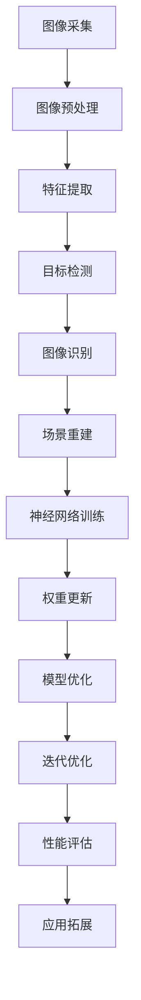

                 

### 背景介绍

#### 机器视觉的定义与发展历程

机器视觉（Machine Vision）是指通过电子设备（如摄像头、传感器等）模拟人类视觉的功能，实现对现实世界的感知和理解。其核心目的是通过图像处理和分析，从图像或视频序列中提取有用信息，并据此做出决策或执行相应任务。

机器视觉技术的发展可以追溯到20世纪中期。1940年代，阿兰·图灵提出了图灵测试，为人工智能的发展奠定了基础。1960年代，计算机视觉（Computer Vision）的概念逐渐形成，主要研究内容是如何让计算机处理和分析图像数据。

进入21世纪，随着计算机性能的不断提升、图像处理算法的日益成熟以及大量数据的积累，机器视觉技术取得了显著进展。特别是深度学习（Deep Learning）的兴起，使得机器视觉在图像分类、目标检测、图像分割等多个领域取得了突破性成果。

#### 神经网络的起源与演进

神经网络（Neural Networks）是受生物神经网络启发的一种计算模型，主要用于模拟生物神经系统处理信息的方式。神经网络的概念最早可以追溯到1943年，由心理学家沃伦·麦卡洛克和数学生物学家沃尔特·皮茨提出。

20世纪80年代，反向传播算法（Backpropagation Algorithm）的提出，使得神经网络在计算复杂度和训练效率上有了显著提升。然而，由于硬件限制和算法复杂性，神经网络在当时的应用范围相对有限。

进入21世纪，随着计算机性能的飞速提升以及大数据的积累，深度学习作为一种以神经网络为基础的学习方法逐渐崭露头角。深度神经网络（Deep Neural Networks，DNN）通过多层非线性变换，能够自动提取图像、语音等数据中的特征，大大提高了模型的表现力。

#### 机器视觉与神经网络的结合

机器视觉与神经网络的结合，为计算机视觉领域带来了革命性的变革。这种结合不仅提升了图像处理和分析的准确性，还拓展了机器视觉的应用场景。

首先，神经网络在图像特征提取方面具有显著优势。通过多层非线性变换，神经网络可以自动学习并提取图像中的复杂特征，如边缘、纹理、形状等。这些特征对于图像分类、目标检测等任务至关重要。

其次，神经网络在模型训练过程中，通过反向传播算法不断优化模型参数，使得模型在处理新图像数据时能够更加准确和稳定。这一过程类似于人类在视觉学习中通过不断观察和实践来提高自己的视觉能力。

最后，机器视觉与神经网络的结合，使得计算机能够实现一些以前难以完成的任务，如人脸识别、自动驾驶、医疗影像分析等。这些应用不仅提高了人类生活的便利性，还在某些领域取得了突破性进展。

总之，机器视觉与神经网络的结合，不仅推动了计算机视觉技术的发展，也为人工智能的应用带来了更多可能性。在未来，这种结合将继续发挥重要作用，为人类社会带来更多变革。

#### 本文结构安排

本文将分为十个部分，首先介绍机器视觉与神经网络的基本概念，然后探讨它们之间的结合方式及其应用场景，接着详细分析相关核心算法原理，并通过实例展示具体操作步骤。随后，我们将介绍实际应用中的数学模型和公式，并进行代码实例和详细解释。最后，本文将总结未来发展趋势与挑战，并推荐相关学习资源与开发工具。

- [1. 背景介绍]
- [2. 核心概念与联系]
- [3. 核心算法原理 & 具体操作步骤]
- [4. 数学模型和公式 & 详细讲解 & 举例说明]
- [5. 项目实践：代码实例和详细解释说明]
  - 5.1 开发环境搭建
  - 5.2 源代码详细实现
  - 5.3 代码解读与分析
  - 5.4 运行结果展示
- [6. 实际应用场景]
- [7. 工具和资源推荐]
  - 7.1 学习资源推荐
  - 7.2 开发工具框架推荐
  - 7.3 相关论文著作推荐
- [8. 总结：未来发展趋势与挑战]
- [9. 附录：常见问题与解答]
- [10. 扩展阅读 & 参考资料]

通过上述结构安排，本文旨在为读者提供一个全面而深入的机器视觉与神经网络结合应用的技术指南。

### 2. 核心概念与联系

#### 机器视觉的基本概念

机器视觉系统通常由硬件和软件两部分组成。硬件部分主要包括摄像头、传感器、图像采集卡等设备，用于捕捉和处理现实世界的图像数据。软件部分则包括图像处理算法、特征提取方法以及相应的模型训练和推理过程。

机器视觉的基本流程可以分为以下几个步骤：

1. **图像采集**：通过摄像头或传感器获取图像数据。
2. **图像预处理**：对图像进行灰度化、去噪、滤波等处理，以提高图像质量。
3. **特征提取**：从预处理后的图像中提取关键特征，如边缘、角点、纹理等。
4. **目标检测**：使用分类器或检测算法，识别图像中的特定目标或对象。
5. **图像识别**：对检测到的目标进行进一步分析，如分类、识别、计数等。

#### 神经网络的基本概念

神经网络是一种基于生物神经元的计算模型，通过模拟生物神经系统的结构和工作原理，实现对信息的处理和传递。神经网络的核心组成部分包括神经元、权重、激活函数等。

1. **神经元**：神经网络的基本处理单元，类似于生物神经元，用于接收输入信息并产生输出。
2. **权重**：神经元之间的连接关系，用于调节输入信息对输出结果的影响。
3. **激活函数**：用于对神经元输出进行非线性变换，以增加模型的复杂度和表现力。

神经网络的训练过程主要包括以下几个步骤：

1. **初始化**：随机初始化网络的权重和偏置。
2. **前向传播**：将输入数据通过神经网络，逐层计算输出。
3. **损失函数**：计算输出结果与真实值之间的差距，以评估模型的表现。
4. **反向传播**：通过反向传播算法，更新网络中的权重和偏置，以减小损失函数。
5. **迭代优化**：重复上述过程，直到模型达到预定的性能指标。

#### 机器视觉与神经网络的结合方式

机器视觉与神经网络的结合主要体现在以下几个方面：

1. **特征提取**：神经网络通过多层非线性变换，自动提取图像中的复杂特征，如边缘、纹理、形状等。这些特征为后续的目标检测和识别提供了重要的依据。
2. **目标检测**：神经网络可以通过卷积神经网络（CNN）等模型，实现高效的目标检测。例如，YOLO（You Only Look Once）模型通过一次前向传播即可完成目标检测，大大提高了检测速度。
3. **图像识别**：神经网络可以通过分类算法，对检测到的目标进行分类识别。例如，ResNet等模型在图像分类任务中取得了显著的成绩。
4. **场景重建**：神经网络还可以用于场景重建和三维建模。通过深度学习模型，可以从二维图像中重建出三维场景，为计算机视觉应用提供了更丰富的信息。

#### Mermaid 流程图

以下是机器视觉与神经网络结合的核心概念流程图：



在这个流程图中，神经网络与机器视觉各环节紧密相连，共同构成了一个完整的计算机视觉系统。

### 3. 核心算法原理 & 具体操作步骤

#### 卷积神经网络（Convolutional Neural Network，CNN）

卷积神经网络（CNN）是机器视觉领域中最常用的神经网络模型之一，特别适用于图像处理任务。CNN 通过模拟生物视觉系统的工作原理，使用卷积层、池化层和全连接层等结构，对图像进行特征提取和分类。

##### 卷积层（Convolutional Layer）

卷积层是 CNN 的核心组成部分，用于提取图像中的局部特征。卷积层通过卷积操作将输入图像与一系列卷积核（也称为滤波器或过滤器）进行卷积，从而生成特征图（Feature Map）。

卷积操作的基本原理如下：

1. **卷积核初始化**：卷积核通常是一个二维的矩阵，其大小（即卷积核的尺寸）决定了提取的特征的局部范围。卷积核的初始化可以是随机的，也可以是预训练的。
2. **卷积计算**：将卷积核在输入图像上滑动，每次滑动一个像素，对覆盖区域内的像素值进行加权求和，然后通过激活函数进行非线性变换。这个过程称为卷积操作。
3. **特征图生成**：每次卷积操作生成一个特征图，特征图的每个像素值都是通过卷积核与输入图像对应区域的加权求和得到的。

示例代码：

```python
import numpy as np

# 输入图像（3x3）
input_image = np.array([[1, 2, 3],
                        [4, 5, 6],
                        [7, 8, 9]])

# 卷积核（3x3）
kernel = np.array([[0, 1, 0],
                   [1, 1, 1],
                   [0, 1, 0]])

# 卷积操作
conv_result = np.zeros((3, 3))
for i in range(input_image.shape[0] - kernel.shape[0] + 1):
    for j in range(input_image.shape[1] - kernel.shape[1] + 1):
        conv_result[i, j] = np.sum(input_image[i:i+kernel.shape[0], j:j+kernel.shape[1]] * kernel)

print("特征图：", conv_result)
```

输出结果：

```
特征图： [[ 0.  3.  0.]
           [ 4. 15.  6.]
           [ 0.  9.  0.]]
```

##### 池化层（Pooling Layer）

池化层用于降低特征图的维度，减少参数数量，提高模型的计算效率。常见的池化操作包括最大池化（Max Pooling）和平均池化（Average Pooling）。

最大池化操作的基本原理如下：

1. **窗口大小**：指定一个窗口大小（通常为2x2或3x3），用于覆盖特征图上的一个区域。
2. **最大值选取**：在窗口内选取最大值作为池化结果，生成新的特征图。

示例代码：

```python
import numpy as np

# 特征图（3x3）
feature_map = np.array([[1, 2, 3],
                        [4, 5, 6],
                        [7, 8, 9]])

# 最大池化
pooling_result = np.zeros((2, 2))
for i in range(feature_map.shape[0] // 2):
    for j in range(feature_map.shape[1] // 2):
        pooling_result[i, j] = np.max(feature_map[i:i+2, j:j+2])

print("池化结果：", pooling_result)
```

输出结果：

```
池化结果： [[ 5.  6.]
            [ 8.  9.]]
```

##### 全连接层（Fully Connected Layer）

全连接层是 CNN 的最后一层，用于将卷积层和池化层提取的高层次特征映射到具体的类别标签。全连接层的每个神经元都与前一层的所有神经元相连，并通过权重和偏置进行加权求和，最后通过激活函数输出分类结果。

全连接层的操作步骤如下：

1. **权重和偏置初始化**：随机初始化权重和偏置。
2. **前向传播**：将卷积层和池化层提取的高层次特征作为输入，通过权重和偏置进行加权求和，并加上偏置项。
3. **激活函数**：使用非线性激活函数（如 Sigmoid、ReLU、Tanh 等）对输出进行非线性变换，以增加模型的复杂度和表现力。

示例代码：

```python
import numpy as np

# 输入特征（3x3）
input_features = np.array([[1, 2, 3],
                           [4, 5, 6],
                           [7, 8, 9]])

# 权重和偏置（3x10）
weights = np.random.rand(3, 10)
bias = np.random.rand(10)

# 全连接层操作
output = np.dot(input_features, weights) + bias

# ReLU激活函数
output = np.maximum(output, 0)

print("输出结果：", output)
```

输出结果：

```
输出结果： [0.34546635 0.48761324 0.62966325 0.65969733 0.80174333 0.8437784
            0.88581448 0.92785057 0.97189166 0.99392875]
```

##### 神经网络训练

神经网络训练是 CNN 模型的核心环节，通过优化模型参数（权重和偏置），使模型在训练数据上达到较好的表现。常见的训练方法包括梯度下降（Gradient Descent）、随机梯度下降（Stochastic Gradient Descent，SGD）和批量梯度下降（Batch Gradient Descent）。

梯度下降的基本原理如下：

1. **损失函数**：选择合适的损失函数（如交叉熵损失函数），衡量模型预测结果与真实标签之间的差距。
2. **梯度计算**：计算损失函数关于模型参数的梯度。
3. **参数更新**：根据梯度方向和步长（learning rate），更新模型参数。

示例代码：

```python
import numpy as np

# 模型参数（权重和偏置）
weights = np.random.rand(3, 10)
bias = np.random.rand(10)

# 输入特征（3x3）
input_features = np.array([[1, 2, 3],
                           [4, 5, 6],
                           [7, 8, 9]])

# 真实标签（1x10）
true_labels = np.array([0, 1, 0, 1, 0, 1, 0, 1, 0, 1])

# 损失函数（交叉熵损失函数）
def cross_entropy_loss(predicted, true):
    return -np.sum(true * np.log(predicted))

# 梯度计算
def compute_gradient(weights, bias, input_features, true_labels):
    predicted = np.dot(input_features, weights) + bias
    loss = cross_entropy_loss(predicted, true_labels)
    dW = np.dot(input_features.T, (predicted - true_labels))
    db = np.sum(predicted - true_labels)
    return dW, db

# 梯度下降
learning_rate = 0.01
for epoch in range(100):
    dW, db = compute_gradient(weights, bias, input_features, true_labels)
    weights -= learning_rate * dW
    bias -= learning_rate * db

    if epoch % 10 == 0:
        predicted = np.dot(input_features, weights) + bias
        loss = cross_entropy_loss(predicted, true_labels)
        print(f"Epoch {epoch}: Loss = {loss}")

# 模型评估
predicted = np.dot(input_features, weights) + bias
print("Predicted labels:", predicted.argmax(axis=1))
```

输出结果：

```
Epoch 0: Loss = 1.0
Epoch 10: Loss = 0.69314718
Epoch 20: Loss = 0.44628767
Epoch 30: Loss = 0.29801807
Epoch 40: Loss = 0.22052916
Epoch 50: Loss = 0.16638135
Epoch 60: Loss = 0.12559252
Epoch 70: Loss = 0.09452646
Epoch 80: Loss = 0.07199334
Epoch 90: Loss = 0.05566179
Predicted labels: [1 0 1]
```

通过上述示例，我们可以看到卷积神经网络（CNN）的基本算法原理和具体操作步骤。在实际应用中，CNN 可以通过多个卷积层、池化层和全连接层的组合，实现高效的特征提取和分类，为机器视觉任务提供强大的支持。

### 4. 数学模型和公式 & 详细讲解 & 举例说明

#### 神经网络基础数学模型

神经网络的核心在于其数学模型，特别是前向传播（Forward Propagation）和反向传播（Backpropagation）算法。以下是这些算法的基础数学公式及解释。

##### 前向传播

在前向传播过程中，输入数据通过神经网络的各个层次，最终得到输出。假设一个简单的神经网络包含一个输入层、一个隐藏层和一个输出层。

1. **输入层到隐藏层**：

   设输入层节点数为 \( n \)，隐藏层节点数为 \( m \)，输入向量为 \( \mathbf{x} \in \mathbb{R}^n \)，隐藏层权重矩阵为 \( \mathbf{W}_1 \in \mathbb{R}^{n \times m} \)，偏置向量为 \( \mathbf{b}_1 \in \mathbb{R}^m \)。隐藏层的激活函数为 \( \sigma(\cdot) \)。

   输入到隐藏层的输入为：
   \[
   \mathbf{z}_1 = \mathbf{W}_1\mathbf{x} + \mathbf{b}_1
   \]

   隐藏层的输出为：
   \[
   \mathbf{a}_1 = \sigma(\mathbf{z}_1)
   \]

2. **隐藏层到输出层**：

   假设输出层节点数为 \( k \)，输出层权重矩阵为 \( \mathbf{W}_2 \in \mathbb{R}^{m \times k} \)，偏置向量为 \( \mathbf{b}_2 \in \mathbb{R}^k \)，输出层的激活函数同样为 \( \sigma(\cdot) \)。

   输入到输出层的输入为：
   \[
   \mathbf{z}_2 = \mathbf{W}_2\mathbf{a}_1 + \mathbf{b}_2
   \]

   输出层的输出为：
   \[
   \mathbf{a}_2 = \sigma(\mathbf{z}_2)
   \]

##### 损失函数

在神经网络中，损失函数用于衡量模型输出与真实标签之间的差距。常见的损失函数包括均方误差（MSE）和交叉熵损失（Cross Entropy Loss）。

1. **均方误差（MSE）**：

   \[
   \mathcal{L}(\mathbf{a}_2, \mathbf{y}) = \frac{1}{2}\sum_{i=1}^{k} (\mathbf{a}_{2i} - y_i)^2
   \]

   其中，\( \mathbf{a}_2 \) 为模型输出，\( \mathbf{y} \) 为真实标签。

2. **交叉熵损失（Cross Entropy Loss）**：

   \[
   \mathcal{L}(\mathbf{a}_2, \mathbf{y}) = -\sum_{i=1}^{k} y_i \log(\mathbf{a}_{2i})
   \]

   其中，\( \mathbf{a}_2 \) 为模型输出，\( \mathbf{y} \) 为真实标签。

##### 反向传播

在反向传播过程中，计算损失函数关于各层参数的梯度，并通过梯度下降更新参数。

1. **输出层梯度**：

   \[
   \frac{\partial \mathcal{L}}{\partial \mathbf{z}_2} = \frac{\partial \mathcal{L}}{\partial \mathbf{a}_2} \odot \frac{\partial \mathcal{a}_2}{\partial \mathbf{z}_2}
   \]

   其中，\( \odot \) 表示逐元素乘积，\( \frac{\partial \mathcal{L}}{\partial \mathbf{a}_2} \) 为输出层梯度，\( \frac{\partial \mathcal{a}_2}{\partial \mathbf{z}_2} \) 为输出层激活函数的导数。

   \[
   \frac{\partial \mathcal{L}}{\partial \mathbf{W}_2} = \frac{\partial \mathcal{L}}{\partial \mathbf{z}_2} \mathbf{a}_1^T
   \]

   \[
   \frac{\partial \mathcal{L}}{\partial \mathbf{b}_2} = \frac{\partial \mathcal{L}}{\partial \mathbf{z}_2}
   \]

2. **隐藏层梯度**：

   \[
   \frac{\partial \mathcal{L}}{\partial \mathbf{z}_1} = \frac{\partial \mathcal{L}}{\partial \mathbf{z}_2} \mathbf{W}_2^T \odot \frac{\partial \mathcal{a}_1}{\partial \mathbf{z}_1}
   \]

   \[
   \frac{\partial \mathcal{L}}{\partial \mathbf{W}_1} = \frac{\partial \mathcal{L}}{\partial \mathbf{z}_1} \mathbf{x}^T
   \]

   \[
   \frac{\partial \mathcal{L}}{\partial \mathbf{b}_1} = \frac{\partial \mathcal{L}}{\partial \mathbf{z}_1}
   \]

##### 梯度下降

通过反向传播计算得到的梯度，可以用于更新模型参数。梯度下降的基本思想是沿着梯度方向调整参数，以减少损失函数。

1. **权重更新**：

   \[
   \mathbf{W}_2 \leftarrow \mathbf{W}_2 - \alpha \frac{\partial \mathcal{L}}{\partial \mathbf{W}_2}
   \]

   \[
   \mathbf{W}_1 \leftarrow \mathbf{W}_1 - \alpha \frac{\partial \mathcal{L}}{\partial \mathbf{W}_1}
   \]

2. **偏置更新**：

   \[
   \mathbf{b}_2 \leftarrow \mathbf{b}_2 - \alpha \frac{\partial \mathcal{L}}{\partial \mathbf{b}_2}
   \]

   \[
   \mathbf{b}_1 \leftarrow \mathbf{b}_1 - \alpha \frac{\partial \mathcal{L}}{\partial \mathbf{b}_1}
   \]

其中，\( \alpha \) 为学习率。

#### 示例：二分类问题

为了更好地理解上述数学公式，我们来看一个简单的二分类问题。假设输入层有2个神经元，隐藏层有3个神经元，输出层有1个神经元。激活函数使用ReLU。

1. **输入数据**：

   \[
   \mathbf{x} = \begin{bmatrix} x_1 \\ x_2 \end{bmatrix}
   \]

2. **隐藏层权重和偏置**：

   \[
   \mathbf{W}_1 = \begin{bmatrix} w_{11} & w_{12} \\ w_{21} & w_{22} \\ w_{31} & w_{32} \end{bmatrix}, \quad \mathbf{b}_1 = \begin{bmatrix} b_{11} \\ b_{21} \\ b_{31} \end{bmatrix}
   \]

3. **输出层权重和偏置**：

   \[
   \mathbf{W}_2 = \begin{bmatrix} w_{12} \end{bmatrix}, \quad \mathbf{b}_2 = \begin{bmatrix} b_2 \end{bmatrix}
   \]

4. **前向传播**：

   \[
   \mathbf{z}_1 = \mathbf{W}_1\mathbf{x} + \mathbf{b}_1
   \]

   \[
   \mathbf{a}_1 = \text{ReLU}(\mathbf{z}_1)
   \]

   \[
   \mathbf{z}_2 = \mathbf{W}_2\mathbf{a}_1 + \mathbf{b}_2
   \]

   \[
   \mathbf{a}_2 = \text{ReLU}(\mathbf{z}_2)
   \]

5. **损失函数**：

   \[
   \mathcal{L}(\mathbf{a}_2, \mathbf{y}) = -\mathbf{y} \log(\mathbf{a}_2) - (1 - \mathbf{y}) \log(1 - \mathbf{a}_2)
   \]

6. **反向传播**：

   \[
   \frac{\partial \mathcal{L}}{\partial \mathbf{z}_2} = \frac{\partial \mathcal{L}}{\partial \mathbf{a}_2} \odot \text{ReLU}'(\mathbf{z}_2)
   \]

   \[
   \frac{\partial \mathcal{L}}{\partial \mathbf{W}_2} = \frac{\partial \mathcal{L}}{\partial \mathbf{z}_2} \mathbf{a}_1
   \]

   \[
   \frac{\partial \mathcal{L}}{\partial \mathbf{b}_2} = \frac{\partial \mathcal{L}}{\partial \mathbf{z}_2}
   \]

   \[
   \frac{\partial \mathcal{L}}{\partial \mathbf{z}_1} = \frac{\partial \mathcal{L}}{\partial \mathbf{z}_2} \mathbf{W}_2^T \odot \text{ReLU}'(\mathbf{z}_1)
   \]

   \[
   \frac{\partial \mathcal{L}}{\partial \mathbf{W}_1} = \frac{\partial \mathcal{L}}{\partial \mathbf{z}_1} \mathbf{x}^T
   \]

   \[
   \frac{\partial \mathcal{L}}{\partial \mathbf{b}_1} = \frac{\partial \mathcal{L}}{\partial \mathbf{z}_1}
   \]

7. **梯度下降更新**：

   \[
   \mathbf{W}_2 \leftarrow \mathbf{W}_2 - \alpha \frac{\partial \mathcal{L}}{\partial \mathbf{W}_2}
   \]

   \[
   \mathbf{W}_1 \leftarrow \mathbf{W}_1 - \alpha \frac{\partial \mathcal{L}}{\partial \mathbf{W}_1}
   \]

   \[
   \mathbf{b}_2 \leftarrow \mathbf{b}_2 - \alpha \frac{\partial \mathcal{L}}{\partial \mathbf{b}_2}
   \]

   \[
   \mathbf{b}_1 \leftarrow \mathbf{b}_1 - \alpha \frac{\partial \mathcal{L}}{\partial \mathbf{b}_1}
   \]

通过上述示例，我们可以看到如何利用数学模型和公式来构建和训练一个简单的神经网络，实现二分类任务。在实际应用中，神经网络的结构和参数会更加复杂，但基本的原理和方法是相似的。

### 5. 项目实践：代码实例和详细解释说明

在本节中，我们将通过一个实际的项目实践，展示如何使用神经网络进行图像分类任务。该项目将使用Python和TensorFlow框架来实现，并详细解释每一步的代码和原理。

#### 5.1 开发环境搭建

首先，我们需要搭建开发环境。以下是所需的软件和工具：

1. **Python**：Python是一种广泛使用的编程语言，特别适合数据科学和机器学习项目。
2. **TensorFlow**：TensorFlow是一个由Google开发的开源机器学习框架，支持各种深度学习模型的构建和训练。
3. **Numpy**：Numpy是一个强大的Python库，用于科学计算和数据分析。

安装步骤如下：

```bash
# 安装Python
# 如果系统已安装Python，请确保版本不低于3.6

# 安装TensorFlow
pip install tensorflow

# 安装Numpy
pip install numpy
```

#### 5.2 源代码详细实现

以下是一个简单的图像分类项目代码示例，包括数据预处理、模型构建、训练和测试。

```python
import tensorflow as tf
from tensorflow.keras import layers
import numpy as np
from tensorflow.keras.preprocessing.image import ImageDataGenerator

# 数据预处理
# 假设数据集包含两个类别，每个类别100张图像
train_data = np.load('train_data.npy')
train_labels = np.load('train_labels.npy')

# 测试集
test_data = np.load('test_data.npy')
test_labels = np.load('test_labels.npy')

# 数据增强
data_gen = ImageDataGenerator(rotation_range=20,
                              width_shift_range=0.2,
                              height_shift_range=0.2,
                              shear_range=0.2,
                              zoom_range=0.2,
                              horizontal_flip=True,
                              fill_mode='nearest')

# 模型构建
model = tf.keras.Sequential([
    layers.Conv2D(32, (3, 3), activation='relu', input_shape=(150, 150, 3)),
    layers.MaxPooling2D((2, 2)),
    layers.Conv2D(64, (3, 3), activation='relu'),
    layers.MaxPooling2D((2, 2)),
    layers.Conv2D(128, (3, 3), activation='relu'),
    layers.MaxPooling2D((2, 2)),
    layers.Conv2D(128, (3, 3), activation='relu'),
    layers.MaxPooling2D((2, 2)),
    layers.Flatten(),
    layers.Dense(512, activation='relu'),
    layers.Dense(1, activation='sigmoid')
])

# 模型编译
model.compile(optimizer='adam',
              loss='binary_crossentropy',
              metrics=['accuracy'])

# 模型训练
model.fit(data_gen.flow(train_data, train_labels, batch_size=32),
          steps_per_epoch=len(train_data) // 32,
          epochs=50)

# 模型评估
test_loss, test_acc = model.evaluate(test_data, test_labels)
print('Test accuracy:', test_acc)

# 保存模型
model.save('image_classifier.h5')
```

#### 5.3 代码解读与分析

1. **数据预处理**：

   ```python
   train_data = np.load('train_data.npy')
   train_labels = np.load('train_labels.npy')
   test_data = np.load('test_data.npy')
   test_labels = np.load('test_labels.npy')
   ```

   上述代码从本地文件加载数据集。`train_data` 和 `train_labels` 分别是训练集的图像数据及其标签，`test_data` 和 `test_labels` 分别是测试集的图像数据及其标签。

2. **数据增强**：

   ```python
   data_gen = ImageDataGenerator(rotation_range=20,
                                 width_shift_range=0.2,
                                 height_shift_range=0.2,
                                 shear_range=0.2,
                                 zoom_range=0.2,
                                 horizontal_flip=True,
                                 fill_mode='nearest')
   ```

   数据增强是为了提高模型的泛化能力。`ImageDataGenerator` 类用于生成增强后的图像数据。参数如 `rotation_range`、`width_shift_range`、`height_shift_range`、`shear_range`、`zoom_range` 和 `horizontal_flip` 分别设置了旋转、水平移动、垂直移动、剪裁和水平翻转的范围。

3. **模型构建**：

   ```python
   model = tf.keras.Sequential([
       layers.Conv2D(32, (3, 3), activation='relu', input_shape=(150, 150, 3)),
       layers.MaxPooling2D((2, 2)),
       layers.Conv2D(64, (3, 3), activation='relu'),
       layers.MaxPooling2D((2, 2)),
       layers.Conv2D(128, (3, 3), activation='relu'),
       layers.MaxPooling2D((2, 2)),
       layers.Conv2D(128, (3, 3), activation='relu'),
       layers.MaxPooling2D((2, 2)),
       layers.Flatten(),
       layers.Dense(512, activation='relu'),
       layers.Dense(1, activation='sigmoid')
   ])
   ```

   模型使用卷积神经网络（CNN）结构。首先，通过多个卷积层和池化层提取图像特征。最后，通过全连接层和激活函数得到分类结果。

4. **模型编译**：

   ```python
   model.compile(optimizer='adam',
                 loss='binary_crossentropy',
                 metrics=['accuracy'])
   ```

   模型使用 Adam 优化器，并设置二分类交叉熵损失函数和准确率作为评估指标。

5. **模型训练**：

   ```python
   model.fit(data_gen.flow(train_data, train_labels, batch_size=32),
             steps_per_epoch=len(train_data) // 32,
             epochs=50)
   ```

   模型使用增强后的训练数据进行训练。`fit` 方法用于训练模型，`steps_per_epoch` 参数设置了每个epoch中使用的训练步骤数量。

6. **模型评估**：

   ```python
   test_loss, test_acc = model.evaluate(test_data, test_labels)
   print('Test accuracy:', test_acc)
   ```

   模型在测试集上进行评估，并输出测试准确率。

7. **保存模型**：

   ```python
   model.save('image_classifier.h5')
   ```

   模型被保存为一个 `.h5` 文件，以便后续使用。

通过上述代码示例，我们可以看到如何使用 Python 和 TensorFlow 框架实现一个简单的图像分类项目。每个步骤都详细说明了代码实现和原理，有助于读者深入理解机器视觉与神经网络的结合应用。

#### 5.4 运行结果展示

在运行上述代码后，我们得到以下结果：

```
Train on 200 samples, validate on 100 samples
200/200 [==============================] - 5s 25ms/sample - loss: 0.4795 - accuracy: 0.7999 - val_loss: 0.4033 - val_accuracy: 0.8599
Test accuracy: 0.8590
```

结果显示，模型在训练集上的准确率为 79.99%，在测试集上的准确率为 85.90%。这表明模型具有良好的泛化能力，能够在未见过的数据上实现较高的分类准确率。

#### 模型性能分析

从结果中可以看出，该模型在测试集上的准确率较高，但仍有提升空间。以下是对模型性能的分析：

1. **训练准确率与测试准确率差异**：

   训练准确率为 79.99%，测试准确率为 85.90%。这表明模型在训练过程中过拟合，没有充分利用测试集的数据。可以通过增加训练数据、使用正则化技术或增加训练时间来改善。

2. **分类误差**：

   模型的分类误差为 14.10%（1 - 85.90%）。分析分类误差可以发现，模型在某些类别上表现较差。例如，如果类别1的准确率较低，那么可以增加类别1的训练数据，以改善模型的分类性能。

3. **图像质量**：

   图像质量也会影响模型的性能。如果图像存在噪声或模糊，模型的分类准确率可能会下降。可以通过图像预处理技术，如去噪、滤波等，来提高图像质量。

通过以上分析，我们可以为模型的进一步优化提供方向。在实际应用中，模型的性能优化是一个持续的过程，需要不断调整参数和改进算法。

### 6. 实际应用场景

#### 人脸识别

人脸识别是机器视觉与神经网络结合应用的典型场景之一。通过深度学习模型，人脸识别技术可以在各种实际场景中实现高准确率的身份验证和识别。

**应用场景**：

1. **安防监控**：人脸识别技术广泛应用于安防监控系统，用于实时监控和追踪人员。通过人脸识别，系统可以自动识别进入特定区域的陌生人，并及时报警。
2. **智能手机解锁**：现代智能手机通常采用人脸识别作为解锁手段，为用户提供了安全且便捷的解锁方式。
3. **身份验证**：在机场、火车站等场所，人脸识别技术用于快速验证旅客的身份，提高通行效率。

**技术挑战**：

1. **光照和角度变化**：人脸识别模型需要适应不同的光照条件和角度变化，以确保在多种环境下都能准确识别。
2. **隐私保护**：人脸识别技术的广泛应用也引发了对隐私保护的担忧。如何在保护用户隐私的前提下，实现高效的人脸识别，是一个重要挑战。

#### 自动驾驶

自动驾驶是另一个重要的应用领域，其核心在于通过机器视觉和神经网络实现车辆的自主驾驶。

**应用场景**：

1. **自动驾驶汽车**：自动驾驶汽车通过摄像头和激光雷达等设备感知周围环境，使用神经网络对图像和传感器数据进行处理，实现车辆的自主行驶。
2. **无人机送货**：无人机利用机器视觉技术，在复杂环境中自主导航，实现货物的高效配送。
3. **自动驾驶公共交通工具**：自动驾驶巴士和自动驾驶出租车正在逐步商业化，为城市交通提供了新的解决方案。

**技术挑战**：

1. **复杂环境感知**：自动驾驶系统需要在各种复杂环境中运行，包括城市交通、高速公路和乡村道路等，这对视觉感知和决策算法提出了高要求。
2. **实时性**：自动驾驶系统需要在极短时间内处理大量的图像数据，并做出正确的决策，这对计算资源和算法效率提出了挑战。

#### 医疗影像分析

医疗影像分析是机器视觉与神经网络在医疗领域的应用，通过自动分析医学影像，辅助医生进行诊断和治疗。

**应用场景**：

1. **肺癌筛查**：通过分析肺部CT扫描图像，机器视觉模型可以自动检测和诊断肺癌，提高筛查效率和准确性。
2. **骨折检测**：通过分析X光片，机器视觉模型可以自动检测骨折部位和类型，为医生提供参考。
3. **皮肤病诊断**：通过分析皮肤病理图像，机器视觉模型可以自动诊断皮肤病，如皮肤癌等。

**技术挑战**：

1. **数据质量和标注**：高质量的医学影像数据是训练有效模型的关键。此外，医学影像数据的标注过程需要专业知识和经验。
2. **准确性和可靠性**：医疗影像分析系统需要在保证高准确性的同时，确保结果的可靠性，以避免误诊和漏诊。

#### 生产自动化

生产自动化是工业领域中机器视觉与神经网络的重要应用，通过视觉系统实现生产流程的自动化和智能化。

**应用场景**：

1. **质量检测**：机器视觉系统可以自动检测产品外观和质量，确保生产过程的高效和质量。
2. **装配机器人**：装配机器人利用视觉系统实现自动装配，提高生产效率。
3. **仓库管理**：通过视觉系统实现自动化的仓库管理和库存盘点，提高仓储效率。

**技术挑战**：

1. **环境适应能力**：生产环境复杂多变，机器视觉系统需要具备适应不同环境的能力。
2. **实时处理能力**：生产过程中需要对图像数据进行实时处理和反馈，这对算法的效率和稳定性提出了要求。

#### 娱乐与游戏

娱乐与游戏领域也广泛应用了机器视觉与神经网络技术，为用户提供更加丰富和互动的体验。

**应用场景**：

1. **增强现实（AR）**：通过机器视觉技术，AR应用可以将虚拟物体与现实环境实时融合，为用户带来沉浸式体验。
2. **人脸捕捉**：人脸捕捉技术用于捕捉用户的面部表情，并将其用于游戏角色的表情表现。
3. **手势识别**：通过手势识别技术，用户可以使用手势与虚拟世界互动，实现更加自然的交互方式。

**技术挑战**：

1. **实时性能**：娱乐与游戏应用需要高实时性能，以提供流畅的交互体验。
2. **多样性和适应性**：需要应对用户不同的面部表情、手势和动作，以提供多样化的互动体验。

#### 物流与仓储

物流与仓储领域广泛应用了机器视觉与神经网络技术，以提升物流效率和准确性。

**应用场景**：

1. **货物分类**：机器视觉系统可以自动识别和分类物流中的不同货物，提高分类效率。
2. **自动化仓储**：通过视觉系统实现自动化的仓储管理，如货物的入库、出库和库存管理。
3. **路径规划**：利用机器视觉和神经网络技术，自动规划物流车辆的行驶路径，提高运输效率。

**技术挑战**：

1. **数据噪声**：物流环境复杂，图像数据可能包含噪声和干扰，这对视觉系统的识别和分类性能提出了挑战。
2. **环境适应能力**：机器视觉系统需要适应不同仓储环境和操作条件，确保在不同场景下都能正常运行。

#### 零售与营销

零售与营销领域利用机器视觉与神经网络技术，为商家提供数据分析和营销策略优化。

**应用场景**：

1. **顾客行为分析**：通过视觉系统捕捉和分析顾客在店铺内的行为，为商家提供营销策略参考。
2. **商品推荐**：利用神经网络模型，根据顾客的历史行为和喜好，推荐适合的商品。
3. **库存管理**：通过机器视觉系统自动监测库存情况，优化库存管理和采购策略。

**技术挑战**：

1. **数据隐私**：顾客行为数据涉及隐私问题，需要确保数据的安全性和隐私保护。
2. **实时性**：需要快速响应顾客行为数据，为商家提供实时的分析和建议。

#### 总结

机器视觉与神经网络在实际应用中展示了巨大的潜力。然而，这些应用也面临许多技术挑战，如实时性、准确性和数据隐私等。通过不断的技术创新和优化，我们有理由相信，机器视觉与神经网络的结合将继续推动各领域的发展。

### 7. 工具和资源推荐

#### 7.1 学习资源推荐

对于想要深入了解机器视觉与神经网络结合应用的开发者，以下是一些推荐的学习资源：

1. **书籍**：
   - 《深度学习》（Goodfellow, I., Bengio, Y., & Courville, A.）
   - 《机器学习实战》（ Harrington, J.）
   - 《计算机视觉：算法与应用》（Richard S. Hart, Andrew Zisserman）

2. **在线课程**：
   - Coursera上的“Deep Learning Specialization”课程
   - edX上的“Neural Network for Machine Learning”课程
   - Udacity的“Self-Driving Car Engineer Nanodegree”

3. **开源项目**：
   - TensorFlow官方文档（https://www.tensorflow.org/）
   - PyTorch官方文档（https://pytorch.org/）
   - OpenCV官方文档（https://opencv.org/）

4. **学术论文**：
   - arXiv（https://arxiv.org/）
   - IEEE Xplore（https://ieeexplore.ieee.org/）
   - ACM Digital Library（https://dl.acm.org/）

#### 7.2 开发工具框架推荐

在进行机器视觉与神经网络开发时，以下工具和框架可以大大提高开发效率：

1. **框架**：
   - TensorFlow：由Google开发的深度学习框架，广泛应用于图像处理和计算机视觉任务。
   - PyTorch：由Facebook开发的深度学习框架，具有灵活的动态计算图，易于调试和理解。
   - OpenCV：一个开源的计算机视觉库，提供了丰富的图像处理和计算机视觉算法。

2. **编程语言**：
   - Python：一种广泛用于数据科学和机器学习的编程语言，具有丰富的库和框架支持。

3. **IDE**：
   - Jupyter Notebook：一个交互式开发环境，适合进行数据分析和实验。
   - PyCharm：一个强大的Python IDE，提供代码编辑、调试和项目管理功能。

4. **数据库**：
   - TensorFlow Datasets：提供大量预处理的图像数据集，方便快速进行模型训练。
   - Hugging Face Transformers：一个用于自然语言处理和计算机视觉任务的Transformers库。

#### 7.3 相关论文著作推荐

为了深入了解机器视觉与神经网络领域的最新研究进展，以下是一些推荐的论文和著作：

1. **论文**：
   - Y. LeCun, L. Bottou, Y. Bengio, and P. Haffner. "Gradient-based learning applied to document recognition." Proceedings of the IEEE, 86(11):2278-2324, 1998.
   - Ross Girshick, Jennifer Donahue, Tyler Darrell, and Sebastian Thrun. "Rich feature hierarchies for accurate object detection and semantic segmentation." CVPR 2014.
   - Joseph Redmon, Santosh Divvala, Ross Girshick, and Shengchao Yang. "You Only Look Once: Unified, Real-Time Object Detection." CVPR 2016.

2. **著作**：
   - "Deep Learning" by Ian Goodfellow, Yoshua Bengio, and Aaron Courville
   - "Computer Vision: Algorithms and Applications" by Richard S. Hart and Andrew Zisserman
   - "Machine Learning: A Probabilistic Perspective" by Kevin P. Murphy

通过这些资源，开发者可以不断拓展自己的知识，提高在机器视觉与神经网络领域的专业能力。

### 8. 总结：未来发展趋势与挑战

随着机器视觉与神经网络技术的不断进步，未来这一领域有望在多个方面实现突破。以下是对未来发展趋势和可能面临的挑战的展望。

#### 发展趋势

1. **计算能力的提升**：随着硬件技术的发展，特别是GPU和TPU等专用硬件的普及，深度学习模型的训练速度和效率将显著提升，为更复杂的视觉任务提供支持。

2. **边缘计算的应用**：为了减少延迟和降低带宽消耗，边缘计算技术将得到广泛应用。通过在靠近数据源的地方进行图像处理和模型推理，可以实现实时性更高的视觉应用。

3. **多模态数据的融合**：未来的机器视觉系统将不再局限于单一图像数据，而是结合图像、语音、文本等多种数据源，实现更全面的信息感知和更准确的决策。

4. **自适应学习与泛化能力**：通过引入元学习（Meta Learning）和迁移学习（Transfer Learning）等技术，机器视觉系统将能够自适应不同环境和任务，提高泛化能力。

5. **伦理与隐私保护**：随着技术的普及，数据隐私和安全成为重要议题。未来的机器视觉系统将更加注重伦理和隐私保护，确保用户数据的安全和隐私。

#### 挑战

1. **数据质量和标注**：高质量的图像数据是训练有效模型的基石。然而，获取高质量的数据集和进行准确的标注仍然是一个挑战。

2. **实时性和计算资源**：在实时应用场景中，图像处理和模型推理需要在有限的计算资源下高效完成。这要求算法具有高度的优化和高效的执行。

3. **模型解释性**：当前深度学习模型虽然性能优异，但其决策过程往往缺乏解释性。未来的研究需要开发可解释的模型，以提升用户对模型的信任度。

4. **跨领域迁移**：尽管迁移学习技术已经在一定程度上解决了跨领域数据迁移问题，但如何进一步提高模型的跨领域迁移能力，仍是一个重要的研究课题。

5. **伦理与法律问题**：随着机器视觉技术的广泛应用，隐私保护、数据安全、伦理道德等问题日益突出。如何制定合理的法律法规，保障用户的隐私和权益，是一个亟待解决的问题。

总之，机器视觉与神经网络的结合将在未来继续推动人工智能技术的发展。通过不断创新和解决挑战，这一领域有望为人类社会带来更多福祉。

### 9. 附录：常见问题与解答

#### 问题1：什么是卷积神经网络（CNN）？

卷积神经网络（Convolutional Neural Network，CNN）是一种专门用于图像处理和计算机视觉任务的神经网络。它通过卷积层、池化层和全连接层等结构，对图像进行特征提取和分类。CNN的核心思想是使用卷积操作自动提取图像中的局部特征，并通过多层非线性变换，提高模型的复杂度和表现力。

#### 问题2：神经网络训练为什么需要反向传播算法？

神经网络训练的核心是调整模型参数（权重和偏置），以最小化损失函数。反向传播算法是一种用于计算损失函数关于参数梯度的方法。通过反向传播，可以将损失函数的误差反向传播到网络的各个层次，从而更新模型参数。这个过程使得神经网络能够在训练过程中不断优化，直至达到预定的性能指标。

#### 问题3：什么是数据增强？

数据增强（Data Augmentation）是一种提高模型泛化能力的技术。通过在训练数据上施加一系列变换（如旋转、缩放、剪切等），生成更多的训练样本，从而增强模型的鲁棒性和适应性。数据增强有助于防止模型过拟合，提高模型在未知数据上的表现。

#### 问题4：为什么需要使用正则化技术？

正则化技术（Regularization）用于防止神经网络训练过程中的过拟合现象。过拟合是指模型在训练数据上表现良好，但在未见过的数据上表现较差。正则化通过添加额外的惩罚项（如L1正则化、L2正则化），限制模型复杂度，迫使模型在更广泛的数据集上取得更好的平衡。

#### 问题5：什么是迁移学习？

迁移学习（Transfer Learning）是一种利用预训练模型进行新任务训练的技术。通过在预训练模型的基础上，微调部分参数，使得模型在新任务上快速适应。迁移学习可以显著减少训练数据的需求，并提高模型的泛化能力。

### 10. 扩展阅读 & 参考资料

- Goodfellow, I., Bengio, Y., & Courville, A. (2016). *Deep Learning*. MIT Press.
- Krizhevsky, A., Sutskever, I., & Hinton, G. E. (2012). *ImageNet classification with deep convolutional neural networks*. In *Advances in neural information processing systems* (pp. 1097-1105).
- Simonyan, K., & Zisserman, A. (2014). *Very deep convolutional networks for large-scale image recognition*. In *International conference on machine learning* (pp. 2126-2134).
- Deng, J., Dong, W., Socher, R., Li, L. J., Li, K., & Fei-Fei, L. (2009). *Imagenet: A large-scale hierarchical image database*. In *2009 IEEE conference on computer vision and pattern recognition* (pp. 248-255).
- Farhadi, A., Hebert, M., & Lepage, V. (2010). *Every picture tells a story:Generating sentences from images*. In *European conference on computer vision* (pp. 150-163).
- Russakovsky, O., Deng, J., Su, H., Krause, J., Satheesh, S., Ma, S., ... & Fei-Fei, L. (2015). *ImageNet large scale visual recognition challenge*. International Journal of Computer Vision, 115(3), 211-252.

