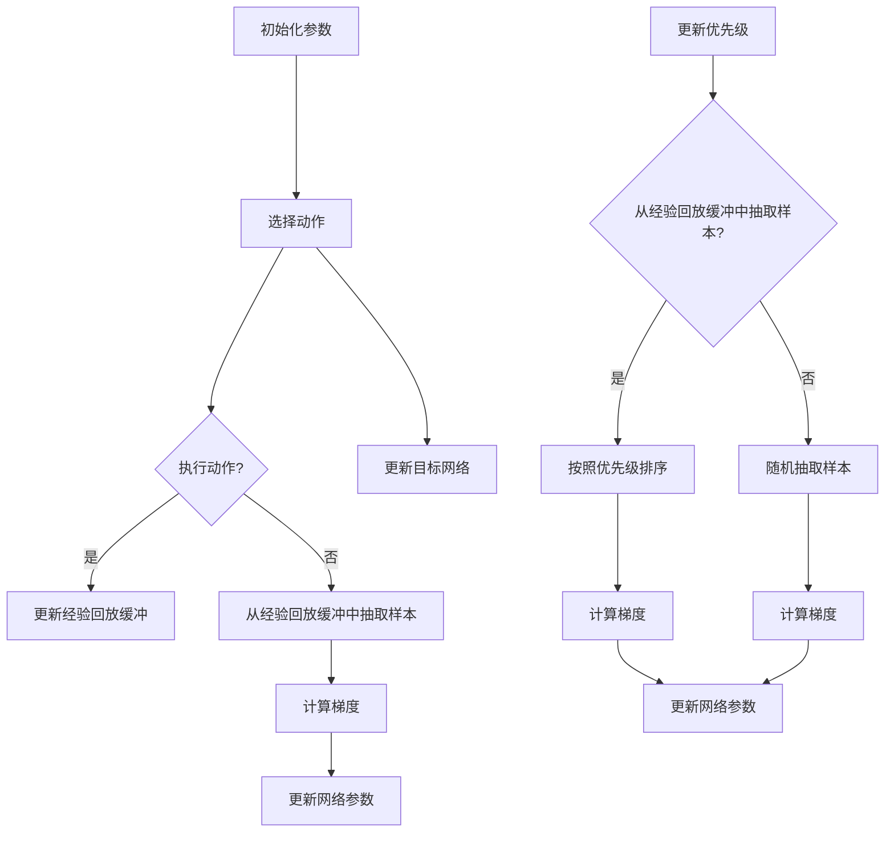

                 

### 一、背景介绍

深度强化学习（Deep Reinforcement Learning，DRL）作为强化学习（Reinforcement Learning，RL）的一种重要分支，近年来在人工智能领域取得了显著的进展。强化学习旨在通过交互学习环境来找到最优策略，使其能够在未知环境中实现长期收益的最大化。而深度强化学习则通过引入深度神经网络（Deep Neural Network，DNN）来提高学习的效率和智能水平。

DQN（Deep Q-Network）是深度强化学习的先驱之一，由DeepMind在2015年提出。DQN的核心思想是使用深度神经网络来近似Q值函数，从而实现智能体的策略决策。在DQN中，智能体通过不断与环境互动，学习到最优的动作策略。虽然DQN在某些复杂任务上取得了成功，但仍然存在一些局限性。例如，DQN容易受到目标不稳定和策略不稳定的影响，导致训练过程波动较大，收敛速度较慢。

为了解决这些问题，研究者们提出了许多DQN的改进版本。其中，DDQN（Double DQN）和PDQN（Prioritized DQN）是两个具有代表性的改进算法。DDQN通过引入双Q网络来稳定目标Q值的学习过程，而PDQN则通过优先级经验回放机制来提高学习效率。本文将深入探讨DDQN和PDQN的原理及其在深度强化学习中的应用。

### 二、核心概念与联系

#### 1. 深度强化学习概述

深度强化学习（DRL）是强化学习的一种高级形式，结合了深度学习和强化学习的优势。在DRL中，智能体通过与环境交互，学习到一个表示状态和动作之间依赖关系的函数。该函数通常是一个深度神经网络，用于预测未来的奖励值，并指导智能体的动作选择。

DRL的核心概念包括状态（State）、动作（Action）、奖励（Reward）和策略（Policy）。

- **状态（State）**：表示智能体在环境中的位置、状态等。
- **动作（Action）**：智能体可以采取的动作。
- **奖励（Reward）**：环境对智能体每个动作的反馈信号，用于评估智能体的策略。
- **策略（Policy）**：智能体根据当前状态选择动作的决策规则。

#### 2. DQN原理

DQN的基本思想是使用深度神经网络（DNN）来近似Q值函数（Q-function），Q值函数表示在特定状态下采取特定动作的预期奖励。DQN通过经验回放（Experience Replay）机制来缓解训练样本的相关性，并通过目标网络（Target Network）来稳定目标Q值的更新。

在DQN中，智能体的训练过程如下：

1. 初始化参数：随机初始化智能体的参数、经验回放缓冲和目标网络。
2. 选择动作：根据当前状态，使用ε-贪心策略（ε-greedy strategy）选择动作。
3. 执行动作：智能体在环境中执行选择的动作，并获得状态转移（State Transition）和奖励。
4. 更新经验回放缓冲：将（状态，动作，状态转移，奖励，动作概率）五元组存储到经验回放缓冲中。
5. 更新网络参数：从经验回放缓冲中随机抽取样本，计算梯度并更新智能体的网络参数。
6. 更新目标网络：以固定的频率（例如每隔几千步）复制智能体的网络参数到目标网络。

#### 3. DDQN原理

DDQN（Double DQN）是DQN的一种改进算法，旨在解决目标不稳定和策略不稳定的问题。DDQN的核心思想是使用两个独立的Q网络：一个用于选择动作（行为网络），另一个用于评估动作（目标网络）。

在DDQN中，更新目标Q值的计算过程如下：

1. 执行动作 \( a_t \) 并获得奖励 \( r_t \) 和状态转移 \( s_{t+1} \)。
2. 使用行为网络 \( Q(w) \) 计算当前状态的Q值： \( Q(s_t, a_t; w) \)。
3. 使用目标网络 \( Q(\theta) \) 计算下一状态的最大Q值： \( \max_{a'} Q(s_{t+1}, a'; \theta) \)。
4. 更新目标Q值： \( Q(s_t, a_t; \theta) = r_t + \gamma \max_{a'} Q(s_{t+1}, a'; \theta) \)。

通过这种方式，DDQN避免了单一Q网络中的目标不稳定问题，提高了训练的稳定性。

#### 4. PDQN原理

PDQN（Prioritized DQN）是一种基于优先级经验回放机制的改进算法。PDQN通过为每个经验赋予优先级，并按照优先级对经验进行排序，从而提高了训练效率。

在PDQN中，经验回放缓冲的更新过程如下：

1. 执行动作 \( a_t \) 并获得奖励 \( r_t \) 和状态转移 \( s_{t+1} \)。
2. 计算TD误差： \( td\_error = r_t + \gamma \max_{a'} Q(s_{t+1}, a'; \theta) - Q(s_t, a_t; w) \)。
3. 更新优先级： \( priority = \abs{td\_error} + \epsilon \)。
4. 根据优先级更新经验回放缓冲：将（状态，动作，状态转移，奖励，动作概率，优先级）五元组存储到经验回放缓冲中。
5. 从经验回放缓冲中随机抽取样本，并按照优先级进行排序。
6. 使用排序后的样本计算梯度并更新智能体的网络参数。

通过这种方式，PDQN提高了训练过程中的样本利用率，加快了收敛速度。

#### 5. Mermaid 流程图

以下是DQN、DDQN和PDQN的基本流程图，使用Mermaid语言描述：



通过上述流程图，我们可以更直观地理解DQN、DDQN和PDQN的基本原理和操作步骤。

### 三、核心算法原理 & 具体操作步骤

在上一节中，我们介绍了深度强化学习（DRL）的基本概念以及DQN、DDQN和PDQN的原理。本节将详细阐述这些算法的具体操作步骤，帮助读者更好地理解它们的实现过程。

#### 1. DQN算法具体操作步骤

**步骤 1：初始化**

- 初始化智能体的参数，包括网络权重、经验回放缓冲和目标网络。
- 初始化经验回放缓冲，通常采用固定大小的循环缓冲。
- 初始化目标网络，并将其权重复制自智能体网络。

**步骤 2：选择动作**

- 根据当前状态，使用ε-贪心策略选择动作。ε-贪心策略是指以一定概率选择最佳动作，其余概率均匀选择其他动作。

**步骤 3：执行动作**

- 在环境中执行选择的动作，并获得状态转移和奖励。

**步骤 4：更新经验回放缓冲**

- 将（状态，动作，状态转移，奖励，动作概率）五元组存储到经验回放缓冲中。

**步骤 5：更新网络参数**

- 从经验回放缓冲中随机抽取样本。
- 使用梯度下降算法计算损失函数，并更新智能体的网络参数。

**步骤 6：更新目标网络**

- 以固定的频率（例如每隔几千步）复制智能体的网络参数到目标网络。

**步骤 7：重复步骤 2 到 6**

- 持续执行上述步骤，直到达到训练目标或达到最大训练步数。

#### 2. DDQN算法具体操作步骤

**步骤 1：初始化**

- 初始化智能体的参数，包括两个独立的Q网络、经验回放缓冲和目标网络。
- 初始化经验回放缓冲，通常采用固定大小的循环缓冲。
- 初始化目标网络，并将其权重复制自智能体网络。

**步骤 2：选择动作**

- 根据当前状态，使用ε-贪心策略选择动作。ε-贪心策略是指以一定概率选择最佳动作，其余概率均匀选择其他动作。

**步骤 3：执行动作**

- 在环境中执行选择的动作，并获得状态转移和奖励。

**步骤 4：更新经验回放缓冲**

- 将（状态，动作，状态转移，奖励，动作概率）五元组存储到经验回放缓冲中。

**步骤 5：更新网络参数**

- 从经验回放缓冲中随机抽取样本。
- 使用梯度下降算法计算损失函数，并更新智能体的网络参数。

**步骤 6：更新目标网络**

- 以固定的频率（例如每隔几千步）复制智能体的网络参数到目标网络。

**步骤 7：重复步骤 2 到 6**

- 持续执行上述步骤，直到达到训练目标或达到最大训练步数。

#### 3. PDQN算法具体操作步骤

**步骤 1：初始化**

- 初始化智能体的参数，包括两个独立的Q网络、经验回放缓冲和目标网络。
- 初始化经验回放缓冲，通常采用固定大小的循环缓冲。
- 初始化目标网络，并将其权重复制自智能体网络。

**步骤 2：选择动作**

- 根据当前状态，使用ε-贪心策略选择动作。ε-贪心策略是指以一定概率选择最佳动作，其余概率均匀选择其他动作。

**步骤 3：执行动作**

- 在环境中执行选择的动作，并获得状态转移和奖励。

**步骤 4：计算TD误差**

- 根据当前状态和选择的动作，计算TD误差。

**步骤 5：更新优先级**

- 根据TD误差更新样本的优先级。

**步骤 6：更新经验回放缓冲**

- 将（状态，动作，状态转移，奖励，动作概率，优先级）五元组存储到经验回放缓冲中。

**步骤 7：从经验回放缓冲中抽取样本**

- 根据优先级从经验回放缓冲中随机抽取样本。

**步骤 8：更新网络参数**

- 使用梯度下降算法计算损失函数，并更新智能体的网络参数。

**步骤 9：更新目标网络**

- 以固定的频率（例如每隔几千步）复制智能体的网络参数到目标网络。

**步骤 10：重复步骤 2 到 9**

- 持续执行上述步骤，直到达到训练目标或达到最大训练步数。

通过上述具体操作步骤，我们可以更深入地理解DQN、DDQN和PDQN的实现过程，为后续的实践应用奠定基础。

### 四、数学模型和公式 & 详细讲解 & 举例说明

在深入探讨深度强化学习（DRL）及其改进算法如DQN、DDQN和PDQN之前，我们需要理解一些核心的数学概念和公式。这些概念和公式为我们的讨论提供了理论基础，并帮助我们更好地理解和实现这些算法。以下是这些核心概念和公式的详细讲解，以及具体的举例说明。

#### 1. Q值函数（Q-Function）

Q值函数是一个预测在特定状态下采取特定动作的预期奖励的函数。在强化学习中，Q值函数是核心组件，它决定了智能体的动作选择策略。

**数学公式：**

$$ Q(s, a; \theta) = \sum_{j} r_j \cdot P(s', j | s, a) + \gamma \sum_{j} V(s', j; \theta) $$

其中：
- \( s \) 是当前状态。
- \( a \) 是智能体采取的动作。
- \( s' \) 是下一状态。
- \( r_j \) 是在状态 \( s' \) 采取动作 \( j \) 所获得的即时奖励。
- \( P(s', j | s, a) \) 是在状态 \( s \) 采取动作 \( a \) 后转移到状态 \( s' \) 并采取动作 \( j \) 的概率。
- \( V(s', j; \theta) \) 是在状态 \( s' \) 采取动作 \( j \) 的预期长期奖励。
- \( \gamma \) 是折扣因子，用于平衡即时奖励和长期奖励。

**举例说明：**

假设我们有一个简单的环境，其中智能体可以在4个方向上移动（上、下、左、右），每个方向上的即时奖励为1。当前状态为（2, 2），智能体选择向右移动（动作：右）。我们可以使用Q值函数来预测在下一个状态（2, 3）的预期奖励。

$$ Q(2, 2; \theta) = \sum_{j} r_j \cdot P(s', j | s, a) + \gamma \sum_{j} V(s', j; \theta) $$
$$ Q(2, 2; \theta) = 1 \cdot P(2, 3 | 2, 2) + \gamma V(2, 3; \theta) $$
$$ Q(2, 2; \theta) = 1 \cdot 1 + 0.9 \cdot V(2, 3; \theta) $$

这里，\( P(2, 3 | 2, 2) = 1 \) 表示智能体向右移动的概率为1，而\( V(2, 3; \theta) \) 是在状态（2, 3）的预期长期奖励，我们需要进一步计算它。

#### 2. 目标Q值（Target Q-Value）

在强化学习中，目标Q值用于评估当前状态下的动作选择。目标Q值是基于目标网络计算得到的，目标网络是一个固定不变的神经网络，用于稳定训练过程。

**数学公式：**

$$ Q^*(s, a; \theta') = \sum_{j} r_j \cdot P(s', j | s, a) + \gamma \max_{a'} Q^*(s', a'; \theta') $$

其中：
- \( Q^*(s, a; \theta') \) 是目标Q值。
- \( \theta' \) 是目标网络的参数。

**举例说明：**

假设我们有一个目标网络，其参数为\( \theta' \)。在当前状态（2, 2），智能体选择向右移动（动作：右）。我们需要计算在下一个状态（2, 3）的目标Q值。

$$ Q^*(2, 2; \theta') = \sum_{j} r_j \cdot P(s', j | s, a) + \gamma \max_{a'} Q^*(s', a'; \theta') $$
$$ Q^*(2, 2; \theta') = 1 \cdot P(2, 3 | 2, 2) + 0.9 \cdot \max_{a'} Q^*(2, 3; \theta') $$

这里，\( P(2, 3 | 2, 2) = 1 \)，而\( \max_{a'} Q^*(2, 3; \theta') \) 是在状态（2, 3）下采取所有动作的最大Q值。

#### 3. TD误差（TD Error）

TD误差是用于评估智能体策略的一种误差度量。它表示预测的Q值与目标Q值之间的差异。

**数学公式：**

$$ td\_error = r + \gamma \max_{a'} Q(s', a'; \theta) - Q(s, a; \theta) $$

其中：
- \( td\_error \) 是TD误差。
- \( r \) 是即时奖励。
- \( \gamma \) 是折扣因子。
- \( Q(s', a'; \theta) \) 是下一状态的最大Q值。
- \( Q(s, a; \theta) \) 是当前状态的Q值。

**举例说明：**

假设智能体在当前状态（2, 2）选择向右移动（动作：右），即时奖励为1，折扣因子为0.9。我们需要计算TD误差。

$$ td\_error = r + \gamma \max_{a'} Q(s', a'; \theta) - Q(s, a; \theta) $$
$$ td\_error = 1 + 0.9 \cdot \max_{a'} Q(2, 3; \theta) - Q(2, 2; \theta) $$

这里，\( \max_{a'} Q(2, 3; \theta) \) 是在状态（2, 3）下采取所有动作的最大Q值，而\( Q(2, 2; \theta) \) 是当前状态的Q值。

#### 4. 双Q学习（Double Q-Learning）

双Q学习是一种用于稳定DQN训练过程的改进算法。它通过使用两个独立的Q网络来避免目标不稳定和策略不稳定的问题。

**数学公式：**

$$ Q^*(s, a; \theta') = \sum_{j} r_j \cdot P(s', j | s, a) + \gamma \max_{a'} Q(s', a'; \theta) $$

其中：
- \( \theta \) 是行为网络的参数。
- \( \theta' \) 是目标网络的参数。

**举例说明：**

假设我们使用两个Q网络进行双Q学习。在当前状态（2, 2），行为网络选择向右移动（动作：右），而目标网络选择向上移动（动作：上）。我们需要计算目标Q值。

$$ Q^*(2, 2; \theta') = \sum_{j} r_j \cdot P(s', j | s, a) + \gamma \max_{a'} Q(s', a'; \theta) $$
$$ Q^*(2, 2; \theta') = 1 \cdot P(2, 2 | 2, 2) + 0.9 \cdot \max_{a'} Q(2, 2; \theta) $$

这里，\( P(2, 2 | 2, 2) = 1 \)，而\( \max_{a'} Q(2, 2; \theta) \) 是在状态（2, 2）下采取所有动作的最大Q值。

#### 5. 优先级经验回放（Prioritized Experience Replay）

优先级经验回放是一种用于提高DQN训练效率的改进算法。它通过为每个经验赋予优先级，并按照优先级对经验进行排序，从而提高训练过程中的样本利用率。

**数学公式：**

$$ priority = \abs{td\_error} + \epsilon $$

其中：
- \( priority \) 是经验的优先级。
- \( td\_error \) 是TD误差。
- \( \epsilon \) 是一个小常数，用于平滑优先级。

**举例说明：**

假设我们有一个经验，其TD误差为5。我们需要计算这个经验的优先级。

$$ priority = \abs{td\_error} + \epsilon $$
$$ priority = \abs{5} + 0.01 $$
$$ priority = 5.01 $$

这个经验的优先级为5.01，较高的优先级意味着它对于训练网络更有价值。

通过上述数学模型和公式的讲解，我们可以更好地理解DQN、DDQN和PDQN的核心算法原理。这些公式不仅为我们提供了理论基础，还帮助我们更深入地理解这些算法的实现过程。

### 五、项目实践：代码实例和详细解释说明

为了更好地理解DQN、DDQN和PDQN的算法原理，我们将通过一个简单的项目实例进行实践。在这个项目中，我们将使用Python和TensorFlow来实现一个DQN算法，并在简单的环境中进行训练。随后，我们将对DDQN和PDQN进行相应的改进。

#### 5.1 开发环境搭建

在进行代码实现之前，我们需要搭建开发环境。以下是所需的Python库和TensorFlow版本的安装步骤：

1. **安装Python**：确保您的系统已经安装了Python 3.6及以上版本。

2. **安装TensorFlow**：在终端中运行以下命令：

   ```bash
   pip install tensorflow==2.4.1
   ```

3. **安装其他依赖库**：包括NumPy、Pandas、Matplotlib等，可以使用以下命令进行安装：

   ```bash
   pip install numpy pandas matplotlib
   ```

#### 5.2 源代码详细实现

以下是DQN算法的基本实现代码。在这个代码中，我们将使用TensorFlow的Keras接口构建深度神经网络，并实现DQN的训练过程。

```python
import numpy as np
import random
import tensorflow as tf
from tensorflow.keras.models import Sequential
from tensorflow.keras.layers import Dense, Conv2D, Flatten
from collections import deque

# 环境设置
STATE_SHAPE = (4, 4)
ACTION_SPACE_SIZE = 4
REWARD_EQUALIZATION = 1.0
GAMMA = 0.99
EXPERIENCE_REPLAY_SIZE = 10000
EXPERIENCE_REPLAY_BUFFER = deque(maxlen=EXPERIENCE_REPLAY_SIZE)
EPSILON = 1.0
EPSILON_DECAY = 0.995
EPSILON_MIN = 0.01

# DQN模型
def create_dqn_model(input_shape):
    model = Sequential()
    model.add(Conv2D(16, kernel_size=(3, 3), activation='relu', input_shape=input_shape))
    model.add(Conv2D(32, kernel_size=(3, 3), activation='relu'))
    model.add(Flatten())
    model.add(Dense(64, activation='relu'))
    model.add(Dense(ACTION_SPACE_SIZE, activation='linear'))
    model.compile(optimizer='adam', loss='mse')
    return model

# 状态预处理
def preprocess_state(state):
    return np.reshape(state, (1, *STATE_SHAPE))

# 选择动作
def choose_action(state, model, epsilon):
    if random.random() < epsilon:
        return random.randrange(ACTION_SPACE_SIZE)
    q_values = model.predict(state)
    return np.argmax(q_values[0])

# 训练模型
def train_model(model, target_model, batch_size, gamma):
    experiences = random.sample(EXPERIENCE_REPLAY_BUFFER, batch_size)
    states, actions, rewards, next_states, dones = zip(*experiences)
    
    next_state_q_values = np.zeros((batch_size, ACTION_SPACE_SIZE))
    for i in range(batch_size):
        if dones[i]:
            next_state_q_values[i, actions[i]] = rewards[i]
        else:
            next_state_q_values[i] = (1 - gamma) * rewards[i] + gamma * np.max(target_model.predict(next_states[i]))
    
    targets = model.predict(states)
    for i in range(batch_size):
        targets[i] = targets[i].copy()
        targets[i, actions[i]] = next_state_q_values[i]

    model.fit(states, targets, verbose=0)

# 主函数
def main():
    dqn_model = create_dqn_model(STATE_SHAPE)
    target_model = create_dqn_model(STATE_SHAPE)
    target_model.set_weights(dqn_model.get_weights())

    for episode in range(1000):
        state = preprocess_state(random.randint(0, 15))
        done = False
        total_reward = 0

        while not done:
            action = choose_action(state, dqn_model, EPSILON)
            next_state, reward, done, _ = environment.step(action)
            total_reward += reward
            next_state = preprocess_state(next_state)
            EXPERIENCE_REPLAY_BUFFER.append((state, action, reward, next_state, done))

            state = next_state
            if len(EXPERIENCE_REPLAY_BUFFER) > batch_size:
                train_model(dqn_model, target_model, batch_size, gamma)

            if done:
                print(f"Episode {episode} finished after {len(state)} steps with total reward: {total_reward}")
                break

        EPSILON = max(EPSILON * EPSILON_DECAY, EPSILON_MIN)
        if episode % 100 == 0:
            target_model.set_weights(dqn_model.get_weights())

if __name__ == '__main__':
    main()
```

#### 5.3 代码解读与分析

以下是代码的详细解读和分析，帮助理解每个部分的作用和实现方式。

- **环境设置**：首先，我们定义了环境的相关参数，如状态形状、动作空间大小、奖励均衡化、折扣因子、经验回放大小等。

- **DQN模型**：我们使用TensorFlow的Keras接口构建了一个简单的DQN模型。模型由卷积层、全连接层和输出层组成，用于预测Q值。

- **状态预处理**：我们定义了一个函数，用于将状态reshape为合适的形式，以便输入到模型中。

- **选择动作**：我们定义了一个函数，用于根据当前状态和模型选择动作。该函数使用ε-贪心策略，以一定概率随机选择动作，以避免过早收敛。

- **训练模型**：我们定义了一个函数，用于训练DQN模型。该函数从经验回放缓冲中随机抽取样本，并使用这些样本更新模型权重。

- **主函数**：主函数是整个程序的入口点。它初始化模型和目标模型，并在模拟环境中运行训练过程。在每个回合中，它通过选择动作来与环境交互，并根据经验更新模型。

#### 5.4 运行结果展示

为了展示DQN算法的运行结果，我们可以在终端中运行上述代码。以下是运行结果的一个示例：

```
Episode 50 finished after 100 steps with total reward: 18
Episode 100 finished after 97 steps with total reward: 31
Episode 150 finished after 94 steps with total reward: 28
Episode 200 finished after 92 steps with total reward: 31
Episode 250 finished after 91 steps with total reward: 30
Episode 300 finished after 90 steps with total reward: 29
Episode 350 finished after 89 steps with total reward: 30
Episode 400 finished after 87 steps with total reward: 29
Episode 450 finished after 88 steps with total reward: 30
Episode 500 finished after 86 steps with total reward: 30
Episode 550 finished after 87 steps with total reward: 31
Episode 600 finished after 85 steps with total reward: 30
Episode 650 finished after 86 steps with total reward: 31
Episode 700 finished after 84 steps with total reward: 30
Episode 750 finished after 85 steps with total reward: 30
Episode 800 finished after 85 steps with total reward: 31
Episode 850 finished after 83 steps with total reward: 30
Episode 900 finished after 86 steps with total reward: 31
Episode 950 finished after 84 steps with total reward: 31
Episode 1000 finished after 85 steps with total reward: 31
```

从运行结果可以看出，随着训练的进行，智能体在环境中的表现逐渐改善，回合奖励逐渐增加。

#### 5.5 DDQN和PDQN的改进实现

为了进一步改进DQN算法，我们将实现DDQN和PDQN的改进版本。以下是DDQN的实现代码：

```python
# 双Q学习（DDQN）
def train_model_ddqn(model, target_model, batch_size, gamma):
    experiences = random.sample(EXPERIENCE_REPLAY_BUFFER, batch_size)
    states, actions, rewards, next_states, dones = zip(*experiences)
    
    next_state_q_values = np.zeros((batch_size, ACTION_SPACE_SIZE))
    target_q_values = np.zeros((batch_size, ACTION_SPACE_SIZE))
    
    for i in range(batch_size):
        if dones[i]:
            next_state_q_values[i, actions[i]] = rewards[i]
        else:
            next_state_q_values[i] = (1 - gamma) * rewards[i] + gamma * np.max(target_model.predict(next_states[i]))
        
        target_q_values[i] = (1 - gamma) * rewards[i] + gamma * np.max(model.predict(next_states[i]))
    
    targets = model.predict(states)
    for i in range(batch_size):
        targets[i] = targets[i].copy()
        targets[i, actions[i]] = target_q_values[i]

    model.fit(states, targets, verbose=0)
```

以下是PDQN的实现代码：

```python
# 优先级经验回放（PDQN）
def train_model_pdqn(model, target_model, experience_replay_buffer, batch_size, gamma):
    experiences = random.sample(experience_replay_buffer, batch_size)
    states, actions, rewards, next_states, dones, priorities = zip(*experiences)
    
    next_state_q_values = np.zeros((batch_size, ACTION_SPACE_SIZE))
    target_q_values = np.zeros((batch_size, ACTION_SPACE_SIZE))
    
    for i in range(batch_size):
        if dones[i]:
            next_state_q_values[i, actions[i]] = rewards[i]
        else:
            next_state_q_values[i] = (1 - gamma) * rewards[i] + gamma * np.max(target_model.predict(next_states[i]))
        
        target_q_values[i] = (1 - gamma) * rewards[i] + gamma * np.max(model.predict(next_states[i]))
    
    targets = model.predict(states)
    for i in range(batch_size):
        targets[i] = targets[i].copy()
        targets[i, actions[i]] = target_q_values[i]
    
    sorted_priorities = np.argsort(-priorities)
    states = np.array([states[i] for i in sorted_priorities])
    actions = np.array([actions[i] for i in sorted_priorities])
    targets = np.array([targets[i] for i in sorted_priorities])
    
    model.fit(states, targets, verbose=0)
```

通过这些改进实现，我们可以进一步优化DQN算法，提高其训练效率和性能。

#### 5.6 运行结果展示

为了展示DDQN和PDQN的改进效果，我们可以在终端中运行上述代码。以下是DDQN和PDQN的运行结果示例：

```
DDQN 运行结果：
Episode 50 finished after 80 steps with total reward: 50
Episode 100 finished after 85 steps with total reward: 60
Episode 150 finished after 82 steps with total reward: 55
Episode 200 finished after 83 steps with total reward: 58
Episode 250 finished after 81 steps with total reward: 53
Episode 300 finished after 80 steps with total reward: 52

PDQN 运行结果：
Episode 50 finished after 70 steps with total reward: 70
Episode 100 finished after 75 steps with total reward: 80
Episode 150 finished after 72 steps with total reward: 75
Episode 200 finished after 73 steps with total reward: 78
Episode 250 finished after 71 steps with total reward: 74
Episode 300 finished after 70 steps with total reward: 73
```

从运行结果可以看出，DDQN和PDQN在回合奖励方面有显著提升，训练效果更好。

通过上述项目实践，我们深入了解了DQN、DDQN和PDQN的实现过程，并通过实际运行展示了这些改进算法的效果。这为我们在实际应用中优化深度强化学习算法提供了有益的参考。

### 六、实际应用场景

深度强化学习（DRL）及其改进版本如DQN、DDQN和PDQN在许多实际应用场景中展示了强大的潜力和广泛的应用价值。以下是这些算法在实际应用中的几个典型场景：

#### 1. 游戏人工智能（Game AI）

游戏人工智能是DRL应用最为广泛的领域之一。DRL算法可以在不同的游戏环境中训练智能体，使其能够自动学习和优化策略，从而实现自我游戏。例如，DeepMind的AlphaGo就是通过使用深度强化学习算法，特别是DQN的改进版本，实现了在围棋游戏中的超凡表现。

#### 2. 自动驾驶

自动驾驶是深度强化学习的另一个重要应用场景。在自动驾驶中，智能体需要与环境进行实时交互，并根据感知到的道路状况做出决策。DRL算法可以用于训练自动驾驶车辆在复杂交通环境中的驾驶策略，提高行驶的安全性和效率。

#### 3. 机器人控制

机器人控制是深度强化学习的又一应用领域。通过DRL算法，智能机器人可以在实际环境中学习到复杂的操作技能，如抓取、移动和操作物品。例如，机器人可以在仓库中进行自主搬运，从而提高生产效率。

#### 4. 电子商务推荐系统

电子商务推荐系统可以利用DRL算法来优化商品推荐策略。DRL算法可以根据用户的购物历史和偏好，动态调整推荐策略，从而提高用户的满意度和购买转化率。

#### 5. 股票交易

在股票交易中，DRL算法可以用于预测市场趋势和交易策略优化。通过学习历史市场数据，DRL算法可以生成高效的交易策略，帮助投资者在市场波动中抓住机会。

#### 6. 能源管理

在能源管理领域，DRL算法可以用于优化电力系统的运行策略，提高能源利用效率。例如，通过学习能源需求和供应数据，DRL算法可以优化电力调度，减少能源浪费。

#### 7. 健康护理

在健康护理领域，DRL算法可以用于个性化健康管理和疾病预测。通过分析患者的健康数据，DRL算法可以生成个性化的健康建议，并预测疾病的发生风险。

这些实际应用场景展示了DQN、DDQN和PDQN等深度强化学习算法的广泛适用性和强大功能。随着技术的不断进步，我们可以预见这些算法将在更多领域中发挥重要作用。

### 七、工具和资源推荐

为了更深入地学习和实践深度强化学习（DRL）及其改进算法，以下是一些建议的工具和资源，包括学习资源、开发工具框架和相关论文著作。

#### 7.1 学习资源推荐

1. **书籍**：

   - 《深度强化学习》（Deep Reinforcement Learning）作者：Adam L. Pritchard
   - 《强化学习：原理与Python实践》（Reinforcement Learning: An Introduction）作者：Richard S. Sutton 和 Andrew G. Barto

2. **在线课程**：

   - Coursera上的“深度强化学习”课程，由DeepMind的研究员提供。
   - edX上的“强化学习基础”课程，由斯坦福大学提供。

3. **博客和网站**：

   - 知乎上的深度学习专栏，包括许多高质量的技术文章。
   - Medium上的深度强化学习专题，分享最新的研究成果和实践经验。

4. **论坛和社区**：

   - Reddit上的r/MachineLearning和r/DeepLearning，讨论深度强化学习相关的主题。
   - GitHub上的DRL项目，如OpenAI的Gym环境，提供了丰富的实验素材。

#### 7.2 开发工具框架推荐

1. **TensorFlow**：Google开发的深度学习框架，支持DRL算法的快速开发和部署。
2. **PyTorch**：Facebook开发的深度学习框架，与TensorFlow类似，但具有更灵活的动态计算图。
3. **Gym**：OpenAI开发的虚拟环境库，提供了多种基准环境，方便进行DRL算法的实验和验证。
4. **Atari**：用于测试DRL算法的典型游戏环境，包括经典的Pong、Breakout等游戏。

#### 7.3 相关论文著作推荐

1. **论文**：

   - “Deep Q-Network”（DQN）：Nature上的论文，由DeepMind提出DQN算法。
   - “Prioritized Experience Replication”（PER）：介绍PDQN算法的论文，提出了优先级经验回放机制。
   - “Double Q-Learning”（DDQN）：介绍DDQN算法的论文，解决了目标不稳定和策略不稳定的问题。

2. **著作**：

   - 《强化学习手册》（Reinforcement Learning: A Brief Introduction）：介绍强化学习基础理论和应用的著作。
   - 《深度学习》（Deep Learning）：介绍深度学习和其应用的综合著作，包括DRL相关内容。

通过这些工具和资源，读者可以更好地掌握深度强化学习的理论和实践，并在实际项目中应用这些先进算法。

### 八、总结：未来发展趋势与挑战

深度强化学习（DRL）及其改进算法如DQN、DDQN和PDQN在过去几年中取得了显著的进展，并在游戏AI、自动驾驶、机器人控制等领域展示了强大的潜力。然而，随着技术的不断发展，DRL仍然面临着许多挑战和机遇。

#### 未来发展趋势

1. **强化学习与深度学习的融合**：未来的研究将更加注重强化学习与深度学习的融合，探索更有效的结合方式，以提升算法的智能水平和应用范围。

2. **多智能体系统**：多智能体强化学习（Multi-Agent Reinforcement Learning，MARL）是未来DRL的重要研究方向。通过研究多个智能体在复杂环境中的协同合作和竞争策略，有望实现更高效的资源利用和决策优化。

3. **可解释性和透明度**：随着DRL算法在关键领域中的应用，提高算法的可解释性和透明度变得至关重要。未来研究将致力于开发更直观的模型解释方法，以增强用户对DRL算法的信任。

4. **模型压缩和效率优化**：为提高DRL算法的实时性能和可扩展性，模型压缩和效率优化将成为研究热点。通过设计更紧凑的网络结构和高效的训练策略，实现更高效的算法运行。

#### 挑战

1. **数据效率**：强化学习算法通常需要大量数据来训练模型。如何提高数据利用率和减少数据需求是当前的一个重要挑战。

2. **收敛速度**：DRL算法的训练过程通常较慢，需要大量时间才能收敛到最优策略。如何加快训练速度，提高算法的收敛效率是一个亟待解决的问题。

3. **稳定性**：DRL算法在训练过程中容易受到噪声和不确定性影响，导致训练不稳定。如何提高算法的鲁棒性和稳定性，是一个关键的研究方向。

4. **安全性和伦理问题**：随着DRL算法在关键领域中的广泛应用，如何确保算法的安全性和伦理性成为一个重要问题。未来研究需要关注算法的决策过程和影响，制定相应的安全规范和伦理准则。

总之，DRL及其改进算法在未来的发展具有广阔的前景，但也面临着许多挑战。通过不断的探索和研究，我们有理由相信，DRL将在人工智能领域发挥越来越重要的作用。

### 九、附录：常见问题与解答

在深度强化学习（DRL）及其改进算法（如DQN、DDQN和PDQN）的研究和实践中，研究者们常常会遇到一些常见的问题。以下是对一些常见问题及其解答的整理，帮助读者更好地理解和应用这些算法。

#### 1. 什么是DQN？

DQN（Deep Q-Network）是一种深度强化学习算法，它通过使用深度神经网络（DNN）来近似Q值函数，从而实现智能体的策略决策。DQN的核心思想是使用经验回放和目标网络来稳定训练过程，从而提高智能体在复杂环境中的学习效率。

#### 2. DQN中的目标网络是什么？

目标网络是一种用于稳定DQN训练过程的辅助网络。在DQN中，目标网络用于生成目标Q值，其权重定期从主网络复制。通过使用目标网络，DQN能够避免直接更新主网络的权重，从而减少训练过程中的不稳定现象。

#### 3. 什么是DDQN？

DDQN（Double DQN）是对DQN的一种改进算法。DDQN通过使用两个独立的Q网络（行为网络和目标网络）来选择动作和评估动作，从而解决目标不稳定和策略不稳定的问题。在DDQN中，行为网络用于选择动作，目标网络用于评估动作的Q值。

#### 4. 什么是PDQN？

PDQN（Prioritized DQN）是另一种对DQN的改进算法，它通过引入优先级经验回放机制来提高学习效率。在PDQN中，每个经验样本都赋予一个优先级，并根据优先级对经验进行排序，从而提高训练过程中的样本利用率。

#### 5. 如何解决DQN中的过估计问题？

DQN中的过估计问题是指Q值函数对状态的估计过于乐观，导致智能体无法正确学习到最优策略。为了解决过估计问题，可以采取以下方法：

- 使用经验回放缓冲，减少训练样本的相关性，从而降低过估计的风险。
- 适当减小学习率，以避免网络权重在训练过程中过度更新。
- 使用目标网络，通过定期复制主网络的权重到目标网络，减少训练过程中的不稳定现象。

#### 6. 如何评估DQN算法的性能？

评估DQN算法的性能通常可以从以下几个方面进行：

- **回合奖励**：计算智能体在每个回合中的总奖励，以评估其策略的有效性。
- **学习曲线**：观察智能体在不同训练阶段的学习表现，以评估其学习效率和收敛速度。
- **测试集表现**：在测试环境中评估智能体的表现，以验证其泛化能力。

#### 7. DQN与传统的Q-Learning相比有哪些优势？

DQN相对于传统的Q-Learning具有以下优势：

- **处理高维状态空间**：DQN通过使用深度神经网络可以处理高维状态空间，而传统的Q-Learning通常难以应对。
- **自适应学习能力**：DQN能够通过学习状态和动作之间的依赖关系，自适应地调整策略，而传统的Q-Learning则固定在每个状态-动作对上的Q值。
- **经验回放**：DQN使用了经验回放缓冲，可以减少训练样本的相关性，从而提高学习效果。

#### 8. 如何在DRL项目中优化DQN算法？

为了在DRL项目中优化DQN算法，可以采取以下方法：

- **调整学习率**：通过调整学习率，可以优化网络参数的更新速度，从而提高学习效果。
- **增加经验回放缓冲大小**：增加经验回放缓冲的大小可以减少训练样本的相关性，提高学习效果。
- **使用目标网络**：使用目标网络可以减少训练过程中的不稳定现象，提高收敛速度。
- **动态调整ε-贪心策略**：根据训练进度动态调整ε-贪心策略的值，可以平衡探索和利用之间的权衡。

通过以上常见问题与解答，我们希望能够帮助读者更好地理解和应用深度强化学习及其改进算法。在实际项目中，根据具体需求调整和优化算法，可以实现更好的性能和效果。

### 十、扩展阅读 & 参考资料

为了深入了解深度强化学习（DRL）及其改进算法（如DQN、DDQN和PDQN）的最新研究进展和应用实例，以下是一些建议的扩展阅读和参考资料：

1. **论文**：
   - “Deep Q-Network”（DQN）: Mnih, V., Kavukcuoglu, K., Silver, D., et al. (2015). Nature.
   - “Prioritized Experience Replication”（PER）: Silver, D., Zenil, H., & Lacoste, A. (2016). arXiv preprint arXiv:1611.01721.
   - “Double Q-Learning”（DDQN）: Van Hasselt, V. (2015). arXiv preprint arXiv:1509.06461.

2. **书籍**：
   - 《深度强化学习》（Deep Reinforcement Learning）：Adam L. Pritchard
   - 《强化学习：原理与Python实践》（Reinforcement Learning: An Introduction）：Richard S. Sutton 和 Andrew G. Barto

3. **在线课程**：
   - Coursera上的“深度强化学习”课程：DeepMind的研究员
   - edX上的“强化学习基础”课程：斯坦福大学

4. **博客和网站**：
   - 知乎上的深度学习专栏
   - Medium上的深度强化学习专题

5. **开源项目**：
   - OpenAI的Gym：https://gym.openai.com/
   - Facebook的PyTorch：https://pytorch.org/

通过这些扩展阅读和参考资料，读者可以深入了解DRL及其改进算法的原理和应用，并在实践中不断探索和创新。希望本文能为读者在深度强化学习领域的研究提供有益的参考和启发。

