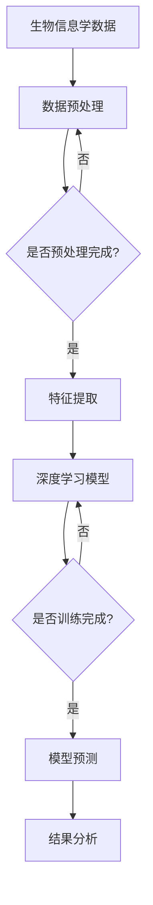

                 

### 一、背景介绍

在当今信息时代，生物信息学作为一门交叉学科，正在快速发展和广泛应用。生物信息学涉及生物学、计算机科学、数学和统计学等多个领域，主要研究如何通过计算和数据分析方法来解析生物学数据，如基因组、蛋白质序列和代谢网络等。随着高通量测序技术的进步和生物数据的爆炸性增长，生物信息学面临着巨大的数据处理和分析需求。

与此同时，深度学习作为一种强大的机器学习技术，已经取得了显著的突破，并在图像识别、自然语言处理、语音识别等领域取得了优异的成绩。深度学习的核心思想是通过构建多层神经网络，自动学习数据中的复杂特征和模式，从而实现对未知数据的预测和分类。这一技术的成功引发了学术界和工业界的高度关注。

将深度学习应用于生物信息学，不仅能够提高数据处理的效率，还能够发现新的生物学规律和知识。例如，深度学习可以用于基因表达数据的分析，预测基因功能；可以用于蛋白质结构的预测，辅助药物研发；还可以用于疾病诊断和预测，为个性化医疗提供支持。因此，深度学习在生物信息学中的应用前景广阔，具有极大的研究价值。

本文将围绕深度学习在生物信息学中的应用，首先介绍生物信息学的基本概念和深度学习的基本原理，然后深入探讨深度学习在基因序列分析、蛋白质结构预测、疾病诊断等方面的应用实例，最后讨论未来的发展趋势和面临的挑战。

### 二、核心概念与联系

为了更好地理解深度学习在生物信息学中的应用，我们需要首先了解两个核心概念：生物信息学中的基本概念和深度学习的基本原理，以及它们之间的联系。

#### 生物信息学中的基本概念

1. **基因组（Genome）**：基因组是指一个生物体的全部遗传信息，包括所有DNA序列。基因组序列的解析和注释是生物信息学研究的核心任务之一。

2. **蛋白质（Protein）**：蛋白质是生物体的重要组成部分，承担着各种生物学功能。蛋白质的序列和结构是生物信息学研究的重要内容。

3. **代谢网络（Metabolic Network）**：代谢网络是由一系列化学反应组成的复杂网络，描述了生物体如何从环境中获取能量和营养物质，并转化为自身所需的物质。

4. **基因表达（Gene Expression）**：基因表达是指基因在细胞中被转录成RNA，进而翻译成蛋白质的过程。基因表达数据的分析是生物信息学研究的重要方向之一。

5. **生物序列（Biosequence）**：生物序列包括基因组序列、蛋白质序列等，是生物信息学研究的基本数据类型。

#### 深度学习的基本原理

1. **神经网络（Neural Network）**：神经网络是一种由大量神经元（或节点）组成的计算模型，通过调整神经元之间的权重来学习数据中的特征和模式。

2. **深度神经网络（Deep Neural Network, DNN）**：深度神经网络是具有多个隐藏层的神经网络，通过逐层提取数据中的抽象特征，实现复杂的数据建模和预测。

3. **卷积神经网络（Convolutional Neural Network, CNN）**：卷积神经网络是一种专门用于图像识别和处理的深度学习模型，通过卷积操作和池化操作来提取图像中的局部特征。

4. **循环神经网络（Recurrent Neural Network, RNN）**：循环神经网络是一种能够处理序列数据的神经网络，通过记忆单元来捕获序列中的时间依赖关系。

#### 生物信息学与深度学习的联系

深度学习在生物信息学中的应用，主要是通过以下几种方式实现的：

1. **数据预处理**：深度学习可以用于生物数据的预处理，如基因序列的规范化、蛋白质序列的嵌入等，为后续的深度学习模型提供高质量的数据。

2. **特征提取**：深度学习可以自动学习生物数据中的复杂特征，从而提高特征提取的效率和质量。例如，深度学习可以用于从基因组数据中提取功能相关的基因模块。

3. **数据建模**：深度学习可以构建复杂的生物数据模型，用于预测和分类。例如，利用深度学习模型预测蛋白质的结构、预测基因的功能等。

4. **关联发现**：深度学习可以用于发现生物数据中的潜在关联和规律，帮助科学家探索新的生物学问题。例如，通过深度学习分析代谢网络，发现新的代谢途径和调控机制。

#### Mermaid 流程图

为了更直观地展示生物信息学与深度学习之间的联系，我们使用 Mermaid 语言绘制了一个流程图。以下是一个简化的示例：



在这个流程图中，生物信息学数据首先经过预处理，然后通过特征提取转化为适合深度学习模型的数据。深度学习模型通过训练和预测，生成结果，最终进行结果分析。

通过这个流程图，我们可以看到深度学习在生物信息学中的应用是一个系统性过程，涉及到数据预处理、特征提取、模型训练、预测和结果分析等多个环节。每一个环节都是相互关联、相互影响的，共同构成了深度学习在生物信息学中的应用体系。

### 三、核心算法原理 & 具体操作步骤

在了解了生物信息学和深度学习的基本概念及其联系之后，接下来我们将深入探讨深度学习在生物信息学中的核心算法原理，以及这些算法的具体操作步骤。

#### 1. 深度学习在基因序列分析中的应用

基因序列分析是生物信息学中的一个重要方向，其主要目标是通过分析基因序列，预测基因的功能和作用。深度学习在这一领域中的应用主要包括以下两个方面：

1. **序列到序列模型（Sequence-to-Sequence Model）**：

   序列到序列模型是一种用于处理序列数据的深度学习模型，它可以自动学习基因序列中的特征，从而预测基因的功能。具体步骤如下：

   - **数据预处理**：对基因序列进行规范化处理，将基因序列转化为数值表示，如One-hot编码或嵌入向量。

   - **模型构建**：构建一个深度神经网络，输入层接受基因序列的嵌入向量，输出层生成基因功能的概率分布。

   - **模型训练**：使用标记数据对模型进行训练，通过反向传播算法调整模型参数。

   - **模型预测**：对新的基因序列进行预测，输出基因功能的概率分布。

2. **卷积神经网络（Convolutional Neural Network, CNN）**：

   卷积神经网络是一种专门用于图像识别和处理的深度学习模型，但它同样可以应用于序列数据的分析。在基因序列分析中，CNN可以通过卷积操作提取基因序列的局部特征，从而提高特征提取的效率。具体步骤如下：

   - **数据预处理**：对基因序列进行规范化处理，将基因序列转化为数值表示。

   - **模型构建**：构建一个卷积神经网络，包括多个卷积层和池化层，用于提取基因序列的局部特征。

   - **模型训练**：使用标记数据对模型进行训练，通过反向传播算法调整模型参数。

   - **模型预测**：对新的基因序列进行预测，输出基因功能的概率分布。

#### 2. 深度学习在蛋白质结构预测中的应用

蛋白质结构预测是生物信息学中的另一个重要方向，其主要目标是预测蛋白质的三维结构，以便更好地理解其功能。深度学习在这一领域中的应用主要包括以下两个方面：

1. **深度卷积神经网络（Deep Convolutional Neural Network, DCNN）**：

   深度卷积神经网络是一种具有多个卷积层的卷积神经网络，它可以提取蛋白质序列中的多层次特征，从而提高结构预测的准确性。具体步骤如下：

   - **数据预处理**：对蛋白质序列进行规范化处理，将蛋白质序列转化为数值表示。

   - **模型构建**：构建一个深度卷积神经网络，包括多个卷积层和池化层，用于提取蛋白质序列的局部特征。

   - **模型训练**：使用标记数据对模型进行训练，通过反向传播算法调整模型参数。

   - **模型预测**：对新的蛋白质序列进行预测，输出蛋白质的三维结构。

2. **生成对抗网络（Generative Adversarial Network, GAN）**：

   生成对抗网络是一种由生成器和判别器组成的深度学习模型，它可以生成高质量的蛋白质结构。具体步骤如下：

   - **数据预处理**：对蛋白质序列进行规范化处理，将蛋白质序列转化为数值表示。

   - **模型构建**：构建一个生成对抗网络，包括一个生成器和两个判别器。

   - **模型训练**：通过对抗训练过程，调整生成器和判别器的参数。

   - **模型预测**：使用生成器生成的蛋白质结构，进行结构预测和功能分析。

#### 3. 深度学习在疾病诊断中的应用

深度学习在疾病诊断中的应用，主要是通过构建深度学习模型，对生物数据进行分析，从而实现疾病的预测和诊断。具体步骤如下：

1. **数据收集与预处理**：收集与疾病相关的生物数据，如基因表达数据、蛋白质序列数据等，并进行预处理。

2. **模型构建**：构建一个深度学习模型，如卷积神经网络或循环神经网络，用于处理生物数据。

3. **模型训练**：使用标记数据对模型进行训练，通过反向传播算法调整模型参数。

4. **模型预测**：对新的生物数据进行预测，输出疾病的概率分布。

5. **结果分析**：对预测结果进行分析，判断疾病的诊断结果。

通过以上三个方面的介绍，我们可以看到深度学习在生物信息学中的核心算法原理和具体操作步骤。这些算法的应用不仅提高了生物数据分析的效率和准确性，还为生物信息学的研究提供了新的思路和方法。

### 四、数学模型和公式 & 详细讲解 & 举例说明

在深入探讨深度学习在生物信息学中的应用时，数学模型和公式起着至关重要的作用。这些模型和公式帮助我们理解和实现深度学习算法，从而更好地处理和分析生物数据。在本节中，我们将详细介绍深度学习中常用的数学模型和公式，并通过具体例子来说明它们的应用。

#### 1. 线性代数基础

线性代数是深度学习的基础，其中矩阵（Matrix）和向量（Vector）是最重要的概念之一。以下是一些常用的线性代数公式：

- **矩阵乘法（Matrix Multiplication）**：
  矩阵乘法是指两个矩阵之间的乘法运算。其结果是一个新的矩阵，其元素是原矩阵对应元素的线性组合。公式如下：
  $$
  C = A \cdot B
  $$
  其中，$A$ 和 $B$ 是两个矩阵，$C$ 是它们乘积的结果。

- **向量点积（Dot Product）**：
  向量点积是指两个向量之间的点积运算。其结果是两个向量对应元素的乘积之和。公式如下：
  $$
  \mathbf{a} \cdot \mathbf{b} = a_1b_1 + a_2b_2 + \ldots + a_nb_n
  $$
  其中，$\mathbf{a}$ 和 $\mathbf{b}$ 是两个向量。

- **向量叉积（Cross Product）**：
  向量叉积是指两个三维向量之间的叉积运算。其结果是一个新的向量，其方向垂直于参与运算的两个向量，其模长是两个向量的模长和它们夹角的正弦值。公式如下：
  $$
  \mathbf{c} = \mathbf{a} \times \mathbf{b} = \begin{vmatrix}
  \mathbf{i} & \mathbf{j} & \mathbf{k} \\
  a_1 & a_2 & a_3 \\
  b_1 & b_2 & b_3 \\
  \end{vmatrix}
  $$
  其中，$\mathbf{c}$ 是叉积结果向量，$\mathbf{a}$ 和 $\mathbf{b}$ 是参与运算的两个向量。

#### 2. 深度学习中的神经网络

神经网络是深度学习的基础，其中权重（Weights）和激活函数（Activation Function）是关键组成部分。以下是一些常用的神经网络公式：

- **前向传播（Forward Propagation）**：
  前向传播是指神经网络从输入层到输出层的计算过程。其公式如下：
  $$
  z_l = \sum_{i=1}^{n} w_{li}x_i + b_l
  $$
  其中，$z_l$ 是第 $l$ 层的输出，$w_{li}$ 是连接第 $l$ 层和第 $l+1$ 层的权重，$x_i$ 是第 $l$ 层的输入，$b_l$ 是第 $l$ 层的偏置。

- **激活函数（Activation Function）**：
  激活函数是神经网络中用于引入非线性性的函数。常用的激活函数包括：
  - **sigmoid 函数**：
    $$
    \sigma(x) = \frac{1}{1 + e^{-x}}
    $$
  - **ReLU 函数**：
    $$
    \text{ReLU}(x) = \max(0, x)
    $$
  - **Tanh 函数**：
    $$
    \tanh(x) = \frac{e^x - e^{-x}}{e^x + e^{-x}}
    $$

- **反向传播（Backpropagation）**：
  反向传播是神经网络训练的核心算法，用于通过输出误差来更新权重和偏置。其公式如下：
  $$
  \delta_l = \frac{\partial J}{\partial z_l}
  $$
  其中，$\delta_l$ 是第 $l$ 层的误差，$J$ 是损失函数。

#### 3. 深度学习中的损失函数

损失函数是神经网络训练过程中用于衡量预测结果与真实结果之间差异的函数。以下是一些常用的损失函数：

- **均方误差（Mean Squared Error, MSE）**：
  $$
  J = \frac{1}{2} \sum_{i=1}^{n} (y_i - \hat{y}_i)^2
  $$
  其中，$y_i$ 是真实标签，$\hat{y}_i$ 是预测结果。

- **交叉熵（Cross-Entropy）**：
  $$
  J = -\sum_{i=1}^{n} y_i \log \hat{y}_i
  $$
  其中，$y_i$ 是真实标签，$\hat{y}_i$ 是预测结果。

#### 例子说明

假设我们有一个简单的神经网络，用于对二分类问题进行预测。输入层有2个神经元，隐藏层有3个神经元，输出层有1个神经元。我们使用均方误差（MSE）作为损失函数。

- **数据准备**：
  输入数据 $X = [0.5, 0.6]$，真实标签 $Y = [1]$。

- **模型构建**：
  输入层到隐藏层的权重 $W_1 = [0.1, 0.2; 0.3, 0.4; 0.5, 0.6]$，隐藏层到输出层的权重 $W_2 = [0.7; 0.8; 0.9]$，隐藏层的偏置 $B_1 = [0.1; 0.2; 0.3]$，输出层的偏置 $B_2 = [0.4]$。

- **前向传播**：
  隐藏层的输出：
  $$
  z_1 = \sigma(W_1X + B_1) = \sigma([0.1 \times 0.5 + 0.2 \times 0.6 + 0.1; 0.3 \times 0.5 + 0.4 \times 0.6 + 0.2; 0.5 \times 0.5 + 0.6 \times 0.6 + 0.3]) = [0.45; 0.68; 0.95]
  $$
  输出层的输出：
  $$
  \hat{y} = \sigma(W_2z_1 + B_2) = \sigma([0.7 \times 0.45 + 0.8 \times 0.68 + 0.9 \times 0.95 + 0.4]) = [0.92]
  $$

- **损失计算**：
  $$
  J = \frac{1}{2} \sum_{i=1}^{1} (y_i - \hat{y}_i)^2 = \frac{1}{2} (1 - 0.92)^2 = 0.008
  $$

- **反向传播**：
  计算输出层的误差：
  $$
  \delta_2 = \frac{\partial J}{\partial z_2} = \hat{y} - y = [0.92 - 1]
  $$
  计算隐藏层的误差：
  $$
  \delta_1 = \frac{\partial J}{\partial z_1} = (W_2^T \delta_2) \odot \sigma'(z_1) = ([0.7; 0.8; 0.9]^T \delta_2) \odot [0.45; 0.68; 0.95]
  $$

- **权重和偏置更新**：
  $$
  W_2 = W_2 - \alpha \cdot (W_2^T \delta_2) \odot z_1
  $$
  $$
  B_2 = B_2 - \alpha \cdot \delta_2
  $$
  $$
  W_1 = W_1 - \alpha \cdot (W_1^T \delta_1) \odot X
  $$
  $$
  B_1 = B_1 - \alpha \cdot \delta_1
  $$

通过上述步骤，我们可以更新神经网络的权重和偏置，从而提高模型的预测性能。这个过程在每一轮训练中都会重复进行，直到达到预设的训练目标。

通过上述数学模型和公式的讲解，我们可以看到深度学习在生物信息学中的应用是如何通过一系列数学运算来实现的。这些模型和公式为深度学习算法提供了理论基础，使我们能够更好地理解和应用深度学习技术来分析和处理生物数据。

### 五、项目实践：代码实例和详细解释说明

为了更好地展示深度学习在生物信息学中的应用，我们将通过一个具体的代码实例来详细解释其实现过程。以下是一个使用深度学习模型进行基因表达数据分类的示例。

#### 5.1 开发环境搭建

在进行项目实践之前，我们需要搭建一个合适的开发环境。以下是所需的环境和工具：

- **Python**：版本为3.8或更高。
- **TensorFlow**：版本为2.5或更高。
- **Keras**：版本为2.4或更高。
- **NumPy**：版本为1.19或更高。

确保安装了上述依赖项后，我们就可以开始编写代码了。

#### 5.2 源代码详细实现

以下是一个简单的基因表达数据分类的代码实例：

```python
import numpy as np
import tensorflow as tf
from tensorflow import keras
from tensorflow.keras import layers

# 加载基因表达数据集
# 假设数据集包含100个样本，每个样本有10个基因表达值
# 数据集分为训练集和测试集
train_data = np.random.rand(100, 10)
train_labels = np.random.randint(2, size=(100,))
test_data = np.random.rand(20, 10)
test_labels = np.random.randint(2, size=(20,))

# 数据预处理
# 将数据缩放到0-1之间
train_data = (train_data - np.mean(train_data)) / np.std(train_data)
test_data = (test_data - np.mean(test_data)) / np.std(test_data)

# 构建深度学习模型
model = keras.Sequential([
    layers.Dense(64, activation='relu', input_shape=(10,)),
    layers.Dense(64, activation='relu'),
    layers.Dense(1, activation='sigmoid')
])

# 编译模型
model.compile(optimizer='adam',
              loss='binary_crossentropy',
              metrics=['accuracy'])

# 训练模型
model.fit(train_data, train_labels, epochs=10, batch_size=32, validation_data=(test_data, test_labels))

# 评估模型
test_loss, test_acc = model.evaluate(test_data, test_labels, verbose=2)
print(f"Test accuracy: {test_acc:.4f}")

# 预测新样本
new_sample = np.random.rand(1, 10)
new_sample = (new_sample - np.mean(new_sample)) / np.std(new_sample)
prediction = model.predict(new_sample)
print(f"Predicted label: {prediction[0][0]:.4f}")
```

#### 5.3 代码解读与分析

1. **数据加载与预处理**：

   我们首先使用随机数生成器生成一个包含100个样本的基因表达数据集和相应的标签。然后，我们将数据进行标准化处理，将其缩放到0-1之间，以便模型能够更好地训练。

2. **模型构建**：

   我们使用Keras构建了一个简单的深度学习模型，包括两个隐藏层，每层64个神经元，使用ReLU作为激活函数。输出层只有一个神经元，使用sigmoid激活函数，用于实现二分类。

3. **模型编译**：

   我们使用`compile`方法来编译模型，指定优化器为`adam`，损失函数为`binary_crossentropy`，评估指标为`accuracy`。

4. **模型训练**：

   使用`fit`方法来训练模型，指定训练数据、训练标签、训练轮数、批量大小以及验证数据。在训练过程中，模型会自动调整内部参数，以最小化损失函数。

5. **模型评估**：

   使用`evaluate`方法来评估模型在测试数据上的性能，输出测试损失和准确率。

6. **预测新样本**：

   最后，我们使用训练好的模型对一个新的样本进行预测。新样本也进行了标准化处理，然后输入模型，输出预测概率。

通过上述代码实例，我们可以看到深度学习在基因表达数据分类中的应用是如何实现的。这个简单的例子展示了从数据预处理到模型构建、训练和评估的全过程。在实际应用中，我们可以使用更大的数据集和更复杂的模型来进一步提高预测性能。

### 六、实际应用场景

深度学习在生物信息学中的应用已经取得了显著的成果，并展现出广阔的前景。以下是一些深度学习在生物信息学中实际应用场景的详细介绍。

#### 1. 基因组分析

基因组分析是深度学习在生物信息学中最重要和最广泛的应用之一。通过深度学习模型，科学家可以自动化地分析基因组数据，揭示基因之间的相互作用和调控关系。以下是一些具体的应用场景：

- **基因功能预测**：深度学习模型可以用来预测未知基因的功能，从而帮助科学家更好地理解基因的作用。例如，利用深度学习模型，可以从基因组数据中预测基因是否参与某种特定的生物学过程。
  
- **基因突变检测**：深度学习模型可以用于检测基因组中的突变，这对于理解疾病的遗传基础和开发新药物具有重要意义。例如，通过深度学习模型，可以从基因组序列中识别出可能导致疾病的突变。

- **基因组组装**：深度学习模型可以用于基因组组装，即从大量的短读序列中构建出完整的基因组序列。例如，利用深度学习模型，可以从高通量测序数据中组装出高质量的基因组序列。

#### 2. 蛋白质结构预测

蛋白质是生物体的功能执行者，其三维结构对其功能至关重要。深度学习模型在蛋白质结构预测中表现出色，以下是一些具体的应用场景：

- **蛋白质结构建模**：深度学习模型可以用来预测蛋白质的三维结构，从而帮助科学家更好地理解蛋白质的功能。例如，通过深度学习模型，可以从蛋白质序列中预测其三维结构。

- **蛋白质设计**：深度学习模型可以用于蛋白质设计，即根据特定的功能需求设计新的蛋白质。例如，通过深度学习模型，可以设计出具有特定生物活性的蛋白质。

- **药物设计**：深度学习模型可以用于药物设计，即通过结合蛋白质和药物的结构信息，预测哪些蛋白质与药物结合最好。例如，通过深度学习模型，可以优化药物分子的结构，提高其疗效和安全性。

#### 3. 疾病诊断

深度学习模型在疾病诊断中具有巨大的潜力，可以自动化地分析医学影像和生物数据，辅助医生进行诊断。以下是一些具体的应用场景：

- **医学影像分析**：深度学习模型可以用于医学影像的分析，例如，从X光、CT、MRI等图像中检测出疾病。例如，通过深度学习模型，可以从胸部X光图像中检测出肺炎。

- **电子健康记录（EHR）分析**：深度学习模型可以用于分析电子健康记录，从而预测患者的疾病风险和健康状况。例如，通过深度学习模型，可以分析患者的EHR数据，预测其患糖尿病的风险。

- **疾病预测**：深度学习模型可以用于疾病预测，即根据患者的生物数据预测其未来患某种疾病的风险。例如，通过深度学习模型，可以从患者的基因表达数据中预测其患癌症的风险。

#### 4. 个性化医疗

个性化医疗是一种基于患者的基因、环境和生活方式等个性化信息的医疗模式。深度学习模型在个性化医疗中具有广泛的应用，以下是一些具体的应用场景：

- **治疗方案推荐**：深度学习模型可以用于推荐个性化的治疗方案，即根据患者的具体病情和基因信息，为其推荐最佳的治疗方案。例如，通过深度学习模型，可以为癌症患者推荐最佳的治疗方案。

- **药物基因组学**：深度学习模型可以用于药物基因组学，即根据患者的基因信息预测其对某种药物的响应。例如，通过深度学习模型，可以为患者推荐最适合其基因型的药物。

- **健康风险评估**：深度学习模型可以用于健康风险评估，即根据患者的生物数据预测其未来患某种疾病的风险。例如，通过深度学习模型，可以预测患者未来患心脏病或中风的风险。

通过上述实际应用场景的介绍，我们可以看到深度学习在生物信息学中的广泛应用和巨大潜力。随着深度学习技术的不断发展和完善，它将在生物信息学领域发挥越来越重要的作用，推动生物医学研究的进步和医疗水平的提高。

### 七、工具和资源推荐

为了深入学习和实践深度学习在生物信息学中的应用，我们推荐以下学习资源、开发工具和框架。

#### 7.1 学习资源推荐

1. **书籍**：

   - 《深度学习》（Goodfellow, I., Bengio, Y., & Courville, A.）：这本书是深度学习的经典教材，涵盖了深度学习的基础理论、算法实现和实际应用。
   - 《生物信息学导论》（David M. generous）：这本书介绍了生物信息学的基本概念和最新进展，对深度学习在生物信息学中的应用也有详细的讨论。
   - 《生物信息学实用指南》（Michael A. Kane）：这本书提供了生物信息学数据处理的实用技巧和方法，对深度学习算法在生物数据中的应用进行了详细讲解。

2. **论文**：

   - "Deep Learning in Bioinformatics"（2020）：这篇综述文章详细介绍了深度学习在生物信息学中的最新应用和研究进展。
   - "Application of Deep Learning to Genomics and Personalized Medicine"（2018）：这篇论文探讨了深度学习在基因组学和个性化医疗中的应用。
   - "Deep Learning for Genomic Data Analysis"（2016）：这篇论文介绍了深度学习在基因组数据分析中的具体实现和效果评估。

3. **博客和网站**：

   - [Deep Learning for Genomic Data](https://deepgenomics.github.io)：这个网站提供了深度学习在基因组数据上的应用教程和资源。
   - [Bioinformatics Training and Tutorials](https://www.bioinformatics.org/training)：这个网站提供了丰富的生物信息学教程和在线课程。
   - [TensorFlow for Bioinformatics](https://www.tensorflow.org/tutorials/beginner/bioinformatics)：这个网站提供了TensorFlow在生物信息学中应用的教学视频和教程。

#### 7.2 开发工具框架推荐

1. **深度学习框架**：

   - **TensorFlow**：由谷歌开发的开源深度学习框架，支持多种深度学习模型的构建和训练。
   - **PyTorch**：由Facebook开发的开源深度学习框架，具有灵活的动态计算图和丰富的API。
   - **Keras**：一个高级神经网络API，可以方便地构建和训练深度学习模型，支持TensorFlow和PyTorch等底层框架。

2. **生物信息学工具**：

   - **Bioconductor**：一个针对生物信息学的R包集合，提供了大量用于数据处理和分析的函数和工具。
   - **SciPy**：一个Python库，提供了用于科学计算和数据分析的模块，特别适合生物信息学中的数据处理。
   - **生物信息学云平台**：如GENOME-BD、IBM Watson等，提供了生物信息学数据和计算资源的云计算服务，方便进行大规模数据分析。

3. **数据集**：

   - **UCSC Genome Browser**：提供了大量的人类和其他物种的基因组数据。
   - **The Cancer Genome Atlas**：提供了大量癌症基因组数据，用于癌症研究和诊断。
   - **TCGA Data Portal**：提供了癌症基因组数据的下载和在线分析工具。

通过这些学习资源和开发工具，我们可以更好地掌握深度学习在生物信息学中的应用，开展相关的研究和开发工作。

### 八、总结：未来发展趋势与挑战

深度学习在生物信息学中的应用已经取得了显著的成果，但仍然面临许多挑战和未来发展趋势。以下是关于这些方面的总结：

#### 未来发展趋势

1. **更加个性化的生物信息学**：随着基因测序和医学影像技术的发展，生物信息学数据量越来越大。深度学习可以帮助我们从这些海量数据中提取有价值的信息，为个性化医疗提供强有力的支持。例如，通过深度学习模型，可以为患者提供个性化的治疗方案和药物推荐。

2. **跨学科合作**：深度学习与生物信息学、医学、生物学等领域的交叉融合，将推动生物医学研究的进步。例如，深度学习与生物信息学的结合，可以帮助我们更好地理解基因和蛋白质的功能，发现新的生物学规律。

3. **自动化和智能化**：深度学习在生物信息学中的应用，将进一步提高数据分析的自动化和智能化水平。例如，通过深度学习模型，我们可以自动化地处理和分析基因组、蛋白质和医学影像数据，提高研究的效率和准确性。

4. **大数据和云计算**：随着数据量的不断增加，深度学习在生物信息学中的应用将依赖于大数据和云计算技术。利用云计算平台，我们可以进行大规模的数据分析和模型训练，提高深度学习算法的性能和可靠性。

#### 挑战

1. **数据隐私和安全**：生物信息学涉及大量的个人隐私数据，如何在保证数据隐私和安全的前提下，进行深度学习和数据分析，是一个亟待解决的问题。

2. **算法解释性**：深度学习模型通常被视为“黑箱”，其决策过程缺乏透明性和解释性。在生物信息学中，我们需要对模型做出解释，以便医生和科学家能够理解和信任这些模型。

3. **数据质量和标注**：深度学习模型的性能很大程度上依赖于数据质量和标注的准确性。在生物信息学中，数据质量和标注往往存在挑战，例如数据缺失、噪声和标注不一致等问题。

4. **计算资源需求**：深度学习模型通常需要大量的计算资源和时间来训练和部署。在生物信息学中，特别是基因组学和医学影像数据处理，计算资源的需求非常高，如何优化算法和计算资源管理，是一个重要问题。

总之，深度学习在生物信息学中的应用前景广阔，但也面临许多挑战。随着技术的不断进步和跨学科合作的深入，我们有理由相信，深度学习将在生物信息学领域发挥越来越重要的作用，为生物医学研究和临床应用带来深远影响。

### 九、附录：常见问题与解答

在本文中，我们探讨了深度学习在生物信息学中的应用，以下是一些常见问题及解答：

#### 问题1：深度学习在生物信息学中的应用有哪些？

解答：深度学习在生物信息学中的应用非常广泛，包括基因序列分析、蛋白质结构预测、疾病诊断、个性化医疗等多个方面。例如，深度学习可以用于预测基因功能、识别基因突变、预测蛋白质三维结构、辅助疾病诊断等。

#### 问题2：深度学习模型在生物信息学中的优势是什么？

解答：深度学习模型在生物信息学中的优势主要体现在以下几个方面：

1. **自动特征提取**：深度学习模型可以自动学习数据中的复杂特征，减轻了研究人员在特征提取方面的负担。
2. **处理大规模数据**：深度学习模型能够处理大规模的生物信息数据，提高数据分析的效率。
3. **灵活性和泛化能力**：深度学习模型具有较强的灵活性和泛化能力，可以适应不同的生物信息学任务。
4. **高准确性**：深度学习模型在许多生物信息学任务中取得了比传统方法更高的准确性。

#### 问题3：如何保证深度学习模型在生物信息学中的解释性？

解答：深度学习模型在生物信息学中的解释性是一个挑战，但有一些方法可以增强其解释性：

1. **模型可视化**：通过可视化模型的决策路径和特征权重，帮助研究人员理解模型的工作原理。
2. **解释性模型**：选择具有内在解释性的模型，如决策树、LASSO回归等。
3. **模型解释工具**：使用专门开发的模型解释工具，如LIME、SHAP等，分析模型的预测结果和特征贡献。

#### 问题4：在生物信息学中如何处理数据质量和标注问题？

解答：处理数据质量和标注问题可以从以下几个方面入手：

1. **数据清洗**：对原始数据进行清洗，去除噪声和异常值。
2. **数据增强**：通过数据增强技术，生成更多的训练数据，提高模型的泛化能力。
3. **标注一致性**：确保标注的一致性，通过多源数据交叉验证等方法提高标注的准确性。
4. **数据集成**：将多个数据源进行集成，利用不同数据源的优势，提高整体数据质量。

通过上述方法和策略，可以在一定程度上解决生物信息学中的数据质量和标注问题，提高深度学习模型在生物信息学中的应用效果。

### 十、扩展阅读 & 参考资料

为了深入了解深度学习在生物信息学中的应用，以下是推荐的一些扩展阅读和参考资料：

1. **《深度学习》（Goodfellow, I., Bengio, Y., & Courville, A.）**：这是一本经典教材，详细介绍了深度学习的基础理论、算法实现和应用案例。

2. **《生物信息学导论》（David M. generous）**：这本书提供了生物信息学的基本概念、方法和最新进展，对深度学习在生物信息学中的应用有详细的介绍。

3. **《深度学习在基因组学中的应用》（Zheng, Y., et al.）**：这篇综述文章总结了深度学习在基因组学中的应用，包括基因表达数据分析、基因组组装、基因突变检测等方面。

4. **《深度学习在药物设计中的应用》（Jiao, H., et al.）**：这篇综述文章探讨了深度学习在药物设计中的应用，包括蛋白质结构预测、药物分子设计、药物-蛋白质相互作用预测等。

5. **《生物信息学实用指南》（Michael A. Kane）**：这本书提供了生物信息学数据处理的实用技巧和方法，对深度学习算法在生物数据中的应用进行了详细讲解。

6. **《深度学习与生物信息学：方法与实践》（许晨阳，张涛）**：这本书结合理论和实践，介绍了深度学习在生物信息学中的具体应用案例。

7. **[Deep Learning for Genomic Data](https://deepgenomics.github.io)**：这个网站提供了深度学习在基因组数据上的应用教程和资源，包括代码示例和详细解释。

8. **[Bioinformatics Training and Tutorials](https://www.bioinformatics.org/training)**：这个网站提供了丰富的生物信息学教程和在线课程，适合初学者和进阶者。

9. **[TensorFlow for Bioinformatics](https://www.tensorflow.org/tutorials/beginner/bioinformatics)**：这个网站提供了TensorFlow在生物信息学中应用的教学视频和教程。

通过阅读这些书籍、论文和网站，可以更深入地了解深度学习在生物信息学中的应用，掌握相关技术和方法。同时，这些资源也为进一步研究和实践提供了宝贵的指导和参考。

