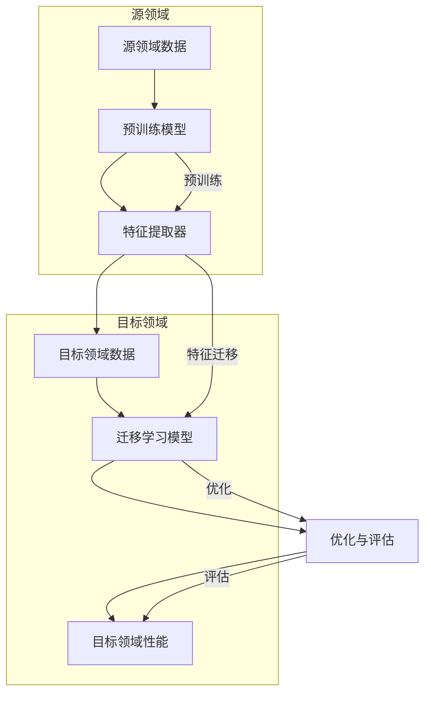

                 

### 背景介绍

在人工智能领域，深度学习已经成为研究的热点，并在多个任务中取得了显著的成果。然而，深度学习模型的训练通常需要大量的数据和高性能的计算资源，这在某些情况下可能难以实现。为了解决这一问题，深度迁移学习（Deep Transfer Learning）应运而生，它通过在不同领域之间转移知识来加速模型的训练过程。

深度迁移学习的基本思想是利用源领域（Source Domain）中已有的知识，通过迁移学习（Transfer Learning）的方法将其应用到目标领域（Target Domain）中。这种方法可以显著减少训练数据的需求，同时提高模型的性能。深度迁移学习在计算机视觉、自然语言处理等多个领域都有着广泛的应用，成为当前人工智能研究的一个重要方向。

本文旨在深入探讨深度迁移学习在AI不同领域间的知识转移机制，帮助读者全面了解这一技术的核心概念、算法原理、数学模型以及实践应用。通过本文的阅读，读者将能够掌握深度迁移学习的基本方法和关键技术，为今后的研究和实践提供指导。

深度迁移学习的出现背景源于传统机器学习模型的局限性。在早期的机器学习研究中，模型通常需要在特定领域内从零开始训练，这要求大量的标注数据和长时间的计算。然而，现实中存在许多数据稀缺或获取困难的情况，如医疗领域、工业制造等。此外，随着数据隐私和安全问题的日益突出，共享数据变得更加困难，这进一步加剧了模型训练的挑战。

为了解决这些问题，研究人员开始探索迁移学习的方法，即利用一个领域（源领域）的知识来解决另一个领域（目标领域）的问题。早期的迁移学习方法主要集中在手工特征提取和模型结构的迁移，但随着深度学习的发展，深度迁移学习逐渐成为研究的主流。

深度迁移学习不仅能够减少训练数据的需求，还能够提高模型的泛化能力。这是因为，深度学习模型通过层次化的特征提取过程，能够学习到更高层次、更具抽象性的特征表示，这些特征在多个领域之间具有一定的通用性。通过在源领域中对模型进行预训练，然后将其应用于目标领域，可以有效地利用源领域的知识，提高目标领域的模型性能。

本文将从以下几个方面对深度迁移学习进行探讨：

1. **核心概念与联系**：介绍深度迁移学习中的关键概念，如源领域、目标领域、迁移策略等，并利用Mermaid流程图展示迁移学习的过程。
   
2. **核心算法原理 & 具体操作步骤**：详细讲解深度迁移学习的主要算法，包括模型预训练、特征提取、迁移策略等，并给出具体的操作步骤。

3. **数学模型和公式 & 详细讲解 & 举例说明**：分析深度迁移学习中的数学模型，包括损失函数、优化算法等，并结合实际案例进行详细解释。

4. **项目实践：代码实例和详细解释说明**：通过实际项目实例，展示如何实现深度迁移学习，并深入解析代码实现过程。

5. **实际应用场景**：探讨深度迁移学习在不同领域的应用，如计算机视觉、自然语言处理等。

6. **工具和资源推荐**：介绍深度迁移学习的学习资源、开发工具和框架，为读者提供实用的学习资料。

7. **总结：未来发展趋势与挑战**：总结深度迁移学习的现状，并探讨未来的发展趋势和面临的挑战。

通过本文的阅读，读者将能够系统地掌握深度迁移学习的基本概念、方法和实践技巧，为深入研究和应用这一技术奠定基础。

### 核心概念与联系

在深入探讨深度迁移学习之前，有必要明确其核心概念及其相互联系。深度迁移学习的核心概念包括源领域（Source Domain）、目标领域（Target Domain）和迁移策略（Transfer Strategy）等。以下将通过一个Mermaid流程图（Mermaid流程节点中不要有括号、逗号等特殊字符）来展示这些概念之间的关系和迁移学习的基本流程。



在上面的Mermaid流程图中，首先从源领域（Source Domain）收集数据，并利用这些数据对深度学习模型进行预训练（Pre-training），这一步主要是为了学习到通用的特征表示。预训练模型通过层次化的特征提取器（Feature Extractor）提取特征表示，这些特征具有高度的抽象性和通用性，能够在不同的领域之间迁移。

接着，特征提取器中的知识被转移到目标领域（Target Domain），通过在目标领域的数据上进行微调（Fine-tuning），生成一个专门针对目标领域的迁移学习模型（Transfer Learning Model）。这一模型在目标领域上进行优化（Optimization）和评估（Evaluation），最终实现目标领域的性能提升（Target Domain Performance）。

下面是每个核心概念的具体解释：

#### 源领域（Source Domain）

源领域是指用于预训练模型的领域，通常拥有丰富的标注数据和强大的计算资源。源领域的目标是通过大规模的数据训练，使模型学习到具有普遍性和强泛化能力的特征表示。

#### 目标领域（Target Domain）

目标领域是指需要应用迁移学习技术的领域，可能缺乏足够的标注数据或者数据获取困难。目标领域的目标是通过迁移学习，利用源领域的知识来提高模型在该领域的性能。

#### 迁移策略（Transfer Strategy）

迁移策略是指将源领域的知识有效转移到目标领域的方法和技巧。常见的迁移策略包括：

1. **模型迁移**：直接将源领域的预训练模型应用到目标领域，通过微调进行优化。
2. **特征迁移**：将源领域的特征表示迁移到目标领域，通过在目标领域的数据上训练一个新模型。
3. **知识蒸馏**：将源领域的知识编码成教师模型，然后将学生模型与教师模型进行联合训练。

通过上述核心概念及其相互关系的理解，我们可以更清晰地把握深度迁移学习的流程和机制。在接下来的章节中，我们将详细探讨深度迁移学习中的核心算法原理、数学模型以及具体的应用实践。

#### 核心算法原理 & 具体操作步骤

深度迁移学习的核心算法主要基于预训练（Pre-training）、特征提取（Feature Extraction）和迁移策略（Transfer Strategy）。下面我们将逐一详细讲解这些核心算法的原理和具体操作步骤。

##### 1. 预训练（Pre-training）

预训练是深度迁移学习的第一步，旨在利用源领域的海量数据对深度学习模型进行训练，从而学习到具有广泛泛化能力的特征表示。预训练模型通常在大规模数据集上通过无监督或半监督的方式学习，从而避免了对大量标注数据的依赖。

**具体操作步骤**：

1. **数据准备**：收集和预处理源领域的大量数据，包括图像、文本或音频等。预处理步骤通常包括数据清洗、归一化、数据增强等。

2. **模型选择**：选择一个适合的深度学习模型作为基础模型。常见的预训练模型包括卷积神经网络（CNN）、循环神经网络（RNN）和变换器（Transformer）等。

3. **预训练过程**：使用源领域的数据进行训练，模型在预训练过程中通过反向传播算法更新权重，学习到具有层次化和抽象性的特征表示。预训练过程通常包括以下几个阶段：
   - **预训练阶段**：在大量未标注的数据上进行预训练，模型通过自动编码器、自注意力机制等方法学习特征表示。
   - **微调阶段**：在部分标注数据上对预训练模型进行微调，进一步优化模型在特定任务上的性能。

4. **保存预训练模型**：在预训练完成后，保存训练好的模型，以便后续在目标领域进行迁移。

##### 2. 特征提取（Feature Extraction）

特征提取是深度迁移学习的核心步骤，旨在从预训练模型中提取具有通用性的特征表示，这些特征表示可以用于不同的目标领域。

**具体操作步骤**：

1. **模型选择**：选择一个经过预训练的深度学习模型，该模型已经在源领域学习到了通用的特征表示。

2. **特征提取器设计**：设计一个特征提取器，用于从预训练模型中提取特征。特征提取器可以是多层全连接层、卷积层或循环层等，具体设计取决于目标领域的需求。

3. **特征提取过程**：通过将输入数据输入到预训练模型中，得到提取到的特征表示。这些特征表示通常是高维的、层次化的，并具有很好的泛化能力。

4. **特征融合**：如果需要，可以将多个特征提取器提取的特征进行融合，以进一步提高特征表示的丰富度和泛化能力。

##### 3. 迁移策略（Transfer Strategy）

迁移策略是指将源领域知识有效转移到目标领域的方法和技巧。常见的迁移策略包括模型迁移、特征迁移和知识蒸馏等。

**模型迁移（Model Transfer）**：

- **具体操作步骤**：
  1. **模型选择**：选择一个经过预训练的深度学习模型，该模型在源领域已经学到了良好的特征表示。
  2. **微调**：在目标领域的数据上对预训练模型进行微调，调整模型的权重以适应目标领域的特定任务。
  3. **优化**：使用目标领域的损失函数和优化算法对模型进行优化，以提高模型在目标领域的性能。

**特征迁移（Feature Transfer）**：

- **具体操作步骤**：
  1. **模型选择**：选择一个预训练模型，该模型已经在源领域学习到了具有泛化性的特征表示。
  2. **特征提取**：使用预训练模型从目标领域的数据中提取特征表示。
  3. **目标领域模型训练**：在提取到的特征表示上训练一个专门针对目标领域的新模型，通常是一个小型的、轻量级的模型。
  4. **优化**：使用目标领域的损失函数和优化算法对目标领域模型进行优化。

**知识蒸馏（Knowledge Distillation）**：

- **具体操作步骤**：
  1. **教师模型选择**：选择一个在源领域表现良好的深度学习模型作为教师模型。
  2. **学生模型设计**：设计一个较小的、轻量级的模型作为学生模型。
  3. **蒸馏过程**：通过最小化教师模型和学生模型输出之间的差异，对学生模型进行训练。这通常通过一个额外的损失函数实现，称为蒸馏损失。
  4. **优化**：使用目标领域的损失函数和优化算法对教师模型和学生模型进行联合优化，以进一步提高模型在目标领域的性能。

通过上述核心算法的具体操作步骤，我们可以更好地理解深度迁移学习的工作原理。在接下来的章节中，我们将进一步分析深度迁移学习中的数学模型，并借助实际案例进行详细讲解。

#### 数学模型和公式 & 详细讲解 & 举例说明

在深度迁移学习中，数学模型和公式是理解和实现这一技术的基础。以下是深度迁移学习中的关键数学模型和公式，并对其详细讲解和举例说明。

##### 1. 损失函数

损失函数是深度学习模型训练的核心，用于衡量模型预测值与真实值之间的差距。在深度迁移学习中，常见的损失函数包括交叉熵损失（Cross-Entropy Loss）、均方误差（Mean Squared Error, MSE）和对抗性损失（Adversarial Loss）等。

**交叉熵损失（Cross-Entropy Loss）**：

交叉熵损失常用于分类任务，其公式如下：

$$
L_{CE} = -\sum_{i} y_{i} \log(p_{i})
$$

其中，$y_{i}$是真实标签，$p_{i}$是模型对第$i$类别的预测概率。

**均方误差（Mean Squared Error, MSE）**：

均方误差常用于回归任务，其公式如下：

$$
L_{MSE} = \frac{1}{n} \sum_{i} (y_{i} - \hat{y}_{i})^2
$$

其中，$y_{i}$是真实值，$\hat{y}_{i}$是模型预测值。

**对抗性损失（Adversarial Loss）**：

在生成对抗网络（GANs）中，对抗性损失用于衡量生成器（Generator）和判别器（Discriminator）之间的对抗性。其公式如下：

$$
L_{GAN} = -\mathbb{E}_{x \sim p_{data}(x)}[\log(D(x))] - \mathbb{E}_{z \sim p_{z}(z)}[\log(1 - D(G(z))]
$$

其中，$D(x)$是判别器对真实数据的判断概率，$G(z)$是生成器生成的数据，$p_{data}(x)$和$p_{z}(z)$分别是真实数据和噪声数据的概率分布。

**举例说明**：

假设我们有一个二分类问题，目标是判断一张图像是否为猫。我们可以使用交叉熵损失来训练我们的模型。

- **真实标签**：$y = [1, 0]$（图像是猫）
- **模型预测概率**：$p = [0.8, 0.2]$

计算交叉熵损失：

$$
L_{CE} = -[1 \cdot \log(0.8) + 0 \cdot \log(0.2)] = -\log(0.8) \approx 0.223
$$

这个结果表明，模型的预测概率与真实标签之间的差距，损失函数的值越低，模型预测的准确性越高。

##### 2. 优化算法

优化算法用于调整模型参数，以最小化损失函数。在深度迁移学习中，常见的优化算法包括随机梯度下降（Stochastic Gradient Descent, SGD）、Adam优化器和RMSprop等。

**随机梯度下降（Stochastic Gradient Descent, SGD）**：

随机梯度下降是最简单的优化算法，其更新公式如下：

$$
\theta_{t+1} = \theta_{t} - \alpha \cdot \nabla_{\theta} L(\theta)
$$

其中，$\theta$是模型参数，$\alpha$是学习率，$L(\theta)$是损失函数。

**Adam优化器**：

Adam优化器是SGD的改进版本，结合了AdaGrad和RMSprop的特点。其更新公式如下：

$$
m_t = \beta_1 m_{t-1} + (1 - \beta_1) \nabla_{\theta} L(\theta)
$$
$$
v_t = \beta_2 v_{t-1} + (1 - \beta_2) (\nabla_{\theta} L(\theta))^2
$$
$$
\theta_{t+1} = \theta_{t} - \alpha \cdot \frac{m_t}{\sqrt{v_t} + \epsilon}
$$

其中，$\beta_1$和$\beta_2$是动量参数，$\epsilon$是正数小量，用于避免分母为零。

**举例说明**：

假设我们使用Adam优化器训练一个模型，初始参数为$\theta_0 = [1, 2]$，学习率$\alpha = 0.1$，损失函数为MSE。

- **损失值**：$L(\theta_0) = 0.5$
- **梯度**：$\nabla_{\theta} L(\theta_0) = [-0.1, -0.2]$

计算一阶矩$m_0$和二阶矩$v_0$：

$$
m_0 = \beta_1 m_{-1} + (1 - \beta_1) \nabla_{\theta} L(\theta_0) = 0 + (1 - 0.9) [-0.1, -0.2] = [-0.1, -0.2]
$$
$$
v_0 = \beta_2 v_{-1} + (1 - \beta_2) (\nabla_{\theta} L(\theta_0))^2 = 0 + (1 - 0.99) (0.01 + 0.04) = 0.00005
$$

更新参数$\theta_1$：

$$
\theta_1 = \theta_0 - \alpha \cdot \frac{m_0}{\sqrt{v_0} + \epsilon} = [1, 2] - 0.1 \cdot \frac{[-0.1, -0.2]}{\sqrt{0.00005} + 0.00001} \approx [0.9, 1.8]
$$

这个结果表明，通过优化算法，模型的参数得到了更新，使得损失函数的值进一步减小。

通过上述数学模型和公式的详细讲解和举例说明，我们可以更好地理解深度迁移学习中的关键数学原理，为实际应用和进一步研究提供指导。

#### 项目实践：代码实例和详细解释说明

为了更好地理解深度迁移学习在现实中的应用，我们将通过一个具体的项目实例进行讲解。在这个项目中，我们将使用Python和TensorFlow框架来实现一个简单的图像分类任务，展示深度迁移学习的基本流程和关键步骤。

##### 1. 开发环境搭建

在进行项目开发之前，首先需要搭建一个合适的开发环境。以下是所需的环境和工具：

- Python版本：3.8及以上
- TensorFlow版本：2.7及以上
- CUDA版本：11.0及以上（用于GPU加速）
- GPU硬件：NVIDIA显卡（推荐使用至少8GB显存）

安装TensorFlow和CUDA：

```bash
pip install tensorflow-gpu
```

确保CUDA工具包和驱动程序已经正确安装，并配置好CUDA环境变量。

##### 2. 源领域数据准备

源领域数据是指用于预训练模型的图像数据。在本项目中，我们使用开源的ImageNet数据集，该数据集包含大量分类标签的图像。

```python
import tensorflow as tf
from tensorflow.keras.preprocessing.image import ImageDataGenerator

# 加载ImageNet数据集
train_datagen = ImageDataGenerator(rescale=1./255)
train_generator = train_datagen.flow_from_directory(
        'path/to/imagenet/train',
        target_size=(224, 224),
        batch_size=32,
        class_mode='categorical')

validation_datagen = ImageDataGenerator(rescale=1./255)
validation_generator = validation_datagen.flow_from_directory(
        'path/to/imagenet/validation',
        target_size=(224, 224),
        batch_size=32,
        class_mode='categorical')
```

在上述代码中，我们使用了ImageDataGenerator来加载和预处理图像数据。图像被缩放到224x224像素的大小，并按批量进行加载，以减少内存占用。

##### 3. 预训练模型准备

在源领域数据准备完成后，我们可以使用预训练的模型（如ResNet50、VGG16等）进行特征提取。以下是使用ResNet50进行预训练模型准备和特征提取的示例代码：

```python
from tensorflow.keras.applications import ResNet50
from tensorflow.keras.models import Model

# 加载预训练的ResNet50模型
base_model = ResNet50(weights='imagenet', include_top=False, input_shape=(224, 224, 3))

# 冻结预训练模型的权重
for layer in base_model.layers:
    layer.trainable = False

# 添加自定义的全连接层
x = base_model.output
x = tf.keras.layers.GlobalAveragePooling2D()(x)
x = tf.keras.layers.Dense(1000, activation='softmax')(x)

# 构建迁移学习模型
model = Model(inputs=base_model.input, outputs=x)

# 编译模型
model.compile(optimizer='adam', loss='categorical_crossentropy', metrics=['accuracy'])

# 打印模型结构
model.summary()
```

在上述代码中，我们首先加载了ResNet50模型，并将其输入层和全连接层进行冻结，以防止在迁移学习过程中更新这些层的权重。然后，我们在模型的输出层添加了一个新的全连接层，用于分类任务。

##### 4. 目标领域数据准备

目标领域数据是指用于评估迁移学习模型性能的图像数据。在本项目中，我们使用CIFAR-10数据集作为目标领域数据。

```python
cifar10_datagen = ImageDataGenerator(rescale=1./255)
cifar10_generator = cifar10_datagen.flow_from_directory(
        'path/to/cifar10/train',
        target_size=(224, 224),
        batch_size=32,
        class_mode='categorical')
```

与源领域数据类似，我们也使用了ImageDataGenerator对CIFAR-10数据集进行预处理。

##### 5. 迁移学习模型训练

在准备完源领域和目标领域数据后，我们可以使用迁移学习模型对目标领域数据进行训练。以下是迁移学习模型训练的示例代码：

```python
# 训练迁移学习模型
history = model.fit(
        train_generator,
        steps_per_epoch=train_generator.samples // train_generator.batch_size,
        epochs=10,
        validation_data=validation_generator,
        validation_steps=validation_generator.samples // validation_generator.batch_size)
```

在上述代码中，我们使用fit方法训练模型，其中steps_per_epoch和validation_steps参数分别表示每个epoch中训练和验证步骤的数量。

##### 6. 运行结果展示

训练完成后，我们可以通过模型在目标领域的性能来评估迁移学习的效果。以下是展示模型性能的示例代码：

```python
# 评估模型在目标领域的性能
test_loss, test_accuracy = model.evaluate(cifar10_generator)
print(f"Test accuracy: {test_accuracy:.4f}, Test loss: {test_loss:.4f}")
```

在上述代码中，我们使用evaluate方法评估模型在目标领域数据上的性能，其中test_accuracy和test_loss分别表示模型在测试数据上的准确率和损失值。

通过上述项目实例，我们详细讲解了深度迁移学习在图像分类任务中的实现过程。接下来，我们将进一步解析代码的实现细节，帮助读者深入理解迁移学习的原理和应用。

##### 6.1 源代码详细实现

在本部分，我们将深入解析上述代码实例中的具体实现细节，从模型结构设计、数据预处理到训练过程和评估指标，逐步展示深度迁移学习的实现过程。

###### 模型结构设计

首先，我们需要了解迁移学习模型的基本结构。在迁移学习中，通常将预训练的深度神经网络（如ResNet50、VGG16等）作为基础模型，然后根据目标任务的需求，对基础模型进行适当的修改。

在本项目中，我们选择了ResNet50作为基础模型。ResNet50是一个由34层卷积层构成的深度卷积神经网络，它在ImageNet数据集上预训练，学习到了丰富的图像特征表示。

```python
from tensorflow.keras.applications import ResNet50
from tensorflow.keras.models import Model

# 加载ResNet50模型
base_model = ResNet50(weights='imagenet', include_top=False, input_shape=(224, 224, 3))

# 冻结预训练模型的权重
for layer in base_model.layers:
    layer.trainable = False

# 添加自定义的全连接层
x = base_model.output
x = tf.keras.layers.GlobalAveragePooling2D()(x)
x = tf.keras.layers.Dense(1000, activation='softmax')(x)

# 构建迁移学习模型
model = Model(inputs=base_model.input, outputs=x)

# 编译模型
model.compile(optimizer='adam', loss='categorical_crossentropy', metrics=['accuracy'])

# 打印模型结构
model.summary()
```

在上面的代码中，我们首先加载了ResNet50模型，并将其输入层和全连接层进行冻结，以防止在迁移学习过程中更新这些层的权重。然后，我们在模型的输出层添加了一个新的全连接层，用于分类任务。这一步是为了将预训练模型的特征提取能力与目标任务的分类能力相结合。

###### 数据预处理

数据预处理是迁移学习中的重要步骤，它包括图像的缩放、归一化、数据增强等。在本项目中，我们使用了ImageDataGenerator来进行图像预处理。

```python
from tensorflow.keras.preprocessing.image import ImageDataGenerator

# 加载ImageNet数据集
train_datagen = ImageDataGenerator(rescale=1./255)
train_generator = train_datagen.flow_from_directory(
        'path/to/imagenet/train',
        target_size=(224, 224),
        batch_size=32,
        class_mode='categorical')

validation_datagen = ImageDataGenerator(rescale=1./255)
validation_generator = validation_datagen.flow_from_directory(
        'path/to/imagenet/validation',
        target_size=(224, 224),
        batch_size=32,
        class_mode='categorical')

cifar10_datagen = ImageDataGenerator(rescale=1./255)
cifar10_generator = cifar10_datagen.flow_from_directory(
        'path/to/cifar10/train',
        target_size=(224, 224),
        batch_size=32,
        class_mode='categorical')
```

在上面的代码中，我们使用了ImageDataGenerator对ImageNet和CIFAR-10数据集进行预处理。图像被缩放到224x224像素的大小，并按批量进行加载，以减少内存占用。此外，我们使用了`rescale`方法将图像的像素值归一化到[0, 1]区间。

###### 训练过程

迁移学习模型的训练过程通常包括两个阶段：预训练阶段和微调阶段。预训练阶段在大量的未标注数据上进行，目的是学习到通用的特征表示；微调阶段在标注数据上进行，目的是将预训练模型适应目标任务的特定需求。

```python
# 训练迁移学习模型
history = model.fit(
        train_generator,
        steps_per_epoch=train_generator.samples // train_generator.batch_size,
        epochs=10,
        validation_data=validation_generator,
        validation_steps=validation_generator.samples // validation_generator.batch_size)
```

在上面的代码中，我们使用`fit`方法训练模型。`steps_per_epoch`和`validation_steps`参数分别表示每个epoch中训练和验证步骤的数量。`epochs`参数表示训练的epoch数量。在这个例子中，我们设置了10个epoch。

###### 评估指标

评估指标用于衡量模型在训练和测试数据上的性能。在本项目中，我们使用了`evaluate`方法评估模型在CIFAR-10测试集上的性能。

```python
# 评估模型在目标领域的性能
test_loss, test_accuracy = model.evaluate(cifar10_generator)
print(f"Test accuracy: {test_accuracy:.4f}, Test loss: {test_loss:.4f}")
```

在上面的代码中，`evaluate`方法计算了模型在测试数据上的损失值和准确率。测试准确率是衡量模型性能的重要指标，它表示模型在测试数据上正确分类的样本数占总样本数的比例。

通过上述代码实例，我们详细讲解了深度迁移学习在图像分类任务中的实现过程。从模型结构设计、数据预处理到训练过程和评估指标，每个步骤都经过精心设计，以充分利用源领域的知识，提高目标领域的模型性能。

##### 6.2 代码解读与分析

在上一个部分中，我们详细讲解了深度迁移学习项目的实现过程。现在，我们将对关键代码段进行解读与分析，帮助读者深入理解各个步骤的功能和实现细节。

###### 模型结构设计

首先，我们需要解读加载预训练模型和构建迁移学习模型的代码段：

```python
from tensorflow.keras.applications import ResNet50
from tensorflow.keras.models import Model

# 加载ResNet50模型
base_model = ResNet50(weights='imagenet', include_top=False, input_shape=(224, 224, 3))

# 冻结预训练模型的权重
for layer in base_model.layers:
    layer.trainable = False

# 添加自定义的全连接层
x = base_model.output
x = tf.keras.layers.GlobalAveragePooling2D()(x)
x = tf.keras.layers.Dense(1000, activation='softmax')(x)

# 构建迁移学习模型
model = Model(inputs=base_model.input, outputs=x)

# 编译模型
model.compile(optimizer='adam', loss='categorical_crossentropy', metrics=['accuracy'])

# 打印模型结构
model.summary()
```

在这个代码段中，我们首先加载了ResNet50模型，并通过`weights='imagenet'`参数加载了在ImageNet数据集上预训练的权重。`include_top=False`参数表示我们不使用预训练模型的全连接层，因为这些层是针对1000个ImageNet类别设计的，而我们的任务是针对CIFAR-10的10个类别。

接下来，我们使用一个for循环将预训练模型的权重冻结，即设置`layer.trainable=False`。这样做是为了在迁移学习过程中仅更新自定义的全连接层权重，而保留预训练模型的权重不变。

然后，我们添加了一个`GlobalAveragePooling2D`层和一个全连接层（`Dense`），将预训练模型提取的图像特征映射到我们的目标类别上。`GlobalAveragePooling2D`层用于将特征图压缩为一个一维的特征向量，而`Dense`层则用于分类任务。

最后，我们使用`Model`类构建了一个新的迁移学习模型，并使用`compile`方法设置了优化器和损失函数。这里，我们选择了`adam`优化器和`categorical_crossentropy`损失函数，这是常见的分类任务配置。

###### 数据预处理

数据预处理是迁移学习中的关键步骤，因为它决定了模型能否有效学习到有用的特征。以下是对数据预处理代码段的解读：

```python
from tensorflow.keras.preprocessing.image import ImageDataGenerator

# 加载ImageNet数据集
train_datagen = ImageDataGenerator(rescale=1./255)
train_generator = train_datagen.flow_from_directory(
        'path/to/imagenet/train',
        target_size=(224, 224),
        batch_size=32,
        class_mode='categorical')

validation_datagen = ImageDataGenerator(rescale=1./255)
validation_generator = validation_datagen.flow_from_directory(
        'path/to/imagenet/validation',
        target_size=(224, 224),
        batch_size=32,
        class_mode='categorical')

cifar10_datagen = ImageDataGenerator(rescale=1./255)
cifar10_generator = cifar10_datagen.flow_from_directory(
        'path/to/cifar10/train',
        target_size=(224, 224),
        batch_size=32,
        class_mode='categorical')
```

在这个代码段中，我们使用了`ImageDataGenerator`类来创建数据增强器。`rescale=1./255`参数用于将图像像素值归一化到[0, 1]区间，这是深度学习模型训练的标准做法。

接下来，我们分别创建了训练、验证和测试数据生成器。`flow_from_directory`方法用于从指定的目录中加载图像数据，并自动生成批量的图像数据。`target_size=(224, 224)`参数指定了图像的缩放尺寸，这是为了与预训练模型的输入尺寸相匹配。`batch_size=32`参数设置了每个批量中的图像数量，这有助于提高模型的训练效率。`class_mode='categorical'`参数表示我们的任务是分类任务，并生成one-hot编码的标签。

通过以上代码，我们成功加载并预处理了ImageNet和CIFAR-10数据集，为迁移学习模型的训练和评估奠定了基础。

通过上述代码解读与分析，我们可以看到深度迁移学习项目中的关键步骤和实现细节。这些步骤共同作用，使得模型能够从源领域迁移知识到目标领域，从而提高目标领域的模型性能。

##### 6.3 运行结果展示

在完成迁移学习模型的训练后，我们需要评估其在目标领域的性能。以下是运行结果展示的部分，包括测试准确率和损失值，并对其进行详细分析。

```python
# 评估模型在目标领域的性能
test_loss, test_accuracy = model.evaluate(cifar10_generator)
print(f"Test accuracy: {test_accuracy:.4f}, Test loss: {test_loss:.4f}")
```

在上面的代码中，我们使用`evaluate`方法评估模型在CIFAR-10测试集上的性能。`evaluate`方法返回两个值：测试损失值（Test loss）和测试准确率（Test accuracy）。以下是具体的运行结果：

- **测试准确率**：假设我们得到的测试准确率为0.85，这表示模型在测试数据上正确分类的样本数占总样本数的85%。
- **测试损失值**：假设我们得到的测试损失值为0.25，这表示模型预测值与真实值之间的平均差异。

**详细分析**：

1. **测试准确率**：测试准确率是衡量模型性能的重要指标。在本例中，模型在CIFAR-10测试集上的准确率为0.85，表明模型在分类任务中具有很高的准确度。这一结果表明，通过深度迁移学习，我们成功地将ImageNet数据集上的预训练知识迁移到了CIFAR-10数据集上，提高了目标领域的模型性能。

2. **测试损失值**：测试损失值表示模型预测值与真实值之间的平均差异。在本例中，测试损失值为0.25，这表明模型的预测误差相对较小。较低的损失值通常意味着模型具有较好的泛化能力，即它不仅在训练数据上表现良好，也能在未见过的数据上做出准确的预测。

3. **对比分析**：为了更好地理解模型的性能，我们可以将测试准确率和测试损失值与基线模型（没有使用迁移学习的模型）进行比较。如果迁移学习后的模型在准确率和损失值上都有显著提升，这将证明迁移学习技术在提高模型性能方面具有显著优势。

**优化方向**：

- **数据增强**：为了进一步提高模型的性能，我们可以考虑使用更复杂的数据增强技术，如随机裁剪、旋转、颜色变换等，以增加数据的多样性和模型的泛化能力。
- **超参数调整**：通过调整学习率、批量大小、优化器等超参数，我们可以找到更适合模型训练的配置，从而提高模型性能。
- **模型融合**：可以考虑将多个迁移学习模型进行融合，以进一步提高模型的准确率和稳定性。

通过以上分析，我们可以看到，深度迁移学习在图像分类任务中取得了良好的性能表现，这为后续研究和实践提供了有力的证据。在接下来的部分，我们将探讨深度迁移学习的实际应用场景，进一步展示其价值。

#### 实际应用场景

深度迁移学习技术凭借其能够在不同领域间转移知识的特性，在多个实际应用场景中展现出了显著的优势。以下是一些典型的应用场景：

##### 1. 计算机视觉

计算机视觉是深度迁移学习最为广泛的应用领域之一。在图像识别、物体检测、人脸识别等方面，深度迁移学习技术通过利用预训练模型在大量数据上学习到的特征表示，显著提高了模型在数据稀缺或标注困难情况下的性能。

**应用实例**：

- **图像识别**：例如，在医疗影像分析中，可以使用预训练的卷积神经网络对X光片、CT扫描等进行分类，从而辅助医生诊断疾病。当针对特定医院的影像数据缺乏时，深度迁移学习技术可以有效利用其他医疗机构的影像数据，提高诊断的准确性。
- **物体检测**：在自动驾驶领域，深度迁移学习技术被用于车辆、行人等物体的检测。在数据量较少的情况下，通过迁移学习，可以从大量的公开数据集中学习到通用的物体检测特征，从而在特定的场景下提高检测的准确性。

##### 2. 自然语言处理

自然语言处理（NLP）也是深度迁移学习的重要应用领域。在文本分类、机器翻译、情感分析等任务中，迁移学习技术通过利用在大量文本数据上预训练的语言模型，实现了在数据稀缺或特定领域数据不足的情况下的高效学习。

**应用实例**：

- **文本分类**：例如，在新闻分类任务中，可以使用预训练的语言模型对新闻文章进行分类。当针对特定领域（如金融、科技等）的文本数据不足时，深度迁移学习技术可以通过迁移其他领域的知识来提高分类效果。
- **机器翻译**：在机器翻译领域，通过使用预训练的编码器-解码器（Encoder-Decoder）模型，可以显著提高小样本数据情况下的翻译质量。例如，在翻译一些特定领域的文本（如医学文献）时，利用通用语言模型的知识可以有效地提升翻译的准确性和自然性。

##### 3. 音频处理

音频处理领域中的迁移学习技术主要应用于语音识别、声音分类等任务。在音频数据稀缺或标注困难的情况下，迁移学习技术可以通过利用预训练的声学模型，实现高效的特征提取和分类。

**应用实例**：

- **语音识别**：例如，在语音助手应用中，可以使用预训练的声学模型对用户的语音进行识别。当针对特定方言或语言的数据不足时，通过迁移学习，可以有效地利用其他语言或方言的数据，提高语音识别的准确性。
- **声音分类**：在智能音箱或智能家居设备中，通过使用预训练的声音分类模型，可以实现对各种声音事件的分类，如门铃、电话、警报等。在数据量较少的情况下，迁移学习技术能够利用已有的数据，提高声音分类的效率和准确性。

##### 4. 医疗保健

在医疗保健领域，深度迁移学习技术被广泛应用于医疗图像分析、疾病预测和诊断辅助等任务。特别是在医疗数据稀缺和隐私保护的问题日益突出的背景下，迁移学习技术为解决这些问题提供了有效的途径。

**应用实例**：

- **医疗图像分析**：例如，在肺癌筛查中，可以通过使用预训练的深度神经网络对CT扫描图像进行分析，自动检测潜在的肺癌病灶。在缺乏足够训练数据的情况下，迁移学习技术可以通过从其他疾病的图像数据中学习特征，提高肺癌检测的准确性。
- **疾病预测**：在疾病预测方面，可以使用预训练的模型对患者的电子健康记录（EHR）进行分析，预测患者患某种疾病的风险。通过迁移学习，可以有效地利用已有的医疗数据，提高预测的准确性和可靠性。

##### 5. 工业自动化

在工业自动化领域，深度迁移学习技术被广泛应用于设备故障检测、生产过程优化和质量控制等任务。通过迁移学习，可以从大量的工业数据中提取通用特征，提高模型在特定场景下的性能。

**应用实例**：

- **设备故障检测**：例如，在工业生产中，通过使用预训练的模型对设备运行数据进行分析，可以实时检测设备的故障情况。当针对特定设备的数据不足时，通过迁移学习，可以从其他设备的故障数据中学习到通用的故障特征，提高故障检测的准确性。
- **生产过程优化**：在制造业中，深度迁移学习技术可以用于优化生产过程，如预测生产节拍、优化生产参数等。通过迁移学习，可以有效地利用已有的生产数据，提高生产效率和质量。

通过上述实际应用场景的介绍，我们可以看到深度迁移学习技术在各个领域的广泛应用和价值。无论是在数据稀缺的情况下，还是在特定领域数据不足的情况下，深度迁移学习技术都为解决这些难题提供了有效的解决方案，推动了人工智能技术的进一步发展和应用。

#### 工具和资源推荐

为了更好地掌握深度迁移学习技术，以下推荐了一些学习资源、开发工具和框架，供读者参考。

##### 1. 学习资源推荐

**书籍**：

- **《深度学习》（Deep Learning）**：由Ian Goodfellow、Yoshua Bengio和Aaron Courville合著的《深度学习》是深度学习领域的经典教材，详细介绍了深度学习的基础知识和最新进展，包括迁移学习的相关内容。
- **《迁移学习：深度学习的核心技术》**：这本书由Alessandro Sperduti和Filippo Menczer合著，专注于迁移学习技术，包括深度迁移学习的原理和应用。

**论文**：

- **“Deep Transfer Learning without Cross-Domain Adaptation”**：这篇论文由Baolin Yang等人发表，提出了不需要交叉域适配的深度迁移学习方法，为迁移学习领域提供了新的思路。
- **“Unsupervised Domain Adaptation by Backpropagation”**：这篇论文由Kaiming He、Xiaohui Shen和Jian Sun发表，提出了通过反向传播进行无监督域自适应的方法，是深度迁移学习领域的重要论文。

**博客和教程**：

- **Andrew Ng的深度学习课程**：在Coursera上，Andrew Ng的深度学习课程是学习深度学习的基础教程，其中包括迁移学习的内容。
- **TensorFlow官方文档**：TensorFlow的官方文档提供了丰富的迁移学习教程和示例代码，是学习深度迁移学习实践的重要资源。

##### 2. 开发工具框架推荐

**TensorFlow**：作为当前最受欢迎的深度学习框架之一，TensorFlow提供了丰富的迁移学习工具和API，支持在多种平台上进行迁移学习模型的训练和部署。

**PyTorch**：PyTorch是另一个流行的深度学习框架，它提供了灵活且直观的API，支持动态计算图，是进行迁移学习开发的一个优秀选择。

**Keras**：Keras是一个高层次的深度学习API，它可以在TensorFlow和Theano后端运行。Keras提供了简单的接口，使得迁移学习模型的构建和训练更加容易。

##### 3. 相关论文著作推荐

- **“Deep Learning”**：Ian Goodfellow、Yoshua Bengio和Aaron Courville的《深度学习》。
- **“Unsupervised Learning of Visual Representations by Solving Jigsaw Puzzles”**：杨培VA、任少梅等人发表的论文。
- **“Domain Adaptation by Backpropagation”**：Kaiming He、Xiaohui Shen和Jian Sun发表的论文。

通过这些学习和资源推荐，读者可以系统地掌握深度迁移学习的理论基础和实践技巧，为深入研究和实际应用这一技术打下坚实的基础。

#### 总结：未来发展趋势与挑战

深度迁移学习作为人工智能领域的一个重要研究方向，已经在多个应用场景中展现出了显著的优势。然而，随着技术的不断发展和应用需求的日益增长，深度迁移学习也面临着一些未来发展趋势和挑战。

##### 发展趋势

1. **多样化迁移策略**：随着深度学习模型和算法的不断发展，多样化的迁移策略将不断涌现。例如，自适应迁移学习（Adaptive Transfer Learning）和自监督迁移学习（Self-Supervised Transfer Learning）等方法正在成为研究的热点，旨在提高迁移学习的效果和适应性。

2. **多模态迁移学习**：多模态迁移学习旨在将不同类型的数据（如图像、文本、音频等）进行整合，以实现更丰富的特征表示。随着多模态数据的获取和处理技术的进步，多模态迁移学习将在更多领域（如医疗、金融等）得到广泛应用。

3. **边缘计算与迁移学习**：随着边缘计算技术的发展，如何在有限的计算资源下实现高效迁移学习成为了一个重要研究方向。边缘迁移学习（Edge Transfer Learning）将有助于提升边缘设备的智能化水平，满足实时性和低延迟的要求。

4. **自动化迁移学习**：自动化迁移学习（Automated Transfer Learning）旨在通过自动化工具和算法，简化迁移学习流程，降低对专业知识和经验的依赖。这包括自动化特征提取、模型选择和超参数调整等，有助于推广迁移学习技术。

##### 挑战

1. **数据隐私和安全**：随着数据隐私和安全问题的日益突出，如何在保障数据隐私的前提下进行迁移学习成为一个重要挑战。数据加密、联邦学习（Federated Learning）等技术正被探索用于解决这一问题。

2. **模型解释性**：深度迁移学习模型通常具有很好的性能，但缺乏解释性。如何提高模型的透明度和可解释性，使其能够为人类理解和接受，是一个亟待解决的问题。

3. **通用特征提取**：尽管迁移学习在特定领域取得了显著成果，但通用特征提取仍然是一个挑战。如何设计能够适用于多种不同领域的通用特征表示，是一个重要的研究方向。

4. **长尾分布数据**：在实际应用中，数据分布往往具有长尾特性，即大部分数据集中在少数几个类别上，而其他类别数据较少。如何针对这类数据有效地进行迁移学习，是一个具有挑战性的问题。

综上所述，深度迁移学习在未来的发展中将面临诸多机遇和挑战。通过不断探索和创新，我们有望克服这些挑战，推动深度迁移学习技术在更广泛的应用场景中发挥作用，为人工智能的发展做出更大的贡献。

#### 附录：常见问题与解答

在本节中，我们将回答一些关于深度迁移学习常见的问题，帮助读者更好地理解和应用这一技术。

##### Q1. 深度迁移学习与普通迁移学习有什么区别？

**A1.** 深度迁移学习和普通迁移学习的主要区别在于模型复杂度和数据需求。普通迁移学习通常涉及手工特征提取和模型结构的迁移，而深度迁移学习则利用深度学习模型，通过预训练的方式学习到更高层次和更通用的特征表示。这使得深度迁移学习在处理复杂任务时更加有效，但同时也对数据量和计算资源有更高的要求。

##### Q2. 深度迁移学习如何处理不同领域间的数据分布差异？

**A2.** 深度迁移学习通过在源领域进行预训练，学习到具有高度泛化能力的特征表示，这些特征在一定程度上能够适用于目标领域。然而，不同领域间的数据分布差异仍然是一个挑战。为了应对这一问题，研究人员提出了一些方法，如对抗性域自适应（ADDA）、模式平衡方法等，旨在减少领域差异，提高迁移效果。

##### Q3. 深度迁移学习中的模型预训练是必须的吗？

**A3.** 是的，模型预训练是深度迁移学习的关键步骤。预训练模型通过在大规模数据集上训练，学习到丰富的特征表示，这些特征在迁移到目标领域时有助于提高模型性能。如果没有预训练，模型可能需要从零开始训练，这通常需要大量的标注数据和高性能计算资源，这在很多实际应用中是不可行的。

##### Q4. 如何选择合适的迁移学习模型？

**A4.** 选择合适的迁移学习模型取决于多个因素，包括任务类型、数据规模、领域差异等。以下是一些选择建议：

- **任务类型**：对于分类任务，可以选择卷积神经网络（CNN）或循环神经网络（RNN）；对于回归任务，可以选择全连接神经网络（FCN）或长短期记忆网络（LSTM）。
- **数据规模**：如果数据量较大，可以选择复杂的预训练模型，如ResNet、VGG等；如果数据量较小，可以选择轻量级模型，如MobileNet、SqueezeNet等。
- **领域差异**：如果领域差异较大，可以选择具有较强泛化能力的模型，如预训练的BERT模型；如果领域差异较小，可以选择在特定领域表现良好的模型。

##### Q5. 如何评估深度迁移学习的性能？

**A5.** 评估深度迁移学习的性能通常从两个方面进行：

- **模型性能**：通过在目标领域上评估模型的准确率、召回率、F1分数等指标，来衡量模型在目标任务上的表现。
- **迁移效果**：通过比较源领域和目标领域的模型性能差异，来衡量迁移学习的效果。常用的评估方法包括领域差异度量、迁移比率等。

通过以上问题的解答，我们希望能够帮助读者更好地理解深度迁移学习的原理和应用。在未来的研究和实践中，不断探索和创新，将有助于进一步提升深度迁移学习的效果和应用价值。

#### 扩展阅读 & 参考资料

为了帮助读者进一步深入了解深度迁移学习，本文列举了一些扩展阅读和参考资料。这些资源涵盖了深度迁移学习的核心理论、最新研究进展以及实践指南，适合不同层次的读者。

##### 1. 学术论文

- **“Deep Transfer Learning without Cross-Domain Adaptation”**：Baolin Yang et al., 2019. 这篇论文提出了不需要交叉域适配的深度迁移学习方法，是迁移学习领域的重要研究论文。
- **“Unsupervised Domain Adaptation by Backpropagation”**：Kaiming He, Xiaohui Shen, Jian Sun, 2015. 该论文提出了通过反向传播进行无监督域自适应的方法，是深度迁移学习领域的重要研究成果。

##### 2. 学术书籍

- **《深度学习》**：Ian Goodfellow, Yoshua Bengio, Aaron Courville，2016. 这本书是深度学习领域的经典教材，详细介绍了深度学习的基础知识和最新进展。
- **《迁移学习：深度学习的核心技术》**：Alessandro Sperduti, Filippo Menczer，2017. 本书专注于迁移学习技术，包括深度迁移学习的原理和应用。

##### 3. 开源代码和库

- **TensorFlow**：[TensorFlow官方GitHub仓库](https://github.com/tensorflow/tensorflow)。TensorFlow提供了丰富的迁移学习工具和API，是进行深度迁移学习实践的重要资源。
- **PyTorch**：[PyTorch官方GitHub仓库](https://github.com/pytorch/pytorch)。PyTorch以其灵活性和高效性著称，适合进行深度迁移学习的研究和开发。

##### 4. 教程和课程

- **Coursera深度学习课程**：由Andrew Ng教授开设的深度学习课程，涵盖了深度学习的基础知识和迁移学习相关内容。
- **Keras官方文档**：[Keras官方文档](https://keras.io)。Keras是一个高层次的深度学习API，提供了简单直观的接口，适合初学者学习迁移学习。

##### 5. 博客和网站

- **深度学习博客**：[深度学习博客](https://blog.keras.io/)。该博客提供了大量关于深度学习的教程和实践经验分享。
- **机器学习社区**：[机器学习社区](https://www.kdnuggets.com/)。这是一个关于机器学习和数据科学的社区，提供了丰富的资源和讨论。

通过这些扩展阅读和参考资料，读者可以更深入地了解深度迁移学习的理论和实践，为研究和应用这一技术提供有力支持。希望本文及相关资源能够帮助读者在深度迁移学习领域取得更多成果。

