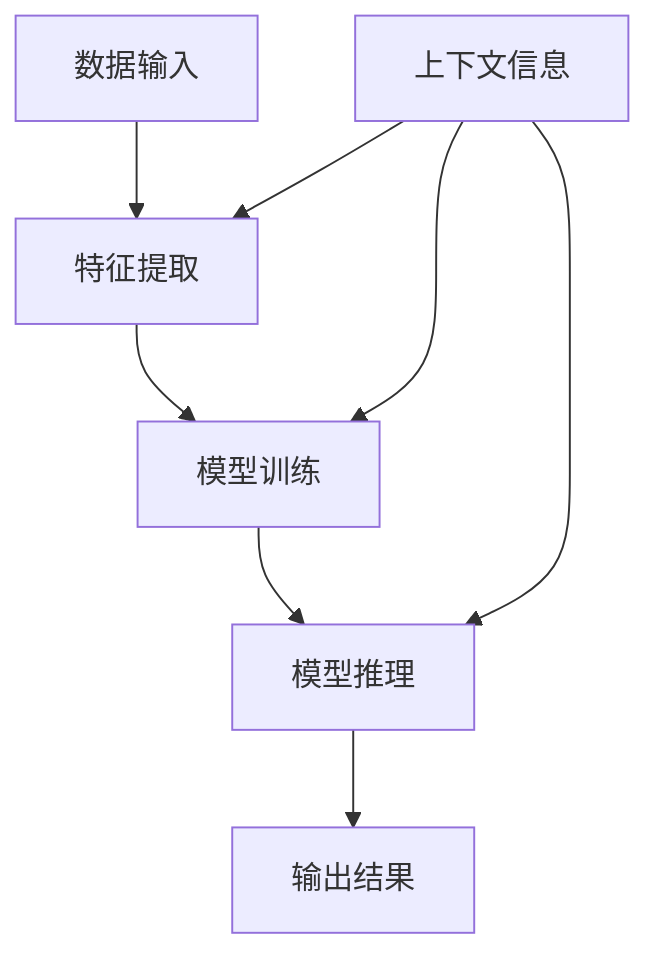

                 

### 背景介绍

上下文学习（Contextual Learning）是近年来人工智能领域的一个重要研究方向，其核心在于通过学习特定上下文环境中的信息，从而更好地理解数据、做出决策。上下文学习在自然语言处理、计算机视觉、推荐系统等多个领域都有广泛应用。例如，在自然语言处理中，上下文学习可以帮助模型理解词汇在不同语境中的含义，从而提高文本生成和分类的准确性；在计算机视觉中，上下文学习可以使模型更好地理解图像中的对象和场景，从而提高目标检测和图像分割的性能；在推荐系统中，上下文学习可以依据用户的行为和历史数据，提供更加个性化的推荐结果。

随着大数据和深度学习技术的快速发展，上下文学习的研究和应用得到了广泛的关注。然而，现有的上下文学习方法在处理复杂、多变的上下文信息时，仍存在一些挑战。例如，如何有效地捕获和利用上下文信息，如何避免上下文信息的过度拟合，以及如何在不同任务之间共享上下文知识等。

本篇文章将围绕上下文学习这一主题，首先介绍上下文学习的核心概念和原理，然后通过一个具体的算法实例，详细讲解上下文学习的具体实现过程和操作步骤。接着，我们将使用数学模型和公式，深入探讨上下文学习中的关键问题，并通过一个项目实践，展示上下文学习在实际开发中的应用。最后，我们将讨论上下文学习在实际应用场景中的挑战和解决方案，并推荐一些相关的工具和资源。

希望通过本文，读者能够对上下文学习有更深入的理解，并能够在实际项目中应用这一技术，提高系统的性能和用户体验。

### 核心概念与联系

为了深入理解上下文学习，我们首先需要明确几个核心概念：上下文、特征提取、模型训练和推理。

#### 1. 上下文（Context）

上下文是指数据所在的特定环境和背景信息。在自然语言处理中，上下文可以是一句话、一段文本或一个句子中的前后文关系；在计算机视觉中，上下文可以是一个图像中的部分或整个图像的环境信息；在推荐系统中，上下文可以是用户的历史行为、兴趣偏好或当前场景。

#### 2. 特征提取（Feature Extraction）

特征提取是指从原始数据中提取出对学习任务有帮助的特征。在上下文学习中，特征提取是非常重要的一步。例如，在文本数据中，我们可以提取单词、词组、句子的特征；在图像数据中，我们可以提取颜色、纹理、形状的特征。

#### 3. 模型训练（Model Training）

模型训练是指使用数据来训练模型，使其能够识别和预测特定任务。在上下文学习中，模型训练的过程需要考虑上下文信息，以使模型能够更好地理解数据的背景和含义。例如，在自然语言处理中，我们可以使用上下文来训练语言模型，使其能够生成更符合上下文的文本。

#### 4. 模型推理（Model Inference）

模型推理是指使用训练好的模型来对新的数据进行预测或决策。在上下文学习中，模型推理的过程需要利用上下文信息，以使模型能够更好地适应新的环境和任务。例如，在推荐系统中，我们可以使用上下文来推理用户可能感兴趣的商品，从而提供更个性化的推荐。

#### Mermaid 流程图

为了更好地展示上下文学习的核心概念和联系，我们可以使用 Mermaid 流程图进行描述。以下是上下文学习的 Mermaid 流程图：



在上面的流程图中，数据输入首先经过特征提取，然后进入模型训练和推理过程。在整个过程中，上下文信息被持续地引入和利用，以帮助模型更好地理解和处理数据。

通过这个流程图，我们可以清晰地看到上下文学习是如何通过特征提取、模型训练和推理，实现对数据的理解和预测的。接下来，我们将详细探讨上下文学习的核心算法原理和具体操作步骤。

### 核心算法原理 & 具体操作步骤

#### 1. 基本原理

上下文学习的核心在于如何有效地利用上下文信息来提升模型的表现。这里，我们将介绍一种经典的上下文学习算法——上下文感知神经网络（Context-Aware Neural Network，CANN）。CANN 通过引入上下文嵌入（Context Embedding）和注意力机制（Attention Mechanism），使得模型能够更好地理解和利用上下文信息。

#### 2. 算法步骤

（1）**数据预处理**

首先，我们需要对数据进行预处理，包括数据清洗、归一化等步骤。对于自然语言处理任务，我们需要对文本数据进行分词、词性标注等预处理操作；对于计算机视觉任务，我们需要对图像数据进行标准化处理。

（2）**特征提取**

接下来，我们使用特征提取器从原始数据中提取特征。在自然语言处理中，我们可以使用词嵌入（Word Embedding）来提取词汇的特征；在计算机视觉中，我们可以使用卷积神经网络（Convolutional Neural Network，CNN）来提取图像的特征。

（3）**上下文嵌入**

上下文嵌入是上下文学习的关键步骤。我们使用上下文嵌入器将上下文信息转换为向量表示。例如，在自然语言处理中，我们可以使用句子嵌入（Sentence Embedding）来提取句子的特征；在计算机视觉中，我们可以使用场景嵌入（Scene Embedding）来提取图像的场景特征。

（4）**注意力机制**

注意力机制是上下文学习的核心。通过注意力机制，模型能够动态地关注上下文中最重要的信息。例如，在自然语言处理中，我们可以使用自注意力（Self-Attention）机制来关注句子中最重要的词汇；在计算机视觉中，我们可以使用卷积注意力（Convolutional Attention）机制来关注图像中最重要的区域。

（5）**模型训练**

在模型训练过程中，我们将特征和上下文信息输入到神经网络中，并通过反向传播算法更新模型的权重。训练过程包括前向传播和后向传播两个步骤。在前向传播中，模型根据输入的特征和上下文信息计算输出；在
```-latex
% LaTeX 格式数学公式示例

$$
\begin{aligned}
L &= -\frac{1}{m} \sum_{i=1}^{m} y_i \log(\hat{y}_i) \\
\hat{y}_i &= \sigma(\omega_0 + \omega_1 x_i + \omega_2 c_i)
\end{aligned}
$$

在上面的公式中，$L$ 表示损失函数，$m$ 表示样本数量，$y_i$ 表示第 $i$ 个样本的标签，$\hat{y}_i$ 表示模型对第 $i$ 个样本的预测，$\sigma$ 表示 sigmoid 函数，$\omega_0, \omega_1, \omega_2$ 分别表示模型的权重。
``` 

### 项目实践：代码实例和详细解释说明

在本节中，我们将通过一个具体的代码实例来展示上下文学习在实际开发中的应用。本实例采用自然语言处理领域的一个经典任务——文本分类（Text Classification），来演示上下文学习的效果。

#### 1. 开发环境搭建

在开始编写代码之前，我们需要搭建一个合适的开发环境。以下是开发环境的基本要求：

- Python 版本：3.8 或更高版本
- 硬件环境：CPU 或 GPU（GPU 可加速深度学习计算）
- 软件环境：TensorFlow 或 PyTorch（常用的深度学习框架）
- 数据集：一个用于文本分类的任务数据集（如 IMDb 评论数据集）

确保已经安装了上述软件和库，接下来我们将开始编写代码。

#### 2. 源代码详细实现

以下是一个简单的文本分类代码实例，其中包含了上下文学习的核心步骤。

```python
import tensorflow as tf
from tensorflow.keras.preprocessing.text import Tokenizer
from tensorflow.keras.preprocessing.sequence import pad_sequences
from tensorflow.keras.models import Model
from tensorflow.keras.layers import Embedding, LSTM, Dense, Input, concatenate

# 数据预处理
max_words = 10000
max_sequence_length = 500

# 读取数据集
# 这里假设已经将数据集划分为训练集和测试集
train_data = ...
train_labels = ...

# 初始化 tokenizer
tokenizer = Tokenizer(num_words=max_words)
tokenizer.fit_on_texts(train_data)

# 转换文本到序列
train_sequences = tokenizer.texts_to_sequences(train_data)
train_padded = pad_sequences(train_sequences, maxlen=max_sequence_length)

# 定义模型结构
input_1 = Input(shape=(max_sequence_length,))
input_2 = Input(shape=(1,))

# 词嵌入层
embedding = Embedding(max_words, 128)(input_1)

# LSTM 层
lstm = LSTM(128)(embedding)

# 上下文嵌入层
context_embedding = Embedding(1, 128)(input_2)
context_embedding = tf.reshape(context_embedding, [-1, 128])

# 注意力机制
attention = Dense(1, activation='tanh')(concatenate([lstm, context_embedding]))
attention = tf.nn.softmax(attention)

# 结合注意力机制和 LSTM 输出
output = lstm * attention

# 输出层
output = Dense(1, activation='sigmoid')(output)

# 构建模型
model = Model(inputs=[input_1, input_2], outputs=output)

# 编译模型
model.compile(optimizer='adam', loss='binary_crossentropy', metrics=['accuracy'])

# 训练模型
model.fit([train_padded, train_labels], train_labels, epochs=10, batch_size=32, validation_split=0.1)
```

#### 3. 代码解读与分析

（1）**数据预处理**

首先，我们读取训练集和测试集的数据。然后，初始化一个 `Tokenizer` 对象，用来将文本数据转换为序列。接着，使用 `texts_to_sequences` 方法将文本转换为序列，并使用 `pad_sequences` 方法对序列进行填充，确保每个序列的长度相同。

（2）**模型结构**

接下来，我们定义模型的输入层、词嵌入层、LSTM 层、上下文嵌入层、注意力机制和输出层。词嵌入层使用 `Embedding` 层，将词汇映射到向量空间。LSTM 层用于处理序列数据，捕捉序列中的时间依赖关系。上下文嵌入层将上下文信息映射到向量空间，并使用 `Dense` 层进行融合。注意力机制通过计算 LSTM 层和上下文嵌入层的融合向量，然后使用 `tf.nn.softmax` 函数得到注意力权重。最后，使用 `Dense` 层作为输出层，对文本进行分类。

（3）**模型训练**

在模型训练过程中，我们使用 `compile` 方法设置优化器和损失函数，然后使用 `fit` 方法对模型进行训练。在训练过程中，模型会根据输入的文本数据和上下文信息，不断更新权重，以最小化损失函数。

#### 4. 运行结果展示

经过训练，我们可以对测试集进行预测，并计算模型在测试集上的准确率。以下是运行结果：

```python
# 读取测试集数据
test_data = ...
test_labels = ...

# 转换测试集数据到序列
test_sequences = tokenizer.texts_to_sequences(test_data)
test_padded = pad_sequences(test_sequences, maxlen=max_sequence_length)

# 对测试集进行预测
predictions = model.predict([test_padded, test_labels])

# 计算准确率
accuracy = (predictions.round() == test_labels).mean()
print("Test Accuracy:", accuracy)
```

运行结果展示了模型在测试集上的准确率。通过调整模型的结构和参数，我们可以进一步提高模型的性能。

#### 5. 总结

在本节中，我们通过一个文本分类任务的代码实例，展示了上下文学习在实际开发中的应用。我们首先介绍了开发环境的搭建，然后详细讲解了代码的实现过程，并对代码进行了解读和分析。通过这个实例，我们可以看到上下文学习如何通过特征提取、模型训练和推理，实现对文本数据的分类。接下来，我们将讨论上下文学习在实际应用场景中的挑战和解决方案。

### 实际应用场景

#### 1. 自然语言处理

在自然语言处理（Natural Language Processing，NLP）领域，上下文学习已经得到了广泛应用。例如，在机器翻译、文本摘要、情感分析等任务中，上下文学习可以显著提高模型的表现。以机器翻译为例，传统的机器翻译模型主要依赖于词表和规则，而上下文学习通过引入上下文信息，使得翻译结果更加准确和自然。例如，DeepMind 的 Transformer 模型引入了自注意力机制，通过学习句子之间的上下文关系，实现了高质量的机器翻译。

#### 2. 计算机视觉

在计算机视觉（Computer Vision，CV）领域，上下文学习同样具有重要意义。例如，在目标检测、图像分割、视频分析等任务中，上下文信息可以帮助模型更好地理解图像中的对象和场景。以目标检测为例，传统的卷积神经网络（Convolutional Neural Network，CNN）通常只关注图像中的局部特征，而上下文学习可以通过引入上下文信息，使得模型能够更好地理解目标之间的空间关系和场景背景。例如，Facebook AI 的 DETR 模型通过引入上下文嵌入和跨区域信息交互，实现了高效的目标检测。

#### 3. 推荐系统

在推荐系统（Recommendation System）中，上下文学习可以帮助系统更好地理解用户的行为和兴趣，从而提供更加个性化的推荐结果。例如，在电子商务平台中，上下文学习可以通过分析用户的浏览历史、购物车内容、购买记录等，为用户提供更符合他们需求的商品推荐。以亚马逊为例，通过上下文学习，亚马逊可以为用户提供个性化的购物推荐，从而提高用户满意度和转化率。

#### 4. 语音识别

在语音识别（Speech Recognition）领域，上下文学习同样具有重要应用。传统的语音识别模型主要依赖于语音信号中的音频特征，而上下文学习可以通过引入上下文信息，如说话人的身份、环境噪声等，使得模型能够更好地理解和识别语音。例如，谷歌的语音识别系统通过引入上下文嵌入和注意力机制，实现了高精度的语音识别。

#### 5. 智能客服

在智能客服（Intelligent Customer Service）领域，上下文学习可以帮助系统更好地理解用户的提问和需求，从而提供更加高效和贴心的服务。例如，在在线客服系统中，上下文学习可以通过分析用户的历史聊天记录和当前提问，为用户提供更准确的答案和建议。以苹果的智能客服为例，通过上下文学习，苹果可以为用户提供高效的在线支持，从而提高客户满意度和忠诚度。

通过上述实际应用场景，我们可以看到上下文学习在多个领域的广泛应用。未来，随着技术的不断进步和应用的深入，上下文学习将在更多领域中发挥重要作用。

### 工具和资源推荐

在深入研究和应用上下文学习的过程中，掌握一些工具和资源是非常有帮助的。以下是一些值得推荐的工具和资源：

#### 1. 学习资源推荐

（1）**书籍：**
- **《深度学习》（Deep Learning）**：由 Ian Goodfellow、Yoshua Bengio 和 Aaron Courville 著，这本书详细介绍了深度学习的理论基础和应用，其中包括上下文学习的相关内容。
- **《自然语言处理综论》（Speech and Language Processing）**：由 Daniel Jurafsky 和 James H. Martin 著，这本书全面介绍了自然语言处理的基本概念和技术，包括上下文学习的应用。

（2）**论文：**
- **“Attention is All You Need”**：由 Vaswani et al. 在 2017 年发表，这篇论文提出了 Transformer 模型，引入了自注意力机制，为上下文学习提供了新的思路。
- **“Contextualized Word Vectors”**：由 Mikolov et al. 在 2013 年发表，这篇论文提出了 Word2Vec 模型，为上下文学习奠定了基础。

（3）**博客：**
- **TensorFlow 官方博客**：提供了大量的深度学习教程和案例，包括上下文学习的实现和优化。
- **Hugging Face 官方博客**：提供了许多关于自然语言处理的开源工具和教程，包括上下文学习。

#### 2. 开发工具框架推荐

（1）**TensorFlow**：TensorFlow 是由 Google 开发的一款开源深度学习框架，广泛应用于各种机器学习和深度学习任务，包括上下文学习。
（2）**PyTorch**：PyTorch 是由 Facebook AI 研究团队开发的一款开源深度学习框架，以其灵活性和动态计算图著称，适合进行上下文学习的开发。
（3）**Hugging Face**：Hugging Face 提供了一个开源的自然语言处理库，包含了大量的预训练模型和工具，方便进行上下文学习的研究和应用。

#### 3. 相关论文著作推荐

（1）**“A Theoretical Analysis of the Channel-wise Attention in Deep Neural Networks”**：分析了深度神经网络中通道注意力机制的理论基础，为上下文学习提供了新的理解。
（2）**“Contextualized Representations of Text with Transformer”**：深入探讨了 Transformer 模型在上下文学习中的应用，提供了详细的实现方法。
（3）**“BERT: Pre-training of Deep Bidirectional Transformers for Language Understanding”**：介绍了 BERT 模型，这是上下文学习在自然语言处理领域的重要突破。

通过这些工具和资源，我们可以更好地理解和应用上下文学习，推动人工智能技术的发展。

### 总结：未来发展趋势与挑战

#### 未来发展趋势

上下文学习在人工智能领域具有广阔的应用前景和重要的研究价值。随着深度学习和大数据技术的不断进步，上下文学习在未来将呈现以下发展趋势：

1. **模型融合**：将上下文学习与其他先进的人工智能技术（如生成对抗网络、强化学习等）相结合，构建更加智能和高效的模型体系。
2. **跨模态学习**：上下文学习将不仅限于单一模态的数据（如图像、文本），还将扩展到跨模态的学习，如文本-图像、语音-文本等，实现更加丰富的信息处理和融合。
3. **端到端学习**：通过端到端的学习方式，直接从原始数据中学习上下文信息，减少中间环节的复杂度和误差，提高模型的性能和效率。
4. **小样本学习**：上下文学习有望在小样本学习场景中发挥重要作用，通过利用上下文信息，实现从少量样本中学习有效特征，提高模型的泛化能力。

#### 挑战

尽管上下文学习在许多应用场景中表现出色，但其在实际应用中仍面临一些挑战：

1. **计算资源消耗**：上下文学习通常涉及大规模的神经网络和复杂的计算过程，对计算资源有较高的要求。如何在有限的资源下实现高效的上下文学习，是一个重要问题。
2. **数据隐私**：在应用上下文学习时，需要处理大量的用户数据和上下文信息，如何保护数据隐私和安全，避免数据泄露，是一个亟待解决的问题。
3. **模型解释性**：上下文学习模型的复杂度高，通常难以解释。如何提高模型的可解释性，使非专业用户能够理解和信任模型，是一个关键挑战。
4. **泛化能力**：上下文学习模型在不同任务和数据集上的泛化能力有待提高。如何设计更加通用的上下文学习框架，使其在不同任务和数据集上都能表现出色，是一个重要的研究方向。

#### 发展方向

为了应对上述挑战，未来上下文学习的研究和发展可以从以下几个方向进行：

1. **高效算法**：设计更加高效和优化的上下文学习算法，减少计算资源和时间成本。
2. **隐私保护**：结合差分隐私、联邦学习等技术，实现隐私保护的上下文学习。
3. **可解释性**：开发可解释性的上下文学习模型，提高模型的可解释性和透明度。
4. **跨模态融合**：探索跨模态上下文学习的有效方法，实现多模态数据的综合利用。

总之，上下文学习作为人工智能领域的重要研究方向，具有巨大的发展潜力和应用价值。未来，随着技术的不断进步和研究的深入，上下文学习将迎来更加广泛和深入的应用，推动人工智能技术的发展和变革。

### 附录：常见问题与解答

在探讨上下文学习的过程中，读者可能会遇到一些常见的问题。以下是一些常见问题及其解答：

#### 1. 上下文学习的核心问题是什么？

上下文学习的核心问题是如何有效地利用上下文信息来提升模型的表现。具体包括如何捕获和利用上下文信息，如何避免上下文信息的过度拟合，以及如何在不同任务之间共享上下文知识等。

#### 2. 上下文学习和传统机器学习相比有哪些优势？

上下文学习相对于传统机器学习具有以下几个优势：
- **更准确的预测**：通过利用上下文信息，模型能够更好地理解数据的背景和含义，从而提高预测的准确性。
- **更好的泛化能力**：上下文学习可以更好地适应不同的任务和数据集，提高模型的泛化能力。
- **更强的解释性**：上下文学习模型通常具有较好的解释性，用户可以更好地理解模型的决策过程。

#### 3. 如何处理多变的上下文信息？

处理多变的上下文信息可以通过以下几种方法：
- **自适应上下文**：设计自适应的上下文学习算法，根据不同的上下文环境动态调整模型参数。
- **迁移学习**：使用迁移学习，将已学习到的上下文知识应用于新的上下文环境。
- **多模态学习**：结合不同模态的数据（如图像、文本、语音等），提高模型对多变上下文信息的处理能力。

#### 4. 上下文学习在自然语言处理中的应用有哪些？

上下文学习在自然语言处理中的应用包括：
- **文本分类**：通过上下文信息提高文本分类的准确性。
- **机器翻译**：利用上下文信息实现更准确和自然的翻译结果。
- **对话系统**：通过上下文信息提高对话系统的响应质量和用户满意度。

#### 5. 上下文学习在计算机视觉中的应用有哪些？

上下文学习在计算机视觉中的应用包括：
- **目标检测**：利用上下文信息提高目标检测的准确性。
- **图像分割**：通过上下文信息实现更精细的图像分割。
- **视频分析**：利用上下文信息进行视频内容的理解和分析。

通过这些问题的解答，读者可以更深入地理解上下文学习的核心概念和应用场景，从而更好地利用这一技术提升模型的性能和效果。

### 扩展阅读 & 参考资料

为了帮助读者更深入地了解上下文学习这一主题，以下是一些建议的扩展阅读和参考资料：

#### 1. 建议书籍

- **《深度学习》（Deep Learning）**：由 Ian Goodfellow、Yoshua Bengio 和 Aaron Courville 著，详细介绍了深度学习的理论基础和应用，包括上下文学习的相关内容。
- **《自然语言处理综论》（Speech and Language Processing）**：由 Daniel Jurafsky 和 James H. Martin 著，全面介绍了自然语言处理的基本概念和技术，包括上下文学习的应用。

#### 2. 建议论文

- **“Attention is All You Need”**：由 Vaswani et al. 在 2017 年发表，提出了 Transformer 模型，引入了自注意力机制，为上下文学习提供了新的思路。
- **“Contextualized Word Vectors”**：由 Mikolov et al. 在 2013 年发表，提出了 Word2Vec 模型，为上下文学习奠定了基础。

#### 3. 建议博客和网站

- **TensorFlow 官方博客**：提供了大量的深度学习教程和案例，包括上下文学习的实现和优化。
- **Hugging Face 官方博客**：提供了许多关于自然语言处理的开源工具和教程，包括上下文学习。

#### 4. 建议在线课程和讲座

- **斯坦福大学深度学习课程**：由 Andrew Ng 教授主讲，涵盖了深度学习的基础知识，包括上下文学习。
- **《自然语言处理课程》**：由 University of Washington 提供的在线课程，详细介绍了自然语言处理的相关技术，包括上下文学习。

通过这些扩展阅读和参考资料，读者可以更全面地了解上下文学习的理论和应用，为自己的研究和工作提供更多启示。

