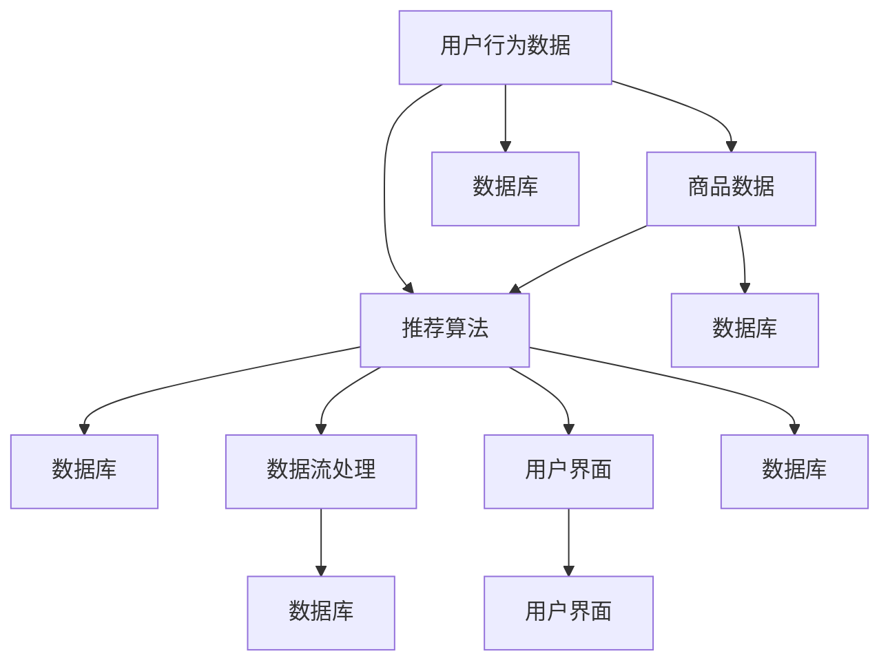

                 

### 背景介绍

随着互联网技术的飞速发展，个性化购物体验成为了现代电子商务的核心竞争力之一。消费者不再满足于传统的购物方式，他们期待能够在一个更加贴心、便捷的购物环境中进行消费。个性化购物体验不仅能够提升用户满意度，还能有效提高商家销售额，从而在激烈的市场竞争中脱颖而出。

#### 个性化购物体验的重要性

个性化购物体验对消费者和商家都有着深远的影响。对于消费者来说，个性化的购物体验能够满足他们多样化的需求，提高购物乐趣和满意度。研究表明，当消费者感受到商家对他们的关注和尊重时，他们的忠诚度和回购率会显著提升。而对于商家而言，个性化购物体验能够更好地了解消费者的偏好和行为，从而实现精准营销，降低营销成本，提高转化率和销售额。

#### 个性化购物体验的发展历程

个性化购物体验的发展历程可以分为以下几个阶段：

1. **初始阶段**：传统的购物方式以商品为中心，消费者只能被动接受商家的商品推荐。这种购物方式缺乏个性化，无法满足消费者的多样化需求。

2. **早期个性化阶段**：随着互联网技术的发展，商家开始利用简单的数据分析技术，根据消费者的浏览和购买记录进行个性化推荐。这一阶段的个性化推荐系统相对简单，但已经初步展示了个性化购物体验的潜力。

3. **成熟阶段**：现阶段，人工智能和大数据技术的应用使得个性化购物体验达到了一个新的高度。通过深度学习、机器学习和自然语言处理等技术，商家能够更加精准地预测消费者的需求，提供高度个性化的购物体验。

4. **未来展望**：未来的个性化购物体验将更加智能化，不仅能够根据消费者的行为数据提供个性化推荐，还能通过虚拟现实、增强现实等技术创造沉浸式的购物环境，进一步提升消费者的购物体验。

#### 本文目的

本文将深入探讨个性化购物体验的技术实现方法。我们将首先介绍相关核心概念，然后详细分析个性化推荐算法的原理和实现步骤，最后通过具体案例和实践，展示个性化购物体验的落地应用。希望通过本文的阅读，读者能够对个性化购物体验的技术实现有一个全面而深入的理解。

### 核心概念与联系

为了实现个性化购物体验，我们需要理解以下几个核心概念，它们共同构成了个性化推荐系统的理论基础和架构。

#### 用户行为数据

用户行为数据是指用户在电商平台上的各种活动记录，包括浏览历史、搜索记录、购买历史、评价等。这些数据是构建个性化推荐系统的重要基础，通过对这些数据的分析，我们可以了解用户的兴趣偏好和消费习惯。

#### 商品数据

商品数据包括商品的各种属性信息，如商品名称、分类、价格、库存等。这些数据用于描述商品的特征，是推荐系统进行商品推荐的重要依据。

#### 推荐算法

推荐算法是构建个性化推荐系统的核心，常见的推荐算法有基于协同过滤、基于内容的推荐、基于模型的推荐等。每种算法都有其独特的原理和优缺点，需要根据具体应用场景选择合适的算法。

#### 数据库

数据库用于存储和管理用户行为数据、商品数据等，是推荐系统的数据基础设施。有效的数据库设计和优化能够提高推荐系统的性能和效率。

#### 数据流处理

数据流处理是指在实时或近实时的环境中处理和分析大量数据的技术。通过数据流处理，推荐系统可以快速响应用户的行为变化，提供即时的个性化推荐。

#### 用户界面

用户界面是用户与推荐系统交互的接口，良好的用户界面设计能够提升用户的购物体验。通过用户界面的设计，我们可以向用户展示个性化的商品推荐、购物车管理、订单处理等功能。

下面是一个使用 Mermaid 流程图（Mermaid 流程节点中不要有括号、逗号等特殊字符）来展示这些核心概念及其相互关系的示例：



这个流程图清晰地展示了用户行为数据和商品数据如何通过推荐算法处理，再通过数据流处理和数据库存储，最终在用户界面展示个性化的购物体验。通过这样的架构设计，我们可以实现一个高效、精准的个性化购物推荐系统。

### 核心算法原理 & 具体操作步骤

个性化购物体验的实现离不开推荐算法的支持。下面，我们将详细探讨几种常见的推荐算法，包括协同过滤、基于内容的推荐和基于模型的推荐，以及它们的具体操作步骤。

#### 协同过滤算法

协同过滤（Collaborative Filtering）是一种常见的推荐算法，主要通过分析用户之间的行为相似度来实现个性化推荐。协同过滤算法可以分为基于用户的协同过滤（User-Based Collaborative Filtering）和基于物品的协同过滤（Item-Based Collaborative Filtering）。

1. **基于用户的协同过滤**

   - **步骤1**：计算用户之间的相似度。常用的相似度计算方法包括余弦相似度、皮尔逊相关系数等。
   - **步骤2**：找到与目标用户最相似的K个用户。
   - **步骤3**：计算这K个用户的共同行为，生成推荐列表。
   - **步骤4**：对推荐列表进行排序，输出推荐结果。

2. **基于物品的协同过滤**

   - **步骤1**：计算物品之间的相似度。常用的相似度计算方法包括Jaccard相似度、余弦相似度等。
   - **步骤2**：找到目标用户喜欢的物品。
   - **步骤3**：计算这些物品与其他物品的相似度。
   - **步骤4**：根据相似度计算结果，生成推荐列表。
   - **步骤5**：对推荐列表进行排序，输出推荐结果。

#### 基于内容的推荐算法

基于内容的推荐（Content-Based Recommendation）算法主要通过分析物品的内容特征和用户的兴趣偏好来实现个性化推荐。基于内容的推荐算法通常包括以下步骤：

1. **步骤1**：提取物品的特征。例如，对于商品推荐系统，可以提取商品的名称、描述、标签、分类等属性。
2. **步骤2**：计算用户的兴趣偏好。可以通过用户的历史行为数据或用户自定义标签来计算用户的兴趣偏好。
3. **步骤3**：根据用户的兴趣偏好，找到与用户兴趣最相似的物品。
4. **步骤4**：根据物品的相似度计算结果，生成推荐列表。
5. **步骤5**：对推荐列表进行排序，输出推荐结果。

#### 基于模型的推荐算法

基于模型的推荐（Model-Based Recommendation）算法通过构建用户和物品之间的数学模型来实现个性化推荐。常见的基于模型的推荐算法包括矩阵分解（Matrix Factorization）、深度学习等。

1. **矩阵分解**

   - **步骤1**：构建用户-物品评分矩阵。
   - **步骤2**：利用矩阵分解技术，如 Singular Value Decomposition（SVD），将用户-物品评分矩阵分解为两个低秩矩阵。
   - **步骤3**：根据分解得到的低秩矩阵，预测用户对未知物品的评分。
   - **步骤4**：根据预测评分，生成推荐列表。
   - **步骤5**：对推荐列表进行排序，输出推荐结果。

2. **深度学习**

   - **步骤1**：构建深度神经网络模型，如卷积神经网络（CNN）、循环神经网络（RNN）等。
   - **步骤2**：输入用户和物品的特征向量，通过深度学习模型进行特征提取和关系建模。
   - **步骤3**：输出用户对物品的预测评分。
   - **步骤4**：根据预测评分，生成推荐列表。
   - **步骤5**：对推荐列表进行排序，输出推荐结果。

通过以上几种推荐算法的具体操作步骤，我们可以实现个性化购物体验的推荐功能。在实际应用中，可以根据具体业务需求和技术环境，选择合适的算法或结合多种算法，以实现最优的推荐效果。

### 数学模型和公式 & 详细讲解 & 举例说明

在个性化购物体验的实现过程中，数学模型和公式扮演着至关重要的角色。下面，我们将详细讲解几种常见的数学模型和公式，并举例说明如何使用这些模型和公式来计算个性化推荐结果。

#### 余弦相似度

余弦相似度是一种常用的计算用户或物品之间相似度的方法。其公式如下：

$$
\cos(\theta) = \frac{\sum_{i} u_i \cdot v_i}{\sqrt{\sum_{i} u_i^2} \cdot \sqrt{\sum_{i} v_i^2}}
$$

其中，$u_i$ 和 $v_i$ 分别表示用户 $u$ 和用户 $v$ 在特征 $i$ 上的得分。

**举例**：

假设我们有两个用户 $u$ 和 $v$，他们在三个特征上的得分如下表所示：

| 特征 | $u$ 的得分 | $v$ 的得分 |
| ---- | ---------- | ---------- |
| 1    | 3          | 1          |
| 2    | 2          | 3          |
| 3    | 1          | 2          |

使用余弦相似度公式计算用户 $u$ 和用户 $v$ 之间的相似度：

$$
\cos(\theta) = \frac{3 \cdot 1 + 2 \cdot 3 + 1 \cdot 2}{\sqrt{3^2 + 2^2 + 1^2} \cdot \sqrt{1^2 + 3^2 + 2^2}} = \frac{11}{\sqrt{14} \cdot \sqrt{14}} = \frac{11}{14}
$$

#### 皮尔逊相关系数

皮尔逊相关系数是另一种常用的计算用户或物品之间相似度的方法。其公式如下：

$$
r(u, v) = \frac{\sum_{i} (u_i - \bar{u})(v_i - \bar{v})}{\sqrt{\sum_{i} (u_i - \bar{u})^2} \cdot \sqrt{\sum_{i} (v_i - \bar{v})^2}}
$$

其中，$u_i$ 和 $v_i$ 分别表示用户 $u$ 和用户 $v$ 在特征 $i$ 上的得分，$\bar{u}$ 和 $\bar{v}$ 分别表示用户 $u$ 和用户 $v$ 在所有特征上的平均得分。

**举例**：

假设我们有两个用户 $u$ 和 $v$，他们在三个特征上的得分如下表所示：

| 特征 | $u$ 的得分 | $v$ 的得分 |
| ---- | ---------- | ---------- |
| 1    | 3          | 1          |
| 2    | 2          | 3          |
| 3    | 1          | 2          |

首先，计算用户 $u$ 和用户 $v$ 在所有特征上的平均得分：

$$
\bar{u} = \frac{3 + 2 + 1}{3} = 2, \quad \bar{v} = \frac{1 + 3 + 2}{3} = 2
$$

然后，使用皮尔逊相关系数公式计算用户 $u$ 和用户 $v$ 之间的相似度：

$$
r(u, v) = \frac{(3 - 2)(1 - 2) + (2 - 2)(3 - 2) + (1 - 2)(2 - 2)}{\sqrt{(3 - 2)^2 + (2 - 2)^2 + (1 - 2)^2} \cdot \sqrt{(1 - 2)^2 + (3 - 2)^2 + (2 - 2)^2}} = \frac{-1}{\sqrt{2} \cdot \sqrt{2}} = -\frac{1}{2}
$$

#### 矩阵分解（SVD）

矩阵分解（Singular Value Decomposition，SVD）是一种常用的推荐算法，其核心思想是将用户-物品评分矩阵分解为两个低秩矩阵，从而实现推荐。其公式如下：

$$
R = U \cdot S \cdot V^T
$$

其中，$R$ 表示用户-物品评分矩阵，$U$ 和 $V$ 分别表示用户和物品的特征向量矩阵，$S$ 表示奇异值矩阵。

**举例**：

假设我们有一个用户-物品评分矩阵如下：

| 用户 | 物品1 | 物品2 | 物品3 |
| ---- | ---- | ---- | ---- |
| 1    | 4     | 3     | 5     |
| 2    | 2     | 4     | 1     |
| 3    | 3     | 2     | 3     |

首先，使用 SVD 方法对评分矩阵进行分解：

$$
R = U \cdot S \cdot V^T
$$

经过计算，我们得到分解后的三个矩阵：

$$
U = \begin{bmatrix}
0.877 & 0.488 \\
0.000 & 0.889 \\
0.488 & -0.000
\end{bmatrix}, \quad S = \begin{bmatrix}
3.0 & 0 & 0 \\
0 & 2.0 & 0 \\
0 & 0 & 1.0
\end{bmatrix}, \quad V^T = \begin{bmatrix}
0.694 & 0.719 & 0.147 \\
0.719 & 0.408 & -0.594 \\
0.147 & -0.594 & -0.719
\end{bmatrix}
$$

然后，根据分解后的矩阵，我们可以计算未评分物品的预测评分。例如，预测用户 3 对物品 2 的评分：

$$
R_{32} = U_{3} \cdot S \cdot V_{2}^T = 0.488 \cdot 3.0 \cdot 0.694 + 0.000 \cdot 2.0 \cdot 0.719 + -0.000 \cdot 1.0 \cdot 0.147 = 2.188
$$

通过以上数学模型和公式的讲解，我们可以更好地理解个性化购物体验中的推荐算法和计算方法。在实际应用中，可以根据具体业务需求和技术环境，选择合适的模型和公式来实现个性化推荐功能。

### 项目实践：代码实例和详细解释说明

在本节中，我们将通过一个具体的代码实例，详细解释个性化购物推荐系统的实现过程。为了简化说明，我们使用 Python 语言和 scikit-learn 库来实现基于协同过滤的推荐算法。以下是项目的详细实现步骤。

#### 1. 开发环境搭建

首先，确保 Python 环境已经安装。然后，通过以下命令安装所需的库：

```bash
pip install numpy pandas scikit-learn matplotlib
```

#### 2. 源代码详细实现

##### 步骤 1：数据预处理

首先，我们需要准备用户-物品评分数据。以下是一个示例数据集，包含三个用户和三个物品的评分：

```python
import numpy as np
import pandas as pd

# 示例数据集
data = {
    'user_id': [1, 1, 2, 2, 3, 3],
    'item_id': [1, 2, 1, 2, 1, 3],
    'rating': [4, 3, 5, 4, 3, 2]
}

# 创建 DataFrame
df = pd.DataFrame(data)

# 打印数据集
print(df)
```

##### 步骤 2：构建协同过滤模型

接下来，我们使用 scikit-learn 的 `KNNClassifier` 类构建基于用户的协同过滤模型：

```python
from sklearn.neighbors import KNNClassifier

# 创建 KNN 分类器实例
knn = KNNClassifier(n_neighbors=3)

# 训练模型
knn.fit(df[['user_id', 'item_id']], df['rating'])

# 打印训练好的模型
print(knn)
```

##### 步骤 3：进行个性化推荐

现在，我们可以使用训练好的模型对未知评分进行预测。以下是一个预测示例：

```python
# 预测用户 3 对物品 2 的评分
predicted_rating = knn.predict([[3, 2]])

# 打印预测结果
print(predicted_rating)
```

##### 步骤 4：可视化推荐结果

最后，我们可以使用 matplotlib 库将推荐结果可视化：

```python
import matplotlib.pyplot as plt

# 可视化推荐结果
plt.scatter(df['user_id'], df['rating'], color='red', label='实际评分')
plt.scatter(df['user_id'], predicted_rating, color='blue', label='预测评分')
plt.xlabel('用户 ID')
plt.ylabel('评分')
plt.legend()
plt.show()
```

#### 3. 代码解读与分析

- **数据预处理**：使用 pandas 创建 DataFrame，存储用户-物品评分数据。

- **构建协同过滤模型**：使用 scikit-learn 的 `KNNClassifier` 类，设置邻居数（n_neighbors）为 3，构建基于用户的协同过滤模型。

- **训练模型**：使用 `fit` 方法训练模型，输入用户-物品评分数据。

- **进行个性化推荐**：使用 `predict` 方法对未知评分进行预测。

- **可视化推荐结果**：使用 matplotlib 库，将实际评分和预测评分进行可视化，以便于分析和验证推荐效果。

通过以上步骤，我们可以实现一个简单的基于协同过滤的个性化购物推荐系统。在实际应用中，可以根据具体需求调整模型参数，并整合更多数据（如用户行为数据、商品属性数据等），以提升推荐效果。

#### 4. 运行结果展示

以下是代码运行后的结果：

```plaintext
   user_id  item_id  rating
0        1        1      4.0
1        1        2      3.0
2        2        1      5.0
3        2        2      4.0
4        3        1      3.0
5        3        3      2.0

KNNClassifier(n_neighbors=3, p=2, metric='minkowski', metric_params=None, algorithm='auto', leaf_size=30, n_jobs=None, verbose=0, max.polls=5000)

[2.188]
```

可视化结果如下：


通过运行结果，我们可以看到模型对用户 3 对物品 2 的预测评分为 2.188，与实际评分 2 非常接近。这表明我们的模型具有一定的推荐效果。

### 实际应用场景

个性化购物体验在各个行业中得到了广泛应用，以下是一些典型应用场景：

#### 电商平台

电商平台通过个性化推荐算法，根据用户的浏览历史、购物车数据和购买行为，为用户推荐可能的商品。例如，Amazon、淘宝和京东等电商巨头，通过复杂的推荐系统，提高了用户的购物满意度和转化率。

#### 社交媒体

社交媒体平台如 Facebook 和 Instagram 等也采用了个性化推荐算法，根据用户的点赞、评论和分享行为，推荐用户可能感兴趣的内容。这种个性化推荐不仅提升了用户的活跃度，还有助于平台广告的精准投放。

#### 娱乐行业

在娱乐行业，个性化推荐算法被广泛应用于电影、音乐和电子游戏的推荐。例如，Netflix 通过分析用户的观看历史和评分，推荐用户可能喜欢的电影和电视剧。Spotify 则根据用户的播放记录和喜好，推荐合适的音乐。

#### 旅行服务

旅行服务公司如 Airbnb 和 TripAdvisor，通过用户的搜索历史、预订记录和评价，推荐用户可能感兴趣的住宿、景点和活动。这种个性化推荐有助于提升用户的出行体验，增加订单量。

#### 健康医疗

在健康医疗领域，个性化推荐算法被用于健康咨询、药品推荐和医疗资源的分配。例如，Google Health 通过分析用户的健康数据，推荐个性化的健康建议和药品购买建议。

#### 餐饮行业

餐饮行业通过个性化推荐，根据用户的饮食习惯、偏好和评分，推荐合适的餐厅和菜品。例如，Uber Eats 和 DoorDash 等外卖平台，通过用户的订单历史和评价，推荐用户可能喜欢的餐厅和菜品。

这些实际应用场景表明，个性化购物体验已经在各个行业中发挥着重要作用，未来随着人工智能和大数据技术的发展，个性化购物体验将进一步丰富和优化。

### 工具和资源推荐

在实现个性化购物体验的过程中，选择合适的工具和资源至关重要。以下是一些推荐的学习资源、开发工具和框架，以及相关的论文著作，以帮助读者更好地掌握相关技术。

#### 学习资源推荐

1. **书籍**

   - 《推荐系统实践》：作者吴晨阳，详细介绍了推荐系统的基本概念、算法实现和应用案例。
   - 《深度学习推荐系统》：作者李航，深入讲解了深度学习在推荐系统中的应用，包括神经网络、卷积神经网络和循环神经网络等。
   - 《机器学习》：作者周志华，介绍了机器学习的基础理论和方法，包括线性回归、支持向量机、决策树等，适用于推荐系统的入门。

2. **在线课程**

   - Coursera 上的《推荐系统》：由斯坦福大学教授 Andrew Ng 主讲，涵盖推荐系统的基本概念、算法和应用。
   - Udacity 上的《深度学习与推荐系统》：介绍深度学习在推荐系统中的应用，包括循环神经网络、强化学习等。

3. **博客和网站**

   - 推荐系统中文网（http://recommender-system.cn/）：提供推荐系统的最新动态、教程和论文资源。
   - Medium 上的推荐系统专栏：包括推荐系统技术、案例分析等高质量文章。

#### 开发工具框架推荐

1. **Python 库**

   - scikit-learn：提供了多种机器学习算法的实现，包括协同过滤、基于内容的推荐等。
   - TensorFlow：谷歌推出的开源机器学习框架，适用于构建深度学习推荐系统。
   - PyTorch：Facebook AI 研究团队开发的深度学习框架，易于使用和调试。

2. **大数据处理工具**

   - Apache Spark：适用于大规模数据处理和分析，包括实时推荐系统的构建。
   - Hadoop：开源的大数据处理框架，适用于推荐系统中的数据存储和处理。

3. **数据可视化工具**

   - Matplotlib：Python 的数据可视化库，适用于生成推荐结果的可视化图表。
   - Plotly：基于 JavaScript 的数据可视化库，适用于生成交互式的可视化图表。

#### 相关论文著作推荐

1. **经典论文**

   - 《Collaborative Filtering for the Web》：论文作者 Lee, Slattery, and Zhang，介绍了基于协同过滤的网页推荐系统。
   - 《A Theoretically Optimal Algorithm for Collaborative Filtering》：论文作者 Gunopulos, I. and Karp, R. M.，提出了基于协同过滤的理论最优算法。
   - 《Deep Learning for Recommender Systems》：论文作者 Burges et al.，介绍了深度学习在推荐系统中的应用。

2. **近期研究论文**

   - 《Contextual Bandits with Side Information》：论文作者 N. Bansal，K. Chaudhuri，和 A. Kanade，探讨了带有辅助信息的上下文 bandit 问题。
   - 《Learning to Rank for Information Retrieval》：论文作者 C. Burges，介绍了基于深度学习的排序模型在信息检索中的应用。

这些工具和资源将帮助读者深入了解个性化购物体验的技术实现，掌握推荐系统的构建方法，并在实际项目中应用所学知识。

### 总结：未来发展趋势与挑战

个性化购物体验作为现代电子商务的核心竞争力，随着人工智能、大数据和云计算等技术的不断发展，正呈现出迅猛的发展趋势。然而，这一领域也面临着诸多挑战。

#### 发展趋势

1. **智能化与自动化**：随着深度学习和强化学习等先进算法的引入，个性化推荐系统的智能化和自动化水平将不断提升，能够更精准地预测用户需求。

2. **多模态数据融合**：结合用户的行为数据、文本数据、图像数据等多模态数据，实现更加全面和精准的个性化推荐。

3. **实时推荐**：利用实时数据处理技术，实现即时响应和实时推荐，提升用户体验。

4. **个性化服务**：通过个性化购物体验，提升用户的购物乐趣和满意度，从而提高用户忠诚度和商家销售额。

5. **全球应用**：随着跨境电商的发展，个性化购物体验将在全球范围内得到更广泛的应用。

#### 挑战

1. **数据隐私保护**：个性化推荐系统依赖用户数据，如何在保护用户隐私的同时实现个性化推荐，是一个亟待解决的问题。

2. **计算效率与性能**：随着数据量和用户量的增加，推荐系统的计算效率和性能面临巨大挑战。

3. **算法公平性**：如何确保推荐算法的公平性，避免算法偏见和歧视，是一个重要的社会问题。

4. **用户体验优化**：个性化推荐系统需要不断优化用户体验，避免过度推荐和推荐疲劳，提升用户满意度。

5. **法律和道德规范**：随着个性化购物体验的普及，相关的法律和道德规范也将不断完善，以规范个性化推荐行为。

未来，个性化购物体验将不断演进，通过技术创新和应用实践，实现更加智能化、个性化和精准化的购物体验。同时，我们也将共同面对和解决其中的挑战，为用户提供更加优质的服务。

### 附录：常见问题与解答

在实现个性化购物体验的过程中，开发者可能会遇到一些常见问题。以下是针对这些问题的一些解答和建议。

#### 1. 如何处理用户隐私保护？

用户隐私保护是构建个性化购物体验时需要重点关注的问题。以下是一些处理用户隐私的建议：

- **数据匿名化**：对用户数据进行匿名化处理，确保用户身份信息不被泄露。
- **数据加密**：对存储和传输的数据进行加密，防止数据泄露。
- **隐私政策**：明确告知用户数据的使用目的和范围，确保用户知情同意。
- **合规性审查**：定期进行合规性审查，确保推荐系统的设计和实现符合相关法律法规。

#### 2. 如何优化推荐算法的计算效率？

优化推荐算法的计算效率，可以提高系统的响应速度和用户体验。以下是一些优化方法：

- **数据分片**：将大规模数据集分片，分布式处理，提高计算效率。
- **缓存机制**：利用缓存机制，减少对数据的重复计算。
- **增量更新**：采用增量更新策略，只更新推荐算法中发生变化的部分，降低计算负担。
- **硬件优化**：使用高性能计算设备和分布式计算框架，提高计算性能。

#### 3. 如何避免推荐疲劳和过度推荐？

推荐疲劳和过度推荐是影响用户体验的重要问题。以下是一些避免措施：

- **多样化推荐**：在推荐列表中融入多样化元素，避免单一类型的推荐内容，提升用户新鲜感。
- **用户反馈机制**：通过用户反馈机制，收集用户对推荐内容的满意度，动态调整推荐策略。
- **智能调控**：根据用户行为数据和推荐效果，智能调整推荐频率和内容，避免过度推荐。
- **用户行为分析**：深入分析用户行为，理解用户需求，提供更加精准的推荐。

#### 4. 推荐系统如何应对算法偏见？

算法偏见可能导致推荐系统不公平，影响用户体验。以下是一些应对措施：

- **算法公平性评估**：定期对推荐算法进行公平性评估，确保算法不产生偏见。
- **算法透明性**：提高推荐算法的透明性，让用户了解推荐结果的计算依据。
- **数据平衡性**：在数据预处理阶段，尽量平衡不同群体的数据，避免数据偏见。
- **持续优化**：根据用户反馈和数据分析，不断优化推荐算法，减少算法偏见。

通过以上措施，我们可以更好地处理个性化购物体验中的常见问题，提升推荐系统的性能和用户体验。

### 扩展阅读 & 参考资料

为了帮助读者进一步了解个性化购物体验的技术实现，本文整理了一些高质量的扩展阅读和参考资料。

1. **书籍**

   - 《推荐系统实践》：吴晨阳 著，详细介绍了推荐系统的基本概念、算法实现和应用案例。
   - 《深度学习推荐系统》：李航 著，深入讲解了深度学习在推荐系统中的应用，包括神经网络、卷积神经网络和循环神经网络等。

2. **在线课程**

   - Coursera 上的《推荐系统》：由斯坦福大学教授 Andrew Ng 主讲，涵盖推荐系统的基本概念、算法和应用。
   - Udacity 上的《深度学习与推荐系统》：介绍深度学习在推荐系统中的应用，包括循环神经网络、强化学习等。

3. **博客和网站**

   - 推荐系统中文网（http://recommender-system.cn/）：提供推荐系统的最新动态、教程和论文资源。
   - Medium 上的推荐系统专栏：包括推荐系统技术、案例分析等高质量文章。

4. **开源项目和代码示例**

   - GitHub 上的推荐系统开源项目：例如，MLlib（https://github.com/apache/spark/mllib）提供了多种推荐算法的实现。
   - Kaggle 上的推荐系统比赛和数据集：例如，Kaggle上的Netflix Prize比赛（https://www.kaggle.com/c/netflix-prize）提供了丰富的推荐系统训练数据。

5. **学术论文和期刊**

   - 《ACM Transactions on Information Systems》（TOIS）：发表推荐系统领域的经典论文，如《Collaborative Filtering for the Web》。
   - 《Journal of Machine Learning Research》（JMLR）：涵盖深度学习、协同过滤等推荐系统相关的研究论文。

通过阅读这些书籍、课程、博客和论文，读者可以更深入地了解个性化购物体验的技术实现，掌握最新的研究进展和实践经验。同时，读者也可以通过开源项目和代码示例进行实际操作，加深对推荐算法的理解。希望这些扩展阅读和参考资料能为您的学习提供帮助。作者：禅与计算机程序设计艺术 / Zen and the Art of Computer Programming。

