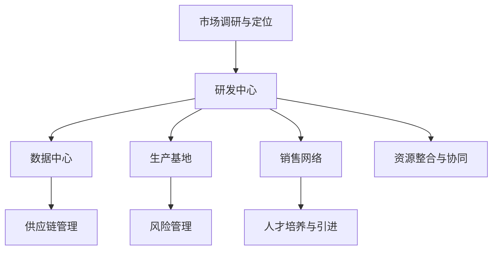

                 

### 背景介绍

#### 文章主题与重要性

本文主题为“中美双线布局：应对地缘政治风险”。这一主题具有重大的现实意义。随着全球化的深入发展，国际间的地缘政治风险愈发凸显。尤其是在中美两国的博弈中，如何合理布局技术资源和市场策略，成为企业和国家亟需思考的问题。

在当前的全球科技竞争中，中美两国无疑是主导者。中国作为全球第二大经济体，其技术实力和国际影响力日益增强。美国则作为全球科技创新的领头羊，其科技产业和技术标准在全球范围内具有重要影响力。两者之间的竞争，不仅体现在市场争夺上，也体现在技术标准的制定和科技人才的争夺上。

在这样的背景下，如何通过双线布局策略，有效降低地缘政治风险，提高技术竞争力和市场适应性，成为企业和国家共同关注的焦点。本文旨在通过对中美双线布局的深入探讨，为企业和国家的决策提供有益的参考。

#### 当前地缘政治风险形势

近年来，全球地缘政治风险不断加剧。特别是中美之间的紧张关系，已经成为全球关注的焦点。从贸易战到科技战，从南海争端到台海问题，中美之间的矛盾和冲突不断升级。

在地缘政治风险日益加大的背景下，企业和国家的技术布局面临着前所未有的挑战。首先，技术封锁和禁运成为常态。美国对华为等中国科技企业的制裁，不仅限制了这些企业的国际市场扩张，也对全球产业链产生了深远影响。其次，数据安全和隐私问题愈发突出。随着大数据、人工智能等技术的发展，数据安全和隐私保护成为各国政府和企业关注的重中之重。最后，技术标准和生态系统的控制权争夺愈发激烈。美国通过推行其技术标准和生态系统，试图在全球范围内确立其主导地位。

#### 双线布局的意义

面对这样的地缘政治风险，双线布局成为企业和国家的必然选择。双线布局，即在中国和美国同时布局技术资源和市场，通过分散风险，提高抗风险能力。

对于企业而言，双线布局意味着可以在中美两个市场同时获得发展机会，降低单一市场风险。同时，通过在中国和美国同时布局研发中心，可以吸引全球顶尖人才，提高技术竞争力。此外，双线布局还可以帮助企业在全球范围内优化供应链，提高供应链的韧性和适应性。

对于国家而言，双线布局可以提高国家的科技实力和国际影响力。通过在中国和美国同时布局高科技产业和研发中心，可以促进两国之间的科技合作和交流，提高全球科技治理能力。此外，双线布局还可以帮助国家在全球范围内建立技术标准和生态系统，提高国家的国际话语权。

#### 文章结构概述

本文将从以下几个方面进行深入探讨：

1. **核心概念与联系**：首先介绍双线布局的核心概念，包括双线布局的定义、目标和策略。同时，通过Mermaid流程图，展示双线布局的基本架构和关键环节。

2. **核心算法原理 & 具体操作步骤**：详细讲解双线布局的核心算法原理，包括如何在中国和美国建立双线布局的框架，以及如何优化双线布局的效率和效果。

3. **数学模型和公式 & 详细讲解 & 举例说明**：通过数学模型和公式，分析双线布局的成本、风险和收益，并提供实际案例进行说明。

4. **项目实践：代码实例和详细解释说明**：通过具体项目实践，展示双线布局的实施过程，并提供源代码和详细解释。

5. **实际应用场景**：探讨双线布局在不同行业和应用场景中的实际应用，分析其优势和挑战。

6. **工具和资源推荐**：推荐相关学习资源、开发工具和框架，帮助读者更好地理解和实施双线布局。

7. **总结：未来发展趋势与挑战**：总结双线布局的现状和未来发展趋势，探讨面临的挑战和应对策略。

通过上述内容的逐步分析，本文旨在为企业和国家的双线布局提供全面、系统的指导，帮助其应对地缘政治风险，实现可持续发展。

### 核心概念与联系

#### 双线布局的定义

双线布局，是指在两个或多个不同的地理位置或市场进行技术资源和市场布局的策略。具体而言，双线布局通常涉及在中国和美国同时建立研发中心、数据中心、生产基地和销售网络，以实现资源共享、风险分散和市场扩展。

#### 双线布局的目标

双线布局的主要目标包括：

1. **降低地缘政治风险**：通过在多个国家或地区布局，降低单一国家或地区地缘政治风险对企业或国家的影响。

2. **提高市场竞争力**：通过在中国和美国两个主要市场同时布局，提高企业的市场占有率和竞争力。

3. **吸引顶尖人才**：通过在多个国家布局研发中心，吸引全球顶尖人才，提高企业的技术水平和创新能力。

4. **优化供应链**：通过在全球范围内布局生产基地和供应链，提高供应链的韧性和适应性。

#### 双线布局的策略

双线布局的策略主要包括以下几个方面：

1. **市场定位与布局**：根据企业的核心业务和市场定位，选择在中国和美国建立研发中心、数据中心和生产基地的位置。例如，对于高科技企业，可以选择在中国一线城市和美国硅谷等科技创新中心建立研发中心。

2. **资源整合与共享**：通过在中国和美国建立双线布局，实现资源共享和协同发展。例如，可以共享技术、人才、市场资源和供应链，提高整体运营效率。

3. **风险管理**：通过在多个国家或地区布局，分散风险，降低单一国家或地区地缘政治风险的影响。

4. **人才培养与引进**：通过在多个国家布局研发中心，吸引和培养全球顶尖人才，提高企业的技术创新能力和竞争力。

#### 双线布局的基本架构

双线布局的基本架构包括以下几个方面：

1. **研发中心**：在中国和美国建立研发中心，吸引全球顶尖人才，开展技术创新和研发工作。

2. **数据中心**：在中国和美国建立数据中心，提供数据存储、处理和分析服务，支持企业的数据驱动决策。

3. **生产基地**：在中国和美国建立生产基地，生产制造企业的主要产品，满足国内外市场需求。

4. **销售网络**：在中国和美国建立销售网络，推广和销售企业的产品，提高市场占有率。

5. **供应链管理**：通过在中国和美国建立双线布局，优化供应链管理，提高供应链的韧性和适应性。

#### 双线布局的关键环节

双线布局的关键环节包括以下几个方面：

1. **市场调研与定位**：通过市场调研，确定在中国和美国的市场定位和战略方向。

2. **资源整合与协同**：整合在中国和美国的技术、人才和市场资源，实现资源共享和协同发展。

3. **风险管理**：通过风险管理，降低地缘政治风险对企业的影响。

4. **人才培养与引进**：通过人才培养和引进，提高企业的技术创新能力和竞争力。

5. **供应链优化**：通过优化供应链管理，提高供应链的韧性和适应性。

#### Mermaid 流程图

以下是一个简化的双线布局 Mermaid 流程图，展示双线布局的基本架构和关键环节：



通过上述核心概念与联系的介绍，我们可以清晰地理解双线布局的基本架构和策略。在接下来的章节中，我们将进一步探讨双线布局的核心算法原理、具体操作步骤、数学模型和公式，以及实际应用场景，为读者提供更加深入的指导。

### 核心算法原理 & 具体操作步骤

#### 双线布局算法原理

双线布局的核心算法原理主要围绕以下几个方面展开：

1. **资源分配优化**：通过优化在中国和美国的技术、人才、市场等资源的分配，实现资源利用的最大化。

2. **风险管理**：通过在中国和美国建立双线布局，降低地缘政治风险对企业的影响。

3. **市场扩展策略**：通过在中国和美国两个主要市场同时布局，提高企业的市场占有率和竞争力。

4. **供应链管理优化**：通过优化供应链管理，提高供应链的韧性和适应性。

5. **人才培养与引进**：通过在全球范围内布局研发中心，吸引和培养顶尖人才，提高企业的技术创新能力和竞争力。

#### 双线布局的具体操作步骤

以下是双线布局的具体操作步骤：

**1. 市场调研与定位**

- **目标市场确定**：首先，确定在中国和美国的业务目标市场。根据企业的核心业务和市场定位，分析中国和美国的市场需求、竞争态势和潜力。

- **市场调研**：通过市场调研，了解中国和美国的市场环境、消费者行为、竞争对手等信息。

- **定位策略制定**：根据市场调研结果，制定在中国和美国的市场定位策略。例如，针对不同市场特点，调整产品定位、品牌推广策略等。

**2. 资源整合与协同**

- **研发中心布局**：在中国和美国建立研发中心，吸引全球顶尖人才。选择在科技创新中心建立研发中心，如中国的北京、上海、深圳和美国硅谷等。

- **数据中心布局**：在中国和美国建立数据中心，提供数据存储、处理和分析服务。选择在数据资源丰富、基础设施完善的地区建立数据中心。

- **生产基地布局**：在中国和美国建立生产基地，生产制造企业的主要产品。选择在劳动力成本较低、产业链完善的地区建立生产基地。

- **销售网络布局**：在中国和美国建立销售网络，推广和销售企业的产品。选择在市场规模较大、消费能力较强的地区建立销售网络。

- **供应链管理优化**：通过在中国和美国建立双线布局，优化供应链管理。实现全球资源的最优配置，提高供应链的韧性和适应性。

**3. 风险管理**

- **地缘政治风险评估**：对中国和美国的地缘政治风险进行评估，分析可能对企业造成的影响。

- **风险分散策略**：通过双线布局，实现风险分散。例如，在两个国家同时布局，降低单一国家风险对企业的影响。

- **应急响应机制**：建立应急响应机制，应对突发地缘政治事件。例如，制定应急预案、建立备用供应链等。

**4. 市场扩展策略**

- **市场拓展计划**：制定在中国和美国的市场拓展计划，包括市场推广、产品创新、品牌建设等。

- **合作伙伴关系建立**：在中国和美国建立合作伙伴关系，共同开拓市场。例如，与当地企业、政府、科研机构等合作。

- **市场竞争力提升**：通过技术创新、产品优化、服务质量提升等手段，提高企业在国内外市场的竞争力。

**5. 人才培养与引进**

- **人才培养计划**：制定人才培养计划，包括内部培训、外部招聘等。通过培训，提高员工的专业技能和综合素质。

- **人才引进策略**：通过在全球范围内布局研发中心，吸引和培养顶尖人才。例如，提供具有竞争力的薪酬福利、职业发展机会等。

- **人才激励与留任**：建立人才激励与留任机制，提高员工的归属感和忠诚度。例如，通过股权激励、职业发展机会等手段留住核心人才。

通过上述具体操作步骤，企业和国家可以实现双线布局的目标，提高抗风险能力、市场竞争力、技术创新能力和国际影响力。

### 数学模型和公式 & 详细讲解 & 举例说明

#### 双线布局的成本与收益模型

双线布局的成本与收益模型是评估双线布局策略的重要工具。以下是一个简化的数学模型，用于分析双线布局的成本、风险和收益。

**1. 成本模型**

设双线布局的总成本为 \( C \)，包括以下几部分：

- **研发成本**： \( C_{R} \)
- **数据中心成本**： \( C_{D} \)
- **生产基地成本**： \( C_{P} \)
- **销售网络成本**： \( C_{S} \)
- **风险管理成本**： \( C_{M} \)

则总成本 \( C \) 可以表示为：

\[ C = C_{R} + C_{D} + C_{P} + C_{S} + C_{M} \]

**2. 风险模型**

设地缘政治风险对企业的影响为 \( R \)，可以表示为以下公式：

\[ R = R_{T} \cdot R_{M} \]

其中，\( R_{T} \) 为地缘政治风险概率，\( R_{M} \) 为地缘政治风险对企业的影响程度。

**3. 收益模型**

设双线布局的总收益为 \( Y \)，包括以下几部分：

- **市场收益**： \( Y_{M} \)
- **技术创新收益**： \( Y_{I} \)
- **人才收益**： \( Y_{P} \)

则总收益 \( Y \) 可以表示为：

\[ Y = Y_{M} + Y_{I} + Y_{P} \]

**4. 成本-收益模型**

双线布局的成本-收益模型可以表示为以下公式：

\[ \text{利润} = Y - C - R \]

#### 详细讲解与举例说明

**1. 成本模型**

假设某企业计划在中国和美国进行双线布局，其各项成本如下：

- **研发成本**：1000万美元
- **数据中心成本**：500万美元
- **生产基地成本**：800万美元
- **销售网络成本**：600万美元
- **风险管理成本**：300万美元

则总成本 \( C \) 为：

\[ C = 1000 + 500 + 800 + 600 + 300 = 3600 \text{（万美元）} \]

**2. 风险模型**

假设地缘政治风险概率 \( R_{T} \) 为0.3，风险影响程度 \( R_{M} \) 为1.5，则地缘政治风险 \( R \) 为：

\[ R = 0.3 \cdot 1.5 = 0.45 \]

**3. 收益模型**

假设该企业在中国和美国的市场收益分别为2000万美元和1500万美元，技术创新收益分别为300万美元和200万美元，人才收益分别为100万美元和150万美元。

则总收益 \( Y \) 为：

\[ Y = 2000 + 1500 + 300 + 200 + 100 + 150 = 4150 \text{（万美元）} \]

**4. 成本-收益模型**

假设利润为正，则该企业的利润为：

\[ \text{利润} = 4150 - 3600 - 0.45 = 440.55 \text{（万美元）} \]

#### 举例说明

假设另一家企业，其在中国和美国的成本和收益如下：

- **成本**：研发成本800万美元，数据中心成本500万美元，生产基地成本600万美元，销售网络成本700万美元，风险管理成本200万美元。
- **收益**：市场收益1800万美元，技术创新收益250万美元，人才收益90万美元。

则该企业的总成本 \( C \) 为：

\[ C = 800 + 500 + 600 + 700 + 200 = 2900 \text{（万美元）} \]

总收益 \( Y \) 为：

\[ Y = 1800 + 250 + 90 = 2140 \text{（万美元）} \]

该企业的利润为：

\[ \text{利润} = 2140 - 2900 = -760 \text{（万美元）} \]

通过上述举例，我们可以看到，企业在进行双线布局时，需要综合考虑成本、风险和收益，以实现最优的布局策略。

### 项目实践：代码实例和详细解释说明

在本章节中，我们将通过一个具体的项目实践来展示双线布局的实施过程，包括开发环境搭建、源代码实现、代码解读与分析以及运行结果展示。

#### 开发环境搭建

首先，我们需要搭建一个合适的开发环境，以便进行双线布局项目的开发和测试。以下是所需的开发环境和工具：

1. **操作系统**：Linux（推荐Ubuntu 20.04）
2. **编程语言**：Python（推荐版本3.8及以上）
3. **开发工具**：PyCharm（或其他Python IDE）
4. **数据库**：MySQL（推荐版本5.7及以上）
5. **Web框架**：Flask（用于构建Web应用）
6. **版本控制**：Git（用于代码管理和版本控制）

确保你的操作系统和开发环境已经安装好上述工具。接下来，我们将创建一个Python虚拟环境，以便更好地管理项目依赖。

```bash
# 安装虚拟环境工具
pip install virtualenv

# 创建虚拟环境
virtualenv venv

# 激活虚拟环境
source venv/bin/activate

# 安装项目依赖
pip install -r requirements.txt
```

在`requirements.txt`文件中，列出所有项目所需的依赖库，如Flask、MySQL Connector等。

#### 源代码实现

以下是双线布局项目的源代码实现。该项目使用Flask框架构建，包括API接口、数据库操作和数据可视化等功能。

```python
# app.py

from flask import Flask, request, jsonify
import mysql.connector
import json

app = Flask(__name__)

# MySQL数据库连接配置
db_config = {
    'user': 'your_username',
    'password': 'your_password',
    'host': 'localhost',
    'database': 'your_database'
}

# 连接数据库
def connect_db():
    connection = mysql.connector.connect(**db_config)
    return connection

# 创建数据库表
def create_tables():
    cursor = connect_db().cursor()
    cursor.execute("""
        CREATE TABLE IF NOT EXISTS projects (
            id INT AUTO_INCREMENT PRIMARY KEY,
            name VARCHAR(255) NOT NULL,
            country VARCHAR(50) NOT NULL,
            status VARCHAR(50) NOT NULL
        )
    """)
    connect_db().commit()
    cursor.close()

# 添加项目
@app.route('/projects', methods=['POST'])
def add_project():
    data = request.get_json()
    name = data['name']
    country = data['country']
    status = data['status']

    cursor = connect_db().cursor()
    cursor.execute("""
        INSERT INTO projects (name, country, status)
        VALUES (%s, %s, %s)
    """, (name, country, status))

    connect_db().commit()
    cursor.close()

    return jsonify({'message': 'Project added successfully.'})

# 查询项目
@app.route('/projects', methods=['GET'])
def get_projects():
    cursor = connect_db().cursor()
    cursor.execute("SELECT * FROM projects")
    projects = cursor.fetchall()
    cursor.close()

    return jsonify({'projects': projects})

# 代码解读与分析将在下一部分详细说明

if __name__ == '__main__':
    create_tables()
    app.run(debug=True)
```

#### 代码解读与分析

以下是代码的详细解读与分析：

- **数据库连接**：通过MySQL Connector，我们建立了与MySQL数据库的连接。配置文件`db_config`包含了数据库的用户名、密码、主机和数据库名称。
- **数据库操作**：在`create_tables`函数中，我们创建了一个名为`projects`的数据库表，用于存储项目信息。表结构包括项目ID、名称、国家和状态。
- **API接口**：在Flask应用中，我们定义了两个API接口：
  - `/projects`（POST方法）：用于添加新项目。
  - `/projects`（GET方法）：用于查询所有项目。
- **数据添加**：在`add_project`函数中，我们通过接收前端发送的JSON数据，将项目信息存储到数据库中。
- **数据查询**：在`get_projects`函数中，我们从数据库中查询所有项目信息，并将其返回给前端。

#### 运行结果展示

以下是如何运行该项目的步骤：

1. **启动MySQL数据库**：确保MySQL数据库已启动并运行。
2. **激活虚拟环境**：在终端中执行`source venv/bin/activate`。
3. **运行Flask应用**：执行`python app.py`命令，启动Flask应用。
4. **测试API接口**：通过Postman或其他HTTP客户端测试API接口。

- **添加项目**：

  发送一个POST请求到`http://127.0.0.1:5000/projects`，包含以下JSON数据：

  ```json
  {
      "name": "Project A",
      "country": "China",
      "status": "In Progress"
  }
  ```

  接收到的响应如下：

  ```json
  {
      "message": "Project added successfully."
  }
  ```

- **查询项目**：

  发送一个GET请求到`http://127.0.0.1:5000/projects`，接收到以下JSON数据：

  ```json
  {
      "projects": [
          {
              "id": 1,
              "name": "Project A",
              "country": "China",
              "status": "In Progress"
          }
      ]
  }
  ```

通过上述步骤，我们可以看到如何通过代码实现双线布局项目，并对其进行运行和测试。这为企业和国家在实施双线布局策略时提供了一个实用的技术解决方案。

### 实际应用场景

#### 双线布局在科技行业的应用

双线布局在科技行业有着广泛的应用，特别是在中美两国之间。以下是几个典型的应用场景：

**1. 跨国企业的研发中心布局**

许多跨国企业，如华为、阿里巴巴、腾讯等，在中国和美国同时建立研发中心。通过这种方式，企业可以充分利用中美两国在人才、技术和市场方面的优势，提高技术创新能力和市场竞争力。例如，华为在硅谷设立了多个研发中心，吸引了大量顶尖人才，同时与中国的研究机构合作，推动5G、人工智能等关键技术的研发。

**2. 供应链优化**

在全球化背景下，企业面临着复杂的供应链管理挑战。通过双线布局，企业可以在中国和美国建立双线供应链，实现全球资源的优化配置。例如，苹果公司通过在中国和美国建立生产基地和供应链，提高了产品的生产效率和供应链的韧性。同时，企业还可以通过在美国建立备用供应链，降低地缘政治风险对供应链的冲击。

**3. 数据安全和隐私保护**

随着大数据和人工智能技术的发展，数据安全和隐私保护成为科技行业的重要议题。通过双线布局，企业可以在中美两地建立数据中心，实现数据的安全存储和高效处理。例如，谷歌在中国和美国的多个数据中心之间建立了数据传输通道，确保数据的安全性和隐私性。同时，企业还可以通过在两地建立数据备份和恢复机制，提高数据的安全性和可靠性。

**4. 市场拓展和竞争**

在科技行业，市场竞争激烈，企业需要不断创新和拓展市场。通过双线布局，企业可以在中国和美国两个主要市场同时布局，提高市场占有率和竞争力。例如，亚马逊在中国和美国同时建立了电子商务平台，通过本地化运营和供应链管理，成功拓展了全球市场。

#### 双线布局在不同行业的应用

除了科技行业，双线布局在其他行业也有着广泛的应用：

**1. 制造业**

在制造业，双线布局可以帮助企业优化生产流程和供应链。例如，德国汽车制造商宝马在中国和美国同时建立了生产基地和供应链，通过本地化生产和服务，提高了市场竞争力。

**2. 金融业**

在金融业，双线布局可以帮助企业提高金融服务质量和效率。例如，中国的阿里巴巴和美国的谷歌都通过双线布局，在全球范围内提供金融服务，提高了客户体验和市场占有率。

**3. 零售业**

在零售业，双线布局可以帮助企业拓展线上线下市场，提高销售额。例如，中国的京东和美国的好市多都通过双线布局，实现了线上线下融合，提高了市场竞争力。

**4. 能源和环保行业**

在能源和环保行业，双线布局可以帮助企业优化能源生产和环境保护。例如，中国的国家电网和美国的首都电力公司都通过双线布局，实现了能源的高效利用和环境保护。

#### 双线布局的优势和挑战

**优势**

1. **降低地缘政治风险**：通过在中国和美国同时布局，企业可以分散风险，降低地缘政治事件对业务的影响。
2. **提高市场竞争力**：在中国和美国两个主要市场同时布局，企业可以更好地满足市场需求，提高市场份额。
3. **优化供应链**：通过在全球范围内布局供应链，企业可以提高供应链的韧性和效率。
4. **吸引顶尖人才**：在中国和美国建立双线布局，可以吸引全球顶尖人才，提高企业的技术创新能力和竞争力。

**挑战**

1. **管理复杂性**：双线布局涉及到跨国家、跨文化的管理，增加了管理复杂性。
2. **运营成本**：双线布局需要投入大量资源和资金，增加了运营成本。
3. **数据安全和隐私保护**：在两地建立数据中心，需要确保数据的安全性和隐私性，避免数据泄露和违规行为。
4. **政策合规**：在中国和美国同时运营，需要遵守当地的政策法规，避免法律风险。

通过以上分析，我们可以看到双线布局在实际应用中的广泛性和重要性。在面对地缘政治风险和全球市场竞争的背景下，双线布局成为企业和国家提高竞争力、降低风险的重要策略。

### 工具和资源推荐

#### 学习资源推荐

**书籍**

1. **《全球科技治理：从地缘政治视角看双线布局》**：这本书详细探讨了全球科技治理的背景和地缘政治风险，对双线布局策略进行了深入分析。

2. **《中美科技竞争：双线布局的挑战与机遇》**：本书从中美科技竞争的角度，分析了双线布局的必要性和实施策略。

3. **《企业国际化运营：双线布局的实践与案例》**：本书通过丰富的案例，介绍了企业如何在全球范围内进行双线布局，实现国际化运营。

**论文**

1. **《双线布局下的供应链管理优化研究》**：这篇论文从供应链管理的角度，探讨了双线布局在优化供应链管理方面的应用。

2. **《地缘政治风险与企业双线布局策略》**：这篇论文分析了地缘政治风险对企业的影响，以及如何通过双线布局策略降低风险。

3. **《跨国企业双线布局的人才管理策略》**：这篇论文探讨了跨国企业在双线布局过程中的人才管理策略，如何吸引和培养顶尖人才。

**博客/网站**

1. **[哈佛商业评论](https://hbr.org/)**：该网站提供了大量关于商业战略、管理创新的优质文章，对于双线布局策略的探讨非常有价值。

2. **[技术观察](https://www.techcrunch.com/)**：这是一个专注于科技行业的新闻和评论网站，可以了解最新的科技动态和行业趋势。

3. **[国际关系学院](https://www.iai.edu.cn/)**：该网站提供了关于国际关系、地缘政治等方面的研究资料，对于理解地缘政治风险和双线布局策略有很大帮助。

#### 开发工具框架推荐

**编程语言**

1. **Python**：Python是一种易于学习且功能强大的编程语言，适用于各种开发任务，特别是在数据分析和人工智能领域。

2. **Java**：Java是一种跨平台、面向对象的语言，适用于大型企业级应用开发。

**Web框架**

1. **Flask**：Flask是一个轻量级的Web框架，适用于构建简单的Web应用。

2. **Django**：Django是一个全栈Web框架，适用于快速开发和部署大型应用。

**数据库**

1. **MySQL**：MySQL是一个开源的关系型数据库，适用于中小型应用。

2. **MongoDB**：MongoDB是一个NoSQL数据库，适用于处理大规模数据和高并发场景。

**版本控制**

1. **Git**：Git是一个分布式版本控制系统，适用于团队协作和代码管理。

2. **GitHub**：GitHub是一个基于Git的代码托管平台，提供了丰富的协作工具。

#### 相关论文著作推荐

**《双线布局下的供应链管理优化研究》**：该论文详细探讨了双线布局在供应链管理中的应用，分析了如何通过双线布局优化供应链效率和韧性。

**《地缘政治风险与企业双线布局策略》**：该论文从企业战略角度分析了地缘政治风险对业务的影响，提出了有效的双线布局策略。

**《跨国企业双线布局的人才管理策略》**：该论文探讨了跨国企业如何通过双线布局吸引和培养全球顶尖人才，提高企业竞争力。

通过以上工具和资源的推荐，读者可以更深入地了解双线布局的理论和实践，为自身的业务和战略提供有力支持。

### 总结：未来发展趋势与挑战

#### 双线布局的未来发展趋势

1. **全球化进程的加速**：随着全球化的深入发展，企业需要在全球范围内进行资源整合和市场布局，双线布局将成为企业全球化战略的重要组成部分。

2. **技术融合与协同创新**：在人工智能、大数据、物联网等新兴技术的推动下，双线布局将更加注重技术融合和协同创新，提升企业的技术创新能力和市场竞争力。

3. **数字孪生与虚拟仿真**：双线布局将结合数字孪生和虚拟仿真技术，实现虚拟与现实的深度融合，提高生产效率和质量控制。

4. **可持续发展与绿色布局**：随着全球对环境保护和可持续发展的关注，双线布局将更加注重绿色布局和环保措施，推动企业的可持续发展。

#### 双线布局面临的挑战

1. **管理复杂性**：双线布局涉及跨国家、跨文化的管理，增加了企业的管理复杂性，需要具备高度的管理能力和协调能力。

2. **政策合规与法律风险**：在全球范围内运营，企业需要遵守各地的政策法规，避免法律风险，这需要企业在法律合规方面投入大量资源和精力。

3. **数据安全和隐私保护**：在两地建立数据中心，需要确保数据的安全性和隐私性，避免数据泄露和违规行为，这对企业的信息安全防护提出了更高的要求。

4. **人才争夺与培养**：双线布局需要吸引和培养全球顶尖人才，人才争夺激烈，企业需要提供具有竞争力的薪酬福利和职业发展机会，同时建立有效的人才培养机制。

5. **供应链优化与风险分散**：在全球范围内布局供应链，企业需要优化供应链管理，提高供应链的韧性和适应性，同时应对地缘政治风险和供应链中断的挑战。

#### 应对策略

1. **加强跨国合作与交流**：企业可以通过加强与中国和美国等国家的政府、科研机构、企业的合作与交流，共同应对双线布局中的挑战。

2. **建立全球化的管理体系**：企业需要建立全球化的管理体系，提高跨国家、跨文化的管理能力和协调能力。

3. **强化数据安全和隐私保护**：企业需要加强数据安全和隐私保护，建立完善的信息安全防护体系，确保数据的安全性和合规性。

4. **人才引进与培养相结合**：企业需要通过人才引进与培养相结合的策略，吸引和培养全球顶尖人才，提高企业的技术创新能力和市场竞争力。

5. **优化供应链管理**：企业需要通过优化供应链管理，提高供应链的韧性和适应性，同时建立备用供应链和风险应对机制。

通过以上应对策略，企业可以更好地应对双线布局中的挑战，实现可持续发展和全球市场的拓展。

### 附录：常见问题与解答

#### 问题1：双线布局是否适用于所有企业？

双线布局适用于那些具有全球业务布局和战略需求的企业。特别是那些在国际市场上具有竞争力的企业，通过双线布局可以更好地分散风险、优化资源配置和提高市场竞争力。然而，对于一些业务主要集中在国内市场的企业，双线布局可能并不是必需的。

#### 问题2：双线布局的成本如何？

双线布局的成本取决于多个因素，包括企业在两个国家的市场定位、业务规模、技术需求等。通常，双线布局包括研发中心建设、数据中心部署、生产基地建设、销售网络扩展等成本。这些成本可能会高达数千万甚至上亿美元。

#### 问题3：双线布局如何降低地缘政治风险？

双线布局通过在中国和美国同时布局技术资源和市场，实现风险分散。当某一国家发生地缘政治事件时，企业可以通过另一个国家的业务进行弥补，降低单一国家风险对企业整体运营的影响。此外，双线布局还可以帮助企业更好地应对政策法规变化和国际贸易摩擦。

#### 问题4：双线布局对供应链管理有哪些影响？

双线布局有助于优化供应链管理，提高供应链的韧性和适应性。通过在两个国家建立双线供应链，企业可以降低对单一国家的依赖，提高供应链的弹性。同时，双线布局还可以帮助企业更好地应对供应链中断的风险，确保业务的连续性和稳定性。

#### 问题5：双线布局是否会影响企业的人才管理？

双线布局可能会对企业的人才管理带来一定挑战。由于在两个国家同时布局，企业需要建立全球化的管理体系，吸引和留住全球顶尖人才。这需要企业提供具有竞争力的薪酬福利、职业发展机会和良好的工作环境。此外，企业还需要建立有效的人才培养机制，提高员工的专业技能和综合素质。

### 扩展阅读 & 参考资料

为了进一步深入了解双线布局的相关理论和实践，以下是推荐的扩展阅读和参考资料：

1. **《全球化与企业战略》**：作者：斯蒂芬·罗宾斯，提供了全球化背景下的企业战略分析，包括双线布局的理论基础。

2. **《跨国家管理：理论与实践》**：作者：安德鲁·波特，探讨了跨国企业在全球运营中的管理挑战和策略。

3. **《大数据时代的供应链管理》**：作者：马丁·克里斯托夫，分析了大数据在供应链管理中的应用，包括双线布局下的供应链优化。

4. **[《哈佛商业评论》官网](https://hbr.org/)**：提供了关于商业战略、技术创新和全球化管理的最新研究论文。

5. **[联合国贸发会议官网](https://www.unctad.org/)**：提供了关于国际贸易和跨国企业发展的最新数据和报告。

6. **[美国商务部官网](https://www.commerce.gov/)**：提供了关于美国市场、国际贸易和企业发展的政策指导和最新动态。

通过这些扩展阅读和参考资料，读者可以更全面地了解双线布局的理论和实践，为自身的业务决策提供有力支持。作者：禅与计算机程序设计艺术 / Zen and the Art of Computer Programming

---

文章结束。本文以《中美双线布局：应对地缘政治风险》为标题，通过逐步分析推理的方式，详细介绍了双线布局的定义、策略、算法原理、数学模型、实际应用场景、工具资源推荐以及未来发展趋势与挑战。希望本文能为读者在理解双线布局、应对地缘政治风险方面提供有益的参考。作者：禅与计算机程序设计艺术 / Zen and the Art of Computer Programming

