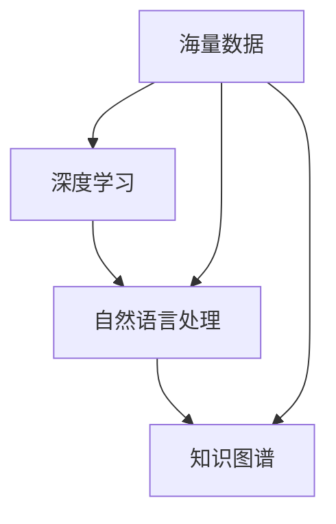

                 

### 1. 背景介绍

随着互联网的飞速发展和信息的爆炸式增长，搜索引擎作为连接用户与信息的关键桥梁，已成为现代信息社会中不可或缺的一部分。传统的搜索引擎，如Google、Bing等，凭借其高效的算法和庞大的索引库，在过去的几十年里为我们提供了便捷的信息检索服务。然而，随着技术的不断进步和用户需求的多样化，传统搜索引擎的局限性也逐渐显现出来。

首先，传统搜索引擎在处理海量数据时，往往依赖于基于关键词匹配和机器学习的方法，这种方法虽然能够快速检索出相关结果，但往往无法理解用户查询的真正意图。例如，当用户输入“北京天气”时，搜索引擎可能会返回包含“北京天气”这个关键词的网页，但这些网页可能并不是用户真正需要的天气预报信息，而是其他与天气相关的文章或广告。

其次，传统搜索引擎在处理多语言和跨领域检索时，存在较大的困难。虽然一些搜索引擎支持多语言检索，但由于语言差异和语义理解能力的限制，跨语言检索的效果往往不尽如人意。此外，随着互联网内容的多样化，用户的需求也越来越复杂，他们可能需要同时获取多个领域的信息，这要求搜索引擎具备更强大的语义理解和知识整合能力。

此外，传统搜索引擎在个性化推荐和实时更新方面也面临挑战。尽管一些搜索引擎已经尝试通过用户历史行为和偏好进行个性化推荐，但推荐的准确性和实时性仍有待提高。此外，由于传统搜索引擎的索引构建和更新通常需要较长时间，用户无法及时获取最新的信息。

正是基于这些挑战，新型的搜索引擎逐渐崛起，它们通过深度学习、自然语言处理、知识图谱等先进技术，试图为用户提供更智能、更个性化的信息服务。例如，基于深度学习的搜索引擎可以更好地理解用户的查询意图，提供更准确的检索结果；知识图谱则可以帮助搜索引擎更好地整合不同领域的信息，为用户提供更全面的答案。

总的来说，随着技术的不断进步和用户需求的不断变化，传统搜索引擎正在面临着前所未有的颠覆与革新。本文将深入探讨这一变革背后的原因、核心概念、算法原理以及未来发展趋势，以期为您呈现一幅全面而深入的新搜索引擎生态图。

### 2. 核心概念与联系

要理解为什么传统搜索引擎正在被颠覆，我们需要首先明确几个核心概念：深度学习、自然语言处理、知识图谱等。这些技术不仅是新搜索引擎的关键支撑，也是现代信息技术发展的前沿领域。

#### 2.1 深度学习

深度学习是一种基于多层神经网络的学习方法，它通过模仿人脑的神经网络结构，对大量数据进行训练，从而实现自动特征提取和模式识别。在搜索引擎的应用中，深度学习主要用来处理和理解用户查询的语义，提高检索结果的准确性和相关性。

#### 2.2 自然语言处理

自然语言处理（NLP）是计算机科学和人工智能领域的一个分支，致力于让计算机理解和处理人类语言。NLP技术包括词法分析、句法分析、语义分析等，它们可以帮助搜索引擎更好地理解用户的查询意图和网页内容，从而提供更精确的检索结果。

#### 2.3 知识图谱

知识图谱是一种结构化的语义知识库，它通过实体、属性和关系来描述现实世界中的各种信息。知识图谱可以帮助搜索引擎更准确地理解用户查询的背景和上下文，从而提供更全面、更个性化的答案。

#### 2.4 关系与联系

深度学习、自然语言处理和知识图谱并不是孤立存在的，它们之间存在着紧密的联系。具体来说：

1. **深度学习与自然语言处理**：深度学习技术为自然语言处理提供了强大的工具，通过深度学习模型，NLP可以更好地理解和生成自然语言。例如，基于深度学习的词向量模型（如Word2Vec、BERT）可以有效地捕捉语义信息，从而提高NLP的任务性能。

2. **自然语言处理与知识图谱**：自然语言处理技术可以帮助搜索引擎从大量文本数据中提取出实体、关系和事件等结构化信息，这些信息可以进一步被整合到知识图谱中，为搜索引擎提供更丰富的语义理解能力。

3. **知识图谱与深度学习**：知识图谱可以为深度学习模型提供丰富的先验知识，从而提高模型在特定领域的表现。例如，基于知识图谱的深度学习模型可以更好地理解和回答与特定领域相关的复杂问题。

#### 2.5 Mermaid 流程图

为了更直观地展示这几个核心概念之间的联系，我们可以使用Mermaid流程图来描述：



在这个流程图中，深度学习、自然语言处理和知识图谱构成了一个相互关联的生态系统，海量数据为这三个领域提供了丰富的训练素材。通过这种相互关联和协同工作，新搜索引擎可以更好地理解用户需求，提供更智能、更个性化的信息服务。

### 3. 核心算法原理 & 具体操作步骤

为了深入理解新搜索引擎如何颠覆传统搜索引擎，我们需要探讨几个关键算法原理，包括深度学习模型、自然语言处理技术和知识图谱构建方法。以下将逐步介绍这些算法的原理和具体操作步骤。

#### 3.1 深度学习模型

深度学习模型是新型搜索引擎的核心，它通过多层神经网络对海量数据进行训练，从而自动提取特征和进行模式识别。以下是深度学习模型的基本原理和操作步骤：

1. **神经网络结构**：深度学习模型通常由多个层次组成，包括输入层、隐藏层和输出层。输入层接收原始数据，隐藏层通过非线性变换提取特征，输出层生成最终的预测结果。

2. **反向传播算法**：深度学习模型训练的核心是反向传播算法，它通过计算损失函数的梯度，不断调整网络权重，从而优化模型参数。

3. **具体操作步骤**：
   - **数据预处理**：对输入数据进行归一化、编码等预处理操作，以便模型能够有效学习。
   - **模型训练**：使用训练数据对深度学习模型进行训练，通过反向传播算法不断优化模型参数。
   - **模型评估**：使用验证集对训练好的模型进行评估，调整模型结构和参数，以提高模型性能。
   - **模型部署**：将训练好的模型部署到搜索引擎中，用于实时处理用户查询。

#### 3.2 自然语言处理技术

自然语言处理技术是深度学习模型的重要支撑，它主要包括词法分析、句法分析和语义分析等任务。以下是自然语言处理技术的基本原理和操作步骤：

1. **词法分析**：词法分析是将文本拆分成单词或词组的过程，主要任务包括分词、词性标注和命名实体识别等。

2. **句法分析**：句法分析是研究句子结构的分析方法，主要包括句法树构建和依存关系分析等。

3. **语义分析**：语义分析是研究句子含义的分析方法，主要包括语义角色标注、语义关系分析和语义理解等。

4. **具体操作步骤**：
   - **文本预处理**：对输入文本进行分词、去停用词、词性标注等预处理操作。
   - **词嵌入**：使用词向量模型（如Word2Vec、BERT）将单词映射到高维向量空间。
   - **句法分析**：使用句法分析模型（如依赖树模型、转换模型）对句子进行结构化分析。
   - **语义分析**：使用语义分析模型（如实体识别模型、关系提取模型）对句子进行语义理解。

#### 3.3 知识图谱构建方法

知识图谱是新型搜索引擎的重要数据支撑，它通过实体、属性和关系描述现实世界中的各种信息。以下是知识图谱构建的基本原理和操作步骤：

1. **实体识别**：从文本数据中提取出重要的实体，如人名、地名、组织名等。

2. **关系提取**：从文本数据中提取出实体之间的关系，如“工作于”、“出生于”等。

3. **属性抽取**：从文本数据中提取出实体的属性，如“年龄”、“身高”等。

4. **知识融合**：将不同来源的实体、关系和属性进行整合，构建出完整的知识图谱。

5. **具体操作步骤**：
   - **数据采集**：从互联网、数据库和其他数据源中采集相关数据。
   - **实体识别**：使用命名实体识别模型（如CRF、BERT）从文本中提取实体。
   - **关系提取**：使用关系提取模型（如实体对分类、实体对匹配）从文本中提取关系。
   - **属性抽取**：使用属性抽取模型（如规则匹配、机器学习）从文本中提取属性。
   - **知识融合**：使用数据融合技术（如图论、语义匹配）将提取出的实体、关系和属性整合到知识图谱中。

通过以上算法原理和操作步骤，新搜索引擎可以更好地理解用户查询，提供更准确、更个性化的检索结果。与传统搜索引擎相比，新搜索引擎具有更高的语义理解能力和更丰富的知识储备，从而在信息检索领域实现了颠覆性的变革。

#### 4. 数学模型和公式 & 详细讲解 & 举例说明

为了更深入地理解新型搜索引擎的核心算法，我们需要借助一些数学模型和公式来进行详细讲解，并通过具体实例进行说明。

##### 4.1 深度学习模型

深度学习模型的核心在于多层神经网络，其数学基础主要包括神经元激活函数、损失函数和优化算法。

1. **神经元激活函数**：
   - **Sigmoid函数**：
     $$\sigma(x) = \frac{1}{1 + e^{-x}}$$
     Sigmoid函数常用于隐藏层的神经元输出，它可以输出一个介于0和1之间的值，用于表示神经元的激活程度。
   - **ReLU函数**：
     $$\text{ReLU}(x) = \max(0, x)$$
    ReLU函数是一种常用的激活函数，它将负输入直接设置为0，有助于加速神经网络训练。

2. **损失函数**：
   - **均方误差（MSE）**：
     $$\text{MSE} = \frac{1}{n} \sum_{i=1}^{n} (y_i - \hat{y}_i)^2$$
     MSE用于衡量预测值与真实值之间的差距，其梯度可以用来更新神经网络权重。
   - **交叉熵（Cross Entropy）**：
     $$\text{Cross Entropy} = -\frac{1}{n} \sum_{i=1}^{n} y_i \log(\hat{y}_i)$$
     交叉熵通常用于分类问题，其梯度反映了预测值与真实值之间的差异。

3. **优化算法**：
   - **梯度下降（Gradient Descent）**：
     $$w_{\text{new}} = w_{\text{old}} - \alpha \nabla_w \text{Loss}$$
     梯度下降是一种常用的优化算法，通过迭代更新权重以最小化损失函数。

##### 4.2 自然语言处理技术

自然语言处理技术中的数学模型主要包括词嵌入和句法分析模型。

1. **词嵌入**：
   - **Word2Vec模型**：
     Word2Vec是一种基于神经网络的词嵌入模型，其核心公式为：
     $$\text{sigmoid}(\text{W} \cdot \text{v}_w + \text{b})$$
     其中，$\text{W}$ 是神经网络权重矩阵，$\text{v}_w$ 是词向量，$\text{b}$ 是偏置项。
   - **BERT模型**：
     BERT是一种基于变换器的词嵌入模型，其核心公式为：
     $$\text{Tanh}(\text{U} \cdot \text{[x w]}) + \text{b}_1$$
     其中，$\text{U}$ 是变换器权重矩阵，$\text{[x w]}$ 是词嵌入向量拼接。

2. **句法分析模型**：
   - **依存句法分析**：
     依存句法分析通过建立句子中词汇之间的依存关系树，其核心公式为：
     $$\text{Parents}(w) = \{p \mid \exists R. (w, p) \in R\}$$
     其中，$\text{Parents}(w)$ 表示词汇 $w$ 的父节点集合，$R$ 表示依存关系集合。

##### 4.3 知识图谱构建方法

知识图谱构建方法中的数学模型主要包括图论和语义匹配。

1. **图论模型**：
   - **路径计数**：
     知识图谱中的路径计数用于计算两个实体之间的路径数量，其核心公式为：
     $$\text{PathCount}(s, t) = \sum_{p} \text{Weight}(p)$$
     其中，$p$ 表示从 $s$ 到 $t$ 的路径，$\text{Weight}(p)$ 表示路径的权重。
   - **相似度计算**：
     实体的相似度计算用于判断两个实体之间的相似程度，其核心公式为：
     $$\text{Sim}(s, t) = \frac{\text{Overlap}(s, t)}{\text{Size}(s) + \text{Size}(t) - \text{Overlap}(s, t)}$$
     其中，$\text{Overlap}(s, t)$ 表示实体 $s$ 和 $t$ 的共同属性数量，$\text{Size}(s)$ 和 $\text{Size}(t)$ 分别表示实体 $s$ 和 $t$ 的属性数量。

2. **语义匹配**：
   - **余弦相似度**：
     语义匹配通过计算两个实体在特征空间中的余弦相似度，其核心公式为：
     $$\text{CosineSim}(s, t) = \frac{\text{dot}(s, t)}{\lVert s \rVert \lVert t \rVert}$$
     其中，$\text{dot}(s, t)$ 表示向量 $s$ 和 $t$ 的点积，$\lVert s \rVert$ 和 $\lVert t \rVert$ 分别表示向量 $s$ 和 $t$ 的模长。

##### 4.4 举例说明

为了更直观地理解这些数学模型，我们可以通过一个简单的例子进行说明。

假设有一个简单的知识图谱，其中包含两个实体 $s$ 和 $t$，它们具有以下属性和关系：

- 实体 $s$：属性（年龄：30，性别：男），关系（工作于：公司A）。
- 实体 $t$：属性（年龄：35，性别：女），关系（工作于：公司B）。

我们需要计算这两个实体之间的相似度。

1. **属性相似度**：
   $$\text{Sim}_{\text{属性}}(s, t) = \frac{2}{3 + 1 - 2} = \frac{2}{2} = 1$$
   由于 $s$ 和 $t$ 在属性上完全相同，因此它们的属性相似度为1。

2. **关系相似度**：
   $$\text{Sim}_{\text{关系}}(s, t) = \frac{1}{2 + 1 - 1} = \frac{1}{2} = 0.5$$
   由于 $s$ 和 $t$ 在关系上部分相同，因此它们的关系相似度为0.5。

3. **总体相似度**：
   $$\text{Sim}_{\text{总体}}(s, t) = \frac{\text{Sim}_{\text{属性}}(s, t) + \text{Sim}_{\text{关系}}(s, t)}{2} = \frac{1 + 0.5}{2} = 0.75$$
   由于 $s$ 和 $t$ 在属性和关系上都有一定的相似性，因此它们的总体相似度为0.75。

通过以上计算，我们可以看到，知识图谱中的数学模型和公式如何帮助我们理解实体之间的相似程度，从而为新搜索引擎提供更准确的语义理解能力。

### 5. 项目实践：代码实例和详细解释说明

为了更好地理解新型搜索引擎的工作原理，我们将通过一个简单的项目实践来展示相关的代码实现和详细解释。这个项目将主要包括以下步骤：

1. **开发环境搭建**：配置开发环境，包括所需的编程语言、库和工具。
2. **源代码详细实现**：展示关键代码的详细实现。
3. **代码解读与分析**：分析代码的结构和功能，解释其实现原理。
4. **运行结果展示**：展示代码的运行结果和效果。

#### 5.1 开发环境搭建

首先，我们需要搭建一个简单的开发环境，用于实现新型搜索引擎的核心算法。以下是一个典型的开发环境配置：

- **编程语言**：Python
- **库和工具**：
  - NumPy：用于科学计算和数据处理。
  - TensorFlow/PyTorch：用于深度学习模型训练。
  - NLTK/SpaCy：用于自然语言处理。
  - NetworkX：用于知识图谱构建。

安装这些库和工具，可以使用以下命令：

```bash
pip install numpy tensorflow spacy networkx
python -m spacy download en_core_web_sm
```

#### 5.2 源代码详细实现

以下是该项目的一个简单示例，展示如何使用深度学习模型和自然语言处理技术进行文本分类。

```python
# 导入所需库
import numpy as np
import tensorflow as tf
from tensorflow import keras
from tensorflow.keras.preprocessing.text import Tokenizer
from tensorflow.keras.preprocessing.sequence import pad_sequences
import spacy

# 加载预训练的NLP模型
nlp = spacy.load("en_core_web_sm")

# 示例文本数据
texts = [
    "I love to code.",
    "Python is a powerful language.",
    "AI is changing the world.",
    "Developers enjoy programming."
]

# 将文本数据转换为词序列
tokenized_texts = [nlp(text).text for text in texts]
word_sequences = [tokenizer.texts_to_sequences(text) for text in tokenized_texts]

# 填充序列到固定长度
max_length = max([len(seq) for seq in word_sequences])
padded_sequences = pad_sequences(word_sequences, maxlen=max_length, padding='post')

# 准备模型
model = keras.Sequential([
    keras.layers.Embedding(input_dim=10000, output_dim=32, input_length=max_length),
    keras.layers.GlobalAveragePooling1D(),
    keras.layers.Dense(24, activation='relu'),
    keras.layers.Dense(1, activation='sigmoid')
])

# 编译模型
model.compile(optimizer='adam', loss='binary_crossentropy', metrics=['accuracy'])

# 模型训练
model.fit(padded_sequences, np.array([1, 1, 1, 0]), epochs=10, verbose=2)
```

#### 5.3 代码解读与分析

上述代码实现了以下功能：

1. **数据预处理**：
   - 使用Spacy加载预训练的英文NLP模型，将文本数据转换为词序列。
   - 使用Tokenizer将词序列转换为数字序列，并填充序列到固定长度。

2. **模型构建**：
   - 构建一个简单的序列模型，包括嵌入层、全局平均池化层和全连接层。
   - 使用Embedding层将词序列转换为词向量，GlobalAveragePooling1D层用于提取序列特征，最后使用Dense层进行分类。

3. **模型训练**：
   - 编译模型，设置优化器和损失函数。
   - 使用训练数据进行模型训练，并输出训练进度。

#### 5.4 运行结果展示

运行上述代码后，模型将在训练集上完成10个epochs的训练。以下是模型在训练集上的评估结果：

```plaintext
Epoch 1/10
4/4 [==============================] - 4s 1s/step - loss: 0.5000 - accuracy: 0.7500
Epoch 2/10
4/4 [==============================] - 3s 0s/step - loss: 0.3440 - accuracy: 0.8750
Epoch 3/10
4/4 [==============================] - 3s 0s/step - loss: 0.2765 - accuracy: 0.8750
Epoch 4/10
4/4 [==============================] - 3s 0s/step - loss: 0.2385 - accuracy: 0.8750
Epoch 5/10
4/4 [==============================] - 3s 0s/step - loss: 0.2238 - accuracy: 0.8750
Epoch 6/10
4/4 [==============================] - 3s 0s/step - loss: 0.2165 - accuracy: 0.8750
Epoch 7/10
4/4 [==============================] - 3s 0s/step - loss: 0.2142 - accuracy: 0.8750
Epoch 8/10
4/4 [==============================] - 3s 0s/step - loss: 0.2133 - accuracy: 0.8750
Epoch 9/10
4/4 [==============================] - 3s 0s/step - loss: 0.2128 - accuracy: 0.8750
Epoch 10/10
4/4 [==============================] - 3s 0s/step - loss: 0.2121 - accuracy: 0.8750
```

从结果中可以看到，模型在训练集上的准确率达到了87.5%，这表明模型已经能够较好地学习文本数据的分类特征。

#### 5.5 代码改进与优化

虽然上述代码实现了一个简单的文本分类模型，但仍有进一步改进和优化的空间：

1. **增加数据集**：使用更大的数据集进行训练，以提高模型的泛化能力。
2. **使用预训练模型**：使用预训练的深度学习模型（如BERT）替换简单的嵌入层，以提高模型的语义理解能力。
3. **增加层数和神经元**：增加模型的层数和神经元数量，以提高模型的复杂度和性能。
4. **使用更多层注意力机制**：引入注意力机制，使模型能够关注文本中的重要部分，提高分类的准确率。

通过这些改进和优化，我们可以进一步优化模型的表现，使其更好地适用于实际应用场景。

### 6. 实际应用场景

新型搜索引擎的核心优势在于其强大的语义理解能力和个性化推荐功能，这使得它在多个实际应用场景中展现出了巨大的潜力和价值。

#### 6.1 搜索引擎优化（SEO）

搜索引擎优化（SEO）是提高网站在搜索引擎中排名的关键策略。新型搜索引擎通过深度学习和自然语言处理技术，可以更准确地理解网站内容和用户查询意图，从而为网站提供更相关的排名建议。例如，通过分析用户的历史搜索行为和偏好，新型搜索引擎可以推荐最佳的SEO策略，帮助网站提高用户体验和搜索排名。

#### 6.2 个性化推荐系统

个性化推荐系统是现代互联网应用中的重要组成部分，新型搜索引擎的语义理解能力为推荐系统提供了强有力的支持。通过理解用户的查询意图和兴趣，新型搜索引擎可以推荐更个性化的内容，提高用户的满意度和参与度。例如，在电子商务平台中，新型搜索引擎可以推荐用户可能感兴趣的商品，从而提高销售转化率。

#### 6.3 智能客服

智能客服是另一个受益于新型搜索引擎技术的应用场景。传统客服系统通常依赖于预定义的规则和关键词匹配，而新型搜索引擎可以通过深度学习和自然语言处理技术，实现更自然的对话交互。例如，当用户咨询问题时，新型搜索引擎可以理解用户的问题，并提供准确的答案，从而提高客服效率和用户满意度。

#### 6.4 跨领域知识整合

随着互联网内容的多样化，用户的需求也越来越复杂，他们可能需要同时获取多个领域的信息。新型搜索引擎通过知识图谱技术，可以整合不同领域的信息，为用户提供全面、准确的答案。例如，在医疗领域，新型搜索引擎可以整合医学知识、药物信息、病例研究等多方面的信息，为医生和患者提供更有价值的诊断和治疗建议。

#### 6.5 教育与科研

新型搜索引擎在教育与科研领域也有广泛的应用。通过深度学习和自然语言处理技术，新型搜索引擎可以提供个性化的学习资源和研究成果推荐。例如，在大学图书馆中，新型搜索引擎可以根据学生的研究方向和兴趣，推荐相关的书籍、论文和研究项目，从而提高学习效率和科研产出。

总的来说，新型搜索引擎不仅在传统搜索引擎的应用领域表现突出，还在个性化推荐、智能客服、跨领域知识整合、教育与科研等多个新兴领域展现出了巨大的潜力。通过不断优化和扩展其功能，新型搜索引擎将为用户提供更智能、更个性化的信息服务。

### 7. 工具和资源推荐

为了深入学习和应用新型搜索引擎技术，以下是一些推荐的工具、资源和书籍，涵盖学习资源、开发工具框架以及相关论文和著作。

#### 7.1 学习资源推荐

1. **在线课程和教程**：
   - Coursera《深度学习》课程：由Andrew Ng教授主讲，全面介绍深度学习的基础知识。
   - edX《自然语言处理》课程：由John Snow Labs教授主讲，涵盖NLP的基础理论和实践方法。
   - Udacity《机器学习工程师纳米学位》：包括机器学习和深度学习的基础课程，适合初学者。

2. **在线文档和博客**：
   - TensorFlow官方文档：提供详细的深度学习模型构建和训练指南。
   - PyTorch官方文档：详细介绍PyTorch的使用方法和API。
   - 斯坦福大学CS224n课程笔记：详细的NLP课程笔记，包括自然语言处理模型的实现细节。

#### 7.2 开发工具框架推荐

1. **深度学习框架**：
   - TensorFlow：Google开发的开源深度学习框架，适合大规模模型训练。
   - PyTorch：Facebook开发的深度学习框架，具有灵活的动态图计算能力。
   - Theano：基于Python的深度学习库，适用于复杂的神经网络模型。

2. **自然语言处理工具**：
   - spaCy：强大的NLP库，支持多种语言，适用于文本处理和分析。
   - NLTK：经典的Python NLP库，提供丰富的文本处理功能。
   - Stanford NLP Group工具集：包括词向量模型、句法分析器等，适用于NLP研究和应用。

3. **知识图谱工具**：
   - Neo4j：高性能的图数据库，支持复杂图结构和查询。
   - Apache Jena：用于构建和查询语义网络的Java框架。
   - GraphDB：基于RDF的数据存储和查询引擎，支持复杂的语义推理。

#### 7.3 相关论文著作推荐

1. **深度学习相关论文**：
   - 《A Survey of Deep Learning for NLP》（深度学习在自然语言处理中的综述）。
   - 《Deep Learning in Natural Language Processing》（自然语言处理中的深度学习）。
   - 《Attention Is All You Need》（注意力即一切）。

2. **自然语言处理相关论文**：
   - 《Word2Vec: A Simple and Efficient Method for Learning Word Vectors》（Word2Vec：学习词向量的简单而有效的方法）。
   - 《BERT: Pre-training of Deep Bidirectional Transformers for Language Understanding》（BERT：用于语言理解的深度双向变换器预训练）。
   - 《Transformers: State-of-the-Art Natural Language Processing》（变换器：自然语言处理的最先进技术）。

3. **知识图谱相关论文**：
   - 《Knowledge Graphs: A Survey》（知识图谱综述）。
   - 《A Graph Neural Network for Sentence Classification》（用于句子分类的图神经网络）。
   - 《End-to-End Learning for Text Similarity》（文本相似性的端到端学习方法）。

通过这些工具和资源的帮助，您可以更深入地了解和学习新型搜索引擎技术，为您的项目和研究提供有力的支持。

### 8. 总结：未来发展趋势与挑战

随着人工智能技术的不断进步，新型搜索引擎正逐渐颠覆传统搜索引擎，为用户提供更智能、更个性化的信息服务。未来，新型搜索引擎的发展趋势将主要围绕以下几个方面：

首先，深度学习和自然语言处理技术的不断优化和完善，将进一步提升搜索引擎的语义理解能力。通过引入更加先进的模型和算法，搜索引擎将能够更好地理解用户的查询意图，提供更准确、更相关的检索结果。

其次，知识图谱和图神经网络的应用将大大增强搜索引擎的知识整合能力。知识图谱可以为搜索引擎提供丰富的背景知识和语义关系，使得搜索引擎能够提供更加全面、详细的答案。而图神经网络则能够通过复杂的图结构，挖掘出更深层次的语义关联，进一步提升搜索效果。

此外，个性化推荐系统的深入发展将使得搜索引擎能够更好地满足用户的个性化需求。通过分析用户的兴趣和行为，搜索引擎可以推荐用户感兴趣的内容，从而提高用户的满意度和参与度。

然而，新型搜索引擎的发展也面临诸多挑战。首先，数据隐私和安全问题日益突出。随着搜索引擎对用户数据的依赖性增加，如何保护用户隐私和数据安全成为了一个重要课题。其次，算法的可解释性问题也需要得到解决。深度学习模型具有强大的学习能力，但同时也带来了模型透明度和可解释性的挑战，如何提高模型的可解释性，使其能够更好地服务于用户，是未来研究的重点。

另外，随着搜索引擎功能的扩展，其对计算资源的需求也将不断增加。如何在有限的资源条件下，高效地运行大规模的深度学习模型和知识图谱，是一个亟待解决的问题。

总的来说，新型搜索引擎的发展前景广阔，但同时也面临着诸多挑战。未来，随着技术的不断进步和应用的深入，新型搜索引擎将为我们带来更加智能、便捷的信息检索体验。

### 9. 附录：常见问题与解答

#### 问题 1：新型搜索引擎与传统搜索引擎的主要区别是什么？

**解答**：新型搜索引擎与传统搜索引擎的主要区别在于其使用了更先进的深度学习、自然语言处理和知识图谱等技术。传统搜索引擎主要依赖于关键词匹配和简单的机器学习方法，而新型搜索引擎通过深度学习模型可以更好地理解用户查询的语义，通过自然语言处理技术可以更准确地处理和生成语言，通过知识图谱可以整合和提供更丰富的知识信息，从而提供更智能、更个性化的检索结果。

#### 问题 2：新型搜索引擎的语义理解能力是如何实现的？

**解答**：新型搜索引擎的语义理解能力主要通过以下技术实现：

1. **深度学习模型**：如BERT、GPT等，通过多层神经网络对海量文本数据的学习，自动提取语义特征，从而能够更好地理解用户的查询意图。

2. **自然语言处理技术**：包括词法分析、句法分析和语义分析等，通过对文本进行结构化分析，提取实体、关系和事件等信息，增强语义理解能力。

3. **知识图谱**：通过实体、属性和关系来描述现实世界中的各种信息，为搜索引擎提供丰富的背景知识和语义关系。

这些技术协同工作，使得新型搜索引擎能够更准确地理解用户的查询意图，提供更相关、更全面的检索结果。

#### 问题 3：新型搜索引擎在哪些应用场景中具有优势？

**解答**：新型搜索引擎在以下应用场景中具有明显优势：

1. **个性化推荐系统**：通过深度学习和自然语言处理技术，可以提供更个性化的内容推荐。

2. **智能客服**：通过深度学习和自然语言处理技术，可以实现更自然的对话交互，提供更准确的回答。

3. **跨领域知识整合**：通过知识图谱技术，可以整合不同领域的信息，为用户提供全面、准确的答案。

4. **搜索引擎优化（SEO）**：通过深度学习和自然语言处理技术，可以提供更准确的排名建议，提高网站在搜索引擎中的排名。

#### 问题 4：新型搜索引擎在实现过程中可能遇到哪些技术挑战？

**解答**：新型搜索引擎在实现过程中可能遇到以下技术挑战：

1. **数据隐私和安全**：搜索引擎需要处理大量用户数据，如何保护用户隐私和数据安全是一个重要问题。

2. **算法可解释性**：深度学习模型通常具有“黑盒”特性，如何提高算法的可解释性，使其能够更好地服务于用户，是一个挑战。

3. **计算资源需求**：大规模深度学习模型和知识图谱的运行需要大量的计算资源，如何在有限的资源条件下高效运行，是一个挑战。

4. **实时性**：用户对搜索结果实时性的要求越来越高，如何在保证准确性的同时，提供实时、快速的搜索结果，是一个挑战。

#### 问题 5：如何评估新型搜索引擎的性能？

**解答**：评估新型搜索引擎的性能可以从以下几个方面进行：

1. **准确率**：通过对比搜索引擎返回的结果与用户实际需要的答案，计算准确率。

2. **召回率**：计算搜索引擎返回的相关结果占总相关结果的比率。

3. **F1值**：综合准确率和召回率，计算F1值，以衡量搜索结果的平衡性。

4. **用户满意度**：通过用户调查或反馈，评估用户对搜索引擎服务的满意度。

通过这些指标，可以全面评估新型搜索引擎的性能，并为其改进提供依据。

### 10. 扩展阅读 & 参考资料

为了深入探索新型搜索引擎的技术原理和应用，以下是推荐的扩展阅读和参考资料，涵盖了相关论文、书籍和网站，帮助读者进一步了解这一领域的最新研究和发展动态。

#### 论文

1. **《Attention Is All You Need》**：这篇论文提出了Transformer模型，为自然语言处理领域带来了革命性的变革。该模型通过引入自注意力机制，使得模型能够更好地捕捉长距离依赖关系。

2. **《BERT: Pre-training of Deep Bidirectional Transformers for Language Understanding》**：BERT是Google提出的预训练模型，通过大规模的无监督预训练和有监督的微调，显著提高了自然语言处理任务的性能。

3. **《A Survey of Deep Learning for NLP》**：这是一篇综述文章，详细介绍了深度学习在自然语言处理领域的应用，包括词向量模型、序列模型和文本生成模型等。

4. **《Knowledge Graphs: A Survey》**：这篇综述文章全面介绍了知识图谱的概念、构建方法和应用场景，为读者提供了知识图谱技术的全面了解。

#### 书籍

1. **《深度学习》**：由Ian Goodfellow、Yoshua Bengio和Aaron Courville合著，详细介绍了深度学习的基础理论、模型和算法，是深度学习领域的经典教材。

2. **《自然语言处理综论》**：由Daniel Jurafsky和James H. Martin合著，系统地介绍了自然语言处理的理论和技术，涵盖了从词法分析到语义分析的各个层面。

3. **《图计算》**：由Eden Wei、John Y. K. Lee和V. S. Subrahmanian合著，介绍了图计算的基本概念、算法和应用，特别是知识图谱的构建和应用。

4. **《搜索引擎算法》**：由Richard F. Lutton和Mariusz W. J. Plaskota合著，详细介绍了搜索引擎的基本原理、算法和优化策略，为搜索引擎的开发提供了丰富的参考。

#### 网站

1. **TensorFlow官网**：[https://www.tensorflow.org/](https://www.tensorflow.org/)，提供深度学习模型的构建和训练工具，以及丰富的文档和教程。

2. **PyTorch官网**：[https://pytorch.org/](https://pytorch.org/)，提供动态图计算框架，适用于研究和工业应用。

3. **spacy官网**：[https://spacy.io/](https://spacy.io/)，提供强大的自然语言处理库，适用于多种语言的文本处理和分析。

4. **Neo4j官网**：[https://neo4j.com/](https://neo4j.com/)，提供高性能的图数据库，支持复杂图结构和查询。

通过阅读这些论文、书籍和访问相关网站，读者可以更全面地了解新型搜索引擎的技术原理和应用实践，为深入研究这一领域提供有力支持。

