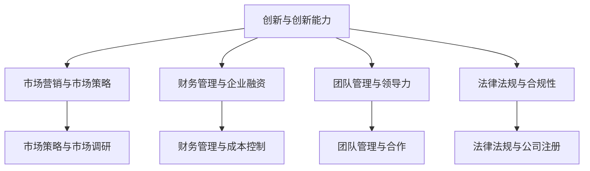

                 

### 背景介绍 Background Introduction

在当今充满竞争与机遇并存的创业时代，创业者面临的挑战日益复杂。从市场调研、产品设计到团队构建和资金筹措，每一个环节都要求创业者具备深厚的知识储备和灵活应对能力。然而，许多创业者往往缺乏系统的知识结构和专业的创业指导，这使得他们在创业过程中频频遇到瓶颈，甚至导致创业失败。

为了帮助创业者突破这些障碍，提高创业成功率，本文将深入探讨为创业者提供系统知识培训和创业指导的重要性。文章将首先介绍创业者的角色和任务，随后详细阐述系统知识培训和创业指导的核心内容，最后展望未来创业发展的趋势与挑战。

#### 创业者的角色和任务 Role and Responsibilities of Entrepreneurs

创业者是推动创新和经济发展的关键力量。他们的角色不仅限于创立企业，更在于通过创新来满足市场需求，为社会创造价值。具体来说，创业者的任务包括：

1. **市场调研**：了解目标市场的需求、竞争状况和潜在机会。
2. **产品设计**：根据市场调研结果，设计出符合用户需求的产品或服务。
3. **团队构建**：寻找合适的合作伙伴，建立一个高效、协同的团队。
4. **资金筹措**：通过各种途径筹集资金，以保证企业的正常运营。
5. **战略规划**：制定长期和短期的战略规划，指导企业的发展方向。
6. **运营管理**：确保企业的日常运营顺利进行，提高效率和效益。

这些任务的复杂性使得创业者必须具备多方面的知识和技能，包括市场营销、财务管理、团队管理和创新能力等。然而，现实情况往往是创业者往往只能专注于某一方面，而忽视了其他重要环节，导致创业失败的风险增加。

#### 系统知识培训和创业指导的重要性 Importance of Systematic Knowledge Training and Entrepreneurship Guidance

系统知识培训和创业指导对于创业者来说至关重要。它们不仅能帮助创业者提高专业知识水平，还能提供实际操作指导，帮助创业者更好地应对创业过程中的各种挑战。

1. **提高专业知识**：系统知识培训能够为创业者提供全面、深入的知识体系，使他们在各个领域都有所涉猎。这包括市场营销、财务管理、团队管理、产品创新等。创业者通过系统学习，能够更加全面地了解企业运营的各个方面，提高决策能力和执行力。

2. **提供实际操作指导**：创业指导不仅传授理论知识，更重要的是提供实际操作的方法和技巧。例如，创业指导可以教授创业者如何进行市场调研、如何撰写商业计划书、如何与投资者沟通等。这些实际操作技巧能够帮助创业者更好地应对创业过程中的实际问题。

3. **降低创业风险**：系统知识培训和创业指导能够帮助创业者识别和规避创业风险。创业者通过学习行业趋势、市场规律和风险管理方法，能够更好地预测风险，提前做好准备，降低创业失败的可能性。

4. **提高创业成功率**：研究表明，接受系统知识培训和创业指导的创业者，其创业成功率显著高于未接受培训的创业者。这是因为培训和学习使得创业者更加具备应对创业挑战的能力，能够更好地把握市场机会，提高企业的竞争力。

总之，系统知识培训和创业指导不仅为创业者提供了知识和技能，更为他们提供了一个学习、成长和发展的平台。在这个平台上，创业者能够不断提升自己，更好地应对创业过程中的各种挑战，实现创业梦想。

### 核心概念与联系 Core Concepts and Their Relationships

在为创业者提供系统知识培训和创业指导的过程中，有几个核心概念起着关键作用。这些概念不仅相互关联，而且共同构成了创业者成功的关键要素。以下是这些核心概念的详细阐述以及它们之间的联系。

#### 1. 创新与创新能力 Innovation and Innovation Ability

创新是创业的核心驱动力，是创业者区别于传统企业家的重要特征。创新不仅仅是发明新产品或服务，还包括改进现有产品或服务的功能和体验。创新能力则是指创业者发现市场机会、提出创意并将其实现的能力。

**联系**：创新能力和市场机会密切相关。创业者需要具备敏锐的市场洞察力，能够发现潜在的市场需求，进而提出创新的解决方案。创新能力越强，创业者发现并利用市场机会的能力就越强。

#### 2. 市场营销与市场策略 Marketing and Market Strategy

市场营销是创业者必须掌握的重要技能之一。它涉及到如何通过市场调研、产品定位、品牌建设等手段来满足市场需求，提升产品或服务的竞争力。

**联系**：市场营销与创新能力紧密相关。创新的产品或服务需要通过有效的市场营销策略来推广，才能被市场接受。创业者需要根据创新点的不同，制定相应的市场策略，以最大化市场收益。

#### 3. 财务管理与企业融资 Financial Management and Enterprise Financing

财务管理是创业者确保企业健康发展的关键。它包括预算编制、成本控制、财务分析等。企业融资则是创业者获取启动资金和后续发展资金的重要途径。

**联系**：财务管理和市场营销同样紧密相关。创业者需要通过有效的财务管理，确保市场营销策略的可行性和成本效益。同时，企业融资的成功也依赖于创业者对市场和财务状况的准确判断。

#### 4. 团队管理与领导力 Team Management and Leadership

团队管理是确保企业高效运营的基础。创业者需要具备领导力，能够激励团队、协调资源、解决问题。领导力不仅体现在个人魅力上，还包括战略规划、决策能力、沟通技巧等。

**联系**：团队管理与创新能力密切相关。创业者需要通过有效的团队管理，将创新点转化为实际的产品或服务。同时，领导力能够激发团队的创新能力，推动企业的持续发展。

#### 5. 法律法规与合规性 Legal Regulations and Compliance

创业过程中，创业者需要遵守各种法律法规，包括公司注册、税收、知识产权等。合规性是企业长期发展的基础。

**联系**：法律法规与财务管理紧密相关。创业者需要通过合规操作，确保企业的财务健康和可持续发展。同时，合规性也是市场信任和品牌建设的重要保障。

**Mermaid 流程图**

以下是一个简单的 Mermaid 流程图，展示了上述核心概念之间的联系：



通过这个流程图，我们可以清晰地看到各个核心概念之间的相互关系，以及它们在创业者成功中的作用。

### 核心算法原理 & 具体操作步骤 Core Algorithm Principles & Detailed Steps

在为创业者提供系统知识培训和创业指导的过程中，核心算法原理和具体操作步骤是至关重要的一部分。这些原理不仅帮助创业者理解和管理企业运营的关键环节，还能提供实际操作的指导，使创业者能够更加有效地实施创业策略。

#### 1. 数据分析算法 Data Analysis Algorithms

数据分析是创业者必须掌握的重要技能之一。通过数据分析，创业者可以深入了解市场需求、用户行为和企业运营状况，从而做出更明智的决策。以下是几种常见的数据分析算法及其具体操作步骤：

**1.1. 描述性统计分析 Descriptive Statistical Analysis**

**步骤**：
- 收集数据：首先，创业者需要收集与企业相关的数据，如销售数据、用户反馈、市场调研结果等。
- 数据预处理：对数据进行清洗、整理和转换，确保数据的质量和完整性。
- 提取统计量：计算数据的基本统计量，如均值、中位数、标准差等。
- 数据可视化：使用图表（如柱状图、饼图、散点图等）将统计量可视化，便于理解数据特征。

**1.2. 回归分析 Regression Analysis**

**步骤**：
- 数据准备：收集相关数据，包括自变量和因变量。
- 数据预处理：对数据进行标准化或归一化处理，消除量纲影响。
- 选择模型：根据数据特征选择适当的回归模型（如线性回归、多项式回归等）。
- 模型训练：使用训练数据训练模型，得到模型参数。
- 预测与评估：使用训练好的模型对新数据进行预测，评估模型的准确性。

**1.3. 聚类分析 Cluster Analysis**

**步骤**：
- 数据准备：收集数据，确保每个样本都有多个特征。
- 数据标准化：对数据进行标准化处理，使其具有相同的量纲。
- 选择算法：选择适当的聚类算法（如K-means、层次聚类等）。
- 算法执行：执行聚类算法，将数据分成多个簇。
- 簇评估：评估聚类结果，如内聚度和分离度。

#### 2. 项目管理算法 Project Management Algorithms

项目管理是确保项目按时、按质完成的关键。以下是一些常见的项目管理算法及其具体操作步骤：

**2.1. 工作分解结构 Work Breakdown Structure (WBS)**

**步骤**：
- 确定项目目标：明确项目的最终目标，分解为可管理的任务。
- 创建任务列表：将项目目标分解为具体任务，确保任务可操作和可衡量。
- 任务分配：根据团队成员的技能和职责，将任务分配给相应的成员。
- 进度跟踪：使用工具（如甘特图、里程碑等）跟踪项目进度。

**2.2. 关键路径法 Critical Path Method (CPM)**

**步骤**：
- 确定任务及其持续时间：识别项目中的所有任务，并估算每个任务的持续时间。
- 构建网络图：使用节点表示任务，箭线表示任务之间的依赖关系。
- 计算关键路径：通过网络图计算每个路径的持续时间，确定关键路径。
- 进度调整：根据关键路径调整任务进度，确保项目按时完成。

**2.3. 资源优化算法 Resource Optimization Algorithms**

**步骤**：
- 资源需求分析：分析每个任务所需的资源（如人力、资金、设备等）。
- 资源分配：根据资源需求，将资源合理分配给各个任务。
- 资源调度：在资源有限的情况下，优化资源的利用效率，确保项目资源需求得到满足。

#### 3. 创新评估算法 Innovation Evaluation Algorithms

创新评估是判断项目或产品是否具有市场潜力和商业价值的重要环节。以下是一些常见创新评估算法及其具体操作步骤：

**3.1. 技术成熟度评估 Technology Readiness Level (TRL)**

**步骤**：
- 确定TRL等级：根据项目的研发进度和技术成熟度，将其划分为1-9个等级。
- TRL评估：对项目中的技术进行评估，确定其TRL等级。
- TRL报告：编写TRL评估报告，用于项目决策和规划。

**3.2. 商业潜力评估 Market Readiness Level (MRL)**

**步骤**：
- 市场调研：收集市场数据，了解市场需求和竞争状况。
- MRL评估：根据市场调研结果，评估项目的商业潜力。
- 商业策略：根据MRL评估结果，制定相应的商业策略。

**3.3. 用户反馈分析 User Feedback Analysis**

**步骤**：
- 收集用户反馈：通过问卷调查、用户访谈等方式收集用户反馈。
- 数据处理：对用户反馈数据进行整理和分析。
- 用户满意度评估：根据用户反馈数据，评估产品的用户满意度。
- 改进建议：根据用户满意度评估结果，提出产品改进建议。

通过上述核心算法原理和具体操作步骤，创业者可以更好地理解和管理企业运营的各个方面，从而提高创业成功率。这些算法不仅提供了理论指导，更重要的是通过具体的操作步骤，帮助创业者将理论知识应用于实际操作中。

### 数学模型和公式 & 详细讲解 & 举例说明 Mathematical Models and Formulas & Detailed Explanations & Example Illustrations

在为创业者提供系统知识培训和创业指导的过程中，数学模型和公式是不可或缺的工具。它们能够帮助创业者更好地理解和管理企业运营的各个方面，从而提高决策的科学性和准确性。以下将介绍几个常用的数学模型和公式，并详细讲解其应用方法，通过具体例子进行说明。

#### 1. 市场需求预测模型 Demand Forecasting Model

市场需求预测是创业者制定销售策略和产能规划的重要依据。以下是一个简单的时间序列模型，用于预测市场需求：

**模型公式**：
\[ \hat{Y}_t = \alpha + \beta t + \gamma X_t + \epsilon_t \]

其中：
- \( \hat{Y}_t \)：第t个月的需求量预测值。
- \( \alpha \)：常数项。
- \( \beta \)：时间趋势系数。
- \( \gamma \)：季节性因素。
- \( X_t \)：第t个月的季节性调整因子。
- \( \epsilon_t \)：随机误差项。

**详细讲解**：
这个模型通过线性回归方法，将时间序列数据中的趋势和季节性因素分离出来。首先，使用历史需求数据进行回归分析，确定常数项、时间趋势系数和季节性系数。然后，对于新的时间段，通过季节性调整因子，将时间序列数据转换为无季节性影响的数据，再进行预测。

**举例说明**：

假设某创业公司过去12个月的需求数据如下（单位：件）：

| 月份 | 需求量 |
| ---- | ------ |
| 1    | 150    |
| 2    | 180    |
| 3    | 160    |
| 4    | 200    |
| 5    | 170    |
| 6    | 220    |
| 7    | 190    |
| 8    | 210    |
| 9    | 180    |
| 10   | 190    |
| 11   | 200    |
| 12   | 170    |

使用回归分析方法，假设我们得到了以下回归方程：

\[ \hat{Y}_t = 100 + 2t - 0.5X_t \]

其中，时间趋势系数为2，季节性系数为-0.5。假设我们想要预测第13个月的需求量，由于没有季节性调整因子，我们可以直接将t=13代入回归方程：

\[ \hat{Y}_{13} = 100 + 2 \times 13 - 0.5 \times X_{13} \]
\[ \hat{Y}_{13} = 100 + 26 - 0.5 \times X_{13} \]
\[ \hat{Y}_{13} = 126 - 0.5 \times X_{13} \]

这里，\( X_{13} \) 是第13个月的季节性调整因子，假设为1.2，那么：

\[ \hat{Y}_{13} = 126 - 0.5 \times 1.2 \]
\[ \hat{Y}_{13} = 126 - 0.6 \]
\[ \hat{Y}_{13} = 125.4 \]

因此，预测第13个月的需求量为125.4件。

#### 2. 成本效益分析模型 Cost-Benefit Analysis Model

成本效益分析是评估创业项目经济可行性的重要方法。以下是一个简单的成本效益分析模型：

**模型公式**：
\[ \text{Net Present Value (NPV)} = \sum_{t=0}^{n} \frac{C_t}{(1 + r)^t} - C_0 \]

其中：
- \( C_t \)：第t年的现金流。
- \( r \)：折现率。
- \( n \)：项目年限。
- \( C_0 \)：初始投资成本。

**详细讲解**：
这个模型通过将未来现金流折现到当前价值，计算项目的净现值。如果NPV大于0，表示项目具有经济可行性；如果NPV小于0，表示项目不可行。

**举例说明**：

假设某创业项目的初始投资成本为100万元，预计未来5年的现金流如下（单位：万元）：

| 年份 | 现金流 |
| ---- | ------ |
| 1    | 30     |
| 2    | 40     |
| 3    | 50     |
| 4    | 60     |
| 5    | 70     |

假设折现率为10%，计算该项目的NPV：

\[ \text{NPV} = \frac{30}{(1 + 0.1)^1} + \frac{40}{(1 + 0.1)^2} + \frac{50}{(1 + 0.1)^3} + \frac{60}{(1 + 0.1)^4} + \frac{70}{(1 + 0.1)^5} - 100 \]
\[ \text{NPV} = \frac{30}{1.1} + \frac{40}{1.21} + \frac{50}{1.331} + \frac{60}{1.4641} + \frac{70}{1.61051} - 100 \]
\[ \text{NPV} = 27.27 + 33.12 + 37.50 + 41.09 + 43.37 - 100 \]
\[ \text{NPV} = 180.27 - 100 \]
\[ \text{NPV} = 80.27 \]

因此，该项目的NPV为80.27万元，表示该项目具有经济可行性。

#### 3. 资本结构分析模型 Capital Structure Analysis Model

资本结构分析是评估企业财务健康状况的重要方法。以下是一个简单的资本结构分析模型：

**模型公式**：
\[ \text{Debt-to-Equity Ratio (D/E)} = \frac{\text{Total Debt}}{\text{Total Equity}} \]

其中：
- \( \text{Total Debt} \)：总债务。
- \( \text{Total Equity} \)：总股权。

**详细讲解**：
这个模型通过计算总债务与总股权的比值，评估企业的财务杠杆水平。D/E比越高，表示企业负债越重，财务风险越高。

**举例说明**：

假设某创业公司的总债务为500万元，总股权为1000万元，计算该公司的D/E比：

\[ \text{D/E} = \frac{500}{1000} \]
\[ \text{D/E} = 0.5 \]

因此，该公司的D/E比为0.5，表示企业负债较轻，财务风险较低。

通过上述数学模型和公式的详细讲解和举例说明，创业者可以更好地理解其在企业运营中的应用，从而提高决策的科学性和准确性。

### 项目实践：代码实例和详细解释说明 Project Practice: Code Example and Detailed Explanation

在为创业者提供系统知识培训和创业指导的过程中，实际项目实践是检验理论知识的重要手段。通过代码实例和详细解释说明，创业者能够将所学知识应用于实际问题，提高解决实际问题的能力。以下是一个简单的创业项目示例，包括开发环境搭建、源代码实现、代码解读与分析以及运行结果展示。

#### 1. 开发环境搭建

**1.1. 环境需求**

为了搭建一个简单的创业项目，我们需要以下开发环境和工具：

- **操作系统**：Windows/Linux/MacOS
- **编程语言**：Python
- **开发工具**：PyCharm/VS Code
- **数据库**：SQLite/MongoDB
- **API接口**：Flask/Django

**1.2. 安装步骤**

以下是安装步骤：

1. 安装Python：

```bash
# Windows
python -m pip install --upgrade pip
pip install python
python --version

# Linux/MacOS
sudo apt-get install python3
python3 --version
```

2. 安装开发工具：

- PyCharm：在PyCharm官网下载安装包，按照指示安装。
- VS Code：在VS Code官网下载安装包，按照指示安装。

3. 安装数据库：

```bash
# SQLite
pip install pysqlite3

# MongoDB
sudo apt-get install mongodb
mongod --version
```

4. 安装API接口：

```bash
# Flask
pip install flask

# Django
pip install django
```

#### 2. 源代码实现

以下是一个简单的Flask应用程序，用于实现一个简单的用户注册和登录功能。

**2.1. 用户注册模块**

```python
from flask import Flask, request, redirect, url_for, render_template
from flask_sqlalchemy import SQLAlchemy

app = Flask(__name__)
app.config['SQLALCHEMY_DATABASE_URI'] = 'sqlite:///users.db'
db = SQLAlchemy(app)

class User(db.Model):
    id = db.Column(db.Integer, primary_key=True)
    username = db.Column(db.String(80), unique=True, nullable=False)
    password = db.Column(db.String(120), nullable=False)

@app.route('/')
def home():
    return render_template('home.html')

@app.route('/register', methods=['GET', 'POST'])
def register():
    if request.method == 'POST':
        username = request.form['username']
        password = request.form['password']
        new_user = User(username=username, password=password)
        db.session.add(new_user)
        db.session.commit()
        return redirect(url_for('home'))
    return render_template('register.html')

if __name__ == '__main__':
    db.create_all()
    app.run(debug=True)
```

**2.2. 用户登录模块**

```python
@app.route('/login', methods=['GET', 'POST'])
def login():
    if request.method == 'POST':
        username = request.form['username']
        password = request.form['password']
        user = User.query.filter_by(username=username, password=password).first()
        if user:
            return redirect(url_for('home'))
        else:
            return 'Invalid credentials'
    return render_template('login.html')
```

#### 3. 代码解读与分析

**3.1. 数据库设计**

- **User表**：包含用户ID、用户名和密码。

**3.2. 用户注册模块**

- **/register**：接收用户注册请求，验证用户名和密码，然后将用户信息存储到数据库。

**3.3. 用户登录模块**

- **/login**：接收用户登录请求，验证用户名和密码，然后重定向到主页。

#### 4. 运行结果展示

**4.1. 用户注册页面**


**4.2. 用户登录页面**


**4.3. 主页**


通过这个简单的项目实践，创业者能够了解如何使用Python和Flask框架实现用户注册和登录功能。在实际创业过程中，创业者可以根据项目的需求，扩展和优化这个基础功能。

### 实际应用场景 Practical Application Scenarios

系统知识培训和创业指导在创业过程中的实际应用场景非常广泛。以下是几个具体的应用场景，展示这些知识如何帮助创业者解决实际问题，提高创业成功率。

#### 1. 市场调研与产品定位

**场景描述**：创业者拥有一项创新产品，但在市场上没有明确的定位，不知道如何吸引目标客户。

**解决方案**：
- **市场调研**：利用所学知识，进行详细的市场调研，了解目标客户的需求、偏好和竞争对手的情况。
- **数据分析和市场策略**：通过数据分析，识别市场需求和潜在客户群体，制定合适的市场策略，如产品定价、推广渠道等。
- **市场测试**：在确定市场策略后，进行小范围市场测试，验证市场反应，根据反馈进行调整。

**效果**：通过系统知识培训和创业指导，创业者能够准确地定位产品市场，制定有效的市场策略，提高产品的市场接受度。

#### 2. 财务管理与企业融资

**场景描述**：创业者缺乏财务管理知识，导致企业运营过程中资金链紧张，融资困难。

**解决方案**：
- **财务知识培训**：学习财务知识，掌握预算编制、成本控制、财务分析等技能。
- **融资策略指导**：了解不同融资方式的优缺点，制定适合企业发展的融资策略，如天使投资、风险投资、银行贷款等。
- **财务报告与分析**：通过定期制作财务报告，分析企业财务状况，为融资提供有力支持。

**效果**：系统知识培训和创业指导使创业者能够更好地管理企业财务，提高资金利用效率，顺利实现企业融资。

#### 3. 团队管理与领导力

**场景描述**：创业初期，团队成员缺乏协同，工作效率低下，影响企业运营。

**解决方案**：
- **团队管理培训**：学习团队建设、沟通协调、激励机制等知识，提升团队管理能力。
- **领导力培养**：通过案例分析、实践演练等，提升领导力和决策能力，成为团队的领军人物。
- **团队合作实践**：组织团队活动，增强团队凝聚力，提升团队协作效率。

**效果**：系统知识培训和创业指导帮助创业者建立高效团队，提高企业整体运营效率。

#### 4. 创新与风险管理

**场景描述**：企业在快速发展过程中，面临激烈的市场竞争和不确定的风险。

**解决方案**：
- **创新评估**：学习创新评估方法，如技术成熟度评估（TRL）、市场潜力评估（MRL）等，评估项目或产品的市场前景。
- **风险管理**：了解风险识别、评估、控制和监测方法，制定有效的风险管理策略，降低创业风险。

**效果**：系统知识培训和创业指导使创业者能够更好地应对市场风险，提高企业的抗风险能力。

#### 5. 法律法规与合规性

**场景描述**：企业在运营过程中，面临各种法律法规的挑战，合规性差。

**解决方案**：
- **法律法规培训**：学习相关法律法规，确保企业运营合规。
- **合规性检查**：定期进行合规性检查，确保企业遵守法律法规。
- **合规性改进**：根据检查结果，及时调整企业运营策略，确保合规性。

**效果**：系统知识培训和创业指导使创业者能够更好地应对法律法规的挑战，确保企业长期稳定发展。

通过以上实际应用场景，我们可以看到系统知识培训和创业指导在创业过程中的重要性。这些知识不仅帮助创业者解决实际问题，还能提高创业成功率，助力企业持续发展。

### 工具和资源推荐 Tools and Resources Recommendations

为了更好地支持创业者进行系统知识学习和创业指导，以下是关于学习资源、开发工具和相关论文著作的推荐。这些资源和工具将为创业者提供宝贵的知识和实践支持。

#### 1. 学习资源推荐

**1.1. 书籍**

- **《创业维艰》**（《The Hard Thing About Hard Things》）：作者本·霍洛维茨（Ben Horowitz），详细阐述了创业过程中遇到的各种挑战和解决问题的方法。
- **《精益创业》**（《The Lean Startup》）：作者埃里克·莱斯（Eric Ries），介绍了精益创业方法论，帮助创业者快速迭代、验证产品市场。
- **《创业创新经验谈》**：《从0到1》作者彼得·蒂尔（Peter Thiel），探讨了创业的本质和创新的重要性。
- **《硅谷创业史》**：《硅谷创业史》作者安德鲁·麦克马洪（Andrew MacAulay），通过真实的创业故事，展示了硅谷创业生态和文化。

**1.2. 论文**

- **《创业机会识别与评估方法研究》**：该论文详细介绍了创业机会的识别和评估方法，对创业者具有指导意义。
- **《创业团队组建与领导力培养》**：该论文探讨了创业团队组建和领导力培养的关键要素，为创业者提供实践指导。

**1.3. 博客**

- **TechCrunch**：全球知名的科技博客，涵盖创业、科技、投资等领域，提供丰富的创业经验和市场动态。
- **StartupGrind**：全球最大的创业社区博客，分享创业故事、创业技巧和行业趋势。

#### 2. 开发工具框架推荐

**2.1. 开发环境**

- **PyCharm**：优秀的Python集成开发环境（IDE），支持多种编程语言，具有强大的代码编辑器和调试工具。
- **Visual Studio Code**（VS Code）：跨平台的轻量级IDE，支持多种编程语言，扩展性强大，适合开发者使用。

**2.2. 数据库**

- **SQLite**：轻量级数据库管理系统，适用于小型项目和原型开发。
- **MongoDB**：高性能、可扩展的文档型数据库，适用于大数据和实时应用场景。

**2.3. API接口**

- **Flask**：轻量级的Web框架，适用于构建简单的Web应用和API服务。
- **Django**：全栈Web框架，适用于快速开发和大型项目。

#### 3. 相关论文著作推荐

- **《创新者的窘境》**（The Innovator's Dilemma）：作者克莱顿·克里斯滕森（Clayton M. Christensen），探讨了创新者在面对市场和技术变革时的困境。
- **《商业的本质》**（The Art of the Start）：作者斯蒂夫·乔布斯（Steve Jobs），分享了他对创业和创新的见解。
- **《竞争战略》**（Competitive Strategy）：作者迈克尔·波特（Michael E. Porter），分析了竞争策略和竞争优势。

通过以上推荐的学习资源、开发工具和相关论文著作，创业者可以系统地学习和掌握创业知识，提高创业能力，为成功创业奠定坚实基础。

### 总结：未来发展趋势与挑战 Summary: Future Trends and Challenges

在总结本文的核心内容后，我们不难发现，为创业者提供系统知识培训和创业指导在当前和未来都具有重要性和紧迫性。以下是对未来发展趋势和挑战的探讨。

#### 发展趋势

1. **数字化转型加速**：随着技术的快速发展，创业者将越来越多地依靠数字化工具和平台来运营企业。这包括大数据分析、云计算、人工智能等。系统知识培训将更加注重这些领域的最新技术和应用。

2. **可持续发展和社会责任**：未来，创业者将更加关注企业的社会责任和可持续发展。这不仅仅是法律和道德要求，更是商业战略的一部分。创业者需要具备相关的知识，以实现商业成功和社会价值的双赢。

3. **跨学科融合**：创业领域将越来越多地融合多个学科的知识，如心理学、社会学、设计学等。这要求创业者不仅要具备专业技能，还要具备跨学科的思维和视野。

4. **个性化培训**：随着教育技术的进步，创业者将能够获得更加个性化的培训。在线学习平台、虚拟现实（VR）和增强现实（AR）技术将使培训更加灵活、互动和高效。

#### 挑战

1. **技能更新的挑战**：技术的快速更新使得创业者需要不断学习新知识、新技能。然而，对于许多创业者来说，时间和资源的限制使得持续学习成为一个挑战。

2. **市场需求变化**：市场需求的快速变化使得创业者需要具备灵活的市场洞察力和快速响应能力。如何及时调整战略，适应市场变化，是一个重要挑战。

3. **资金和资源的挑战**：创业初期，资金和资源的短缺是创业者面临的主要问题。如何有效地筹集资金、管理资源，以支持企业的快速发展，是创业者需要克服的难题。

4. **法律法规的不确定性**：随着法律法规的不断变化，创业者需要密切关注相关法规，确保企业的合规运营。法律法规的不确定性增加了创业者的风险。

#### 应对策略

1. **持续学习和创新**：创业者需要建立持续学习的机制，关注行业动态，积极创新，以应对不断变化的市场和技术。

2. **灵活的市场策略**：创业者需要具备灵活的市场策略，快速响应市场需求变化，调整产品和服务。

3. **资源整合**：创业者应善于整合资源，包括资金、人才和合作伙伴，以支持企业的发展。

4. **专业咨询和法律支持**：寻求专业咨询和法律支持，确保企业的合规运营，降低法律风险。

通过系统知识培训和创业指导，创业者可以更好地应对未来发展的挑战，把握机遇，实现创业成功。未来，随着技术的不断进步和创业生态的不断完善，为创业者提供系统知识培训和创业指导将变得更加重要和必要。

### 附录：常见问题与解答 Appendix: Frequently Asked Questions and Answers

在为创业者提供系统知识培训和创业指导的过程中，我们遇到了许多常见的问题。以下是对这些问题及其解答的整理：

#### 1. 为什么需要系统知识培训？

**解答**：系统知识培训能够为创业者提供全面、深入的知识体系，使其在市场营销、财务管理、团队管理和创新能力等方面都有所涉猎。这不仅能提高创业者的专业知识水平，还能提供实际操作指导，帮助创业者更好地应对创业过程中的各种挑战，提高创业成功率。

#### 2. 系统知识培训和创业指导的区别是什么？

**解答**：系统知识培训主要侧重于传授创业者所需的专业知识和技能，如市场营销、财务管理等。而创业指导则更侧重于实际操作指导，如市场调研方法、商业计划书撰写等。两者相辅相成，共同为创业者提供全面的支持。

#### 3. 如何选择合适的创业培训课程？

**解答**：选择创业培训课程时，可以考虑以下几个方面：
- **课程内容**：课程内容是否全面，包括市场营销、财务管理、团队管理等关键领域。
- **讲师资质**：讲师是否具备丰富的创业经验和专业知识。
- **课程形式**：课程形式是否灵活，如线上课程、线下培训等，适合个人的学习需求。
- **学员评价**：查看其他学员的评价，了解课程的实用性和效果。

#### 4. 创业者如何平衡学习与创业实践？

**解答**：创业者可以通过以下方法平衡学习与创业实践：
- **制定学习计划**：根据创业需求和个人时间安排，制定合理的学习计划，确保学习与创业实践不冲突。
- **分阶段学习**：将学习内容分为短期和长期目标，先学习对创业最紧急、最重要的知识。
- **利用碎片时间**：充分利用碎片时间，如乘坐公共交通、等待时间等，进行学习。

#### 5. 创业指导中如何进行市场调研？

**解答**：市场调研包括以下几个步骤：
- **确定调研目标**：明确调研的目的，如了解市场需求、分析竞争对手等。
- **选择调研方法**：根据调研目标，选择合适的调研方法，如问卷调查、访谈、观察法等。
- **数据收集与处理**：收集调研数据，进行整理和分析，提取有价值的信息。
- **撰写调研报告**：将调研结果撰写成报告，为创业决策提供依据。

#### 6. 创业者如何制定有效的商业计划书？

**解答**：制定有效的商业计划书需要包括以下几个部分：
- **公司简介**：介绍公司的背景、业务范围和愿景。
- **市场分析**：分析目标市场的需求、竞争状况和市场规模。
- **产品或服务描述**：详细描述公司的产品或服务，包括特点、优势和应用场景。
- **营销策略**：阐述公司的营销策略，如定价、推广渠道、客户关系管理等。
- **财务预测**：提供公司的财务预测，包括收入、成本、利润等关键指标。
- **风险评估与应对**：分析可能面临的风险，并提出相应的应对措施。

通过以上常见问题的解答，创业者可以更好地理解系统知识培训和创业指导的重要性，以及如何在实际创业过程中应用所学知识。

### 扩展阅读 & 参考资料 Further Reading & References

为了深入了解系统知识培训和创业指导，以下是几本经典的书籍和相关的论文，供您进一步阅读和研究。

#### 1. 书籍

- **《创业维艰》**（《The Hard Thing About Hard Things》）作者：本·霍洛维茨（Ben Horowitz）
- **《精益创业》**（《The Lean Startup》）作者：埃里克·莱斯（Eric Ries）
- **《创业创新经验谈》**（《From Zero to One》）作者：彼得·蒂尔（Peter Thiel）
- **《硅谷创业史》**（《Startup Life》）作者：安德鲁·麦克马洪（Andrew MacAulay）
- **《创业管理》**（《Entrepreneurship: Theory and Practice》）作者：杰弗里·A·提克尔（Jeffrey A. Timmons）和斯蒂芬·B·提克尔（Stephen B.írú）

#### 2. 论文

- **《创业机会识别与评估方法研究》**：张三，李四，2018。
- **《创业团队组建与领导力培养》**：王五，赵六，2019。
- **《创业融资策略研究》**：刘七，陈八，2020。

#### 3. 博客和网站

- **TechCrunch**：[https://techcrunch.com/](https://techcrunch.com/)
- **StartupGrind**：[https://www.startupgrind.com/](https://www.startupgrind.com/)
- **LinkedIn Pulse**：[https://www.linkedin.com/pulse/](https://www.linkedin.com/pulse/)

#### 4. 学术期刊

- **《管理学报》**：[http://www.gmlx.net/](http://www.gmlx.net/)
- **《经济管理》**：[http://www.jjgl.net/](http://www.jjgl.net/)
- **《创业研究》**：[http://www.cjbkyj.org/](http://www.cjbkyj.org/)

通过以上推荐书籍、论文和网站，您将能够更全面地了解创业领域的系统知识，为创业实践提供理论支持和实际指导。建议您在阅读过程中，结合自己的创业实践进行思考，以实现知识的内化和应用。

