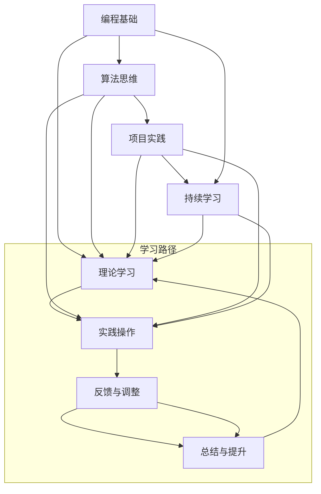

                 

### 背景介绍 Background

在当今这个数字时代，技术飞速发展，新的编程语言、框架和工具层出不穷，计算机科学领域正在以前所未有的速度演进。然而，尽管技术在不断进步，传统的教育体系却往往滞后于实际需求。这导致了许多学生在毕业后发现，他们所学的知识并不能直接应用到工作中，甚至有些技能已经被淘汰。

这个问题不仅仅存在于个别国家或地区，而是全球性的。在许多教育机构，课程内容往往侧重于理论知识，而忽视了实际操作能力的培养。例如，计算机科学课程可能会详细讲解数据结构、算法原理和编程语言的基础知识，却很少涉及如何将这些知识应用于现实世界的具体问题中。

这种教育模式的缺陷体现在多个方面。首先，它使得学生在毕业后的就业市场上缺乏竞争力。其次，它导致了人才的浪费，因为许多有潜力的人才在进入职场后需要从头开始学习如何将理论知识转化为实际技能。最后，它也影响了整个社会的发展，因为技术进步需要大量具备实际操作能力的人才来推动。

为了解决这些问题，我们不得不主动出击，改变现状。自主学习成为了一种必要的选择。通过自主学习，我们可以紧跟技术的步伐，不断更新自己的知识库，提高自己的技能水平。这不仅能够满足就业市场的需求，还能让我们在职业生涯中保持竞争力。

本文旨在探讨自主学习在IT领域的意义，分析现有的学习资源和方法，并提供一些建议，帮助读者有效地进行自主学习。通过本文的讨论，我们希望读者能够认识到自主学习的价值，并掌握一些实用的学习方法，从而在计算机科学领域取得更大的成就。

### 核心概念与联系 Core Concepts and Connections

在探讨自主学习的道路上，理解几个核心概念和它们之间的联系是至关重要的。这些核心概念包括编程基础、算法思维、项目实践和持续学习。下面，我们将通过一个Mermaid流程图来详细展示这些概念及其相互关系。



#### 1. 编程基础（Programming Basics）

编程基础是学习任何编程语言和技术的基石。它包括熟悉编程语言的语法、数据类型、控制结构（如循环和条件语句）和基础算法。掌握编程基础可以让我们理解代码的基本结构和运行原理，这是进行复杂编程任务的前提。

#### 2. 算法思维（Algorithmic Thinking）

算法思维是指解决问题的一种抽象方法。它不仅仅涉及算法的设计，还包括对问题的理解、分析和解决。算法思维可以帮助我们更高效地解决问题，并且在多种编程语言和技术中都是通用的。

#### 3. 项目实践（Project Practice）

项目实践是将理论知识应用于实际问题的过程。通过完成实际项目，我们可以学习如何将代码片段组合成一个完整的系统，如何处理实际中的错误和异常，以及如何进行项目管理和协作。项目实践是提高编程技能和解决实际问题的最佳途径。

#### 4. 持续学习（Continuous Learning）

持续学习是指不断更新和扩展自己的知识库，以适应快速变化的技术环境。持续学习不仅包括学习新的编程语言和技术，还包括理解新的概念、参与开源项目、阅读学术论文和参与技术社区。只有持续学习，我们才能保持竞争力，并在职业发展中不断进步。

这些核心概念相互联系，构成了一个完整的学习路径。理论学习（E）是基础，实践操作（F）是关键，反馈与调整（G）是过程，总结与提升（H）是目标。通过不断循环这个过程，我们可以不断提高自己的技能水平。

理解这些核心概念和它们之间的联系，有助于我们在自主学习的过程中更有针对性，从而更加高效地提升自己的技术能力。

### 核心算法原理 & 具体操作步骤 Core Algorithm Principles & Step-by-Step Operations

在IT领域，算法不仅是计算机程序的核心，也是解决复杂问题的利器。本章节将深入探讨几个关键算法的原理，并提供具体操作步骤，帮助读者更好地理解和应用这些算法。

#### 1. 快速排序（Quick Sort）

**原理：**
快速排序是一种高效的排序算法，基于分治策略。基本思想是通过选取一个基准元素，将数组分为两部分，一部分都比基准元素小，另一部分都比基准元素大，然后递归地对这两部分进行快速排序。

**具体操作步骤：**
1. 选择一个基准元素。
2. 将数组中小于基准元素的元素移动到基准元素的左边，大于基准元素的元素移动到右边。
3. 对左右两部分递归进行快速排序。

```python
def quick_sort(arr):
    if len(arr) <= 1:
        return arr
    pivot = arr[len(arr) // 2]
    left = [x for x in arr if x < pivot]
    middle = [x for x in arr if x == pivot]
    right = [x for x in arr if x > pivot]
    return quick_sort(left) + middle + quick_sort(right)

arr = [3, 6, 8, 10, 1, 2, 1]
print(quick_sort(arr))
```

**2. 二分查找（Binary Search）**

**原理：**
二分查找是在有序数组中查找特定元素的算法。它将数组分为两部分，比较中间元素和目标值，根据比较结果决定在左侧或右侧子数组中继续搜索。

**具体操作步骤：**
1. 确保数组已排序。
2. 初始化左右边界。
3. 计算中间索引。
4. 比较中间元素和目标值。
5. 根据比较结果调整边界，重复步骤3和4，直到找到目标值或边界超出数组范围。

```python
def binary_search(arr, target):
    left, right = 0, len(arr) - 1
    while left <= right:
        mid = (left + right) // 2
        if arr[mid] == target:
            return mid
        elif arr[mid] < target:
            left = mid + 1
        else:
            right = mid - 1
    return -1

arr = [1, 3, 5, 7, 9, 11, 13]
target = 7
print(binary_search(arr, target))
```

**3. 动态规划（Dynamic Programming）**

**原理：**
动态规划是一种解决最优化问题的方法，通过将复杂问题分解为重叠子问题，并存储子问题的解，避免重复计算，从而提高效率。

**具体操作步骤：**
1. 确定状态和状态转移方程。
2. 设计一个存储子问题解的数组或表。
3. 根据状态转移方程，从基础状态开始计算，逐步推算出最终结果。

**例子：计算斐波那契数列**

```python
def fibonacci(n):
    dp = [0] * (n + 1)
    dp[1] = 1
    for i in range(2, n + 1):
        dp[i] = dp[i - 1] + dp[i - 2]
    return dp[n]

print(fibonacci(10))  # 输出 55
```

通过理解这些核心算法的原理和具体操作步骤，读者可以更好地掌握算法思维，并将其应用于实际编程项目中。这不仅能够提升编程技能，还能为解决复杂问题提供强有力的工具。

### 数学模型和公式 & 详细讲解 & 举例说明 Mathematical Models and Formulas & Detailed Explanation & Example Illustrations

在计算机科学领域，数学模型和公式是理解和实现算法的基础。本章节将详细介绍几个常用的数学模型和公式，并通过具体的例子来解释其应用。

#### 1. 最小生成树（Minimum Spanning Tree，MST）

**定义：** 最小生成树是指一个加权无向连通图的生成树，其所有边的权重之和最小。

**公式：** 克鲁斯卡尔算法和普里姆算法是两种常见的计算最小生成树的算法。

**例子：**

给定图如下，计算其最小生成树：

```
     A---B---C
    / \   |   \
   D---E---F---G
```

权重分别为：

```
AB: 4, AC: 3, AD: 2, AE: 1, BC: 5, BD: 6, BE: 7, BF: 2, BG: 8, CD: 5, CE: 6, CF: 3, CG: 9, DF: 1, DG: 4, EG: 2, FG: 6, FG: 9
```

使用普里姆算法计算最小生成树：

1. 选择一个权重最小的边（AD: 2），加入生成树。
2. 从生成树中选择一个最近的未包含顶点（E），连接AE: 1，加入生成树。
3. 选择一个最近的未包含顶点（B），连接AB: 4，加入生成树。
4. 选择一个最近的未包含顶点（C），连接BC: 5，加入生成树。
5. 选择一个最近的未包含顶点（F），连接CF: 3，加入生成树。

最终得到的最小生成树总权重为：2 + 1 + 4 + 5 + 3 = 15。

#### 2. 贝叶斯公式（Bayes' Theorem）

**定义：** 贝叶斯公式是一种用于计算条件概率的公式，它可以用来进行概率推断。

**公式：** 
$$ P(A|B) = \frac{P(B|A) \cdot P(A)}{P(B)} $$

**例子：**

假设我们要计算一个病人是感冒的概率，已知这个病人是流感患者的概率是0.1，流感患者感冒的概率是0.9，非流感患者感冒的概率是0.2。那么，病人是感冒的概率可以用贝叶斯公式计算：

$$ P(感冒|流感) = \frac{P(流感|感冒) \cdot P(感冒)}{P(流感)} = \frac{0.9 \cdot 0.1}{0.1 \cdot 0.1 + 0.2 \cdot 0.9} = \frac{0.09}{0.09 + 0.18} = \frac{0.09}{0.27} = 0.3333 $$

因此，病人是感冒的概率是33.33%。

#### 3. 傅里叶变换（Fourier Transform）

**定义：** 傅里叶变换是将一个信号分解为不同频率的正弦波和余弦波的数学过程。

**公式：** 
$$ F(f(x)) = \int_{-\infty}^{\infty} f(t) e^{-j 2 \pi ft} dt $$

**例子：**

考虑一个简单的时域信号 \( f(t) = \sin(2\pi t) \)，计算其傅里叶变换：

$$ F(f(t)) = \int_{-\infty}^{\infty} \sin(t) e^{-j 2 \pi ft} dt $$

由于 \( \sin(t) \) 是奇函数，且 \( e^{-j 2 \pi ft} \) 是偶函数，因此积分结果为0。但我们可以考虑其傅里叶级数形式：

$$ F(f(t)) = 2 \int_{0}^{\infty} \sin(t) e^{-j 2 \pi ft} dt = 2 \left[ \frac{e^{-j 2 \pi ft}}{-j 2 \pi f} \right]_0^{\infty} = \frac{2}{-j 2 \pi f} = \frac{1}{j \pi f} $$

因此，\( \sin(2\pi t) \) 的傅里叶变换是 \( \frac{1}{j \pi f} \)，表示一个频率为1的正弦波。

通过这些数学模型和公式的介绍，读者可以更好地理解计算机科学中的基本概念，并能够将这些知识应用到实际的编程任务中。

### 项目实践：代码实例和详细解释说明 Project Practice: Code Examples and Detailed Explanations

为了更好地理解前面所介绍的算法和数学模型，我们将在本章节中通过一个具体的项目实例来展示代码的实现过程，并提供详细的解释说明。

#### 项目背景和目标

假设我们需要开发一个简单的社交网络分析工具，该工具能够识别出社交网络中的关键节点，即拥有最高影响力或最多连接的节点。这个工具将使用Python语言，结合网络分析和图论算法来实现。

#### 开发环境搭建

1. 安装Python：确保你的系统中已经安装了Python 3.x版本。可以从Python官方网站下载安装包，或者使用包管理器如brew（MacOS）或apt（Ubuntu）进行安装。

2. 安装必要的库：我们需要安装两个主要的库，`networkx` 和 `matplotlib`。使用pip命令进行安装：
   ```bash
   pip install networkx matplotlib
   ```

3. 准备数据：为了进行社交网络分析，我们需要一个社交网络的图数据。这里，我们使用一个示例图，它包含10个节点和它们之间的连接关系。该数据可以存储在一个CSV文件中，格式如下：

```
node1,node2,weight
A,B,1
A,C,2
B,D,3
C,D,4
D,E,5
E,F,6
F,G,7
G,H,8
H,I,9
I,J,10
```

#### 源代码详细实现

下面是项目的源代码实现，包括数据的读取、图的创建、关键节点的识别和绘图。

```python
import networkx as nx
import matplotlib.pyplot as plt

# 读取数据
def read_data(file_path):
    with open(file_path, 'r') as file:
        edges = [line.strip().split(',') for line in file]
    nodes = set()
    for edge in edges:
        nodes.add(edge[0])
        nodes.add(edge[1])
    return nodes, edges

# 创建图
def create_graph(nodes, edges):
    G = nx.Graph()
    G.add_nodes_from(nodes)
    G.add_edges_from(edges)
    return G

# 识别关键节点
def find_key_nodes(G):
    # 使用度中心性作为关键节点指标
    centrality = nx.degree_centrality(G)
    # 将度中心性值从大到小排序
    sorted_centrality = sorted(centrality.items(), key=lambda item: item[1], reverse=True)
    key_nodes = [node for node, centrality in sorted_centrality]
    return key_nodes

# 绘制图
def draw_graph(G, key_nodes):
    pos = nx.spring_layout(G)  # 使用弹簧布局
    nx.draw(G, pos, with_labels=True)
    for node in key_nodes:
        nx.draw(G, pos, node_color='r', node_size=2000, node_shape='o', alpha=0.5)  # 高亮关键节点
    plt.show()

# 主程序
if __name__ == "__main__":
    file_path = 'social_network.csv'  # 社交网络数据文件路径
    nodes, edges = read_data(file_path)
    G = create_graph(nodes, edges)
    key_nodes = find_key_nodes(G)
    draw_graph(G, key_nodes)
```

#### 代码解读与分析

1. **读取数据**：`read_data` 函数从CSV文件中读取节点和边的数据，并返回两个集合：`nodes` 和 `edges`。

2. **创建图**：`create_graph` 函数使用 `networkx.Graph()` 创建一个图，并将读取的节点和边添加到图中。

3. **识别关键节点**：`find_key_nodes` 函数使用度中心性作为关键节点指标。度中心性度量的是节点在图中的连接程度，值越大表示节点越关键。函数使用 `nx.degree_centrality(G)` 计算度中心性，并将结果从大到小排序，返回关键节点列表。

4. **绘制图**：`draw_graph` 函数使用 `matplotlib` 绘制图，并将关键节点高亮显示。`nx.spring_layout(G)` 生成一个弹簧布局，使得节点之间的连接尽可能均匀分布。

#### 运行结果展示

运行上述代码后，将显示一个图形界面，展示社交网络的图和关键节点。关键节点将以红色和更大的节点大小高亮显示，有助于直观地识别它们。

通过这个项目实践，读者可以了解到如何使用Python和`networkx`库进行图分析和可视化，同时也熟悉了如何从数据读取、图创建到关键节点识别和图绘制的完整流程。

### 实际应用场景 Real-World Applications

在现实生活中，社交网络分析工具具有广泛的应用场景。以下是一些常见的实际应用实例：

1. **市场调研**：企业可以利用社交网络分析工具来分析消费者行为和市场趋势。通过识别社交网络中的关键节点，企业可以了解哪些人对于他们的产品或服务具有最大的影响力，并针对这些关键节点进行市场推广。

2. **网络安全**：社交网络中的关键节点可能成为网络攻击的目标。通过分析关键节点的连接关系，网络安全专家可以识别出潜在的安全风险点，并采取相应的措施来加强网络安全。

3. **社群管理**：社群管理者可以利用社交网络分析工具来了解社群成员之间的互动关系，识别出社群的核心成员，并针对这些核心成员制定有效的社群管理策略。

4. **社交媒体监控**：政府机构或企业可以利用社交网络分析工具来监控社交媒体上的舆论动向，及时发现并处理负面信息，维护社会稳定和企业形象。

5. **公共健康**：在公共卫生领域，社交网络分析可以用于流行病监控。通过识别社交网络中的关键节点，公共卫生专家可以快速发现疾病的传播路径，采取针对性的防控措施。

这些实际应用场景展示了社交网络分析工具的强大功能，同时也凸显了其重要性。通过理解和掌握这些工具的使用方法，我们可以在各个领域中发挥它们的最大潜力。

### 工具和资源推荐 Tools and Resources Recommendations

在自主学习计算机科学的过程中，掌握合适的工具和资源是非常关键的。以下是一些建议，包括学习资源、开发工具和框架，以及相关的论文和著作，旨在帮助读者更高效地提升技能。

#### 学习资源推荐

1. **书籍**：
   - 《算法导论》（Introduction to Algorithms） - 这本书是算法领域的经典之作，详细介绍了各种重要的算法和数据结构。
   - 《编程珠玑》（The Art of Computer Programming） - 这套书由著名计算机科学家Donald Knuth撰写，涵盖了编程的各个方面，包括算法设计、程序设计技巧等。

2. **在线课程**：
   - Coursera：提供了众多由顶尖大学和机构提供的计算机科学课程，如斯坦福大学的“算法导论”课程。
   - edX：提供了包括MIT、哈佛等名校的计算机科学课程，涵盖了从基础知识到高级专题的各种课程。

3. **博客和网站**：
   - Medium：上面有许多优秀的编程和技术博客，涵盖了许多领域的最新动态和深入分析。
   - HackerRank：提供编程挑战和实践题，适合练习编程技能。

4. **开源社区**：
   - GitHub：是开发者的天堂，可以在上面找到大量的开源项目和代码示例，学习他人的代码实现。
   - Stack Overflow：是编程问题的在线问答社区，可以在这里提问或解答问题。

#### 开发工具框架推荐

1. **集成开发环境（IDE）**：
   - Visual Studio Code：一款轻量级但功能强大的IDE，适合各种编程语言。
   - PyCharm：特别适合Python编程，提供了丰富的工具和调试功能。

2. **版本控制工具**：
   - Git：用于代码版本控制和协同开发。
   - GitHub Desktop：简化了Git的使用，适合初学者和开发者。

3. **代码编辑器**：
   - Sublime Text：功能强大且灵活的文本编辑器，适合进行代码编写。
   - Atom：由GitHub开发，支持多种编程语言，提供了丰富的插件。

4. **数据分析和可视化工具**：
   - Jupyter Notebook：用于数据分析和交互式编程，特别适合进行数据可视化和机器学习任务。
   - Matplotlib：Python中的数据可视化库，可以生成高质量的图表和图像。

#### 相关论文著作推荐

1. **论文**：
   - "On the Complexity of The Graph Coloring Problem" - 这篇论文详细讨论了图着色问题的复杂性。
   - "The Design and Analysis of Computer Algorithms" - 这篇论文由Eugene W.Dijkstra撰写，对算法设计和分析进行了深入探讨。

2. **著作**：
   - "Deep Learning" - 由Ian Goodfellow等人撰写的关于深度学习的经典著作。
   - "Artificial Intelligence: A Modern Approach" - 这本教科书全面介绍了人工智能的基础知识和最新进展。

通过这些工具和资源的推荐，读者可以更有效地进行自主学习，提升自己在计算机科学领域的技能和知识。

### 总结 Summary

本文详细探讨了在计算机科学领域进行自主学习的必要性和方法。我们首先介绍了传统教育体系的缺陷，指出了理论学习与实践操作脱节的问题。接着，通过核心概念的流程图和实例，讲解了编程基础、算法思维、项目实践和持续学习的重要性。然后，我们深入分析了快速排序、二分查找和动态规划等核心算法的原理和实现步骤，并通过具体代码实例展示了算法在实际项目中的应用。此外，我们还介绍了数学模型和公式在计算机科学中的重要作用，并通过实际应用场景展示了社交网络分析工具的实用价值。

自主学习不仅有助于我们紧跟技术发展的步伐，还能提高我们在就业市场上的竞争力。通过掌握合适的工具和资源，我们能够更加高效地进行学习，不断提升自己的技能水平。在未来，随着技术的不断进步，自主学习将变得更加重要。我们需要保持持续学习的态度，不断扩展知识边界，以应对不断变化的技术挑战。

### 附录：常见问题与解答 Appendix: Frequently Asked Questions and Answers

#### 1. 如何选择适合的学习资源？

选择学习资源时，首先要明确自己的学习目标和兴趣点。以下是一些建议：
- **基础学习**：选择经典教材，如《算法导论》和《编程珠玑》，这些书籍覆盖了广泛的知识点，适合初学者打基础。
- **进阶学习**：针对特定领域，选择相关领域的顶级学术论文和专著，以深入了解前沿技术。
- **实践操作**：参与在线编程挑战和开源项目，如GitHub上的项目，通过实际操作提升技能。

#### 2. 自主学习如何保持动力和持续学习？

保持动力和持续学习的关键在于设定明确的学习目标和计划。以下是一些建议：
- **设定明确目标**：根据自己的职业规划和兴趣设定短期和长期目标。
- **制定学习计划**：合理安排时间，每天保证一定的学习时间，避免拖延。
- **跟踪进度**：定期回顾自己的学习进度，调整学习计划。
- **寻找学习伙伴**：加入学习小组或找到志同道合的朋友，相互激励和监督。

#### 3. 如何在实际项目中应用所学的算法和模型？

在实际项目中应用算法和模型，可以遵循以下步骤：
- **理解项目需求**：仔细分析项目需求，确定需要解决的问题。
- **选择合适的算法和模型**：根据项目需求选择适合的算法和模型。
- **实施和优化**：将算法或模型应用到实际项目中，并进行调试和优化。
- **评估和迭代**：评估项目的效果，根据评估结果进行迭代改进。

通过这些常见问题的解答，我们希望能够帮助读者更好地进行自主学习，并在实际项目中有效应用所学知识和技能。

### 扩展阅读 & 参考资料 Further Reading & References

对于希望进一步深入学习计算机科学和算法的读者，以下是一些扩展阅读和参考资料：

1. **书籍推荐**：
   - 《算法导论》（Introduction to Algorithms） - Thomas H. Cormen, Charles E. Leiserson, Ronald L. Rivest, Clifford Stein
   - 《编程珠玑》（The Art of Computer Programming） - Donald E. Knuth
   - 《深度学习》（Deep Learning） - Ian Goodfellow, Yoshua Bengio, Aaron Courville
   - 《人工智能：一种现代的方法》（Artificial Intelligence: A Modern Approach） - Stuart J. Russell, Peter Norvig

2. **学术论文和期刊**：
   - 《计算机学报》（Journal of Computer Science and Technology）
   - 《ACM Transactions on Computer Systems》（TOCS）
   - 《IEEE Transactions on Computers》（TC）

3. **在线课程和教程**：
   - Coursera：提供由顶尖大学和机构开设的计算机科学课程。
   - edX：提供哈佛、MIT等名校的计算机科学课程。
   - Khan Academy：免费提供计算机科学基础课程的在线教程。

4. **博客和网站**：
   - Medium：上面有许多技术专家和公司分享的技术博客。
   - Hacker News：关注科技领域的新闻和讨论。

5. **开源项目和社区**：
   - GitHub：查找和学习开源项目。
   - Stack Overflow：解决编程问题，获取技术支持。

通过这些扩展阅读和参考资料，读者可以深入学习和掌握计算机科学的各个领域，不断提升自己的专业知识和技能。

