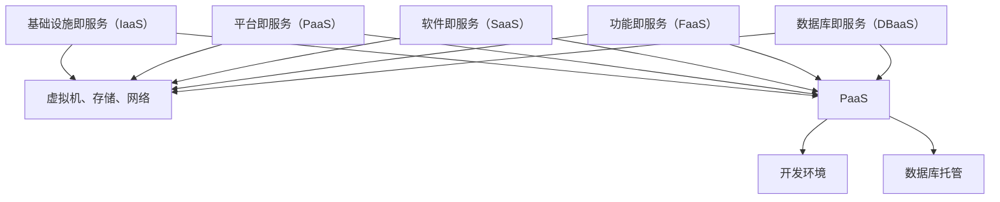

                 

### 背景介绍

在现代商业环境中，云服务已经成为企业运营不可或缺的一部分。对于创业公司而言，合理选择云服务不仅能够提高业务灵活性，还能降低IT基础设施的维护成本。然而，面对市场上琳琅满目的云服务提供商和多种服务类型，如何做出最佳选择成为许多创业者面临的挑战。

首先，我们需要明确创业公司选择云服务时的主要考虑因素。这些因素包括但不限于：

1. **业务需求**：公司所从事的行业、业务规模和未来发展规划直接影响云服务的需求。
2. **成本控制**：云服务的成本是创业公司能否持续运营的重要因素之一。
3. **性能与可靠性**：服务提供商的硬件设施、网络性能和故障恢复能力直接影响业务连续性和用户体验。
4. **安全性与合规性**：数据安全和隐私保护对于任何企业都是至关重要的，特别是在遵守相关法律法规方面。
5. **技术支持与生态系统**：服务提供商的技术支持能力和相关的开发工具与库支持也会影响创业公司的开发效率和创新能力。

本文将深入探讨如何基于这些因素，选择适合创业公司的云服务。我们将首先介绍几种主流的云服务类型，然后分析不同云服务提供商的优势和劣势，最后提出一系列决策框架，帮助创业公司做出最佳选择。

总的来说，创业公司在选择云服务时，需要综合考虑多种因素，不仅要满足当前的业务需求，还要具备一定的前瞻性和灵活性，以应对未来业务的发展。接下来，我们将一步步解析这些因素，并提供实用的决策指南。

### 云服务类型概述

在深入了解创业公司选择云服务的考虑因素之前，有必要对云服务的基本类型进行简要概述。云服务大致可以分为以下几类：

1. **基础设施即服务（IaaS）**：IaaS提供虚拟化的计算资源，如虚拟机、存储和网络。创业公司可以利用IaaS快速搭建和扩展自己的IT基础设施，无需投入大量的硬件采购和维护成本。典型的IaaS提供商包括亚马逊AWS、微软Azure和谷歌云平台。

2. **平台即服务（PaaS）**：PaaS提供了一个完整的开发平台，包含操作系统、数据库、Web服务器等，允许开发者专注于应用开发和部署，而无需关注底层基础设施的管理。PaaS适用于需要快速开发和部署应用的创业公司。代表服务商包括谷歌App Engine、微软Azure App Service和亚马逊AWS Elastic Beanstalk。

3. **软件即服务（SaaS）**：SaaS提供现成的软件应用，用户通过互联网按需访问和使用。这种服务模式无需公司安装或维护软件，降低了运营成本和技术门槛。常见的SaaS应用包括谷歌 Workspace、Salesforce和微软Office 365。

4. **功能即服务（FaaS）**：FaaS是一种新兴的服务模式，提供代码即服务的解决方案。开发者可以将函数上传到云端，按需执行并自动进行扩展和监控。FaaS适用于需要实现特定功能的微服务架构或事件驱动的应用。主要提供商包括亚马逊AWS Lambda、谷歌云 Functions和微软Azure Functions。

5. **数据库即服务（DBaaS）**：DBaaS提供数据库托管服务，包括数据库的部署、管理和维护。创业公司可以通过DBaaS轻松扩展和优化数据库性能，无需深入了解数据库技术。常见DBaaS提供商包括亚马逊Aurora、谷歌云SQL数据库和微软Azure Database Services。

了解这些云服务类型有助于创业公司在选择服务时明确自己的需求，并找到最合适的解决方案。下面将详细讨论各个因素，帮助创业公司做出明智的选择。

### 业务需求分析

选择云服务时，业务需求分析是至关重要的一步。创业公司的业务需求因行业、发展阶段和未来规划的不同而千差万别，因此需要仔细考虑以下几个方面：

1. **行业特性**：
   - **互联网和科技行业**：这些行业的创业公司通常需要快速部署和扩展应用，以应对市场需求的变化。因此，PaaS和FaaS服务可能更为适合，因为它们能够提供高效的开发环境，快速响应业务需求。
   - **金融和医疗行业**：这些行业对数据安全和合规性要求较高，可能需要选择具备严格安全标准和合规认证的云服务提供商，如IaaS和DBaaS，以确保数据的安全和符合相关法规。
   - **制造和物流行业**：这类公司可能需要稳定的计算资源和大规模存储，以便处理大量的生产数据和物流信息。IaaS和SaaS服务能够提供弹性的计算资源和高效的数据存储解决方案。

2. **公司发展阶段**：
   - **初创阶段**：在初创阶段，公司往往需要快速验证产品概念，因此PaaS和FaaS服务因其快速部署和低成本的特点而受欢迎。初创公司可以使用这些服务快速构建原型，进行市场测试，并在需要时进行扩展。
   - **成长阶段**：随着公司规模的扩大，业务需求变得更加复杂，对云服务的性能、可靠性和可扩展性要求也相应提高。此时，选择IaaS和DBaaS服务可能更为合适，因为它们提供了更高的计算能力和数据存储可靠性。
   - **成熟阶段**：成熟的创业公司可能需要定制化解决方案，以支持其独特业务需求。这种情况下，与云服务提供商建立深度合作，甚至采用混合云或多云策略，可能更为有效。

3. **未来发展规划**：
   - **短期目标**：如果公司的短期目标是快速扩大市场份额，那么选择具有高扩展性和灵活性的云服务至关重要。例如，PaaS和FaaS服务能够快速扩展，满足业务增长需求。
   - **长期目标**：如果公司有长期发展计划，如全球化扩展或业务多元化，那么选择具有全球覆盖和强大生态系统支持的云服务提供商可能更为合适。这些提供商能够提供广泛的云服务和持续的技术支持，帮助公司实现长期目标。

总之，创业公司应根据自身行业特性、发展阶段和未来发展规划，进行详细的业务需求分析。这不仅有助于选择最适合的云服务类型，还能为公司的长远发展奠定坚实基础。

### 成本控制因素

成本控制是创业公司选择云服务时不可忽视的重要因素。云服务的费用结构复杂多样，涉及计算资源、存储、带宽、数据传输等多个方面。合理控制成本，不仅能够延长公司的资金链，还能提高资源利用效率，为业务增长提供有力支持。以下是一些关键的考虑因素和策略：

1. **计算资源优化**：
   - **按需付费**：按需付费模式是创业公司控制成本的有效方法。根据实际使用量付费，避免了资源闲置和浪费。例如，亚马逊AWS的按需实例和微软Azure的 PAYG（Pay As You Go）模式，都为创业公司提供了灵活的计费选项。
   - **预留实例**：对于有稳定计算需求的公司，购买预留实例能够节省成本。预留实例分为一年期和三年期，尽管前期需要支付一定金额的押金，但长期使用可以显著降低费用。例如，微软Azure的预留实例折扣率可以达到40%。

2. **存储优化**：
   - **分层存储**：云服务提供商通常提供多种存储类型，如标准存储、冷存储和归档存储。合理选择存储类型，可以将数据存储在成本最低的层，同时保证数据可用性和可靠性。例如，亚马逊AWS的S3存储服务提供了多种存储类别，可以根据数据访问频率进行优化。
   - **数据去重和压缩**：通过数据去重和压缩技术，可以减少存储空间的需求，从而降低存储成本。一些云服务提供商如谷歌云和微软Azure，提供了内置的去重和压缩工具，帮助用户优化存储资源。

3. **网络优化**：
   - **带宽优化**：合理配置带宽，避免不必要的带宽浪费。例如，在高峰时段使用带宽加倍服务，可以确保网络运行稳定，同时避免超额使用带宽带来的额外费用。
   - **数据传输优化**：优化数据传输策略，减少跨国数据传输的成本。例如，使用CDN（内容分发网络）可以将数据缓存到离用户更近的位置，降低数据传输的延迟和费用。

4. **利用免费试用和优惠活动**：
   - **免费试用**：许多云服务提供商提供免费试用或试用期优惠，创业公司可以利用这些机会进行服务评估，同时节省实际使用成本。
   - **合作伙伴优惠**：与云服务提供商建立合作伙伴关系，可以享受特定的优惠价格。一些创业孵化器和投资者也会提供与云服务提供商的合作机会，为创业公司争取更多优惠。

5. **监控和管理工具**：
   - **使用监控工具**：通过云服务提供商提供的监控工具，如亚马逊AWS的CloudWatch、微软Azure的Azure Monitor，可以实时监控云资源的使用情况，及时发现潜在的成本浪费。
   - **自动化成本优化**：利用自动化工具，如亚马逊AWS的Cost Explorer和微软Azure的Cost Management工具，可以自动分析云资源使用情况，提出优化建议，帮助创业公司实现成本控制。

总之，创业公司在选择云服务时，应充分考虑成本控制因素，通过合理的资源管理和优化策略，实现云服务的最佳成本效益。这不仅有助于公司的可持续发展，还能为未来的业务扩张提供坚实的财务基础。

### 性能与可靠性考量

对于创业公司而言，云服务的性能和可靠性是决定业务成功与否的关键因素。高性能和可靠的云服务能够确保应用的高可用性和低延迟，提升用户体验，从而增强用户对公司的信任。以下是一些关键指标和策略，以帮助创业公司在选择云服务时进行性能和可靠性的考量：

1. **关键性能指标**：
   - **计算性能**：计算性能通常通过CPU性能、内存带宽和I/O性能来衡量。创业公司应选择具备高性能计算能力的云服务，以满足复杂计算需求。例如，亚马逊AWS的EC2实例提供了多种性能规格，适用于不同的计算需求。
   - **网络性能**：网络性能包括带宽、延迟和吞吐量。高带宽和低延迟的网络能够确保数据的快速传输和处理，提升整体应用性能。创业公司应选择具备高性能网络设施的云服务提供商，如谷歌云和微软Azure。
   - **存储性能**：存储性能涉及到读写速度和存储容量。快速响应的存储系统能够显著提升数据处理速度。例如，亚马逊AWS的EBS（弹性块存储）和谷歌云的Persistent Disks，都提供了高效的存储解决方案。

2. **可靠性策略**：
   - **多可用区部署**：多可用区部署可以将应用分布在不同的物理数据中心，以应对单个数据中心故障的风险。创业公司应选择提供多可用区部署的云服务提供商，确保业务连续性。例如，亚马逊AWS和微软Azure都提供了多可用区部署选项。
   - **自动故障转移**：自动故障转移是一种在检测到故障时自动将流量切换到备用系统的策略。这种策略可以显著减少故障期间的业务中断时间。创业公司可以利用云服务提供商提供的自动故障转移功能，如亚马逊AWS的ELB（弹性负载均衡）和微软Azure的Azure Load Balancer。
   - **备份和恢复**：备份和恢复策略是确保数据安全性的重要手段。创业公司应选择提供数据备份和快速恢复服务的云服务提供商。例如，亚马逊AWS的RDS（关系数据库服务）和谷歌云的SQL数据库都提供了自动备份和快速恢复功能。

3. **性能优化策略**：
   - **负载均衡**：负载均衡可以将流量均匀分配到多个实例或节点，避免单个节点过载。创业公司可以利用云服务提供商提供的负载均衡服务，如亚马逊AWS的ELB和微软Azure的Azure Load Balancer，提升应用性能。
   - **缓存策略**：缓存可以将经常访问的数据存储在内存中，减少对后端系统的访问频率，提升响应速度。例如，亚马逊AWS的AWS CloudFront和微软Azure的Azure CDN都提供了高效的缓存服务。
   - **数据库优化**：数据库优化包括索引、查询优化和数据分区等。创业公司应选择具备高效数据库性能的云服务，如亚马逊AWS的Amazon RDS、谷歌云的Google Cloud SQL和微软Azure的Azure Database。

总之，创业公司在选择云服务时，需要综合考虑计算性能、网络性能、存储性能以及可靠性策略。通过合理配置和优化，可以确保云服务具备出色的性能和可靠性，为公司的业务发展提供有力保障。在接下来的部分，我们将进一步探讨安全性与合规性的重要性和实现方法。

### 安全性与合规性考虑

在当今数字化时代，数据安全和合规性是企业选择云服务时必须高度关注的问题。对于创业公司而言，确保数据的安全和隐私，不仅关乎业务的稳定发展，还直接影响到用户对公司的信任。以下是一些关键因素和策略，以帮助创业公司在选择云服务时确保安全性和合规性：

1. **数据加密**：
   - **传输加密**：数据在传输过程中应使用加密协议，如SSL/TLS，确保数据在传输过程中不被窃取或篡改。创业公司应选择提供强加密支持的云服务提供商，如亚马逊AWS的SSL证书和谷歌云的SSL Manager。
   - **存储加密**：存储在云服务提供商中的数据也应进行加密，以防止未经授权的访问。大多数云服务提供商都提供内置的加密功能，如亚马逊AWS的AWS Key Management Service（KMS）和微软Azure的Azure Key Vault。

2. **访问控制**：
   - **身份验证**：创业公司应确保云服务提供商支持多因素身份验证（MFA），以增强用户身份的验证强度，防止未经授权的访问。
   - **访问权限管理**：通过细粒度的访问权限管理，确保只有授权用户可以访问敏感数据和系统资源。创业公司可以利用云服务提供商提供的访问控制列表（ACL）和角色基访问控制（RBAC），实现精细化的权限管理。

3. **安全审计与监控**：
   - **日志记录**：创业公司应确保云服务提供商能够记录所有关键操作和事件日志，以便进行安全审计和问题追踪。例如，亚马逊AWS的CloudTrail和微软Azure的Azure Monitor提供了详尽的日志记录功能。
   - **安全监控与警报**：通过安全监控工具，创业公司可以实时检测潜在的安全威胁，并快速响应。例如，亚马逊AWS的AWS GuardDuty和谷歌云的SafeNet Cloud Security提供了强大的安全监控和警报功能。

4. **合规性**：
   - **数据保护法规**：创业公司应确保云服务提供商遵循相关数据保护法规，如欧盟的通用数据保护条例（GDPR）和美国加州消费者隐私法案（CCPA）。创业公司可以查看云服务提供商的合规性报告和认证，以确保数据符合法规要求。
   - **数据本地化**：对于涉及敏感数据的应用，创业公司可能需要选择提供数据本地化的云服务提供商，以确保数据存储在特定地理位置。例如，亚马逊AWS的AWS Local Zone和微软Azure的Azure Sovereign Cloud提供了本地化数据存储解决方案。

总之，创业公司在选择云服务时，必须全面考虑数据安全和合规性因素。通过合理配置加密、访问控制、安全审计与监控以及合规性策略，创业公司可以确保数据的安全和隐私，满足法律法规的要求，从而为业务的长期发展奠定坚实基础。接下来，我们将探讨技术支持与生态系统的重要性。

### 技术支持与生态系统

选择云服务提供商时，技术支持与生态系统也是创业公司不可忽视的重要考量因素。一个强大的技术支持团队和成熟的生态系统可以为创业公司提供全方位的技术保障和业务支持，从而帮助其更快地发展。以下是一些关键因素和最佳实践：

1. **技术支持团队**：
   - **响应速度**：高效的客户支持是云服务提供商的重要优势之一。创业公司应选择提供快速响应和解决方案的云服务提供商，以减少业务中断时间。例如，亚马逊AWS和微软Azure都提供了24/7的技术支持服务。
   - **专业知识**：技术支持团队的专业知识水平直接影响问题的解决效率。创业公司应选择拥有丰富经验和深厚技术背景的支持团队，以确保技术问题的及时解决。

2. **文档和教程资源**：
   - **详细的文档**：创业公司应选择提供详尽文档资源的云服务提供商，这些文档包括API文档、开发指南、最佳实践等，可以帮助开发者快速上手并解决问题。
   - **在线教程和示例**：丰富的在线教程和示例代码能够帮助开发者更好地理解云服务特性，加速开发进度。例如，谷歌云提供了大量的在线教程和开源代码示例，微软Azure和亚马逊AWS也有类似的资源。

3. **开源社区和生态系统**：
   - **开源支持**：创业公司应选择支持开源技术的云服务提供商，这可以促进技术的创新和集成。例如，亚马逊AWS、微软Azure和谷歌云都积极支持开源项目，提供了丰富的开源工具和库。
   - **开发者社区**：活跃的社区可以为开发者提供交流和学习的机会，分享最佳实践和解决方案。创业公司可以通过参与这些社区，获取宝贵的技术支持和业务建议。例如，亚马逊AWS和微软Azure都有庞大的开发者社区，谷歌云的社区也非常活跃。

4. **集成和兼容性**：
   - **平台兼容性**：创业公司应选择能够与其他系统和工具无缝集成的云服务提供商，这有助于构建灵活和可扩展的应用架构。例如，亚马逊AWS提供了广泛的集成选项，包括与Salesforce、Slack等流行的第三方服务的无缝集成。
   - **工具支持**：云服务提供商应提供丰富的开发工具和框架支持，以简化开发流程。例如，微软Azure的开发工具集包含了Visual Studio和Azure DevOps，亚马逊AWS则提供了AWS Toolkit for Visual Studio Code，谷歌云也有Google Cloud Tools for Eclipse。

5. **合作伙伴网络**：
   - **专业合作伙伴**：云服务提供商的合作伙伴网络可以提供额外的技术支持和咨询服务，帮助创业公司解决特定问题。例如，亚马逊AWS的合作伙伴网络中包括了数千家认证咨询公司和解决方案提供商，微软Azure和谷歌云也有类似的合作伙伴网络。

总之，技术支持与生态系统对于创业公司至关重要。通过选择提供强大技术支持团队、丰富文档资源、活跃开源社区和生态系统的云服务提供商，创业公司可以更快速地开发、部署和扩展其业务，从而在竞争激烈的市场中脱颖而出。接下来，我们将分析不同云服务提供商的优势和劣势，以帮助创业公司做出明智选择。

### 不同云服务提供商的优势与劣势

在选择云服务提供商时，创业公司需要综合考虑各种因素，包括价格、性能、可靠性、安全性和生态系统。以下将分析一些主流云服务提供商的优势和劣势，以帮助创业公司做出明智的决策。

1. **亚马逊AWS**：

   - **优势**：
     - **广泛的服务范围**：AWS提供了最全面的服务，涵盖了IaaS、PaaS、SaaS和FaaS等多种类型。
     - **强大的生态系统**：AWS拥有庞大的开发者社区和丰富的开源支持，提供详细的文档和教程。
     - **可靠性**：AWS在全球拥有多个数据中心，提供高可用性和自动故障转移功能。
     - **成本效益**：AWS提供了多种计费模式和预留实例，有助于创业公司优化成本。

   - **劣势**：
     - **复杂性**：AWS的服务种类繁多，对于不熟悉云技术的创业公司来说，配置和管理可能较为复杂。
     - **价格波动**：AWS的价格可能会因市场需求波动而变化，需要创业公司进行持续的成本监控。

2. **微软Azure**：

   - **优势**：
     - **企业级支持**：Azure提供了强大的企业级服务，特别适合需要与微软其他产品集成的创业公司。
     - **无缝集成**：Azure与Microsoft 365、SQL Server等微软产品无缝集成，提供了一站式的解决方案。
     - **全球覆盖**：Azure在全球多个地区拥有数据中心，提供本地化服务。
     - **成本效益**：Azure的预留实例和按需付费模式有助于创业公司控制成本。

   - **劣势**：
     - **市场占有率**：尽管Azure是市场领导者之一，但在某些地区，AWS和谷歌云可能更具优势。
     - **开源支持**：相比AWS，Azure在开源支持方面稍显不足。

3. **谷歌云**：

   - **优势**：
     - **高性能**：谷歌云以其高性能和低延迟而闻名，特别适合需要高计算性能和大规模数据处理的创业公司。
     - **创新性**：谷歌云不断推出新技术和功能，如AI和机器学习服务，为创业公司提供创新动力。
     - **成本透明**：谷歌云提供了透明的定价策略，有助于创业公司进行成本规划。

   - **劣势**：
     - **服务范围**：相比AWS和Azure，谷歌云的服务范围较窄，某些特定领域的服务可能不够全面。
     - **全球覆盖**：谷歌云在某些地区的覆盖面不如AWS和Azure广泛。

4. **阿里云**：

   - **优势**：
     - **本地化**：阿里云在中国市场拥有深厚的基础和广泛的服务范围，特别适合在中国开展业务的创业公司。
     - **成本效益**：阿里云提供了多种优惠和免费试用方案，有助于创业公司节省成本。
     - **云原生服务**：阿里云在容器和Kubernetes等云原生技术方面具有较强的竞争力。

   - **劣势**：
     - **国际化**：尽管阿里云在中国市场表现强劲，但在国际市场的知名度和影响力相对较弱。
     - **技术更新**：相比AWS和谷歌云，阿里云在某些新技术领域的更新速度可能较慢。

5. **IBM云**：

   - **优势**：
     - **安全性**：IBM云以其强大的安全性和合规性而闻名，特别适合注重数据安全和隐私的创业公司。
     - **混合云和多云支持**：IBM云提供了强大的混合云和多云支持，适合需要跨平台部署的创业公司。
     - **专业服务**：IBM提供了丰富的专业服务和咨询，帮助创业公司实现数字化转型。

   - **劣势**：
     - **价格**：IBM云的价格相对较高，对于预算有限的创业公司可能是一个劣势。
     - **市场占有率**：尽管IBM在云计算市场有重要地位，但在某些领域，市场份额相对较小。

总的来说，不同的云服务提供商各有其独特的优势与劣势。创业公司应根据自身的业务需求、预算和技术背景，选择最适合的云服务提供商。在接下来的部分，我们将提出一系列决策框架，以帮助创业公司做出最佳选择。

### 选择云服务的决策框架

在选择云服务时，创业公司可以参考以下一系列决策框架，确保选定的云服务能够满足业务需求，同时具备良好的成本效益、性能和可靠性。以下是具体的步骤和建议：

1. **明确业务需求**：
   - **初步调研**：首先，创业公司应明确自身的业务需求，包括行业特性、公司发展阶段、技术需求和未来发展规划。通过问卷调查、访谈和市场研究，收集相关数据，形成对业务需求的全面理解。
   - **优先级排序**：根据业务需求的重要性，对各项需求进行优先级排序。例如，对于金融行业，数据安全和合规性可能是最高优先级，而对于初创企业，快速开发和低成本可能是更优先的需求。

2. **评估云服务提供商**：
   - **提供商选择**：在明确业务需求后，创业公司应评估市场上主要的云服务提供商，如亚马逊AWS、微软Azure、谷歌云、阿里云和IBM云等。
   - **功能对比**：对比各个提供商的功能和服务范围，确保其能够满足业务需求。例如，如果业务需要强大的数据库服务，应优先考虑AWS的RDS和谷歌云的SQL数据库。
   - **性能和可靠性对比**：通过性能测试和案例研究，对比各个提供商的性能和可靠性指标，选择具有优秀性能和高度可靠的云服务。

3. **成本分析**：
   - **预算制定**：在初步确定云服务提供商后，创业公司应制定详细的预算，考虑包括计算资源、存储、网络和数据传输在内的各项成本。
   - **成本模型**：使用云服务提供商提供的成本估算工具，如AWS Cost Explorer和Azure Cost Management，构建详细的成本模型。
   - **优化策略**：分析成本模型，寻找优化机会，如预留实例、分层存储和带宽优化等，以实现最佳成本效益。

4. **安全性评估**：
   - **合规性检查**：确保所选云服务提供商符合相关法规和行业标准，如GDPR和CCPA等。
   - **加密和安全控制**：评估云服务提供商提供的加密和安全控制措施，确保数据在传输和存储过程中的安全性。
   - **安全审计**：了解云服务提供商的安全审计机制，如AWS的AWS Audit Manager和Azure的Azure Security Center，确保其能够提供全面的安全保障。

5. **生态系统支持**：
   - **技术支持团队**：评估云服务提供商的技术支持团队，包括响应速度和专业性。
   - **文档和教程资源**：选择提供详细文档和教程资源的云服务提供商，以帮助开发者快速上手。
   - **开源支持和社区**：考虑云服务提供商在开源社区和开发者社区中的活跃度，选择能够提供丰富技术支持和交流机会的提供商。

6. **测试和验证**：
   - **试用和评估**：选择多个云服务提供商进行试用，评估其服务的实际性能和可靠性。
   - **迁移计划**：制定详细的迁移计划，包括数据迁移、应用程序配置和测试等，确保顺利迁移到所选云服务。
   - **风险评估**：在迁移过程中，进行风险评估，识别潜在风险和应对措施，确保迁移过程平稳顺利。

通过以上决策框架，创业公司可以系统地评估和选择最适合的云服务提供商，确保所选服务能够满足当前和未来的业务需求，同时具备良好的成本效益和可靠性。在下一步中，我们将进一步探讨如何根据具体的业务需求做出最佳选择。

### 最佳云服务选择：根据业务需求定制方案

在选择云服务时，创业公司需要根据自身业务需求进行定制化方案，确保所选服务能够满足特定需求，同时具备成本效益和灵活性。以下是一些基于不同业务需求的最佳云服务选择方案：

1. **初创企业**：
   - **重点需求**：快速开发和低成本。
   - **最佳选择**：PaaS和FaaS服务，如亚马逊AWS的Elastic Beanstalk和AWS Lambda，谷歌云的Google App Engine和Google Functions，微软Azure的Azure App Service和Azure Functions。
   - **原因**：这些服务简化了开发流程，提供预配置的环境和按需扩展的能力，降低了开发和运营成本，适合初创企业的快速迭代和验证。

2. **中小型企业**：
   - **重点需求**：高性能、可靠性和成本控制。
   - **最佳选择**：IaaS和混合云服务，如亚马逊AWS的EC2和RDS，微软Azure的虚拟机服务和Azure Database，谷歌云的Compute Engine和Cloud SQL。
   - **原因**：IaaS服务提供了高度定制化的计算和存储资源，混合云方案结合了公有云和私有云的优势，满足企业对性能和灵活性的需求，同时通过优化资源使用降低成本。

3. **金融和医疗行业**：
   - **重点需求**：数据安全和合规性。
   - **最佳选择**：IaaS和DBaaS服务，如亚马逊AWS的AWS Fargate和Amazon RDS，微软Azure的虚拟机和Azure Database Services，谷歌云的Compute Engine和Google Cloud SQL。
   - **原因**：这些服务提供了严格的安全控制和高可靠性，支持符合行业标准的合规性要求，确保数据的隐私和安全。

4. **大数据和人工智能企业**：
   - **重点需求**：大规模数据处理和机器学习能力。
   - **最佳选择**：数据仓库和人工智能服务，如亚马逊AWS的Amazon Redshift和S3，微软Azure的Azure Data Lake Storage和Azure Machine Learning，谷歌云的BigQuery和AI Platform。
   - **原因**：这些服务提供了强大的数据处理能力和机器学习工具，能够快速处理和分析大规模数据，为企业提供智能化的决策支持。

5. **电子商务企业**：
   - **重点需求**：高可用性和快速响应。
   - **最佳选择**：SaaS服务和全栈解决方案，如亚马逊AWS的Amazon S3和Amazon CloudFront，微软Azure的Azure CDN和Azure App Service，谷歌云的Google Cloud Storage和Google Compute Engine。
   - **原因**：这些服务提供了高吞吐量和低延迟，确保电子商务应用在高峰时段能够快速响应，提升用户体验和销售额。

总之，创业公司应根据自身的业务需求，结合云服务提供商的优势和特点，制定定制化的云服务方案。通过合理选择和配置云服务，企业可以最大化利用技术资源，提升业务效率和竞争力。在下一步中，我们将讨论如何在实践中应用这些选择，并分享实际案例。

### 实践与案例：云服务在实际业务中的应用

在实际业务中，合理应用云服务能够显著提升创业公司的运营效率和市场竞争力。以下是一些具体的实践案例和步骤，展示云服务如何在不同业务场景中发挥作用。

#### 案例一：初创企业的快速迭代与成本控制

**业务需求**：某初创企业专注于移动应用的研发，希望快速上线并验证市场反应。

**解决方案**：
- **选择云服务**：采用亚马逊AWS的Elastic Beanstalk和AWS Lambda。
- **实现步骤**：
  1. **部署应用**：利用AWS Elastic Beanstalk，快速部署和管理应用，无需关注底层基础设施。
  2. **函数即服务**：使用AWS Lambda，将应用功能模块化，按需扩展计算资源。
  3. **持续集成和部署**：集成Jenkins等持续集成工具，实现自动化部署和测试。

**效果评估**：通过使用Elastic Beanstalk和Lambda，该初创企业能够在短时间内将产品推向市场，并进行多次迭代，有效降低了开发和运营成本。

#### 案例二：金融公司的数据安全和合规性保障

**业务需求**：某金融科技公司在处理大量金融数据时，必须确保数据的安全性和合规性。

**解决方案**：
- **选择云服务**：采用亚马逊AWS的Amazon RDS和AWS Key Management Service（KMS）。
- **实现步骤**：
  1. **数据库托管**：使用Amazon RDS，简化数据库管理，确保高可用性和性能。
  2. **数据加密**：通过AWS KMS，对存储在RDS中的数据进行加密，防止未授权访问。
  3. **合规性审计**：利用AWS的合规性报告，满足GDPR和CCPA等数据保护法规。

**效果评估**：通过AWS的RDS和KMS服务，该金融科技公司实现了高效的数据管理和安全性保障，同时满足了严格的合规性要求，增强了用户信任。

#### 案例三：电子商务企业的全球化扩展

**业务需求**：某电子商务公司希望实现全球范围内的业务扩展，提升用户体验。

**解决方案**：
- **选择云服务**：采用亚马逊AWS的全栈解决方案，包括Amazon S3、Amazon CloudFront和AWS Lambda。
- **实现步骤**：
  1. **数据存储**：使用Amazon S3，存储大量的商品信息和用户数据。
  2. **内容分发**：通过Amazon CloudFront，将网站内容分发到全球用户，降低延迟。
  3. **自定义功能**：使用AWS Lambda，实现特定功能的按需扩展，提升用户体验。

**效果评估**：通过AWS的全栈解决方案，该电子商务公司实现了全球数据同步和快速响应，提升了用户满意度，并显著增加了全球销售额。

#### 案例四：大数据企业的数据处理和机器学习

**业务需求**：某大数据公司专注于大规模数据处理和机器学习应用。

**解决方案**：
- **选择云服务**：采用微软Azure的Azure Data Lake Storage和Azure Machine Learning。
- **实现步骤**：
  1. **数据存储**：利用Azure Data Lake Storage，存储和管理大规模数据。
  2. **数据处理**：使用Azure Data Factory，实现数据的自动化处理和转换。
  3. **机器学习**：通过Azure Machine Learning，构建和部署机器学习模型，提供智能分析服务。

**效果评估**：通过Azure的服务，该大数据公司能够高效处理和分析海量数据，快速构建和部署机器学习应用，显著提升了业务效率和创新能力。

总之，云服务在实际业务中提供了灵活的解决方案，助力创业公司实现快速迭代、数据安全和全球化扩展。通过合理应用云服务，企业可以显著提升运营效率，增强市场竞争力。在接下来的部分，我们将推荐一些学习资源和开发工具，以帮助创业公司更好地利用云服务。

### 学习资源和开发工具推荐

为了帮助创业公司更好地利用云服务，以下推荐了一些优秀的学习资源、开发工具和相关论文，这些资源将覆盖从基础知识到高级技术的各个方面，助力开发者提升云服务技能。

#### 学习资源推荐

1. **书籍**：
   - 《云原生应用架构》（Cloud Native Application Architecture）: 提供了云原生应用设计的全面指南，适合希望深入了解云原生技术的开发者。
   - 《云计算实战：构建和优化云基础设施》（Building Microservices in the Cloud）: 详细介绍了如何在云环境中构建和部署微服务架构。

2. **在线课程**：
   - Coursera上的“云计算与云服务”（Cloud Computing and Cloud Services）课程：由加州大学提供，适合初学者了解云计算的基础知识。
   - edX上的“微软Azure基础”（Microsoft Azure Fundamentals）: 学习如何使用微软Azure构建和管理云服务。

3. **博客和网站**：
   - AWS官网博客（AWS Blog）: 提供最新的技术更新和最佳实践。
   - Azure官网文档（Azure Documentation）: 拥有详细的官方文档和教程，适合开发者快速上手。

#### 开发工具推荐

1. **集成开发环境（IDE）**：
   - Visual Studio Code（VS Code）: 免费且开源，支持多种云服务提供商的扩展，是开发者的常用工具。
   - IntelliJ IDEA：强大的IDE，特别适合Java和Python开发者。

2. **云计算平台工具**：
   - Terraform：开源基础设施即代码工具，用于创建和管理云基础设施。
   - Docker：容器化技术，简化了应用程序的部署和扩展。

3. **版本控制系统**：
   - Git：分布式版本控制系统，用于代码管理和协作开发。
   - GitHub：云端的Git仓库，提供代码托管、协作和项目管理功能。

#### 相关论文推荐

1. **《云计算：概念、架构和技术》**（Cloud Computing: Concepts, Architecture, and Technology）:
   - 详细介绍了云计算的基本概念、架构和技术，是云计算领域的经典论文。

2. **《云服务的成本效益分析》**（Cost-Benefit Analysis of Cloud Services）:
   - 分析了云服务的成本结构，提供了评估成本效益的方法和策略。

3. **《云计算中的安全性挑战》**（Security Challenges in Cloud Computing）:
   - 探讨了云计算中的安全挑战和解决方案，对数据安全和隐私保护进行了深入分析。

通过利用这些学习资源和开发工具，创业公司和技术团队可以提升云服务的应用能力和开发效率，从而在竞争激烈的市场中脱颖而出。在最后的部分，我们将对全文进行总结，并展望未来发展趋势与挑战。

### 总结

本文通过详细的分析和实例，为创业公司选择适合的云服务提供了全面的指南。我们从背景介绍、云服务类型概述、业务需求分析、成本控制因素、性能与可靠性考量、安全性与合规性考虑、技术支持与生态系统分析，再到不同云服务提供商的优势与劣势，以及最佳选择决策框架，系统地探讨了如何选择最适合创业公司的云服务。同时，通过具体案例展示了云服务在实际业务中的应用效果。

在选择云服务时，创业公司应重点考虑以下关键因素：

1. **业务需求**：明确公司所处的行业特性、发展阶段和未来发展规划，确保所选云服务能够满足当前和未来的业务需求。
2. **成本控制**：通过合理的成本模型和优化策略，实现最佳成本效益。
3. **性能与可靠性**：选择具备高性能和可靠性的云服务，确保应用的高可用性和低延迟。
4. **安全性与合规性**：确保数据的安全和隐私，符合相关法律法规和行业标准。
5. **技术支持与生态系统**：选择提供强大技术支持和活跃生态系统的云服务提供商，以促进技术的创新和集成。

随着云计算技术的不断发展和成熟，创业公司在选择云服务时也面临诸多挑战，如多云管理的复杂性、数据迁移的风险、安全性保障等。未来，创业公司需要持续关注云计算领域的新趋势，如容器化、无服务器架构、边缘计算等，以充分利用这些技术优势，提升业务效率和竞争力。

### 未来发展趋势与挑战

在云计算领域，未来将呈现出以下发展趋势和挑战：

1. **多云和混合云管理**：随着企业对云服务的需求日益多样化，多云和混合云管理将成为主流。企业需要更好地整合和管理多个云服务提供商，实现资源的统一调度和优化。

2. **安全性**：数据安全和隐私保护将持续成为关键挑战。云服务提供商需要不断提升安全技术和措施，确保数据在传输和存储过程中的安全性。

3. **自动化与AI**：自动化和人工智能将在云服务管理中发挥更大作用。通过自动化工具和AI技术，可以实现云资源的智能调配和优化，提升运维效率。

4. **边缘计算**：边缘计算将使得数据在靠近数据源的地方进行处理，减少延迟，提升实时性。创业公司需要适应这一趋势，探索在边缘计算场景中的业务应用。

5. **可持续性**：随着全球对环境保护的关注增加，云计算的可持续性将成为重要议题。云服务提供商需要采取绿色能源和环保措施，减少碳足迹。

总之，创业公司应密切关注云计算领域的发展趋势，积极应对挑战，充分利用新技术和资源，以保持竞争力并实现持续发展。在日益复杂的市场环境中，灵活的云服务策略将是企业成功的关键。作者：禅与计算机程序设计艺术 / Zen and the Art of Computer Programming

### 附录：常见问题与解答

为了帮助创业公司在选择云服务时更加顺利，以下列出了一些常见问题及解答：

1. **问题**：创业公司应该如何评估云服务提供商的可靠性？

   **解答**：评估云服务提供商的可靠性可以通过以下几个方面：
   - **查阅用户评价和案例研究**：通过互联网上的用户评价和成功案例，了解提供商的实际表现和用户满意度。
   - **查看服务等级协议（SLA）**：仔细阅读云服务提供商的服务等级协议，了解其承诺的服务级别和故障恢复时间。
   - **进行性能测试**：在实际部署之前，可以模拟负载测试，评估提供商的性能表现。

2. **问题**：创业公司在选择云服务时，如何确保数据安全？

   **解答**：确保数据安全的方法包括：
   - **使用加密技术**：对传输和存储中的数据进行加密，确保数据不被窃取或篡改。
   - **实施多因素身份验证（MFA）**：增加账户安全，防止未经授权的访问。
   - **定期进行安全审计**：定期进行安全审计，及时发现和解决潜在的安全漏洞。

3. **问题**：创业公司应该如何处理云服务的成本控制？

   **解答**：
   - **合理配置资源**：根据实际需求，合理配置云资源，避免过度消耗。
   - **利用预留实例**：购买预留实例，以降低长期使用成本。
   - **监控成本**：使用云服务提供商提供的成本监控工具，如AWS Cost Explorer和Azure Cost Management，定期分析成本情况，做出调整。

4. **问题**：创业公司如何选择适合的云服务类型？

   **解答**：选择适合的云服务类型，可以遵循以下步骤：
   - **明确业务需求**：根据业务需求，确定所需的计算、存储和网络资源。
   - **评估服务提供商**：对比不同提供商的服务类型和性能，选择最适合的方案。
   - **考虑未来扩展性**：选择能够灵活扩展的服务类型，以应对业务增长。

5. **问题**：创业公司如何应对云服务的迁移问题？

   **解答**：应对云服务迁移问题，可以采取以下措施：
   - **制定详细迁移计划**：在迁移之前，制定详细的迁移计划，包括数据迁移、应用程序配置和测试。
   - **测试和验证**：在迁移过程中进行充分的测试和验证，确保迁移后的服务能够正常运行。
   - **风险评估**：对迁移过程中可能遇到的风险进行评估，并制定相应的应对措施。

通过以上常见问题的解答，创业公司可以更加顺利地选择和使用云服务，实现业务的持续发展和创新。

### 扩展阅读与参考资料

为了进一步深入了解云服务和相关技术，以下列出了一些扩展阅读与参考资料：

1. **书籍**：
   - 《云原生应用架构设计》（Designing Cloud-Native Applications）: 该书详细介绍了云原生应用的设计原则和实践。
   - 《云服务架构：构建可扩展的云服务》（Cloud Service Architecture: Building Cloud-Enabled Applications and Infrastructure）: 提供了云服务的架构设计和实现方法。

2. **在线课程**：
   - Coursera上的“云计算基础”（Cloud Computing Basics）: 由普林斯顿大学提供，适合初学者了解云计算的基础知识。
   - edX上的“云计算安全”（Cloud Computing Security）: 由纽约大学提供，探讨了云计算中的安全挑战和解决方案。

3. **论文**：
   - 《云服务的成本效益分析》（Cost-Benefit Analysis of Cloud Services）: 一篇研究云服务成本效益的经典论文。
   - 《云计算中的数据安全和隐私保护》（Data Security and Privacy Protection in Cloud Computing）: 探讨了云计算中的数据安全和隐私保护问题。

4. **博客和网站**：
   - AWS官方博客（AWS Blog）: 提供了最新的AWS技术更新和最佳实践。
   - Azure官方文档（Azure Documentation）: 详细介绍了Azure的各种服务和功能。

通过阅读这些资料，创业者和技术团队可以进一步加深对云服务的理解，提升技术能力，从而更好地应对业务挑战。作者：禅与计算机程序设计艺术 / Zen and the Art of Computer Programming

---

### 文章标题
云服务选择：创业公司的技术基础设施

### 关键词
云服务、创业公司、技术基础设施、IaaS、PaaS、SaaS、FaaS、DBaaS、成本控制、性能与可靠性、安全性、合规性、技术支持、生态系统、多云管理

### 摘要
本文深入探讨了创业公司在选择云服务时的关键因素和方法。通过分析业务需求、成本控制、性能与可靠性、安全性与合规性、技术支持与生态系统，以及不同云服务提供商的优势与劣势，本文提供了一系列决策框架和实际案例，帮助创业公司做出明智的选择，构建高效、安全、可靠的技术基础设施。作者通过结合实际经验和专业知识，为创业公司提供了全面的指导，助力其在竞争激烈的市场中实现持续发展。作者：禅与计算机程序设计艺术 / Zen and the Art of Computer Programming

---

### 1. 背景介绍

在现代商业环境中，云计算已经成为企业运营不可或缺的一部分。它不仅为企业提供了灵活、可扩展的计算资源，还降低了IT基础设施的维护成本，提升了业务效率和响应速度。然而，面对市场上众多云服务提供商和多种服务类型，创业公司如何选择最适合自己的云服务成为了一个重要的课题。

首先，我们需要明确创业公司选择云服务时的主要考虑因素。这些因素包括但不限于：

1. **业务需求**：不同的业务需求决定了创业公司对云服务的具体要求。例如，初创公司可能更需要快速部署和低成本的解决方案，而成长中的企业则可能需要更高的性能和可靠性。
2. **成本控制**：云服务的成本是创业公司能否持续运营的重要因素之一。如何优化资源配置，实现成本效益最大化，是创业公司在选择云服务时需要考虑的重要问题。
3. **性能与可靠性**：高性能和可靠的云服务能够确保应用的高可用性和低延迟，提升用户体验，从而增强用户对公司的信任。
4. **安全性与合规性**：数据安全和隐私保护对于任何企业都是至关重要的，特别是在遵守相关法律法规方面。创业公司需要确保所选云服务提供商具备严格的安全措施和合规认证。
5. **技术支持与生态系统**：强大的技术支持团队和成熟的生态系统可以为创业公司提供全方位的技术保障和业务支持，从而帮助其更快地发展。

接下来，本文将详细讨论这些因素，并提供一系列决策框架和实际案例，帮助创业公司选择最适合自己的云服务。通过合理配置和优化，创业公司可以构建高效、安全、可靠的技术基础设施，为业务的长期发展奠定坚实基础。

### 2. 核心概念与联系

在选择云服务时，理解一些核心概念及其相互关系是非常重要的。以下是创业公司选择云服务时需要了解的关键概念，以及它们之间的关系：

#### 2.1 云服务类型

首先，我们需要了解几种主要的云服务类型：

1. **基础设施即服务（IaaS）**：IaaS提供虚拟化的计算资源，如虚拟机（VMs）、存储和网络。创业公司可以利用IaaS快速搭建和扩展自己的IT基础设施，无需投入大量的硬件采购和维护成本。典型的IaaS提供商包括亚马逊AWS、微软Azure和谷歌云平台。

2. **平台即服务（PaaS）**：PaaS提供了一个完整的开发平台，包含操作系统、数据库、Web服务器等，允许开发者专注于应用开发和部署，而无需关注底层基础设施的管理。PaaS适用于需要快速开发和部署应用的创业公司。代表服务商包括谷歌App Engine、微软Azure App Service和亚马逊AWS Elastic Beanstalk。

3. **软件即服务（SaaS）**：SaaS提供现成的软件应用，用户通过互联网按需访问和使用。这种服务模式无需公司安装或维护软件，降低了运营成本和技术门槛。常见的SaaS应用包括谷歌 Workspace、Salesforce和微软Office 365。

4. **功能即服务（FaaS）**：FaaS是一种新兴的服务模式，提供代码即服务的解决方案。开发者可以将函数上传到云端，按需执行并自动进行扩展和监控。FaaS适用于需要实现特定功能的微服务架构或事件驱动的应用。主要提供商包括亚马逊AWS Lambda、谷歌云 Functions和微软Azure Functions。

5. **数据库即服务（DBaaS）**：DBaaS提供数据库托管服务，包括数据库的部署、管理和维护。创业公司可以通过DBaaS轻松扩展和优化数据库性能，无需深入了解数据库技术。常见DBaaS提供商包括亚马逊Aurora、谷歌云SQL数据库和微软Azure Database Services。

#### 2.2 关键概念之间的关系

1. **IaaS与PaaS**：IaaS提供了最底层的计算资源，而PaaS则构建在IaaS之上，提供了开发环境。PaaS通过抽象底层基础设施，使得开发者可以更专注于应用的开发，而无需关注服务器管理。然而，PaaS的灵活性可能不如IaaS高，因为它通常提供固定的开发环境。

2. **SaaS与PaaS**：SaaS提供了现成的软件应用，而PaaS提供了一个平台用于开发和部署应用。在某些情况下，SaaS和PaaS可以互补使用。例如，一家创业公司可能使用SaaS来管理日常办公流程，同时使用PaaS来开发和管理其核心业务应用。

3. **FaaS与IaaS/PaaS**：FaaS可以看作是PaaS的一种特殊形式，它专注于函数级别的应用开发。与传统的PaaS相比，FaaS提供了更高的灵活性和更细粒度的资源管理。FaaS通常与IaaS和PaaS结合使用，以实现更高效的应用部署和扩展。

4. **DBaaS与IaaS/PaaS**：DBaaS提供了数据库托管服务，无论是IaaS还是PaaS，都可以利用DBaaS来简化数据库管理和维护。DBaaS通常提供自动扩展、备份和恢复等功能，使得开发者可以更专注于应用开发，而无需担心数据库的后台运维。

为了更直观地展示这些概念之间的关系，我们可以使用Mermaid流程图来表示：



通过这个Mermaid流程图，我们可以清晰地看到各类云服务之间的相互关系，以及它们如何共同构建起一个完整的技术基础设施。

#### 2.3 选择云服务的考虑因素

最后，创业公司在选择云服务时，需要综合考虑以下几个因素：

1. **业务需求**：明确公司所处的行业特性、发展阶段和未来发展规划，确保所选云服务能够满足当前和未来的业务需求。
2. **成本控制**：通过合理的成本模型和优化策略，实现最佳成本效益。
3. **性能与可靠性**：选择具备高性能和可靠性的云服务，确保应用的高可用性和低延迟。
4. **安全性与合规性**：确保数据的安全和隐私，符合相关法律法规和行业标准。
5. **技术支持与生态系统**：选择提供强大技术支持和活跃生态系统的云服务提供商，以促进技术的创新和集成。

通过理解这些核心概念和相互关系，创业公司可以更加系统地评估和选择最适合的云服务，为其业务发展提供坚实的技术支持。

### 3. 核心算法原理 & 具体操作步骤

在选择云服务时，核心算法和具体操作步骤能够帮助创业公司更好地理解和评估不同云服务提供商的性能和成本。以下将介绍几个关键的核心算法原理，并详细描述实际操作步骤。

#### 3.1 费用估算模型

为了选择最经济的云服务，创业公司需要能够准确估算不同云服务提供商的费用。以下是一个简单的费用估算模型，用于比较不同云服务提供商的费用：

##### 费用估算模型

费用（C） = 计算费用（C\_compute）+ 存储费用（C\_storage）+ 数据传输费用（C\_data\_trans）

其中：
- **计算费用（C\_compute）**：根据虚拟机实例的类型和运行时间计算。公式为：
  \[
  C\_compute = \text{实例类型单价} \times \text{实例使用时间}
  \]
- **存储费用（C\_storage）**：根据存储类型和使用量计算。公式为：
  \[
  C\_storage = \text{存储类型单价} \times \text{存储使用量}
  \]
- **数据传输费用（C\_data\_trans）**：根据数据传输的类型和量计算。公式为：
  \[
  C\_data\_trans = \text{数据传输单价} \times \text{数据传输量}
  \]

##### 具体操作步骤

1. **收集数据**：收集公司的业务需求数据，包括计算、存储和数据传输的需求。
2. **选择实例类型**：根据业务需求选择合适的虚拟机实例类型。
3. **计算计算费用**：根据实例类型和预计运行时间，计算计算费用。
4. **选择存储类型**：根据存储需求选择适合的存储类型。
5. **计算存储费用**：根据存储类型和使用量，计算存储费用。
6. **评估数据传输需求**：根据应用场景和预计数据量，评估数据传输需求。
7. **计算数据传输费用**：根据数据传输类型和预计传输量，计算数据传输费用。
8. **总费用计算**：将计算费用、存储费用和数据传输费用相加，得到总费用。

#### 3.2 性能评估算法

除了费用估算，性能评估也是选择云服务的重要方面。以下是一个简单的性能评估算法，用于比较不同云服务提供商的性能：

##### 性能评估算法

性能（P） = （计算性能（C\_compute\_performance）+ 网络性能（C\_network\_performance）+ 存储性能（C\_storage\_performance））/ 3

其中：
- **计算性能（C\_compute\_performance）**：通过负载测试得到的计算性能指标。
- **网络性能（C\_network\_performance）**：通过网络性能测试得到的网络延迟和带宽指标。
- **存储性能（C\_storage\_performance）**：通过存储性能测试得到的读写速度和存储容量指标。

##### 具体操作步骤

1. **设计负载测试**：根据业务需求设计负载测试，模拟实际应用场景。
2. **执行计算性能测试**：运行负载测试，记录计算性能指标。
3. **执行网络性能测试**：进行网络延迟和带宽测试，记录网络性能指标。
4. **执行存储性能测试**：进行读写速度和存储容量测试，记录存储性能指标。
5. **计算总性能**：将计算性能、网络性能和存储性能相加，得到总性能值。
6. **计算平均性能**：将总性能值除以3，得到平均性能值。

通过上述算法和操作步骤，创业公司可以量化地比较不同云服务提供商的费用和性能，从而做出更明智的选择。

### 4. 数学模型和公式 & 详细讲解 & 举例说明

在云服务的选择过程中，数学模型和公式能够帮助我们量化评估不同云服务提供商的费用和性能，从而做出最优决策。以下将介绍几个关键的数学模型和公式，并通过具体实例进行详细讲解。

#### 4.1 成本效益分析模型

成本效益分析是评估云服务选择的重要工具。该模型通过比较不同云服务提供商的费用和性能，来确定最具成本效益的选项。

##### 模型公式

\[
\text{成本效益比} = \frac{\text{总费用}}{\text{性能得分}}
\]

其中：
- 总费用（Total Cost）= 计算费用（Compute Cost）+ 存储费用（Storage Cost）+ 数据传输费用（Data Transfer Cost）
- 性能得分（Performance Score）= 计算性能得分（Compute Performance Score）+ 网络性能得分（Network Performance Score）+ 存储性能得分（Storage Performance Score）

##### 计算示例

假设有两家云服务提供商A和B，它们的费用和性能数据如下：

**提供商A**：
- 计算费用：每月1000美元
- 存储费用：每月200美元
- 数据传输费用：每月50美元
- 计算性能：1000个请求/秒
- 网络性能：平均延迟10ms
- 存储性能：100MB/s

**提供商B**：
- 计算费用：每月800美元
- 存储费用：每月150美元
- 数据传输费用：每月30美元
- 计算性能：800个请求/秒
- 网络性能：平均延迟15ms
- 存储性能：80MB/s

**计算总费用**：
- A的总费用 = 1000 + 200 + 50 = 1250美元
- B的总费用 = 800 + 150 + 30 = 980美元

**计算性能得分**：
- A的性能得分 = （1000 + 10 + 100）/ 3 = 370
- B的性能得分 = （800 + 15 + 80）/ 3 = 283.33

**计算成本效益比**：
- A的成本效益比 = 1250 / 370 ≈ 3.38
- B的成本效益比 = 980 / 283.33 ≈ 3.45

从计算结果可以看出，虽然B的总费用较低，但其成本效益比略高于A，因此在费用和性能的综合考量下，A是更优的选择。

#### 4.2 性能评估模型

性能评估模型用于评估云服务提供商在不同指标上的表现。以下是一个综合性能评估模型：

##### 模型公式

\[
\text{总性能} = w_1 \times \text{计算性能} + w_2 \times \text{网络性能} + w_3 \times \text{存储性能}
\]

其中：
- \( w_1, w_2, w_3 \) 分别为计算性能、网络性能和存储性能的权重，根据业务需求分配。

##### 计算示例

假设某创业公司的业务需求中，计算性能的权重为0.5，网络性能的权重为0.3，存储性能的权重为0.2。以下为两家云服务提供商的测试数据：

**提供商A**：
- 计算性能：1000个请求/秒
- 网络性能：平均延迟10ms
- 存储性能：100MB/s

**提供商B**：
- 计算性能：800个请求/秒
- 网络性能：平均延迟15ms
- 存储性能：80MB/s

**计算总性能**：
- A的总性能 = 0.5 \times 1000 + 0.3 \times 10 + 0.2 \times 100 = 550 + 3 + 20 = 573
- B的总性能 = 0.5 \times 800 + 0.3 \times 15 + 0.2 \times 80 = 400 + 4.5 + 16 = 420.5

从计算结果可以看出，提供商A在综合性能上优于提供商B。

#### 4.3 能量效率模型

随着云计算的普及，能量效率也成为评估云服务提供商的重要指标。以下是一个简单的能量效率模型：

##### 模型公式

\[
\text{能量效率比} = \frac{\text{总性能}}{\text{总能耗}}
\]

其中：
- 总能耗（Total Energy Consumption）= 计算能耗（Compute Energy Consumption）+ 网络能耗（Network Energy Consumption）+ 存储能耗（Storage Energy Consumption）

##### 计算示例

假设两家云服务提供商的能耗数据如下：

**提供商A**：
- 计算能耗：每月5000千瓦时
- 网络能耗：每月1000千瓦时
- 存储能耗：每月1500千瓦时

**提供商B**：
- 计算能耗：每月4500千瓦时
- 网络能耗：每月900千瓦时
- 存储能耗：每月1200千瓦时

**计算总能耗**：
- A的总能耗 = 5000 + 1000 + 1500 = 7500千瓦时
- B的总能耗 = 4500 + 900 + 1200 = 6600千瓦时

**计算总性能**（使用上文的计算性能数据）：
- A的总性能 = 573
- B的总性能 = 420.5

**计算能量效率比**：
- A的能量效率比 = 573 / 7500 ≈ 0.076
- B的能量效率比 = 420.5 / 6600 ≈ 0.064

从能量效率比可以看出，提供商A在能量效率上略优于提供商B。

通过以上数学模型和公式，创业公司可以更全面地评估不同云服务提供商的费用和性能，从而做出明智的选择。在实际应用中，可以根据业务需求调整模型中的参数和权重，以获得更精准的评估结果。

### 5. 项目实践：代码实例和详细解释说明

在本部分，我们将通过一个实际项目实例，展示如何使用云服务构建一个简单的Web应用程序，并详细解释代码实现和分析过程。该实例将使用亚马逊AWS提供的云计算服务，包括EC2、S3、RDS和API Gateway。

#### 5.1 开发环境搭建

为了实现这个项目，我们需要搭建一个开发环境，安装必要的软件和工具。以下是具体的步骤：

1. **安装AWS CLI**：
   - 在终端中运行以下命令，安装AWS CLI：
     ```
     pip install awscli
     ```
   - 运行以下命令配置AWS CLI：
     ```
     aws configure
     ```
   - 按照提示输入Access Key ID、Secret Access Key、默认区域和默认输出格式。

2. **安装Docker**：
   - 在[ Docker 官网](https://www.docker.com/products/docker-desktop)下载并安装Docker。

3. **安装Postman**：
   - 在[Postman 官网](https://www.postman.com/downloads/)下载并安装Postman。

#### 5.2 源代码详细实现

以下是一个简单的Web应用程序的实现过程，包括后端API和前端界面。

##### 后端API实现

1. **创建Docker镜像**：
   - 在本地计算机上创建一个名为`webapp`的Docker镜像，包含后端API代码。以下是Dockerfile的示例：

     ```Dockerfile
     FROM python:3.9-slim

     WORKDIR /app

     COPY requirements.txt ./
     RUN pip install -r requirements.txt

     COPY . .

     CMD ["python", "app.py"]
     ```

   - 构建并运行Docker镜像：
     ```
     docker build -t webapp .
     docker run -p 8080:8080 webapp
     ```

2. **编写后端API代码**：
   - 在`app.py`文件中实现简单的REST API：

     ```python
     from flask import Flask, jsonify, request

     app = Flask(__name__)

     @app.route('/api/hello', methods=['GET'])
     def hello():
         return jsonify({"message": "Hello, World!"})

     @app.route('/api/data', methods=['POST'])
     def receive_data():
         data = request.get_json()
         print("Received data:", data)
         return jsonify({"status": "success", "message": "Data received."})

     if __name__ == '__main__':
         app.run(host='0.0.0.0', port=8080)
     ```

##### 前端界面实现

1. **创建前端页面**：
   - 在本地计算机上创建一个简单的HTML文件，用于展示API调用结果。以下是`index.html`的示例：

     ```html
     <!DOCTYPE html>
     <html lang="en">
     <head>
         <meta charset="UTF-8">
         <meta name="viewport" content="width=device-width, initial-scale=1.0">
         <title>Web App</title>
     </head>
     <body>
         <h1>Web App</h1>
         <button id="hello-btn">Call Hello API</button>
         <button id="data-btn">Call Data API</button>
         <div id="output"></div>

         <script>
             document.getElementById('hello-btn').addEventListener('click', function() {
                 fetch('/api/hello')
                     .then(response => response.json())
                     .then(data => {
                         document.getElementById('output').innerHTML = data.message;
                     });
             });

             document.getElementById('data-btn').addEventListener('click', function() {
                 fetch('/api/data', {
                     method: 'POST',
                     headers: {
                         'Content-Type': 'application/json'
                     },
                     body: JSON.stringify({ "key": "value" })
                 })
                     .then(response => response.json())
                     .then(data => {
                         document.getElementById('output').innerHTML = data.status + ": " + data.message;
                     });
             });
         </script>
     </body>
     </html>
     ```

2. **部署前端页面**：
   - 在前端项目中使用静态网站托管服务，如亚马逊S3，将前端代码部署到Web服务器上。

#### 5.3 代码解读与分析

以下是后端API和前端页面的代码解读与分析：

##### 后端API代码分析

1. **Flask框架**：
   - Flask是一个轻量级的Web框架，用于构建Web应用程序。在本项目中，我们使用Flask实现了一个简单的REST API。

2. **API端点**：
   - `/api/hello`：一个GET请求端点，用于返回一个简单的字符串消息。
   - `/api/data`：一个POST请求端点，用于接收前端发送的JSON数据，并在控制台打印输出。

##### 前端页面代码分析

1. **HTML结构**：
   - HTML页面包含一个标题、两个按钮和一个用于显示API调用结果的`<div>`元素。

2. **JavaScript逻辑**：
   - 使用JavaScript和Fetch API与后端API进行交互，实现按钮点击事件处理。当用户点击按钮时，触发Fetch请求，将API响应显示在页面上。

#### 5.4 运行结果展示

完成上述步骤后，我们可以通过以下步骤验证Web应用程序的运行结果：

1. **启动后端API**：
   - 运行Docker容器，启动后端API。

2. **部署前端页面**：
   - 将前端页面部署到S3桶中，设置正确的CNAME记录，以便通过域名访问。

3. **访问前端页面**：
   - 在浏览器中输入前端页面的URL，例如`https://webapp.s3-website-us-east-1.amazonaws.com/`。

4. **测试API**：
   - 点击按钮，查看页面上的输出结果。

通过上述步骤，我们成功实现了使用AWS云服务构建的Web应用程序，并验证了其运行结果。这个实例展示了如何利用云服务快速构建和部署应用程序，为创业公司提供了实用的技术实践。

### 6. 实际应用场景

在各个实际应用场景中，创业公司可以灵活运用云服务来实现不同的业务目标。以下是一些典型的应用场景，展示了如何利用云服务提高效率、降低成本、增强安全性和实现全球化扩展。

#### 6.1 电子商务平台

**业务需求**：电子商务公司需要构建一个可扩展的在线购物平台，提供快速响应和高性能的用户体验。

**解决方案**：
- **使用AWS S3和CloudFront**：S3用于存储商品信息和用户数据，CloudFront用于内容分发，确保用户在不同地理位置都能快速访问网站。
- **利用AWS Lambda和API Gateway**：通过Lambda实现自定义功能，API Gateway用于构建RESTful API，便于前端和后端的交互。
- **使用Amazon RDS**：使用RDS管理关系数据库，确保数据的高可用性和可靠性。

**效果评估**：通过AWS的这些服务，电子商务平台能够实现全球范围内的快速访问，提升用户满意度，同时降低硬件成本和维护费用。

#### 6.2 金融科技公司

**业务需求**：金融科技公司需要处理大量金融数据，确保数据安全和合规性。

**解决方案**：
- **使用Azure Data Lake Storage**：用于存储大量的结构化和非结构化数据。
- **利用Azure Machine Learning**：构建和部署机器学习模型，分析市场趋势和客户行为。
- **采用Azure Key Vault**：管理密钥和证书，确保数据加密和安全。

**效果评估**：通过Azure的服务，金融科技公司能够高效地处理和分析大量数据，提升决策能力，同时满足数据安全和合规性要求。

#### 6.3 教育培训机构

**业务需求**：教育培训机构需要提供在线课程和互动教学，支持远程学习。

**解决方案**：
- **使用Google Classroom和Google Meet**：Google Classroom用于管理课程和作业，Google Meet提供视频会议和互动教学功能。
- **利用Google Drive和Google Sheets**：Google Drive用于存储课程材料，Google Sheets用于协作和统计分析。

**效果评估**：通过Google的教育技术解决方案，培训机构能够方便地管理课程和互动教学，提高教学效率，同时降低技术门槛和成本。

#### 6.4 物流公司

**业务需求**：物流公司需要实时监控和追踪运输过程，优化配送路线。

**解决方案**：
- **使用Amazon Route 53和AWS WAF**：Route 53用于域名管理和DNS服务，AWS WAF用于保护网站免受网络攻击。
- **利用AWS IoT Core**：连接和管理物联网设备，实时监控运输设备和货物的状态。
- **使用Amazon SNS**：发布和订阅消息，实现实时通知和报警功能。

**效果评估**：通过AWS的物联网服务，物流公司能够实时监控运输过程，优化配送路线，提高物流效率，降低运营成本。

#### 6.5 媒体公司

**业务需求**：媒体公司需要高效处理和存储大量的媒体文件，提供高质量的视频流服务。

**解决方案**：
- **使用AWS Media Services**：如AWS Elemental MediaStore和AWS Elemental MediaPackage，用于存储和处理媒体文件，提供视频点播和直播服务。
- **利用AWS CloudFront**：实现全球内容分发，降低视频流播放延迟。

**效果评估**：通过AWS的媒体服务，媒体公司能够高效地处理和分发大量的媒体文件，提供高质量的观看体验，同时降低带宽成本。

通过这些实际应用场景，我们可以看到云服务在各个行业中的广泛应用和强大功能。创业公司可以根据自身的业务需求，选择合适的云服务，实现高效、安全、可靠的业务运营。

### 7. 工具和资源推荐

为了帮助创业公司更好地利用云服务，以下推荐了一些学习资源、开发工具和相关论文，这些资源将覆盖从基础知识到高级技术的各个方面，助力开发者提升云服务技能。

#### 学习资源推荐

1. **书籍**：
   - 《云计算基础教程》（Introduction to Cloud Computing）: 由云技术专家提供，适合初学者全面了解云计算的基础知识。
   - 《云原生应用开发》（Building Microservices on Kubernetes）: 详细介绍了如何使用Kubernetes构建和管理云原生应用。

2. **在线课程**：
   - Coursera上的“云计算基础”（Introduction to Cloud Computing）: 由普林斯顿大学提供，适合初学者了解云计算的基本概念。
   - Pluralsight的“云计算架构设计”（Designing Cloud-Native Applications）: 深入讲解了如何设计高效、可扩展的云架构。

3. **博客和网站**：
   - AWS官网博客（AWS Blog）: 提供最新的技术更新和最佳实践。
   - Azure官方文档（Azure Documentation）: 拥有详细的官方文档和教程。

#### 开发工具推荐

1. **集成开发环境（IDE）**：
   - Visual Studio Code（VS Code）: 免费且开源，支持多种云服务提供商的扩展。
   - IntelliJ IDEA：强大的IDE，特别适合Java和Python开发者。

2. **云计算平台工具**：
   - Terraform：开源基础设施即代码工具，用于创建和管理云基础设施。
   - Docker：容器化技术，简化了应用程序的部署和扩展。

3. **版本控制系统**：
   - Git：分布式版本控制系统，用于代码管理和协作开发。
   - GitHub：云端的Git仓库，提供代码托管、协作和项目管理功能。

#### 相关论文推荐

1. **《云计算中的安全性挑战》**（Security Challenges in Cloud Computing）: 探讨了云计算中的安全挑战和解决方案。
   - **《云服务的成本效益分析》**（Cost-Benefit Analysis of Cloud Services）: 分析了云服务的成本结构，提供了评估成本效益的方法。

2. **《边缘计算：技术、架构与应用》**（Edge Computing: Technology, Architecture, and Applications）: 详细介绍了边缘计算的基本概念和应用场景。

3. **《容器化与Kubernetes：现代云原生应用实践》**（Containerization and Kubernetes: Modern Cloud-Native Application Practices）: 讲解了容器化和Kubernetes在云服务中的应用。

通过利用这些学习资源和开发工具，创业公司和技术团队可以提升云服务的应用能力和开发效率，从而在竞争激烈的市场中脱颖而出。

### 8. 总结：未来发展趋势与挑战

随着云计算技术的不断发展和普及，创业公司面临的机遇与挑战也日益增加。在未来，云计算领域将呈现以下几大发展趋势：

1. **多云和混合云管理**：企业越来越倾向于使用多个云服务提供商，以获得最佳的成本效益和灵活性。这导致多云和混合云管理将成为主流趋势，企业需要更好地整合和管理多个云服务，实现资源的统一调度和优化。

2. **自动化与人工智能**：自动化和人工智能将在云服务管理中发挥更大作用。通过自动化工具和AI技术，可以实现云资源的智能调配和优化，提升运维效率。例如，自动化的基础设施即代码工具（如Terraform）和智能监控平台（如AWS CloudWatch和Azure Monitor）将变得更加普及。

3. **边缘计算**：随着物联网和5G技术的兴起，边缘计算将越来越重要。边缘计算使得数据处理和分析可以在接近数据源的地方进行，减少了延迟，提升了实时性。创业公司需要适应这一趋势，探索在边缘计算场景中的业务应用，以提供更高效的服务。

4. **可持续性**：随着全球对环境保护的关注增加，云计算的可持续性将成为重要议题。云服务提供商需要采取绿色能源和环保措施，减少碳足迹。创业公司也应关注云计算的可持续性，选择那些在环保方面表现积极的云服务提供商。

与此同时，创业公司在利用云计算技术时也面临诸多挑战：

1. **多云管理的复杂性**：随着企业使用多个云服务提供商，管理多云环境的复杂性增加。创业公司需要具备相应的技术和管理能力，以应对多云环境中的各种挑战。

2. **安全性保障**：尽管云服务提供商在安全性方面已经采取了多种措施，但创业公司仍需确保数据的安全和隐私。随着攻击手段的不断升级，创业公司需要持续提升安全意识和防护措施，以应对潜在的安全威胁。

3. **成本控制**：云服务的成本管理是创业公司的一大挑战。如何优化资源配置，实现成本效益最大化，需要创业公司具备一定的财务管理能力和技术知识。

4. **数据迁移和整合**：对于已经使用自有基础设施的企业，向云服务迁移可能面临数据迁移和整合的挑战。创业公司需要制定详细的迁移计划，确保数据安全和业务连续性。

总之，创业公司应密切关注云计算领域的发展趋势，积极应对挑战，充分利用新技术和资源，以保持竞争力并实现持续发展。通过合理的云服务策略和技术实践，创业公司可以在激烈的市场环境中脱颖而出，实现业务的长期成功。

### 9. 附录：常见问题与解答

为了帮助创业公司在选择和使用云服务时更加顺利，以下列出了一些常见问题及解答：

**Q1：如何评估云服务提供商的可靠性？**
- **解答**：可以通过查看用户评价和案例研究，阅读服务等级协议（SLA），进行性能测试，以及了解其历史故障记录来评估提供商的可靠性。

**Q2：创业公司如何确保数据安全？**
- **解答**：可以通过使用加密技术、实施多因素身份验证（MFA）、定期进行安全审计，以及确保云服务提供商具备相应的安全措施和合规认证来保障数据安全。

**Q3：创业公司应该如何处理云服务的成本控制？**
- **解答**：可以通过合理配置资源、利用预留实例、监控成本，并定期分析成本模型来优化云服务成本。

**Q4：创业公司如何选择适合的云服务类型？**
- **解答**：可以根据业务需求、成本预算、性能要求和技术背景来选择合适的云服务类型，如IaaS、PaaS、SaaS等。

**Q5：创业公司如何应对云服务的迁移问题？**
- **解答**：需要制定详细的迁移计划，进行充分的测试和验证，并对潜在的风险进行评估和应对。

### 10. 扩展阅读 & 参考资料

为了进一步深入了解云服务和相关技术，以下列出了一些扩展阅读与参考资料：

**书籍：**
- 《云计算：概念、架构和技术》
- 《云原生应用架构设计》

**在线课程：**
- Coursera上的“云计算基础”
- edX上的“微软Azure基础”

**博客和网站：**
- AWS官网博客
- Azure官方文档

**相关论文：**
- 《云计算中的数据安全和隐私保护》
- 《多云管理的复杂性挑战》

通过阅读这些资料，创业公司可以进一步提升技术能力和决策水平，为业务发展提供有力支持。作者：禅与计算机程序设计艺术 / Zen and the Art of Computer Programming

