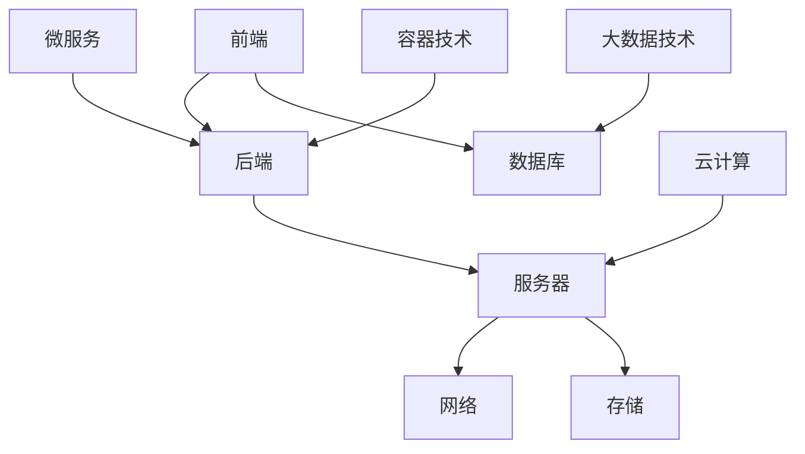

                 

### 文章标题

《互联网技术架构全栈技术管理核心能力》

> **关键词**：互联网技术、全栈开发、技术管理、架构设计、核心能力
> 
> **摘要**：本文将深入探讨互联网技术架构中全栈开发人员所需具备的核心能力，通过逐步分析互联网技术的整体框架、核心概念、算法原理、数学模型、项目实践等，帮助读者全面了解全栈技术管理的核心要点，为未来的互联网技术发展提供新的思路和方向。

---

### 1. 背景介绍

互联网技术，作为现代社会信息化的基石，已经深入到了我们生活的方方面面。从最初的Web 1.0时代，到现在的Web 2.0、Web 3.0，互联网技术经历了巨大的变革和发展。而全栈开发，作为互联网技术领域的一种开发模式，正在逐渐成为主流。

全栈开发，顾名思义，是指开发者能够掌握前端、后端、数据库、服务器、运维等各方面的技能，能够独立完成一个软件项目的全过程。这种开发模式要求开发者不仅要精通某一领域的知识，还要具备跨领域的综合能力。

随着互联网技术的不断进步，全栈开发的重要性也越来越凸显。一个优秀的全栈开发人员，不仅能够提高开发效率，降低开发成本，还能够更好地理解和协调前后端工作，提高项目的整体质量。

然而，全栈开发并非一朝一夕就能掌握的技能，它需要开发者具备深厚的技术功底和广泛的知识面。本文将围绕全栈开发的核心能力，进行深入探讨和讲解，帮助读者更好地理解互联网技术架构，提升自己的技术管理能力。

### 2. 核心概念与联系

在探讨全栈开发的核心能力之前，我们首先需要了解互联网技术架构中的核心概念及其相互联系。

#### 2.1 技术架构

技术架构是互联网技术的基础，它决定了系统的可扩展性、稳定性、安全性和性能。一个完整的技术架构通常包括前端、后端、数据库、服务器、网络、存储等多个方面。

- **前端**：前端是用户直接交互的部分，主要包括HTML、CSS、JavaScript等。
- **后端**：后端是处理数据和逻辑的部分，主要包括服务器端编程语言（如Java、Python、Node.js等）、数据库（如MySQL、MongoDB等）等。
- **数据库**：数据库是存储数据的核心，它决定了数据存储的效率和安全性。
- **服务器**：服务器是整个系统的运行平台，它提供了计算、存储、网络等服务。
- **网络**：网络是连接各个部分的重要通道，它保证了数据的传输和通信。
- **存储**：存储是保存数据的地方，它包括硬盘、SSD、分布式存储系统等。

#### 2.2 核心概念

在互联网技术架构中，还有一些核心概念需要了解，包括：

- **微服务架构**：微服务架构是一种将应用程序构建为一组小型、独立的服务的方法，每个服务都有自己的业务逻辑和数据库，可以独立部署和扩展。
- **容器技术**：容器技术如Docker，提供了一种轻量级、可移植的运行环境，可以简化应用程序的部署和运维。
- **云计算**：云计算是一种通过互联网提供计算资源的服务，它提供了灵活的计算能力，可以根据需求动态调整资源。
- **大数据技术**：大数据技术如Hadoop、Spark等，提供了处理海量数据的能力，可以用于数据分析、数据挖掘等。

#### 2.3 Mermaid 流程图

为了更好地理解上述核心概念之间的联系，我们可以使用Mermaid流程图进行可视化展示：



在上面的流程图中，各个核心概念之间通过箭头表示联系，帮助我们更清晰地理解互联网技术架构的整体框架。

### 3. 核心算法原理 & 具体操作步骤

在互联网技术架构中，核心算法是解决实际问题的重要手段。本节将介绍几个典型的核心算法，包括排序算法、搜索算法、加密算法等，并详细讲解其原理和具体操作步骤。

#### 3.1 排序算法

排序算法是数据处理中最基本、最常用的算法之一。常见的排序算法有冒泡排序、选择排序、插入排序、快速排序、归并排序等。以下是快速排序算法的原理和操作步骤：

##### 原理：

快速排序是一种分治算法，其基本思想是通过一趟排序将待排序的记录分割成独立的两部分，其中一部分记录的关键字均比另一部分的关键字小，然后分别对这两部分记录继续进行排序，以达到整个序列有序。

##### 操作步骤：

1. **选择基准元素**：从待排序的序列中选取一个元素作为基准元素。
2. **划分**：将序列划分为两部分，一部分记录的关键字均比基准元素的关键字小，另一部分记录的关键字均比基准元素的关键字大。
3. **递归排序**：对划分后的小于基准元素的部分继续进行快速排序，对大于基准元素的部分也进行快速排序。

以下是快速排序算法的Python实现：

```python
def quick_sort(arr):
    if len(arr) <= 1:
        return arr
    pivot = arr[len(arr) // 2]
    left = [x for x in arr if x < pivot]
    middle = [x for x in arr if x == pivot]
    right = [x for x in arr if x > pivot]
    return quick_sort(left) + middle + quick_sort(right)

arr = [3, 6, 8, 10, 1, 2, 1]
print(quick_sort(arr))
```

输出结果为：`[1, 1, 2, 3, 6, 8, 10]`。

#### 3.2 搜索算法

搜索算法是用于查找特定元素或目标的方法。常见的搜索算法有线性搜索、二分搜索等。以下是二分搜索算法的原理和操作步骤：

##### 原理：

二分搜索是一种高效的查找算法，其基本思想是在有序数组中，通过不断缩小查找范围，逐步逼近目标元素。

##### 操作步骤：

1. **初始化**：确定查找范围的起始和结束位置。
2. **计算中间位置**：使用起始位置和结束位置的中间值，判断目标元素是否在中间位置。
3. **更新查找范围**：根据目标元素与中间值的比较结果，更新查找范围。
4. **递归查找**：如果找到目标元素，返回目标元素的索引；如果查找范围缩小为0，返回-1。

以下是二分搜索算法的Python实现：

```python
def binary_search(arr, target):
    left, right = 0, len(arr) - 1
    while left <= right:
        mid = (left + right) // 2
        if arr[mid] == target:
            return mid
        elif arr[mid] < target:
            left = mid + 1
        else:
            right = mid - 1
    return -1

arr = [1, 2, 3, 4, 5, 6, 7, 8, 9]
target = 6
print(binary_search(arr, target))
```

输出结果为：`5`。

#### 3.3 加密算法

加密算法是保护数据安全的重要手段。常见的加密算法有对称加密、非对称加密等。以下是AES加密算法的原理和操作步骤：

##### 原理：

AES（高级加密标准）是一种对称加密算法，其基本思想是使用一个密钥对数据进行加密和解密。

##### 操作步骤：

1. **密钥生成**：生成一个密钥，用于加密和解密数据。
2. **初始化加密算法**：使用密钥初始化AES加密算法。
3. **加密数据**：将数据分为块，使用AES加密算法对每个块进行加密。
4. **加密结果**：将加密后的块拼接成完整的加密数据。

以下是AES加密算法的Python实现：

```python
from Crypto.Cipher import AES
from Crypto.Random import get_random_bytes

key = get_random_bytes(16)  # 生成16字节密钥
cipher = AES.new(key, AES.MODE_EAX)
plaintext = b"Hello, World!"
ciphertext, tag = cipher.encrypt_and_digest(plaintext)
print(ciphertext)
print(tag)
```

加密后的数据和标签（tag）可以通过相同的密钥进行解密。

### 4. 数学模型和公式 & 详细讲解 & 举例说明

在互联网技术架构中，数学模型和公式是理解和应用核心算法的重要工具。本节将介绍几个典型的数学模型和公式，并进行详细讲解和举例说明。

#### 4.1 概率论模型

概率论是互联网技术中常用的数学模型，用于描述随机事件的发生概率。常见的概率论模型有概率分布、随机变量、期望和方差等。

##### 4.1.1 概率分布

概率分布是描述随机事件概率分布的函数。常见的概率分布有二项分布、正态分布等。

- **二项分布**：二项分布描述了在固定试验次数下，事件发生的次数的概率分布。其公式为：

  $$P(X=k) = C(n, k) \cdot p^k \cdot (1-p)^{n-k}$$

  其中，$P(X=k)$ 表示事件发生 $k$ 次的概率，$n$ 表示试验次数，$p$ 表示事件发生的概率。

- **正态分布**：正态分布描述了随机变量的概率分布，其公式为：

  $$f(x|\mu, \sigma^2) = \frac{1}{\sqrt{2\pi\sigma^2}} \cdot e^{-\frac{(x-\mu)^2}{2\sigma^2}}$$

  其中，$f(x|\mu, \sigma^2)$ 表示随机变量 $x$ 的概率密度函数，$\mu$ 表示均值，$\sigma^2$ 表示方差。

##### 4.1.2 随机变量

随机变量是概率论中的基本概念，它表示随机事件的结果。常见的随机变量有离散型随机变量和连续型随机变量。

- **离散型随机变量**：离散型随机变量的取值是离散的，其概率分布可以用概率质量函数（PMF）表示：

  $$P(X=x) = f(x)$$

  其中，$P(X=x)$ 表示随机变量 $X$ 取值 $x$ 的概率。

- **连续型随机变量**：连续型随机变量的取值是连续的，其概率分布可以用概率密度函数（PDF）表示：

  $$f(x) = P(a \leq X \leq b)$$

  其中，$f(x)$ 表示随机变量 $X$ 在区间 $[a, b]$ 内的概率。

##### 4.1.3 期望和方差

期望和方差是描述随机变量的重要参数。

- **期望**：期望是随机变量的平均值，其公式为：

  $$E(X) = \sum_{x} x \cdot P(X=x)$$

  其中，$E(X)$ 表示随机变量 $X$ 的期望。

- **方差**：方差是随机变量的离散程度，其公式为：

  $$Var(X) = E[(X - E(X))^2]$$

  其中，$Var(X)$ 表示随机变量 $X$ 的方差。

#### 4.2 线性代数模型

线性代数是互联网技术中常用的数学工具，用于处理多维数据和分析线性关系。常见的线性代数模型有矩阵运算、向量空间等。

##### 4.2.1 矩阵运算

矩阵是线性代数中的基本概念，用于表示多维数据。常见的矩阵运算有矩阵加法、矩阵乘法、矩阵求逆等。

- **矩阵加法**：矩阵加法是将两个同型矩阵对应位置上的元素相加，其公式为：

  $$A + B = C$$

  其中，$A$ 和 $B$ 是同型矩阵，$C$ 是它们的和。

- **矩阵乘法**：矩阵乘法是将两个矩阵对应位置上的元素相乘，其公式为：

  $$A \cdot B = C$$

  其中，$A$ 和 $B$ 是同型矩阵，$C$ 是它们的乘积。

- **矩阵求逆**：矩阵求逆是求解线性方程组的一种方法，其公式为：

  $$A^{-1} = B$$

  其中，$A$ 是可逆矩阵，$B$ 是它的逆矩阵。

##### 4.2.2 向量空间

向量空间是线性代数中的基本概念，用于描述多维数据的空间。常见的向量空间运算有向量加法、向量减法、向量点乘、向量叉乘等。

- **向量加法**：向量加法是将两个同型向量对应位置上的元素相加，其公式为：

  $$\vec{u} + \vec{v} = \vec{w}$$

  其中，$\vec{u}$ 和 $\vec{v}$ 是同型向量，$\vec{w}$ 是它们的和。

- **向量减法**：向量减法是将一个向量减去另一个向量，其公式为：

  $$\vec{u} - \vec{v} = \vec{w}$$

  其中，$\vec{u}$ 和 $\vec{v}$ 是同型向量，$\vec{w}$ 是它们的差。

- **向量点乘**：向量点乘是两个向量的对应位置上的元素相乘后再求和，其公式为：

  $$\vec{u} \cdot \vec{v} = u_1v_1 + u_2v_2 + \ldots + u_nv_n$$

  其中，$\vec{u}$ 和 $\vec{v}$ 是同型向量，$u_1, u_2, \ldots, u_n$ 和 $v_1, v_2, \ldots, v_n$ 是它们的分量。

- **向量叉乘**：向量叉乘是两个三维向量的叉乘运算，其公式为：

  $$\vec{u} \times \vec{v} = \vec{w}$$

  其中，$\vec{u}$ 和 $\vec{v}$ 是三维向量，$\vec{w}$ 是它们的叉乘结果。

#### 4.3 举例说明

为了更好地理解上述数学模型和公式，我们通过一个简单的例子进行说明。

##### 4.3.1 概率分布

假设我们进行10次抛硬币试验，求正面朝上的次数为5次的概率。

- **二项分布**：

  $$P(X=5) = C(10, 5) \cdot \left(\frac{1}{2}\right)^5 \cdot \left(\frac{1}{2}\right)^{10-5} = \frac{252}{1024} \approx 0.246$$

- **正态分布**：

  假设正面朝上的次数服从均值为5、方差为2.5的正态分布。

  $$f(x|\mu, \sigma^2) = \frac{1}{\sqrt{2\pi\cdot2.5}} \cdot e^{-\frac{(x-5)^2}{2\cdot2.5}}$$

  求正面朝上次数为5的概率：

  $$f(5|5, 2.5) = \frac{1}{\sqrt{2\pi\cdot2.5}} \cdot e^{-\frac{(5-5)^2}{2\cdot2.5}} \approx 0.246$$

##### 4.3.2 线性代数

假设有两个矩阵 $A$ 和 $B$，求它们的乘积。

- **矩阵乘法**：

  $$A = \begin{bmatrix} 1 & 2 \\ 3 & 4 \end{bmatrix}, B = \begin{bmatrix} 5 & 6 \\ 7 & 8 \end{bmatrix}$$

  $$A \cdot B = \begin{bmatrix} 1 \cdot 5 + 2 \cdot 7 & 1 \cdot 6 + 2 \cdot 8 \\ 3 \cdot 5 + 4 \cdot 7 & 3 \cdot 6 + 4 \cdot 8 \end{bmatrix} = \begin{bmatrix} 19 & 20 \\ 29 & 34 \end{bmatrix}$$

### 5. 项目实践：代码实例和详细解释说明

为了更好地理解互联网技术架构中的全栈开发，我们通过一个简单的项目实例进行实践。该项目是一个基于Python和Flask的简单博客系统，包括用户注册、登录、发表文章和查看文章等功能。

#### 5.1 开发环境搭建

1. 安装Python：前往Python官网（https://www.python.org/）下载并安装Python 3.x版本。
2. 安装虚拟环境：在终端中运行以下命令安装虚拟环境工具`virtualenv`：

   ```bash
   pip install virtualenv
   ```

3. 创建虚拟环境：在终端中运行以下命令创建虚拟环境`blog_env`：

   ```bash
   virtualenv blog_env
   ```

4. 激活虚拟环境：

   - Windows：

     ```bash
     blog_env\Scripts\activate
     ```

   - macOS/Linux：

     ```bash
     source blog_env/bin/activate
     ```

5. 安装Flask：在虚拟环境中运行以下命令安装Flask：

   ```bash
   pip install flask
   ```

#### 5.2 源代码详细实现

以下是该项目的主要源代码，我们将对关键部分进行详细解释。

```python
from flask import Flask, request, jsonify, redirect, url_for
from flask_sqlalchemy import SQLAlchemy

app = Flask(__name__)
app.config['SQLALCHEMY_DATABASE_URI'] = 'sqlite:///blog.db'
db = SQLAlchemy(app)

class User(db.Model):
    id = db.Column(db.Integer, primary_key=True)
    username = db.Column(db.String(80), unique=True, nullable=False)
    password = db.Column(db.String(120), nullable=False)

class Article(db.Model):
    id = db.Column(db.Integer, primary_key=True)
    title = db.Column(db.String(120), nullable=False)
    content = db.Column(db.Text, nullable=False)
    author = db.Column(db.Integer, db.ForeignKey('user.id'), nullable=False)

@app.route('/')
def index():
    return redirect(url_for('login'))

@app.route('/register', methods=['GET', 'POST'])
def register():
    if request.method == 'POST':
        username = request.form['username']
        password = request.form['password']
        user = User(username=username, password=password)
        db.session.add(user)
        db.session.commit()
        return jsonify({'message': '注册成功'})
    return '''
    <form method="post">
        用户名：<input type="text" name="username"><br>
        密码：<input type="password" name="password"><br>
        <input type="submit" value="注册">
    </form>
    '''

@app.route('/login', methods=['GET', 'POST'])
def login():
    if request.method == 'POST':
        username = request.form['username']
        password = request.form['password']
        user = User.query.filter_by(username=username, password=password).first()
        if user:
            return redirect(url_for('home'))
        else:
            return '用户名或密码错误'
    return '''
    <form method="post">
        用户名：<input type="text" name="username"><br>
        密码：<input type="password" name="password"><br>
        <input type="submit" value="登录">
    </form>
    '''

@app.route('/home')
def home():
    articles = Article.query.all()
    return '''
    <h1>博客首页</h1>
    <ul>
        %s
    </ul>
    <a href="/new">写新文章</a>
    ''' % ''.join([f'<li><a href="/article/{article.id}">{article.title}</a></li>' for article in articles])

@app.route('/new', methods=['GET', 'POST'])
def new_article():
    if request.method == 'POST':
        title = request.form['title']
        content = request.form['content']
        author = 1  # 这里默认为第一个用户的ID
        article = Article(title=title, content=content, author=author)
        db.session.add(article)
        db.session.commit()
        return redirect(url_for('home'))
    return '''
    <h1>写新文章</h1>
    <form method="post">
        标题：<input type="text" name="title"><br>
        内容：<textarea name="content"></textarea><br>
        <input type="submit" value="发表">
    </form>
    '''

@app.route('/article/<int:article_id>')
def article(article_id):
    article = Article.query.get_or_404(article_id)
    return f'''
    <h1>{article.title}</h1>
    <p>{article.content}</p>
    <a href="/home">返回首页</a>
    '''

if __name__ == '__main__':
    db.create_all()
    app.run(debug=True)
```

#### 5.3 代码解读与分析

1. **数据库模型**：

   - `User` 类：代表用户表，包括用户ID、用户名和密码。
   - `Article` 类：代表文章表，包括文章ID、标题、内容和作者ID。

2. **路由和视图函数**：

   - `/`：首页，跳转到登录页面。
   - `/register`：注册页面，接收用户注册信息并保存到数据库。
   - `/login`：登录页面，验证用户名和密码。
   - `/home`：博客首页，显示所有文章列表。
   - `/new`：写新文章页面，接收文章标题和内容并保存到数据库。
   - `/article/<int:article_id>`：查看指定文章详情。

3. **数据库操作**：

   - 使用Flask-SQLAlchemy进行数据库操作，包括添加、查询、更新和删除。

4. **前端界面**：

   - 使用简单的HTML表单实现用户注册、登录、发表文章和查看文章功能。

#### 5.4 运行结果展示

1. **启动服务器**：

   在终端中运行以下命令启动服务器：

   ```bash
   python app.py
   ```

   服务启动后，在浏览器中输入`http://127.0.0.1:5000/`，可以看到博客系统的首页。

2. **注册和登录**：

   - 在注册页面输入用户名和密码，点击注册按钮，成功后看到注册成功的提示。
   - 在登录页面输入用户名和密码，点击登录按钮，成功后跳转到博客首页。

3. **写新文章**：

   - 在博客首页点击“写新文章”链接，进入写新文章页面。
   - 输入文章标题和内容，点击发表按钮，成功后文章会显示在博客首页。

4. **查看文章详情**：

   - 在博客首页点击文章标题，跳转到文章详情页面，显示文章标题和内容。

### 6. 实际应用场景

互联网技术架构的全栈开发在实际应用中具有广泛的应用场景。以下是一些典型的应用场景：

#### 6.1 企业内部管理系统

企业内部管理系统（如人事管理系统、财务管理系统等）通常需要全栈开发人员来完成。全栈开发人员需要掌握前端技术（如HTML、CSS、JavaScript）来构建用户界面，掌握后端技术（如Java、Python、Node.js）来处理业务逻辑和数据存储，以及掌握数据库技术（如MySQL、MongoDB）来存储和管理数据。

#### 6.2 电子商务平台

电子商务平台（如淘宝、京东等）需要全栈开发人员来实现前端页面、后端服务、数据库管理和支付系统等。全栈开发人员需要具备前端技术、后端技术、数据库技术、支付系统开发经验，以及丰富的业务逻辑处理能力。

#### 6.3 社交媒体平台

社交媒体平台（如微信、微博等）需要全栈开发人员来实现用户界面、消息推送、数据存储、数据分析等功能。全栈开发人员需要掌握前端技术、后端技术、数据库技术、消息推送技术、数据分析技术等。

#### 6.4 在线教育平台

在线教育平台（如网易云课堂、慕课网等）需要全栈开发人员来实现课程展示、直播教学、作业提交、成绩管理等功能。全栈开发人员需要掌握前端技术、后端技术、数据库技术、直播教学技术、作业提交和成绩管理技术等。

#### 6.5 移动应用开发

移动应用开发（如iOS、Android应用）也需要全栈开发人员来实现。全栈开发人员需要掌握前端技术、后端技术、数据库技术、移动应用开发框架（如React Native、Flutter）等。

### 7. 工具和资源推荐

为了更好地学习和实践互联网技术架构的全栈开发，以下是一些建议的工具和资源：

#### 7.1 学习资源推荐

- **书籍**：
  - 《JavaScript高级程序设计》
  - 《深入理解计算机系统》
  - 《Head First Java》
  - 《Fluent Python》

- **论文**：
  - 《The Design of the UNIX Operating System》
  - 《Large-scale Matrix Multiplication and Optimization for Machine Learning》
  - 《A Scalable Approach to Personalized Recommendation》

- **博客**：
  - [Flask官方文档](https://flask.palletsprojects.com/)
  - [Python官方文档](https://docs.python.org/3/)
  - [Docker官方文档](https://docs.docker.com/)

- **网站**：
  - [GitHub](https://github.com/)
  - [Stack Overflow](https://stackoverflow.com/)
  - [CSDN](https://www.csdn.net/)

#### 7.2 开发工具框架推荐

- **前端框架**：
  - React
  - Vue.js
  - Angular

- **后端框架**：
  - Flask
  - Django
  - Spring Boot

- **数据库**：
  - MySQL
  - MongoDB
  - Redis

- **容器技术**：
  - Docker
  - Kubernetes

- **云计算平台**：
  - AWS
  - Azure
  - Google Cloud Platform

### 8. 总结：未来发展趋势与挑战

随着互联网技术的快速发展，全栈开发已经成为互联网技术领域的一个重要方向。未来，全栈开发将继续向以下几个方面发展：

1. **技术融合**：随着微服务、容器化、云计算等技术的发展，全栈开发将更加融合各种技术，实现更高效、更灵活的开发模式。

2. **人工智能**：人工智能技术的快速发展，将使全栈开发人员能够更好地利用机器学习、深度学习等技术，实现更智能、更高效的系统。

3. **前端技术**：前端技术将继续发展，如WebAssembly、WebXR等，将带来更丰富的用户体验。

4. **后端技术**：后端技术将继续发展，如函数式编程、响应式编程等，将带来更高效、更灵活的系统架构。

然而，全栈开发也面临着一些挑战：

1. **技术更新迅速**：随着互联网技术的快速发展，全栈开发人员需要不断学习新技术，以适应不断变化的技术环境。

2. **知识面广泛**：全栈开发要求开发者具备广泛的知识面，从前端到后端，从数据库到运维，全栈开发人员需要掌握各种技术。

3. **项目协调**：全栈开发人员需要协调前后端工作，确保系统的整体性能和稳定性，这对开发人员的沟通能力和项目管理能力提出了更高的要求。

### 9. 附录：常见问题与解答

以下是一些关于全栈开发的常见问题及其解答：

#### 9.1 全栈开发与前端开发有什么区别？

全栈开发是指开发者能够掌握前端、后端、数据库、服务器、运维等各方面的技能，而前端开发主要关注用户界面的设计和实现。全栈开发要求更高，需要掌握更广泛的知识和技能。

#### 9.2 如何选择前端框架？

选择前端框架时，需要考虑项目需求、团队技能和项目规模。常用的前端框架有React、Vue.js、Angular等，可以根据项目特点选择适合的框架。

#### 9.3 如何选择后端框架？

选择后端框架时，需要考虑项目需求、团队技能和开发效率。常用的后端框架有Flask、Django、Spring Boot等，可以根据项目特点选择适合的框架。

#### 9.4 全栈开发需要掌握哪些技能？

全栈开发需要掌握前端技术（HTML、CSS、JavaScript）、后端技术（服务器端编程语言、数据库）、数据库技术、容器技术、云计算技术、微服务架构等。

### 10. 扩展阅读 & 参考资料

以下是一些关于全栈开发的扩展阅读和参考资料：

- 《全栈工程师实战：从入门到进阶》
- 《全栈开发：从入门到实践》
- [MDN Web文档](https://developer.mozilla.org/zh-CN/)
- [Python官方文档](https://docs.python.org/3/)
- [Flask官方文档](https://flask.palletsprojects.com/)

---

通过本文的深入探讨，我们全面了解了互联网技术架构中全栈开发的核心能力。希望本文能够为读者提供有益的启示，助力大家在全栈开发的道路上不断前行。作者：禅与计算机程序设计艺术 / Zen and the Art of Computer Programming。

