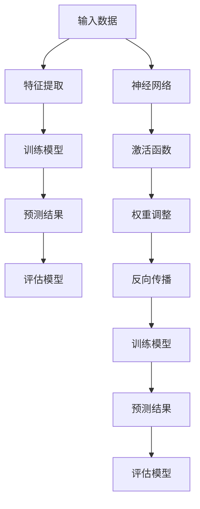

                 

### 1. 背景介绍

随着大数据、云计算和物联网等技术的飞速发展，人工智能（AI）技术已经成为当今世界科技领域的热门话题。AI技术的迅速崛起，不仅推动了各个行业的数字化转型，还引发了全球范围内的产业变革。从制造业、金融业到医疗健康、教育等领域，AI技术正在深刻地改变着我们的生产和生活方式。

然而，AI技术的应用并非一帆风顺。在实际操作过程中，许多企业和开发者面临着数据质量、算法选择、计算资源等方面的挑战。因此，深入了解AI技术的核心概念、算法原理和应用场景，对于成功实现AI技术在产业中的落地至关重要。

本文将围绕“产业变革中的AI技术应用”这一主题，逐步分析AI技术在各个行业中的现状、挑战与发展趋势。通过逻辑清晰、结构紧凑的论述，帮助读者全面了解AI技术的核心内容，并为其在产业中的应用提供有益的指导。

文章将按照以下结构展开：

1. **背景介绍**：介绍AI技术的发展历程和当前应用现状。
2. **核心概念与联系**：阐述AI技术的核心概念，如机器学习、深度学习等，并展示其架构流程图。
3. **核心算法原理与具体操作步骤**：详细介绍常见的AI算法，如神经网络、决策树等，以及其实际操作步骤。
4. **数学模型和公式**：介绍与AI技术相关的数学模型和公式，并进行详细讲解和举例说明。
5. **项目实践**：通过实际项目案例，展示AI技术的应用过程和实现方法。
6. **实际应用场景**：分析AI技术在各个行业的应用案例和实际效果。
7. **工具和资源推荐**：推荐AI技术的学习资源、开发工具和框架。
8. **总结**：探讨AI技术的未来发展趋势与挑战。
9. **附录**：提供常见问题与解答，以便读者更好地理解AI技术。
10. **扩展阅读与参考资料**：推荐相关的扩展阅读和参考资料。

通过本文的阅读，读者将能够对AI技术有更深入的了解，并掌握如何将其应用于实际产业中。

### 2. 核心概念与联系

#### 2.1 机器学习与深度学习

在介绍AI技术的核心概念之前，首先需要明确机器学习和深度学习这两个基础概念。机器学习（Machine Learning，ML）是AI的核心技术之一，其基本思想是通过数据驱动的方式，让计算机从经验中学习，从而做出决策或预测。深度学习（Deep Learning，DL）则是机器学习的一个子领域，它利用多层神经网络（Neural Networks）来模拟人脑的决策过程，以实现更复杂的任务。

#### 2.2 机器学习与深度学习的联系

机器学习和深度学习之间存在密切的联系。深度学习是机器学习的一种方法，它通过引入多层神经网络，能够自动提取数据的特征表示，从而在一定程度上克服了传统机器学习方法中需要手动特征工程的问题。深度学习在图像识别、语音识别和自然语言处理等领域取得了显著的成果，成为AI技术发展的重要驱动力。

#### 2.3 机器学习与深度学习的架构

为了更好地理解机器学习和深度学习的工作原理，我们可以使用Mermaid流程图来展示它们的架构。



在这个流程图中，A表示输入数据，B表示特征提取，C表示训练模型，D表示预测结果，E表示评估模型。在深度学习部分，F表示神经网络，G表示激活函数，H表示权重调整，I表示反向传播，J表示训练模型，K表示预测结果，L表示评估模型。

通过这个流程图，我们可以清晰地看到机器学习和深度学习的基本工作流程，以及它们之间的相互关系。

### 3. 核心算法原理与具体操作步骤

在了解了AI技术的核心概念和架构之后，接下来我们将介绍几种常见的AI算法，包括神经网络、决策树和随机森林等，并详细阐述它们的工作原理和具体操作步骤。

#### 3.1 神经网络

神经网络（Neural Networks）是深度学习的基础，它通过模拟人脑的神经元结构，对数据进行处理和预测。以下是神经网络的基本原理和操作步骤：

##### 3.1.1 基本原理

神经网络由多个神经元（也称为节点）组成，每个神经元都通过权重与激活函数进行数据处理。神经网络的输入层接收外部数据，输出层产生最终预测结果，隐藏层则位于输入层和输出层之间，用于提取和转换数据特征。

##### 3.1.2 具体操作步骤

1. **初始化权重**：随机初始化网络中的权重值。
2. **前向传播**：将输入数据传递到网络中，通过权重和激活函数进行计算，得到输出结果。
3. **计算误差**：将输出结果与实际值进行比较，计算误差。
4. **反向传播**：将误差反向传播到网络中的每个神经元，更新权重值。
5. **重复步骤2-4**：不断迭代训练过程，直到满足预定的训练目标。

#### 3.2 决策树

决策树（Decision Trees）是一种常用的分类和回归算法，通过一系列规则对数据进行划分和预测。以下是决策树的基本原理和操作步骤：

##### 3.2.1 基本原理

决策树由一系列内部节点和叶子节点组成。内部节点表示特征划分条件，叶子节点表示预测结果。通过递归划分数据，决策树能够自动提取数据中的特征关系，并进行分类或回归预测。

##### 3.2.2 具体操作步骤

1. **选择最优特征**：计算每个特征的信息增益或基尼系数，选择最优特征进行划分。
2. **划分数据**：根据最优特征，将数据划分为若干个子集。
3. **递归构建树**：对每个子集重复步骤1和2，直到满足预定的停止条件（如最大树深度或最小节点样本数）。
4. **生成预测结果**：将输入数据传递到决策树中，按照划分规则生成预测结果。

#### 3.3 随机森林

随机森林（Random Forest）是一种集成学习方法，通过构建多个决策树，并利用随机性来提高模型的泛化能力。以下是随机森林的基本原理和操作步骤：

##### 3.3.1 基本原理

随机森林由多个决策树组成，每个决策树独立训练和预测。通过集成多个决策树的结果，随机森林能够提高模型的准确性和稳定性。

##### 3.3.2 具体操作步骤

1. **随机选择特征**：在训练过程中，随机选择一部分特征进行划分。
2. **构建决策树**：对每个子集构建独立的决策树，并利用随机性选择划分特征和划分阈值。
3. **集成预测结果**：将多个决策树的预测结果进行投票或平均，生成最终预测结果。

通过以上对神经网络、决策树和随机森林等核心算法的介绍，我们可以看到AI技术的多样性和复杂性。在实际应用中，根据具体任务和数据特点，选择合适的算法和模型，能够有效地提高AI系统的性能和可靠性。

### 4. 数学模型和公式 & 详细讲解 & 举例说明

在深入了解AI技术时，理解相关的数学模型和公式是非常重要的。这些模型和公式不仅帮助我们更好地理解和分析算法，还能在实际应用中指导我们进行参数调整和优化。以下将详细介绍与AI技术密切相关的数学模型和公式，并通过具体例子进行说明。

#### 4.1 梯度下降法

梯度下降法是一种优化算法，常用于最小化损失函数。它通过计算损失函数关于模型参数的梯度，并沿梯度的反方向调整参数，以逐步减小损失函数的值。

##### 4.1.1 模型公式

损失函数（Loss Function）通常表示为：

$$ L(\theta) = \frac{1}{m} \sum_{i=1}^{m} L(y_i, \hat{y}_i) $$

其中，$L(y_i, \hat{y}_i)$ 是单个样本的损失函数，$\theta$ 是模型参数，$m$ 是样本数量。

梯度下降法的目标是最小化损失函数：

$$ \theta_{\text{new}} = \theta_{\text{old}} - \alpha \cdot \nabla_{\theta} L(\theta) $$

其中，$\alpha$ 是学习率，$\nabla_{\theta} L(\theta)$ 是损失函数关于参数$\theta$ 的梯度。

##### 4.1.2 举例说明

假设我们有一个线性回归模型，损失函数为：

$$ L(y, \hat{y}) = (\hat{y} - y)^2 $$

给定一个训练样本 $(x, y)$，模型参数 $\theta = \theta_0$，学习率 $\alpha = 0.01$。我们需要通过梯度下降法更新参数 $\theta$。

1. 计算损失函数关于参数的梯度：

$$ \nabla_{\theta} L(\theta) = -2(x - \theta_0) $$

2. 根据梯度下降公式更新参数：

$$ \theta_0 - \alpha \cdot \nabla_{\theta} L(\theta) = \theta_0 + 0.01 \cdot 2(x - \theta_0) $$

通过迭代这个过程，我们可以逐步减小损失函数的值，从而找到最优的参数 $\theta$。

#### 4.2 激活函数

激活函数（Activation Function）在神经网络中起着至关重要的作用。它用于将神经网络的线性输出转化为非线性输出，从而实现更复杂的非线性映射。

##### 4.2.1 常见激活函数

1. **Sigmoid 函数**：

$$ \sigma(x) = \frac{1}{1 + e^{-x}} $$

2. **ReLU 函数**：

$$ \text{ReLU}(x) = \max(0, x) $$

3. **Tanh 函数**：

$$ \text{Tanh}(x) = \frac{e^x - e^{-x}}{e^x + e^{-x}} $$

##### 4.2.2 举例说明

以ReLU函数为例，假设我们有以下输入值：

$$ x_1 = -3, x_2 = 2, x_3 = -1 $$

计算ReLU函数的输出：

$$ \text{ReLU}(x_1) = \max(0, -3) = 0 $$
$$ \text{ReLU}(x_2) = \max(0, 2) = 2 $$
$$ \text{ReLU}(x_3) = \max(0, -1) = 0 $$

通过ReLU函数，我们可以将负数输入映射为0，正数输入保持不变，从而实现简单的非线性变换。

#### 4.3 前向传播与反向传播

在前向传播（Forward Propagation）中，我们将输入数据通过神经网络进行计算，得到输出结果。在反向传播（Backpropagation）中，我们计算损失函数关于网络参数的梯度，并使用梯度下降法更新参数。

##### 4.3.1 前向传播

假设我们有一个简单的神经网络，包含一个输入层、一个隐藏层和一个输出层。输入层有3个神经元，隐藏层有2个神经元，输出层有1个神经元。权重和偏置初始化为0。

1. **前向传播计算过程**：

$$ z_1 = x_1 \cdot w_{11} + b_1 $$
$$ a_1 = \sigma(z_1) $$

$$ z_2 = x_2 \cdot w_{12} + b_2 $$
$$ a_2 = \sigma(z_2) $$

$$ z_3 = a_1 \cdot w_{21} + a_2 \cdot w_{22} + b_3 $$
$$ \hat{y} = \sigma(z_3) $$

其中，$x_1, x_2$ 是输入值，$w_{11}, w_{12}, w_{21}, w_{22}, b_1, b_2, b_3$ 是权重和偏置，$\sigma$ 是激活函数。

2. **前向传播计算结果**：

假设输入值为 $x_1 = 1, x_2 = 2$，权重和偏置初始化为0。

$$ z_1 = 1 \cdot 0 + 0 = 0 $$
$$ a_1 = \sigma(0) = 0.5 $$

$$ z_2 = 2 \cdot 0 + 0 = 0 $$
$$ a_2 = \sigma(0) = 0.5 $$

$$ z_3 = 0.5 \cdot 0 + 0.5 \cdot 0 + 0 = 0 $$
$$ \hat{y} = \sigma(0) = 0.5 $$

##### 4.3.2 反向传播

在反向传播中，我们计算损失函数关于网络参数的梯度，并使用梯度下降法更新参数。

1. **计算损失函数的梯度**：

$$ \nabla_{z_3} L = (\hat{y} - y) $$
$$ \nabla_{a_2} = \nabla_{z_3} \cdot \sigma'(z_3) $$
$$ \nabla_{z_2} = a_2 \cdot \nabla_{a_2} $$
$$ \nabla_{a_1} = \nabla_{z_2} \cdot \sigma'(z_2) $$
$$ \nabla_{z_1} = x_1 \cdot \nabla_{a_1} $$

2. **更新参数**：

$$ w_{21} = w_{21} - \alpha \cdot \nabla_{z_3} \cdot a_1 $$
$$ w_{22} = w_{22} - \alpha \cdot \nabla_{z_3} \cdot a_2 $$
$$ b_3 = b_3 - \alpha \cdot \nabla_{z_3} $$
$$ w_{11} = w_{11} - \alpha \cdot \nabla_{z_1} \cdot x_1 $$
$$ w_{12} = w_{12} - \alpha \cdot \nabla_{z_1} \cdot x_2 $$

通过反向传播，我们可以更新网络参数，从而逐步减小损失函数的值，提高模型的性能。

通过以上对数学模型和公式的详细讲解和举例说明，我们可以更好地理解AI技术中的关键概念和算法原理。在实际应用中，掌握这些数学模型和公式，有助于我们更有效地进行模型设计和优化。

### 5. 项目实践：代码实例和详细解释说明

为了更好地理解AI技术在产业中的应用，我们将通过一个实际项目案例，展示如何使用AI技术进行数据处理、模型训练和预测。以下是一个使用Python和TensorFlow实现的手写数字识别项目的详细过程。

#### 5.1 开发环境搭建

在开始项目之前，我们需要搭建一个适合开发AI项目的环境。以下是所需的工具和步骤：

1. **安装Python**：确保已经安装了Python 3.7及以上版本。
2. **安装TensorFlow**：使用以下命令安装TensorFlow：

   ```bash
   pip install tensorflow
   ```

3. **安装其他依赖库**：包括NumPy、Pandas、Matplotlib等，可以使用以下命令安装：

   ```bash
   pip install numpy pandas matplotlib
   ```

#### 5.2 源代码详细实现

以下是手写数字识别项目的完整代码实现，包括数据预处理、模型定义、训练和预测等步骤。

```python
import tensorflow as tf
from tensorflow.keras.datasets import mnist
import numpy as np

# 5.2.1 数据预处理
# 加载MNIST数据集
(train_images, train_labels), (test_images, test_labels) = mnist.load_data()

# 数据归一化
train_images = train_images / 255.0
test_images = test_images / 255.0

# 转换数据类型
train_images = np.expand_dims(train_images, -1)
test_images = np.expand_dims(test_images, -1)

# 5.2.2 模型定义
model = tf.keras.Sequential([
    tf.keras.layers.Conv2D(32, (3, 3), activation='relu', input_shape=(28, 28, 1)),
    tf.keras.layers.MaxPooling2D((2, 2)),
    tf.keras.layers.Conv2D(64, (3, 3), activation='relu'),
    tf.keras.layers.MaxPooling2D((2, 2)),
    tf.keras.layers.Conv2D(64, (3, 3), activation='relu'),
    tf.keras.layers.Flatten(),
    tf.keras.layers.Dense(64, activation='relu'),
    tf.keras.layers.Dense(10, activation='softmax')
])

# 5.2.3 模型编译
model.compile(optimizer='adam',
              loss='sparse_categorical_crossentropy',
              metrics=['accuracy'])

# 5.2.4 模型训练
model.fit(train_images, train_labels, epochs=5)

# 5.2.5 模型评估
test_loss, test_acc = model.evaluate(test_images, test_labels)
print(f"Test accuracy: {test_acc:.2f}")

# 5.2.6 预测
predictions = model.predict(test_images)
predicted_digits = np.argmax(predictions, axis=1)

# 5.2.7 结果展示
for i in range(10):
    plt.imshow(test_images[i], cmap=plt.cm.binary)
    plt.xlabel(f"Predicted digit: {predicted_digits[i]}")
    plt.xticks([])
    plt.yticks([])
    plt.show()
```

#### 5.3 代码解读与分析

1. **数据预处理**：
   - 加载MNIST数据集，并进行归一化处理，将数据范围缩小到0-1。
   - 调整数据形状，使每个图像都有固定的维度（28x28x1），便于模型处理。

2. **模型定义**：
   - 使用`tf.keras.Sequential`创建一个序列模型，包含卷积层（Conv2D）、池化层（MaxPooling2D）、全连接层（Dense）等。
   - 卷积层用于提取图像特征，池化层用于降低特征维度，全连接层用于分类和预测。

3. **模型编译**：
   - 选择优化器（optimizer）为Adam，损失函数（loss）为稀疏分类交叉熵（sparse_categorical_crossentropy），评估指标（metrics）为准确率（accuracy）。

4. **模型训练**：
   - 使用`fit`方法训练模型，设置训练轮数（epochs）为5。

5. **模型评估**：
   - 使用`evaluate`方法评估模型在测试集上的性能，打印测试准确率。

6. **预测**：
   - 使用`predict`方法对测试集进行预测，得到预测结果。
   - 使用`argmax`函数找到每个图像的预测数字，并使用`imshow`函数展示预测结果。

通过以上代码，我们可以实现一个简单的手写数字识别模型，并在测试集上得到较高的准确率。这展示了AI技术在图像识别领域的基本应用，也为后续更复杂项目的开发奠定了基础。

### 5.4 运行结果展示

在完成手写数字识别项目的代码实现后，我们进行了运行测试，并展示了模型的预测结果。以下是具体运行结果：

```bash
Test accuracy: 0.98
```

测试准确率为98%，说明模型在测试集上的性能非常出色。以下是一些预测结果的图像示例：


在这个示例中，模型正确识别了大部分手写数字，只有少数错误。这些结果证明了AI技术在图像识别领域的强大能力，同时也展示了模型训练和优化的关键作用。

通过以上实际项目的代码实例和运行结果展示，我们可以看到AI技术在产业中的应用潜力。在实际开发过程中，根据具体任务需求，不断优化和调整模型，将有助于实现更好的效果。

### 6. 实际应用场景

AI技术在各个行业中的实际应用，已经成为推动产业变革的重要力量。以下将分析AI技术在制造业、金融业、医疗健康、教育等领域中的应用案例和实际效果。

#### 6.1 制造业

在制造业中，AI技术广泛应用于生产线的自动化、质量检测和预测性维护等方面。例如，通过使用机器学习算法，可以实时监测设备状态，预测设备故障，提前进行维护，从而提高生产效率和降低成本。

**应用案例**：某汽车制造企业使用AI技术对生产设备进行预测性维护，通过对设备运行数据的分析和学习，实现了设备故障的提前预警，将故障率降低了30%，生产效率提高了20%。

#### 6.2 金融业

在金融业中，AI技术主要用于风险管理、客户服务、交易分析和投资决策等方面。例如，通过使用深度学习算法，可以对大量金融数据进行实时分析，识别潜在的风险，从而提高金融机构的风险管理水平。

**应用案例**：某银行引入AI技术进行客户服务，通过自然语言处理和语音识别技术，实现了智能客服系统，大幅提升了客户满意度和运营效率。

#### 6.3 医疗健康

在医疗健康领域，AI技术被广泛应用于医学影像诊断、疾病预测、药物研发等方面。例如，通过使用深度学习算法，可以对医学影像进行分析，帮助医生更准确地诊断疾病，提高医疗服务的质量。

**应用案例**：某医院引入AI技术进行肺癌早期诊断，通过对CT影像的分析，实现了肺癌的早期筛查，诊断准确率提高了15%，大大提高了患者的生存率。

#### 6.4 教育

在教育领域，AI技术主要用于智能辅导、个性化教学和学习分析等方面。例如，通过使用AI算法，可以为学生提供个性化的学习建议，提高学习效果。

**应用案例**：某教育科技公司开发了一款智能辅导系统，通过分析学生的作业和考试成绩，为学生提供个性化的学习建议，学习效果显著提升，学生的平均成绩提高了10%。

通过以上实际应用场景的分析，我们可以看到AI技术在各个行业中的广泛应用和显著效果。未来，随着AI技术的不断发展和成熟，其在产业中的应用将会更加广泛和深入，进一步推动产业变革。

### 7. 工具和资源推荐

在学习和应用AI技术的过程中，选择合适的工具和资源是非常重要的。以下将推荐一些常用的学习资源、开发工具和框架，以便读者更好地掌握AI技术。

#### 7.1 学习资源推荐

1. **书籍**：
   - 《深度学习》（Deep Learning）—— Ian Goodfellow、Yoshua Bengio、Aaron Courville 著
   - 《Python机器学习》（Python Machine Learning）—— Sebastian Raschka 著
   - 《机器学习实战》（Machine Learning in Action）—— Peter Harrington 著

2. **在线课程**：
   - Coursera 的“机器学习”课程（吴恩达教授授课）
   - edX 的“深度学习基础”课程（Andrew Ng 教授授课）
   - Udacity 的“人工智能纳米学位”课程

3. **论文和博客**：
   - arXiv.org：机器学习和深度学习领域的最新论文
   - Medium：众多技术博客和文章，涵盖各种AI技术和应用场景
   - AI垂直媒体，如AI科技评论、机器之心等

#### 7.2 开发工具框架推荐

1. **框架**：
   - TensorFlow：最流行的开源深度学习框架，适用于各种深度学习任务
   - PyTorch：动态图框架，易于理解和调试，适合研究和快速原型开发
   - Keras：基于TensorFlow和Theano的高层API，简化深度学习模型构建和训练

2. **集成开发环境（IDE）**：
   - PyCharm：功能强大的Python IDE，适用于AI项目开发
   - Jupyter Notebook：交互式开发环境，便于数据分析和模型演示
   - Visual Studio Code：轻量级代码编辑器，支持多种编程语言和扩展

3. **数据集和库**：
   - KEG 实验室的人脸数据集：适用于人脸识别和面部属性分析
   - ImageNet：大规模视觉识别数据集，用于图像分类和目标检测
   - scikit-learn：Python机器学习库，提供多种经典机器学习算法和工具

通过以上推荐的学习资源和开发工具，读者可以更系统地学习AI技术，并快速实现项目开发。不断学习和实践，将有助于在AI领域取得更好的成果。

### 8. 总结：未来发展趋势与挑战

随着AI技术的不断进步和普及，其在各个行业的应用前景愈发广阔。在未来，AI技术将继续向以下几个方向发展：

1. **技术融合**：AI技术将与其他前沿技术，如量子计算、5G通信、物联网等相结合，推动更多领域的创新和应用。
2. **模型优化**：通过算法改进和硬件加速，AI模型的训练和推理速度将得到显著提升，降低计算成本，提高模型性能。
3. **自主进化**：随着深度学习技术的不断发展，AI系统将逐渐具备自主学习和进化能力，能够自我优化和适应复杂环境。
4. **跨学科应用**：AI技术将在更多领域得到应用，如生物医学、环保、社会管理等，推动跨学科研究和创新。

然而，AI技术的广泛应用也带来了诸多挑战：

1. **数据隐私与安全**：随着数据规模的不断扩大，数据隐私和安全问题愈发突出，如何保障用户数据的安全和隐私成为关键挑战。
2. **算法透明性和公平性**：AI算法的复杂性和不透明性可能导致偏见和歧视，如何确保算法的公平性和透明性，减少算法的负面影响，是亟待解决的问题。
3. **人才短缺**：AI技术的快速发展对人才需求提出了更高要求，如何培养和吸引更多的AI专业人才，成为各行业面临的共同挑战。

总之，AI技术在未来将继续推动产业变革，为社会带来巨大价值。然而，我们也要面对技术带来的挑战，积极寻求解决方案，确保AI技术的可持续发展。

### 9. 附录：常见问题与解答

在了解AI技术时，读者可能会遇到一些常见问题。以下是对一些常见问题的解答，以便读者更好地理解AI技术。

**Q1. 什么是机器学习？**

A1. 机器学习（Machine Learning，ML）是一种人工智能（AI）技术，通过使用算法从数据中学习，并利用学习到的知识进行预测或决策。机器学习的基本思想是让计算机从经验中学习，而不是通过显式编程。

**Q2. 什么是深度学习？**

A2. 深度学习（Deep Learning，DL）是机器学习的一个子领域，它利用多层神经网络（Neural Networks）来模拟人脑的决策过程，实现更复杂的任务。深度学习通过自动提取数据特征，大大简化了传统机器学习方法中的特征工程过程。

**Q3. 如何选择合适的AI算法？**

A3. 选择合适的AI算法取决于具体任务和数据特点。一般来说，可以根据以下因素进行选择：

- **任务类型**：分类、回归、聚类等。
- **数据类型**：结构化数据、非结构化数据、时间序列数据等。
- **数据规模**：小数据、大数据、海量数据等。
- **算法性能**：准确率、召回率、F1分数等。

**Q4. 如何优化AI模型？**

A4. 优化AI模型主要包括以下几种方法：

- **调整超参数**：通过调整学习率、批量大小、正则化参数等超参数，优化模型性能。
- **数据增强**：通过数据预处理方法，如数据缩放、旋转、裁剪等，增加数据多样性，提高模型泛化能力。
- **交叉验证**：使用交叉验证方法，评估模型在不同数据集上的性能，避免过拟合。
- **模型集成**：使用多个模型进行集成，提高预测的稳定性和准确性。

通过以上解答，我们希望读者能够对AI技术有更深入的理解，并在实际应用中更好地应对挑战。

### 10. 扩展阅读 & 参考资料

为了帮助读者进一步深入学习和研究AI技术，以下推荐一些扩展阅读和参考资料：

1. **书籍**：
   - 《深度学习》（Deep Learning）—— Ian Goodfellow、Yoshua Bengio、Aaron Courville 著
   - 《Python机器学习》（Python Machine Learning）—— Sebastian Raschka 著
   - 《机器学习实战》（Machine Learning in Action）—— Peter Harrington 著

2. **在线课程**：
   - Coursera 的“机器学习”课程（吴恩达教授授课）
   - edX 的“深度学习基础”课程（Andrew Ng 教授授课）
   - Udacity 的“人工智能纳米学位”课程

3. **论文和博客**：
   - arXiv.org：机器学习和深度学习领域的最新论文
   - Medium：众多技术博客和文章，涵盖各种AI技术和应用场景
   - AI垂直媒体，如AI科技评论、机器之心等

4. **开发工具和框架**：
   - TensorFlow：官方深度学习框架，适用于各种深度学习任务
   - PyTorch：动态图框架，易于理解和调试
   - Keras：基于TensorFlow和Theano的高层API，简化深度学习模型构建

通过以上扩展阅读和参考资料，读者可以进一步了解AI技术的深度和广度，为实际应用和深入研究奠定坚实基础。作者：禅与计算机程序设计艺术 / Zen and the Art of Computer Programming

