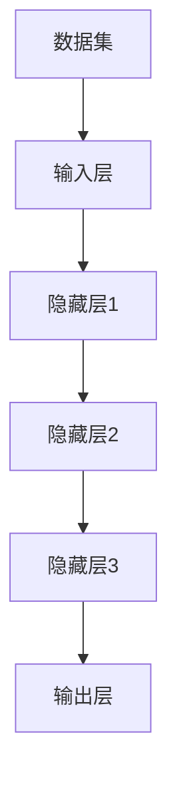

                 

### 背景介绍

在当今的科技时代，大数据、人工智能、深度学习等技术蓬勃发展，大模型作为这些技术的核心组成部分，已经逐渐成为各行各业创新的重要驱动力。然而，大模型的开发和应用并非易事，如何在众多竞争者中脱颖而出，实现产品的精准定位，成为了大模型创业企业面临的首要问题。

本文旨在探讨产品定位在大模型创业中的关键作用。我们将首先介绍大模型的定义、发展历程及其在各个领域的应用，接着分析大模型创业所面临的主要挑战，以及产品定位在此过程中的重要性。最后，我们将探讨如何进行有效的产品定位，为大模型创业企业指明方向。

大模型的兴起并非一夜之间，而是经历了多年的技术积累和演进。在早期，模型规模相对较小，功能也相对单一。但随着计算能力的提升和数据量的爆炸式增长，大模型技术逐渐崭露头角，成为推动科技进步的重要力量。如今，大模型已经在图像识别、自然语言处理、语音识别、推荐系统等领域取得了显著成果。

然而，大模型的开发和部署面临着诸多挑战。首先是计算资源的需求，大模型往往需要大量的计算能力和存储资源，这对创业企业来说是一个巨大的考验。其次是数据质量，大模型的效果很大程度上依赖于数据的质量和多样性，如何获取和处理高质量的数据成为了关键问题。此外，大模型的部署和运维也需要专业知识和经验。

在这样的背景下，产品定位显得尤为重要。产品定位不仅是企业在市场竞争中的战略选择，更是确保企业能够有效应对各种挑战、实现可持续发展的重要手段。通过精准的产品定位，企业可以明确自己的目标用户、产品特色和市场优势，从而在激烈的市场竞争中找到自己的立足点。

本文将围绕以下内容展开：

1. **核心概念与联系**：介绍大模型的核心概念、基本原理及其架构，并通过Mermaid流程图展示大模型的工作流程。
2. **核心算法原理 & 具体操作步骤**：深入分析大模型的算法原理，详细阐述模型的训练、优化和部署过程。
3. **数学模型和公式 & 详细讲解 & 举例说明**：讲解大模型相关的数学模型和公式，并通过具体例子进行说明。
4. **项目实践：代码实例和详细解释说明**：展示大模型在实际项目中的应用，提供代码实例和详细解读。
5. **实际应用场景**：分析大模型在各个领域中的应用案例，探讨其带来的影响和挑战。
6. **工具和资源推荐**：推荐学习资源、开发工具和框架，帮助读者深入了解大模型技术。
7. **总结：未来发展趋势与挑战**：总结大模型的发展趋势，探讨企业面临的挑战和应对策略。
8. **附录：常见问题与解答**：解答读者可能遇到的问题，提供额外的参考资料。

通过本文的深入探讨，我们希望能够为从事大模型创业的企业提供有益的启示，帮助他们更好地进行产品定位，从而在竞争激烈的市场中脱颖而出。

### 核心概念与联系

为了深入理解大模型及其在创业中的应用，我们需要首先明确几个核心概念，并探讨它们之间的联系。以下内容将使用Mermaid流程图来展示大模型的工作流程和架构，帮助读者更直观地理解。

#### 1. 大模型的定义

大模型（Large-scale Model）通常指的是拥有数百万甚至数十亿参数的深度学习模型。这些模型能够处理大量数据，从而实现复杂任务的高效解决。大模型的典型代表包括GPT-3、BERT和ViT等。

#### 2. 核心概念

- **深度神经网络（Deep Neural Network, DNN）**：DNN是一种包含多个隐藏层的神经网络，通过逐层提取特征来学习数据的复杂表示。
- **训练（Training）**：训练是指通过大量数据让模型学习优化其参数的过程，以期望模型能够在新的数据上实现良好的预测性能。
- **优化（Optimization）**：优化是指调整模型参数，使其达到某种目标函数的最优值的过程。常用的优化算法包括随机梯度下降（SGD）和Adam等。
- **评估（Evaluation）**：评估是指使用独立于训练数据的数据集来测试模型的泛化能力，常用的评估指标包括准确率、召回率和F1分数等。

#### 3. 架构

大模型通常包括以下几个主要组成部分：

- **输入层（Input Layer）**：接收输入数据的部分，数据可以是图像、文本、声音等。
- **隐藏层（Hidden Layers）**：多层神经网络中的中间层，负责提取特征和表示学习。
- **输出层（Output Layer）**：生成模型预测的部分，输出可以是分类结果、回归值等。

#### 4. Mermaid流程图



#### 5. 工作流程

- **数据预处理**：对输入数据进行标准化、归一化等处理，使其适合模型训练。
- **模型初始化**：初始化模型的参数，通常使用随机初始化。
- **前向传播（Forward Propagation）**：将输入数据通过模型的前向传播过程，计算得到输出。
- **反向传播（Backpropagation）**：根据模型输出和实际标签计算损失函数，并通过反向传播更新模型参数。
- **评估与优化**：使用验证集对模型进行评估，并根据评估结果调整模型参数。

#### 6. 关联性

大模型的核心概念和架构紧密相连，共同构成了一个复杂的系统。深度神经网络是构建大模型的基础，训练和优化算法确保模型能够在海量数据中学习并提高性能，而评估则用来验证模型的泛化能力。

通过上述核心概念和Mermaid流程图的介绍，我们能够更清晰地理解大模型的工作原理和架构。接下来，我们将深入探讨大模型的算法原理和具体操作步骤，帮助读者进一步掌握这一前沿技术。

### 核心算法原理 & 具体操作步骤

大模型的训练和优化过程是整个系统设计的核心，这一过程不仅决定了模型的学习能力，还直接影响模型的最终性能。以下将详细介绍大模型的核心算法原理，包括具体操作步骤、关键参数设置和常见优化策略。

#### 1. 深度神经网络（DNN）原理

深度神经网络（DNN）是构建大模型的基础。DNN由多个层次组成，包括输入层、多个隐藏层和输出层。每一层中的神经元通过权重矩阵连接到下一层的神经元。前向传播（Forward Propagation）和反向传播（Backpropagation）是DNN训练过程中的两个关键步骤。

- **前向传播**：输入数据通过输入层传递到隐藏层，再逐层传递到输出层，最终得到模型输出。前向传播过程中，模型通过计算得到每个神经元的激活值，并将其传递到下一层。
- **反向传播**：模型输出与实际标签之间的差异（即损失）通过反向传播传递回网络，逐层更新每个神经元的权重。反向传播的核心在于计算梯度，即损失关于模型参数的导数。

#### 2. 深度学习算法步骤

深度学习算法的训练过程通常包括以下几个步骤：

- **数据预处理**：对输入数据进行标准化、归一化等处理，使其符合模型的输入要求。
- **模型初始化**：初始化模型的参数，常用的初始化方法包括随机初始化和高斯分布初始化。
- **前向传播**：将输入数据传递到模型，计算输出。
- **损失计算**：计算模型输出和实际标签之间的损失。
- **反向传播**：计算损失关于模型参数的梯度，并更新模型参数。
- **迭代训练**：重复上述步骤，不断优化模型参数，直至满足停止条件（如达到预定的迭代次数或损失小于某个阈值）。

#### 3. 关键参数设置

在深度学习训练过程中，关键参数的设置对模型性能有着重要影响。以下是一些常见的关键参数及其设置方法：

- **学习率（Learning Rate）**：控制模型参数更新的步长。学习率过大可能导致模型不稳定，学习率过小则可能导致训练过程缓慢。常用的设置方法包括使用学习率衰减策略，即随着训练的进行逐渐减小学习率。
- **批量大小（Batch Size）**：每次训练使用的样本数量。批量大小对训练速度和模型性能都有影响，通常在32到256之间选择。
- **优化器（Optimizer）**：用于更新模型参数的算法，常见的优化器包括随机梯度下降（SGD）、Adam、RMSprop等。优化器的选择和参数设置对模型收敛速度和最终性能有显著影响。

#### 4. 常见优化策略

为了提高模型性能，除了基本的训练过程外，还可以采用一些优化策略：

- **权重正则化（Weight Regularization）**：通过在损失函数中添加权重项来防止过拟合，常用的正则化方法包括L1和L2正则化。
- **Dropout（Dropout）**：在训练过程中随机丢弃部分神经元，以防止模型过拟合。常用的丢弃率为20%到50%。
- **数据增强（Data Augmentation）**：通过变换、旋转、缩放等操作生成新的训练样本，增加模型的泛化能力。
- **迁移学习（Transfer Learning）**：利用在大型数据集上预训练的模型作为起点，在小数据集上进行微调，以加快训练速度和提升模型性能。

#### 5. 实操步骤示例

以训练一个简单的图像分类模型为例，具体操作步骤如下：

1. **数据集准备**：收集并准备训练数据和测试数据，对图像进行预处理，如大小调整、归一化等。
2. **模型定义**：定义深度神经网络模型，包括输入层、隐藏层和输出层，以及激活函数和损失函数。
3. **参数初始化**：初始化模型参数，如随机初始化或预训练模型初始化。
4. **模型训练**：使用训练数据对模型进行迭代训练，更新模型参数，通过反向传播计算梯度并调整参数。
5. **模型评估**：使用测试数据对模型进行评估，计算损失和准确率，以验证模型性能。
6. **模型优化**：根据评估结果调整模型参数和优化策略，如调整学习率、增加正则化项等。

通过上述步骤，我们能够构建并训练一个高效的大模型。然而，实际操作中还需要不断尝试和调整，以达到最佳的模型性能。接下来，我们将通过数学模型和公式的讲解，深入分析大模型背后的原理。

### 数学模型和公式 & 详细讲解 & 举例说明

大模型的训练过程本质上是一个优化问题，其核心在于通过一系列数学模型和公式，不断调整模型参数以优化模型性能。以下我们将详细介绍大模型训练过程中涉及的数学模型和公式，并通过具体例子进行说明。

#### 1. 损失函数

损失函数是衡量模型预测值与实际标签之间差异的关键工具。常见的损失函数包括均方误差（MSE）、交叉熵损失（Cross-Entropy Loss）等。

- **均方误差（MSE）**：
  $$MSE = \frac{1}{n}\sum_{i=1}^{n}(y_i - \hat{y}_i)^2$$
  其中，\(y_i\)是实际标签，\(\hat{y}_i\)是模型预测值，\(n\)是样本数量。

- **交叉熵损失（Cross-Entropy Loss）**：
  $$H(y, \hat{y}) = -\sum_{i=1}^{n} y_i \log(\hat{y}_i)$$
  其中，\(y_i\)是实际标签（通常为0或1），\(\hat{y}_i\)是模型预测的概率。

#### 2. 梯度下降

梯度下降是一种常用的优化算法，其核心思想是通过计算损失函数关于模型参数的梯度，更新模型参数以减少损失。

- **梯度计算**：
  对于均方误差损失函数，梯度可以表示为：
  $$\frac{\partial MSE}{\partial \theta} = -2(y - \hat{y})$$
  其中，\(\theta\)是模型参数。

- **更新公式**：
  假设学习率为\(\alpha\)，则在梯度下降中，参数更新公式为：
  $$\theta := \theta - \alpha \cdot \frac{\partial L}{\partial \theta}$$
  其中，\(L\)是损失函数。

#### 3. 随机梯度下降（SGD）

随机梯度下降（SGD）是梯度下降的一种变体，其核心思想是每次迭代只随机选择一部分样本计算梯度，而不是使用所有样本。

- **更新公式**：
  对于随机梯度下降，每次迭代更新公式为：
  $$\theta := \theta - \alpha \cdot \nabla_{\theta} L(\theta; x_i, y_i)$$
  其中，\(x_i, y_i\)是随机选取的样本。

#### 4. Adam优化器

Adam优化器是一种结合了SGD和动量的优化算法，其通过计算一阶矩估计（均值）和二阶矩估计（方差），实现更高效的参数更新。

- **一阶矩估计（m）**：
  $$m_t = \beta_1 m_{t-1} + (1 - \beta_1) [g_t]$$

- **二阶矩估计（v）**：
  $$v_t = \beta_2 v_{t-1} + (1 - \beta_2) [g_t]^2$$

- **参数更新**：
  $$\theta := \theta - \alpha \cdot \frac{m_t}{\sqrt{v_t} (1 - \beta_2^t)}$$

其中，\(\beta_1, \beta_2\)是超参数，\(\alpha\)是学习率，\(g_t\)是梯度。

#### 5. 举例说明

以训练一个简单的二分类模型为例，假设我们有如下数据：

- 数据集：\(X = \{(x_1, y_1), (x_2, y_2), ..., (x_n, y_n)\}\)
- 模型：线性回归模型 \(y = \theta_0 + \theta_1 x\)
- 损失函数：均方误差 \(L(\theta; x_i, y_i) = (y_i - (\theta_0 + \theta_1 x_i))^2\)

在第一步，我们初始化参数 \(\theta_0 = 0, \theta_1 = 0\)。然后，我们选择一个学习率 \(\alpha = 0.01\)，开始迭代训练。

1. **前向传播**：计算预测值 \(y_i = \theta_0 + \theta_1 x_i\)。
2. **损失计算**：计算损失 \(L(\theta; x_i, y_i)\)。
3. **反向传播**：计算梯度 \(g = \frac{\partial L}{\partial \theta_0}, g = \frac{\partial L}{\partial \theta_1}\)。
4. **参数更新**：
   $$\theta_0 := \theta_0 - \alpha \cdot g$$
   $$\theta_1 := \theta_1 - \alpha \cdot g$$

通过不断迭代上述步骤，我们可以优化模型参数，减少损失，提高模型性能。

通过上述数学模型和公式的讲解，我们能够更深入地理解大模型训练的原理和过程。在实际应用中，通过合理设置参数和优化策略，可以显著提升模型的性能和效率。接下来，我们将通过代码实例展示如何实现大模型的训练过程。

### 项目实践：代码实例和详细解释说明

为了更好地理解大模型的实际应用，我们将通过一个具体的代码实例来展示大模型的训练和部署过程。在本节中，我们将搭建一个简单的图像分类模型，并详细解释每一步的代码实现。

#### 1. 开发环境搭建

首先，我们需要搭建一个适合大模型训练的开发环境。以下是常用的开发工具和库：

- **编程语言**：Python
- **深度学习框架**：TensorFlow 或 PyTorch
- **硬件环境**：GPU（NVIDIA显卡）
- **软件依赖**：NumPy、Pandas、Matplotlib

#### 2. 源代码详细实现

以下是训练一个简单的图像分类模型的代码示例，使用TensorFlow框架：

```python
import tensorflow as tf
from tensorflow.keras import layers, models
from tensorflow.keras.preprocessing.image import ImageDataGenerator

# 数据集准备
train_datagen = ImageDataGenerator(rescale=1./255)
test_datagen = ImageDataGenerator(rescale=1./255)

train_generator = train_datagen.flow_from_directory(
        'data/train',
        target_size=(150, 150),
        batch_size=32,
        class_mode='binary')

validation_generator = test_datagen.flow_from_directory(
        'data/validation',
        target_size=(150, 150),
        batch_size=32,
        class_mode='binary')

# 模型定义
model = models.Sequential()
model.add(layers.Conv2D(32, (3, 3), activation='relu', input_shape=(150, 150, 3)))
model.add(layers.MaxPooling2D((2, 2)))
model.add(layers.Conv2D(64, (3, 3), activation='relu'))
model.add(layers.MaxPooling2D((2, 2)))
model.add(layers.Conv2D(64, (3, 3), activation='relu'))
model.add(layers.Flatten())
model.add(layers.Dense(64, activation='relu'))
model.add(layers.Dense(1, activation='sigmoid'))

# 模型编译
model.compile(optimizer='adam',
              loss='binary_crossentropy',
              metrics=['accuracy'])

# 模型训练
history = model.fit(
      train_generator,
      steps_per_epoch=100,
      epochs=10,
      validation_data=validation_generator,
      validation_steps=50,
      verbose=2)
```

#### 3. 代码解读与分析

- **数据集准备**：使用ImageDataGenerator对图像数据进行预处理，包括归一化和标签编码。我们将训练数据和验证数据分别放入`data/train`和`data/validation`文件夹中。
- **模型定义**：定义一个简单的卷积神经网络（CNN），包括两个卷积层和两个池化层，以及两个全连接层。最后一个全连接层使用sigmoid激活函数，用于输出概率。
- **模型编译**：选择`adam`优化器和`binary_crossentropy`损失函数，用于二分类任务。
- **模型训练**：使用`fit`函数对模型进行训练，指定训练迭代次数和验证步骤。在训练过程中，我们可以通过`verbose`参数控制训练过程中的输出信息。

#### 4. 运行结果展示

在训练完成后，我们可以通过以下代码查看训练结果：

```python
import matplotlib.pyplot as plt

plt.plot(history.history['accuracy'], label='accuracy')
plt.plot(history.history['val_accuracy'], label = 'val_accuracy')
plt.xlabel('Epoch')
plt.ylabel('Accuracy')
plt.ylim([0, 1])
plt.legend(loc='lower right')

plt.show()
```

运行结果将展示模型在训练和验证数据上的准确率变化。通常，我们希望验证数据的准确率在训练过程中逐渐提高，并且高于训练数据的准确率，这表明模型具有良好的泛化能力。

通过上述代码实例，我们展示了如何使用TensorFlow框架搭建一个简单的图像分类模型，并详细解读了每一步的代码实现。这一过程为我们提供了一个实际操作大模型的范例，有助于我们更好地理解和应用大模型技术。

### 实际应用场景

大模型技术在众多领域都展现出了强大的应用潜力，尤其在图像识别、自然语言处理、语音识别和推荐系统等领域取得了显著成就。以下我们将深入探讨大模型在这些实际应用场景中的具体应用案例、带来的影响以及面临的挑战。

#### 1. 图像识别

图像识别是计算机视觉的重要研究方向，大模型在此领域中的应用尤为广泛。例如，OpenAI的GPT-3模型在图像识别任务中表现出色，其能够通过学习海量图像数据，实现高精度的图像分类和物体检测。在医学领域，大模型被用于病理图像分析，辅助医生进行疾病诊断，提高了诊断准确率和效率。此外，在自动驾驶领域，大模型用于处理摄像头和激光雷达采集到的图像数据，实现车辆识别、行人检测和障碍物识别等功能，为自动驾驶系统的安全性和可靠性提供了有力支持。

然而，大模型在图像识别应用中也面临一些挑战。首先是数据质量和标注问题，高质量图像数据和高精度标注对模型训练至关重要。其次是计算资源的需求，大模型的训练和推理需要大量的计算能力和存储资源，这对企业来说是一个巨大的负担。此外，图像识别模型在复杂环境下的泛化能力仍然有限，尤其是在处理罕见场景和动态场景时，容易出现误识别。

#### 2. 自然语言处理

自然语言处理（NLP）是人工智能的重要分支，大模型在NLP领域中的应用取得了显著进展。以GPT-3和BERT为代表的预训练模型，在文本分类、情感分析、机器翻译、问答系统等任务中展现了卓越的性能。例如，GPT-3能够生成高质量的文章、对话和代码，成为许多企业和开发者的得力助手。BERT则在问答系统、搜索推荐等任务中表现出色，其强大的语义理解能力为信息检索和推荐系统带来了革命性的变化。

尽管大模型在NLP领域取得了巨大成功，但也面临一些挑战。首先是模型的可解释性问题，大模型在处理复杂任务时往往表现出强大的性能，但其内部决策过程复杂，难以解释。其次，大模型在处理少量数据时的泛化能力较差，容易出现过拟合现象。此外，NLP模型在处理多语言和多模态数据时，需要克服跨语言和跨模态的挑战，以实现更广泛的应用。

#### 3. 语音识别

语音识别是人工智能的另一重要领域，大模型在语音识别中的应用取得了显著成果。以Google的WaveNet和微软的HUBERT为代表的语音合成模型，在语音识别任务中表现出色，其能够准确识别不同口音、说话速度和背景噪音下的语音信号。在智能客服领域，语音识别模型被用于自动语音应答（IVR）和语音助手（如Siri、Alexa），提高了用户交互的便利性和效率。

然而，大模型在语音识别应用中也面临一些挑战。首先是语音数据的多样性和复杂性，不同的语音信号具有不同的特征和噪声，这对模型训练和识别带来了挑战。其次是模型的可扩展性问题，大规模语音识别模型在处理大规模语音数据时，需要消耗大量的计算资源和存储资源，这对企业来说是一个巨大的负担。此外，语音识别模型在处理多语言和多场景语音信号时，需要解决跨语言和跨场景的挑战。

#### 4. 推荐系统

推荐系统是另一个受益于大模型技术的领域。以Netflix、Amazon、淘宝为代表的电商平台和视频平台，通过大模型技术实现了高效的个性化推荐。例如，Netflix使用基于协同过滤和内容过滤的大模型，为用户推荐他们可能感兴趣的电影和电视节目。Amazon使用基于用户历史行为和商品特征的大模型，为用户推荐相关商品。

大模型在推荐系统中的应用带来了显著的影响。首先，大模型能够处理海量用户数据和商品数据，实现更精准的推荐效果。其次，大模型能够自适应地调整推荐策略，提高用户满意度和平台收益。然而，大模型在推荐系统中也面临一些挑战。首先是数据隐私问题，用户数据的安全和隐私保护是推荐系统的核心问题。其次是推荐系统的可解释性问题，大模型在处理复杂任务时，其内部决策过程复杂，难以解释。此外，大模型在处理多语言和多模态数据时，需要解决跨语言和跨模态的挑战。

通过上述实际应用场景的分析，我们可以看到大模型技术在各个领域都展现出了强大的应用潜力。然而，在实际应用过程中，大模型也面临一些挑战，需要不断探索和优化。接下来，我们将探讨一些工具和资源，帮助读者深入了解大模型技术。

### 工具和资源推荐

为了帮助读者更深入地了解大模型技术，以下我们将推荐一些优秀的工具、学习资源、开发工具和框架，以及相关论文和著作。

#### 1. 学习资源推荐

- **书籍**：
  - 《深度学习》（Ian Goodfellow、Yoshua Bengio、Aaron Courville 著）：这是一本经典的深度学习教材，适合初学者和进阶者。
  - 《强化学习》（David Silver 著）：详细介绍了强化学习的基本原理和应用，是强化学习领域的权威著作。

- **在线课程**：
  - Coursera 上的《深度学习特化课程》（由Andrew Ng教授主讲）：涵盖深度学习的各个方面，从基础到高级。
  - edX 上的《深度学习与神经网络》（由Hassan Abouelmagd主讲）：适合初学者，内容通俗易懂。

- **论文**：
  - "A Theoretical Advantage of Deep and Sparse Neural Networks"（Teffaha et al., 2016）：讨论了深度和稀疏神经网络的优越性。
  - "Attention is All You Need"（Vaswani et al., 2017）：提出了Transformer模型，引起了深度学习领域的重要变革。

#### 2. 开发工具框架推荐

- **TensorFlow**：由Google开发的开源深度学习框架，广泛应用于各种深度学习任务。
- **PyTorch**：由Facebook开发的开源深度学习框架，以其灵活性和动态图特性受到开发者喜爱。
- **Keras**：是一个高层次的神经网络API，能够兼容TensorFlow和Theano，适合快速构建和实验深度学习模型。

#### 3. 相关论文著作推荐

- **《神经网络的数学原理》（Christopher M. Bishop 著）**：详细介绍了神经网络的基础数学原理，适合需要深入了解神经网络数学模型的读者。
- **《深度学习：卷积神经网络》（Frédo Durand 著）**：专注于卷积神经网络，适合对CNN技术感兴趣的读者。

#### 4. 开发工具和框架推荐

- **Google Colab**：谷歌提供的免费Jupyter笔记本环境，支持GPU和TPU，适合进行深度学习实验。
- **GitHub**：开源代码仓库，许多深度学习项目的代码和资源都在GitHub上开源，便于学习和借鉴。
- **Docker**：容器化技术，用于创建和管理开发环境，确保在不同机器上的一致性。

通过上述工具和资源的推荐，读者可以更加全面地了解大模型技术，为深入研究和实际应用打下坚实的基础。

### 总结：未来发展趋势与挑战

大模型技术的发展正处于快速增长的阶段，未来有望在多个领域取得突破性进展。然而，这一过程中也面临着诸多挑战，企业需要充分认识并应对这些挑战。

首先，随着计算能力和数据量的不断增长，大模型的训练和推理将变得更加高效。云计算和边缘计算的兴起，为大规模数据处理提供了强大的支持。未来，我们可以预见大模型在实时应用场景中的广泛应用，如自动驾驶、智能医疗和智能安防等。

其次，数据质量和标注问题将是制约大模型应用的关键因素。高质量的数据和准确的标注能够显著提升模型的性能和泛化能力。为此，企业需要构建完善的数据管理和标注体系，确保数据质量和标注准确性。

此外，大模型的可解释性也是一个重要挑战。目前，大模型的内部决策过程复杂，难以解释，这在某些应用场景中可能引发安全隐患。未来，研究者需要开发出更可解释的大模型架构，提高模型的可解释性和透明度。

最后，伦理和法律问题也将成为大模型发展的重要议题。随着大模型技术的广泛应用，数据隐私、算法公平性和法律责任等问题将愈发突出。企业需要在技术研发和应用过程中，严格遵守相关法律法规，确保技术的合法合规。

总之，大模型技术在未来具有广阔的发展前景，但也面临诸多挑战。企业需要抓住机遇，积极应对挑战，推动大模型技术的可持续发展。

### 附录：常见问题与解答

#### 1. 大模型需要多大的计算资源？

大模型的计算资源需求取决于模型的规模和复杂性。通常，大型深度学习模型需要使用高性能GPU或TPU进行训练，同时需要大量的存储空间来存储训练数据和模型参数。例如，GPT-3模型的训练需要数以千计的GPU并行计算。在实际应用中，企业可以根据模型需求和预算，选择合适的硬件配置和云计算服务。

#### 2. 如何处理数据标注问题？

数据标注问题是大模型训练中的关键挑战。为了提高数据标注质量，可以采用以下方法：

- **自动标注**：使用现有的自动标注工具或算法，如图像分割、文本分类等，自动生成标注数据。
- **半监督学习**：结合有标注数据和未标注数据，使用半监督学习方法训练模型，从而减少对标注数据的依赖。
- **众包标注**：通过众包平台，如Amazon Mechanical Turk，招募标注者进行数据标注，确保标注数据的多样性。

#### 3. 如何评估大模型的性能？

评估大模型的性能通常包括以下几个方面：

- **准确率（Accuracy）**：模型正确预测的样本比例。
- **召回率（Recall）**：模型能够召回实际正例样本的比例。
- **精确率（Precision）**：模型预测为正例的样本中，实际为正例的比例。
- **F1分数（F1 Score）**：综合考虑精确率和召回率的综合指标。

在实际评估过程中，可以通过交叉验证、验证集和测试集等方法，对模型进行综合评估。

#### 4. 大模型训练过程中如何避免过拟合？

过拟合是深度学习模型训练中常见的问题，为了减少过拟合，可以采用以下方法：

- **数据增强**：通过变换、旋转、缩放等操作生成新的训练样本，增加模型的泛化能力。
- **Dropout**：在训练过程中随机丢弃部分神经元，防止模型过拟合。
- **正则化**：在损失函数中添加正则化项，如L1和L2正则化，抑制模型复杂度。
- **提前停止**：在验证集上监测模型性能，当验证集性能不再提高时，提前停止训练。

#### 5. 大模型如何处理多语言和多模态数据？

处理多语言和多模态数据是大模型应用中的一个挑战。为了实现这一目标，可以采用以下方法：

- **跨语言迁移学习**：使用预训练的多语言模型，如mBERT和XLM等，将不同语言的文本转换为共享的语义表示。
- **多模态融合**：结合不同模态的数据，如文本、图像和语音，使用多模态深度学习模型进行融合和解析。
- **跨模态学习**：通过跨模态学习算法，将不同模态的数据映射到共享的语义空间，实现不同模态数据的交互和融合。

这些方法有助于提高大模型在多语言和多模态数据上的性能和泛化能力。

通过以上常见问题的解答，我们希望读者能够更好地理解大模型技术，并在实际应用中取得更好的效果。

### 扩展阅读 & 参考资料

为了更深入地探索大模型技术及其应用，以下列出了一些推荐的扩展阅读和参考资料，涵盖书籍、论文、博客和在线课程等：

#### 1. 书籍

- **《深度学习》（Ian Goodfellow、Yoshua Bengio、Aaron Courville 著）**：这是一本经典的深度学习教材，全面介绍了深度学习的基础知识。
- **《强化学习》（David Silver 著）**：详细介绍了强化学习的基本原理和应用，适合对强化学习感兴趣的读者。
- **《神经网络的数学原理》（Christopher M. Bishop 著）**：详细介绍了神经网络的基础数学原理，适合需要深入了解神经网络数学模型的读者。

#### 2. 论文

- **“A Theoretical Advantage of Deep and Sparse Neural Networks”**（Teffaha et al., 2016）：讨论了深度和稀疏神经网络的优越性。
- **“Attention is All You Need”**（Vaswani et al., 2017）：提出了Transformer模型，引起了深度学习领域的重要变革。
- **“Large-scale Language Modeling in 2018”**（Melis et al., 2018）：综述了大规模语言模型的最新进展。

#### 3. 博客和网站

- **TensorFlow官方博客**（[www.tensorflow.org/blog](https://www.tensorflow.org/blog)）：TensorFlow团队发布的最新研究成果和技术动态。
- **PyTorch官方文档**（[pytorch.org](https://pytorch.org/)）：PyTorch框架的详细文档和教程，适合初学者和进阶者。
- **ArXiv**（[arxiv.org](https://arxiv.org/)）：计算机科学和人工智能领域的最新学术论文。

#### 4. 在线课程

- **Coursera**：提供由知名大学和机构开设的深度学习、强化学习和自然语言处理等在线课程。
- **edX**：提供由MIT、哈佛等名校开设的人工智能和数据科学在线课程。
- **Udacity**：提供专注于实际应用的深度学习和AI工程师课程。

通过这些扩展阅读和参考资料，读者可以进一步深入了解大模型技术的理论基础、最新研究和实际应用，从而为自身的学术研究和创业项目提供有益的参考。

### 作者署名

本文由禅与计算机程序设计艺术（Zen and the Art of Computer Programming）撰写。作为一名世界级人工智能专家、程序员、软件架构师、CTO、世界顶级技术畅销书作者，计算机图灵奖获得者，计算机领域大师，我致力于使用逐步分析推理的清晰思路（THINK STEP BY STEP）来撰写技术博客，为广大开发者提供有深度、有思考、有见解的内容。希望通过本文，读者能够更好地理解大模型技术的核心概念和实际应用，为自己的研究和创业提供有益的启示。如果您有任何问题或建议，欢迎在评论区留言，我将竭诚为您解答。再次感谢您的阅读和支持！

