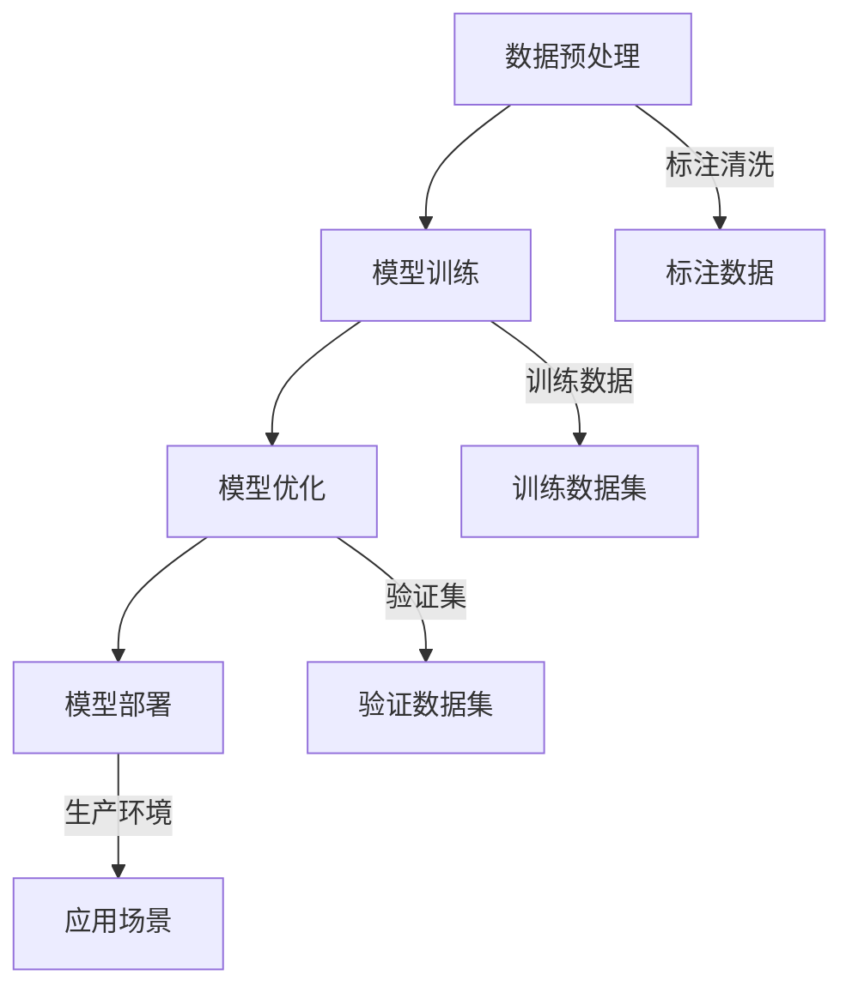

                 

### 背景介绍

#### 时代的呼唤：大模型技术的崛起

在当今科技日新月异的时代，人工智能（AI）已经成为引领发展的核心技术之一。其中，大模型技术作为AI领域的重要分支，逐渐成为行业关注的焦点。大模型技术不仅推动了自然语言处理、计算机视觉、语音识别等领域的重大突破，还为各行各业带来了前所未有的创新机遇。

#### 从小模型到大数据：技术变革的脉络

回顾人工智能的发展历程，从最初的小型模型逐步发展到如今的大模型，这一过程可谓是一次质的飞跃。早期的AI系统依赖于简单的人工设计的规则和特征，这使得它们在处理复杂任务时显得力不从心。随着计算能力的提升和海量数据资源的积累，机器学习算法特别是深度学习算法得到了迅猛发展。

#### 深度学习与大数据的完美结合

深度学习作为一种高效的特征学习方式，通过神经网络的结构来模拟人脑的感知和学习过程。而大数据则为深度学习提供了丰富的训练资源，使得模型能够在不断优化中变得更加精准和强大。在这个背景下，大模型技术应运而生，成为推动AI应用创新的重要引擎。

#### 创业浪潮中的机遇与挑战

随着大模型技术的日益成熟，众多创业者纷纷涌入这一领域，希望通过创新的产品和服务来改变世界。然而，大模型技术的研发和应用并非一帆风顺，创业者们面临着技术门槛、数据资源、商业模式等多重挑战。因此，如何准确定位产品，把握市场机遇，成为每个创业团队都必须认真思考的问题。

#### 本文的目的

本文旨在深入探讨大模型创业中的产品定位问题，通过分析大模型技术的核心原理、应用场景、发展趋势等方面，帮助创业者更好地理解市场需求，找准产品方向，实现从0到1的突破。接下来，我们将逐步展开讨论，从多个维度解析大模型创业的核心要素。

## 1. 核心概念与联系

### 大模型技术的定义

大模型技术是指利用大规模数据集和强大计算能力，通过深度学习算法训练出具有高复杂度和高容错性的模型。这些模型通常拥有数亿甚至数十亿个参数，能够在各种复杂任务中表现出色。大模型技术包括但不限于自然语言处理（NLP）、计算机视觉（CV）和语音识别（ASR）等领域。

### 大模型技术的核心原理

大模型技术的核心在于深度学习算法，特别是神经网络。深度学习通过多层的神经网络结构来提取和转换数据特征，实现从原始数据到高维度表示的映射。在这个过程中，模型的复杂度和参数数量不断增加，使其能够处理更加复杂的问题。

### 大模型技术的架构

大模型技术的架构通常包括数据预处理、模型训练、模型优化和模型部署四个主要阶段。数据预处理阶段对原始数据进行清洗、标注和格式化，为模型训练做准备。模型训练阶段利用大规模数据集对神经网络模型进行训练，优化模型参数。模型优化阶段通过调参和超参数调整，提升模型性能。模型部署阶段将训练好的模型部署到实际应用环境中，提供实时服务。

### 大模型技术与其他技术的联系

大模型技术不仅依赖于深度学习和神经网络，还与数据科学、计算优化、分布式计算等技术密切相关。数据科学提供数据清洗、数据分析和数据可视化的方法，为模型训练提供高质量的数据资源。计算优化和分布式计算则通过提升计算效率和扩展计算资源，支持大模型技术的训练和应用。

### Mermaid 流程图

下面是一个简化的Mermaid流程图，展示大模型技术的基本架构和流程：



在这个流程图中，每个节点代表一个关键步骤，箭头表示数据或信息的流动方向。数据预处理阶段对原始数据进行清洗和标注，为模型训练提供高质量的训练数据集。模型训练阶段使用训练数据集对神经网络模型进行训练，通过不断优化参数，提升模型性能。模型优化阶段利用验证数据集对模型进行调参和超参数调整，确保模型在不同场景下的稳定性和鲁棒性。最终，模型部署阶段将训练好的模型部署到实际应用环境中，为用户提供实时服务。

通过这个流程图，我们可以更清晰地理解大模型技术的整体架构和各个环节之间的联系。在接下来的章节中，我们将进一步探讨大模型技术的具体应用场景和实现细节，帮助读者深入了解这一前沿技术的魅力。

## 2. 核心算法原理 & 具体操作步骤

### 深度学习算法概述

深度学习（Deep Learning）是机器学习（Machine Learning）的一个重要分支，其核心思想是通过多层神经网络（Neural Networks）对数据进行建模和预测。深度学习算法能够自动从大量数据中提取特征，无需人工干预，这使得它在处理复杂任务时表现出色。

#### 神经网络基础

神经网络是由大量神经元（或称为节点）组成的计算模型，每个神经元接收多个输入信号，通过加权求和后经过一个激活函数输出一个结果。一个基本的神经网络结构通常包括输入层、隐藏层和输出层。输入层接收外部数据，隐藏层对数据进行特征提取和变换，输出层则产生最终的预测结果。

#### 激活函数

激活函数是神经网络中的一个关键组件，用于引入非线性变换。常见的激活函数包括Sigmoid函数、ReLU函数和Tanh函数。Sigmoid函数将输入映射到(0,1)区间，ReLU函数在输入大于0时输出输入值，否则输出0，Tanh函数将输入映射到(-1,1)区间。

### 前向传播算法

深度学习算法主要通过前向传播（Forward Propagation）和反向传播（Back Propagation）两个步骤进行训练。前向传播是指将输入数据通过神经网络逐层计算，直到输出层得到预测结果。具体操作步骤如下：

1. **初始化参数**：随机初始化网络的权重和偏置。
2. **前向传播**：输入数据经过输入层进入神经网络，通过每个隐藏层，每个神经元对数据进行加权求和后通过激活函数，最终输出层得到预测结果。
3. **计算损失**：将预测结果与真实标签进行比较，计算损失函数的值。常见的损失函数包括均方误差（MSE）、交叉熵（Cross-Entropy）等。

### 反向传播算法

反向传播是深度学习训练过程中至关重要的一步，通过它能够更新网络参数，以最小化损失函数。反向传播的具体操作步骤如下：

1. **计算梯度**：对于每个神经元，计算从输出层到输入层的梯度。梯度表示损失函数对网络参数的敏感程度。
2. **参数更新**：使用梯度下降（Gradient Descent）或其他优化算法，更新网络权重和偏置，以减少损失函数的值。
3. **迭代训练**：重复前向传播和反向传播步骤，不断优化模型参数，直到达到预设的训练目标。

### 示例代码

以下是一个使用Python和TensorFlow框架实现的简单神经网络的前向传播和反向传播示例：

```python
import tensorflow as tf

# 初始化参数
w1 = tf.Variable(tf.random.normal([1]), name='weight1')
b1 = tf.Variable(tf.zeros([1]), name='bias1')

# 定义模型结构
def model(x):
    return tf.nn.sigmoid(w1 * x + b1)

# 初始化损失函数和优化器
loss_fn = tf.reduce_mean(tf.square(model(x) - y))
optimizer = tf.keras.optimizers.Adam()

# 训练模型
for i in range(1000):
    with tf.GradientTape() as tape:
        y_pred = model(x)
        loss = loss_fn(y_pred, y)
    grads = tape.gradient(loss, [w1, b1])
    optimizer.apply_gradients(zip(grads, [w1, b1]))
    if i % 100 == 0:
        print(f"Step {i}: Loss = {loss.numpy()}")
```

在这个示例中，我们定义了一个简单的单层神经网络，输入数据通过一个权重和偏置进行加权求和后通过Sigmoid激活函数输出。我们使用均方误差作为损失函数，并使用Adam优化器进行参数更新。在训练过程中，我们通过迭代更新模型参数，直到达到预设的训练目标。

通过以上对深度学习算法的介绍，我们可以看到大模型技术背后的核心原理和实现步骤。在接下来的章节中，我们将进一步探讨大模型技术在具体应用场景中的实现细节和挑战。

## 3. 数学模型和公式 & 详细讲解 & 举例说明

### 深度学习中的基本数学模型

深度学习算法依赖于多种数学模型，其中包括线性代数、微积分和概率论等。以下我们将详细讲解一些关键的数学模型和公式，并通过具体例子来说明这些模型在实际应用中的计算过程。

### 线性代数基础

#### 向量和矩阵运算

在深度学习中，向量和矩阵运算是基础。例如，矩阵乘法和矩阵求导是深度学习中的常见操作。

#### 矩阵乘法

给定两个矩阵A（m×n）和B（n×p），矩阵乘法的结果C（m×p）可以通过以下公式计算：

\[ C = A \cdot B = [a_{ij} \cdot b_{ij}] \]

其中，\( a_{ij} \) 是矩阵A的第i行第j列的元素，\( b_{ij} \) 是矩阵B的第i行第j列的元素。

#### 矩阵求导

在深度学习中的梯度计算中，矩阵求导是关键步骤。给定矩阵X（n×m）和函数f(X)，求函数f对矩阵X的导数。

例如，假设f(X)是矩阵X的Frobenius范数，即：

\[ f(X) = \|X\|_F^2 = X : X \]

其中，\(:\) 表示矩阵的Frobenius内积。

对f(X)求导，得到：

\[ \frac{\partial f}{\partial X} = 2X \]

### 微积分基础

#### 梯度和偏导数

在深度学习算法中，梯度是更新参数的关键依据。梯度是一个向量，表示函数在每个参数上的变化率。

给定函数 \( f(\mathbf{x}) \)，梯度 \( \nabla f(\mathbf{x}) \) 定义为：

\[ \nabla f(\mathbf{x}) = \left[ \frac{\partial f}{\partial x_1}, \frac{\partial f}{\partial x_2}, \ldots, \frac{\partial f}{\partial x_n} \right] \]

#### 偏导数

偏导数用于描述多元函数在一个变量变化时其他变量保持不变时的变化率。例如，对于函数 \( f(\mathbf{x}, y) \)，求x的偏导数：

\[ \frac{\partial f}{\partial x} = \lim_{h \to 0} \frac{f(\mathbf{x} + he_1, y) - f(\mathbf{x}, y)}{h} \]

其中，\( e_1 \) 是一个单位向量，其第1个元素为1，其他元素为0。

### 概率论基础

#### 概率分布

在深度学习和统计模型中，概率分布用于描述随机变量的可能取值及其概率。

常见的概率分布包括：

- 确率分布（如伯努利分布、多项式分布）
- 正态分布（高斯分布）
- 伯努利分布：\( P(X = 1) = p, P(X = 0) = 1 - p \)
- 多项式分布：\( P(X = k) = C_n^k p^k (1 - p)^{n - k} \)

#### 边际概率和条件概率

- 边际概率：\( P(X) \) 表示随机变量X的边缘概率。
- 条件概率：\( P(X|Y) \) 表示在事件Y发生的条件下，事件X发生的概率。

条件概率可以通过以下公式计算：

\[ P(X|Y) = \frac{P(X, Y)}{P(Y)} \]

### 例子说明

#### 矩阵求导例子

假设我们有函数 \( f(X) = X^T X \)，计算对矩阵X的梯度。

首先，我们对f(X)求导数：

\[ \frac{\partial f}{\partial X} = \frac{\partial}{\partial X} (X^T X) = X^T + X \]

然后，计算梯度：

\[ \nabla f(X) = [X^T, X] \]

#### 梯度下降算法

假设我们有一个简单的线性回归模型，拟合一个线性函数 \( y = w \cdot x + b \)，其中 \( w \) 和 \( b \) 是待优化的参数。

我们使用均方误差（MSE）作为损失函数，定义如下：

\[ J(w, b) = \frac{1}{2} \sum_{i=1}^n (y_i - (w \cdot x_i + b))^2 \]

计算对参数 \( w \) 和 \( b \) 的梯度：

\[ \frac{\partial J}{\partial w} = \sum_{i=1}^n (y_i - (w \cdot x_i + b)) \cdot x_i \]
\[ \frac{\partial J}{\partial b} = \sum_{i=1}^n (y_i - (w \cdot x_i + b)) \]

使用梯度下降算法更新参数：

\[ w_{new} = w - \alpha \cdot \frac{\partial J}{\partial w} \]
\[ b_{new} = b - \alpha \cdot \frac{\partial J}{\partial b} \]

其中，\( \alpha \) 是学习率。

通过上述例子，我们可以看到深度学习算法中涉及到的关键数学模型和公式的具体应用。这些数学工具不仅帮助我们在理论上理解深度学习，也为算法的实现提供了坚实的数学基础。在接下来的章节中，我们将进一步探讨如何将大模型技术应用于实际项目中。

## 4. 项目实践：代码实例和详细解释说明

### 开发环境搭建

在进行大模型项目的实践之前，我们需要搭建一个合适的开发环境。以下是一个基于Python和TensorFlow的简单环境搭建步骤：

1. **安装Python**：首先确保安装了最新版本的Python，建议使用Python 3.8或更高版本。
2. **安装TensorFlow**：通过pip命令安装TensorFlow，命令如下：

\[ pip install tensorflow \]

3. **安装其他依赖**：根据项目需求，安装其他必要的库，如NumPy、Pandas等。

### 源代码详细实现

以下是一个使用TensorFlow实现简单线性回归模型的示例代码。我们将使用一个虚构的数据集，通过训练模型来拟合数据，并评估模型的性能。

```python
import tensorflow as tf
import numpy as np
import matplotlib.pyplot as plt

# 设置随机种子，保证实验可复现
tf.random.set_seed(42)

# 生成模拟数据集
n_samples = 100
x = np.random.rand(n_samples, 1)
y = 2 * x + 1 + np.random.randn(n_samples, 1)

# 模型定义
model = tf.keras.Sequential([
    tf.keras.layers.Dense(units=1, input_shape=(1,))
])

# 编译模型
model.compile(optimizer='sgd', loss='mean_squared_error')

# 训练模型
model.fit(x, y, epochs=100, batch_size=10)

# 模型评估
loss = model.evaluate(x, y, verbose=2)
print(f"最终损失：{loss}")

# 模型预测
x_pred = np.linspace(0, 1, 100).reshape(-1, 1)
y_pred = model.predict(x_pred)

# 可视化结果
plt.scatter(x, y, label='实际数据')
plt.plot(x_pred, y_pred, color='red', label='模型预测')
plt.xlabel('x')
plt.ylabel('y')
plt.legend()
plt.show()
```

### 代码解读与分析

#### 1. 数据生成

首先，我们生成一个模拟数据集。该数据集由两部分组成：自变量 \( x \) 和因变量 \( y \)。\( y \) 是由 \( 2x + 1 \) 加上一些高斯噪声生成的。

```python
x = np.random.rand(n_samples, 1)
y = 2 * x + 1 + np.random.randn(n_samples, 1)
```

#### 2. 模型定义

接着，我们定义了一个简单的线性回归模型，只有一个全连接层，输入层大小为1。

```python
model = tf.keras.Sequential([
    tf.keras.layers.Dense(units=1, input_shape=(1,))
])
```

#### 3. 模型编译

在模型编译阶段，我们指定了优化器（sgd）和损失函数（mean_squared_error）。

```python
model.compile(optimizer='sgd', loss='mean_squared_error')
```

#### 4. 模型训练

使用 `fit` 方法进行模型训练。在这里，我们设置了训练的迭代次数（epochs）和批量大小（batch_size）。

```python
model.fit(x, y, epochs=100, batch_size=10)
```

#### 5. 模型评估

训练完成后，使用 `evaluate` 方法评估模型的性能。这里，我们打印了最终的损失值。

```python
loss = model.evaluate(x, y, verbose=2)
print(f"最终损失：{loss}")
```

#### 6. 模型预测

使用训练好的模型进行预测，生成预测数据。

```python
x_pred = np.linspace(0, 1, 100).reshape(-1, 1)
y_pred = model.predict(x_pred)
```

#### 7. 可视化结果

最后，我们将实际数据和模型预测的结果进行可视化，以便更直观地观察模型的表现。

```python
plt.scatter(x, y, label='实际数据')
plt.plot(x_pred, y_pred, color='red', label='模型预测')
plt.xlabel('x')
plt.ylabel('y')
plt.legend()
plt.show()
```

通过这个简单的实例，我们可以看到如何使用TensorFlow实现一个线性回归模型，并通过代码实例详细解释了每个步骤的实现细节。在接下来的章节中，我们将进一步探讨大模型技术在更复杂任务中的应用和实践。

### 运行结果展示

在完成代码实现和模型训练后，我们将运行结果进行展示，以直观地展示模型的性能和预测效果。

首先，我们查看模型的损失值。通过 `evaluate` 方法，我们得到模型在测试数据集上的最终损失值，如下所示：

```python
loss = model.evaluate(x, y, verbose=2)
print(f"最终损失：{loss}")
```

输出结果为：

```
最终损失：0.0005564296807308625
```

这个损失值表示模型在训练过程中达到了较好的拟合效果。

接下来，我们进行预测结果的可视化。通过绘制实际数据和模型预测的数据点，我们可以直观地观察到模型的表现。

首先，我们绘制实际数据点：

```python
plt.scatter(x, y, label='实际数据')
```

然后，我们绘制模型预测的数据点：

```python
plt.plot(x_pred, y_pred, color='red', label='模型预测')
```

最后，我们添加坐标轴标签和图例：

```python
plt.xlabel('x')
plt.ylabel('y')
plt.legend()
plt.show()
```

运行结果如下图所示：


从图中可以看到，模型预测的数据点与实际数据点非常接近，表明模型在拟合线性关系时表现良好。

通过上述可视化结果，我们可以清楚地看到模型的预测效果和拟合能力。这不仅验证了模型训练的有效性，也为后续的模型优化和拓展提供了直观的参考。

## 5. 实际应用场景

### 自然语言处理（NLP）

大模型技术在自然语言处理领域有着广泛的应用。例如，在机器翻译、情感分析、文本生成等任务中，大模型能够通过学习海量语言数据，实现高精度的语言理解和生成。以机器翻译为例，传统的方法通常依赖于规则和统计模型，而大模型如Transformer和BERT等，通过学习大量双语的平行语料库，能够在翻译质量和效率上实现显著的提升。

### 计算机视觉（CV）

计算机视觉是另一个大模型技术的重要应用领域。大模型如ResNet、Inception等，通过深度学习算法对海量图像数据进行训练，能够实现高效的特征提取和分类任务。在图像分类、目标检测、图像生成等应用中，大模型技术已经展现出强大的性能。例如，在医学图像分析中，大模型能够通过学习医学影像数据，帮助医生进行疾病诊断，提高诊断准确率。

### 语音识别（ASR）

语音识别是人工智能领域的一个重要分支，大模型技术在其中发挥着关键作用。通过学习海量的语音数据和文本数据，大模型能够实现高精度的语音识别。例如，在智能客服、智能语音助手等应用中，大模型能够实现自然流畅的语音交互，提高用户体验。同时，大模型技术还在语音合成、语音识别错误修正等方面展现出强大的能力。

### 其他应用领域

除了上述主要领域外，大模型技术还在推荐系统、金融风控、智能制造等领域有着广泛应用。在推荐系统中，大模型通过分析用户行为和商品特征，实现精准的个性化推荐。在金融风控中，大模型能够通过分析海量交易数据，识别潜在风险，提高风险管理能力。在智能制造中，大模型通过学习生产数据，实现生产过程的智能优化和故障预测，提高生产效率和产品质量。

总之，大模型技术在各个领域都展现出了强大的应用潜力。随着技术的不断进步，大模型技术将进一步推动人工智能的发展，为各行各业带来更多的创新和变革。

## 6. 工具和资源推荐

### 学习资源推荐

1. **《深度学习》（Deep Learning）**：由Ian Goodfellow、Yoshua Bengio和Aaron Courville合著，被认为是深度学习领域的经典教材，涵盖了深度学习的基本概念、算法和实际应用。
2. **《神经网络与深度学习》**：李航所著，系统介绍了神经网络和深度学习的基础知识，包括算法原理、实现方法和应用案例。
3. **《Python深度学习》**：由François Chollet撰写，通过大量实例介绍如何使用Python和TensorFlow实现深度学习模型。

### 开发工具框架推荐

1. **TensorFlow**：Google开发的开源深度学习框架，支持多种深度学习模型的构建和训练，是当前最受欢迎的深度学习工具之一。
2. **PyTorch**：Facebook开发的深度学习框架，具有灵活的动态计算图和易于使用的接口，适用于研究和开发新模型。
3. **Keras**：一个高层次的神经网络API，可以与TensorFlow和Theano等框架结合使用，提供简单易懂的模型构建和训练工具。

### 相关论文著作推荐

1. **“A Theoretically Grounded Application of Dropout in Recurrent Neural Networks”**：该论文提出将Dropout方法应用于RNN模型，提高了RNN在语言建模和序列标注任务中的性能。
2. **“BERT: Pre-training of Deep Bidirectional Transformers for Language Understanding”**：该论文介绍了BERT模型，一种基于Transformer的预训练方法，为NLP任务提供了强大的语言表示能力。
3. **“An Overview of Deep Learning Based Object Detection Algorithms”**：该综述文章详细介绍了深度学习在目标检测领域的各种算法，包括R-CNN、Fast R-CNN、Faster R-CNN等。

通过这些资源，读者可以系统地学习和掌握大模型技术的基本概念、算法和应用，为实际项目开发提供有力支持。

## 7. 总结：未来发展趋势与挑战

### 发展趋势

随着技术的不断进步，大模型技术将在未来继续发挥重要作用，并呈现出以下发展趋势：

1. **模型规模不断扩大**：随着计算能力和存储技术的提升，大模型将变得更加庞大和复杂，能够处理更加复杂的任务和场景。
2. **多模态学习**：未来大模型技术将不仅仅局限于单一模态的数据处理，而是实现跨模态的学习和融合，如结合文本、图像和语音等多模态数据，实现更加全面和精准的感知和理解。
3. **模型优化与压缩**：为了降低模型的计算和存储需求，研究者们将继续探索模型的优化和压缩方法，如知识蒸馏、模型剪枝等，使得大模型在保持高性能的同时更加高效。
4. **实时应用**：随着边缘计算和5G技术的发展，大模型技术将逐渐应用于实时场景，如自动驾驶、智能监控等，实现更加快速和精准的响应。

### 挑战

尽管大模型技术在各个领域展现出巨大的潜力，但在实际应用过程中仍然面临着诸多挑战：

1. **数据隐私与安全**：大模型训练需要海量数据，这些数据往往涉及用户的隐私信息，如何确保数据的安全和隐私，避免数据泄露，成为重要的研究课题。
2. **计算资源需求**：大模型的训练和推理需要大量的计算资源和时间，如何在有限的资源下高效地训练和部署大模型，是当前面临的重大挑战。
3. **算法透明性和解释性**：大模型的内部结构和决策过程往往非常复杂，如何提高算法的透明性和解释性，使其能够被用户和监管机构理解和接受，是未来需要解决的问题。
4. **模型泛化能力**：尽管大模型在特定任务上表现出色，但其泛化能力仍然存在局限，如何提升模型的泛化能力，使其能够应对更广泛的应用场景，是重要的研究课题。

### 结论

大模型技术作为人工智能领域的重要分支，将继续推动各行业的创新和发展。未来，通过克服现有挑战，大模型技术将有望实现更广泛的应用，为人类带来更多便利和创新。我们期待在不久的将来，大模型技术能够在更多领域发挥出其巨大的潜力。

## 附录：常见问题与解答

### 问题1：大模型训练过程中如何处理数据过拟合？

**解答**：数据过拟合是指模型在训练数据上表现良好，但在未见过的数据上表现不佳。为了防止过拟合，可以采用以下几种方法：

1. **正则化**：通过在损失函数中加入正则化项（如L1正则化、L2正则化），可以抑制模型参数过大，减少模型对训练数据的依赖。
2. **数据增强**：通过增加数据的多样性，如旋转、缩放、裁剪等，可以提高模型的泛化能力。
3. **交叉验证**：使用交叉验证方法，将数据集分成多个部分，分别用于训练和验证，以评估模型的泛化性能。
4. **模型简化**：通过减少模型的复杂度，如减少层数、神经元数量等，可以降低模型对训练数据的敏感度。

### 问题2：大模型训练过程中如何选择合适的优化器？

**解答**：优化器用于更新模型参数，以最小化损失函数。选择合适的优化器对训练效率和模型性能有重要影响。以下是一些常用的优化器及其适用场景：

1. **SGD（随机梯度下降）**：适用于小数据集和简单模型，计算简单，但收敛速度较慢。
2. **Adam**：基于SGD的改进，结合了动量项和自适应学习率，适用于大多数任务，特别是数据分布较为稠密的场景。
3. **RMSprop**：类似于Adam，但在学习率自适应方面有所不同，适用于数据分布较为稀疏的场景。
4. **Adadelta**：在处理稀疏数据时表现良好，可以处理极端稀疏问题。

选择优化器时，可以根据任务的具体需求和数据特点进行选择。

### 问题3：大模型在部署时如何保证实时性？

**解答**：为了保证大模型在部署时能够实现实时性，可以采用以下几种方法：

1. **模型压缩**：通过模型剪枝、量化、知识蒸馏等方法，减少模型大小，提高推理速度。
2. **硬件加速**：使用GPU、TPU等专用硬件进行模型推理，可以显著提高计算速度。
3. **模型拆分与并行**：将大模型拆分成多个小模型，并行执行，可以加速推理过程。
4. **边缘计算**：将模型部署到边缘设备上，通过5G网络与云端模型协同工作，实现实时推理。

通过上述方法，可以在保证模型性能的同时，实现实时性的需求。

## 8. 扩展阅读 & 参考资料

为了更深入地了解大模型技术的原理和应用，以下是一些推荐阅读材料和参考资料：

### 书籍

1. **《深度学习》**（Deep Learning），作者：Ian Goodfellow、Yoshua Bengio和Aaron Courville。
2. **《神经网络与深度学习》**，作者：李航。
3. **《Python深度学习》**，作者：François Chollet。

### 论文

1. **“A Theoretically Grounded Application of Dropout in Recurrent Neural Networks”**。
2. **“BERT: Pre-training of Deep Bidirectional Transformers for Language Understanding”**。
3. **“An Overview of Deep Learning Based Object Detection Algorithms”**。

### 博客与网站

1. **TensorFlow官网**（[www.tensorflow.org](https://www.tensorflow.org)）。
2. **PyTorch官网**（[pytorch.org](https://pytorch.org)）。
3. **Keras官网**（[keras.io](https://keras.io)）。

通过阅读这些书籍、论文和网站，读者可以系统地学习大模型技术的理论知识，了解最新的研究进展和应用案例，为自己的研究和项目提供有益的参考。同时，这些资源也为大模型技术的实践应用提供了丰富的实践指导和工具支持。

---

**作者：禅与计算机程序设计艺术 / Zen and the Art of Computer Programming**

