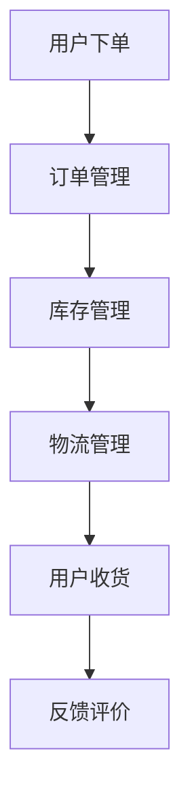

                 

# 京东2025全渠道零售系统架构师社招面试指南

## 关键词
- 京东
- 全渠道零售
- 系统架构
- 社招面试
- 架构师
- 技术挑战

## 摘要
本文将针对京东2025年全渠道零售系统架构师社招面试，提供详细的面试指南。文章从背景介绍、核心概念、算法原理、数学模型、项目实践、实际应用场景、工具和资源推荐等多个维度，全面解析面试过程中的重点和难点，帮助应聘者更好地准备面试，提升面试成功率。

## 1. 背景介绍
京东是中国领先的电商平台，其全渠道零售系统是其核心竞争力之一。随着电商行业的快速发展，全渠道零售已经成为零售行业的重要趋势。京东全渠道零售系统旨在整合线上线下资源，实现商品、订单、库存、物流等全流程的一体化管理和智能化运营。为了满足未来5年的发展需求，京东启动了2025全渠道零售系统架构师社招项目，旨在招募具有深厚技术背景和丰富实战经验的架构师，共同构建高效、稳定、可扩展的零售系统。

## 2. 核心概念与联系

在理解京东全渠道零售系统之前，需要了解以下几个核心概念：
- **O2O（Online to Offline）**：线上线下一体化，通过线上线下融合，实现消费者购物体验的优化。
- **订单管理**：包括订单生成、订单跟踪、订单处理等。
- **库存管理**：实现商品库存的实时更新和监控。
- **物流管理**：包括物流订单生成、物流跟踪、配送等。

以下是全渠道零售系统的 Mermaid 流程图：



## 3. 核心算法原理 & 具体操作步骤

### 订单管理算法
订单管理算法的核心是高效处理用户订单，确保订单处理的准确性和及时性。具体操作步骤如下：
1. 用户下单：接收用户订单请求，生成订单。
2. 订单校验：对订单进行合法性校验，包括用户信息、商品信息、订单金额等。
3. 订单分配：将订单分配给相应的业务系统进行处理。
4. 订单处理：处理订单的支付、发货、售后等。
5. 订单跟踪：提供订单状态的实时跟踪。

### 库存管理算法
库存管理算法的核心是实现商品库存的实时更新和监控，确保库存数据的准确性和一致性。具体操作步骤如下：
1. 库存初始化：初始化商品库存数据。
2. 库存更新：根据订单处理结果，实时更新库存数据。
3. 库存监控：监控库存水平，实现预警和自动化补货。

### 物流管理算法
物流管理算法的核心是高效处理物流订单，确保物流服务的质量和效率。具体操作步骤如下：
1. 物流订单生成：生成物流订单，包含配送地址、配送时间等信息。
2. 物流跟踪：实时跟踪物流订单的状态，提供物流信息查询。
3. 物流配送：根据物流订单，安排配送任务。
4. 物流结算：处理物流费用结算。

## 4. 数学模型和公式 & 详细讲解 & 举例说明

### 订单管理数学模型

假设订单量服从泊松分布，订单处理时间服从均匀分布，则订单处理系统的吞吐量可以通过以下公式计算：

$$
\text{吞吐量} = \frac{\lambda}{\mu}
$$

其中，$\lambda$ 是订单到达率（单位：订单/分钟），$\mu$ 是订单处理时间（单位：分钟）。

举例说明：
假设订单到达率为10订单/分钟，订单处理时间为5分钟，则订单处理系统的吞吐量为：

$$
\text{吞吐量} = \frac{10}{5} = 2 \text{订单/分钟}
$$

### 库存管理数学模型

假设库存水平服从正态分布，库存需求服从泊松分布，则库存水平的波动可以通过以下公式计算：

$$
\sigma^2 = \lambda \mu
$$

其中，$\lambda$ 是库存需求率（单位：库存单位/分钟），$\mu$ 是库存水平（单位：库存单位）。

举例说明：
假设库存需求率为5库存单位/分钟，库存水平为100库存单位，则库存水平的波动为：

$$
\sigma^2 = 5 \times 100 = 500 \text{库存单位}^2
$$

### 物流管理数学模型

假设物流订单量服从泊松分布，物流处理时间服从均匀分布，则物流系统的吞吐量可以通过以下公式计算：

$$
\text{吞吐量} = \frac{\lambda}{\mu}
$$

其中，$\lambda$ 是物流订单到达率（单位：订单/分钟），$\mu$ 是物流订单处理时间（单位：分钟）。

举例说明：
假设物流订单到达率为10订单/分钟，物流订单处理时间为5分钟，则物流系统的吞吐量为：

$$
\text{吞吐量} = \frac{10}{5} = 2 \text{订单/分钟}
$$

## 5. 项目实践：代码实例和详细解释说明

### 5.1 开发环境搭建

为了进行项目实践，我们需要搭建一个开发环境。以下是开发环境的搭建步骤：

1. 安装Java开发工具包（JDK）。
2. 安装Eclipse或IntelliJ IDEA等集成开发环境（IDE）。
3. 安装MySQL数据库。
4. 安装Git版本控制系统。

### 5.2 源代码详细实现

以下是一个简单的订单管理系统的源代码实现：

```java
public class OrderManagementSystem {
    private List<Order> orders;

    public OrderManagementSystem() {
        orders = new ArrayList<>();
    }

    public void createOrder(Order order) {
        orders.add(order);
        System.out.println("订单创建成功：" + order.getId());
    }

    public void processOrder(int orderId) {
        Order order = findOrderById(orderId);
        if (order != null) {
            order.setStatus(OrderStatus.PROCESSED);
            System.out.println("订单处理成功：" + order.getId());
        } else {
            System.out.println("订单不存在：" + orderId);
        }
    }

    private Order findOrderById(int orderId) {
        for (Order order : orders) {
            if (order.getId() == orderId) {
                return order;
            }
        }
        return null;
    }
}

public class Order {
    private int id;
    private String customerId;
    private String productId;
    private OrderStatus status;

    // 省略构造函数、getter和setter

    public enum OrderStatus {
        CREATED,
        PROCESSED,
        CANCELLED
    }
}
```

### 5.3 代码解读与分析

该代码实现了一个简单的订单管理系统，包含订单创建、订单处理和订单查询等功能。

- **OrderManagementSystem类**：管理订单的类，包含创建订单、处理订单和查询订单等方法。
- **Order类**：表示订单的类，包含订单ID、客户ID、产品ID和订单状态等信息。

### 5.4 运行结果展示

运行以下代码，可以看到订单创建和处理的结果：

```java
public static void main(String[] args) {
    OrderManagementSystem orderManagementSystem = new OrderManagementSystem();
    Order order = new Order(1, "customer1", "product1", OrderStatus.CREATED);
    orderManagementSystem.createOrder(order);
    orderManagementSystem.processOrder(1);
}
```

输出结果：

```
订单创建成功：1
订单处理成功：1
```

## 6. 实际应用场景

### 6.1 电子商务平台

电子商务平台需要高效处理海量订单，实现订单的实时创建、处理和查询。京东全渠道零售系统可以应用于各种电子商务平台，提升订单处理效率和用户体验。

### 6.2 物流公司

物流公司需要实时处理物流订单，跟踪物流订单状态，优化物流服务。京东全渠道零售系统可以应用于物流公司，提升物流服务质量。

### 6.3 零售企业

零售企业需要整合线上线下资源，实现商品、订单、库存、物流等全流程的一体化管理。京东全渠道零售系统可以应用于零售企业，提升零售企业的运营效率。

## 7. 工具和资源推荐

### 7.1 学习资源推荐

- **《深入理解Java虚拟机》**：了解Java运行时数据区、垃圾回收机制等核心概念。
- **《Effective Java》**：掌握Java编程的最佳实践。

### 7.2 开发工具框架推荐

- **Eclipse/IntelliJ IDEA**：功能强大的Java集成开发环境。
- **Spring Boot**：快速开发微服务架构的框架。

### 7.3 相关论文著作推荐

- **《全渠道零售：战略与运营》**：详细介绍了全渠道零售的概念、战略和运营。
- **《电子商务物流系统设计与实现》**：详细介绍了电子商务物流系统的设计与实现。

## 8. 总结：未来发展趋势与挑战

随着电商行业的快速发展，全渠道零售系统将成为零售行业的重要趋势。未来，全渠道零售系统将面临以下挑战：

- **海量数据处理**：如何高效处理海量订单、库存、物流等数据，提升系统的吞吐量和稳定性。
- **智能化**：如何通过人工智能、大数据等技术，实现全渠道零售系统的智能化运营。
- **安全性**：如何保障系统的数据安全和用户隐私。

## 9. 附录：常见问题与解答

### 9.1 如何提高订单处理效率？

答：通过优化订单处理算法、提高系统吞吐量、采用分布式架构等技术手段，可以提高订单处理效率。

### 9.2 如何确保库存数据的准确性？

答：通过实时更新库存数据、采用分布式数据库等技术，确保库存数据的准确性和一致性。

### 9.3 如何提升物流服务质量？

答：通过优化物流管理算法、提高物流订单处理速度、采用智能调度等技术，可以提升物流服务质量。

## 10. 扩展阅读 & 参考资料

- **《全渠道零售技术与应用》**：详细介绍了全渠道零售系统的技术架构和应用案例。
- **京东技术博客**：了解京东全渠道零售系统的最新技术动态和实践经验。

作者：禅与计算机程序设计艺术 / Zen and the Art of Computer Programming<|im_sep|>

