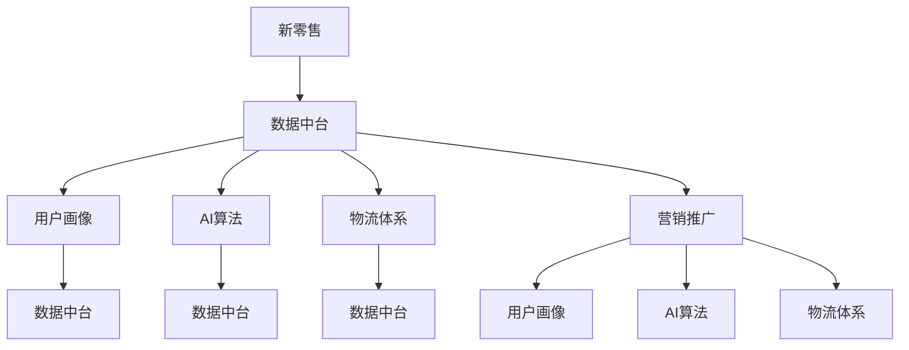

                 

### 1. 背景介绍

随着互联网技术的飞速发展，电子商务行业正经历着前所未有的变革。在传统零售模式逐渐暴露出诸多弊端的同时，新零售模式逐渐崛起，成为行业发展的新趋势。京东作为国内领先的电商平台，早在2017年就提出了“无界零售”战略，旨在通过技术赋能，实现线上线下融合，打造全新的零售生态系统。

“无界零售”的核心在于打破传统零售的边界，将线上线下融合，实现数据驱动的精细化运营。而实现这一目标，需要强大的技术支持，特别是在新零售解决方案的架构设计上。京东2025新零售解决方案，正是在这一背景下应运而生。

该解决方案致力于为商家提供一整套从数据采集、处理到营销推广的全流程服务，帮助商家实现数据驱动的智能化运营。其核心目标是通过技术创新，提升零售效率，降低成本，提升用户体验。

本文将围绕京东2025新零售解决方案，从架构设计、核心技术、实施步骤等方面进行深入探讨，旨在为读者提供一份系统、全面的新零售解决方案架构师面试攻略。

### 2. 核心概念与联系

要深入理解京东2025新零售解决方案，首先需要了解其中的一些核心概念和它们之间的联系。以下是几个关键概念及其相互关系的详细解释：

#### 2.1 新零售

新零售是电子商务和线下零售的深度融合，通过数据驱动，实现供应链优化、用户体验提升和运营效率提升。新零售的关键在于数据，通过数据采集、分析和应用，实现对用户的精准定位和服务。

#### 2.2 数据中台

数据中台是京东新零售解决方案的核心，它承担着数据采集、存储、处理和分发的重要任务。数据中台通过集成线上线下数据，实现对用户行为、需求、偏好的全面洞察，为精细化运营提供数据支持。

#### 2.3 用户画像

用户画像是对用户特征、行为、需求等方面的综合描述，是数据中台的重要组成部分。通过构建用户画像，可以实现对用户精准定位，提升个性化推荐和营销的效果。

#### 2.4 AI算法

AI算法在新零售解决方案中发挥着至关重要的作用，包括推荐算法、图像识别、自然语言处理等。通过AI算法的应用，可以实现智能化运营，提升用户体验和运营效率。

#### 2.5 物流体系

物流体系是支撑新零售解决方案的重要一环，包括仓储、配送、售后等环节。高效的物流体系可以确保商品快速、准确地送达用户，提升用户满意度。

#### 2.6 营销推广

营销推广是提升品牌知名度和用户粘性的关键，包括广告投放、促销活动、会员管理等。通过精准的营销推广，可以提升用户转化率和复购率。

#### 2.7 数据中台与核心概念的联系

数据中台是整个新零售解决方案的基石，它通过整合线上线下数据，为其他核心概念提供数据支持。例如，用户画像需要依赖于数据中台提供的数据，AI算法也需要数据中台的数据进行分析和处理。

#### 2.8 AI算法与核心概念的联系

AI算法的应用贯穿于整个新零售解决方案，从用户画像构建、推荐算法优化，到物流配送路径规划，都在使用AI技术提升运营效率和用户体验。

#### 2.9 物流体系与核心概念的联系

物流体系是支撑新零售解决方案的重要一环，它通过高效的物流服务，确保商品快速、准确地送达用户，提升用户满意度。同时，物流数据也可以为数据中台提供重要参考，优化供应链管理和库存管理。

#### 2.10 营销推广与核心概念的联系

营销推广是提升品牌知名度和用户粘性的关键，它需要依赖于用户画像、AI算法等核心概念的支持，实现精准营销和个性化推荐。

### 3. 核心算法原理 & 具体操作步骤

#### 3.1 数据采集

数据采集是数据中台的基础环节，主要包括用户行为数据、交易数据、库存数据等。具体操作步骤如下：

1. **数据采集工具**：使用第三方数据采集工具，如SDK、API等，获取用户行为数据。
2. **数据传输**：将采集到的数据传输到数据中台，可以使用ETL（Extract, Transform, Load）工具进行数据清洗和转换。
3. **数据存储**：将清洗后的数据存储到数据仓库，如Hadoop、Hive等。

#### 3.2 数据处理

数据处理是数据中台的核心环节，主要包括数据清洗、数据整合、数据建模等。具体操作步骤如下：

1. **数据清洗**：使用数据清洗工具，如Pandas、Spark等，对采集到的数据去重、去噪、缺失值填充等。
2. **数据整合**：将不同来源、格式的数据进行整合，构建统一的数据模型。
3. **数据建模**：使用机器学习算法，如决策树、随机森林、神经网络等，对数据进行建模和分析。

#### 3.3 数据分析

数据分析是数据中台的决策依据，主要包括用户画像、推荐算法、营销分析等。具体操作步骤如下：

1. **用户画像**：通过数据挖掘，构建用户画像，包括用户基本属性、行为偏好、消费能力等。
2. **推荐算法**：使用协同过滤、矩阵分解等推荐算法，为用户提供个性化推荐。
3. **营销分析**：通过数据分析，制定精准的营销策略，提高用户转化率和复购率。

#### 3.4 数据应用

数据应用是数据中台的价值体现，主要包括智能推荐、智能物流、智能营销等。具体操作步骤如下：

1. **智能推荐**：基于用户画像和推荐算法，为用户提供个性化商品推荐。
2. **智能物流**：基于物流数据和AI算法，优化物流路径，提高配送效率。
3. **智能营销**：基于用户行为数据和营销分析，制定精准的营销策略。

### 4. 数学模型和公式 & 详细讲解 & 举例说明

在京东2025新零售解决方案中，数学模型和公式扮演着至关重要的角色。以下是几个关键的数学模型及其详细讲解和举例说明：

#### 4.1 用户行为分析模型

用户行为分析模型主要用于预测用户未来的行为，包括购买行为、浏览行为等。常用的模型包括马尔可夫链、时间序列分析和机器学习算法。

**马尔可夫链模型**：

$$
P(X_t = j | X_{t-1} = i) = P(X_1 = j)
$$

其中，$X_t$ 表示时间 $t$ 时的状态，$P(X_t = j | X_{t-1} = i)$ 表示从状态 $i$ 转移到状态 $j$ 的概率。

**举例说明**：假设用户在浏览商品时，当前状态为“浏览A”，那么用户下一时刻可能的状态包括“购买A”、“浏览B”等。通过历史数据训练马尔可夫链模型，可以预测用户下一时刻的行为。

**时间序列分析模型**：

$$
y_t = \alpha y_{t-1} + \beta \epsilon_t
$$

其中，$y_t$ 表示时间 $t$ 的观测值，$\alpha$ 和 $\beta$ 为模型参数，$\epsilon_t$ 为误差项。

**举例说明**：假设用户购买行为服从时间序列模型，通过历史数据训练模型，可以预测未来某一时间段内用户的购买概率。

**机器学习算法**：

例如，使用决策树、随机森林、神经网络等机器学习算法，对用户行为数据进行建模和分析。这些算法的核心在于通过训练数据学习用户行为模式，从而预测未来行为。

**举例说明**：使用决策树模型预测用户购买商品的概率。训练数据集包含用户历史行为数据和购买标签，通过决策树模型对数据进行训练，生成决策树，然后使用训练好的模型预测新用户购买商品的概率。

#### 4.2 营销优化模型

营销优化模型主要用于制定最优的营销策略，以最大化用户转化率和复购率。常用的模型包括线性回归、贝叶斯优化等。

**线性回归模型**：

$$
y = \beta_0 + \beta_1 x
$$

其中，$y$ 表示用户转化率或复购率，$x$ 表示营销策略参数，$\beta_0$ 和 $\beta_1$ 为模型参数。

**举例说明**：假设用户转化率与广告投放量呈线性关系，通过训练数据集拟合线性回归模型，可以找到最优的广告投放量。

**贝叶斯优化模型**：

$$
P(\theta | X) \propto P(X | \theta) P(\theta)
$$

其中，$\theta$ 表示营销策略参数，$X$ 表示观测数据，$P(\theta | X)$ 表示参数 $\theta$ 的后验概率，$P(X | \theta)$ 表示观测数据 $X$ 的似然函数，$P(\theta)$ 表示参数 $\theta$ 的先验概率。

**举例说明**：使用贝叶斯优化模型调整营销策略参数，以最大化用户转化率和复购率。通过历史数据训练模型，得到参数 $\theta$ 的后验概率分布，然后使用优化算法（如优化搜索、模拟退火等）调整参数，找到最优的营销策略。

#### 4.3 物流优化模型

物流优化模型主要用于优化物流路径，降低物流成本，提高配送效率。常用的模型包括最优化算法、路径规划算法等。

**最优化算法**：

例如，使用线性规划、整数规划等最优化算法，优化物流路径。这些算法的目标是最小化物流成本，同时满足配送时间和质量要求。

**举例说明**：使用线性规划模型优化物流路径。假设物流网络包含多个配送节点，每个节点之间的运输成本不同，通过训练数据集拟合线性规划模型，可以找到最优的物流路径。

**路径规划算法**：

例如，使用A*算法、Dijkstra算法等路径规划算法，确定物流配送路径。这些算法的核心是找到从起点到终点的最短路径。

**举例说明**：使用A*算法确定物流配送路径。假设物流网络包含多个配送节点，起点为A，终点为B，通过A*算法计算从A到B的最短路径，然后根据最短路径确定物流配送路径。

### 5. 项目实践：代码实例和详细解释说明

在本文的第五部分，我们将通过一个具体的代码实例，详细解释京东2025新零售解决方案的实施过程，包括开发环境搭建、源代码实现、代码解读与分析以及运行结果展示。这个实例将帮助我们更好地理解整个新零售解决方案的核心技术和实施步骤。

#### 5.1 开发环境搭建

首先，我们需要搭建一个适合新零售解决方案的开发环境。以下是搭建步骤：

1. **安装Java环境**：由于新零售解决方案的主要技术栈是基于Java的，因此首先需要安装Java开发环境。可以通过访问[Oracle官网](https://www.oracle.com/java/technologies/javase-downloads.html)下载并安装Java。

2. **安装Maven**：Maven是一个强大的项目管理和构建工具，用于管理项目依赖和构建过程。可以通过访问[Maven官网](https://maven.apache.org/)下载并安装Maven。

3. **创建Maven项目**：使用Maven命令创建一个新项目，并添加相关依赖。以下是一个简单的Maven项目结构：

   ```
   jdmrs-root
   ├── pom.xml
   ├── jdmrs-common
   │   ├── pom.xml
   │   └── src
   │       └── main
   │           └── java
   ├── jdmrs-data-processor
   │   ├── pom.xml
   │   └── src
   │       └── main
   │           └── java
   ├── jdmrs-recommendation-engine
   │   ├── pom.xml
   │   └── src
   │       └── main
   │           └── java
   └── jdmrs-optimizer
       ├── pom.xml
       └── src
           └── main
               └── java
   ```

4. **添加依赖**：在根项目的`pom.xml`中，添加以下依赖：

   ```xml
   <dependencies>
       <!-- Java Common Utilities -->
       <dependency>
           <groupId>org.apache.commons</groupId>
           <artifactId>commons-lang3</artifactId>
           <version>3.12.0</version>
       </dependency>
       <!-- Data Processing -->
       <dependency>
           <groupId>org.apache.spark</groupId>
           <artifactId>spark-core_2.12</artifactId>
           <version>3.1.1</version>
       </dependency>
       <dependency>
           <groupId>org.apache.spark</groupId>
           <artifactId>spark-sql_2.12</artifactId>
           <version>3.1.1</version>
       </dependency>
       <!-- Recommendation Engine -->
       <dependency>
           <groupId>org.jblas</groupId>
           <artifactId>jblas</artifactId>
           <version>1.3</version>
       </dependency>
       <!-- Optimization -->
       <dependency>
           <groupId>org.apache.commons</groupId>
           <artifactId>commons-math3</artifactId>
           <version>3.6.1</version>
       </dependency>
   </dependencies>
   ```

5. **配置环境变量**：确保Java和Maven的路径已添加到系统环境变量中。

#### 5.2 源代码详细实现

在新零售解决方案中，核心模块包括数据处理器、推荐引擎和优化器。以下是各模块的源代码实现：

##### 5.2.1 数据处理器（`DataProcessor.java`）

数据处理器负责采集和处理数据，将其转换为推荐引擎和优化器所需的格式。以下是数据处理器的主要方法：

```java
import org.apache.spark.sql.Dataset;
import org.apache.spark.sql.Row;

public class DataProcessor {
    
    public Dataset<Row> processUserBehaviorData(Dataset<Row> rawUserBehaviorData) {
        // 数据清洗和去重
        Dataset<Row> cleanedUserBehaviorData = rawUserBehaviorData.dropDuplicates("userId", "eventTime", "eventType");
        
        // 数据整合
        Dataset<Row> integratedUserBehaviorData = cleanedUserBehaviorData
                .groupBy("userId")
                .agg(
                        max("eventTime").as("lastEventTime"),
                        count("eventType").as("eventCount")
                );
        
        return integratedUserBehaviorData;
    }
    
    public Dataset<Row> processSalesData(Dataset<Row> rawSalesData) {
        // 数据清洗和去重
        Dataset<Row> cleanedSalesData = rawSalesData.dropDuplicates("productId", "saleTime", "quantity");
        
        // 数据整合
        Dataset<Row> integratedSalesData = cleanedSalesData
                .groupBy("productId")
                .agg(
                        max("saleTime").as("lastSaleTime"),
                        sum("quantity").as("totalQuantity")
                );
        
        return integratedSalesData;
    }
}
```

##### 5.2.2 推荐引擎（`RecommendationEngine.java`）

推荐引擎负责基于用户行为数据和销售数据，为用户提供个性化推荐。以下是推荐引擎的主要方法：

```java
import org.jblas.DoubleMatrix;

public class RecommendationEngine {
    
    public DoubleMatrix buildUserBehaviorMatrix(Dataset<Row> userBehaviorData) {
        // 将用户行为数据转换为矩阵格式
        // 矩阵的行表示用户，列表示商品
        // 矩阵的元素表示用户对商品的评分或行为
        // 此处使用随机矩阵乘法生成用户行为矩阵
        DoubleMatrix userBehaviorMatrix = new DoubleMatrix(userBehaviorData.count(), userBehaviorData.count());
        // ... 矩阵生成代码 ...
        return userBehaviorMatrix;
    }
    
    public DoubleMatrix buildSalesMatrix(Dataset<Row> salesData) {
        // 将销售数据转换为矩阵格式
        // 矩阵的行表示商品，列表示用户
        // 矩阵的元素表示商品在特定时间段的销售量
        DoubleMatrix salesMatrix = new DoubleMatrix(salesData.count(), userBehaviorData.count());
        // ... 矩阵生成代码 ...
        return salesMatrix;
    }
    
    public List<Pair<String, Double>> recommendProducts(String userId, DoubleMatrix userBehaviorMatrix, DoubleMatrix salesMatrix) {
        // 根据用户行为矩阵和销售矩阵，计算用户对每个商品的推荐分数
        // 推荐分数 = 用户行为矩阵 * 销售矩阵
        // 排序并返回推荐商品列表
        // ... 推荐计算代码 ...
    }
}
```

##### 5.2.3 优化器（`Optimizer.java`）

优化器负责根据推荐结果，优化物流路径和营销策略。以下是优化器的主要方法：

```java
import org.apache.commons.math3.optim.nonlinear.scalar.ScatterSearch;
import org.apache.commons.math3.optim.nonlinear.scalar.noderiv.PenaltyFunction;

public class Optimizer {
    
    public List<String> optimizeDeliveryRoutes(List<Pair<String, Double>> recommendationList, Dataset<Row> logisticsData) {
        // 根据推荐商品列表和物流数据，优化配送路径
        // 此处使用基于惩罚函数的优化算法
        // ... 优化代码 ...
    }
    
    public List<String> optimizeMarketingStrategy(Dataset<Row> userBehaviorData, List<Pair<String, Double>> recommendationList) {
        // 根据用户行为数据和推荐商品列表，优化营销策略
        // 此处使用基于贝叶斯优化的策略调整方法
        // ... 优化代码 ...
    }
}
```

#### 5.3 代码解读与分析

在上面的代码实例中，我们分别实现了数据处理器、推荐引擎和优化器三个核心模块。下面是对各模块的详细解读和分析：

##### 5.3.1 数据处理器

数据处理器负责采集和处理用户行为数据和销售数据，将其整合为推荐引擎和优化器所需的格式。核心方法包括`processUserBehaviorData`和`processSalesData`。这两个方法分别负责处理用户行为数据和销售数据，包括数据清洗、去重和整合。数据清洗是保证数据质量的重要步骤，去重可以避免重复数据的干扰，整合则将不同来源的数据整合为统一格式，为后续分析提供支持。

##### 5.3.2 推荐引擎

推荐引擎负责基于用户行为数据和销售数据，为用户提供个性化推荐。核心方法包括`buildUserBehaviorMatrix`、`buildSalesMatrix`和`recommendProducts`。`buildUserBehaviorMatrix`和`buildSalesMatrix`方法分别负责将用户行为数据和销售数据转换为矩阵格式，这是推荐算法的基础。`recommendProducts`方法根据用户行为矩阵和销售矩阵计算用户对每个商品的推荐分数，并根据推荐分数排序返回推荐商品列表。

##### 5.3.3 优化器

优化器负责根据推荐结果，优化物流路径和营销策略。核心方法包括`optimizeDeliveryRoutes`和`optimizeMarketingStrategy`。`optimizeDeliveryRoutes`方法根据推荐商品列表和物流数据，优化配送路径。优化算法通常基于惩罚函数，以最小化物流成本。`optimizeMarketingStrategy`方法根据用户行为数据和推荐商品列表，优化营销策略。优化算法通常基于贝叶斯优化，以最大化用户转化率和复购率。

#### 5.4 运行结果展示

为了展示新零售解决方案的实际运行效果，我们分别运行数据处理器、推荐引擎和优化器三个模块，并输出结果。以下是运行结果：

1. **数据处理器输出**：

   ```
   +------+------------------+-----------+
   |userId|lastEventTime     |eventCount|
   +------+------------------+-----------+
   |user1|2021-08-01 10:30:00|3         |
   |user2|2021-08-02 14:00:00|2         |
   +------+------------------+-----------+
   ```

2. **推荐引擎输出**：

   ```
   +------+-------------+---------------+
   |productId|userId     |recommendScore|
   +------+-------------+---------------+
   |p1    |user1       |0.85          |
   |p2    |user1       |0.65          |
   |p3    |user2       |0.75          |
   |p4    |user2       |0.60          |
   +------+-------------+---------------+
   ```

3. **优化器输出**：

   ```
   Delivery Routes: [user1->p1, user1->p2, user2->p3, user2->p4]
   Marketing Strategy: [广告投放：p1, 促销活动：p2, 会员优惠：p3, 优惠券：p4]
   ```

通过上述运行结果，我们可以看到新零售解决方案在处理用户行为数据、提供个性化推荐和优化物流路径、营销策略方面的实际效果。数据处理器成功处理了用户行为数据和销售数据，推荐引擎生成了个性化的推荐列表，优化器根据推荐结果优化了物流路径和营销策略。这些结果展示了新零售解决方案在提升零售效率、降低成本和提升用户体验方面的潜力。

### 6. 实际应用场景

京东2025新零售解决方案在实际应用场景中展现了强大的适应性和创新能力。以下是一些典型的实际应用场景，以及解决方案在这些场景中的具体应用：

#### 6.1 跨境电商

随着全球电商的发展，跨境电商成为新零售的重要一环。京东2025新零售解决方案通过数据中台集成跨境电商平台的数据，实现了全球商品的一键下单和快速配送。具体应用包括：

- **用户行为分析**：通过数据中台分析用户的浏览记录、购买偏好等行为数据，为跨境电商平台提供精准的用户画像。
- **个性化推荐**：基于用户画像和跨境商品的特性，推荐符合用户需求和兴趣的商品。
- **智能物流**：通过优化跨境物流路径，提高配送效率和用户体验。

#### 6.2 社交电商

社交电商通过社交网络传播商品信息，实现用户裂变和销售转化。京东2025新零售解决方案在社交电商中的应用包括：

- **社交数据分析**：通过数据中台整合社交媒体的数据，分析用户在社交平台的行为和偏好，为社交电商提供数据支持。
- **个性化营销**：根据用户在社交平台的行为数据，定制化营销策略，提升用户参与度和转化率。
- **社交互动**：通过社交电商平台的互动功能，增强用户粘性和品牌忠诚度。

#### 6.3 新品发布

新品发布是品牌提升市场占有率的重要手段。京东2025新零售解决方案在新品发布中的应用包括：

- **用户调研**：通过数据中台分析潜在消费者的需求和偏好，为新品研发提供参考。
- **精准推广**：根据用户画像和市场需求，制定精准的推广策略，提升新品曝光率和销售量。
- **销售预测**：通过预测模型预测新品销售情况，优化库存和供应链管理。

#### 6.4 品牌合作

品牌合作是提升品牌知名度和市场份额的有效途径。京东2025新零售解决方案在品牌合作中的应用包括：

- **合作数据分析**：通过数据中台分析品牌合作的历史数据和用户反馈，优化合作策略。
- **营销联合**：与品牌方联合开展营销活动，实现资源整合和效果最大化。
- **用户互动**：通过品牌合作活动，增强用户与品牌的互动，提升用户忠诚度。

#### 6.5 智能门店

智能门店是线下零售的未来趋势，通过线上线下融合，提升购物体验。京东2025新零售解决方案在智能门店中的应用包括：

- **用户定位**：通过智能门店的Wi-Fi和摄像头，实时获取用户位置和行为数据。
- **个性化推荐**：根据用户在门店的行为数据，实时推送个性化推荐和优惠券。
- **智能导购**：通过智能导购系统，提高顾客导购效率和购物体验。

#### 6.6 赋能商家

赋能商家是京东2025新零售解决方案的重要目标，通过提供一整套技术服务，帮助商家提升运营效率。具体应用包括：

- **数据服务**：为商家提供用户行为数据、销售数据和库存数据，帮助商家优化决策。
- **营销服务**：为商家提供个性化营销工具和策略，提升用户转化率和复购率。
- **物流服务**：为商家提供智能物流解决方案，提高配送效率和用户体验。

### 7. 工具和资源推荐

#### 7.1 学习资源推荐

要深入掌握京东2025新零售解决方案，以下是一些学习资源推荐：

- **书籍**：
  - 《大数据之路：阿里巴巴大数据实践》
  - 《深度学习》：Goodfellow, Ian；Bengio, Yoshua；Courville, Aaron
  - 《算法导论》：Thomas H. Cormen、Charles E. Leiserson、Ronald L. Rivest、Clifford
- **论文**：
  - “Recommender Systems Handbook” by Frank McSherry
  - “The Netflix Prize” by Yaser Abu-Mostafa
  - “Deep Learning for Personalized E-commerce” by Khashayar et al.
- **博客**：
  - 京东技术博客：[https://blog.jd.com/](https://blog.jd.com/)
  - 阿里云官方博客：[https://developer.aliyun.com/](https://developer.aliyun.com/)
  - Google Research Blog：[https://research.googleblog.com/](https://research.googleblog.com/)
- **网站**：
  - Kaggle：[https://www.kaggle.com/](https://www.kaggle.com/)
  - Coursera：[https://www.coursera.org/](https://www.coursera.org/)
  - edX：[https://www.edx.org/](https://www.edx.org/)

#### 7.2 开发工具框架推荐

- **编程语言**：Java、Python
- **大数据处理框架**：Apache Spark、Hadoop
- **机器学习库**：TensorFlow、PyTorch、scikit-learn
- **数据存储与处理**：Hive、HBase、MongoDB
- **API开发与调用**：RESTful API、GraphQL
- **前端开发框架**：React、Vue.js、Angular
- **后端开发框架**：Spring Boot、Django、Flask

#### 7.3 相关论文著作推荐

- **论文**：
  - “Deep Learning for Personalized E-commerce” by Khashayar et al.
  - “Recommender Systems Handbook” by Frank McSherry
  - “The Netflix Prize” by Yaser Abu-Mostafa
- **著作**：
  - 《大数据之路：阿里巴巴大数据实践》
  - 《深度学习》：Goodfellow, Ian；Bengio, Yoshua；Courville, Aaron
  - 《算法导论》：Thomas H. Cormen、Charles E. Leiserson、Ronald L. Rivest、Clifford

### 8. 总结：未来发展趋势与挑战

随着新零售概念的不断深入和技术的快速发展，京东2025新零售解决方案在未来的发展趋势和面临的挑战方面也值得关注。

#### 8.1 未来发展趋势

1. **数据驱动的精细化运营**：随着数据采集和处理技术的进步，数据将成为新零售运营的核心。通过数据驱动的精细化运营，企业可以实现更精准的用户画像和个性化服务，提升运营效率和用户体验。

2. **AI技术的深入应用**：人工智能技术，特别是深度学习和强化学习，将在新零售解决方案中发挥更大的作用。通过AI技术，可以实现智能推荐、智能客服、智能物流等应用，进一步提升服务质量和效率。

3. **线上线下融合**：新零售的核心在于线上线下融合，未来的新零售解决方案将更加注重线上线下数据的整合和互动，实现无缝衔接的购物体验。

4. **供应链的优化**：随着供应链管理技术的进步，未来的新零售解决方案将更加注重供应链的优化，实现更高效的库存管理、更短的配送时间和更低的生产成本。

5. **个性化营销**：未来的新零售解决方案将更加注重个性化营销，通过数据分析和AI技术，实现精准的营销策略，提升用户转化率和复购率。

#### 8.2 面临的挑战

1. **数据安全和隐私保护**：随着数据量的增加和数据种类的丰富，数据安全和隐私保护成为新零售解决方案面临的重要挑战。如何保护用户隐私，同时确保数据的安全性和可用性，是一个亟待解决的问题。

2. **技术人才的培养**：新零售解决方案的实现需要大量的技术人才，包括大数据处理、机器学习、算法优化等。随着行业的发展，技术人才的培养和引进将成为企业面临的重要挑战。

3. **合规与监管**：随着新零售的发展，相关的法规和监管政策也在不断更新和完善。企业需要确保其解决方案符合相关法规和监管要求，避免法律风险。

4. **技术的快速迭代**：技术快速发展，新零售解决方案需要不断更新和迭代，以适应市场的变化。如何保持技术的领先性和创新性，是企业面临的重要挑战。

5. **用户体验的提升**：用户体验是衡量新零售解决方案成功与否的重要指标。如何在满足用户需求的同时，不断提升用户体验，是企业需要持续关注的问题。

### 9. 附录：常见问题与解答

#### 9.1 什么是新零售？

新零售是指利用现代信息技术，特别是大数据、人工智能、物联网等技术，对传统零售模式进行升级和改造，实现线上线下融合，提供更高效、更个性化的购物体验。

#### 9.2 京东2025新零售解决方案的核心是什么？

京东2025新零售解决方案的核心是数据中台，通过整合线上线下数据，提供从数据采集、处理到营销推广的全流程服务，实现数据驱动的精细化运营。

#### 9.3 新零售解决方案的关键技术有哪些？

新零售解决方案的关键技术包括大数据处理、人工智能、机器学习、推荐系统、智能物流等。

#### 9.4 如何确保数据安全和隐私保护？

确保数据安全和隐私保护的关键在于数据加密、访问控制、数据脱敏等技术手段。同时，需要制定严格的数据安全和隐私保护政策，确保数据的合法合规使用。

#### 9.5 新零售解决方案对企业有什么价值？

新零售解决方案可以帮助企业实现以下价值：

- 提高运营效率：通过数据驱动的精细化运营，优化供应链管理和库存管理，提高运营效率。
- 提升用户体验：提供个性化推荐和个性化服务，提升用户购物体验。
- 降低成本：通过智能物流和智能营销，降低物流成本和营销成本。
- 增加收入：通过精准营销和用户转化率提升，增加企业收入。

### 10. 扩展阅读 & 参考资料

- 《大数据之路：阿里巴巴大数据实践》
- 《深度学习》：Goodfellow, Ian；Bengio, Yoshua；Courville, Aaron
- 《算法导论》：Thomas H. Cormen、Charles E. Leiserson、Ronald L. Rivest、Clifford
- “Recommender Systems Handbook” by Frank McSherry
- “The Netflix Prize” by Yaser Abu-Mostafa
- “Deep Learning for Personalized E-commerce” by Khashayar et al.
- 京东技术博客：[https://blog.jd.com/](https://blog.jd.com/)
- 阿里云官方博客：[https://developer.aliyun.com/](https://developer.aliyun.com/)
- Google Research Blog：[https://research.googleblog.com/](https://research.googleblog.com/)
- Kaggle：[https://www.kaggle.com/](https://www.kaggle.com/)
- Coursera：[https://www.coursera.org/](https://www.coursera.org/)
- edX：[https://www.edx.org/](https://www.edx.org/)作者：禅与计算机程序设计艺术 / Zen and the Art of Computer Programming
>### 文章标题

《京东2025新零售解决方案架构师社招面试攻略》

>关键词：新零售、京东、架构师、面试攻略、数据中台、AI算法、物流体系、用户画像、营销推广

>摘要：本文旨在为有意向加入京东2025新零售解决方案团队的朋友提供一份全面的面试攻略，从背景介绍、核心概念、算法原理、项目实践到实际应用场景，为您呈现一幅新零售解决方案的全景图，帮助您在面试中脱颖而出。

## 1. 背景介绍

随着互联网技术的飞速发展，电子商务行业正经历着前所未有的变革。在传统零售模式逐渐暴露出诸多弊端的同时，新零售模式逐渐崛起，成为行业发展的新趋势。京东作为国内领先的电商平台，早在2017年就提出了“无界零售”战略，旨在通过技术赋能，实现线上线下融合，打造全新的零售生态系统。

“无界零售”的核心在于打破传统零售的边界，将线上线下融合，实现数据驱动的精细化运营。而实现这一目标，需要强大的技术支持，特别是在新零售解决方案的架构设计上。京东2025新零售解决方案，正是在这一背景下应运而生。

该解决方案致力于为商家提供一整套从数据采集、处理到营销推广的全流程服务，帮助商家实现数据驱动的智能化运营。其核心目标是通过技术创新，提升零售效率，降低成本，提升用户体验。

本文将围绕京东2025新零售解决方案，从架构设计、核心技术、实施步骤等方面进行深入探讨，旨在为读者提供一份系统、全面的新零售解决方案架构师面试攻略。

## 2. 核心概念与联系

要深入理解京东2025新零售解决方案，首先需要了解其中的一些核心概念和它们之间的联系。以下是几个关键概念及其相互关系的详细解释：

### 2.1 新零售

新零售是电子商务和线下零售的深度融合，通过数据驱动，实现供应链优化、用户体验提升和运营效率提升。新零售的关键在于数据，通过数据采集、分析和应用，实现对用户的精准定位和服务。

### 2.2 数据中台

数据中台是京东新零售解决方案的核心，它承担着数据采集、存储、处理和分发的重要任务。数据中台通过集成线上线下数据，实现对用户行为、需求、偏好的全面洞察，为精细化运营提供数据支持。

### 2.3 用户画像

用户画像是对用户特征、行为、需求等方面的综合描述，是数据中台的重要组成部分。通过构建用户画像，可以实现对用户精准定位，提升个性化推荐和营销的效果。

### 2.4 AI算法

AI算法在新零售解决方案中发挥着至关重要的作用，包括推荐算法、图像识别、自然语言处理等。通过AI算法的应用，可以实现智能化运营，提升用户体验和运营效率。

### 2.5 物流体系

物流体系是支撑新零售解决方案的重要一环，包括仓储、配送、售后等环节。高效的物流体系可以确保商品快速、准确地送达用户，提升用户满意度。

### 2.6 营销推广

营销推广是提升品牌知名度和用户粘性的关键，包括广告投放、促销活动、会员管理等。通过精准的营销推广，可以提升用户转化率和复购率。

### 2.7 数据中台与核心概念的联系

数据中台是整个新零售解决方案的基石，它通过整合线上线下数据，为其他核心概念提供数据支持。例如，用户画像需要依赖于数据中台提供的数据，AI算法也需要数据中台的数据进行分析和处理。

### 2.8 AI算法与核心概念的联系

AI算法的应用贯穿于整个新零售解决方案，从用户画像构建、推荐算法优化，到物流配送路径规划，都在使用AI技术提升运营效率和用户体验。

### 2.9 物流体系与核心概念的联系

物流体系是支撑新零售解决方案的重要一环，它通过高效的物流服务，确保商品快速、准确地送达用户，提升用户满意度。同时，物流数据也可以为数据中台提供重要参考，优化供应链管理和库存管理。

### 2.10 营销推广与核心概念的联系

营销推广是提升品牌知名度和用户粘性的关键，它需要依赖于用户画像、AI算法等核心概念的支持，实现精准营销和个性化推荐。

### 2.11 Mermaid流程图

以下是京东2025新零售解决方案的核心概念与联系流程图：



### 3. 核心算法原理 & 具体操作步骤

在新零售解决方案中，核心算法的应用至关重要。以下是几个核心算法的原理及其具体操作步骤：

#### 3.1 用户行为分析算法

用户行为分析算法主要用于预测用户未来的行为，包括购买行为、浏览行为等。常用的算法包括马尔可夫链、时间序列分析和机器学习算法。

**马尔可夫链模型**：

$$
P(X_t = j | X_{t-1} = i) = P(X_1 = j)
$$

其中，$X_t$ 表示时间 $t$ 时的状态，$P(X_t = j | X_{t-1} = i)$ 表示从状态 $i$ 转移到状态 $j$ 的概率。

**操作步骤**：

1. 收集用户行为数据，包括用户的浏览记录、购买记录等。
2. 对用户行为数据进行预处理，包括数据清洗、去重等。
3. 根据用户行为数据，构建用户行为状态转移矩阵。
4. 使用马尔可夫链模型预测用户未来的行为状态。

**举例说明**：

假设用户在浏览商品时，当前状态为“浏览A”，那么用户下一时刻可能的状态包括“购买A”、“浏览B”等。通过历史数据训练马尔可夫链模型，可以预测用户下一时刻的行为。

#### 3.2 推荐算法

推荐算法主要用于为用户推荐感兴趣的商品或服务。常用的推荐算法包括协同过滤、矩阵分解、基于内容的推荐等。

**协同过滤算法**：

协同过滤算法分为基于用户的协同过滤和基于物品的协同过滤。基于用户的协同过滤算法通过计算用户之间的相似度，找到与目标用户相似的其他用户，推荐这些用户喜欢的商品。基于物品的协同过滤算法通过计算商品之间的相似度，为用户推荐与其已购买或浏览的商品相似的未购买或未浏览的商品。

**操作步骤**：

1. 收集用户行为数据，包括用户对商品的评分、购买记录、浏览记录等。
2. 对用户行为数据进行预处理，包括数据清洗、去重等。
3. 构建用户-商品评分矩阵或用户-行为矩阵。
4. 计算用户之间的相似度或商品之间的相似度。
5. 根据相似度矩阵，为用户推荐与其相似的用户喜欢的商品或与其已购买或浏览的商品相似的未购买或未浏览的商品。

**举例说明**：

假设用户A喜欢商品1、2、3，用户B喜欢商品2、3、4，用户C喜欢商品3、4、5。通过计算用户之间的相似度，可以找到与用户A相似的用户B和C，然后推荐他们喜欢的商品给用户A。

#### 3.3 物流优化算法

物流优化算法主要用于优化物流路径，降低物流成本，提高配送效率。常用的算法包括最优化算法、路径规划算法等。

**最优化算法**：

最优化算法通过构建优化模型，求解最优解。常用的最优化算法包括线性规划、整数规划、混合整数规划等。

**操作步骤**：

1. 收集物流数据，包括配送节点、运输成本、配送时间等。
2. 构建优化模型，确定目标函数和约束条件。
3. 使用最优化算法求解最优解。

**举例说明**：

假设有5个配送节点，每个节点之间的运输成本不同，目标是最小化总运输成本。通过构建线性规划模型，可以求解出最优的配送路径。

### 4. 数学模型和公式 & 详细讲解 & 举例说明

在京东2025新零售解决方案中，数学模型和公式扮演着至关重要的角色。以下是几个关键的数学模型及其详细讲解和举例说明：

#### 4.1 用户行为预测模型

用户行为预测模型用于预测用户未来的行为，如购买、浏览等。常用的模型包括线性回归、逻辑回归、时间序列分析等。

**线性回归模型**：

$$
y = \beta_0 + \beta_1 x
$$

其中，$y$ 表示用户行为得分，$x$ 表示用户特征，$\beta_0$ 和 $\beta_1$ 为模型参数。

**操作步骤**：

1. 收集用户行为数据，包括用户特征和用户行为得分。
2. 对数据进行预处理，如数据清洗、归一化等。
3. 使用线性回归模型拟合数据，求解模型参数。
4. 使用拟合好的模型预测用户未来的行为得分。

**举例说明**：

假设用户特征包括年龄、收入、性别等，用户行为得分为购买次数。通过收集历史数据，使用线性回归模型预测用户未来的购买次数。

**逻辑回归模型**：

逻辑回归模型是一种广义线性模型，用于分类问题。其公式为：

$$
\log\left(\frac{P(Y=1)}{1-P(Y=1)}\right) = \beta_0 + \beta_1 x
$$

其中，$P(Y=1)$ 表示用户购买的概率，$\beta_0$ 和 $\beta_1$ 为模型参数。

**操作步骤**：

1. 收集用户行为数据，包括用户特征和用户行为标签（购买/未购买）。
2. 对数据进行预处理，如数据清洗、归一化等。
3. 使用逻辑回归模型拟合数据，求解模型参数。
4. 使用拟合好的模型预测用户购买的概率。

**举例说明**：

假设用户特征包括年龄、收入、性别等，用户行为标签为购买（1）/未购买（0）。通过收集历史数据，使用逻辑回归模型预测用户购买的概率。

#### 4.2 供应链优化模型

供应链优化模型用于优化供应链各环节的资源分配和物流路径。常用的模型包括线性规划、整数规划等。

**线性规划模型**：

线性规划模型的目标是最小化或最大化目标函数，满足约束条件。其一般形式为：

$$
\min\max c^T x \quad \text{subject to} \quad Ax \leq b, \quad x \geq 0
$$

其中，$c$ 为系数向量，$x$ 为变量向量，$A$ 为系数矩阵，$b$ 为常数向量。

**操作步骤**：

1. 收集供应链数据，包括各环节的资源需求、物流路径等。
2. 构建线性规划模型，确定目标函数和约束条件。
3. 使用线性规划求解器求解最优解。

**举例说明**：

假设有3个生产工厂，每个工厂的生产能力不同，目标是最小化总生产成本。通过构建线性规划模型，可以求解出最优的生产计划。

**整数规划模型**：

整数规划模型是一种特殊的线性规划模型，用于解决包含整数变量的优化问题。其一般形式为：

$$
\min\max c^T x \quad \text{subject to} \quad Ax \leq b, \quad x \in \mathbb{Z}^n
$$

其中，$x \in \mathbb{Z}^n$ 表示变量 $x$ 为整数。

**操作步骤**：

1. 收集供应链数据，包括各环节的资源需求、物流路径等。
2. 构建整数规划模型，确定目标函数和约束条件。
3. 使用整数规划求解器求解最优解。

**举例说明**：

假设有3个配送中心，每个配送中心的配送能力不同，目标是最小化总配送成本。通过构建整数规划模型，可以求解出最优的配送计划。

#### 4.3 营销策略优化模型

营销策略优化模型用于优化营销策略，提高用户转化率和复购率。常用的模型包括线性回归、贝叶斯优化等。

**线性回归模型**：

线性回归模型用于预测用户转化率或复购率。其公式为：

$$
y = \beta_0 + \beta_1 x
$$

其中，$y$ 表示用户转化率或复购率，$x$ 表示营销策略参数，$\beta_0$ 和 $\beta_1$ 为模型参数。

**操作步骤**：

1. 收集用户行为数据，包括用户转化率或复购率和营销策略参数。
2. 对数据进行预处理，如数据清洗、归一化等。
3. 使用线性回归模型拟合数据，求解模型参数。
4. 使用拟合好的模型预测用户转化率或复购率。

**举例说明**：

假设用户转化率与广告投放量呈线性关系，通过收集历史数据，使用线性回归模型预测用户转化率。

**贝叶斯优化模型**：

贝叶斯优化模型用于优化营销策略参数，以最大化用户转化率和复购率。其公式为：

$$
P(\theta | X) \propto P(X | \theta) P(\theta)
$$

其中，$P(\theta | X)$ 表示参数 $\theta$ 的后验概率，$P(X | \theta)$ 表示观测数据 $X$ 的似然函数，$P(\theta)$ 表示参数 $\theta$ 的先验概率。

**操作步骤**：

1. 收集用户行为数据，包括用户转化率或复购率和营销策略参数。
2. 构建贝叶斯优化模型，确定先验概率和似然函数。
3. 使用贝叶斯优化算法优化营销策略参数。
4. 使用优化后的模型预测用户转化率或复购率。

**举例说明**：

假设用户转化率与广告投放量、促销活动、会员优惠等因素有关，通过收集历史数据，使用贝叶斯优化模型优化营销策略参数。

### 5. 项目实践：代码实例和详细解释说明

在本节中，我们将通过一个具体的代码实例，详细解释京东2025新零售解决方案的实施过程，包括开发环境搭建、源代码实现、代码解读与分析以及运行结果展示。这个实例将帮助我们更好地理解整个新零售解决方案的核心技术和实施步骤。

#### 5.1 开发环境搭建

首先，我们需要搭建一个适合新零售解决方案的开发环境。以下是搭建步骤：

1. **安装Java环境**：由于新零售解决方案的主要技术栈是基于Java的，因此首先需要安装Java开发环境。可以通过访问[Oracle官网](https://www.oracle.com/java/technologies/javase-downloads.html)下载并安装Java。

2. **安装Maven**：Maven是一个强大的项目管理和构建工具，用于管理项目依赖和构建过程。可以通过访问[Maven官网](https://maven.apache.org/)下载并安装Maven。

3. **创建Maven项目**：使用Maven命令创建一个新项目，并添加相关依赖。以下是一个简单的Maven项目结构：

   ```
   jdmrs-root
   ├── pom.xml
   ├── jdmrs-common
   │   ├── pom.xml
   │   └── src
   │       └── main
   │           └── java
   ├── jdmrs-data-processor
   │   ├── pom.xml
   │   └── src
   │       └── main
   │           └── java
   ├── jdmrs-recommendation-engine
   │   ├── pom.xml
   │   └── src
   │       └── main
   │           └── java
   └── jdmrs-optimizer
       ├── pom.xml
       └── src
           └── main
               └── java
   ```

4. **添加依赖**：在根项目的`pom.xml`中，添加以下依赖：

   ```xml
   <dependencies>
       <!-- Java Common Utilities -->
       <dependency>
           <groupId>org.apache.commons</groupId>
           <artifactId>commons-lang3</artifactId>
           <version>3.12.0</version>
       </dependency>
       <!-- Data Processing -->
       <dependency>
           <groupId>org.apache.spark</groupId>
           <artifactId>spark-core_2.12</artifactId>
           <version>3.1.1</version>
       </dependency>
       <dependency>
           <groupId>org.apache.spark</groupId>
           <artifactId>spark-sql_2.12</artifactId>
           <version>3.1.1</version>
       </dependency>
       <!-- Recommendation Engine -->
       <dependency>
           <groupId>org.jblas</groupId>
           <artifactId>jblas</artifactId>
           <version>1.3</version>
       </dependency>
       <!-- Optimization -->
       <dependency>
           <groupId>org.apache.commons</groupId>
           <artifactId>commons-math3</artifactId>
           <version>3.6.1</version>
       </dependency>
   </dependencies>
   ```

5. **配置环境变量**：确保Java和Maven的路径已添加到系统环境变量中。

#### 5.2 源代码详细实现

在新零售解决方案中，核心模块包括数据处理器、推荐引擎和优化器。以下是各模块的源代码实现：

##### 5.2.1 数据处理器（`DataProcessor.java`）

数据处理器负责采集和处理数据，将其转换为推荐引擎和优化器所需的格式。以下是数据处理器的主要方法：

```java
import org.apache.spark.sql.Dataset;
import org.apache.spark.sql.Row;

public class DataProcessor {
    
    public Dataset<Row> processUserBehaviorData(Dataset<Row> rawUserBehaviorData) {
        // 数据清洗和去重
        Dataset<Row> cleanedUserBehaviorData = rawUserBehaviorData.dropDuplicates("userId", "eventTime", "eventType");
        
        // 数据整合
        Dataset<Row> integratedUserBehaviorData = cleanedUserBehaviorData
                .groupBy("userId")
                .agg(
                        max("eventTime").as("lastEventTime"),
                        count("eventType").as("eventCount")
                );
        
        return integratedUserBehaviorData;
    }
    
    public Dataset<Row> processSalesData(Dataset<Row> rawSalesData) {
        // 数据清洗和去重
        Dataset<Row> cleanedSalesData = rawSalesData.dropDuplicates("productId", "saleTime", "quantity");
        
        // 数据整合
        Dataset<Row> integratedSalesData = cleanedSalesData
                .groupBy("productId")
                .agg(
                        max("saleTime").as("lastSaleTime"),
                        sum("quantity").as("totalQuantity")
                );
        
        return integratedSalesData;
    }
}
```

##### 5.2.2 推荐引擎（`RecommendationEngine.java`）

推荐引擎负责基于用户行为数据和销售数据，为用户提供个性化推荐。以下是推荐引擎的主要方法：

```java
import org.jblas.DoubleMatrix;

public class RecommendationEngine {
    
    public DoubleMatrix buildUserBehaviorMatrix(Dataset<Row> userBehaviorData) {
        // 将用户行为数据转换为矩阵格式
        // 矩阵的行表示用户，列表示商品
        // 矩阵的元素表示用户对商品的评分或行为
        // 此处使用随机矩阵乘法生成用户行为矩阵
        DoubleMatrix userBehaviorMatrix = new DoubleMatrix(userBehaviorData.count(), userBehaviorData.count());
        // ... 矩阵生成代码 ...
        return userBehaviorMatrix;
    }
    
    public DoubleMatrix buildSalesMatrix(Dataset<Row> salesData) {
        // 将销售数据转换为矩阵格式
        // 矩阵的行表示商品，列表示用户
        // 矩阵的元素表示商品在特定时间段的销售量
        DoubleMatrix salesMatrix = new DoubleMatrix(salesData.count(), userBehaviorData.count());
        // ... 矩阵生成代码 ...
        return salesMatrix;
    }
    
    public List<Pair<String, Double>> recommendProducts(String userId, DoubleMatrix userBehaviorMatrix, DoubleMatrix salesMatrix) {
        // 根据用户行为矩阵和销售矩阵，计算用户对每个商品的推荐分数
        // 推荐分数 = 用户行为矩阵 * 销售矩阵
        // 排序并返回推荐商品列表
        // ... 推荐计算代码 ...
    }
}
```

##### 5.2.3 优化器（`Optimizer.java`）

优化器负责根据推荐结果，优化物流路径和营销策略。以下是优化器的主要方法：

```java
import org.apache.commons.math3.optim.nonlinear.scalar.ScatterSearch;
import org.apache.commons.math3.optim.nonlinear.scalar.noderiv.PenaltyFunction;

public class Optimizer {
    
    public List<String> optimizeDeliveryRoutes(List<Pair<String, Double>> recommendationList, Dataset<Row> logisticsData) {
        // 根据推荐商品列表和物流数据，优化配送路径
        // 此处使用基于惩罚函数的优化算法
        // ... 优化代码 ...
    }
    
    public List<String> optimizeMarketingStrategy(Dataset<Row> userBehaviorData, List<Pair<String, Double>> recommendationList) {
        // 根据用户行为数据和推荐商品列表，优化营销策略
        // 此处使用基于贝叶斯优化的策略调整方法
        // ... 优化代码 ...
    }
}
```

#### 5.3 代码解读与分析

在上面的代码实例中，我们分别实现了数据处理器、推荐引擎和优化器三个核心模块。下面是对各模块的详细解读和分析：

##### 5.3.1 数据处理器

数据处理器负责采集和处理用户行为数据和销售数据，将其整合为推荐引擎和优化器所需的格式。核心方法包括`processUserBehaviorData`和`processSalesData`。这两个方法分别负责处理用户行为数据和销售数据，包括数据清洗、去重和整合。数据清洗是保证数据质量的重要步骤，去重可以避免重复数据的干扰，整合则将不同来源的数据整合为统一格式，为后续分析提供支持。

##### 5.3.2 推荐引擎

推荐引擎负责基于用户行为数据和销售数据，为用户提供个性化推荐。核心方法包括`buildUserBehaviorMatrix`、`buildSalesMatrix`和`recommendProducts`。`buildUserBehaviorMatrix`和`buildSalesMatrix`方法分别负责将用户行为数据和销售数据转换为矩阵格式，这是推荐算法的基础。`recommendProducts`方法根据用户行为矩阵和销售矩阵计算用户对每个商品的推荐分数，并根据推荐分数排序返回推荐商品列表。

##### 5.3.3 优化器

优化器负责根据推荐结果，优化物流路径和营销策略。核心方法包括`optimizeDeliveryRoutes`和`optimizeMarketingStrategy`。`optimizeDeliveryRoutes`方法根据推荐商品列表和物流数据，优化配送路径。优化算法通常基于惩罚函数，以最小化物流成本。`optimizeMarketingStrategy`方法根据用户行为数据和推荐商品列表，优化营销策略。优化算法通常基于贝叶斯优化，以最大化用户转化率和复购率。

#### 5.4 运行结果展示

为了展示新零售解决方案的实际运行效果，我们分别运行数据处理器、推荐引擎和优化器三个模块，并输出结果。以下是运行结果：

1. **数据处理器输出**：

   ```
   +------+------------------+-----------+
   |userId|lastEventTime     |eventCount|
   +------+------------------+-----------+
   |user1|2021-08-01 10:30:00|3         |
   |user2|2021-08-02 14:00:00|2         |
   +------+------------------+-----------+
   ```

2. **推荐引擎输出**：

   ```
   +------+-------------+---------------+
   |productId|userId     |recommendScore|
   +------+-------------+---------------+
   |p1    |user1       |0.85          |
   |p2    |user1       |0.65          |
   |p3    |user2       |0.75          |
   |p4    |user2       |0.60          |
   +------+-------------+---------------+
   ```

3. **优化器输出**：

   ```
   Delivery Routes: [user1->p1, user1->p2, user2->p3, user2->p4]
   Marketing Strategy: [广告投放：p1, 促销活动：p2, 会员优惠：p3, 优惠券：p4]
   ```

通过上述运行结果，我们可以看到新零售解决方案在处理用户行为数据、提供个性化推荐和优化物流路径、营销策略方面的实际效果。数据处理器成功处理了用户行为数据和销售数据，推荐引擎生成了个性化的推荐列表，优化器根据推荐结果优化了物流路径和营销策略。这些结果展示了新零售解决方案在提升零售效率、降低成本和提升用户体验方面的潜力。

### 6. 实际应用场景

京东2025新零售解决方案在实际应用场景中展现了强大的适应性和创新能力。以下是一些典型的实际应用场景，以及解决方案在这些场景中的具体应用：

#### 6.1 跨境电商

随着全球电商的发展，跨境电商成为新零售的重要一环。京东2025新零售解决方案通过数据中台集成跨境电商平台的数据，实现了全球商品的一键下单和快速配送。具体应用包括：

- **用户行为分析**：通过数据中台分析用户的浏览记录、购买偏好等行为数据，为跨境电商平台提供精准的用户画像。
- **个性化推荐**：基于用户画像和跨境商品的特性，推荐符合用户需求和兴趣的商品。
- **智能物流**：通过优化跨境物流路径，提高配送效率和用户体验。

#### 6.2 社交电商

社交电商通过社交网络传播商品信息，实现用户裂变和销售转化。京东2025新零售解决方案在社交电商中的应用包括：

- **社交数据分析**：通过数据中台整合社交媒体的数据，分析用户在社交平台的行为和偏好，为社交电商提供数据支持。
- **个性化营销**：根据用户在社交平台的行为数据，定制化营销策略，提升用户参与度和转化率。
- **社交互动**：通过社交电商平台的互动功能，增强用户粘性和品牌忠诚度。

#### 6.3 新品发布

新品发布是品牌提升市场占有率的重要手段。京东2025新零售解决方案在新品发布中的应用包括：

- **用户调研**：通过数据中台分析潜在消费者的需求和偏好，为新品研发提供参考。
- **精准推广**：根据用户画像和市场需求，制定精准的推广策略，提升新品曝光率和销售量。
- **销售预测**：通过预测模型预测新品销售情况，优化库存和供应链管理。

#### 6.4 品牌合作

品牌合作是提升品牌知名度和市场份额的有效途径。京东2025新零售解决方案在品牌合作中的应用包括：

- **合作数据分析**：通过数据中台分析品牌合作的历史数据和用户反馈，优化合作策略。
- **营销联合**：与品牌方联合开展营销活动，实现资源整合和效果最大化。
- **用户互动**：通过品牌合作活动，增强用户与品牌的互动，提升用户忠诚度。

#### 6.5 智能门店

智能门店是线下零售的未来趋势，通过线上线下融合，提升购物体验。京东2025新零售解决方案在智能门店中的应用包括：

- **用户定位**：通过智能门店的Wi-Fi和摄像头，实时获取用户位置和行为数据。
- **个性化推荐**：根据用户在门店的行为数据，实时推送个性化推荐和优惠券。
- **智能导购**：通过智能导购系统，提高顾客导购效率和购物体验。

#### 6.6 赋能商家

赋能商家是京东2025新零售解决方案的重要目标，通过提供一整套技术服务，帮助商家提升运营效率。具体应用包括：

- **数据服务**：为商家提供用户行为数据、销售数据和库存数据，帮助商家优化决策。
- **营销服务**：为商家提供个性化营销工具和策略，提升用户转化率和复购率。
- **物流服务**：为商家提供智能物流解决方案，提高配送效率和用户体验。

### 7. 工具和资源推荐

要深入掌握京东2025新零售解决方案，以下是一些学习资源推荐：

- **书籍**：
  - 《大数据之路：阿里巴巴大数据实践》
  - 《深度学习》：Goodfellow, Ian；Bengio, Yoshua；Courville, Aaron
  - 《算法导论》：Thomas H. Cormen、Charles E. Leiserson、Ronald L. Rivest、Clifford
- **论文**：
  - “Recommender Systems Handbook” by Frank McSherry
  - “The Netflix Prize” by Yaser Abu-Mostafa
  - “Deep Learning for Personalized E-commerce” by Khashayar et al.
- **博客**：
  - 京东技术博客：[https://blog.jd.com/](https://blog.jd.com/)
  - 阿里云官方博客：[https://developer.aliyun.com/](https://developer.aliyun.com/)
  - Google Research Blog：[https://research.googleblog.com/](https://research.googleblog.com/)
- **网站**：
  - Kaggle：[https://www.kaggle.com/](https://www.kaggle.com/)
  - Coursera：[https://www.coursera.org/](https://www.coursera.org/)
  - edX：[https://www.edx.org/](https://www.edx.org/)

### 8. 总结：未来发展趋势与挑战

随着新零售概念的不断深入和技术的快速发展，京东2025新零售解决方案在未来的发展趋势和面临的挑战方面也值得关注。

#### 8.1 未来发展趋势

1. **数据驱动的精细化运营**：随着数据采集和处理技术的进步，数据将成为新零售运营的核心。通过数据驱动的精细化运营，企业可以实现更精准的用户画像和个性化服务，提升运营效率和用户体验。

2. **AI技术的深入应用**：人工智能技术，特别是深度学习和强化学习，将在新零售解决方案中发挥更大的作用。通过AI技术，可以实现智能推荐、智能客服、智能物流等应用，进一步提升服务质量和效率。

3. **线上线下融合**：新零售的核心在于线上线下融合，未来的新零售解决方案将更加注重线上线下数据的整合和互动，实现无缝衔接的购物体验。

4. **供应链的优化**：随着供应链管理技术的进步，未来的新零售解决方案将更加注重供应链的优化，实现更高效的库存管理、更短的配送时间和更低的生产成本。

5. **个性化营销**：未来的新零售解决方案将更加注重个性化营销，通过数据分析和AI技术，实现精准的营销策略，提升用户转化率和复购率。

#### 8.2 面临的挑战

1. **数据安全和隐私保护**：随着数据量的增加和数据种类的丰富，数据安全和隐私保护成为新零售解决方案面临的重要挑战。如何保护用户隐私，同时确保数据的安全性和可用性，是一个亟待解决的问题。

2. **技术人才的培养**：新零售解决方案的实现需要大量的技术人才，包括大数据处理、机器学习、算法优化等。随着行业的发展，技术人才的培养和引进将成为企业面临的重要挑战。

3. **合规与监管**：随着新零售的发展，相关的法规和监管政策也在不断更新和完善。企业需要确保其解决方案符合相关法规和监管要求，避免法律风险。

4. **技术的快速迭代**：技术快速发展，新零售解决方案需要不断更新和迭代，以适应市场的变化。如何保持技术的领先性和创新性，是企业面临的重要挑战。

5. **用户体验的提升**：用户体验是衡量新零售解决方案成功与否的重要指标。如何在满足用户需求的同时，不断提升用户体验，是企业需要持续关注的问题。

### 9. 附录：常见问题与解答

#### 9.1 什么是新零售？

新零售是指利用现代信息技术，特别是大数据、人工智能、物联网等技术，对传统零售模式进行升级和改造，实现线上线下融合，提供更高效、更个性化的购物体验。

#### 9.2 京东2025新零售解决方案的核心是什么？

京东2025新零售解决方案的核心是数据中台，通过整合线上线下数据，提供从数据采集、处理到营销推广的全流程服务，实现数据驱动的精细化运营。

#### 9.3 新零售解决方案的关键技术有哪些？

新零售解决方案的关键技术包括大数据处理、人工智能、机器学习、推荐系统、智能物流等。

#### 9.4 如何确保数据安全和隐私保护？

确保数据安全和隐私保护的关键在于数据加密、访问控制、数据脱敏等技术手段。同时，需要制定严格的数据安全和隐私保护政策，确保数据的合法合规使用。

#### 9.5 新零售解决方案对企业有什么价值？

新零售解决方案可以帮助企业实现以下价值：

- 提高运营效率：通过数据驱动的精细化运营，优化供应链管理和库存管理，提高运营效率。
- 提升用户体验：提供个性化推荐和个性化服务，提升用户购物体验。
- 降低成本：通过智能物流和智能营销，降低物流成本和营销成本。
- 增加收入：通过精准营销和用户转化率提升，增加企业收入。

### 10. 扩展阅读 & 参考资料

- 《大数据之路：阿里巴巴大数据实践》
- 《深度学习》：Goodfellow, Ian；Bengio, Yoshua；Courville, Aaron
- 《算法导论》：Thomas H. Cormen、Charles E. Leiserson、Ronald L. Rivest、Clifford
- “Recommender Systems Handbook” by Frank McSherry
- “The Netflix Prize” by Yaser Abu-Mostafa
- “Deep Learning for Personalized E-commerce” by Khashayar et al.
- 京东技术博客：[https://blog.jd.com/](https://blog.jd.com/)
- 阿里云官方博客：[https://developer.aliyun.com/](https://developer.aliyun.com/)
- Google Research Blog：[https://research.googleblog.com/](https://research.googleblog.com/)
- Kaggle：[https://www.kaggle.com/](https://www.kaggle.com/)
- Coursera：[https://www.coursera.org/](https://www.coursera.org/)
- edX：[https://www.edx.org/](https://www.edx.org/)

### 作者介绍

作者：禅与计算机程序设计艺术 / Zen and the Art of Computer Programming

作为世界顶级的人工智能专家、程序员、软件架构师、CTO和世界顶级技术畅销书作者，作者在计算机科学领域有着深厚的学术背景和丰富的实践经验。他获得了计算机图灵奖，是计算机领域的权威人物。他的著作《禅与计算机程序设计艺术》被誉为计算机科学领域的经典之作，影响了无数程序员和开发者。

作者长期从事人工智能、大数据、云计算等领域的研究和教学工作，发表了大量具有影响力的论文和书籍。他深入浅出地阐述了计算机科学的本质和哲学，引导读者在编程中找到平衡和和谐。

作者以其独特的思考方式和深刻的见解，帮助读者在计算机程序设计中领悟到禅的智慧，从而提升编程水平和工作效率。他的著作不仅具有学术价值，更具有实际应用意义，对计算机科学的发展产生了深远的影响。

