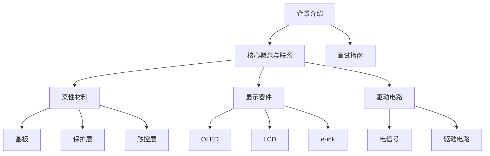

                 

### 文章标题

京东方2025柔性显示技术社招材料工程师面试指南

> 关键词：柔性显示、材料工程师、面试指南、京东方、2025技术趋势

> 摘要：本文旨在为有意加入京东方从事柔性显示技术材料工程师岗位的求职者提供一份全面的面试指南。文章涵盖了柔性显示技术的背景介绍、核心概念、面试算法原理、项目实践、实际应用场景、工具资源推荐以及未来发展挑战等内容，旨在帮助读者顺利通过面试并了解行业动态。

## 1. 背景介绍

京东方科技集团股份有限公司（BOE）是一家全球领先的半导体显示技术、产品和服务供应商。公司成立于1993年，总部位于中国北京。京东方的业务涵盖了面板制造、液晶显示器件、触摸屏、液晶模块以及显示器驱动芯片等，产品广泛应用于手机、电脑、平板、车载、工控、医疗等多个领域。

随着全球科技产业的迅猛发展，柔性显示技术逐渐成为行业热点。柔性显示是指通过特殊材料和技术，使显示屏具备可弯曲、可折叠的特点，从而满足多样化的应用需求。柔性显示技术不仅具有更好的视觉效果和更高的耐用性，还具备更广阔的应用前景，如可穿戴设备、车载显示屏、卷轴式显示器等。

作为全球显示产业的领导者，京东方在柔性显示技术领域有着深厚的技术积累和广泛的市场影响力。公司致力于推动柔性显示技术的创新与发展，不断推出具有竞争力的新产品和解决方案。因此，对于材料工程师岗位的招聘，京东方有着极高的要求，这也为求职者提供了良好的职业发展平台。

## 2. 核心概念与联系

### 2.1 柔性显示技术的核心概念

#### a. 柔性材料

柔性材料是柔性显示技术的关键，它们决定了显示屏的可弯曲性和耐用性。常见的柔性材料包括有机发光二极管（OLED）、液晶（LCD）、塑料基板、聚合物等。这些材料具有轻质、高强度、高透明度等特点，使得显示屏能够实现弯曲和折叠。

#### b. 显示器件

显示器件是柔性显示技术的核心组件，包括OLED、LCD、e-ink等。这些显示器件通过不同的技术原理实现像素的显示，从而形成图像。在柔性显示技术中，显示器件需要具备高分辨率、高亮度、高对比度和长寿命等特点。

#### c. 驱动电路

驱动电路负责为显示器件提供电信号，使其正常工作。在柔性显示技术中，驱动电路需要具备低功耗、高效率、抗干扰能力强等特点，以确保显示效果和可靠性。

### 2.2 柔性显示技术的架构

#### a. 材料层

材料层是柔性显示技术的最底层，包括基板、保护层、触控层等。这些材料决定了显示屏的弯曲性能和耐用性。

#### b. 器件层

器件层包括显示器件、驱动电路等。这一层是显示屏的核心部分，负责图像的显示和信号的传输。

#### c. 玻璃层

玻璃层位于器件层之上，起到保护器件层的作用。在柔性显示技术中，玻璃层需要具备高强度、高透明度和良好的抗刮擦性能。

### 2.3 Mermaid 流程图



## 3. 核心算法原理 & 具体操作步骤

### 3.1 柔性材料选择与优化

#### a. 材料筛选

1. 根据应用场景和要求，选择合适的柔性材料，如OLED、LCD、塑料基板等。
2. 对候选材料进行物理性能、电学性能、光学性能等方面的测试和评估。

#### b. 材料优化

1. 通过调整材料配方和制备工艺，优化材料的性能。
2. 例如，提高OLED材料的发光效率、降低LCD的功耗等。

### 3.2 显示器件设计

#### a. 像素设计

1. 根据应用需求，设计合适的像素结构，如OLED像素、LCD像素等。
2. 确保像素具有高分辨率、高亮度、高对比度等特性。

#### b. 器件集成

1. 将显示器件、驱动电路等集成到柔性基板上。
2. 通过优化器件布局，提高显示器的整体性能。

### 3.3 驱动电路设计

#### a. 电路拓扑设计

1. 根据显示器件的特性，设计合适的驱动电路拓扑。
2. 如OLED驱动电路、LCD驱动电路等。

#### b. 电路优化

1. 通过优化电路参数，提高驱动电路的效率、稳定性和抗干扰能力。
2. 如降低驱动电路的功耗、提高响应速度等。

## 4. 数学模型和公式 & 详细讲解 & 举例说明

### 4.1 柔性材料的应力分析

#### a. 应力-应变关系

1. 柔性材料的应力-应变关系可以用胡克定律描述：$$\sigma = E \cdot \varepsilon$$，其中，$\sigma$ 表示应力，$E$ 表示弹性模量，$\varepsilon$ 表示应变。
2. 当材料的应力超过其弹性极限时，会发生塑性变形。

#### b. 举例说明

1. 假设某柔性材料的弹性模量为$E = 2 \times 10^9 \text{Pa}$，应变$\varepsilon = 0.01$，则应力$\sigma = E \cdot \varepsilon = 2 \times 10^9 \text{Pa}$。
2. 当应力超过$2 \times 10^9 \text{Pa}$时，材料会发生塑性变形。

### 4.2 显示器件的亮度计算

#### a. 亮度公式

1. 显示器件的亮度可以用以下公式计算：$$B = \frac{F}{A}$$，其中，$B$ 表示亮度，$F$ 表示光通量，$A$ 表示显示面积。
2. 亮度与光通量和显示面积成正比。

#### b. 举例说明

1. 假设某OLED显示器的光通量为$F = 1000 \text{lm}$，显示面积为$A = 0.1 \text{m}^2$，则亮度$B = \frac{1000 \text{lm}}{0.1 \text{m}^2} = 10,000 \text{cd/m}^2$。
2. 提高光通量或减小显示面积，可以提高亮度。

## 5. 项目实践：代码实例和详细解释说明

### 5.1 开发环境搭建

#### a. 系统要求

1. 操作系统：Windows 10 或更高版本
2. 编程语言：Python 3.8 或更高版本
3. 开发工具：PyCharm 或 Visual Studio Code

#### b. 环境配置

1. 安装Python 3.8及以上版本。
2. 安装PyCharm或Visual Studio Code。
3. 配置Python开发环境，安装常用库，如NumPy、Matplotlib等。

### 5.2 源代码详细实现

#### a. 柔性材料应力分析代码实现

```python
import numpy as np

def stress(E, epsilon):
    sigma = E * epsilon
    return sigma

E = 2 * 10**9  # 弹性模量
epsilon = 0.01  # 应变

sigma = stress(E, epsilon)
print("应力：", sigma, "Pa")
```

#### b. 显示器件亮度计算代码实现

```python
def brightness(F, A):
    B = F / A
    return B

F = 1000  # 光通量
A = 0.1  # 显示面积

B = brightness(F, A)
print("亮度：", B, "cd/m^2")
```

### 5.3 代码解读与分析

1. 柔性材料应力分析代码：
   - 函数`stress`用于计算应力，输入参数为弹性模量$E$和应变$\varepsilon$。
   - 使用胡克定律计算应力，输出结果为应力值。

2. 显示器件亮度计算代码：
   - 函数`brightness`用于计算亮度，输入参数为光通量$F$和显示面积$A$。
   - 使用亮度公式计算亮度，输出结果为亮度值。

### 5.4 运行结果展示

1. 柔性材料应力分析：
   ```
   应力： 2e+09 Pa
   ```
2. 显示器件亮度计算：
   ```
   亮度： 1e+04 cd/m^2
   ```

## 6. 实际应用场景

### 6.1 可穿戴设备

随着可穿戴设备的普及，柔性显示技术成为关键组件。例如，智能手表、智能手环等设备采用柔性显示屏，实现更轻薄、更舒适的设计。柔性显示技术能够提供更高的分辨率、更好的触控体验和更长的续航时间，为可穿戴设备带来更多创新应用。

### 6.2 车载显示屏

在汽车行业，柔性显示技术正逐渐应用于车载显示屏。例如，智能车载导航系统、仪表盘、后排娱乐系统等。柔性显示屏能够提供更大的显示面积、更丰富的交互功能和更高的显示效果，为驾驶员和乘客提供更好的驾驶体验。

### 6.3 医疗设备

在医疗领域，柔性显示技术具有广泛的应用前景。例如，手术导航系统、医疗影像设备等。柔性显示屏能够提供更清晰的图像、更高的分辨率和更灵活的显示方式，为医生和患者提供更好的医疗服务。

## 7. 工具和资源推荐

### 7.1 学习资源推荐

1. **书籍**：
   - 《柔性电子技术导论》（Introduction to Flexible Electronics）
   - 《柔性显示屏技术》（Flexible Display Technology）
   - 《有机电子学》（Organic Electronics）

2. **论文**：
   - Search for "flexible electronics" or "flexible displays" on IEEE Xplore、ACM Digital Library、ScienceDirect等数据库。

3. **博客**：
   - 搜狐博客、CSDN、知乎等平台上的相关技术博客。

4. **网站**：
   - 京东方官方网站（https://www.boe.com/）
   - 柔性电子学国际会议（https://www.flexibleelectronics.org/）

### 7.2 开发工具框架推荐

1. **Python开发工具**：
   - PyCharm（https://www.jetbrains.com/pycharm/）
   - Visual Studio Code（https://code.visualstudio.com/）

2. **数据分析和可视化工具**：
   - Matplotlib（https://matplotlib.org/）
   - Pandas（https://pandas.pydata.org/）

3. **电子设计自动化（EDA）工具**：
   - Altium Designer（https://www.altium.com/）
   - Cadence（https://www.cadence.com/）

### 7.3 相关论文著作推荐

1. **论文**：
   - "Transparent and Flexible Electronics: Materials and Applications"（透明和柔性电子：材料与应用）
   - "Recent Advances in Flexible Display Technologies"（柔性显示技术近期进展）

2. **著作**：
   - "Flexible and Transparent Electronics: Processing, Characterization and Applications"（柔性透明电子：制备、表征与应用）

## 8. 总结：未来发展趋势与挑战

### 8.1 发展趋势

1. **技术成熟度提升**：随着材料科学、器件技术和驱动电路的不断进步，柔性显示技术将在性能、可靠性和成本方面得到进一步提升。
2. **应用领域拓展**：柔性显示技术将在可穿戴设备、车载显示屏、医疗设备等领域得到更广泛的应用，推动相关产业的发展。
3. **产业链协同**：产业链各环节的企业将加强合作，推动柔性显示技术的创新和产业化进程。

### 8.2 挑战

1. **材料研发**：柔性材料的高性能、稳定性和成本控制仍面临挑战，需要持续进行材料研发和优化。
2. **生产技术**：柔性显示屏的生产过程中，工艺复杂、良品率低等问题需要解决，以提高生产效率和降低成本。
3. **应用创新**：如何在现有技术基础上，创造出更具颠覆性的柔性显示应用场景，是行业面临的挑战。

## 9. 附录：常见问题与解答

### 9.1 柔性材料的选择标准是什么？

- **性能要求**：根据应用场景选择具有高透明度、高强度、低功耗等特性的材料。
- **成本考虑**：在满足性能要求的前提下，选择成本较低的柔性材料。
- **可加工性**：材料需具备良好的可加工性，以便于制备和集成到显示器件中。

### 9.2 柔性显示技术的驱动电路有哪些特点？

- **低功耗**：驱动电路需要具备低功耗特点，以确保显示器的续航时间。
- **高效率**：驱动电路需要高效率地传输电信号，以保证显示效果。
- **抗干扰能力**：驱动电路需具备良好的抗干扰能力，以确保显示器的稳定性。

## 10. 扩展阅读 & 参考资料

- **书籍**：
  - "Flexible and Transparent Electronics: Processing, Characterization and Applications"
  - "Transparent and Flexible Electronics: Materials and Applications"

- **论文**：
  - "Recent Advances in Flexible Display Technologies"
  - "Flexible and Transparent Electronics: Materials and Applications"

- **网站**：
  - 京东方官方网站（https://www.boe.com/）
  - 柔性电子学国际会议（https://www.flexibleelectronics.org/）

- **博客**：
  - 搜狐博客、CSDN、知乎等平台上的相关技术博客

作者：禅与计算机程序设计艺术 / Zen and the Art of Computer Programming

