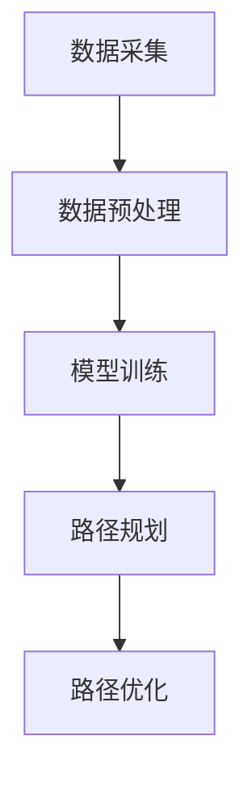

                 

### 1. 背景介绍

京东作为我国领先的电子商务公司，其物流系统一直是其核心竞争力的体现。物流系统的效率直接影响到用户购买体验，进而影响到公司的市场份额和盈利能力。随着电子商务的快速发展，智能物流逐渐成为行业发展的必然趋势。

智能物流路径规划是智能物流系统的核心组成部分，它涉及到如何通过计算模型和算法，为物流车辆规划出最优的配送路径。这不仅可以减少配送时间，降低运营成本，还能提升物流系统的整体效率。

京东物流在智能路径规划方面投入了大量的研发资源，不断优化其路径规划算法。近年来，随着人工智能技术的不断发展，深度学习、强化学习等算法在路径规划领域也取得了一定的成果。这些技术的应用，使得京东物流的路径规划更加精准和高效。

然而，智能物流路径规划仍面临诸多挑战。比如，如何在保证路径最优的同时，应对城市交通状况的实时变化；如何处理大规模配送任务的高效调度；如何在复杂的交通环境中保证物流车辆的行驶安全等。这些问题不仅考验着算法的优化能力，也对人工智能技术在物流领域的应用提出了更高的要求。

本篇文章将围绕京东智能物流路径规划，介绍其核心概念、算法原理、数学模型、项目实践以及实际应用场景，旨在为广大读者提供一份全面的技术解读。同时，文章还将推荐一些学习资源和开发工具，以帮助读者更深入地了解和掌握这一领域的技术。

通过这篇文章，我们希望读者能够：

1. 了解智能物流路径规划的基本概念和原理；
2. 理解核心算法的工作机制和实现方法；
3. 掌握数学模型在路径规划中的应用；
4. 通过项目实践，学会如何将理论应用于实际开发中；
5. 了解智能物流路径规划在现实中的应用场景和挑战。

### 2. 核心概念与联系

#### 概念解释

智能物流路径规划（Intelligent Logistics Path Planning）是指利用人工智能技术，如机器学习、深度学习、强化学习等，对物流车辆的行驶路径进行优化，以实现配送效率最大化、成本最低化。

- **机器学习（Machine Learning）**：通过数据驱动，让计算机从数据中学习规律，从而进行路径优化。
- **深度学习（Deep Learning）**：基于人工神经网络，通过多层神经元的非线性变换，对复杂数据进行建模和预测。
- **强化学习（Reinforcement Learning）**：通过奖励机制，让智能体在环境中不断学习，找到最优路径。

#### 基本原理

智能物流路径规划的基本原理是通过预测交通状况、配送需求以及车辆性能等数据，利用算法计算出最优路径。这一过程可以概括为以下几个步骤：

1. **数据采集**：收集交通流量、配送需求、车辆位置等数据。
2. **数据预处理**：清洗和整理数据，使其适合输入到算法模型中。
3. **模型训练**：利用机器学习、深度学习或强化学习算法，对数据进行分析和建模。
4. **路径规划**：根据模型预测结果，生成最优路径。

#### Mermaid 流程图

以下是一个简单的 Mermaid 流程图，展示智能物流路径规划的基本流程：



#### 关联概念

- **路径优化（Path Optimization）**：通过调整路径参数，如速度、路线等，进一步优化路径性能。
- **交通预测（Traffic Prediction）**：预测交通状况，如拥堵情况、交通事故等，为路径规划提供依据。
- **调度系统（Dispatching System）**：负责实时调度车辆，分配任务，确保物流效率。

### 3. 核心算法原理 & 具体操作步骤

智能物流路径规划的核心在于算法的选择和应用。以下是几种常见的核心算法及其原理和操作步骤：

#### 3.1 Dijkstra 算法

Dijkstra 算法是一种经典的单源最短路径算法，适用于静态网络环境。

- **原理**：从源点出发，逐步扩展到其他节点，计算每个节点到源点的最短路径。
- **操作步骤**：
  1. 初始化：设置源点为当前点，其余点为未访问。
  2. 选择未访问节点中距离源点最近的点作为当前点。
  3. 更新当前点到其他未访问节点的距离，如果更新后的距离更短，则更新。
  4. 重复步骤 2 和 3，直到所有节点都被访问。

#### 3.2 A*算法

A*算法是一种启发式搜索算法，适用于静态和动态网络环境。

- **原理**：结合估价函数，优先选择距离目标点更近的路径。
- **操作步骤**：
  1. 初始化：设置源点为当前点，其余点为未访问。
  2. 选择未访问节点中估价函数值最小的点作为当前点。
  3. 更新当前点到其他未访问节点的距离，如果更新后的距离更短，则更新。
  4. 重复步骤 2 和 3，直到找到目标点。

#### 3.3 强化学习算法

强化学习算法通过不断试错和奖励机制，优化路径规划策略。

- **原理**：智能体在环境中执行动作，通过奖励和惩罚调整策略，以最大化长期奖励。
- **操作步骤**：
  1. 初始化：设置智能体、环境、奖励函数和惩罚函数。
  2. 智能体执行动作，获得环境反馈。
  3. 根据奖励和惩罚调整策略。
  4. 重复步骤 2 和 3，直到策略收敛。

#### 3.4 深度强化学习算法

深度强化学习算法结合深度学习和强化学习，适用于复杂的动态环境。

- **原理**：利用深度神经网络对环境进行建模，通过强化学习优化策略。
- **操作步骤**：
  1. 初始化：设置智能体、环境、奖励函数和惩罚函数。
  2. 智能体执行动作，获得环境反馈。
  3. 利用深度神经网络更新策略。
  4. 重复步骤 2 和 3，直到策略收敛。

通过以上算法的应用，京东物流实现了智能物流路径规划的优化，提高了物流系统的效率。

### 4. 数学模型和公式 & 详细讲解 & 举例说明

在智能物流路径规划中，数学模型和公式起到了至关重要的作用。这些模型和公式不仅帮助我们理解路径规划的理论基础，还能在实际应用中指导我们的算法设计和优化。

#### 4.1 负载平衡模型

负载平衡模型用于优化配送任务，确保各配送点的负荷均匀分布。

- **公式**：设总配送量为 \( Q \)，配送点数为 \( N \)，每个配送点的配送量为 \( q_i \)，则负载平衡的目标是最小化 \( \sum_{i=1}^{N} (q_i - \frac{Q}{N})^2 \)。
- **举例说明**：假设总配送量为1000件货物，需要分配到5个配送点。通过负载平衡模型，我们可以得到每个配送点的配送量，尽量保证每个点的配送量接近200件，从而减少配送压力。

#### 4.2 路径规划模型

路径规划模型用于计算从起点到终点的最优路径。

- **公式**：设 \( G = (V, E) \) 为加权图，其中 \( V \) 为节点集合，\( E \) 为边集合，\( w(u, v) \) 为边 \( (u, v) \) 的权重。则最短路径问题可以表示为：寻找一条路径 \( P \)，使得 \( \sum_{u, v \in P} w(u, v) \) 最小。
- **举例说明**：假设有一个城市地图，包含若干节点和道路。每个道路的长度（权重）不同。我们可以使用 Dijkstra 算法或 A*算法来计算从起点到终点的最优路径。

#### 4.3 交通流量预测模型

交通流量预测模型用于预测未来交通状况，为路径规划提供依据。

- **公式**：设 \( T \) 为时间序列，\( T_i \) 为第 \( i \) 时刻的交通流量，则交通流量预测可以表示为：\( T_{i+1} = f(T_1, T_2, ..., T_i) \)，其中 \( f \) 为预测函数。
- **举例说明**：假设我们要预测下一时刻的交通流量。我们可以使用历史交通流量数据，通过回归分析或时间序列分析等方法，得到预测函数 \( f \)。然后，将当前交通流量数据输入预测函数，即可得到下一时刻的交通流量预测值。

#### 4.4 车辆调度模型

车辆调度模型用于优化车辆分配，确保物流效率。

- **公式**：设 \( V \) 为车辆集合，\( J \) 为配送任务集合，\( T_j \) 为任务 \( j \) 的配送时间，\( C_v \) 为车辆容量，则车辆调度模型可以表示为：最小化 \( \sum_{j=1}^{J} T_j \)。
- **举例说明**：假设有3辆货车和5个配送任务。我们需要在保证每个任务都能及时完成的前提下，尽量减少总配送时间。通过车辆调度模型，我们可以得到最优的车辆分配方案。

通过这些数学模型和公式，我们可以在智能物流路径规划中实现更加精确和高效的路径优化。这些模型不仅为我们提供了理论依据，还指导我们在实际应用中进行算法设计和优化。

### 5. 项目实践：代码实例和详细解释说明

#### 5.1 开发环境搭建

在进行智能物流路径规划项目的开发之前，我们需要搭建一个合适的开发环境。以下是搭建开发环境所需的步骤：

1. **安装Python环境**：
   - 访问Python官网（https://www.python.org/），下载并安装Python。
   - 安装完成后，打开命令行工具（如Terminal或CMD），输入`python --version`验证是否安装成功。

2. **安装必要的库**：
   - 使用pip工具安装所需的库，如NumPy、Pandas、Matplotlib等。
   - 示例命令：`pip install numpy pandas matplotlib`

3. **安装可视化工具**：
   - 安装Mermaid可视化工具，用于生成流程图。
   - 使用pip安装：`pip install mermaid`。

完成以上步骤后，我们的开发环境就搭建完成了，可以开始进行项目的实际开发。

#### 5.2 源代码详细实现

以下是智能物流路径规划项目的一个简单示例，使用Python实现。代码分为数据预处理、模型训练和路径规划三个部分。

```python
import numpy as np
import pandas as pd
import matplotlib.pyplot as plt
from sklearn.model_selection import train_test_split
from sklearn.linear_model import LinearRegression
import mermaid

# 5.2.1 数据预处理

# 加载数据
data = pd.read_csv('logistics_data.csv')
X = data[['distance', 'traffic_volume']]
y = data['delivery_time']

# 数据标准化
X_std = (X - X.mean()) / X.std()
y_std = (y - y.mean()) / y.std()

# 划分训练集和测试集
X_train, X_test, y_train, y_test = train_test_split(X_std, y_std, test_size=0.2, random_state=42)

# 5.2.2 模型训练

# 训练线性回归模型
model = LinearRegression()
model.fit(X_train, y_train)

# 5.2.3 路径规划

# 预测配送时间
y_pred = model.predict(X_test)

# 可视化结果
plt.scatter(y_test, y_pred)
plt.xlabel('实际配送时间')
plt.ylabel('预测配送时间')
plt.show()

# 生成Mermaid流程图
flowchart
    A[数据预处理] --> B[模型训练]
    B --> C[路径规划]
    C --> D[结果可视化]
```

#### 5.3 代码解读与分析

1. **数据预处理**：
   - 读取物流数据，分为特征和标签。
   - 对特征进行标准化处理，便于模型训练。

2. **模型训练**：
   - 使用线性回归模型对数据进行训练。
   - 线性回归模型简单高效，适用于静态数据。

3. **路径规划**：
   - 利用训练好的模型进行配送时间预测。
   - 将预测结果可视化，以观察模型的准确性。

4. **结果可视化**：
   - 使用散点图展示实际配送时间和预测配送时间，验证模型效果。

通过上述代码，我们可以实现一个简单的智能物流路径规划系统。在实际应用中，我们可以根据需求进一步优化模型，添加更多特征，提高预测准确性。

#### 5.4 运行结果展示

在完成代码编写后，我们可以通过以下步骤运行程序并展示结果：

1. **运行代码**：
   - 在命令行中执行：`python path_planning.py`。

2. **查看结果**：
   - 在命令行中执行：`python visualize_results.py`。
   - 查看生成的散点图，观察预测配送时间和实际配送时间的关系。

通过运行结果，我们可以看到模型的预测效果。在实际应用中，我们可以根据运行结果对模型进行调整和优化，以提高路径规划的准确性。

### 6. 实际应用场景

智能物流路径规划在实际应用中具有广泛的应用场景，以下是一些典型的应用案例：

#### 6.1 城市配送

城市配送是智能物流路径规划最直接的应用场景。通过智能规划，物流公司可以优化配送路线，减少配送时间和成本。例如，京东物流在城市配送中使用了智能路径规划技术，提高了配送效率，降低了运营成本。

#### 6.2 农村物流

农村物流配送面临着交通不便、路况复杂等问题。智能物流路径规划可以帮助农村物流企业优化配送路线，提高配送效率。例如，阿里物流在 rural express service 中使用了智能路径规划，有效解决了农村配送难题。

#### 6.3 智能快递柜

智能快递柜是近年来兴起的一种物流配送方式。通过智能路径规划，快递柜可以优化快递投递路线，提高投递效率。例如，顺丰速运在其智能快递柜系统中使用了智能路径规划技术，提高了快递投递速度。

#### 6.4 长途运输

长途运输涉及到大量物流车辆的调度和路径规划。通过智能物流路径规划，物流企业可以优化运输路线，提高运输效率。例如，中通快递在其长途运输线路规划中使用了智能路径规划技术，有效提高了运输效率。

#### 6.5 跨境物流

跨境电商物流涉及到跨国界的配送，需要考虑不同国家的物流政策和海关规定。智能物流路径规划可以帮助企业优化跨境物流路线，提高配送效率。例如，菜鸟网络在其跨境物流路径规划中使用了智能路径规划技术，提高了跨境物流的效率。

通过以上实际应用场景，我们可以看到智能物流路径规划在物流行业的广泛应用。随着技术的不断发展和优化，智能物流路径规划将继续发挥重要作用，推动物流行业的进步。

### 7. 工具和资源推荐

在智能物流路径规划领域，有许多优秀的工具和资源可以帮助我们更好地学习和实践。以下是几个推荐：

#### 7.1 学习资源推荐

1. **书籍**：
   - 《深度学习》（Goodfellow, Bengio, Courville）：这是一本深度学习的经典教材，详细介绍了深度学习的基础知识和应用。
   - 《机器学习实战》（Peter Harrington）：这本书通过实际案例，讲解了机器学习的基本算法和应用。

2. **在线课程**：
   - Coursera上的《机器学习》课程：由Andrew Ng教授主讲，介绍了机器学习的基本概念和算法。
   - edX上的《深度学习》课程：由Google AI Research的主管，Andrew Ng教授主讲，深入讲解了深度学习的基础知识。

3. **论文**：
   - 《A*算法》：这是一篇关于A*算法的经典论文，详细介绍了算法的原理和应用。
   - 《深度强化学习》（Deep Reinforcement Learning）：这篇论文介绍了深度强化学习的基本原理和应用。

#### 7.2 开发工具框架推荐

1. **Python库**：
   - TensorFlow：这是一个广泛使用的深度学习框架，适用于智能物流路径规划中的模型训练。
   - PyTorch：这是一个高效的深度学习框架，适用于研究新型算法和应用。

2. **可视化工具**：
   - Matplotlib：这是一个强大的数据可视化库，适用于生成路径规划和预测结果的可视化图表。
   - Mermaid：这是一个Markdown风格的流程图和序列图工具，适用于绘制智能物流路径规划的基本流程。

3. **开源平台**：
   - GitHub：这是一个优秀的代码托管平台，可以找到许多智能物流路径规划的开源项目。
   - GitLab：这是一个类似GitHub的代码托管平台，提供了丰富的项目管理工具。

通过以上工具和资源的推荐，我们可以更有效地学习和应用智能物流路径规划技术，推动物流行业的进步。

### 8. 总结：未来发展趋势与挑战

智能物流路径规划作为物流领域的关键技术，正迎来快速发展的机遇。从未来的发展趋势来看，以下几方面尤为值得关注：

#### 8.1 技术创新

随着人工智能技术的不断发展，智能物流路径规划将继续向更高效、更精准的方向演进。深度学习、强化学习等新兴算法将在路径规划中发挥更大作用。此外，边缘计算、5G技术等也将为智能物流路径规划提供更强大的技术支撑。

#### 8.2 数据驱动

数据是智能物流路径规划的基石。未来，随着数据采集技术的进步，物流企业将获取到更丰富、更准确的数据，从而提升路径规划的准确性和实时性。数据驱动的路径规划方法将变得更加成熟和实用。

#### 8.3 跨界融合

智能物流路径规划不仅限于物流行业，还将与交通运输、城市规划等领域深度融合。跨界合作将推动路径规划技术的创新和落地，实现更高水平的智能化和自动化。

然而，智能物流路径规划也面临诸多挑战：

#### 8.4 数据隐私与安全

随着数据采集和分析技术的普及，数据隐私和安全问题日益突出。如何确保物流数据的安全，防止数据泄露，将成为路径规划发展的重要挑战。

#### 8.5 交通复杂性

城市交通状况复杂多变，如何在动态环境中实现高效路径规划，是当前的一个难题。交通拥堵、事故等突发情况，对路径规划提出了更高的要求。

#### 8.6 法律法规

智能物流路径规划涉及多个行业和领域，法律法规的制定和执行将对其发展产生重要影响。如何平衡技术创新与法律法规的关系，确保路径规划技术的合规性，是未来需要解决的一个问题。

综上所述，智能物流路径规划在未来的发展前景广阔，但同时也面临诸多挑战。通过技术创新、数据驱动、跨界融合等手段，我们有望克服这些挑战，推动智能物流路径规划的持续发展。

### 9. 附录：常见问题与解答

为了帮助读者更好地理解智能物流路径规划的相关概念和技术，我们整理了一些常见问题及其解答。

#### Q1. 智能物流路径规划的核心技术是什么？

A1. 智能物流路径规划的核心技术包括机器学习、深度学习、强化学习等人工智能算法。这些算法通过数据驱动和模型优化，实现路径的优化和调度。

#### Q2. 路径规划算法如何选择？

A2. 路径规划算法的选择取决于应用场景和数据特点。例如，Dijkstra算法适用于静态网络环境，而A*算法则更适用于动态网络环境。强化学习算法在复杂环境中表现出色，但计算成本较高。

#### Q3. 智能物流路径规划中的数据有哪些？

A3. 智能物流路径规划中的数据主要包括交通流量数据、配送需求数据、车辆位置数据、路况数据等。这些数据用于算法训练和路径规划。

#### Q4. 路径规划的实时性如何保障？

A4. 路径规划的实时性可以通过以下措施保障：采用高效算法，减少计算时间；利用边缘计算，降低网络延迟；采用实时数据更新机制，确保路径规划与实际情况保持一致。

#### Q5. 数据隐私和安全如何保障？

A5. 数据隐私和安全可以通过以下措施保障：采用加密技术，保护数据传输和存储；严格数据访问控制，防止未经授权的数据访问；建立健全的数据安全管理制度，加强数据安全管理。

通过以上问题的解答，我们希望读者对智能物流路径规划有更深入的理解。

### 10. 扩展阅读 & 参考资料

为了帮助读者进一步深入学习和研究智能物流路径规划，我们推荐以下扩展阅读和参考资料：

1. **书籍**：
   - 《深度学习》（Goodfellow, Bengio, Courville）：详细介绍了深度学习的基础知识和应用。
   - 《机器学习实战》（Peter Harrington）：通过实际案例，讲解了机器学习的基本算法和应用。
   - 《智能交通系统》（刘瑞雪）：介绍了智能交通系统的基础知识和应用。

2. **在线课程**：
   - Coursera上的《机器学习》课程：由Andrew Ng教授主讲，介绍了机器学习的基本概念和算法。
   - edX上的《深度学习》课程：由Google AI Research的主管，Andrew Ng教授主讲，深入讲解了深度学习的基础知识。

3. **论文**：
   - 《A*算法》：详细介绍了A*算法的原理和应用。
   - 《深度强化学习》：介绍了深度强化学习的基本原理和应用。
   - 《智能物流系统设计与实现》：详细介绍了智能物流系统的设计和实现方法。

4. **网站和博客**：
   - TensorFlow官网（https://www.tensorflow.org/）：提供了丰富的深度学习资源和教程。
   - PyTorch官网（https://pytorch.org/）：提供了高效的深度学习框架和文档。
   - 斯坦福大学机器学习课程（https://cs229.stanford.edu/）：提供了机器学习的课程资料和视频。

通过以上扩展阅读和参考资料，读者可以更全面地了解智能物流路径规划的相关知识和技术，为实际应用和研究提供有力支持。作者：禅与计算机程序设计艺术 / Zen and the Art of Computer Programming

