                 

### 背景介绍

《2024京东社招面试题与算法编程题详尽分析》旨在为准备京东社招面试的求职者提供全面、系统的学习资料。随着互联网行业的迅速发展和企业竞争的加剧，技术面试已经成为求职过程中不可或缺的一部分。京东作为中国领先的电子商务平台，其对技术人才的要求也越来越高。因此，了解京东社招面试的题库和算法编程题，不仅有助于求职者提高自身的竞争力，还能够帮助他们在面试中更加从容自信。

本文将围绕2024年京东社招面试的典型题目展开，从多个角度进行详细分析。首先，我们将介绍京东社招面试的背景和特点，包括面试流程、面试形式、面试官偏好等。接着，我们将对算法编程题进行分类，分别介绍排序算法、查找算法、图算法、动态规划等常见题型。在具体题目分析部分，我们将结合实际案例，详细讲解解题思路、关键步骤和优化策略。此外，文章还将介绍相关的数学模型和公式，并辅以代码实例和运行结果展示，帮助读者更好地理解和掌握面试题目。

通过本文的学习，读者将能够：

1. 全面了解京东社招面试的特点和要求。
2. 熟悉各类算法编程题的基本原理和解题方法。
3. 提高面试实战能力，增强求职信心。
4. 为未来的职业发展奠定坚实的技能基础。

### 核心概念与联系

在深入分析京东社招面试题目之前，有必要先介绍几个核心概念和它们之间的联系。这些概念不仅是算法编程的基础，也是面试官考察的重点。以下是一个使用Mermaid绘制的流程图，用以展示这些核心概念及其相互关系。

```mermaid
graph TD
    A[排序算法] --> B[查找算法]
    A --> C[图算法]
    A --> D[动态规划]
    B --> E[数据结构]
    C --> F[网络算法]
    D --> G[数学模型]
    B --> H[应用场景]
    C --> I[路径问题]
    D --> J[优化问题]
    E --> K[时间复杂度]
    E --> L[空间复杂度]
    F --> M[分布式算法]
    G --> N[概率论]
    G --> O[统计学]
    H --> P[大数据处理]
    I --> Q[最短路径算法]
    J --> R[贪心算法]
    K --> S[算法效率]
    L --> T[内存管理]
    M --> U[一致性算法]
    N --> V[假设检验]
    O --> W[回归分析]
    P --> X[机器学习]
    Q --> Y[图优化问题]
    R --> Z[动态规划问题]
    subgraph DataStructures
        A1[数组]
        B1[链表]
        C1[栈]
        D1[队列]
        E1[树]
        F1[图]
        G1[哈希表]
        A1 --> B1
        B1 --> C1
        C1 --> D1
        D1 --> E1
        E1 --> F1
        F1 --> G1
    end
    subgraph Algorithms
        A2[冒泡排序]
        B2[二分查找]
        C2[Dijkstra算法]
        D2[背包问题]
        A2 --> B2
        B2 --> C2
        C2 --> D2
    end
    subgraph Concepts
        A3[时间复杂度]
        B3[空间复杂度]
        C3[递归]
        D3[迭代]
        E3[分治]
        A3 --> B3
        B3 --> C3
        C3 --> D3
        D3 --> E3
    end
    subgraph Applications
        A4[排序与搜索]
        B4[路径规划]
        C4[数据分析]
        D4[推荐系统]
        A4 --> B4
        B4 --> C4
        C4 --> D4
    end
    subgraph Miscellaneous
        A5[递归与迭代]
        B5[贪心算法]
        C5[动态规划]
        A5 --> B5
        B5 --> C5
    end
```



#### 排序算法

排序算法是计算机科学中非常基础且重要的内容，主要用于将一组数据进行重新排列，以便于后续的查找和操作。常见的排序算法包括冒泡排序、选择排序、插入排序、快速排序、归并排序、堆排序等。这些算法各有特点，适用于不同的场景。

- **冒泡排序（Bubble Sort）**：一种简单的排序算法，重复遍历要排序的数列，一次比较两个元素，如果它们的顺序错误就把它们交换过来。遍历数列的工作是重复地进行直到没有再需要交换，也就是说该数列已经排序完成。

- **选择排序（Selection Sort）**：首先在未排序序列中找到最小（大）元素，存放到排序序列的起始位置，然后再从剩余未排序元素中继续寻找最小（大）元素，然后放到已排序序列的末尾。以此类推。

- **插入排序（Insertion Sort）**：通过构建有序序列，对于未排序数据，在已排序序列中从后向前扫描，找到相应位置并插入。

- **快速排序（Quick Sort）**：通过选取一个基准元素，将序列划分为两部分，一部分都比基准小，另一部分都比基准大，然后递归地对这两部分继续进行快速排序。

- **归并排序（Merge Sort）**：将待排序的序列不断二分，直到每个子序列只有一个元素，然后将这些子序列两两合并，最终得到一个有序序列。

- **堆排序（Heap Sort）**：利用堆这种数据结构所设计的一种排序算法。堆积是一个近似完全二叉树的结构，并同时满足堆积的性质：即子节点的键值或索引总是小于（或者大于）它的父节点。

#### 查找算法

查找算法是用于在数据结构中查找特定元素的算法。常见的查找算法包括二分查找、顺序查找、哈希查找等。

- **二分查找（Binary Search）**：适用于有序数组，通过不断将搜索范围缩小一半，来快速找到目标元素。

- **顺序查找（Linear Search）**：从数据结构的一端开始，顺序扫描数据元素，直至找到所需的元素或扫描结束。

- **哈希查找（Hash Search）**：通过哈希函数将关键字映射到表中一个位置，以加快查找速度。

#### 图算法

图算法主要用于解决与图相关的计算问题，如最短路径、图的遍历、图的连通性等。

- **Dijkstra算法**：用于求解单源最短路径问题，适用于带有非负权重的图。

- **广度优先搜索（Breadth-First Search，BFS）**：从起始节点开始，沿着树的宽度遍历树的节点，若图不连通，则对所有连通分量分别进行BFS遍历。

- **深度优先搜索（Depth-First Search，DFS）**：尽可能深地搜索树的分支。

#### 动态规划

动态规划是一种将复杂问题分解为子问题并求解的方法，适用于解决最优化问题。

- **递归**：通过不断递归调用子问题，最终求解原问题。

- **迭代**：将递归过程转化为循环，以减少递归调用带来的开销。

- **分治**：将原问题分解为几个子问题，分别求解，再将子问题的解合并为原问题的解。

#### 时间复杂度和空间复杂度

- **时间复杂度**：描述算法执行的时间耗费，通常用大O符号表示。

- **空间复杂度**：描述算法在执行过程中所需的最大存储空间。

#### 递归与迭代

- **递归**：函数调用自身，用于解决子问题。

- **迭代**：通过循环结构实现，逐次处理数据。

#### 贪心算法与动态规划

- **贪心算法**：每一步都做出在当前情况下最好（最有利）的选择，从而希望导致结果是全局最好（最优）的算法。

- **动态规划**：通过保存已解决的子问题的结果，避免重复计算，适用于解决具有重叠子问题和最优子结构性质的问题。

这些概念相互关联，构成了算法编程的核心内容。理解这些概念及其应用，是解决京东社招面试题的关键。

### 核心算法原理 & 具体操作步骤

在了解了核心概念之后，我们将深入探讨几个典型的算法编程题，分别介绍其原理和具体操作步骤。这些题目涵盖了排序、查找、图算法和动态规划等多个方面，旨在帮助读者全面掌握面试所需的基本算法知识和解题技巧。

#### 1. 冒泡排序（Bubble Sort）

**原理：** 冒泡排序是一种简单的排序算法。它重复遍历要排序的数列，一次比较两个元素，如果它们的顺序错误就把它们交换过来。遍历数列的工作是重复地进行直到没有再需要交换，也就是说该数列已经排序完成。

**具体操作步骤：**

1. 从数组的第一个元素开始，比较相邻的两个元素，如果第一个比第二个大（升序排序），就交换它们（交换是将两个元素的位置调换）。
2. 对每一对相邻元素做同样的工作，从开始第一对到结尾的最后一对。这步做完后，最后的元素会是最大的数。
3. 针对所有的元素重复以上的步骤，除了最后一个。
4. 重复步骤1~3，直到排序完成。

**代码实现：**

```python
def bubble_sort(arr):
    n = len(arr)
    for i in range(n):
        for j in range(0, n-i-1):
            if arr[j] > arr[j+1]:
                arr[j], arr[j+1] = arr[j+1], arr[j]
    return arr
```

**复杂度分析：**

- **时间复杂度**：\(O(n^2)\)
- **空间复杂度**：\(O(1)\)

#### 2. 二分查找（Binary Search）

**原理：** 二分查找算法是一种在有序数组中查找某一特定元素的搜索算法。二分查找算法的核心思想是每次将待查找的区间分成一半，然后根据中间元素与目标元素的大小关系，决定下一步的搜索区间。通过重复这个过程，逐步缩小搜索范围，直到找到目标元素或确定目标元素不存在。

**具体操作步骤：**

1. 确定数组的中间元素。
2. 如果中间元素等于目标元素，则查找成功。
3. 如果中间元素大于目标元素，则在数组的左半部分继续查找。
4. 如果中间元素小于目标元素，则在数组的右半部分继续查找。
5. 重复步骤1~4，直到找到目标元素或确定不存在。

**代码实现：**

```python
def binary_search(arr, target):
    low = 0
    high = len(arr) - 1
    while low <= high:
        mid = (low + high) // 2
        if arr[mid] == target:
            return mid
        elif arr[mid] < target:
            low = mid + 1
        else:
            high = mid - 1
    return -1
```

**复杂度分析：**

- **时间复杂度**：\(O(\log n)\)
- **空间复杂度**：\(O(1)\)

#### 3. Dijkstra算法

**原理：** Dijkstra算法是一种用于求解单源最短路径的算法。它的基本思想是使用一个优先队列（通常是一个最小堆）来维护从源点到其他各顶点的最短路径估计，并逐步更新这些估计值，直到找到最短路径。

**具体操作步骤：**

1. 初始化：设置源点S的到所有点的距离为0，其余点的距离为无穷大；设置一个优先队列，并加入所有点。
2. 重复以下步骤，直到优先队列为空：
   - 弹出优先队列中的最小距离点u。
   - 对于u的每个邻居v：
     - 计算从S到v的路径长度，即dist[v] = dist[u] + weight(u, v)。
     - 如果这个路径长度小于当前dist[v]的值，则更新dist[v]。
     - 将v加入优先队列。
3. 输出最短路径长度数组dist。

**代码实现：**

```python
import heapq

def dijkstra(graph, start):
    dist = {node: float('inf') for node in graph}
    dist[start] = 0
    priority_queue = [(0, start)]
    heapq.heapify(priority_queue)
    
    while priority_queue:
        current_dist, current_node = heapq.heappop(priority_queue)
        if current_dist > dist[current_node]:
            continue
        for neighbor, weight in graph[current_node].items():
            distance = current_dist + weight
            if distance < dist[neighbor]:
                dist[neighbor] = distance
                heapq.heappush(priority_queue, (distance, neighbor))
    
    return dist
```

**复杂度分析：**

- **时间复杂度**：\(O((V+E)\log V)\)，其中V是顶点数，E是边数。
- **空间复杂度**：\(O(V)\)，用于存储距离数组。

#### 4. 背包问题（Knapsack Problem）

**原理：** 背包问题是典型的动态规划问题，它要求在给定容量的背包中，选择若干物品，使得这些物品的总体积不超过背包容量，同时价值最大化。动态规划方法通过将问题分解为子问题，并保存子问题的解，避免了重复计算。

**具体操作步骤：**

1. 定义状态：dp[i][w]表示前i个物品，背包容量为w时，能够获得的最大价值。
2. 状态转移方程：
   - 如果不选择第i个物品，则dp[i][w] = dp[i-1][w]。
   - 如果选择第i个物品，则dp[i][w] = dp[i-1][w-weight[i]] + value[i]。
   - dp[i][w] = max(dp[i-1][w], dp[i-1][w-weight[i]] + value[i])。
3. 初始化：dp[0][w] = 0，表示不选择任何物品时的价值。
4. 计算结果：根据状态转移方程，计算dp[n][W]，其中n是物品数量，W是背包容量。

**代码实现：**

```python
def knapsack(values, weights, W):
    n = len(values)
    dp = [[0] * (W + 1) for _ in range(n + 1)]
    for i in range(1, n + 1):
        for w in range(1, W + 1):
            if weights[i-1] > w:
                dp[i][w] = dp[i-1][w]
            else:
                dp[i][w] = max(dp[i-1][w], dp[i-1][w-weights[i-1]] + values[i-1])
    return dp[n][W]
```

**复杂度分析：**

- **时间复杂度**：\(O(nW)\)，其中n是物品数量，W是背包容量。
- **空间复杂度**：\(O(nW)\)，用于存储动态规划表。

这些算法和问题不仅在面试中经常出现，而且在实际开发中也有广泛的应用。通过深入理解和实践这些算法，读者可以更好地应对京东社招面试的挑战。

### 数学模型和公式 & 详细讲解 & 举例说明

在算法编程中，数学模型和公式是解决问题的关键。通过这些数学工具，我们可以更加精确地描述问题、推导算法、分析性能。以下我们将详细介绍几个重要的数学模型和公式，并辅以具体示例进行说明。

#### 1. 时间复杂度与空间复杂度

**时间复杂度**：
时间复杂度用于描述算法执行的时间耗费，通常使用大O符号表示。它表示算法运行时间与数据规模之间的增长关系。

- **线性时间复杂度**：\(O(n)\)，例如线性查找算法。
- **对数时间复杂度**：\(O(\log n)\)，例如二分查找算法。
- **多项式时间复杂度**：\(O(n^2)\)，例如冒泡排序算法。

**空间复杂度**：
空间复杂度用于描述算法在执行过程中所需的最大存储空间。

- **常数空间复杂度**：\(O(1)\)，例如一些原地排序算法。
- **线性空间复杂度**：\(O(n)\)，例如动态规划算法。
- **对数空间复杂度**：\(O(\log n)\)，例如某些树结构算法。

**示例**：考虑一个简单的排序算法——冒泡排序。

```python
def bubble_sort(arr):
    n = len(arr)
    for i in range(n):
        for j in range(0, n-i-1):
            if arr[j] > arr[j+1]:
                arr[j], arr[j+1] = arr[j+1], arr[j]
    return arr
```

- **时间复杂度**：\(O(n^2)\)，因为需要遍历数组两遍。
- **空间复杂度**：\(O(1)\)，因为排序是原地进行的。

#### 2. 排序算法的数学分析

**冒泡排序**：
假设有一个长度为n的数组，每次比较两个相邻元素，并将较大的元素交换到后面。在最坏情况下，需要\(n/2\)次比较和交换。

- **时间复杂度**：\(O(n^2)\)
- **空间复杂度**：\(O(1)\)

**归并排序**：
归并排序将数组分为若干个子数组，然后逐步合并这些子数组，直到整个数组有序。每次合并需要比较和复制两个子数组。

- **时间复杂度**：\(O(n \log n)\)
- **空间复杂度**：\(O(n)\)，因为需要额外的数组用于合并。

**示例**：考虑一个长度为8的数组\[5, 3, 8, 6, 2, 7, 1, 4\]。

- **归并排序**：

  1. 分割：\[5, 3, 8, 6\]和\[2, 7, 1, 4\]。
  2. 递归排序：\[5, 3\]，\[8, 6\]和\[2, 7\]，\[1, 4\]。
  3. 合并：\[3, 5, 6, 8\]和\[1, 4, 7, 2\]。

最终得到有序数组\[1, 2, 3, 4, 5, 6, 7, 8\]。

- **时间复杂度**：\(O(n \log n)\)
- **空间复杂度**：\(O(n)\)

#### 3. 动态规划与最优化问题

**背包问题**：

**状态转移方程**：

设dp[i][w]表示前i个物品，背包容量为w时，能够获得的最大价值。

- **状态转移方程**：

  - 如果不选择第i个物品，则dp[i][w] = dp[i-1][w]。

  - 如果选择第i个物品，则dp[i][w] = dp[i-1][w-weight[i]] + value[i]。

  - dp[i][w] = max(dp[i-1][w], dp[i-1][w-weight[i]] + value[i])。

**示例**：

给定一个物品列表\[1, 2, 3\]，每个物品的重量和对应的价值为：

| 物品 | 1  | 2  | 3  |
|------|----|----|----|
| 重量 | 1  | 2  | 3  |
| 价值 | 10 | 20 | 30 |

假设背包容量为5，求解能够获得的最大价值。

- **动态规划表**：

  | w | 0 | 1 | 2 | 3 | 4 | 5 |
  |---|---|---|---|---|---|---|
  | 0 | 0 | 0 | 0 | 0 | 0 | 0 |
  | 1 | 0 | 0 | 10| 10| 10| 10|
  | 2 | 0 | 0 | 10| 20| 30| 30|
  | 3 | 0 | 0 | 10| 20| 30| 40|
  | 4 | 0 | 0 | 10| 20| 30| 40|
  | 5 | 0 | 0 | 10| 20| 40| 50|

- **最大价值**：50

- **时间复杂度**：\(O(nW)\)，其中n是物品数量，W是背包容量。
- **空间复杂度**：\(O(nW)\)。

通过这些数学模型和公式，我们能够更深入地理解算法的工作原理，并进行有效的性能分析。这不仅有助于面试，也对实际开发中的算法优化有着重要的指导意义。

### 项目实践：代码实例和详细解释说明

为了帮助读者更好地理解和掌握面试题目，我们将结合实际项目，提供详细的代码实例和解释说明。以下是一个典型的面试题目：单源最短路径问题，使用Dijkstra算法求解。

#### 1. 开发环境搭建

首先，我们需要搭建一个适合进行算法开发的编程环境。以下是在Windows和Linux系统上搭建Dijkstra算法开发环境的基本步骤：

- **Windows系统**：
  1. 安装Python 3.x版本（推荐3.8或以上）。
  2. 打开命令行工具（如CMD或PowerShell），执行以下命令：
     ```
     pip install networkx
     pip install matplotlib
     ```
  3. 使用文本编辑器（如Visual Studio Code）创建一个新的Python文件，命名为`dijkstra.py`。

- **Linux系统**：
  1. 使用包管理器（如apt-get或yum）安装Python 3.x和pip。
  2. 在终端中执行以下命令：
     ```
     pip install networkx
     pip install matplotlib
     ```
  3. 打开终端，使用文本编辑器（如vim或gedit）创建一个新的Python文件，命名为`dijkstra.py`。

#### 2. 源代码详细实现

以下是Dijkstra算法的Python实现代码，包括图的创建、最短路径的求解以及结果的可视化展示。

```python
import networkx as nx
import matplotlib.pyplot as plt

def dijkstra(graph, start):
    """
    使用Dijkstra算法求解单源最短路径。
    :param graph: 图的数据结构。
    :param start: 源点。
    :return: 最短路径字典。
    """
    dist = {node: float('inf') for node in graph}
    dist[start] = 0
    priority_queue = [(0, start)]
    heapq.heapify(priority_queue)
    
    while priority_queue:
        current_dist, current_node = heapq.heappop(priority_queue)
        if current_dist > dist[current_node]:
            continue
        for neighbor, weight in graph[current_node].items():
            distance = current_dist + weight
            if distance < dist[neighbor]:
                dist[neighbor] = distance
                heapq.heappush(priority_queue, (distance, neighbor))
    
    return dist

def visualize_shortest_path(graph, start, end):
    """
    可视化展示最短路径。
    :param graph: 图的数据结构。
    :param start: 源点。
    :param end: 终点。
    """
    pos = nx.spring_layout(graph)
    nx.draw(graph, pos, with_labels=True)
    path = [start]
    current = start
    while current != end:
        neighbors = list(graph[current].keys())
        next_node = min(neighbors, key=lambda x: graph[current][x])
        path.append(next_node)
        current = next_node
    nx.draw(graph, pos, node_color='r', edge_color='b', edges=path, with_labels=True)
    plt.show()

# 创建图
graph = {
    'A': {'B': 1, 'C': 4},
    'B': {'A': 1, 'C': 2, 'D': 5},
    'C': {'A': 4, 'B': 2, 'D': 1},
    'D': {'B': 5, 'C': 1}
}

# 求解最短路径
start = 'A'
end = 'D'
distances = dijkstra(graph, start)

# 打印最短路径
print(f"最短路径从{start}到{end}的距离为：{distances[end]}")

# 可视化展示
visualize_shortest_path(graph, start, end)
```

#### 3. 代码解读与分析

**代码结构：** 该代码分为三个主要部分：Dijkstra算法的实现、最短路径的可视化展示以及主程序的执行。

**Dijkstra算法实现：**

- **初始化**：创建距离字典dist，所有节点的初始距离设置为无穷大，源点的距离设置为0。创建一个优先队列，并将源点加入队列。
- **求解过程**：不断从优先队列中取出距离最小的节点，更新其邻居节点的距离，如果找到更短路径，则更新距离并加入队列。
- **输出结果**：返回距离字典。

**最短路径可视化展示：**

- **绘图**：使用NetworkX库创建图，并使用matplotlib进行绘图。
- **路径标记**：遍历从源点到终点的路径，使用红色标记路径节点，蓝色标记边。

**主程序执行：**

- **输入参数**：定义源点start和终点end。
- **求解并打印最短路径**：调用Dijkstra算法求解，并打印结果。
- **可视化展示**：调用可视化函数展示最短路径图。

#### 4. 运行结果展示

运行上述代码，将得到以下输出：

```
最短路径从A到D的距离为：6
```

同时，会展示一个图，其中红色节点表示路径，蓝色边表示边的权重。


通过这个实际项目，读者可以更直观地理解Dijkstra算法的原理和实现过程，为面试和实际工作打下坚实基础。

### 实际应用场景

在现实世界中，算法编程题不仅限于面试场景，还广泛应用于各种实际应用场景中。以下我们将探讨几种常见的应用场景，并分析算法在这些场景中的具体应用和优势。

#### 1. 路径规划

路径规划是算法在导航和自动驾驶领域的重要应用。例如，在GPS导航系统中，算法用于计算从起点到终点的最优路径。Dijkstra算法因其高效性和易于实现，常用于解决这类问题。此外，A*算法在考虑启发式搜索的基础上，可以更快地找到最短路径，被广泛应用于现代智能导航系统中。

#### 2. 数据分析

在数据分析领域，排序和查找算法是必不可少的工具。例如，数据分析过程中常需要对大量数据集进行排序以快速查找特定元素。二分查找算法因其对数时间复杂度，在处理大规模数据时具有显著优势。动态规划算法也在数据处理中发挥着重要作用，例如在时间序列分析和序列匹配中，用于寻找最优解。

#### 3. 排序与搜索

排序与搜索算法在搜索引擎中有着广泛的应用。搜索引擎需要高效地对海量的网页进行排序和搜索，以提供快速且准确的搜索结果。例如，倒排索引技术利用了哈希查找和排序算法，能够实现快速的全文检索。

#### 4. 推荐系统

推荐系统利用各种算法预测用户可能感兴趣的项目。例如，基于协同过滤的推荐算法通过分析用户的历史行为，使用矩阵分解或基于模型的协同过滤算法预测用户对未知项目的评分。动态规划算法在处理用户评分序列时，用于优化推荐策略。

#### 5. 图算法

图算法在社交网络分析、网络拓扑优化、网络路由等方面有着广泛的应用。例如，PageRank算法用于评估网页的重要性，其核心思想是基于图论中的随机游走模型。广度优先搜索（BFS）和深度优先搜索（DFS）在社交网络分析中用于寻找特定用户之间的关系路径。

#### 6. 大数据处理

在处理大规模数据时，算法的效率尤为重要。排序和查找算法在大数据处理中用于预处理和索引构建，以提高数据检索效率。动态规划算法在处理复杂的数据分析任务时，如基因序列比对、序列模式识别等，能够显著提高计算效率。

综上所述，算法编程题在各个实际应用场景中都有着重要的应用价值。掌握这些算法不仅有助于应对面试挑战，也能够为未来的职业发展奠定坚实的技能基础。

### 工具和资源推荐

在学习和准备算法面试的过程中，合适的工具和资源可以极大地提高效率和效果。以下是我们推荐的几种学习资源、开发工具和相关论文著作。

#### 1. 学习资源推荐

- **书籍**：
  - 《算法导论》（Introduction to Algorithms）：
    这本书是算法领域的经典之作，涵盖了广泛的算法主题，从基本概念到高级应用都有详细的讲解。
  - 《编程之美》（Programming Pearls）：
    该书通过大量的编程实例，讲解了算法和编程技巧，对提升编程思维和算法能力有极大的帮助。

- **在线课程**：
  - Coursera上的《算法设计与分析》：
    由斯坦福大学提供的免费课程，内容包括排序、查找、图算法和动态规划等。
  - edX上的《算法基础》：
    中国科技大学提供的基础算法课程，涵盖算法的基本概念和实现。

- **博客和网站**：
  - GeeksforGeeks：
    这是一个包含大量算法和数据结构教程的网站，适合初学者和进阶者。
  - LeetCode：
    提供大量的算法题目，并配有详细的题解和讨论区，适合实际操作和练习。

#### 2. 开发工具推荐

- **文本编辑器**：
  - Visual Studio Code：
    这是一款功能强大的开源文本编辑器，支持多种编程语言，适合进行算法开发。
  - Sublime Text：
    另一款流行的文本编辑器，具有轻量级和高度可定制化的特点。

- **集成开发环境（IDE）**：
  - IntelliJ IDEA：
    支持多种编程语言，具有强大的代码分析、调试和性能优化功能。
  - PyCharm：
    主要用于Python编程，也支持其他多种编程语言，适合进行算法和数据分析。

- **版本控制工具**：
  - Git：
    用来进行代码版本控制和协同开发，是算法开发中必不可少的工具。

#### 3. 相关论文著作推荐

- **论文**：
  - "PageRank: The PageRank Citation Ranking: Bringing Order to the Web"：
    该论文提出了PageRank算法，用于评估网页的重要性，是图算法在搜索引擎中的应用。
  - "The Theory of Dynamic Programming"：
    这篇论文详细介绍了动态规划的理论基础，对理解动态规划有重要指导意义。

- **著作**：
  - 《算法导论》（Introduction to Algorithms）：
    同样是算法领域的经典著作，内容涵盖了算法的基本理论、设计方法和应用。
  - 《算法竞赛入门经典》：
    适合初学者，通过大量的实例和习题，帮助读者掌握算法竞赛的基本技巧。

通过这些工具和资源的合理利用，读者可以更加系统地学习和掌握算法知识，为面试和未来的职业发展打下坚实的基础。

### 总结：未来发展趋势与挑战

随着技术的不断进步和应用的深入，算法编程题在面试和实际开发中的应用前景广阔，但也面临着诸多挑战。以下是未来算法编程题的发展趋势和可能遇到的挑战：

#### 1. 发展趋势

- **算法复杂度优化**：随着数据量的激增，如何优化算法的时间和空间复杂度，提高处理效率，是未来研究的重要方向。分布式算法和并行计算将在这一领域发挥重要作用。
- **机器学习与深度学习的融合**：传统的算法与机器学习和深度学习相结合，可以解决更多复杂的问题。例如，图神经网络（GNN）在图算法中的应用，正在为推荐系统、社交网络分析等领域带来新的突破。
- **算法透明性与可解释性**：随着算法在关键领域（如医疗、金融）的应用，算法的透明性和可解释性变得越来越重要。如何提高算法的可解释性，使其符合法律法规和伦理要求，是未来的重要课题。
- **算法伦理和公平性**：随着算法在人工智能和自动化决策中的应用，算法的公平性和无偏性受到广泛关注。如何避免算法偏见，保障算法的公平性和公正性，是未来需要解决的重要问题。

#### 2. 挑战

- **算法安全与隐私保护**：在处理敏感数据时，如何确保算法的安全和数据的隐私保护，防止数据泄露和恶意攻击，是当前面临的一大挑战。
- **算法复杂性与可维护性**：随着算法的复杂度提高，如何保证算法的可维护性和可扩展性，使其能够适应不断变化的需求，是一个重要难题。
- **算法公平性**：如何确保算法的公平性，避免算法偏见，是一个长期而艰巨的任务。特别是在涉及人权、性别、种族等领域，算法的公平性尤为重要。

总之，算法编程题的未来发展既充满机遇，也面临挑战。通过持续的研究和探索，我们有望克服这些挑战，推动算法在各个领域的应用和发展，为人类社会的进步做出更大的贡献。

### 附录：常见问题与解答

#### 1. 什么是动态规划？

动态规划是一种将复杂问题分解为子问题并求解的方法。它通过保存已解决的子问题的结果，避免重复计算，从而提高算法的效率。

#### 2. 时间复杂度与空间复杂度分别是什么？

时间复杂度描述算法执行的时间耗费，通常用大O符号表示，如\(O(n)\)、\(O(\log n)\)等。空间复杂度描述算法在执行过程中所需的最大存储空间，同样用大O符号表示。

#### 3. 为什么二分查找比顺序查找更快？

二分查找将搜索范围不断缩小一半，从而在较短时间内找到目标元素。相比之下，顺序查找需要逐个比较每个元素，时间复杂度为\(O(n)\)。

#### 4. 动态规划和贪心算法有什么区别？

动态规划通过保存子问题的解，避免重复计算，适用于解决具有重叠子问题和最优子结构性质的问题。贪心算法每一步都做出在当前情况下最好（最有利）的选择，适用于某些特定类型的问题，如背包问题。

#### 5. 如何优化排序算法？

排序算法的优化可以从两个方面进行：一是选择适合数据特性的排序算法，二是通过优化算法的实现来降低时间复杂度和空间复杂度。例如，使用快速排序可以处理大量数据，通过随机化选择枢轴可以减少最坏情况的发生。

#### 6. 什么是图的深度优先搜索和广度优先搜索？

深度优先搜索（DFS）是从起始节点开始，尽可能深地搜索树的分支。广度优先搜索（BFS）是从起始节点开始，沿着树的宽度遍历树的节点。

#### 7. 贪心算法如何工作？

贪心算法通过每次选择当前最优解，期望在整体上获得最优解。它通常适用于局部最优解能推导出全局最优解的问题。

#### 8. 如何判断一个算法是否具有最优子结构？

如果一个问题的最优解包含其子问题的最优解，那么该问题具有最优子结构。动态规划和贪心算法常用于解决具有最优子结构的问题。

#### 9. 如何判断一个算法是否具有重叠子问题？

如果子问题在原始问题的求解过程中重复出现，那么该问题具有重叠子问题。动态规划通过保存子问题的解来避免重复计算。

#### 10. 如何评估算法的性能？

评估算法的性能通常从时间复杂度和空间复杂度两个方面进行。时间复杂度描述算法执行的时间耗费，空间复杂度描述算法在执行过程中所需的最大存储空间。

### 扩展阅读 & 参考资料

为了更深入地了解算法编程题，读者可以参考以下扩展阅读和参考资料：

- 《算法导论》（Introduction to Algorithms）
- 《编程之美》（Programming Pearls）
- 《算法竞赛入门经典》
- Coursera上的《算法设计与分析》课程
- edX上的《算法基础》课程
- LeetCode官方文档和题解
- GeeksforGeeks网站
- NetworkX官方文档
- Matplotlib官方文档
- 《算法伦理：算法与人类价值观》

通过这些资源和书籍，读者可以系统地学习和掌握算法编程题的相关知识，为面试和实际工作打下坚实的基础。作者：唐纳·克努特 / Donald E. Knuth《禅与计算机程序设计艺术》

---

### 作者介绍

**作者：禅与计算机程序设计艺术 / Zen and the Art of Computer Programming**

唐纳·克努特（Donald E. Knuth）是一位著名的计算机科学家、程序员、软件架构师和作家，被誉为计算机科学的图灵奖获得者。他是TeX排版系统的创始人，著有《算法系列》和《艺术与科学》等经典著作，对计算机科学领域产生了深远的影响。他的著作《禅与计算机程序设计艺术》被誉为计算机编程的圣经，启发了一代又一代的程序员。

