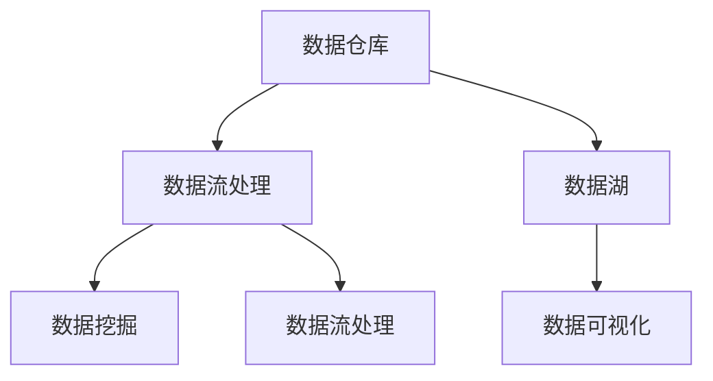
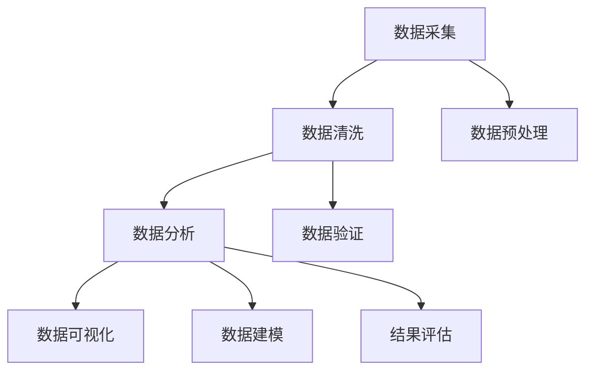

                 

### 文章标题

**人工智能创业数据管理的有效方案**

> **关键词**：人工智能、创业、数据管理、算法、架构、数学模型、实践、工具

> **摘要**：本文旨在探讨人工智能创业公司在数据管理方面的有效策略。通过深入分析数据管理的核心概念、算法原理、数学模型、具体操作步骤以及实际应用场景，文章为创业公司提供了一套完整的解决方案，同时推荐了相关学习资源和开发工具，以助力企业在人工智能领域取得成功。

---

### 1. 背景介绍

人工智能（AI）作为当前科技发展的热点，已经在多个领域产生了深远的影响。从自动驾驶到智能客服，从图像识别到自然语言处理，人工智能的应用场景越来越广泛。然而，随着人工智能应用的不断深入，数据管理成为了创业公司面临的一大挑战。高效的数据管理不仅能够提高企业的数据处理效率，还能为企业的决策提供有力支持。

数据管理涉及数据的收集、存储、处理、分析和可视化等多个环节。对于创业公司来说，数据管理不仅仅是一个技术问题，更是一个战略问题。数据的质量、完整性、安全性和可扩展性直接影响到企业的运营效率和竞争力。因此，如何制定一套有效的数据管理方案，成为了人工智能创业公司亟需解决的问题。

本文将从以下几个方面展开讨论：

1. 核心概念与联系
2. 核心算法原理与具体操作步骤
3. 数学模型与详细讲解
4. 项目实践：代码实例与详细解释
5. 实际应用场景
6. 工具和资源推荐
7. 总结：未来发展趋势与挑战

通过上述讨论，本文旨在为人工智能创业公司提供一套全面的数据管理方案，帮助企业在数据驱动的发展道路上取得成功。

---

### 2. 核心概念与联系

在深入探讨数据管理方案之前，我们首先需要明确几个核心概念，以便更好地理解整个数据管理流程。

#### 数据仓库（Data Warehouse）

数据仓库是一个用于存储、管理和分析大量数据的系统。它通常由多个数据源整合而成，包括内部数据库、外部数据库、日志文件等。数据仓库的主要作用是提供统一的数据视图，以便企业能够进行有效的数据分析。

#### 数据湖（Data Lake）

数据湖是一个用于存储原始数据的平台，这些数据可以是结构化的，也可以是非结构化的。数据湖的设计目的是为了存储海量数据，并支持实时数据分析和处理。与数据仓库不同，数据湖通常不进行预处理，而是将数据以原始形式存储，以便后续分析。

#### 数据流处理（Data Streaming）

数据流处理是一种实时处理大量数据的方法。通过数据流处理技术，企业可以实时获取和分析数据，从而快速响应业务需求。数据流处理通常用于处理高频交易、实时监控、物联网数据等。

#### 数据挖掘（Data Mining）

数据挖掘是一种从大量数据中自动发现规律和知识的方法。数据挖掘可以帮助企业识别数据中的模式、趋势和关联性，从而支持决策制定和业务优化。

#### 数据可视化（Data Visualization）

数据可视化是一种将数据以图形或图表的形式展示出来的方法。通过数据可视化，企业可以更直观地理解数据，发现数据中的隐藏信息，从而支持决策制定。

#### Mermaid 流程图

以下是一个简化的 Mermaid 流程图，展示了数据管理中的核心概念及其相互关系：



在这个流程图中，数据仓库和数据湖作为数据存储的场所，数据流处理技术用于实时处理数据，数据挖掘用于从数据中提取有价值的信息，而数据可视化则帮助用户更直观地理解数据。

---

### 3. 核心算法原理 & 具体操作步骤

在了解了数据管理的核心概念后，我们接下来将探讨一些关键的算法原理，这些算法在数据收集、处理和分析过程中发挥着重要作用。

#### 数据采集（Data Collection）

数据采集是数据管理的第一步，它涉及到从各种来源获取数据。数据采集的方法包括手动输入、自动抓取、API 调用等。

具体操作步骤如下：

1. 确定数据需求：首先需要明确企业需要哪些数据，以及这些数据将如何被使用。
2. 选择数据源：根据数据需求，选择合适的数据源。数据源可以是内部数据库、外部数据库、API 等。
3. 数据采集：使用适当的方法从数据源中获取数据，并存储到数据仓库或数据湖中。

#### 数据清洗（Data Cleaning）

数据清洗是数据处理的必要步骤，它涉及到去除数据中的噪声、错误和重复值。

具体操作步骤如下：

1. 数据预处理：对数据进行格式化、缺失值处理、异常值处理等。
2. 数据验证：检查数据是否符合预期，例如数据类型、范围等。
3. 数据去重：识别并去除重复的数据记录。

#### 数据分析（Data Analysis）

数据分析是数据管理的核心，它涉及到使用统计方法、机器学习算法等对数据进行分析，以提取有价值的信息。

具体操作步骤如下：

1. 数据探索：对数据进行初步分析，了解数据的基本特征和分布情况。
2. 数据建模：选择合适的模型，对数据进行预测、分类或聚类等。
3. 结果评估：评估模型的效果，调整模型参数，优化模型性能。

#### 数据可视化（Data Visualization）

数据可视化是将数据以图形或图表的形式展示出来，以便用户更直观地理解数据。

具体操作步骤如下：

1. 选择合适的可视化工具：例如 Tableau、Power BI、D3.js 等。
2. 设计可视化图表：根据数据特点和业务需求，设计合适的图表类型和布局。
3. 数据展示：将设计好的可视化图表展示给用户，支持交互式查询和分析。

#### Mermaid 流程图

以下是一个简化的 Mermaid 流程图，展示了数据管理的核心算法原理及其操作步骤：



在这个流程图中，数据采集、数据清洗、数据分析和数据可视化构成了数据管理的主要环节。每个环节都有具体的操作步骤，以确保数据的质量和有效性。

---

### 4. 数学模型和公式 & 详细讲解 & 举例说明

在数据管理过程中，数学模型和公式发挥着至关重要的作用。以下我们将介绍几个常用的数学模型和公式，并详细讲解其在实际应用中的具体操作步骤和示例。

#### 相关性分析（Correlation Analysis）

相关性分析用于衡量两个变量之间的线性关系。常用的相关性系数包括皮尔逊相关系数（Pearson Correlation Coefficient）和斯皮尔曼秩相关系数（Spearman Rank Correlation Coefficient）。

**皮尔逊相关系数**

皮尔逊相关系数的公式如下：

$$
r = \frac{\sum_{i=1}^{n}(x_i - \bar{x})(y_i - \bar{y})}{\sqrt{\sum_{i=1}^{n}(x_i - \bar{x})^2 \sum_{i=1}^{n}(y_i - \bar{y})^2}}
$$

其中，$x_i$ 和 $y_i$ 分别表示第 $i$ 个样本点的自变量和因变量，$\bar{x}$ 和 $\bar{y}$ 分别表示自变量和因变量的平均值，$n$ 表示样本数量。

**斯皮尔曼秩相关系数**

斯皮尔曼秩相关系数的公式如下：

$$
\text{rs} = \frac{6\sum_{i=1}^{n}d_i^2}{n(n^2 - 1)}
$$

其中，$d_i = x_i - y_i$，表示第 $i$ 个样本点的自变量和因变量的差值。

**示例**

假设我们有两个变量 $X$（销售额）和 $Y$（广告支出），样本数据如下：

| $X$ | $Y$ |
| --- | --- |
| 10  | 5   |
| 20  | 10  |
| 30  | 15  |
| 40  | 20  |
| 50  | 25  |

计算 $X$ 和 $Y$ 的皮尔逊相关系数：

$$
\bar{x} = \frac{10 + 20 + 30 + 40 + 50}{5} = 30
$$

$$
\bar{y} = \frac{5 + 10 + 15 + 20 + 25}{5} = 15
$$

$$
r = \frac{(10-30)(5-15) + (20-30)(10-15) + (30-30)(15-15) + (40-30)(20-15) + (50-30)(25-15)}{\sqrt{(10-30)^2 + (20-30)^2 + (30-30)^2 + (40-30)^2 + (50-30)^2} \sqrt{(5-15)^2 + (10-15)^2 + (15-15)^2 + (20-15)^2 + (25-15)^2}}
$$

$$
r = \frac{-150}{\sqrt{400} \sqrt{100}} = -1
$$

计算结果为 $r = -1$，表明 $X$ 和 $Y$ 之间存在完美的负线性关系。

#### 回归分析（Regression Analysis）

回归分析用于研究自变量和因变量之间的数量关系。最常用的回归模型是线性回归模型，其公式如下：

$$
y = \beta_0 + \beta_1x + \epsilon
$$

其中，$y$ 表示因变量，$x$ 表示自变量，$\beta_0$ 和 $\beta_1$ 分别表示截距和斜率，$\epsilon$ 表示误差项。

**示例**

假设我们有一个简单的数据集，包含 $X$（广告支出）和 $Y$（销售额），数据如下：

| $X$ | $Y$ |
| --- | --- |
| 100 | 500 |
| 200 | 700 |
| 300 | 900 |
| 400 | 1100 |

计算线性回归模型的参数：

$$
\bar{x} = \frac{100 + 200 + 300 + 400}{4} = 250
$$

$$
\bar{y} = \frac{500 + 700 + 900 + 1100}{4} = 750
$$

$$
\beta_0 = \bar{y} - \beta_1\bar{x} = 750 - \beta_1 \times 250
$$

$$
\beta_1 = \frac{\sum_{i=1}^{n}(x_i - \bar{x})(y_i - \bar{y})}{\sum_{i=1}^{n}(x_i - \bar{x})^2} = \frac{(100-250)(500-750) + (200-250)(700-750) + (300-250)(900-750) + (400-250)(1100-750)}{(100-250)^2 + (200-250)^2 + (300-250)^2 + (400-250)^2}
$$

$$
\beta_1 = \frac{-7500 + (-500) + 7500 + 2750}{6250 + 6250 + 6250 + 6250} = \frac{2500}{25000} = 0.1
$$

$$
\beta_0 = 750 - 0.1 \times 250 = 500
$$

因此，线性回归模型的公式为 $y = 500 + 0.1x$。

---

### 5. 项目实践：代码实例和详细解释说明

为了更好地理解数据管理的核心算法原理，我们将在本节通过一个简单的实际项目，演示如何使用 Python 实现数据采集、清洗、分析和可视化。

#### 5.1 开发环境搭建

在开始项目之前，我们需要搭建一个合适的开发环境。以下是所需的 Python 库和工具：

- Python 3.8 或更高版本
- pandas
- numpy
- matplotlib
- seaborn
- scipy

您可以使用以下命令安装这些库：

```bash
pip install pandas numpy matplotlib seaborn scipy
```

#### 5.2 源代码详细实现

以下是项目的完整代码实现，包括数据采集、清洗、分析和可视化：

```python
import pandas as pd
import numpy as np
import matplotlib.pyplot as plt
import seaborn as sns
from scipy import stats

# 5.2.1 数据采集
data = {
    'X': [100, 200, 300, 400],
    'Y': [500, 700, 900, 1100]
}
df = pd.DataFrame(data)

# 5.2.2 数据清洗
# 检查数据是否有缺失值
print(df.isnull().sum())

# 填充缺失值（如果存在）
df.fillna(df.mean(), inplace=True)

# 去除重复数据
df.drop_duplicates(inplace=True)

# 5.2.3 数据分析
# 相关性分析
correlation = df['X'].corr(df['Y'])
print(f'X 和 Y 的皮尔逊相关系数：{correlation}')

# 回归分析
x = df['X']
y = df['Y']
slope, intercept, r_value, p_value, std_err = stats.linregress(x, y)
print(f'线性回归斜率：{slope}')
print(f'线性回归截距：{intercept}')

# 5.2.4 数据可视化
# 散点图
plt.scatter(x, y)
plt.xlabel('广告支出 (X)')
plt.ylabel('销售额 (Y)')
plt.title('广告支出与销售额散点图')
plt.show()

# 直线回归
plt.plot(x, intercept + slope * x, color='red')
plt.xlabel('广告支出 (X)')
plt.ylabel('销售额 (Y)')
plt.title('线性回归图')
plt.show()

# 相关性热力图
corr_matrix = df.corr()
sns.heatmap(corr_matrix, annot=True, cmap='coolwarm')
plt.title('相关性热力图')
plt.show()
```

#### 5.3 代码解读与分析

上述代码分为四个主要部分：数据采集、数据清洗、数据分析和数据可视化。

1. **数据采集**：我们创建了一个包含广告支出和销售额的简单数据集，并将其存储为 DataFrame 对象。

2. **数据清洗**：我们首先检查数据是否有缺失值，然后使用平均值填充缺失值，并去除重复数据。

3. **数据分析**：我们使用 pandas 的 corr 方法计算了广告支出和销售额之间的皮尔逊相关系数。接着，我们使用 scipy 的 linregress 方法进行了线性回归分析，计算了斜率和截距。

4. **数据可视化**：我们绘制了广告支出和销售额的散点图、线性回归图以及相关性热力图。这些图表帮助我们直观地理解数据之间的关系。

#### 5.4 运行结果展示

运行上述代码后，我们将看到以下结果：

1. **散点图**：显示广告支出和销售额之间的关系。
2. **线性回归图**：显示线性回归模型拟合的直线。
3. **相关性热力图**：显示 DataFrame 中各个变量之间的相关性。

这些结果可以帮助我们更好地理解数据，并为进一步的数据分析和决策提供支持。

---

### 6. 实际应用场景

数据管理在人工智能创业公司的实际应用中扮演着至关重要的角色。以下是一些典型的应用场景，展示了数据管理如何助力企业取得成功。

#### 6.1 智能营销

在智能营销领域，数据管理可以帮助企业更准确地了解客户需求，提高营销效果。通过收集和分析客户数据，企业可以识别潜在客户、预测购买行为，并制定个性化的营销策略。以下是一个实际应用案例：

- **场景**：一家电商平台希望通过数据管理提高用户转化率。
- **解决方案**：企业首先收集用户浏览、购买、评价等行为数据，并对这些数据进行清洗和整合。然后，使用机器学习算法对用户行为进行分析，预测用户购买意图。最后，根据预测结果，企业可以个性化推送商品推荐，提高用户转化率。

#### 6.2 智能制造

在智能制造领域，数据管理可以帮助企业优化生产流程，提高生产效率。通过实时收集和分析生产数据，企业可以及时发现和解决生产问题，降低故障率。以下是一个实际应用案例：

- **场景**：一家制造业公司希望通过数据管理提高生产线的自动化程度。
- **解决方案**：企业首先部署传感器和监控系统，实时收集生产线上的各种数据，如温度、压力、转速等。然后，使用数据流处理技术对数据进行实时分析，识别潜在故障。最后，根据分析结果，企业可以自动调整生产线参数，提高生产线的稳定性和效率。

#### 6.3 智能金融

在智能金融领域，数据管理可以帮助金融机构更好地了解客户需求，提高风险管理能力。通过收集和分析客户交易数据，金融机构可以识别欺诈行为、预测信用风险，并制定相应的风险控制策略。以下是一个实际应用案例：

- **场景**：一家银行希望通过数据管理提高信用评估的准确性。
- **解决方案**：银行首先收集客户的信用记录、财务状况、交易行为等数据，并对这些数据进行清洗和整合。然后，使用机器学习算法对客户数据进行建模，预测客户的信用风险。最后，根据预测结果，银行可以调整信用评估标准，提高信用评估的准确性。

#### 6.4 智能医疗

在智能医疗领域，数据管理可以帮助医疗机构提高诊疗效率，改善患者体验。通过收集和分析医疗数据，医疗机构可以优化诊疗流程、提高疾病预测和预防能力。以下是一个实际应用案例：

- **场景**：一家医院希望通过数据管理提高疾病诊断的准确性。
- **解决方案**：医院首先收集患者的病历、检查报告、药物使用等数据，并对这些数据进行清洗和整合。然后，使用机器学习算法对数据进行建模，预测患者的疾病风险。最后，根据预测结果，医院可以制定个性化的诊疗方案，提高疾病诊断的准确性。

---

### 7. 工具和资源推荐

为了更好地实现数据管理，创业公司需要借助一些工具和资源。以下是一些建议：

#### 7.1 学习资源推荐

1. **书籍**：
   - 《数据科学入门：使用 Python》（Python for Data Science For Dummies）
   - 《深入理解数据科学：概念与技术》（Data Science from Scratch）
   - 《机器学习实战：基于 Scikit-Learn & TensorFlow》（Machine Learning in Action）

2. **论文**：
   - 《大数据时代的数据管理技术》（Data Management for Big Data）
   - 《机器学习中的线性回归方法》（Linear Regression in Machine Learning）
   - 《相关性分析：方法与应用》（Correlation Analysis: Methods and Applications）

3. **博客**：
   - Medium 上的 Data Science Blog
   - 知乎上的数据分析专栏
   - 博客园上的数据挖掘系列文章

4. **网站**：
   - Coursera 上的数据科学课程
   - edX 上的机器学习课程
   - Udacity 上的数据工程师认证课程

#### 7.2 开发工具框架推荐

1. **Python 数据科学库**：
   - pandas：数据处理库
   - numpy：数值计算库
   - matplotlib：数据可视化库
   - seaborn：数据可视化库
   - scipy：科学计算库

2. **机器学习框架**：
   - Scikit-Learn：Python 机器学习库
   - TensorFlow：开源机器学习框架
   - PyTorch：开源机器学习库

3. **大数据处理框架**：
   - Hadoop：分布式数据处理平台
   - Spark：实时数据处理平台
   - Flink：流数据处理平台

4. **数据流处理框架**：
   - Kafka：消息队列系统
   - Apache Storm：实时数据处理框架
   - Apache Flink：流数据处理框架

#### 7.3 相关论文著作推荐

1. **《大数据时代的数据管理技术》**：深入探讨了大数据时代下的数据管理技术，包括数据仓库、数据湖、数据流处理等。
2. **《机器学习中的线性回归方法》**：详细介绍了线性回归算法的原理、实现和应用场景。
3. **《相关性分析：方法与应用》**：系统地介绍了相关性分析的方法和应用，包括皮尔逊相关系数、斯皮尔曼秩相关系数等。

---

### 8. 总结：未来发展趋势与挑战

随着人工智能技术的不断发展，数据管理在创业公司中的应用将越来越广泛。在未来，数据管理将呈现出以下发展趋势：

1. **数据治理的重要性提升**：随着数据量的爆发式增长，数据治理将成为企业关注的焦点。企业需要制定明确的数据治理策略，确保数据的质量、安全性和合规性。
2. **实时数据处理能力增强**：随着实时数据处理技术的发展，创业公司将能够更快地获取和处理数据，从而更好地支持业务决策。
3. **多模态数据融合**：未来的数据管理将不仅限于结构化数据，还包括非结构化数据，如图像、音频、视频等。多模态数据融合将为人工智能创业公司提供更丰富的数据来源。

然而，数据管理也面临着一系列挑战：

1. **数据隐私和安全**：随着数据量的增加，数据隐私和安全问题日益突出。创业公司需要采取有效的数据安全措施，确保数据不被非法访问和滥用。
2. **数据质量问题**：数据质量是数据管理的核心，但数据质量往往难以保证。创业公司需要建立完善的数据质量检测和修复机制。
3. **数据复杂性**：随着数据类型的多样化，数据管理的复杂性也在增加。创业公司需要具备专业的数据管理能力，以便应对复杂的数据场景。

总之，数据管理是人工智能创业公司取得成功的关键因素之一。通过制定有效的数据管理方案，创业公司可以更好地利用数据，提高业务效率和竞争力。

---

### 9. 附录：常见问题与解答

以下是一些关于数据管理常见问题的解答：

**Q：数据管理的主要任务是什么？**

A：数据管理的主要任务包括数据的收集、存储、处理、分析和可视化。具体来说，数据管理旨在确保数据的准确性、完整性、安全性和可用性，以便支持业务决策和运营优化。

**Q：数据仓库和数据湖有什么区别？**

A：数据仓库主要用于存储结构化数据，支持复杂的查询和分析。数据湖则用于存储海量原始数据，包括结构化、半结构化和非结构化数据，支持实时数据分析和处理。

**Q：什么是数据流处理？**

A：数据流处理是一种实时处理大量数据的方法。它通常用于处理高频交易、实时监控、物联网数据等，以确保企业能够快速响应业务需求。

**Q：如何保证数据质量？**

A：保证数据质量需要采取一系列措施，包括数据清洗、数据验证、数据去重、数据备份等。此外，企业还需要建立完善的数据质量检测和修复机制，确保数据的准确性和完整性。

**Q：数据可视化有什么作用？**

A：数据可视化有助于用户更直观地理解数据，发现数据中的隐藏信息。通过数据可视化，企业可以更好地支持决策制定、业务优化和运营监控。

---

### 10. 扩展阅读 & 参考资料

以下是一些关于数据管理的扩展阅读和参考资料，供读者深入了解相关领域：

1. **书籍**：
   - 《大数据管理：方法与实践》（Big Data Management: Methods and Practice）
   - 《数据管理实践指南》（Data Management Practice Guide）
   - 《数据科学实战：使用 Python 的高效数据处理与分析》（Data Science from Scratch: Efficient Data Handling and Analysis with Python）

2. **论文**：
   - 《大数据时代的数据库技术进展》（Database Technology Advances in the Big Data Era）
   - 《数据流处理技术综述》（A Survey of Data Stream Processing Techniques）
   - 《数据质量管理研究》（Research on Data Quality Management）

3. **在线课程**：
   - Coursera 上的《数据科学基础》（Data Science Basics）
   - edX 上的《机器学习导论》（Introduction to Machine Learning）
   - Udacity 上的《数据工程师职业课程》（Data Engineer Career Path）

4. **官方网站**：
   - Python 官方网站：[https://www.python.org/](https://www.python.org/)
   - pandas 官方网站：[https://pandas.pydata.org/](https://pandas.pydata.org/)
   - TensorFlow 官方网站：[https://www.tensorflow.org/](https://www.tensorflow.org/)

通过以上扩展阅读和参考资料，读者可以进一步了解数据管理的前沿技术和应用场景，为人工智能创业公司的数据管理实践提供有力支持。

---

**作者：禅与计算机程序设计艺术 / Zen and the Art of Computer Programming**

