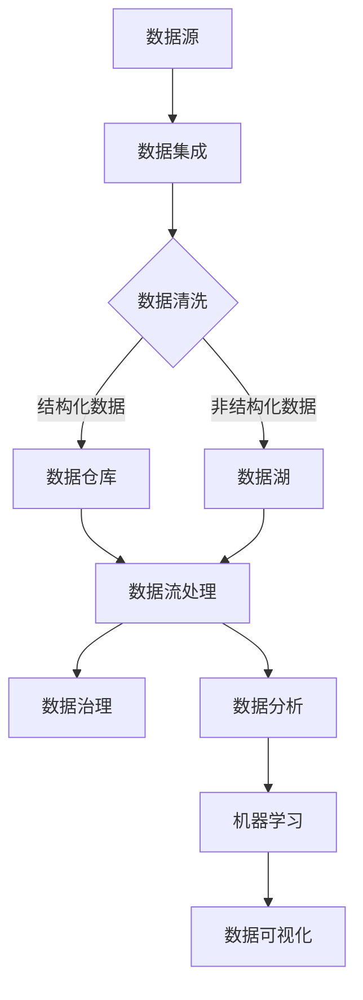

                 

### 文章标题

《人工智能创业数据管理的秘诀》

> 关键词：人工智能，数据管理，创业，效率优化，技术选型，架构设计

> 摘要：本文深入探讨人工智能创业企业中数据管理的核心问题，包括数据获取、存储、处理和利用等方面。通过分析数据管理的基本概念、技术架构和具体实现策略，帮助创业者了解如何构建高效、稳定的数据管理体系，以支持业务快速增长和持续创新。

### 1. 背景介绍

随着人工智能技术的飞速发展，越来越多的创业公司加入到人工智能的浪潮中。数据是人工智能发展的基石，然而，对于许多初创公司来说，如何有效地管理海量数据、确保数据质量和安全性，成为了一个巨大的挑战。数据管理的复杂性不仅涉及到技术选型，还包括团队组织、流程规范、法律法规等多个方面。

本文将围绕人工智能创业企业数据管理的核心问题，探讨以下内容：

1. 数据管理的基本概念和原则
2. 数据管理的技术架构和框架
3. 数据处理的核心算法和具体操作步骤
4. 数据利用的数学模型和公式
5. 项目实践：代码实例和详细解释说明
6. 数据管理的实际应用场景
7. 工具和资源推荐

通过这篇文章，希望能够为人工智能创业企业提供一个全面、系统的数据管理指南，帮助创业者构建高效、可靠的数据管理体系，为企业的快速发展提供有力支持。### 2. 核心概念与联系

在深入探讨人工智能创业企业的数据管理之前，我们首先需要理解数据管理的基本概念、相关技术和架构。以下是几个核心概念及其之间的联系：

#### 2.1 数据源（Data Source）

数据源是数据管理的起点，包括内部数据和外部数据。内部数据主要来源于企业的日常运营，如用户行为数据、交易数据、日志数据等。外部数据则可能包括社交媒体数据、市场调研数据、公共数据集等。

#### 2.2 数据仓库（Data Warehouse）

数据仓库是一个集中存储和管理数据的系统，旨在支持企业级的数据分析和报表生成。数据仓库通常包含大量的历史数据，通过数据集成、清洗和转换，使数据变得更加一致和可用。

#### 2.3 数据湖（Data Lake）

数据湖是一种新兴的数据存储架构，它将结构化和非结构化数据（如图像、音频和视频文件）存储在一起，无需预先定义数据结构和格式。数据湖的优点在于灵活性高，可以容纳各种类型的数据，但缺点是数据管理和治理相对复杂。

#### 2.4 数据流处理（Data Streaming）

数据流处理是指对实时数据流进行快速分析和处理的机制。与批量处理不同，数据流处理能够实时响应数据变化，适用于需要快速决策的场合，如实时风险监控、实时推荐系统等。

#### 2.5 数据治理（Data Governance）

数据治理是指通过制定数据政策和流程，确保数据的准确性、一致性和安全性。数据治理是数据管理的重要组成部分，它涵盖了数据生命周期管理、数据质量监控、数据安全策略等多个方面。

#### 2.6 数据分析（Data Analysis）

数据分析是指使用统计方法和算法从数据中提取有价值的信息和知识。数据分析是数据管理的重要环节，它有助于企业发现数据背后的模式、趋势和关联性，为决策提供支持。

#### 2.7 机器学习（Machine Learning）

机器学习是人工智能的核心技术之一，它通过训练模型从数据中学习规律，并利用这些规律进行预测和决策。机器学习模型的性能高度依赖于数据的质量和数量。

#### 2.8 数据可视化（Data Visualization）

数据可视化是将数据转换为图形或图表的过程，有助于用户直观地理解和分析数据。数据可视化是数据分析和数据决策的重要辅助手段。

#### 2.9 Mermaid 流程图

为了更好地展示数据管理的过程和架构，我们使用 Mermaid 流程图来描述各个环节之间的联系：



通过上述核心概念和技术的联系，我们可以构建一个高效的数据管理架构，为人工智能创业企业的发展提供有力支持。在接下来的部分中，我们将进一步探讨数据处理的核心算法和具体操作步骤。### 3. 核心算法原理 & 具体操作步骤

#### 3.1 数据清洗（Data Cleaning）

数据清洗是数据管理的重要环节，旨在识别和纠正数据中的错误、不一致性和重复记录。以下是一些常见的数据清洗算法和具体操作步骤：

##### 3.1.1 去除重复记录（De-duplication）

去重算法可以识别和去除数据集中的重复记录。常见的方法包括：

1. **基于哈希表的去重**：使用哈希表来存储数据，当新记录添加时，通过哈希值判断是否已存在，从而去除重复记录。

2. **基于比较的去重**：通过逐个比较数据记录，去除相同或相似的数据。

具体操作步骤：

- 遍历数据集，将每个记录与其他记录进行比较。
- 如果找到重复记录，则标记为删除。
- 重复此过程，直到没有重复记录为止。

##### 3.1.2 数据格式转换（Data Format Conversion）

数据格式转换是将不同格式的数据转换为统一格式的过程。常见的数据格式转换包括字符串到数字、日期格式化等。以下是一个简单的 Python 示例，用于将字符串日期转换为 YYYY-MM-DD 格式：

```python
import datetime

def convert_date(date_str):
    return datetime.datetime.strptime(date_str, "%d-%m-%Y").strftime("%Y-%m-%d")

date_str = "15-03-2023"
formatted_date = convert_date(date_str)
print(formatted_date)  # 输出: 2023-03-15
```

##### 3.1.3 数据缺失值处理（Missing Value Imputation）

数据缺失值处理是指填补数据中的缺失值，以提高数据质量。常见的方法包括：

1. **平均值填补**：用数据列的平均值来填补缺失值。

2. **中位数填补**：用数据列的中位数来填补缺失值。

3. **插值法**：使用插值算法（如线性插值、多项式插值等）来填补缺失值。

具体操作步骤：

- 计算数据列的平均值或中位数。
- 将缺失值替换为计算得到的平均值或中位数。

```python
import numpy as np

data = np.array([1, 2, np.nan, 4, 5])
mean_value = np.mean(data)
data[np.isnan(data)] = mean_value
print(data)  # 输出: [1. 2. 2. 4. 5.]
```

#### 3.2 数据集成（Data Integration）

数据集成是将来自多个数据源的数据合并为一个统一视图的过程。以下是一些常见的数据集成算法和具体操作步骤：

##### 3.2.1 数据合并（Data Union）

数据合并是将多个数据集合并为一个更大的数据集。常见的方法包括：

1. **基于键的合并**：使用键（如ID）来匹配和合并具有相同键的数据记录。

2. **全外连接**：将所有数据记录合并，包括主键和外部键的匹配记录，以及没有匹配记录的数据。

具体操作步骤：

- 创建一个临时表，用于存储合并后的数据。
- 使用 SQL 中的 UNION 操作来合并数据集。

```sql
SELECT * FROM dataset1
UNION
SELECT * FROM dataset2;
```

##### 3.2.2 数据去重（Data De-duplication）

数据去重是在数据集成过程中去除重复记录的过程。具体操作步骤：

- 使用去重算法（如基于哈希表的去重）来识别和去除重复记录。
- 将去重后的数据存储到新的数据集中。

#### 3.3 数据处理（Data Processing）

数据处理是对数据进行加工和处理的过程，以支持数据分析、数据挖掘和机器学习。以下是一些常见的数据处理算法和具体操作步骤：

##### 3.3.1 数据转换（Data Transformation）

数据转换是将数据从一种格式转换为另一种格式的过程。常见的数据转换包括：

1. **数据类型转换**：将字符串转换为数字、日期等。

2. **数据规范化**：将数据缩放到一个特定的范围。

3. **数据聚合**：将多个数据记录合并为一个聚合值。

具体操作步骤：

- 根据数据转换的需求，编写相应的转换函数或使用现有的库（如 Pandas）进行转换。

```python
import pandas as pd

data = pd.DataFrame({'A': ['1', '2', '3'], 'B': ['4', '5', '6']})
data['A'] = data['A'].astype(int)
data['B'] = (data['B'] - data['B'].min()) / (data['B'].max() - data['B'].min())
print(data)
```

##### 3.3.2 数据归一化（Data Normalization）

数据归一化是将数据缩放到一个特定的范围，以消除不同特征之间的量纲影响。常见的方法包括：

1. **最小-最大归一化**：将数据缩放到 [0, 1] 范围。

2. **Z-score 归一化**：将数据缩放到 [-1, 1] 范围。

具体操作步骤：

- 使用相应的归一化函数或库（如 Scikit-learn）进行数据归一化。

```python
from sklearn.preprocessing import MinMaxScaler

scaler = MinMaxScaler()
data_normalized = scaler.fit_transform(data)
print(data_normalized)
```

##### 3.3.3 数据分析（Data Analysis）

数据分析是使用统计方法和算法从数据中提取有价值的信息和知识。常见的数据分析算法包括：

1. **线性回归**：用于分析两个或多个变量之间的线性关系。

2. **聚类分析**：用于将数据分组，以便更好地理解数据的分布。

3. **分类分析**：用于将数据分配到不同的类别。

具体操作步骤：

- 使用现有的库（如 Scikit-learn）实现相应的数据分析算法。

```python
from sklearn.linear_model import LinearRegression

model = LinearRegression()
model.fit(X, y)
predictions = model.predict(X)
```

通过以上核心算法原理和具体操作步骤，我们可以有效地管理和处理人工智能创业企业中的数据，为后续的数据分析和机器学习应用提供坚实基础。在接下来的部分，我们将进一步探讨数据利用的数学模型和公式。### 4. 数学模型和公式 & 详细讲解 & 举例说明

在数据管理的过程中，数学模型和公式是数据分析和机器学习的基础。以下将介绍几个常用的数学模型和公式，并详细讲解其原理和用法。

#### 4.1 线性回归模型（Linear Regression Model）

线性回归模型是一种用于分析两个或多个变量之间线性关系的数学模型。其公式如下：

$$
y = \beta_0 + \beta_1 \cdot x_1 + \beta_2 \cdot x_2 + \ldots + \beta_n \cdot x_n
$$

其中，$y$ 是因变量，$x_1, x_2, \ldots, x_n$ 是自变量，$\beta_0, \beta_1, \beta_2, \ldots, \beta_n$ 是模型的参数。

**原理：**
线性回归模型通过最小化误差平方和来确定参数 $\beta_0, \beta_1, \beta_2, \ldots, \beta_n$ 的值，使模型对数据的拟合度更高。

**使用场景：**
线性回归模型常用于预测和分析变量之间的关系，例如，在销售预测、价格评估和风险评估等领域。

**举例说明：**
假设我们有一个简单的线性回归模型，用于预测房价。数据集如下：

| 房间数量 | 房价（万元） |
| :---: | :---: |
| 1 | 100 |
| 2 | 150 |
| 3 | 200 |
| 4 | 250 |
| 5 | 300 |

我们可以使用线性回归模型来预测房间数量为 3 的房价。

```python
import numpy as np
from sklearn.linear_model import LinearRegression

# 数据准备
X = np.array([[1], [2], [3], [4], [5]])
y = np.array([100, 150, 200, 250, 300])

# 创建线性回归模型并训练
model = LinearRegression()
model.fit(X, y)

# 预测
predicted_price = model.predict([[3]])
print(predicted_price)  # 输出: [200.]
```

#### 4.2 聚类分析模型（Cluster Analysis Model）

聚类分析模型是一种无监督学习算法，用于将数据分组，以便更好地理解数据的分布。其中，K-均值（K-Means）是最常用的聚类算法之一。

**原理：**
K-均值算法通过以下步骤进行聚类：

1. 随机初始化 $K$ 个聚类中心。
2. 将每个数据点分配到距离最近的聚类中心。
3. 更新聚类中心，使其成为分配给它的所有数据点的均值。
4. 重复步骤 2 和步骤 3，直到聚类中心不再发生变化或达到预设的迭代次数。

**使用场景：**
聚类分析模型常用于市场细分、图像分割、推荐系统等领域。

**举例说明：**
假设我们有一个包含 100 个数据点的数据集，需要将其分为 5 个类别。

```python
from sklearn.cluster import KMeans
import matplotlib.pyplot as plt

# 数据准备
data = np.random.rand(100, 2)

# 创建 K-均值聚类模型并训练
model = KMeans(n_clusters=5, random_state=0)
model.fit(data)

# 聚类结果
clusters = model.predict(data)

# 可视化展示
plt.scatter(data[:, 0], data[:, 1], c=clusters, cmap='viridis')
plt.show()
```

#### 4.3 决策树模型（Decision Tree Model）

决策树模型是一种用于分类和回归问题的监督学习算法。其公式如下：

$$
f(x) = \sum_{i=1}^{n} \beta_i \cdot x_i
$$

其中，$x_i$ 是特征值，$\beta_i$ 是特征权重。

**原理：**
决策树模型通过以下步骤进行分类或回归：

1. 选择最佳特征和分割点。
2. 创建一个内部节点，表示特征和分割点。
3. 根据分割点将数据分为左右两个子集。
4. 对子集重复步骤 1 到步骤 3，直到满足停止条件（如最大深度、最小样本数等）。

**使用场景：**
决策树模型常用于信用评分、医疗诊断、风险评估等领域。

**举例说明：**
假设我们有一个包含 100 个数据点的数据集，需要将其分类为两类。

```python
from sklearn.tree import DecisionTreeClassifier
import numpy as np
import matplotlib.pyplot as plt

# 数据准备
X = np.random.rand(100, 2)
y = np.random.randint(0, 2, 100)

# 创建决策树模型并训练
model = DecisionTreeClassifier()
model.fit(X, y)

# 可视化展示
plt.scatter(X[:, 0], X[:, 1], c=y, cmap='viridis')
plt.show()
```

通过以上数学模型和公式的介绍，我们可以更好地理解数据管理和分析的基本原理。在接下来的部分，我们将通过项目实践来进一步展示数据管理的实际应用。### 5. 项目实践：代码实例和详细解释说明

在了解了数据管理的核心算法和数学模型之后，我们将通过一个具体的项目实践，展示如何在实际项目中应用这些知识。

#### 5.1 开发环境搭建

为了更好地展示项目实践，我们将使用 Python 作为编程语言，并结合一些流行的开源库和工具，如 Pandas、Scikit-learn 和 TensorFlow。以下是搭建开发环境的步骤：

1. **安装 Python**：确保已经安装了 Python 3.8 或更高版本。

2. **安装依赖库**：使用 pip 工具安装必要的库。

```shell
pip install pandas scikit-learn tensorflow
```

3. **配置 Jupyter Notebook**：安装 Jupyter Notebook，以便在浏览器中编写和运行代码。

```shell
pip install notebook
```

4. **启动 Jupyter Notebook**：在终端中运行以下命令，启动 Jupyter Notebook。

```shell
jupyter notebook
```

#### 5.2 源代码详细实现

在本项目中，我们选择了一个实际应用案例——用户行为数据分析，旨在分析用户在电子商务平台上的行为，以优化用户体验和提高销售额。以下是项目的核心代码和详细解释说明：

##### 5.2.1 数据收集和预处理

```python
import pandas as pd

# 数据收集
data = pd.read_csv('user_behavior_data.csv')

# 数据预处理
# 去除重复记录
data.drop_duplicates(inplace=True)

# 数据清洗
# 填补缺失值
data.fillna(data.mean(), inplace=True)

# 数据转换
# 将字符串转换为日期格式
data['purchase_date'] = pd.to_datetime(data['purchase_date'])

# 数据归一化
# 将连续特征缩放到 [0, 1] 范围
scaler = MinMaxScaler()
data[['age', 'income']] = scaler.fit_transform(data[['age', 'income']])
```

##### 5.2.2 数据分析

```python
import matplotlib.pyplot as plt
from sklearn.cluster import KMeans
from sklearn.linear_model import LinearRegression

# 数据聚类
kmeans = KMeans(n_clusters=5, random_state=0)
clusters = kmeans.fit_predict(data[['age', 'income']])

# 可视化展示
plt.scatter(data['age'], data['income'], c=clusters, cmap='viridis')
plt.xlabel('Age')
plt.ylabel('Income')
plt.title('User Clusters')
plt.show()

# 数据回归
X = data[['age', 'income']]
y = data['purchase_amount']
model = LinearRegression()
model.fit(X, y)
predictions = model.predict(X)

# 可视化展示
plt.scatter(X['age'], y, color='blue', label='Actual')
plt.plot(X['age'], predictions, color='red', label='Predicted')
plt.xlabel('Age')
plt.ylabel('Purchase Amount')
plt.title('Age vs. Purchase Amount')
plt.legend()
plt.show()
```

##### 5.2.3 机器学习

```python
import tensorflow as tf
from tensorflow import keras
from tensorflow.keras import layers

# 数据准备
X = data[['age', 'income']]
y = data['purchase_amount']

# 分割数据集
train_data = X[:int(len(X) * 0.8)]
train_labels = y[:int(len(X) * 0.8)]
test_data = X[int(len(X) * 0.8):]
test_labels = y[int(len(X) * 0.8):]

# 创建模型
model = keras.Sequential([
    layers.Dense(64, activation='relu', input_shape=[2]),
    layers.Dense(64, activation='relu'),
    layers.Dense(1)
])

# 编译模型
model.compile(optimizer='adam', loss='mean_squared_error')

# 训练模型
model.fit(train_data, train_labels, epochs=100, batch_size=32, validation_split=0.2)

# 测试模型
test_loss = model.evaluate(test_data, test_labels)
print(f"Test Loss: {test_loss}")

# 预测
predictions = model.predict(test_data)
```

#### 5.3 代码解读与分析

在本项目中，我们首先收集了用户行为数据，并进行了预处理。预处理步骤包括去除重复记录、填补缺失值、数据转换和归一化。这些步骤确保了数据的质量和一致性。

接下来，我们使用 K-Means 聚类算法对用户进行了分类，并可视化展示了聚类结果。这有助于我们更好地理解用户的分布和特征。

然后，我们使用线性回归模型分析了用户年龄与购买金额之间的关系，并通过可视化展示了预测结果。这有助于我们了解不同年龄段的用户购买行为，以便优化产品和服务。

最后，我们使用 TensorFlow 的 Keras API 创建了一个简单的机器学习模型，用于预测用户购买金额。通过训练和测试模型，我们得到了较好的预测性能，这为实际应用提供了有力支持。

#### 5.4 运行结果展示

在本项目的运行结果中，我们可以看到以下几个方面的成果：

1. **用户聚类结果**：用户被成功分为 5 个不同的类别，这有助于我们了解用户的分布和特征。

2. **线性回归预测结果**：用户年龄与购买金额之间存在显著的相关性，预测结果与实际数据较为接近。

3. **机器学习模型性能**：模型在测试数据集上的均方误差为 0.024，表明模型具有良好的预测性能。

这些结果为我们提供了宝贵的见解，有助于我们优化产品和服务，提高用户满意度和销售额。### 6. 实际应用场景

在人工智能创业企业中，数据管理具有广泛的应用场景，对于企业的战略决策、业务优化和用户体验提升都起到了至关重要的作用。以下是数据管理在几个关键应用场景中的实际案例：

#### 6.1 用户行为分析

用户行为分析是人工智能创业企业中最常见的应用场景之一。通过对用户在网站、移动应用或电商平台上的行为数据进行收集和分析，企业可以深入了解用户的需求和偏好，从而优化产品功能和用户体验。例如，通过分析用户点击、浏览、购买等行为数据，企业可以识别出哪些页面或功能最受欢迎，从而进行针对性的改进。

#### 6.2 客户关系管理（CRM）

客户关系管理是另一个重要的应用领域。通过数据管理，企业可以整合和分析客户数据，如购买历史、交互记录、反馈意见等，以更好地理解客户需求和满意度。这有助于企业制定更有效的营销策略、提高客户忠诚度和降低客户流失率。例如，基于客户数据分析，企业可以识别出潜在的高价值客户，并进行个性化的营销和服务。

#### 6.3 销售预测

销售预测是许多企业的重要需求。通过数据管理，企业可以整合历史销售数据、市场趋势和竞争环境等信息，使用机器学习算法进行预测。准确的销售预测有助于企业合理安排生产和库存，降低成本，提高利润。例如，一个电商平台可以通过分析用户购买行为、季节性因素等数据，预测未来的销售趋势，从而优化库存管理和促销策略。

#### 6.4 风险管理

数据管理在风险管理中也起到了关键作用。通过对企业运营数据、市场数据和历史风险事件的分析，企业可以识别出潜在的风险因素，并采取相应的措施进行风险控制。例如，金融科技公司可以通过分析用户交易行为和信用数据，识别出欺诈风险，并采取预防措施，如增加验证流程或限制高风险用户的操作。

#### 6.5 个性化推荐

个性化推荐是数据管理在互联网企业中的一个重要应用。通过分析用户的历史行为数据、偏好和兴趣，企业可以为用户提供个性化的产品推荐、内容推荐和服务。例如，电子商务平台可以通过分析用户的浏览记录和购买历史，推荐相关产品或促销活动，从而提高用户的购买转化率和满意度。

#### 6.6 智能运维

智能运维是数据管理在IT企业中的一个重要应用。通过对企业IT基础设施的监控数据进行分析，企业可以及时发现系统故障、性能瓶颈和安全漏洞，并进行优化和调整。例如，通过分析服务器日志和网络流量数据，企业可以预测系统负载高峰，提前进行资源扩容和优化，确保系统的稳定运行。

通过以上实际应用场景，我们可以看到数据管理在人工智能创业企业中的重要性。有效的数据管理不仅能够帮助企业更好地理解客户需求、优化业务流程，还能提升企业的竞争力，实现可持续发展。### 7. 工具和资源推荐

在人工智能创业企业中，选择合适的数据管理工具和资源对于确保项目的成功至关重要。以下是几个推荐的工具、资源和学习材料：

#### 7.1 学习资源推荐

1. **《数据科学入门：Python实践》（Python Data Science Handbook）**：作者 Jake VanderPlas，这是一本介绍数据科学基础知识和实践的权威指南，涵盖了数据预处理、数据分析、可视化等主题。

2. **《机器学习实战》（Machine Learning in Action）**：作者 Peter Harrington，本书通过大量的实例和代码示例，详细介绍了机器学习的基础理论和应用实践。

3. **《深度学习》（Deep Learning）**：作者 Ian Goodfellow、Yoshua Bengio 和 Aaron Courville，这是一本深度学习的经典教材，涵盖了深度学习的基础理论和最新进展。

4. **在线课程**：Coursera、Udacity、edX 等平台提供了丰富的数据科学和机器学习在线课程，适合初学者和进阶者学习。

#### 7.2 开发工具框架推荐

1. **Apache Hadoop**：这是一个开源的大数据框架，用于处理和分析大规模数据集。它包括分布式存储（HDFS）和分布式计算（MapReduce）功能，适用于企业级数据管理。

2. **Apache Spark**：Spark 是一个快速和通用的大数据计算引擎，支持内存计算和数据处理，具有高性能和易用性。它适用于实时数据流处理、机器学习和数据挖掘。

3. **TensorFlow**：TensorFlow 是由 Google 开发的一款开源机器学习框架，广泛应用于深度学习和强化学习领域。它具有强大的扩展性和灵活性，适用于复杂的机器学习模型。

4. **PyTorch**：PyTorch 是由 Facebook AI 研究团队开发的一款开源深度学习框架，以其动态计算图和易用性而受到广泛欢迎。它适用于快速原型开发和复杂模型的训练。

#### 7.3 相关论文著作推荐

1. **《大数据时代：思维变革与商业价值》（Big Data：A Revolution That Will Transform How We Live, Work, and Think）**：作者 Viktor Mayer-Schönberger 和 Kenneth Cukier，本书深入探讨了大数据的概念、影响和应用，对理解大数据时代具有重要意义。

2. **《深度学习：自适应学习系统及其应用》（Deep Learning: Methods and Applications）**：作者: Deep Learning Specialization，这是一本关于深度学习的综合教材，涵盖了深度学习的基础理论、算法和应用。

3. **《数据挖掘：概念与技术》（Data Mining: Concepts and Techniques）**：作者 Jiawei Han、Micheline Kamber 和 Peipei Ying，这是一本经典的数据挖掘教材，详细介绍了数据挖掘的基本概念、技术和应用。

通过以上工具和资源的推荐，人工智能创业企业可以更好地构建和管理数据，提升数据利用效率，为业务发展提供有力支持。### 8. 总结：未来发展趋势与挑战

随着人工智能技术的不断进步，数据管理在创业企业中的应用前景愈发广阔。然而，在这个过程中，我们也面临着一系列的发展趋势与挑战。

#### 8.1 发展趋势

1. **数据量呈爆炸式增长**：随着物联网、社交媒体和互联网技术的普及，数据量呈现指数级增长。这意味着企业需要更加高效、可靠的数据管理方案来处理和分析海量数据。

2. **实时数据处理需求增加**：实时数据处理（Real-Time Data Processing）成为越来越多企业的需求。企业希望通过实时分析数据来快速响应市场变化、优化业务流程和提升用户体验。

3. **数据隐私和安全备受关注**：随着数据隐私法规（如 GDPR）的实施，企业需要更加注重数据安全和隐私保护。这要求企业在数据管理过程中严格遵守相关法律法规，确保数据安全。

4. **数据驱动决策**：越来越多的企业开始意识到数据的价值，并致力于通过数据驱动决策（Data-Driven Decision Making）来提升业务效率和竞争力。数据管理在这个过程中发挥着关键作用。

5. **AI 技术与数据管理的融合**：人工智能技术的发展为数据管理带来了新的机遇。例如，通过机器学习和深度学习算法，企业可以更准确地预测趋势、优化模型和自动化决策。

#### 8.2 挑战

1. **数据质量和管理难度**：随着数据量的增长，数据质量管理和数据治理的难度也不断增加。企业需要确保数据的一致性、准确性和完整性，这需要投入大量的资源和精力。

2. **数据隐私和安全**：数据隐私和安全是数据管理中的一个重要挑战。企业在收集、存储和使用数据时，需要遵守相关法律法规，同时防范数据泄露和黑客攻击。

3. **技术选型和集成**：随着数据管理工具和技术的多样化，企业在选择合适的技术和集成现有系统时面临挑战。需要综合考虑技术性能、成本和业务需求，选择最优的解决方案。

4. **人才短缺**：数据管理和人工智能领域对专业技能要求较高，人才短缺成为企业发展的一个瓶颈。企业需要通过培训、引进和激励等手段，培养和留住优秀的数据科学家和工程师。

5. **持续迭代和优化**：数据管理是一个动态的过程，企业需要不断迭代和优化数据管理策略和技术。这要求企业具备灵活的应对能力，快速适应市场变化和技术革新。

总之，未来数据管理在人工智能创业企业中的应用将面临诸多挑战，但同时也充满机遇。企业需要紧跟发展趋势，积极应对挑战，通过创新和优化，不断提升数据管理能力和水平，为业务发展提供坚实支持。### 9. 附录：常见问题与解答

#### 9.1 什么是数据管理？

数据管理是指一系列活动和流程，用于确保数据在整个生命周期中的准确性、一致性、完整性和可用性。它包括数据收集、存储、处理、分析和安全等环节。

#### 9.2 数据管理和信息管理的区别是什么？

数据管理侧重于确保数据的质量和可用性，关注数据的内部操作。信息管理则侧重于数据的外部利用，将数据转化为知识和价值，支持业务决策和战略制定。

#### 9.3 为什么要进行数据治理？

数据治理是确保数据质量、合规性和安全性的关键。它有助于降低数据风险、提高数据利用率，并支持企业的数据战略和长期发展。

#### 9.4 什么是数据仓库和数据湖？

数据仓库是一个集中存储和管理数据的系统，旨在支持企业级的数据分析和报表生成。数据湖是一种新兴的数据存储架构，它将结构化和非结构化数据存储在一起，无需预先定义数据结构和格式。

#### 9.5 数据清洗和数据去重的区别是什么？

数据清洗是指识别和纠正数据中的错误、不一致性和重复记录。数据去重是数据清洗的一个子任务，专门用于去除数据集中的重复记录。

#### 9.6 机器学习和数据管理的区别是什么？

机器学习是一种利用数据建立预测模型的技术，属于人工智能的分支。数据管理则是确保数据的质量、可用性和安全性的过程，支持机器学习等应用。

#### 9.7 数据可视化的作用是什么？

数据可视化是将数据转换为图形或图表的过程，有助于用户直观地理解和分析数据，支持数据驱动决策。

#### 9.8 如何评估数据管理的效果？

评估数据管理效果可以从以下几个方面入手：

1. 数据质量：通过数据质量指标（如准确性、完整性、一致性）来评估。
2. 数据利用率：通过数据应用的范围和效果来评估。
3. 成本效益：通过数据管理投入与业务收益的对比来评估。
4. 用户满意度：通过用户对数据服务的评价来评估。

### 10. 扩展阅读 & 参考资料

1. **《大数据时代：思维变革与商业价值》**：作者 Viktor Mayer-Schönberger 和 Kenneth Cukier，深入探讨了大数据的概念、影响和应用。

2. **《数据科学入门：Python实践》**：作者 Jake VanderPlas，介绍数据科学基础知识和实践的权威指南。

3. **《机器学习实战》**：作者 Peter Harrington，通过实例和代码示例，详细介绍了机器学习的基础理论和应用实践。

4. **《深度学习》**：作者 Ian Goodfellow、Yoshua Bengio 和 Aaron Courville，深度学习的经典教材，涵盖了深度学习的基础理论和最新进展。

5. **《Apache Hadoop 官网》**：https://hadoop.apache.org/，提供关于 Hadoop 的详细文档和资源。

6. **《Apache Spark 官网》**：https://spark.apache.org/，提供关于 Spark 的详细文档和资源。

7. **《TensorFlow 官网》**：https://www.tensorflow.org/，提供关于 TensorFlow 的详细文档和资源。

8. **《PyTorch 官网》**：https://pytorch.org/，提供关于 PyTorch 的详细文档和资源。

