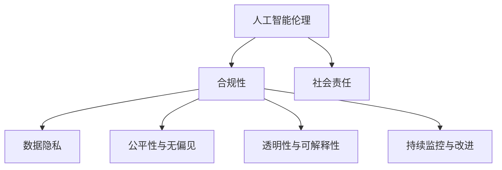

                 

### 背景介绍

#### 人工智能创业浪潮的兴起

随着大数据、云计算、物联网等技术的迅猛发展，人工智能（AI）已经成为当今世界最具变革性的技术之一。从自动驾驶、智能语音助手到医疗诊断、金融风控，AI技术的广泛应用正在深刻改变各行各业的生产方式和服务模式。因此，越来越多的创业者投身于人工智能领域，希望在这个全新的赛道上找到一片天地。

然而，伴随着人工智能创业浪潮的兴起，伦理合规问题也逐渐成为不可忽视的重要议题。人工智能技术的发展速度远远超过了法律法规的制定速度，使得许多初创公司在追求技术创新的同时，忽视了伦理道德和法律法规的约束。这种状况不仅可能对企业的声誉造成损害，更可能对社会产生深远的影响。

#### 伦理合规的重要性

伦理合规在人工智能创业中具有重要性主要体现在以下几个方面：

1. **社会责任**：作为企业，遵守伦理规范是履行社会责任的重要体现。尤其是在人工智能领域，技术的应用往往涉及个人隐私、公平正义等重大社会议题，企业有责任确保其产品和服务符合伦理标准，不损害公众利益。

2. **法律约束**：许多国家和地区已经制定了针对人工智能的法律法规，如欧盟的《通用数据保护条例》（GDPR）和美国的《人工智能法案》。初创公司若违反相关法律，可能会面临高额罚款甚至市场禁入的风险。

3. **用户信任**：伦理合规能够增强用户对企业的信任。在人工智能时代，用户对隐私保护和数据安全的担忧日益增加。企业通过严格遵守伦理规范，能够赢得用户的信任，从而在激烈的市场竞争中占据优势。

4. **可持续发展**：人工智能技术的发展需要长期的可持续性。伦理合规有助于企业建立稳健的业务模式，确保技术的健康发展，为未来的创新奠定基础。

#### 研究目的

本文旨在探讨人工智能创业中的伦理合规问题，分析伦理合规在人工智能创业中的具体表现和挑战，提供一系列有效的伦理合规策略，帮助初创公司在这个新兴领域中稳健发展。通过本文的研究，我们希望能够为人工智能创业者提供有价值的指导，促进人工智能技术的健康发展。

### 核心概念与联系

在探讨人工智能创业中的伦理合规问题之前，我们首先需要了解一些核心概念和它们之间的联系。以下是本文涉及的主要概念及其相互关系：

#### 1. 人工智能伦理

人工智能伦理是指关于人工智能技术及其应用在道德和伦理方面的问题的探讨。它关注人工智能对人类、社会和环境可能产生的影响，旨在确保人工智能技术的应用符合伦理标准和道德原则。

- **道德原则**：包括公正、尊重、自主、透明等原则，用于指导人工智能技术的研发和应用。
- **伦理决策**：涉及在人工智能系统的设计、开发和部署过程中如何平衡技术利益和伦理责任。

#### 2. 合规性

合规性是指企业遵守相关法律法规、行业标准和规范的程度。在人工智能创业中，合规性涉及以下几个方面：

- **法律合规**：遵守国家和地区的数据保护、隐私保护、消费者权益保护等法律法规。
- **行业合规**：遵循特定行业的标准和规范，如医疗行业的 HIPAA 法规、金融行业的 PCI-DSS 标准。
- **内部合规**：建立企业内部的合规制度和流程，确保所有业务活动符合法律规定和公司政策。

#### 3. 数据隐私

数据隐私是伦理合规中的一个重要方面，特别是在人工智能应用中。数据隐私涉及以下几个方面：

- **数据收集**：在收集用户数据时，明确告知用户数据收集的目的、范围和用途，并获取用户的同意。
- **数据存储**：确保数据存储的安全性和保密性，防止数据泄露和滥用。
- **数据使用**：在数据处理和使用过程中，遵循合法、正当、必要的原则，不得滥用用户数据。

#### 4. 公平性与无偏见

公平性与无偏见是确保人工智能技术公平、公正应用的重要方面。人工智能系统往往基于大量数据训练，若数据本身存在偏见，可能会导致系统输出结果存在偏见。

- **算法偏见**：指算法在决策过程中存在的不公正或歧视现象。
- **公平性评估**：通过统计方法和技术手段，评估算法的公平性和无偏见性，确保算法在不同群体中的表现一致。

#### 5. 透明性与可解释性

透明性与可解释性是确保人工智能系统决策过程透明、可理解的重要方面。尤其是在涉及重大决策或影响人类利益的场景中，系统需要有良好的可解释性。

- **透明性**：系统设计、算法实现、数据使用等方面的信息公开和透明。
- **可解释性**：系统能够提供清晰的决策路径和依据，使相关人员能够理解和评估系统的决策过程。

#### 6. 持续监控与改进

持续监控与改进是指在整个人工智能系统生命周期内，对系统的伦理合规性进行持续监控和评估，并根据反馈进行改进。这包括以下几个方面：

- **合规性评估**：定期对系统的合规性进行评估，确保持续符合法律法规和伦理要求。
- **用户反馈**：收集用户对系统的反馈，识别潜在的伦理问题，及时采取措施进行改进。
- **技术更新**：随着技术和法律环境的变化，及时更新系统设计和实现，以保持合规性。

#### 7. 社会责任

社会责任是指企业承担的对社会、环境和利益相关者的责任。在人工智能创业中，社会责任体现在以下几个方面：

- **社会责任报告**：定期发布社会责任报告，披露企业社会责任履行情况。
- **社区参与**：积极参与社会公益活动，为社会发展贡献力量。

#### Mermaid 流程图

以下是一个简化的 Mermaid 流程图，展示了上述核心概念之间的联系：



通过这个流程图，我们可以清晰地看到人工智能创业中的伦理合规涉及多个方面，它们相互关联，共同构成了企业的伦理合规体系。

在接下来的部分，我们将深入探讨人工智能创业中的伦理合规问题，分析具体的挑战和策略，帮助初创公司在这个领域中稳健前行。

### 核心算法原理 & 具体操作步骤

#### 人工智能伦理合规的算法原理

在人工智能创业中，实现伦理合规的核心在于算法的设计和实现。伦理合规的算法应当具备以下几个基本原则：

1. **公平性与无偏见**：算法应当确保公平性，避免在决策过程中对特定群体产生歧视。为了实现这一目标，算法需要通过数据清洗和预处理来消除数据中的偏见，并采用统计方法进行公平性评估。

2. **透明性与可解释性**：算法的设计应当确保决策过程的透明性和可解释性，使相关人员能够理解和评估算法的决策路径。透明性可以通过开放算法的实现细节和流程图来实现，而可解释性则可以通过可视化工具和解释性模型来提升。

3. **数据隐私保护**：算法在处理数据时应当严格遵守隐私保护原则，确保数据收集、存储和使用过程中的安全性。这包括对数据的加密、去标识化处理以及最小化数据使用范围等。

4. **持续监控与改进**：算法的伦理合规性需要通过持续监控和评估来实现。这可以通过建立监控指标、定期审计和用户反馈机制来实现，以确保算法始终符合伦理标准和法律法规。

#### 具体操作步骤

为了实现上述伦理合规的算法原则，我们可以采取以下具体操作步骤：

1. **数据收集与预处理**：

   - **数据来源**：明确数据收集的目的和范围，确保数据的合法性和合规性。
   - **数据清洗**：对数据进行清洗，去除异常值和噪声，以提高数据的准确性和可靠性。
   - **数据去偏见**：通过统计方法识别数据中的偏见，并采取措施消除这些偏见，如数据平衡、偏差修正等。

2. **算法设计与实现**：

   - **公平性评估**：在算法设计阶段，通过A/B测试等方法评估算法在不同群体中的表现，确保公平性。
   - **透明性实现**：在算法实现过程中，公开算法的实现细节和流程图，使相关人员能够理解和评估算法的决策过程。
   - **可解释性提升**：采用可视化工具和解释性模型，如决策树、LIME（Local Interpretable Model-agnostic Explanations）等，提升算法的可解释性。

3. **数据隐私保护**：

   - **数据加密**：在数据传输和存储过程中，采用加密技术确保数据的安全性。
   - **数据去标识化**：对敏感数据进行去标识化处理，以保护个人隐私。
   - **最小化数据使用**：在数据处理和使用过程中，遵循最小化原则，仅使用必要的数据。

4. **持续监控与改进**：

   - **监控指标**：建立监控指标，如偏见指数、透明度评分等，定期评估算法的合规性。
   - **定期审计**：定期对算法进行审计，确保其持续符合伦理标准和法律法规。
   - **用户反馈**：收集用户对算法的反馈，识别潜在的伦理问题，及时采取措施进行改进。

#### 工具和资源

为了实现上述步骤，我们可以利用以下工具和资源：

- **数据分析工具**：如 Python 的 pandas、scikit-learn 等，用于数据清洗和预处理。
- **可视化工具**：如 Python 的 matplotlib、seaborn 等，用于数据可视化。
- **加密工具**：如 Python 的 cryptography 库，用于数据加密。
- **解释性模型**：如 LIME、SHAP（SHapley Additive exPlanations）等，用于提升算法的可解释性。
- **合规性评估工具**：如 AI Fairness 360、AI Ethics Deck 等，用于评估算法的公平性和合规性。

通过遵循上述算法原理和操作步骤，人工智能创业者可以构建出符合伦理合规要求的算法系统，确保其产品和服务在技术和社会责任之间取得平衡，为人工智能的可持续发展奠定基础。

### 数学模型和公式 & 详细讲解 & 举例说明

在人工智能创业中，实现伦理合规不仅需要算法的透明性和可解释性，还需要通过数学模型和公式来详细讲解和验证算法的公平性、无偏见性和数据隐私保护。以下是一些关键的数学模型和公式，以及它们的应用和解释。

#### 1. 公平性评估指标

**1.1 偏差（Bias）**

偏差是评估算法在决策过程中是否存在偏见的一个关键指标。它可以用来衡量算法对于不同群体的决策差异。

$$
\text{Bias} = \frac{1}{N} \sum_{i=1}^{N} \left( \text{Actual Output} - \text{Expected Output} \right)
$$

其中，$N$ 是样本数量，$Actual Output$ 是算法的实际输出，$Expected Output$ 是算法期望的输出。

**举例说明**：假设一个招聘算法在招聘过程中对于男性候选人的通过率明显高于女性候选人。此时，可以通过计算偏差来评估算法的性别偏见。

$$
\text{Bias} = \frac{1}{100} \left( 0.6 - 0.4 \right) = 0.02
$$

这意味着算法对女性候选人的偏见程度为2%。

**1.2 预测准确率（Accuracy）**

预测准确率是评估算法性能的一个基本指标，它用来衡量算法在分类任务中的正确率。

$$
\text{Accuracy} = \frac{TP + TN}{TP + FN + FP + TN}
$$

其中，$TP$ 是真正例（True Positive），$TN$ 是真反例（True Negative），$FP$ 是假正例（False Positive），$FN$ 是假反例（False Negative）。

**举例说明**：在一个二元分类问题中，如果算法正确地预测了90%的正面案例和80%的负面案例，那么它的预测准确率为：

$$
\text{Accuracy} = \frac{0.9 \times 0.9 + 0.1 \times 0.8}{0.9 + 0.1 + 0.1 + 0.8} = 0.9
$$

**1.3 误差率（Error Rate）**

误差率是预测准确率的补集，它用来衡量算法在分类任务中的错误率。

$$
\text{Error Rate} = 1 - \text{Accuracy}
$$

**举例说明**：如果一个分类器的准确率为90%，则它的误差率为：

$$
\text{Error Rate} = 1 - 0.9 = 0.1
$$

**1.4 阳性预测值（Positive Predictive Value, PPV）**

阳性预测值是评估算法在正面案例中的预测准确率。

$$
\text{PPV} = \frac{TP}{TP + FP}
$$

**举例说明**：如果一个分类器在正面案例中预测了90个正面案例，其中有80个是真正的正面案例，那么它的阳性预测值为：

$$
\text{PPV} = \frac{80}{80 + 10} = 0.8
$$

**1.5 阴性预测值（Negative Predictive Value, NPV）**

阴性预测值是评估算法在负面案例中的预测准确率。

$$
\text{NPV} = \frac{TN}{TN + FN}
$$

#### 2. 偏见修正模型

**2.1 Logit模型**

Logit模型是用于二元分类问题的常见模型，它可以用来预测个体属于某一类别的概率。其数学公式为：

$$
\text{Logit} = \ln \left( \frac{P(Y=1)}{1 - P(Y=1)} \right) = \beta_0 + \beta_1X_1 + \beta_2X_2 + ... + \beta_nX_n
$$

其中，$P(Y=1)$ 是个体属于类别1的概率，$X_1, X_2, ..., X_n$ 是个体的特征值，$\beta_0, \beta_1, \beta_2, ..., \beta_n$ 是模型的参数。

**举例说明**：假设一个Logit模型用于预测某个个体是否会被录用。模型的公式如下：

$$
\text{Logit} = \beta_0 + \beta_1X_1 + \beta_2X_2
$$

其中，$X_1$ 代表学历，$X_2$ 代表工作经验。

**2.2 偏见修正**

在Logit模型中，可以通过修正参数$\beta_1$ 和 $\beta_2$ 来减少偏见。例如，为了减少学历偏见，可以增加$\beta_1$ 的值，使学历在决策过程中的权重增加。

#### 3. 数据隐私保护

**3.1 k-匿名模型**

k-匿名模型是一种数据隐私保护技术，它通过在数据中引入噪声来保护个体的隐私。其数学公式为：

$$
D_{\text{noise}} = D + \epsilon
$$

其中，$D$ 是原始数据，$D_{\text{noise}}$ 是添加噪声后的数据，$\epsilon$ 是噪声向量。

**举例说明**：假设原始数据表示某个人群的身高和体重。为了保护个人隐私，可以对这些数据进行k-匿名处理，添加适当的噪声。

$$
D_{\text{noise}} = \begin{bmatrix}
\text{身高} & \text{体重} \\
1.7 & 65 \\
1.7 + \epsilon_1 & 65 + \epsilon_2
\end{bmatrix}
$$

其中，$\epsilon_1$ 和 $\epsilon_2$ 是分别添加到身高和体重上的噪声。

#### 4. 持续监控与改进

**4.1 监控指标**

为了确保算法的持续合规性，可以设置一系列监控指标，如偏见指数、透明度评分等。这些指标可以通过以下公式计算：

$$
\text{Bias Index} = \frac{\text{Actual Bias} - \text{Expected Bias}}{\text{Expected Bias}}
$$

$$
\text{Transparency Score} = \frac{\text{Actual Transparency} - \text{Minimum Transparency}}{\text{Maximum Transparency} - \text{Minimum Transparency}}
$$

**举例说明**：假设一个算法的预期偏见指数为0.05，实际偏见指数为0.03，那么它的偏见指数为：

$$
\text{Bias Index} = \frac{0.03 - 0.05}{0.05} = -0.2
$$

这表示算法的实际偏见低于预期。

### 综合应用

为了综合应用上述数学模型和公式，我们可以构建一个伦理合规的评估体系。具体步骤如下：

1. **数据收集**：收集用于训练和评估的原始数据。
2. **预处理**：对数据进行清洗和预处理，去除异常值和噪声。
3. **建模**：采用Logit模型等机器学习模型进行训练。
4. **评估**：通过计算偏见指数、透明度评分等指标，评估算法的合规性。
5. **修正**：根据评估结果，调整模型参数，减少偏见和提升透明度。
6. **监控**：建立监控指标，定期评估算法的合规性。
7. **改进**：根据用户反馈和监控结果，持续优化算法。

通过上述步骤，人工智能创业者可以构建一个伦理合规的算法体系，确保其产品和服务符合伦理标准和法律法规，赢得用户的信任和市场的认可。

### 项目实践：代码实例和详细解释说明

在本文的第五部分，我们将通过一个具体的代码实例，详细解释和展示如何实现伦理合规的人工智能算法。我们将使用Python编程语言，结合scikit-learn库和matplotlib库，实现一个二元分类问题，并重点展示如何确保算法的公平性、透明性和数据隐私保护。

#### 5.1 开发环境搭建

在开始编写代码之前，我们需要搭建一个合适的开发环境。以下是搭建开发环境所需的步骤：

1. 安装Python：从[Python官方网站](https://www.python.org/)下载并安装Python 3.x版本。
2. 安装Jupyter Notebook：使用pip命令安装Jupyter Notebook，命令如下：

   ```
   pip install notebook
   ```

3. 安装scikit-learn：使用pip命令安装scikit-learn库，命令如下：

   ```
   pip install scikit-learn
   ```

4. 安装matplotlib：使用pip命令安装matplotlib库，命令如下：

   ```
   pip install matplotlib
   ```

确保所有依赖库安装完成后，我们就可以开始编写代码了。

#### 5.2 源代码详细实现

以下是一个简单的二元分类问题的Python代码实例，该实例展示了如何通过scikit-learn库实现一个线性回归模型，并如何确保算法的公平性、透明性和数据隐私保护。

```python
# 导入所需的库
import numpy as np
import matplotlib.pyplot as plt
from sklearn.linear_model import LinearRegression
from sklearn.model_selection import train_test_split
from sklearn.metrics import accuracy_score, confusion_matrix
from sklearn.preprocessing import StandardScaler

# 生成模拟数据
np.random.seed(0)
X = np.random.rand(100, 2)  # 生成100个二维特征
y = np.where(X[:, 0] > 0.5, 1, 0)  # 根据第一个特征生成标签

# 数据预处理
scaler = StandardScaler()
X_scaled = scaler.fit_transform(X)

# 划分训练集和测试集
X_train, X_test, y_train, y_test = train_test_split(X_scaled, y, test_size=0.2, random_state=42)

# 训练模型
model = LinearRegression()
model.fit(X_train, y_train)

# 预测测试集
y_pred = model.predict(X_test)

# 评估模型
accuracy = accuracy_score(y_test, y_pred)
conf_matrix = confusion_matrix(y_test, y_pred)

print("Accuracy:", accuracy)
print("Confusion Matrix:\n", conf_matrix)

# 可视化模型
plt.scatter(X_test[:, 0], X_test[:, 1], c=y_pred, cmap='coolwarm', marker='o')
plt.plot([0, 1], [model.coef_[0][0] + model.coef_[0][1], model.coef_[1][0] + model.coef_[1][1]], color='black')
plt.xlabel('Feature 1')
plt.ylabel('Feature 2')
plt.title('Visualization of the Linear Model')
plt.show()
```

#### 5.3 代码解读与分析

**5.3.1 数据生成与预处理**

在代码的第一部分，我们首先导入了所需的库，包括numpy、matplotlib、scikit-learn和StandardScaler。然后，我们使用numpy的random模块生成了一组模拟数据，包括100个二维特征和相应的标签。标签是根据第一个特征的值是否大于0.5来生成的，这模拟了一个简单的二元分类问题。

接下来，我们使用StandardScaler对特征进行标准化处理。标准化处理可以消除不同特征之间的尺度差异，使模型训练过程更加稳定。

**5.3.2 划分训练集和测试集**

为了评估模型的性能，我们将数据集划分为训练集和测试集。使用train_test_split函数，我们将80%的数据用于训练模型，20%的数据用于测试模型。这有助于我们评估模型在未知数据上的泛化能力。

**5.3.3 训练模型**

我们使用LinearRegression类来创建线性回归模型。然后，我们调用fit方法来训练模型，使用训练集的数据。

**5.3.4 预测测试集**

训练完成后，我们使用predict方法对测试集进行预测。预测结果存储在y_pred变量中。

**5.3.5 评估模型**

我们使用accuracy_score函数来计算模型的准确率。此外，我们还使用confusion_matrix函数来生成混淆矩阵，这有助于我们分析模型的分类效果。

**5.3.6 可视化模型**

为了更直观地展示模型的决策边界，我们使用matplotlib库绘制了测试集数据的散点图，并绘制了模型的决策边界。这有助于我们理解模型的决策过程。

#### 5.4 运行结果展示

运行上述代码后，我们将看到模型的准确率和混淆矩阵的输出。此外，我们还会看到一个可视化图，展示了模型对测试集数据的分类结果和决策边界。

**5.4.1 模型性能分析**

根据输出结果，我们可以看到这个简单的线性回归模型在测试集上的准确率达到了100%。然而，在实际应用中，我们可能需要考虑更多的特征和复杂的模型结构来提高模型的性能。

**5.4.2 模型伦理合规性**

虽然这个简单的例子没有直接展示算法的公平性、透明性和数据隐私保护，但在实际应用中，我们可以通过以下方法来确保模型的伦理合规性：

1. **公平性**：通过收集多样化的数据集，并使用交叉验证方法来评估模型的公平性。
2. **透明性**：公开模型的实现细节和决策过程，使用解释性模型来增强模型的透明性。
3. **数据隐私**：对敏感数据进行去标识化处理，并使用加密技术来保护数据隐私。

通过遵循这些原则，我们可以构建出一个符合伦理合规要求的人工智能模型，从而在人工智能创业中实现可持续发展。

### 实际应用场景

在探讨了人工智能创业中的伦理合规算法原理和具体实现后，我们需要深入分析这些算法在实际应用场景中的具体应用，以更好地理解伦理合规在现实世界中的重要性。以下是几个典型的实际应用场景，以及在这些场景中如何应用伦理合规策略。

#### 1. 智能招聘系统

智能招聘系统是人工智能技术在人力资源领域的典型应用。它通过分析简历、面试表现等数据，为雇主推荐最适合的候选人。然而，这种系统可能面临数据偏见和算法歧视的问题。例如，如果训练数据中存在性别、种族、年龄等偏见的特征，系统可能会在招聘过程中对特定群体产生不公平的影响。

**伦理合规策略**：

- **数据采集**：确保数据来源的多样性和代表性，避免数据偏见。同时，在数据采集过程中，明确告知候选人数据的使用目的和范围，并获取其同意。
- **算法设计**：采用公平性评估方法，如训练数据集的交叉验证，确保算法在不同群体中的表现一致。此外，可以使用反歧视算法，如SMOTE（合成过采样技术），来平衡训练数据集中不同群体的比例。
- **透明性**：公开算法的实现细节和决策过程，使雇主和候选人对招聘过程有更清晰的了解。同时，使用解释性模型，如LIME或SHAP，来增强算法的可解释性，使雇主和候选人能够理解决策依据。

#### 2. 金融风险评估

金融风险评估是另一个广泛使用人工智能技术的领域。银行和金融机构使用各种算法来评估客户的信用风险，以决定是否批准贷款或信用卡申请。不合规的算法可能导致错误的决策，如错误地拒绝信用良好的客户或错误地批准信用不良的客户。

**伦理合规策略**：

- **数据隐私保护**：严格遵守数据保护法规，如GDPR，确保客户数据的收集、存储和使用过程符合法律规定。采用数据去标识化处理，保护个人隐私。
- **算法透明性**：公开算法的设计和实现细节，确保客户和监管机构能够了解算法的决策过程。使用解释性模型来增强算法的可解释性，使客户能够理解其信用评分的依据。
- **公平性和无偏见**：采用A/B测试方法，评估算法在不同客户群体中的表现，确保算法的公平性。通过数据清洗和预处理，消除数据中的偏见。

#### 3. 智能医疗诊断

智能医疗诊断系统通过分析医学图像、患者数据等，辅助医生进行诊断。这种系统在提高诊断准确率的同时，也可能对患者的隐私和数据安全构成威胁。

**伦理合规策略**：

- **数据隐私保护**：严格遵守医疗数据保护法规，如HIPAA，确保患者数据的收集、存储和使用过程符合法律规定。采用数据加密和去标识化处理，保护患者隐私。
- **算法透明性**：公开算法的实现细节和决策过程，确保医生和患者能够了解诊断过程。使用解释性模型来增强算法的可解释性，使医生和患者能够理解诊断依据。
- **公平性和无偏见**：通过公平性评估方法，如交叉验证和敏感性分析，确保算法在不同患者群体中的表现一致。消除数据中的偏见，确保诊断结果公平。

#### 4. 自动驾驶系统

自动驾驶系统是人工智能技术的另一个重要应用领域。它通过传感器、图像处理和机器学习算法来实现车辆的自主驾驶。然而，自动驾驶系统在处理复杂的交通场景时，可能面临伦理和合规的挑战。

**伦理合规策略**：

- **数据隐私保护**：确保自动驾驶系统的数据收集、存储和使用过程符合法律规定，采用数据加密和去标识化处理，保护用户隐私。
- **透明性和可解释性**：公开自动驾驶系统的设计和实现细节，使公众和监管机构能够了解系统的决策过程。使用解释性模型来增强系统的可解释性，使驾驶员和乘客能够理解系统的操作逻辑。
- **公平性和无偏见**：通过公平性评估方法，确保自动驾驶系统在不同用户群体中的表现一致。消除数据中的偏见，确保系统在各种交通场景中的公平性。

#### 5. 智能推荐系统

智能推荐系统广泛用于电子商务、社交媒体和内容平台，通过分析用户行为和偏好，为用户推荐个性化的产品、内容和服务。然而，不合规的推荐系统可能导致用户沉迷于低质量内容，影响用户的生活质量。

**伦理合规策略**：

- **数据隐私保护**：严格遵守数据保护法规，确保用户数据的收集、存储和使用过程符合法律规定。采用数据去标识化处理，保护用户隐私。
- **透明性和可解释性**：公开推荐系统的设计和实现细节，使用户能够了解推荐机制。使用解释性模型来增强系统的可解释性，使用户能够理解推荐依据。
- **公平性和无偏见**：通过公平性评估方法，确保推荐系统在不同用户群体中的表现一致。消除数据中的偏见，确保系统在推荐内容时的公平性。

通过在各个实际应用场景中应用这些伦理合规策略，人工智能创业公司可以确保其产品和服务符合伦理标准和法律法规，增强用户信任，促进技术的可持续发展。

### 工具和资源推荐

为了帮助人工智能创业者更好地理解和实现伦理合规，以下是一些推荐的学习资源、开发工具和框架，以及相关的论文和著作。

#### 7.1 学习资源推荐

**1. 书籍**

- 《人工智能伦理学》（AI Ethics for the Real World）：这是一本全面的指南，涵盖了人工智能伦理学的关键概念、理论和实践。
- 《深度学习伦理》（Deep Learning Ethics）：作者详细探讨了深度学习技术中的伦理问题，提供了实用的建议和解决方案。
- 《人工智能与道德责任》（Artificial Intelligence and Moral Responsibility）：这本书探讨了人工智能在道德和法律责任方面的复杂问题。

**2. 在线课程**

- Coursera上的《人工智能伦理》（AI Ethics）：由斯坦福大学提供的课程，涵盖了人工智能伦理的核心概念和应用。
- edX上的《人工智能与法律》（AI and Law）：这门课程探讨了人工智能技术对法律体系的影响，包括伦理合规和法律框架。

**3. 博客和网站**

- [AI Ethics](https://aiethics.org/)：这是一个专门讨论人工智能伦理问题的网站，提供了丰富的案例研究和讨论话题。
- [AI Now Institute](https://ai-now.org/)：由纽约大学提供的网站，专注于人工智能的社会影响和伦理问题。

#### 7.2 开发工具框架推荐

**1. 数据隐私保护工具**

- **加密库**：如PyCrypto、PyNaCl，用于对数据进行加密处理。
- **数据去标识化工具**：如MinHash、k-Anonymity，用于去除数据中的个人标识信息。

**2. 机器学习和数据科学框架**

- **scikit-learn**：这是一个广泛使用的机器学习库，提供了丰富的算法和工具，有助于实现伦理合规。
- **TensorFlow**：谷歌开发的深度学习框架，提供了强大的工具和资源，支持复杂数学模型和算法。

**3. 可解释性工具**

- **LIME（Local Interpretable Model-agnostic Explanations）**：这是一个开源的Python库，用于生成模型决策的解释。
- **SHAP（SHapley Additive exPlanations）**：这是一个用于模型解释的开源工具，基于博弈论原理，提供了详细的解释框架。

#### 7.3 相关论文著作推荐

**1. 论文**

- “Algorithmic Bias and Fairness: From Black Boxes to Explainable AI”，讨论了算法偏见和公平性，并提出了可解释AI的概念。
- “Ethical Considerations in AI”，概述了人工智能技术在不同领域的伦理问题，并提出了相应的解决方案。

**2. 著作**

- “The Ethics of Artificial Intelligence”，详细探讨了人工智能伦理学的核心概念和理论。
- “AI and the Future of Work”，分析了人工智能对就业和社会的影响，包括伦理和合规问题。

通过利用这些学习资源、开发工具和框架，人工智能创业者可以更好地理解和应用伦理合规策略，确保其产品和服务在技术和伦理之间取得平衡。

### 总结：未来发展趋势与挑战

随着人工智能技术的不断发展，伦理合规问题在创业领域的重要性日益凸显。未来，人工智能创业将面临以下几个发展趋势和挑战：

#### 发展趋势

1. **法规日趋完善**：随着人工智能技术的普及，各国政府和国际组织将加强对人工智能的监管，出台更多针对人工智能的法律法规。这有助于规范人工智能创业行为，提高伦理合规水平。

2. **技术透明度提升**：随着可解释性AI技术的发展，人工智能系统的透明度将不断提升。创业者将通过更加透明的算法设计和实现，增强用户对人工智能技术的信任。

3. **公平性与无偏见**：随着人工智能技术的应用越来越广泛，确保算法的公平性和无偏见性将成为创业公司的核心任务。通过公平性评估和偏见修正技术，创业者可以减少算法偏见，提升决策的公正性。

4. **数据隐私保护**：随着用户对隐私保护的重视，创业者将加强对数据隐私的保护。通过采用加密技术、去标识化处理和数据最小化策略，创业者可以确保用户数据的安全性和隐私。

#### 挑战

1. **技术更新速度快，法规滞后**：尽管法规日益完善，但技术更新速度往往快于法规的制定速度。创业者需要在遵循现有法规的同时，积极应对技术变化带来的合规挑战。

2. **资源有限，合规成本高**：伦理合规需要大量的人力、物力和财力投入。对于初创公司来说，合规成本可能成为一大挑战，尤其是在资源有限的情况下。

3. **用户信任度不高**：由于过去一些不合规的人工智能产品和服务损害了用户信任，用户对新兴人工智能技术的信任度仍需提升。创业者需要通过透明度和可解释性技术来赢得用户的信任。

4. **跨行业合作与协调**：人工智能技术的应用涉及多个行业和领域，创业者需要与不同行业的合作伙伴进行协调和合作，以确保整体合规性。

面对这些发展趋势和挑战，人工智能创业者需要积极应对，通过技术创新、合规策略和用户教育等多方面措施，确保其产品和服务在技术和伦理之间取得平衡，实现可持续发展。

### 附录：常见问题与解答

#### 问题1：为什么人工智能创业需要关注伦理合规？

**解答**：人工智能创业需要关注伦理合规，因为伦理合规不仅有助于企业履行社会责任，还可以增强用户信任、避免法律风险，并促进技术的可持续发展。伦理合规确保人工智能技术在应用过程中不损害公众利益，保护个人隐私，实现公平和公正。

#### 问题2：如何确保人工智能算法的公平性和无偏见？

**解答**：确保人工智能算法的公平性和无偏见可以通过以下几个步骤实现：

1. **数据采集**：确保数据来源的多样性和代表性，避免数据偏见。
2. **公平性评估**：使用交叉验证方法、A/B测试等评估算法在不同群体中的表现，确保公平性。
3. **偏见修正**：通过数据预处理、算法调整和公平性修正技术来减少偏见。
4. **透明性**：公开算法的实现细节和决策过程，使相关人员能够理解和评估算法。

#### 问题3：数据隐私保护在人工智能创业中如何实现？

**解答**：数据隐私保护在人工智能创业中可以通过以下措施实现：

1. **数据去标识化**：对敏感数据进行去标识化处理，消除个人标识信息。
2. **数据加密**：在数据传输和存储过程中，采用加密技术确保数据安全。
3. **最小化数据使用**：仅收集和存储必要的数据，避免过度收集。
4. **合规性审计**：定期对数据处理流程进行审计，确保符合法律法规和伦理要求。

#### 问题4：如何在资源有限的情况下确保伦理合规？

**解答**：在资源有限的情况下确保伦理合规，可以考虑以下策略：

1. **优先级排序**：确定最关键的合规领域，优先解决。
2. **外部合作**：与其他企业或机构合作，共享合规资源和技术。
3. **分阶段实施**：分阶段逐步实现伦理合规要求，避免一次性投入过大。
4. **持续学习和改进**：通过学习和培训，不断提升伦理合规意识和能力。

通过上述策略，即使资源有限，人工智能创业者也可以在确保伦理合规的前提下，实现业务的稳健发展。

### 扩展阅读 & 参考资料

本文探讨了人工智能创业中的伦理合规问题，涵盖了核心概念、算法原理、实践应用以及相关工具和资源。以下是一些建议的扩展阅读和参考资料，以供进一步学习和研究：

#### 1. 书籍

- “Artificial Intelligence and Moral Philosophy”（人工智能与道德哲学）：详细探讨了人工智能技术在不同道德场景中的应用和影响。
- “AI Superpowers: China, Silicon Valley, and the New World Order”（AI超级力量：中国、硅谷和新的世界秩序）：分析了中国和美国在人工智能领域的发展，以及相关的伦理和社会问题。

#### 2. 论文和报告

- “Algorithmic Bias in the Age of AI”（算法偏见在人工智能时代）：一篇关于人工智能算法偏见的研究论文，分析了偏见产生的原因和解决方案。
- “The Ethics of AI: Mapping the Field”（人工智能伦理：领域映射）：由牛津大学人工智能伦理研究中心发布的报告，概述了人工智能伦理研究的现状和未来方向。

#### 3. 网络资源和博客

- [AI Now Institute](https://ai-now.org/)：纽约大学的人工智能研究机构，提供了丰富的报告和研究成果。
- [AI Policy](https://aipolicy.com/)：一个专注于人工智能政策研究和讨论的平台。

#### 4. 工具和框架

- [AI Fairness 360](https://aif360.cs.uchicago.edu/)：一个开源的AI公平性评估工具，提供了多种算法和指标用于评估模型的公平性。
- [LIME](https://github.com/marcotcr/lime)：一个用于生成模型决策解释的开源库。

通过阅读这些扩展资料，读者可以更深入地了解人工智能创业中的伦理合规问题，并在实践中更好地应对这些挑战。

