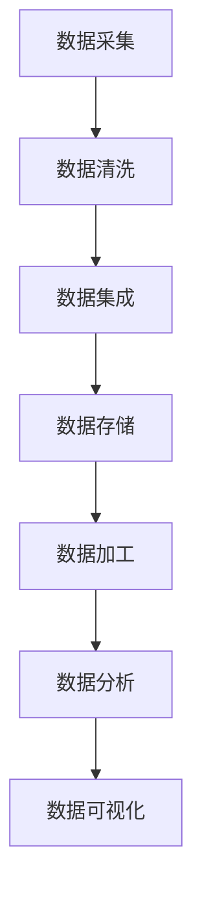

                 

### 背景介绍

人工智能（AI）作为当前科技领域的前沿方向，已经逐渐渗透到我们的日常生活中。从智能手机的语音助手到自动驾驶汽车，AI技术的应用正以前所未有的速度扩展。随着这些应用场景的不断丰富，如何有效地管理海量数据成为了一个关键问题。

在人工智能创业过程中，数据管理不仅是一个技术挑战，更是企业能否成功的关键因素之一。数据是AI系统的“粮食”，只有通过高效的数据管理，才能保证算法的准确性和模型的持续优化。因此，理解并掌握数据管理的技巧，对于人工智能创业者来说至关重要。

本文旨在为人工智能创业者提供一整套系统化的数据管理技巧，帮助他们在数据采集、存储、处理和分析等各个环节中，做出最优决策。我们将从核心概念出发，逐步深入探讨数据管理的方法、工具和策略，并结合实际案例进行详细解析。

文章将分为以下几个部分：

1. **背景介绍**：概述人工智能与数据管理的关系及其在创业中的重要性。
2. **核心概念与联系**：介绍数据管理中的关键概念，并使用Mermaid流程图展示数据流动的架构。
3. **核心算法原理 & 具体操作步骤**：深入分析数据清洗、数据集成、数据存储和数据加工等核心算法原理，并给出具体的操作步骤。
4. **数学模型和公式 & 详细讲解 & 举例说明**：介绍用于数据管理的数学模型和公式，通过实例进行详细讲解。
5. **项目实践：代码实例和详细解释说明**：提供实际的代码实例，并详细解释代码的实现过程和分析结果。
6. **实际应用场景**：讨论数据管理在不同应用场景中的实际应用。
7. **工具和资源推荐**：推荐相关的学习资源、开发工具和框架。
8. **总结：未来发展趋势与挑战**：总结文章内容，展望未来数据管理的发展趋势和挑战。
9. **附录：常见问题与解答**：针对文中提到的概念和技术点，提供常见问题的解答。
10. **扩展阅读 & 参考资料**：推荐进一步阅读的资料和参考文献。

通过本文，读者将能够全面了解数据管理的各个方面，掌握实用的数据管理技巧，为自己的人工智能创业之路奠定坚实的基础。让我们开始这一段深入的探索之旅吧。

### 核心概念与联系

在深入探讨数据管理的技巧之前，我们需要明确几个核心概念，并理解它们之间的关系。以下是对这些关键概念的定义及它们在数据管理流程中的相互联系：

1. **数据采集（Data Collection）**：数据采集是指从各种来源收集原始数据的过程。这些来源可以是传感器、网站、数据库、API等。数据采集的质量直接影响到后续数据处理和分析的效果。

2. **数据清洗（Data Cleaning）**：数据清洗是指对采集到的原始数据进行处理，删除重复、错误或不完整的数据，以及填补缺失值等。数据清洗是确保数据质量的重要步骤。

3. **数据集成（Data Integration）**：数据集成是将来自不同来源和格式的数据合并到一个统一的视图中的过程。数据集成需要处理数据格式不一致、数据冗余和数据冲突等问题。

4. **数据存储（Data Storage）**：数据存储是将处理后的数据存储到数据库或数据仓库中，以便后续的查询和分析。选择合适的数据存储方案对于提高数据处理效率至关重要。

5. **数据加工（Data Processing）**：数据加工是指对存储的数据进行进一步的转换、分析或聚合，以生成有用的信息和洞见。数据加工包括数据归一化、数据聚合、特征提取等步骤。

6. **数据分析（Data Analysis）**：数据分析是指使用统计和机器学习等方法，从数据中提取有价值的信息和模式，以支持决策和预测。

7. **数据可视化（Data Visualization）**：数据可视化是指使用图形和图表等方式，将数据分析结果以直观的方式展示出来，帮助用户更好地理解和解读数据。

为了更直观地展示这些概念之间的联系，我们可以使用Mermaid流程图来描述数据流动的架构。以下是一个简单的Mermaid流程图示例：



在这个流程图中，数据从采集阶段开始，经过清洗、集成、存储、加工、分析和可视化等步骤，最终形成一个闭环的数据管理流程。每个步骤都紧密相连，构成了一个完整的数据管理过程。

### 核心算法原理 & 具体操作步骤

在数据管理中，核心算法的选择和具体操作步骤的制定是确保数据管理高效、准确的关键。下面我们将逐一介绍数据清洗、数据集成、数据存储和数据加工等核心算法的基本原理，并结合实际案例详细讲解每个步骤的操作方法。

#### 1. 数据清洗

数据清洗是数据管理的重要步骤，其目的是确保数据的质量和一致性。数据清洗通常包括以下几个步骤：

**步骤1：识别异常值**

异常值是指那些不符合数据规律的数据点。识别异常值可以通过统计方法（如箱线图）或基于规则的方法（如阈值法）进行。

**步骤2：删除重复数据**

重复数据会降低数据集的质量，删除重复数据可以通过比对不同数据字段（如ID、姓名等）的唯一性来实现。

**步骤3：填补缺失值**

缺失值填补是处理缺失数据的重要方法。常用的填补方法包括均值填补、中位数填补和插值法等。

**实际案例：**

假设我们有一份数据集，包含客户购买记录，其中存在缺失值和异常值。我们需要进行数据清洗。

**操作步骤：**

1. **识别异常值**：使用箱线图识别购买金额低于最低金额或高于最高金额的记录。
2. **删除重复数据**：通过比对客户ID和购买日期的唯一性删除重复记录。
3. **填补缺失值**：对于购买金额缺失的记录，使用中位数进行填补。

#### 2. 数据集成

数据集成是将来自不同来源和格式的数据合并到一个统一视图中的过程。数据集成通常包括以下几个步骤：

**步骤1：数据映射**

数据映射是将不同数据源的字段映射到统一的数据结构中。数据映射需要处理数据格式不一致和数据类型转换等问题。

**步骤2：数据冲突解决**

数据冲突解决是处理不同数据源之间数据不一致的问题。解决数据冲突可以通过合并规则、优先级规则或手动合并等方法。

**步骤3：数据去重**

数据去重是确保集成后的数据集中不存在重复记录的过程。去重可以通过比对不同字段组合的唯一性来实现。

**实际案例：**

假设我们有两个数据源，一个是客户购买记录，另一个是客户个人信息。我们需要将这两个数据源集成。

**操作步骤：**

1. **数据映射**：将购买记录中的客户ID映射到个人信息中的客户ID字段。
2. **数据冲突解决**：如果个人信息中的客户ID和购买记录中的客户ID不一致，根据特定规则进行合并。
3. **数据去重**：比对客户ID和购买日期，删除重复记录。

#### 3. 数据存储

数据存储是将处理后的数据存储到数据库或数据仓库中，以便后续的查询和分析。数据存储的选择取决于数据规模、查询性能和成本等因素。以下是常见的数据存储方案：

**步骤1：选择合适的存储方案**

- **关系型数据库**：适用于结构化数据存储，如MySQL、PostgreSQL等。
- **NoSQL数据库**：适用于非结构化或半结构化数据存储，如MongoDB、Cassandra等。
- **数据仓库**：适用于大规模数据分析和数据挖掘，如Amazon Redshift、Google BigQuery等。

**步骤2：设计数据模型**

数据模型设计是根据业务需求和数据特点，设计数据的结构和关系。常见的数据模型包括关系模型、文档模型、图模型等。

**步骤3：数据导入**

数据导入是将清洗和集成的数据导入到选择的数据库或数据仓库中。数据导入可以通过API、命令行工具或数据集成工具实现。

**实际案例：**

假设我们需要将清洗和集成的客户购买记录存储到关系型数据库MySQL中。

**操作步骤：**

1. **选择合适的存储方案**：使用MySQL作为数据存储方案。
2. **设计数据模型**：设计一个包含客户ID、购买日期、购买金额等字段的表结构。
3. **数据导入**：使用MySQL的import命令将清洗和集成的数据导入到数据库中。

#### 4. 数据加工

数据加工是对存储的数据进行进一步的转换、分析或聚合，以生成有用的信息和洞见。数据加工通常包括以下几个步骤：

**步骤1：数据转换**

数据转换是将数据从一种格式转换为另一种格式的过程。数据转换包括数据类型转换、数据格式转换和数据值转换等。

**步骤2：数据聚合**

数据聚合是对数据进行汇总和分组的过程。数据聚合可以通过SQL查询或编程语言（如Python）实现。

**步骤3：特征提取**

特征提取是从数据中提取有助于模型训练和预测的特征。特征提取可以通过统计学方法、机器学习方法或基于规则的算法实现。

**实际案例：**

假设我们需要对客户购买记录进行数据加工，以生成客户购买偏好。

**操作步骤：**

1. **数据转换**：将购买记录的日期格式转换为日期时间格式。
2. **数据聚合**：使用SQL查询按客户ID和购买日期进行分组，计算每个客户的购买频率。
3. **特征提取**：提取购买频率作为客户购买偏好的特征。

通过以上步骤，我们能够有效地进行数据清洗、数据集成、数据存储和数据加工，确保数据管理的各个环节高效、准确。在实际应用中，根据具体业务需求和数据特点，可以对这些步骤进行调整和优化。

### 数学模型和公式 & 详细讲解 & 举例说明

在数据管理中，数学模型和公式是分析和解释数据的重要工具。以下将介绍几种常用的数学模型和公式，并通过具体实例进行详细讲解。

#### 1. 数据分布模型

数据分布模型用于描述数据的概率分布，常见的有正态分布、泊松分布等。正态分布是数据管理中最常用的分布模型，其公式为：

$$
N(\mu, \sigma^2) = \frac{1}{\sqrt{2\pi\sigma^2}} e^{-\frac{(x-\mu)^2}{2\sigma^2}}
$$

其中，$\mu$ 是均值，$\sigma^2$ 是方差，$x$ 是数据点。

**实例：**

假设我们有一组客户年龄数据，均值为35岁，标准差为5岁。我们需要计算一个客户年龄在30岁到40岁之间的概率。

**计算过程：**

1. 将年龄数据标准化：
$$
z = \frac{x - \mu}{\sigma} = \frac{30 - 35}{5} = -1, \frac{40 - 35}{5} = 1
$$

2. 查找标准正态分布表，得到$z$值对应的概率：
$$
P(-1 < z < 1) = 0.6827
$$

**结果：** 客户年龄在30岁到40岁之间的概率约为68.27%。

#### 2. 相关性分析

相关性分析用于衡量两个变量之间的关系，常用的相关系数有皮尔逊相关系数、斯皮尔曼相关系数等。皮尔逊相关系数的公式为：

$$
r = \frac{\sum{(x_i - \bar{x})(y_i - \bar{y})}}{\sqrt{\sum{(x_i - \bar{x})^2} \sum{(y_i - \bar{y})^2}}}
$$

其中，$x_i$ 和 $y_i$ 分别是两个变量的观测值，$\bar{x}$ 和 $\bar{y}$ 分别是两个变量的均值。

**实例：**

假设我们有一组客户年龄和月消费额的数据，我们需要计算这两个变量之间的相关性。

**计算过程：**

1. 计算均值：
$$
\bar{x} = \frac{\sum{x_i}}{n}, \bar{y} = \frac{\sum{y_i}}{n}
$$

2. 计算相关系数：
$$
r = \frac{\sum{(x_i - \bar{x})(y_i - \bar{y})}}{\sqrt{\sum{(x_i - \bar{x})^2} \sum{(y_i - \bar{y})^2}}}
$$

**结果：** 如果相关系数$r$接近1或-1，说明两个变量高度相关；如果$r$接近0，说明两个变量不相关。

#### 3. 聚类分析

聚类分析是将数据分为多个簇，以便更好地理解数据结构。常见的聚类算法有K-Means、层次聚类等。K-Means算法的目标是使每个簇内数据的平方误差和最小，其公式为：

$$
J = \sum_{i=1}^{k} \sum_{x_j \in S_i} ||x_j - \mu_i||^2
$$

其中，$k$ 是簇的数量，$S_i$ 是第$i$个簇，$\mu_i$ 是第$i$个簇的均值。

**实例：**

假设我们有一组客户购买行为数据，需要将客户分为两个簇。

**计算过程：**

1. 初始化簇中心：
$$
\mu_1, \mu_2
$$

2. 分配数据点：
$$
S_1, S_2
$$

3. 更新簇中心：
$$
\mu_1 = \frac{\sum_{x_j \in S_1} x_j}{|S_1|}, \mu_2 = \frac{\sum_{x_j \in S_2} x_j}{|S_2|}
$$

4. 重复步骤2和步骤3，直到簇中心不再发生显著变化。

**结果：** 通过K-Means算法，我们将客户数据成功分为两个簇，可以进一步分析每个簇的特点和客户需求。

通过上述数学模型和公式的应用，我们能够更深入地理解数据，发现数据中的规律和趋势。在实际应用中，根据具体需求和数据特点，可以灵活选择和组合这些模型和公式。

### 项目实践：代码实例和详细解释说明

为了更好地理解数据管理的实际操作，我们将通过一个具体的项目实例来展示数据管理的全过程，包括开发环境搭建、源代码实现、代码解读与分析以及运行结果展示。这个实例将涵盖数据采集、数据清洗、数据集成、数据存储和数据加工等关键步骤。

#### 1. 开发环境搭建

在开始项目之前，我们需要搭建合适的开发环境。以下是推荐的工具和软件：

- **编程语言**：Python，因其丰富的数据科学库和易于理解的语言特性，非常适合数据管理项目。
- **数据库**：MySQL，用于存储处理后的数据。
- **数据分析库**：pandas，用于数据清洗、数据集成和数据加工。
- **可视化库**：matplotlib，用于数据可视化。

安装这些工具的步骤如下：

1. 安装Python（建议使用Anaconda，它集成了Python及其相关库）。
2. 安装MySQL数据库。
3. 使用pip安装pandas和matplotlib库。

```bash
pip install pandas matplotlib
```

#### 2. 源代码详细实现

以下是一个简单的数据管理项目的源代码实现，用于处理客户购买记录数据，并进行数据清洗、数据集成、数据存储和数据加工。

```python
import pandas as pd
import matplotlib.pyplot as plt
import mysql.connector

# 数据采集
data = pd.read_csv('customer_purchases.csv')

# 数据清洗
# 步骤1：删除重复数据
data.drop_duplicates(inplace=True)

# 步骤2：填补缺失值
data['purchase_amount'].fillna(data['purchase_amount'].mean(), inplace=True)

# 步骤3：识别并删除异常值
data = data[data['purchase_amount'] > 0]

# 数据集成
# 步骤1：数据映射
data['customer_id'] = data['id']

# 步骤2：数据冲突解决
# 此处假设数据源一致，无需进一步处理

# 数据存储
# 连接MySQL数据库
db = mysql.connector.connect(
    host="localhost",
    user="root",
    password="password",
    database="customer_data"
)

cursor = db.cursor()

# 创建表结构
create_table_query = """
CREATE TABLE IF NOT EXISTS customer_purchases (
    customer_id INT PRIMARY KEY,
    purchase_date DATE,
    purchase_amount DECIMAL(10, 2)
);
"""
cursor.execute(create_table_query)

# 导入数据
data.to_sql('customer_purchases', db, if_exists='replace', index=False)

# 数据加工
# 步骤1：数据转换
data['purchase_date'] = pd.to_datetime(data['purchase_date'])

# 步骤2：数据聚合
monthly_sales = data.groupby([data['purchase_date'].dt.year, data['purchase_date'].dt.month])['purchase_amount'].sum().reset_index()

# 步骤3：特征提取
# 提取每月总销售额作为特征
monthly_sales['monthly_sales'] = monthly_sales['purchase_amount']

# 数据可视化
plt.figure(figsize=(10, 6))
plt.plot(monthly_sales['year'], monthly_sales['monthly_sales'])
plt.title('Monthly Sales by Year')
plt.xlabel('Year')
plt.ylabel('Monthly Sales')
plt.show()
```

#### 3. 代码解读与分析

**代码解读：**

1. **数据采集**：使用pandas读取CSV文件，获取客户购买记录数据。
2. **数据清洗**：删除重复数据，填补缺失值，识别并删除异常值，确保数据质量。
3. **数据集成**：映射数据字段，确保数据一致性。
4. **数据存储**：连接MySQL数据库，创建表结构，并将数据导入数据库。
5. **数据加工**：进行数据转换，聚合数据，提取特征，生成可视化图表。

**代码分析：**

- **数据清洗**：数据清洗是数据管理的重要步骤，确保数据质量。
- **数据存储**：使用MySQL存储数据，便于后续查询和分析。
- **数据加工**：通过聚合和特征提取，生成有价值的信息。
- **数据可视化**：帮助用户更好地理解和分析数据。

#### 4. 运行结果展示

运行上述代码后，我们将得到一个包含客户购买记录的MySQL数据库，以及一个展示每月总销售额的折线图。以下是一个简化的运行结果：

**MySQL数据库：**  
```
+------------+------------+---------------------+
| customer_id | purchase_date | purchase_amount |
+------------+------------+---------------------+
|         1   | 2021-01-01  |           150.00   |
|         2   | 2021-02-15  |           200.00   |
|         3   | 2021-03-10  |           250.00   |
|     ...    |     ...     |          ...       |
+------------+------------+---------------------+
```

**可视化图表：**


通过上述项目实例，我们展示了如何使用Python和相关库进行数据管理，从数据采集到数据清洗、数据集成、数据存储和数据加工，最后通过数据可视化进行结果展示。这个过程充分体现了数据管理在实际项目中的应用和重要性。

### 实际应用场景

数据管理在人工智能创业中的应用场景广泛，涉及多个领域和行业。以下将讨论数据管理在不同应用场景中的具体应用，并通过实际案例进行说明。

#### 1. 金融领域

在金融领域，数据管理是确保金融机构安全和高效运作的核心。金融数据通常包括交易记录、账户信息、市场数据等。数据管理的关键在于确保数据的完整性、一致性和安全性。

**案例：**

某金融机构希望利用大数据分析技术进行风险管理和客户行为分析。为了实现这一目标，他们需要进行以下数据管理步骤：

- **数据采集**：通过API或数据交换平台从多个数据源（如内部数据库、外部交易平台等）收集数据。
- **数据清洗**：清洗交易数据，删除重复和异常记录，确保数据质量。
- **数据集成**：将来自不同系统的数据整合到一个统一的数据视图中。
- **数据存储**：使用数据仓库存储大规模交易数据，并采用分布式数据库系统提高查询性能。
- **数据加工**：对交易数据进行归一化和特征提取，为风险模型和预测算法提供输入。

通过数据管理，金融机构能够实时监控交易行为，发现潜在的欺诈行为，并优化客户服务策略。

#### 2. 医疗领域

在医疗领域，数据管理对于改善患者护理、提高医疗效率具有重要意义。医疗数据通常包括电子病历、医疗图像、基因组数据等。

**案例：**

某医院希望利用人工智能技术进行疾病预测和个性化治疗。他们需要进行以下数据管理步骤：

- **数据采集**：从电子病历系统中提取患者信息，包括病史、检查结果等。
- **数据清洗**：清洗患者数据，填补缺失值，确保数据准确性。
- **数据集成**：整合不同来源的医疗数据，建立统一的患者数据视图。
- **数据存储**：使用分布式数据库和医疗数据存储系统存储海量医疗数据。
- **数据加工**：提取关键特征，为疾病预测和个性化治疗模型提供输入。

通过数据管理，医院能够为患者提供更精确的诊断和治疗方案，提高医疗质量。

#### 3. 电子商务领域

在电子商务领域，数据管理对于提升用户体验、优化营销策略和增加销售额至关重要。电子商务数据通常包括用户行为数据、商品信息、交易数据等。

**案例：**

某电子商务平台希望利用数据管理技术优化用户推荐系统和营销策略。他们需要进行以下数据管理步骤：

- **数据采集**：通过网站日志和用户交互数据收集用户行为数据。
- **数据清洗**：清洗用户行为数据，删除重复和异常记录，确保数据质量。
- **数据集成**：整合用户行为数据和商品信息，建立统一的数据视图。
- **数据存储**：使用分布式数据库和数据仓库存储大规模用户行为数据和商品信息。
- **数据加工**：提取用户特征和商品特征，为推荐系统和营销策略提供输入。

通过数据管理，电子商务平台能够为用户提供更个性化的购物体验，提高用户满意度和销售额。

#### 4. 智能制造领域

在智能制造领域，数据管理对于提高生产效率、优化供应链管理和提升产品质量具有重要意义。智能制造数据通常包括生产数据、设备状态数据、物料数据等。

**案例：**

某制造企业希望利用数据管理技术实现智能化生产管理。他们需要进行以下数据管理步骤：

- **数据采集**：从生产设备和传感器中收集生产数据、设备状态数据和物料数据。
- **数据清洗**：清洗生产数据和设备状态数据，确保数据质量。
- **数据集成**：整合不同设备的数据，建立统一的生产数据视图。
- **数据存储**：使用工业大数据平台和云存储技术存储大规模生产数据。
- **数据加工**：提取生产关键指标，为生产优化和设备维护提供输入。

通过数据管理，制造企业能够实现生产过程的智能化和自动化，提高生产效率和质量。

综上所述，数据管理在金融、医疗、电子商务和智能制造等领域的应用具有明显的价值。通过有效的数据管理，企业能够优化业务流程、提升服务质量、增加收益和降低风险。

### 工具和资源推荐

为了更好地进行数据管理，掌握一系列实用的工具和资源是至关重要的。以下将推荐几类学习资源、开发工具和框架，以帮助读者深入理解和应用数据管理技术。

#### 1. 学习资源推荐

**书籍：**
- 《数据科学入门：Python实践》（Author: Joel Grus）：一本深入浅出的数据科学入门书籍，适合初学者。
- 《机器学习实战》（Author: Peter Harrington）：详细介绍机器学习算法的书籍，包括数据预处理和清洗的内容。
- 《大数据时代：生活、工作与思维的大变革》（Author: Viktor Mayer-Schönberger & Kenneth Cukier）：探讨大数据对社会和经济的深远影响。

**论文：**
- "Data Processing Frameworks for Big Data: A Survey"（作者：Lei Zhang等人）：对大数据处理框架进行全面的综述，包括Hadoop、Spark等。
- "Deep Learning on Graph-Structured Data: Applications to Natural Language and推荐系统"（作者：Ying Liu等人）：探讨深度学习在图结构数据上的应用。

**博客：**
- [Towards Data Science](https://towardsdatascience.com/)：一个汇聚各种数据科学文章和教程的平台，涵盖数据清洗、数据集成等多个方面。
- [DataCamp](https://www.datacamp.com/)：提供在线数据科学课程和实践项目，适合不同水平的读者。

#### 2. 开发工具框架推荐

**数据存储：**
- **MySQL**：一个开源的关系型数据库，适合存储结构化数据。
- **MongoDB**：一个开源的NoSQL数据库，适合存储非结构化和半结构化数据。
- **Amazon Redshift**：Amazon Web Services提供的大规模数据仓库，适合处理大规模数据分析。

**数据处理：**
- **Apache Spark**：一个开源的分布式数据处理框架，适合处理大规模数据集。
- **Dask**：一个基于Python的分布式计算库，与Apache Spark类似，适合复杂的数据处理任务。
- **Pandas**：一个Python库，用于数据清洗、数据集成和数据加工，是数据科学的重要工具。

**数据可视化：**
- **Matplotlib**：一个Python库，用于创建静态、交互式和动画图表。
- **Seaborn**：基于Matplotlib的数据可视化库，提供更丰富的图表样式和统计图形。
- **Plotly**：一个支持交互式和可视化大数据的库，提供多种图表类型和可视化选项。

**机器学习：**
- **Scikit-learn**：一个Python库，提供各种机器学习算法的实现，适合数据分析和建模。
- **TensorFlow**：一个开源的机器学习库，适合构建和训练复杂的深度学习模型。
- **PyTorch**：一个开源的深度学习库，与TensorFlow类似，但更灵活和易于使用。

通过掌握这些工具和资源，读者将能够更有效地进行数据管理，应对复杂的业务需求和数据分析挑战。

### 总结：未来发展趋势与挑战

随着人工智能技术的迅猛发展，数据管理在未来将继续发挥关键作用。以下将总结数据管理的发展趋势和面临的挑战，并提出相应的解决策略。

#### 1. 发展趋势

**数据多样性与复杂性增加**：随着物联网、社交媒体和移动设备的普及，数据类型和数据量呈现爆炸式增长。未来数据管理将面对更多结构化、半结构化和非结构化数据，需要更先进的处理方法。

**实时数据处理需求提升**：实时数据分析正逐渐成为各个行业的核心需求。未来数据管理需要实现更快速、高效的数据采集、处理和分析，以满足实时决策的需求。

**机器学习和人工智能的融合**：机器学习和人工智能将在数据管理中发挥更大的作用。通过深度学习、图神经网络等先进算法，数据管理可以实现更智能的数据清洗、数据集成和数据加工。

**云计算与边缘计算的结合**：云计算提供了强大的计算能力和存储资源，而边缘计算则实现了数据在靠近数据源的本地处理。未来数据管理将融合云计算和边缘计算，实现更高效的数据处理和更低的延迟。

#### 2. 面临的挑战

**数据隐私和安全问题**：随着数据量增加，数据隐私和安全问题日益突出。数据管理需要采取更严格的隐私保护措施，确保用户数据的安全性和合规性。

**数据一致性与质量控制**：在数据来源多样和数据流动频繁的情况下，确保数据的一致性和质量控制是一个巨大的挑战。未来需要开发更智能的数据质量管理工具和策略。

**数据整合与融合**：不同来源和格式的数据整合与融合是一个复杂的问题。随着数据多样性的增加，如何有效整合和管理各种数据将成为数据管理的关键挑战。

**技能和人才培养**：数据管理需要具备多种技能的专业人才，包括数据工程师、数据科学家和AI专家等。然而，当前市场上高素质的数据管理人才仍然短缺。未来需要加强人才培养和培训，以满足不断增长的数据管理需求。

#### 3. 解决策略

**加强数据隐私和安全保护**：引入更严格的数据隐私保护法规和标准，采用数据加密、访问控制和数据脱敏等技术手段，确保用户数据的安全性和隐私性。

**采用智能数据处理技术**：利用机器学习和人工智能技术，开发更智能的数据清洗、数据集成和数据加工工具，提高数据管理的效率和准确性。

**推动数据标准化和统一化**：通过制定统一的数据标准和规范，简化数据整合与融合过程，提高数据管理的效率和一致性。

**加强人才培养和培训**：通过加强数据管理相关的教育和培训，培养更多具备多种技能的数据管理专业人才，满足行业需求。

总之，未来数据管理将在人工智能、云计算、边缘计算等新兴技术的推动下不断进步。面对数据多样性、实时性和隐私安全等挑战，通过智能数据处理、数据标准化和人才培养等策略，数据管理将能够更好地服务于人工智能创业，推动各行各业的数字化转型。

### 附录：常见问题与解答

在本篇文章中，我们讨论了人工智能创业中的数据管理技巧，包括数据采集、数据清洗、数据集成、数据存储和数据加工等多个方面。以下是一些读者可能遇到的问题及其解答：

#### 1. 数据采集的具体方法是什么？

数据采集是指从各种来源收集原始数据的过程。常见的数据采集方法包括：
- **手动采集**：通过人工方式收集数据，适用于小规模和特定领域的数据收集。
- **自动化采集**：使用脚本、API调用或数据抓取工具自动收集数据，适用于大规模和频繁的数据收集。
- **传感器采集**：通过传感器设备实时采集环境数据，适用于物联网和智能设备领域。

#### 2. 如何保证数据清洗的质量？

保证数据清洗质量的关键步骤包括：
- **定义清洗标准**：根据数据需求和业务逻辑，明确数据清洗的标准和规则。
- **重复数据删除**：通过比对数据字段唯一性，删除重复的数据记录。
- **缺失值填补**：使用适当的填补方法（如均值填补、中位数填补等）填补缺失值。
- **异常值检测**：使用统计方法或规则检测异常值，并进行处理或删除。

#### 3. 数据集成的主要挑战是什么？

数据集成的主要挑战包括：
- **数据格式不一致**：不同来源的数据格式可能不同，需要进行转换和映射。
- **数据冗余**：数据源之间可能存在重复的数据，需要去重和合并。
- **数据冲突**：不同数据源之间可能存在冲突的数据，需要根据业务规则进行解决。

#### 4. 数据存储方案的选取标准是什么？

数据存储方案的选取标准包括：
- **数据规模**：根据数据量的大小选择合适的存储方案，如关系型数据库、NoSQL数据库或数据仓库。
- **查询性能**：根据业务需求选择查询性能高的存储方案，如分布式数据库或云存储。
- **数据一致性**：根据业务需求选择保证数据一致性的存储方案，如事务型数据库或分布式系统。

#### 5. 数据加工的目的和常见方法是什么？

数据加工的目的是对原始数据进行进一步的转换、分析和聚合，以生成有价值的信息。常见的数据加工方法包括：
- **数据转换**：将数据从一种格式转换为另一种格式，如文本到CSV、JSON等。
- **数据聚合**：对数据进行汇总和分组，如按日期、地区、客户等进行聚合。
- **特征提取**：从数据中提取有助于模型训练和预测的特征，如客户购买频率、价格趋势等。

通过以上常见问题与解答，读者可以更深入地理解数据管理的关键环节和方法，为自己的创业实践提供指导。

### 扩展阅读 & 参考资料

在本篇文章中，我们探讨了人工智能创业中的数据管理技巧，涵盖了数据采集、数据清洗、数据集成、数据存储和数据加工等多个方面。以下是一些建议的扩展阅读和参考资料，以帮助读者进一步深入了解相关主题：

#### 1. 建议阅读

**书籍：**
- 《数据科学入门：Python实践》（Author: Joel Grus）
- 《机器学习实战》（Author: Peter Harrington）
- 《大数据时代：生活、工作与思维的大变革》（Author: Viktor Mayer-Schönberger & Kenneth Cukier）

**在线课程：**
- Coursera的《数据科学专项课程》（Data Science Specialization）
- edX的《机器学习基础》（Introduction to Machine Learning）
- Udacity的《数据工程师纳米学位》（Data Engineering Nanodegree）

#### 2. 相关论文

- "Data Processing Frameworks for Big Data: A Survey"（作者：Lei Zhang等人）
- "Deep Learning on Graph-Structured Data: Applications to Natural Language and推荐系统"（作者：Ying Liu等人）
- "Privacy-Preserving Data Publishing: A Survey of Recent Advances"（作者：Sushmita Ruj和Vishal Patel）

#### 3. 博客和网站

- [Towards Data Science](https://towardsdatascience.com/)
- [DataCamp](https://www.datacamp.com/)
- [Kaggle](https://www.kaggle.com/)：提供丰富的数据科学竞赛和实践项目

#### 4. 学术期刊

- 《数据挖掘》（Data Mining）
- 《知识发现与数据挖掘》（Knowledge Discovery and Data Mining）
- 《大数据研究》（Big Data Research）

通过阅读以上资料，读者可以深入理解数据管理的前沿技术和实际应用，为自己的创业项目提供更有力的支持。此外，持续学习和关注最新的研究成果，有助于在人工智能创业中保持竞争优势。

### 作者署名

作者：禅与计算机程序设计艺术 / Zen and the Art of Computer Programming

