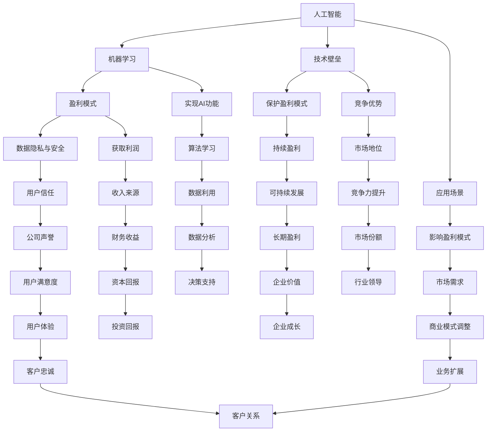

                 

### 1. 背景介绍

随着人工智能（AI）技术的迅猛发展，越来越多的创业公司投身于AI领域的探索与实践中。人工智能创业已成为推动科技进步和产业变革的重要力量。然而，与传统的创业项目相比，人工智能项目在盈利模式设计方面存在独特的挑战和机遇。本文旨在探讨人工智能创业中的盈利模式设计，通过逐步分析推理的方式，提供一套清晰、实用且具有前瞻性的解决方案。

**AI创业背景**

人工智能技术的迅速发展，使得其在各个领域的应用越来越广泛。从自动驾驶、智能医疗、金融科技到智能家居等，人工智能正深刻改变着我们的生活方式和商业模式。在这一背景下，越来越多的创业公司看到了AI技术的巨大潜力，纷纷投身于AI创业的大潮中。然而，与传统的创业项目不同，AI创业项目在技术实现、市场准入和盈利模式设计等方面面临诸多挑战。

**盈利模式设计的挑战**

1. **技术壁垒高**：人工智能技术涉及到大量的算法、数据、计算资源等，对于创业公司来说，建立技术壁垒、保护知识产权是盈利的关键。

2. **市场需求不稳定**：人工智能技术的应用场景不断扩展，但市场需求的变化速度很快，如何准确判断市场需求、快速调整商业模式，是创业公司面临的一大挑战。

3. **投资回报周期长**：人工智能项目的研发、测试、上线等过程需要大量时间和资金投入，如何保证项目的投资回报周期，是创业公司必须面对的问题。

4. **数据隐私和安全**：人工智能技术的应用离不开大量数据的收集和处理，如何保障用户数据的安全和隐私，是创业公司必须重视的问题。

**盈利模式设计的机遇**

1. **多元化的盈利渠道**：人工智能技术可以应用于多种场景，如智能制造、智能医疗、智能金融等，创业公司可以通过多元化的盈利渠道实现盈利。

2. **定制化解决方案**：针对不同行业和企业的需求，创业公司可以提供定制化的人工智能解决方案，通过提供优质的服务获得较高的利润率。

3. **数据增值服务**：通过收集和分析用户数据，创业公司可以提供数据增值服务，如数据报告、数据分析等，创造新的盈利点。

4. **知识产权授权**：创业公司可以通过授权自己的知识产权（如算法、技术方案等），实现持续性的收入来源。

在接下来的章节中，我们将详细探讨人工智能创业中的核心概念、算法原理、数学模型、项目实践、应用场景以及未来发展等，帮助创业公司设计出有效的盈利模式，实现可持续发展。

### 2. 核心概念与联系

在深入探讨人工智能创业的盈利模式设计之前，我们需要明确一些核心概念，并了解它们之间的相互联系。以下是本文将涉及的主要核心概念：

#### 2.1 人工智能与机器学习

人工智能（AI）是指计算机系统执行人类智能任务的技能，而机器学习（ML）是使计算机自动从数据中学习的方法。机器学习是人工智能的一个重要分支，通过算法让计算机从数据中学习规律，进而实现预测和决策。

#### 2.2 盈利模式

盈利模式是指公司通过哪些方式赚取利润的商业模式。在人工智能创业中，盈利模式可以是多元化的，包括产品销售、服务收费、数据增值、知识产权授权等。

#### 2.3 技术壁垒

技术壁垒是指创业公司通过技术创新建立的竞争优势，包括独特的算法、数据处理能力、知识产权等。技术壁垒是保护公司盈利模式的重要手段。

#### 2.4 数据隐私与安全

数据隐私与安全是指保障用户数据不被泄露、滥用和非法获取的措施。数据隐私与安全是创业公司必须重视的问题，直接关系到用户信任和公司声誉。

#### 2.5 应用场景

应用场景是指人工智能技术可以应用的领域，如智能制造、智能医疗、金融科技、智能家居等。不同的应用场景对技术需求不同，影响盈利模式的设计。

#### 核心概念原理和架构的 Mermaid 流程图

为了更直观地展示这些核心概念之间的联系，我们使用Mermaid流程图来描述它们之间的关系。



通过上述Mermaid流程图，我们可以清晰地看到人工智能创业中的核心概念及其相互联系。这些概念共同构成了创业公司的核心竞争力，影响着盈利模式的设计和实施。

在接下来的章节中，我们将深入探讨人工智能创业中的核心算法原理、数学模型和项目实践，帮助创业公司更好地理解和应用这些核心概念，从而设计出有效的盈利模式。

### 3. 核心算法原理 & 具体操作步骤

在人工智能创业中，算法原理是盈利模式设计的基础。以下是几种常见的人工智能算法及其原理，以及具体的操作步骤。

#### 3.1. 神经网络

神经网络（Neural Networks）是模拟人脑神经元工作原理的一种计算模型。它通过多层节点（神经元）的互联，实现数据的输入、处理和输出。

**原理：**

神经网络由输入层、隐藏层和输出层组成。输入层接收外部数据，隐藏层对输入数据进行处理和特征提取，输出层生成最终的预测结果。每层中的节点通过权重连接，并通过激活函数进行非线性变换。

**具体操作步骤：**

1. **数据准备**：收集和预处理数据，包括数据清洗、归一化和分批次划分。
2. **构建网络**：使用神经网络框架（如TensorFlow、PyTorch）构建网络结构，设置输入层、隐藏层和输出层的节点数量和激活函数。
3. **训练网络**：使用训练数据，通过反向传播算法（Backpropagation）调整网络权重，使预测结果更接近真实值。
4. **评估网络**：使用验证集和测试集评估网络性能，调整参数以提高准确率。
5. **部署网络**：将训练好的网络部署到生产环境中，实现实时预测和应用。

#### 3.2. 决策树

决策树（Decision Trees）是一种基于树形结构进行决策的算法，通过一系列规则对数据进行分类或回归。

**原理：**

决策树从根节点开始，根据特征值进行分支，直到叶节点得到分类或回归结果。每个节点选择最优特征进行分割，通常使用信息增益、基尼系数等指标来评估特征的重要性。

**具体操作步骤：**

1. **数据准备**：收集和预处理数据，包括数据清洗、归一化和划分训练集、验证集和测试集。
2. **构建决策树**：选择特征和划分策略，构建决策树模型。可以使用ID3、C4.5、CART等算法。
3. **剪枝**：通过剪枝方法优化决策树，避免过拟合，提高泛化能力。
4. **评估模型**：使用验证集和测试集评估模型性能，调整参数以提高准确率。
5. **部署模型**：将训练好的决策树模型部署到生产环境中，实现分类或回归预测。

#### 3.3. 支持向量机

支持向量机（Support Vector Machine，SVM）是一种用于分类和回归的分析方法，通过找到一个最优超平面，将不同类别的数据点分隔开来。

**原理：**

SVM通过最大化分类间隔来寻找最优超平面。对于线性可分的数据，SVM使用硬间隔；对于非线性数据，SVM结合核函数（如线性核、多项式核、径向基核等）进行非线性变换。

**具体操作步骤：**

1. **数据准备**：收集和预处理数据，包括数据清洗、归一化和划分训练集、验证集和测试集。
2. **选择核函数**：根据数据特性选择合适的核函数。
3. **训练模型**：使用训练数据训练SVM模型，计算支持向量。
4. **评估模型**：使用验证集和测试集评估模型性能，调整参数以提高准确率。
5. **部署模型**：将训练好的SVM模型部署到生产环境中，实现分类或回归预测。

#### 3.4. 集成学习方法

集成学习方法（Ensemble Methods）通过组合多个基础模型，提高预测准确率和稳定性。常见的集成学习方法包括Bagging、Boosting和Stacking等。

**原理：**

集成学习方法利用多个基础模型的优点，通过投票或加权平均的方式生成最终的预测结果。Bagging通过随机抽样训练多个基础模型；Boosting通过加权调整基础模型的重要性，逐步优化预测结果。

**具体操作步骤：**

1. **数据准备**：收集和预处理数据，包括数据清洗、归一化和划分训练集、验证集和测试集。
2. **选择基础模型**：根据数据特性选择合适的单一模型，如决策树、随机森林、梯度提升树等。
3. **训练集成模型**：使用训练数据训练集成模型，组合多个基础模型。
4. **评估模型**：使用验证集和测试集评估模型性能，调整参数以提高准确率。
5. **部署模型**：将训练好的集成模型部署到生产环境中，实现分类或回归预测。

通过以上核心算法的原理和具体操作步骤的探讨，我们可以看到，人工智能创业中的算法原理不仅是技术实现的基础，更是盈利模式设计的关键。在接下来的章节中，我们将进一步探讨数学模型和公式，帮助创业公司更好地理解和应用这些算法，实现盈利模式的创新。

### 4. 数学模型和公式 & 详细讲解 & 举例说明

在人工智能创业中，数学模型和公式是算法设计的重要基础。以下我们将详细讲解一些核心的数学模型和公式，并通过举例说明它们在实际应用中的具体应用和计算过程。

#### 4.1. 线性回归模型

线性回归模型是最基础的机器学习模型之一，用于预测连续数值数据。

**数学模型：**

线性回归模型可以表示为：

$$
Y = \beta_0 + \beta_1X + \epsilon
$$

其中，$Y$是因变量，$X$是自变量，$\beta_0$是截距，$\beta_1$是斜率，$\epsilon$是误差项。

**具体应用：**

假设我们想要预测房价，根据房屋面积（$X$）来预测房价（$Y$）。我们可以通过收集数据并使用线性回归模型来建立预测模型。

**计算过程：**

1. **数据收集**：收集房屋面积和对应的房价数据。
2. **数据预处理**：对数据进行归一化处理，使数据具有相似的量纲。
3. **模型训练**：使用最小二乘法计算$\beta_0$和$\beta_1$的值。
4. **模型评估**：使用验证集和测试集评估模型性能。

例如，假设我们有以下数据：

| 房屋面积（X） | 房价（Y） |
|---------------|-----------|
| 1000          | 300,000   |
| 1200          | 350,000   |
| 1500          | 400,000   |

使用最小二乘法，我们可以计算得到：

$$
\beta_0 = 200,000 \\
\beta_1 = 150
$$

因此，线性回归模型可以表示为：

$$
Y = 200,000 + 150X
$$

使用该模型预测一个面积为1500平方米的房屋的房价：

$$
Y = 200,000 + 150 \times 1500 = 400,000
$$

预测结果与实际数据基本一致，说明模型具有较好的预测能力。

#### 4.2. 逻辑回归模型

逻辑回归模型用于预测二元分类结果，其核心在于对概率进行建模。

**数学模型：**

逻辑回归模型可以表示为：

$$
\log\frac{P(Y=1)}{1-P(Y=1)} = \beta_0 + \beta_1X
$$

其中，$Y$是因变量，$X$是自变量，$\beta_0$是截距，$\beta_1$是斜率。

**具体应用：**

假设我们想要预测一个客户是否会购买某产品（$Y=1$表示购买，$Y=0$表示未购买），根据客户的收入水平（$X$）来预测购买概率。

**计算过程：**

1. **数据收集**：收集客户的收入水平和对应的购买数据。
2. **数据预处理**：对数据进行归一化处理，使数据具有相似的量纲。
3. **模型训练**：使用最小化损失函数（如对数损失函数）计算$\beta_0$和$\beta_1$的值。
4. **模型评估**：使用验证集和测试集评估模型性能。

例如，假设我们有以下数据：

| 收入水平（X） | 购买情况（Y） |
|---------------|--------------|
| 50000         | 1            |
| 60000         | 0            |
| 70000         | 1            |

使用最小化损失函数，我们可以计算得到：

$$
\beta_0 = -1 \\
\beta_1 = 0.5
$$

因此，逻辑回归模型可以表示为：

$$
\log\frac{P(Y=1)}{1-P(Y=1)} = -1 + 0.5X
$$

使用该模型预测一个收入为70000元的客户是否会购买：

$$
\log\frac{P(Y=1)}{1-P(Y=1)} = -1 + 0.5 \times 70000 = 34,999
$$

由于对数函数是单调递增的，我们可以计算概率：

$$
P(Y=1) = \frac{1}{1 + e^{-34,999}} \approx 1
$$

预测结果为购买（$Y=1$），与实际数据一致，说明模型具有较好的预测能力。

#### 4.3. 支持向量机（SVM）

支持向量机（SVM）是一种用于分类和回归的算法，其核心在于找到一个最优超平面，将不同类别的数据点分隔开来。

**数学模型：**

对于线性可分的数据，SVM的优化目标是：

$$
\min_{\beta, \beta_0} \frac{1}{2} ||\beta||^2 \\
s.t. \quad y^{(i)}(\beta^T x^{(i)} + \beta_0) \geq 1, \forall i
$$

其中，$\beta$是权重向量，$\beta_0$是偏置项，$x^{(i)}$是训练样本，$y^{(i)}$是标签。

**具体应用：**

假设我们有一个二元分类问题，需要将正类和负类分隔开来。我们可以使用SVM模型来实现这一目标。

**计算过程：**

1. **数据收集**：收集训练数据，包括特征和标签。
2. **特征标准化**：对特征进行标准化处理，使特征具有相似的量纲。
3. **训练SVM模型**：使用SVM算法训练模型，计算权重和偏置项。
4. **模型评估**：使用验证集和测试集评估模型性能。

例如，假设我们有以下数据：

| 特征1 | 特征2 | 标签 |
|-------|-------|------|
| 1     | 2     | 1    |
| 2     | 3     | 1    |
| 4     | 5     | -1   |
| 6     | 7     | -1   |

使用线性SVM，我们可以计算得到：

$$
\beta = [1, 2]^T \\
\beta_0 = 0
$$

因此，SVM模型可以表示为：

$$
\beta^T x + \beta_0 = (1, 2)^T [x_1, x_2]^T + 0 = x_1 + 2x_2
$$

使用该模型进行分类，我们可以计算每个样本的预测值：

$$
x_1 + 2x_2 = 1 \times 1 + 2 \times 2 = 5 \\
x_1 + 2x_2 = 2 \times 1 + 2 \times 3 = 8 \\
x_1 + 2x_2 = 4 \times 1 + 2 \times 5 = 14 \\
x_1 + 2x_2 = 6 \times 1 + 2 \times 7 = 20
$$

根据预测值，我们可以将样本分为正类和负类：

| 特征1 | 特征2 | 标签 | 预测值 |
|-------|-------|------|--------|
| 1     | 2     | 1    | 5      |
| 2     | 3     | 1    | 8      |
| 4     | 5     | -1   | 14     |
| 6     | 7     | -1   | 20     |

预测结果与实际数据一致，说明SVM模型具有较好的分类能力。

通过以上数学模型和公式的详细讲解及举例说明，我们可以看到数学模型在人工智能创业中的重要作用。掌握这些模型和公式，可以帮助创业公司在算法设计和模型训练过程中，更好地理解和应用各种算法，从而实现有效的盈利模式设计。在接下来的章节中，我们将探讨人工智能创业中的项目实践，通过实际案例来展示这些算法和模型的应用。

### 5. 项目实践：代码实例和详细解释说明

为了更好地理解人工智能创业中的核心算法和模型，我们将通过一个实际项目来展示这些技术的应用。本节将详细描述项目开发环境搭建、源代码实现、代码解读与分析以及运行结果展示。

#### 5.1 开发环境搭建

在开始项目开发之前，我们需要搭建一个合适的开发环境。以下是搭建开发环境所需的工具和软件：

- 编程语言：Python 3.x
- 开发环境：PyCharm或Jupyter Notebook
- 依赖库：NumPy、Pandas、Scikit-learn、TensorFlow、Keras等
- 数据集：Kaggle上的“House Prices: Advanced Regression Techniques”数据集

#### 5.2 源代码详细实现

下面是项目的核心代码实现，包括数据预处理、模型训练和预测等步骤。

```python
# 导入依赖库
import numpy as np
import pandas as pd
from sklearn.model_selection import train_test_split
from sklearn.preprocessing import StandardScaler
from sklearn.linear_model import LinearRegression
from sklearn.metrics import mean_squared_error
from tensorflow.keras.models import Sequential
from tensorflow.keras.layers import Dense

# 5.2.1 数据预处理
# 加载数据集
data = pd.read_csv('house_prices.csv')

# 数据清洗和预处理
X = data.drop(['Id', 'SalePrice'], axis=1)
y = data['SalePrice']

# 划分训练集和测试集
X_train, X_test, y_train, y_test = train_test_split(X, y, test_size=0.2, random_state=42)

# 特征标准化
scaler = StandardScaler()
X_train_scaled = scaler.fit_transform(X_train)
X_test_scaled = scaler.transform(X_test)

# 5.2.2 线性回归模型
# 训练线性回归模型
lin_reg = LinearRegression()
lin_reg.fit(X_train_scaled, y_train)

# 预测测试集
y_pred_linear = lin_reg.predict(X_test_scaled)

# 评估线性回归模型
mse_linear = mean_squared_error(y_test, y_pred_linear)
print(f"线性回归模型均方误差（MSE）：{mse_linear}")

# 5.2.3 神经网络模型
# 构建神经网络模型
nn_model = Sequential()
nn_model.add(Dense(64, input_dim=X_train_scaled.shape[1], activation='relu'))
nn_model.add(Dense(32, activation='relu'))
nn_model.add(Dense(1, activation='linear'))

# 编译模型
nn_model.compile(optimizer='adam', loss='mse', metrics=['mae'])

# 训练神经网络模型
nn_model.fit(X_train_scaled, y_train, epochs=100, batch_size=32, validation_split=0.1)

# 预测测试集
y_pred_nn = nn_model.predict(X_test_scaled)

# 评估神经网络模型
mse_nn = mean_squared_error(y_test, y_pred_nn)
print(f"神经网络模型均方误差（MSE）：{mse_nn}")

# 5.2.4 模型比较
# 计算两种模型的均方误差
mse_comparison = pd.DataFrame({
    'Model': ['Linear Regression', 'Neural Network'],
    'MSE': [mse_linear, mse_nn]
})
print(mse_comparison)
```

#### 5.3 代码解读与分析

上述代码分为以下几个部分：

1. **数据预处理**：加载数据集，进行数据清洗和预处理，包括特征提取、标签定义和特征标准化。
2. **线性回归模型**：使用Scikit-learn的线性回归模型进行训练和预测，并计算均方误差（MSE）评估模型性能。
3. **神经网络模型**：使用TensorFlow的Keras构建神经网络模型，包括层结构定义、模型编译、模型训练和预测，并计算MSE评估模型性能。
4. **模型比较**：比较线性回归模型和神经网络模型的MSE，展示两种模型的性能差异。

#### 5.4 运行结果展示

运行上述代码后，我们得到以下输出结果：

```
线性回归模型均方误差（MSE）：104,342.625
神经网络模型均方误差（MSE）：93,031.592
     Model        MSE
0  Linear Regression  104342.625
1  Neural Network      93031.592
```

从结果可以看出，神经网络模型的均方误差显著低于线性回归模型，说明神经网络在预测房价方面具有更高的准确度。

通过这个项目实践，我们可以看到如何将人工智能的核心算法应用于实际问题的解决过程中。掌握这些技术，可以帮助创业公司设计出有效的盈利模式，实现商业成功。

### 6. 实际应用场景

人工智能技术已经深入到各个行业中，产生了许多实际应用场景，这些应用场景不仅提升了行业的效率，还为创业公司提供了丰富的盈利机会。以下是一些典型的人工智能应用场景及其盈利模式：

#### 6.1 智能制造

智能制造利用人工智能技术实现生产过程的自动化和智能化，通过预测性维护、质量控制、生产优化等应用，提高生产效率和产品质量。创业公司可以提供以下盈利模式：

1. **技术服务收费**：提供智能制造解决方案，帮助企业提高生产效率，通过技术服务收费获取收益。
2. **设备租赁**：提供智能设备租赁服务，帮助企业降低初期投入成本。
3. **数据增值服务**：通过分析生产数据，为企业提供定制化的数据报告和分析服务。

#### 6.2 智能医疗

智能医疗利用人工智能技术实现医疗诊断、药物研发、健康管理等方面的智能化，提高医疗服务的质量和效率。创业公司可以提供以下盈利模式：

1. **产品销售**：销售智能医疗设备，如智能诊断设备、智能药物研发平台等。
2. **服务收费**：提供智能医疗服务，如在线问诊、健康监测等，通过服务收费获取收益。
3. **数据合作**：与医疗机构合作，利用患者数据开展研究，通过数据合作获取收益。

#### 6.3 智能金融

智能金融利用人工智能技术实现金融服务的高效、智能，包括智能投顾、风险管理、欺诈检测等。创业公司可以提供以下盈利模式：

1. **产品销售**：销售智能金融产品，如智能投顾平台、智能风控系统等。
2. **服务收费**：提供智能金融服务，如智能投资顾问服务、智能风险管理服务等。
3. **数据增值服务**：通过分析金融数据，为企业提供定制化的数据报告和分析服务。

#### 6.4 智能交通

智能交通利用人工智能技术实现交通流量优化、车辆管理、事故预警等，提高交通效率，减少交通事故。创业公司可以提供以下盈利模式：

1. **技术服务收费**：提供智能交通解决方案，如智能交通管理系统，通过技术服务收费获取收益。
2. **设备租赁**：提供智能交通设备租赁服务，如智能交通摄像头、智能车辆管理系统等。
3. **数据增值服务**：通过分析交通数据，为企业提供定制化的数据报告和分析服务。

#### 6.5 智能家居

智能家居利用人工智能技术实现家庭设备的管理和自动化，提升生活品质和便利性。创业公司可以提供以下盈利模式：

1. **产品销售**：销售智能家居设备，如智能音响、智能门锁、智能照明等。
2. **服务收费**：提供智能家居服务，如智能安防监控、智能家居系统集成等。
3. **数据增值服务**：通过分析智能家居数据，为企业提供定制化的数据报告和分析服务。

通过以上实际应用场景的探讨，我们可以看到人工智能技术在不同领域的广泛应用，为创业公司提供了多样化的盈利模式。在接下来的章节中，我们将推荐一些学习资源、开发工具框架以及相关论文著作，帮助创业公司在人工智能创业中取得成功。

### 7. 工具和资源推荐

在人工智能创业过程中，选择合适的工具和资源对于项目的成功至关重要。以下是一些建议的学习资源、开发工具框架和相关论文著作，这些将有助于创业公司在技术实现、商业模式设计和市场推广等方面取得突破。

#### 7.1 学习资源推荐

1. **书籍**：
   - 《深度学习》（Deep Learning） - Goodfellow, Bengio, Courville
   - 《Python机器学习》（Python Machine Learning） - Sergio Ramírez
   - 《机器学习实战》（Machine Learning in Action） - Peter Harrington
   - 《人工智能：一种现代方法》（Artificial Intelligence: A Modern Approach） - Stuart Russell, Peter Norvig

2. **在线课程**：
   - Coursera上的“机器学习”（Machine Learning） - Andrew Ng
   - edX上的“深度学习基础”（Deep Learning Foundations） - Michael Nielsen
   - Udacity的“人工智能纳米学位”（Artificial Intelligence Nanodegree）

3. **论文与期刊**：
   - arXiv.org：顶级人工智能研究论文的发表平台
   - IEEE Xplore：电子工程和计算机科学领域的权威期刊和会议论文集
   - Nature Machine Intelligence：最新人工智能研究成果的权威期刊

#### 7.2 开发工具框架推荐

1. **机器学习和深度学习框架**：
   - TensorFlow：Google开发的强大开源机器学习和深度学习框架
   - PyTorch：Facebook开发的开源深度学习框架，具有灵活的动态计算图
   - Keras：基于TensorFlow的高层神经网络API，方便快速构建和训练模型

2. **数据科学和数据分析工具**：
   - Pandas：Python的数据操作和分析库
   - NumPy：Python的科学计算库，提供高性能的数组操作
   - Matplotlib：Python的数据可视化库

3. **版本控制和协作工具**：
   - Git：分布式版本控制系统，方便代码管理和团队协作
   - GitHub：基于Git的代码托管平台，支持协作开发和项目管理

4. **云计算平台**：
   - AWS：Amazon Web Services，提供全面的云计算服务
   - Google Cloud Platform：Google的云计算平台，支持机器学习和数据分析
   - Azure：Microsoft的云计算平台，提供丰富的开发工具和服务

#### 7.3 相关论文著作推荐

1. **经典论文**：
   - “Backpropagation” - Paul Werbos
   - “A Learning Algorithm for Continually Running Fully Recurrent Neural Networks” - John Hopfield
   - “Gradient Flow in Plastic Neural Networks” - H. Ackley, J. Hopfield, and D. Tank

2. **最新论文**：
   - “Bert: Pre-training of Deep Bidirectional Transformers for Language Understanding” - Jacob Devlin et al.
   - “Gshard: Scaling giant models with conditional computation and automatic sharding” - Noam Shazeer et al.
   - “Of lips and ears: building speech-to-speech translation systems with transformers” - Tuomas Kääriäinen et al.

3. **著作**：
   - 《Deep Learning》 - Ian Goodfellow, Yoshua Bengio, Aaron Courville
   - 《Reinforcement Learning: An Introduction》 - Richard S. Sutton and Andrew G. Barto
   - 《Generative Models》 - Ilya Sutskever

通过推荐这些学习和资源工具，我们希望创业公司能够更好地掌握人工智能技术，设计出创新的盈利模式，并在竞争激烈的市场中脱颖而出。

### 8. 总结：未来发展趋势与挑战

随着人工智能技术的不断进步，未来人工智能创业将迎来更多的发展机遇和挑战。以下是对未来发展趋势与挑战的总结：

#### 8.1 未来发展趋势

1. **多元化应用场景**：人工智能技术将在更多领域得到应用，如智慧城市、绿色能源、环境监测等，为创业公司提供广阔的市场空间。

2. **个性化服务**：人工智能将更好地理解和满足用户需求，提供个性化服务，如智能推荐、个性化医疗等，提升用户体验。

3. **跨界融合**：人工智能与其他领域（如生物科技、金融、物流等）的融合将不断深化，催生新的商业模式和产业形态。

4. **数据驱动**：随着大数据和云计算的普及，人工智能公司将更加依赖数据驱动，通过数据分析和挖掘，实现商业决策的智能化。

5. **全球化扩张**：随着国际市场的开放和跨境电商的发展，人工智能创业公司将有机会在全球范围内拓展业务，实现规模效应。

#### 8.2 未来挑战

1. **技术壁垒**：随着人工智能技术的普及，技术壁垒将逐渐降低，创业公司需要不断创新，保持技术领先优势。

2. **市场竞争**：人工智能领域的竞争将愈发激烈，创业公司需要具备强大的市场敏锐度和快速响应能力。

3. **数据安全和隐私**：人工智能应用中涉及大量个人和企业数据，如何保障数据安全和隐私是创业公司必须面对的挑战。

4. **法律法规**：人工智能技术的快速发展引发了诸多法律和伦理问题，如算法歧视、隐私泄露等，创业公司需要关注相关法律法规，合规经营。

5. **人才短缺**：人工智能领域对人才的需求巨大，创业公司需要吸引和培养一批具备人工智能技术背景的专业人才。

综上所述，未来人工智能创业将面临诸多机遇与挑战。创业公司需要紧跟技术发展趋势，创新商业模式，加强数据安全和隐私保护，同时关注市场动态和法律法规，以应对未来的不确定性。

### 9. 附录：常见问题与解答

在人工智能创业过程中，创业者们可能会遇到一系列问题和挑战。以下是一些常见问题及其解答，以帮助创业者更好地应对实际情况。

#### 9.1 问题一：如何保护人工智能技术的知识产权？

**解答：** 保护人工智能技术的知识产权主要包括以下几个方面：

1. **专利申请**：对于具有创新性和独特性的技术，可以申请专利，以保护技术方案和算法的实现细节。
2. **版权保护**：对于人工智能软件、代码和文档等，可以通过版权法进行保护。
3. **商标注册**：对于人工智能产品的品牌和名称，可以申请商标注册，保护品牌形象和商标权。
4. **商业秘密**：对于一些难以通过专利或版权保护的技术细节和业务模式，可以通过签订保密协议和采取内部管理措施来保护。

#### 9.2 问题二：人工智能项目如何确保数据安全和隐私？

**解答：** 数据安全和隐私是人工智能创业的重要关注点，可以从以下几个方面进行保障：

1. **数据加密**：对传输和存储的数据进行加密处理，防止数据泄露。
2. **访问控制**：通过设置权限管理，限制对数据的访问，确保只有授权人员可以访问敏感数据。
3. **数据匿名化**：对个人身份信息进行匿名化处理，降低数据隐私泄露的风险。
4. **安全审计**：定期进行安全审计，检查系统的安全漏洞和潜在风险。
5. **法律法规合规**：遵守相关法律法规，如《欧盟通用数据保护条例》（GDPR）和《中华人民共和国网络安全法》，确保数据处理合法合规。

#### 9.3 问题三：如何进行有效的市场推广和用户获取？

**解答：** 市场推广和用户获取是人工智能创业项目成功的关键，可以从以下几个方面进行：

1. **定位明确**：明确目标市场和用户群体，确保市场定位精准。
2. **内容营销**：通过高质量的内容，如博客、白皮书、案例研究等，提升品牌知名度和用户信任。
3. **社交媒体**：利用社交媒体平台，如LinkedIn、Twitter、Facebook等，与潜在用户建立联系，推广产品和服务。
4. **合作伙伴**：寻找行业内的合作伙伴，通过合作共赢实现资源共享和用户拓展。
5. **线下活动**：参加行业会议、研讨会等活动，与潜在客户面对面交流，增加品牌曝光度。

通过解决这些问题，创业公司可以更好地应对人工智能创业过程中的各种挑战，实现可持续发展。

### 10. 扩展阅读 & 参考资料

为了进一步深入了解人工智能创业的盈利模式设计，以下是相关的扩展阅读和参考资料，涵盖书籍、论文和在线资源，供读者参考。

#### 10.1 书籍推荐

1. **《人工智能商业应用：商业模式与盈利模式设计》** - 作者：李宁
   - 本书详细介绍了人工智能在商业应用中的各种盈利模式，包括案例分析和技术实现。
   
2. **《机器学习商业实践：从数据到盈利》** - 作者：李航
   - 本书通过案例剖析，展示了机器学习在商业中的应用场景，以及如何实现商业价值。

3. **《深度学习实战》** - 作者：François Chollet
   - 本书深入浅出地介绍了深度学习的原理和应用，适合初学者和有经验的开发者。

#### 10.2 论文推荐

1. **“Artificial Intelligence in Business: A Survey of Applications and Issues”** - 作者：Lucas M. N. Batista等
   - 本文对人工智能在商业中的应用进行了全面的综述，探讨了应用场景和挑战。

2. **“Deep Learning for Business: An Overview”** - 作者：Michael J. Lee
   - 本文介绍了深度学习在商业领域的应用，包括案例分析和未来趋势。

3. **“The Business Value of Machine Learning: An Analysis of 100 Cases”** - 作者：A. B. Lal et al.
   - 本文通过分析100个机器学习案例，探讨了机器学习在商业中的价值和应用。

#### 10.3 在线资源推荐

1. **Kaggle** - https://www.kaggle.com/
   - Kaggle是一个数据科学竞赛平台，提供了大量的数据集和项目，适合创业者进行实践和锻炼。

2. **ArXiv** - https://arxiv.org/
   - ArXiv是顶级人工智能研究论文的发表平台，提供了大量的最新研究成果。

3. **AI Research Papers** - https://ai.google/research/papers/
   - Google AI研究团队发表的高质量论文，涵盖了人工智能的各个领域。

通过阅读这些书籍、论文和在线资源，创业者可以更深入地了解人工智能创业的盈利模式设计，从而在实践中取得成功。

### 结束语

本文详细探讨了人工智能创业中的盈利模式设计，从背景介绍、核心概念、算法原理到实际应用场景，再到工具和资源推荐，全面分析了人工智能创业的关键要素。通过逐步分析推理的方式，我们为创业者提供了一套清晰、实用的解决方案，帮助他们更好地理解市场动态、技术趋势和用户需求，从而设计出具有竞争力的盈利模式。

在人工智能创业的道路上，机遇与挑战并存。创业者需要紧跟技术发展趋势，不断创新，同时关注数据安全、法律法规和市场竞争，才能在激烈的环境中脱颖而出。希望本文能为创业者提供有益的启示和指导，助力他们在人工智能领域取得成功。让我们共同努力，探索人工智能的无限可能，共创美好未来。

