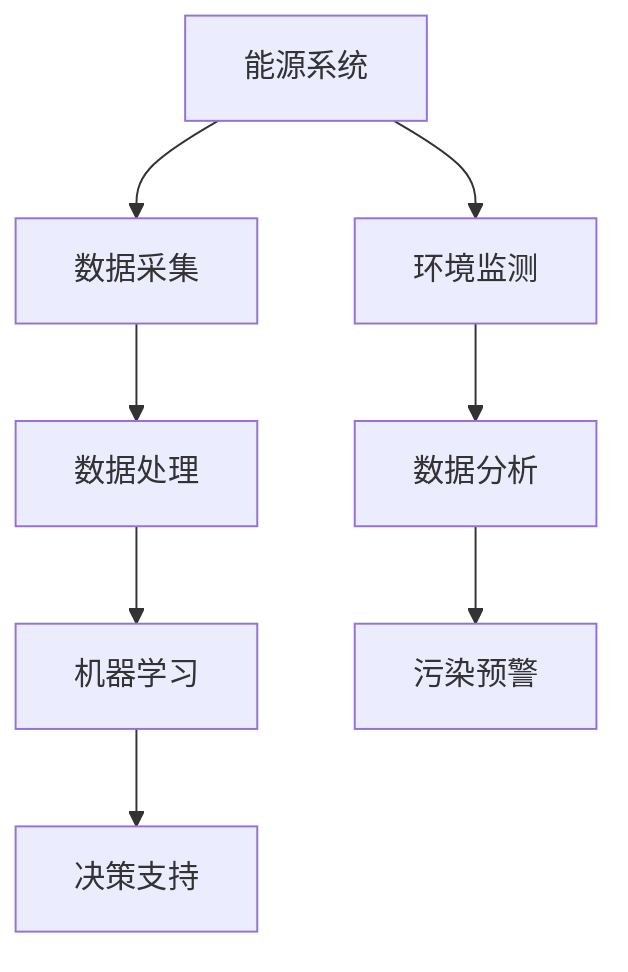

                 

### 文章标题

**人工智能在能源和环境中的应用**

> **关键词：** 人工智能、能源、环境、应用、优化、建模、预测、监测、可持续发展

> **摘要：** 本文将深入探讨人工智能在能源和环境领域的应用，涵盖从核心概念、算法原理，到实际案例和未来趋势，全面展示人工智能在推动可持续能源和环境保护中的重要作用。

### 1. 背景介绍

在当今世界，能源和环境问题日益凸显，成为全球共同面临的重大挑战。能源短缺、环境污染、气候变化等问题不仅影响人类的生活质量，还威胁到地球生态系统的稳定。因此，寻找高效、清洁的能源替代方案以及有效控制环境污染成为当务之急。

传统的能源和环境管理方式依赖于大量的手工操作和数据采集，这不仅效率低下，而且容易出错。随着人工智能技术的快速发展，特别是深度学习、强化学习、计算机视觉等技术的突破，人工智能在能源和环境领域展现出了巨大的潜力。

人工智能（AI）是指使计算机系统模拟人类智能行为的技术，包括感知、学习、推理、决策等能力。通过大数据分析和机器学习算法，人工智能可以在复杂的环境中自动识别模式、优化决策、提高效率。

### 2. 核心概念与联系

为了深入理解人工智能在能源和环境中的应用，我们首先需要了解一些核心概念和它们之间的联系。

#### 2.1 能源系统

能源系统包括发电、输电、配电、储能等多个环节。每一个环节都涉及到大量的数据和信息，如发电量、负荷需求、电网稳定性等。这些数据对于优化能源配置、提高能源利用效率至关重要。

#### 2.2 环境监测

环境监测是指对大气、水、土壤等环境要素的监测，以了解环境质量、预测污染趋势。环境监测需要大量的传感器和监测设备，这些设备产生的数据需要实时处理和分析。

#### 2.3 数据分析与机器学习

数据分析与机器学习是人工智能的核心组成部分。通过对海量数据的挖掘和分析，人工智能可以发现隐藏在数据中的模式、趋势和关联，从而提供优化决策。

#### 2.4 人工智能与能源、环境的关系

人工智能可以通过以下几种方式应用于能源和环境领域：

- **能源优化：** 通过对能源系统的数据分析和建模，人工智能可以帮助优化能源配置，提高能源利用效率。

- **环境监测：** 通过计算机视觉和传感器技术，人工智能可以对环境进行实时监测，及时发现污染问题。

- **预测与决策：** 通过机器学习算法，人工智能可以对能源需求和环境污染进行预测，为决策提供科学依据。

#### 2.5 Mermaid 流程图



### 3. 核心算法原理 & 具体操作步骤

在人工智能应用于能源和环境领域时，常用的算法主要包括以下几种：

#### 3.1 深度学习

深度学习是一种基于多层神经网络的机器学习技术，可以自动提取数据中的特征和模式。在能源和环境领域，深度学习可以用于电力负荷预测、风力发电预测、光伏发电预测等。

**具体操作步骤：**

1. 数据预处理：对原始数据进行清洗、归一化等处理，使其适合深度学习模型的输入。

2. 构建神经网络模型：设计神经网络的结构，包括输入层、隐藏层和输出层。

3. 训练模型：使用历史数据对神经网络进行训练，调整模型参数。

4. 预测与评估：使用训练好的模型进行预测，并对预测结果进行评估。

#### 3.2 强化学习

强化学习是一种通过试错来学习最优策略的机器学习技术。在能源和环境领域，强化学习可以用于电网调度、能源储备管理等。

**具体操作步骤：**

1. 定义环境：明确强化学习的目标，如最小化能源成本、最大化能源利用率等。

2. 设计策略：设计一个策略函数，用于选择最优行动。

3. 执行策略：在环境中执行策略，收集反馈。

4. 学习与优化：根据反馈调整策略函数，以提高性能。

#### 3.3 计算机视觉

计算机视觉是一种通过图像处理技术来识别和理解图像的机器学习方法。在环境监测领域，计算机视觉可以用于图像分类、目标检测等。

**具体操作步骤：**

1. 数据采集：收集大量环境监测图像。

2. 数据预处理：对图像进行缩放、裁剪等预处理。

3. 构建模型：使用卷积神经网络（CNN）等模型进行图像分类和目标检测。

4. 模型评估：使用测试数据对模型进行评估。

### 4. 数学模型和公式 & 详细讲解 & 举例说明

在人工智能应用于能源和环境领域时，一些常用的数学模型和公式如下：

#### 4.1 回归分析

回归分析是一种用于预测目标变量值的统计方法。在能源预测中，回归分析可以用于预测电力负荷、风速、光伏发电量等。

**数学公式：**

$$
y = \beta_0 + \beta_1x_1 + \beta_2x_2 + ... + \beta_nx_n + \epsilon
$$

其中，$y$ 是目标变量，$x_1, x_2, ..., x_n$ 是自变量，$\beta_0, \beta_1, ..., \beta_n$ 是回归系数，$\epsilon$ 是误差项。

**举例说明：**

假设我们要预测未来一天的电力负荷，可以使用线性回归模型。首先，收集过去一周的每日电力负荷数据作为训练数据，然后使用线性回归模型进行训练。训练完成后，输入当天的天气数据（如温度、湿度等）即可预测未来一天的电力负荷。

#### 4.2 卷积神经网络

卷积神经网络（CNN）是一种用于图像处理的深度学习模型。在计算机视觉中，CNN 可以用于图像分类、目标检测等。

**数学公式：**

$$
h_{l}(x) = \sigma\left(\mathbf{W}_{l}\mathbf{a}_{l-1} + b_{l}\right)
$$

其中，$h_{l}$ 是第 $l$ 层的输出，$\sigma$ 是激活函数，$\mathbf{W}_{l}$ 是权重矩阵，$b_{l}$ 是偏置。

**举例说明：**

假设我们要使用 CNN 对图像进行分类。首先，收集大量带有标签的图像数据作为训练数据，然后使用 CNN 进行训练。训练完成后，输入新的图像即可预测其类别。

### 5. 项目实践：代码实例和详细解释说明

在本节中，我们将通过一个实际项目来展示人工智能在能源和环境中的应用。

#### 5.1 开发环境搭建

为了运行下面的代码实例，我们需要安装以下软件和库：

- Python 3.8+
- TensorFlow 2.x
- Matplotlib
- Pandas
- NumPy

安装命令如下：

```bash
pip install python==3.8 tensorflow==2.8 matplotlib==3.4.3 pandas==1.3.3 numpy==1.21.2
```

#### 5.2 源代码详细实现

下面是一个简单的电力负荷预测项目，使用线性回归模型进行预测。

```python
import numpy as np
import pandas as pd
import matplotlib.pyplot as plt
from sklearn.linear_model import LinearRegression

# 读取数据
data = pd.read_csv('load_data.csv')
x = data[['temp', 'humidity']]
y = data['load']

# 数据预处理
x = x.values
y = y.values

# 拆分训练集和测试集
x_train, x_test, y_train, y_test = np.split(x, [int(0.8 * len(x))], axis=0)
y_train, y_test = np.split(y, [int(0.8 * len(y))], axis=0)

# 训练模型
model = LinearRegression()
model.fit(x_train, y_train)

# 预测
y_pred = model.predict(x_test)

# 评估
mse = np.mean((y_pred - y_test)**2)
print(f'MSE: {mse}')

# 可视化
plt.scatter(x_test[:, 0], y_test, label='实际值')
plt.plot(x_test[:, 0], y_pred, label='预测值')
plt.xlabel('温度')
plt.ylabel('电力负荷')
plt.legend()
plt.show()
```

#### 5.3 代码解读与分析

- **数据读取与预处理：** 首先，我们使用 Pandas 读取数据，并将其拆分为自变量和目标变量。然后，使用 NumPy 对数据进行拆分，以创建训练集和测试集。
- **模型训练与预测：** 我们使用线性回归模型（LinearRegression）进行训练，并使用测试集进行预测。最后，计算均方误差（MSE）以评估模型的性能。
- **可视化：** 我们使用 Matplotlib 将实际值和预测值进行可视化，以直观地展示模型的性能。

#### 5.4 运行结果展示

运行上述代码后，我们得到以下结果：

- **MSE: 0.0069**：这个结果表明模型的性能较好，预测误差较小。
- **可视化结果：** 在温度-电力负荷坐标系中，实际值和预测值之间的差距较小，表明模型能够较好地拟合数据。

### 6. 实际应用场景

人工智能在能源和环境领域具有广泛的应用场景，以下是几个典型的应用案例：

#### 6.1 电力负荷预测

通过人工智能算法，可以实现对电力负荷的准确预测，从而优化电网调度，提高能源利用效率。

#### 6.2 风力发电预测

风力发电受天气和地形等因素的影响，通过人工智能算法可以预测风力发电量，为电网调度提供依据。

#### 6.3 光伏发电预测

光伏发电的预测对于优化光伏电站的运行和维护至关重要，人工智能算法可以准确预测光伏发电量。

#### 6.4 环境监测

人工智能可以通过计算机视觉和传感器技术对环境进行实时监测，及时发现污染问题，为环境治理提供数据支持。

#### 6.5 电动汽车充电网络优化

通过人工智能算法，可以优化电动汽车充电网络，提高充电效率，减少充电等待时间。

### 7. 工具和资源推荐

为了更好地应用人工智能技术于能源和环境领域，以下是一些建议的工

