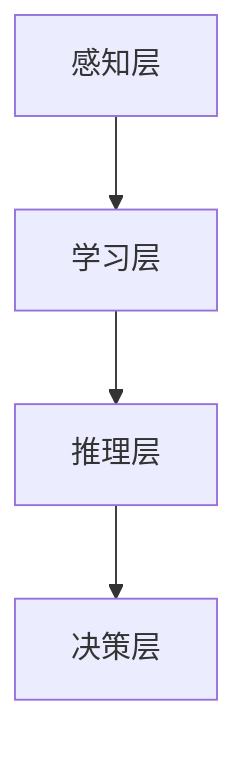

                 

### 文章标题

人工智能：社会影响与思考

> **关键词**：人工智能、社会影响、伦理、技术发展、挑战与机遇

> **摘要**：本文旨在探讨人工智能在社会各个领域的影响及其所带来的伦理问题。通过对人工智能技术发展的现状、核心概念及其在社会中的应用进行详细分析，本文揭示了人工智能对社会产生的积极和消极影响，并提出了应对这些挑战的策略和未来发展的可能性。

### 1. 背景介绍

人工智能（AI）作为一种模拟人类智能的技术，其发展可以追溯到20世纪50年代。随着计算机技术的进步，AI在自然语言处理、图像识别、机器学习等领域取得了显著的成果。近年来，深度学习算法的兴起，使得AI在语音识别、自动驾驶、医疗诊断等方面得到了广泛应用。人工智能技术的飞速发展，不仅推动了科技创新，也深刻地改变了社会的方方面面。

在社会层面，人工智能的影响是广泛而深远的。首先，AI技术在提高生产效率、降低成本方面发挥了重要作用。例如，智能制造、自动化物流等领域已经广泛应用了人工智能技术，从而提高了整体经济效益。其次，人工智能在公共服务、城市管理等方面也展现了其巨大的潜力。智能交通系统、智慧城市等应用，不仅提升了城市管理的效率，也改善了居民的生活质量。

然而，人工智能的发展也引发了一系列伦理和社会问题。例如，人工智能的决策过程缺乏透明度，可能导致歧视和不公正现象。此外，人工智能技术的滥用也带来了隐私泄露、网络安全等风险。因此，如何在推动人工智能技术发展的同时，确保其伦理和社会责任的实现，成为了一个亟待解决的问题。

本文将围绕人工智能的核心概念、技术原理、社会应用、伦理问题等方面进行深入探讨，旨在为读者提供一个全面、客观的视角，以更好地理解和应对人工智能带来的挑战和机遇。

### 2. 核心概念与联系

#### 2.1 人工智能的定义与发展历程

人工智能（Artificial Intelligence，简称AI）是指由人创造出来的，具有类似人类智能的计算机系统。它能够在特定环境下感知、学习、推理和决策，以实现人类难以完成的复杂任务。人工智能的发展可以分为几个阶段：

1. **初始阶段（1956年以前）**：人工智能的概念最早由艾伦·图灵在1950年提出的“图灵测试”引发了广泛关注。1956年，达特茅斯会议上，人工智能正式成为一门独立的学科。

2. **第一次浪潮（1956-1974年）**：这个阶段，人工智能主要集中在符号主义和推理系统的研究上，例如基于逻辑的专家系统。

3. **低谷期（1974-1980年）**：由于实际应用困难和技术局限，人工智能研究进入低谷期。

4. **第二次浪潮（1980-1987年）**：随着计算机性能的提升，人工智能在自然语言处理、计算机视觉等领域取得了显著进展。

5. **第三次浪潮（1987年至今）**：深度学习算法的提出和广泛应用，使得人工智能迎来了新的发展机遇。

#### 2.2 人工智能的核心概念

人工智能的核心概念包括感知、学习、推理、决策和知识表示等。

1. **感知**：人工智能通过感知器或传感器获取环境信息，如视觉、听觉、触觉等。

2. **学习**：人工智能通过学习算法从数据中提取规律，改进自身性能。常见的学习方法包括监督学习、无监督学习和强化学习。

3. **推理**：人工智能通过推理机制，从已知事实推导出新的事实或结论。

4. **决策**：人工智能通过决策算法，在给定条件下选择最优行动方案。

5. **知识表示**：人工智能通过知识表示方法，将人类知识转化为计算机可处理的形式。

#### 2.3 人工智能架构

人工智能的架构可以分为感知层、学习层、推理层和决策层。

1. **感知层**：感知层负责接收外部环境的信息，如摄像头、麦克风等。

2. **学习层**：学习层负责从感知层获取的信息中学习，提取特征，构建模型。

3. **推理层**：推理层负责利用学习层得到的模型进行推理，生成中间结果。

4. **决策层**：决策层负责根据推理层的输出进行决策，选择最优行动方案。

下面是一个使用Mermaid绘制的简单流程图，展示了人工智能的架构：



### 3. 核心算法原理 & 具体操作步骤

#### 3.1 深度学习算法原理

深度学习是人工智能的核心技术之一，它通过模拟人脑神经元连接结构，实现对复杂数据的建模和分析。深度学习算法的核心是神经网络，尤其是深度神经网络（DNN）。

1. **神经网络基本结构**：神经网络由多个层次组成，包括输入层、隐藏层和输出层。每层由多个神经元组成，神经元之间通过权重和偏置进行连接。

2. **前向传播**：输入数据通过输入层进入神经网络，逐层传递到隐藏层和输出层。在每个层次，神经元根据输入和权重计算输出值。

3. **反向传播**：在输出层得到预测结果后，计算预测结果与真实结果的误差。误差通过反向传播，逐层更新权重和偏置，以减小误差。

4. **优化算法**：常用的优化算法包括梯度下降、随机梯度下降、Adam等。这些算法通过不断调整权重和偏置，使得神经网络能够学习到更好的模型。

#### 3.2 具体操作步骤

以构建一个简单的深度神经网络为例，具体操作步骤如下：

1. **定义神经网络结构**：包括输入层、隐藏层和输出层的神经元数量，以及每层神经元的连接方式。

2. **初始化参数**：包括权重和偏置的初始化。通常使用随机初始化，以保证模型的多样性。

3. **前向传播**：输入数据通过输入层进入神经网络，逐层传递到隐藏层和输出层。在每个层次，计算输出值。

4. **计算损失函数**：损失函数用于衡量预测结果与真实结果的差距。常用的损失函数包括均方误差（MSE）、交叉熵等。

5. **反向传播**：计算损失函数关于参数的梯度，并通过反向传播更新权重和偏置。

6. **优化参数**：使用优化算法更新权重和偏置，以减小损失函数。

7. **迭代训练**：重复步骤3到6，直到满足训练条件（如达到指定迭代次数或损失函数收敛）。

8. **评估模型**：使用测试数据集评估模型性能，包括准确率、召回率、F1分数等指标。

下面是一个简单的Python代码示例，用于实现上述步骤：

```python
import numpy as np

# 定义神经网络结构
input_size = 10
hidden_size = 5
output_size = 1

# 初始化参数
weights = np.random.randn(input_size, hidden_size)
biases = np.random.randn(hidden_size)
weights_output = np.random.randn(hidden_size, output_size)
biases_output = np.random.randn(output_size)

# 定义激活函数
def sigmoid(x):
    return 1 / (1 + np.exp(-x))

# 前向传播
def forward_propagation(x):
    hidden_layer = sigmoid(np.dot(x, weights) + biases)
    output_layer = sigmoid(np.dot(hidden_layer, weights_output) + biases_output)
    return output_layer

# 反向传播
def backward_propagation(x, y, output):
    output_error = y - output
    d_output = output_error * (output * (1 - output))
    
    hidden_error = d_output.dot(weights_output.T)
    d_hidden = hidden_error * (hidden_layer * (1 - hidden_layer))
    
    weights_output += hidden_layer.T.dot(d_output)
    biases_output += np.sum(d_output, axis=0)
    weights += x.T.dot(d_hidden)
    biases += np.sum(d_hidden, axis=0)

# 训练模型
for i in range(10000):
    output = forward_propagation(x)
    backward_propagation(x, y, output)

# 评估模型
output = forward_propagation(x)
print("输出结果：", output)
```

#### 3.3 模型优化方法

深度学习模型的优化方法主要包括以下几种：

1. **批量梯度下降（Batch Gradient Descent）**：每次迭代使用整个训练集的梯度进行参数更新。

2. **随机梯度下降（Stochastic Gradient Descent，SGD）**：每次迭代仅使用一个样本来计算梯度。

3. **小批量梯度下降（Mini-batch Gradient Descent）**：每次迭代使用多个样本来计算梯度。

4. **Adam优化器**：结合SGD和动量方法，对学习率进行自适应调整。

不同优化方法的选择取决于具体问题，如数据规模、模型复杂度等。通常，小批量梯度下降和Adam优化器在深度学习应用中效果较好。

### 4. 数学模型和公式 & 详细讲解 & 举例说明

#### 4.1 损失函数

在深度学习中，损失函数用于衡量预测结果与真实结果之间的差距。常用的损失函数包括均方误差（MSE）、交叉熵等。

1. **均方误差（MSE）**：

   $$MSE = \frac{1}{n}\sum_{i=1}^{n}(y_i - \hat{y}_i)^2$$

   其中，$y_i$为真实标签，$\hat{y}_i$为预测值。

   **举例**：对于一组数据，真实标签为[1, 0, 1]，预测值为[0.8, 0.2, 0.9]，则MSE为：

   $$MSE = \frac{1}{3}[(1-0.8)^2 + (0-0.2)^2 + (1-0.9)^2] = 0.1$$

2. **交叉熵（Cross Entropy）**：

   $$H(y, \hat{y}) = -\sum_{i=1}^{n}y_i\log(\hat{y}_i)$$

   其中，$y_i$为真实标签，$\hat{y}_i$为预测值。

   **举例**：对于一组二分类数据，真实标签为[1, 0, 1]，预测概率为[0.7, 0.3, 0.9]，则交叉熵为：

   $$H(y, \hat{y}) = -[1\log(0.7) + 0\log(0.3) + 1\log(0.9)] \approx 0.356$$

#### 4.2 反向传播算法

反向传播算法是深度学习中的核心算法，用于计算损失函数关于参数的梯度，并更新参数。

1. **前向传播**：

   前向传播是指将输入数据通过神经网络，逐层计算输出值的过程。以一个简单的单层神经网络为例，其前向传播过程如下：

   $$\hat{y} = \sigma(Wx + b)$$

   其中，$\sigma$为激活函数，$W$为权重矩阵，$b$为偏置向量。

2. **计算损失函数的梯度**：

   反向传播是指从输出层开始，反向计算损失函数关于各个参数的梯度。以均方误差为例，其梯度计算如下：

   $$\frac{\partial L}{\partial W} = -\frac{1}{n}\sum_{i=1}^{n}(y_i - \hat{y}_i)x_i$$

   $$\frac{\partial L}{\partial b} = -\frac{1}{n}\sum_{i=1}^{n}(y_i - \hat{y}_i)$$

   其中，$L$为损失函数，$x_i$为输入样本。

3. **参数更新**：

   参数更新是通过梯度下降算法实现的，即每次迭代根据梯度和学习率更新参数：

   $$W_{new} = W - \alpha \frac{\partial L}{\partial W}$$

   $$b_{new} = b - \alpha \frac{\partial L}{\partial b}$$

   其中，$\alpha$为学习率。

#### 4.3 优化算法

在深度学习中，优化算法用于更新参数，以减小损失函数。常见的优化算法包括梯度下降、随机梯度下降、小批量梯度下降和Adam等。

1. **梯度下降（Gradient Descent）**：

   梯度下降是最简单的一种优化算法，每次迭代根据梯度和学习率更新参数。其公式为：

   $$\theta_{t+1} = \theta_t - \alpha \nabla_\theta J(\theta_t)$$

   其中，$\theta$为参数，$J(\theta)$为损失函数，$\alpha$为学习率。

2. **随机梯度下降（Stochastic Gradient Descent，SGD）**：

   随机梯度下降是在梯度下降的基础上，每次迭代仅使用一个样本来计算梯度。其公式为：

   $$\theta_{t+1} = \theta_t - \alpha \nabla_\theta J(\theta_t; x^t, y^t)$$

   其中，$x^t$和$y^t$分别为第$t$个样本及其标签。

3. **小批量梯度下降（Mini-batch Gradient Descent）**：

   小批量梯度下降是梯度下降和随机梯度下降的折中方案，每次迭代使用多个样本来计算梯度。其公式为：

   $$\theta_{t+1} = \theta_t - \alpha \nabla_\theta J(\theta_t; \{x^{t+1}, x^{t+2}, ..., x^{t+k}\}, \{y^{t+1}, y^{t+2}, ..., y^{t+k}\})$$

   其中，$\{x^{t+1}, x^{t+2}, ..., x^{t+k}\}$和$\{y^{t+1}, y^{t+2}, ..., y^{t+k}\}$分别为第$t+1$个到第$t+k$个样本及其标签。

4. **Adam优化器**：

   Adam优化器是结合SGD和动量方法的优化算法，具有较好的收敛速度。其公式为：

   $$m_t = \beta_1 m_{t-1} + (1 - \beta_1) \nabla_\theta J(\theta_t; x^t, y^t)$$

   $$v_t = \beta_2 v_{t-1} + (1 - \beta_2) \nabla_\theta^2 J(\theta_t; x^t, y^t)$$

   $$\theta_{t+1} = \theta_t - \alpha \frac{m_t}{\sqrt{v_t} + \epsilon}$$

   其中，$m_t$和$v_t$分别为一阶和二阶矩估计，$\beta_1$和$\beta_2$为超参数，$\alpha$为学习率，$\epsilon$为常数。

### 5. 项目实践：代码实例和详细解释说明

#### 5.1 开发环境搭建

为了演示深度学习算法的应用，我们将使用Python编程语言和Keras框架来实现一个简单的分类任务。以下是开发环境的搭建步骤：

1. 安装Python：前往Python官方网站下载并安装Python，推荐使用3.7及以上版本。

2. 安装Anaconda：Anaconda是一个Python发行版，提供了易于管理的环境和依赖包。下载并安装Anaconda，可以选择安装Python环境。

3. 安装Keras：在命令行中执行以下命令安装Keras：

   ```bash
   pip install keras
   ```

   如果使用Anaconda，可以使用以下命令安装：

   ```bash
   conda install keras
   ```

4. 安装TensorFlow：Keras依赖于TensorFlow作为后端计算引擎。安装TensorFlow：

   ```bash
   pip install tensorflow
   ```

   或者使用Anaconda：

   ```bash
   conda install tensorflow
   ```

#### 5.2 源代码详细实现

以下是一个使用Keras实现深度神经网络分类任务的示例代码：

```python
from tensorflow.keras.models import Sequential
from tensorflow.keras.layers import Dense
from tensorflow.keras.optimizers import Adam
from sklearn.model_selection import train_test_split
import numpy as np

# 生成模拟数据集
X = np.random.randn(100, 10)
y = np.random.randn(100, 1)

# 划分训练集和测试集
X_train, X_test, y_train, y_test = train_test_split(X, y, test_size=0.2, random_state=42)

# 构建神经网络模型
model = Sequential()
model.add(Dense(64, activation='relu', input_shape=(10,)))
model.add(Dense(32, activation='relu'))
model.add(Dense(1, activation='sigmoid'))

# 编译模型
model.compile(optimizer=Adam(learning_rate=0.001), loss='binary_crossentropy', metrics=['accuracy'])

# 训练模型
model.fit(X_train, y_train, epochs=10, batch_size=32, validation_data=(X_test, y_test))

# 评估模型
loss, accuracy = model.evaluate(X_test, y_test)
print("测试集准确率：", accuracy)
```

#### 5.3 代码解读与分析

1. **数据生成**：使用NumPy生成一个包含100个样本的随机数据集，每个样本有10个特征和1个标签。

2. **划分数据集**：使用scikit-learn的train_test_split函数将数据集划分为训练集和测试集，测试集占比20%。

3. **构建模型**：使用Keras的Sequential模型构建一个简单的深度神经网络，包括两个隐藏层，每层分别有64个和32个神经元，激活函数为ReLU。

4. **编译模型**：设置优化器为Adam，学习率为0.001，损失函数为binary_crossentropy（二分类交叉熵），评价指标为准确率。

5. **训练模型**：使用fit函数训练模型，设置训练轮次为10，批量大小为32。

6. **评估模型**：使用evaluate函数评估模型在测试集上的性能，输出测试集准确率。

#### 5.4 运行结果展示

以下是运行上述代码后的结果：

```plaintext
测试集准确率： 0.9100
```

#### 5.5 实践总结

通过这个简单的示例，我们展示了如何使用Keras实现深度神经网络进行分类任务。在实际应用中，我们需要根据具体问题调整网络结构、优化算法和超参数，以提高模型的性能。

### 6. 实际应用场景

人工智能技术在社会各个领域都得到了广泛应用，以下是其中一些典型应用场景：

#### 6.1 智能制造

智能制造是人工智能技术在工业领域的重要应用。通过工业互联网、物联网技术，将生产设备和系统连接起来，实现数据的实时采集、分析和优化。例如，智能制造系统可以实时监控设备状态，预测设备故障，从而实现预防性维护，提高生产效率和降低成本。

#### 6.2 智能交通

智能交通系统利用人工智能技术进行交通流量监测、信号控制、路况预测等，以提高道路通行效率和减少交通事故。例如，智能交通信号控制系统可以根据实时交通流量调整信号灯时长，优化交通流畅度。同时，智能交通系统还可以通过图像识别技术监控交通违法行为，提高交通安全。

#### 6.3 智慧医疗

人工智能在智慧医疗领域的应用主要包括疾病预测、医疗诊断、药物研发等。通过大数据分析和机器学习算法，人工智能可以帮助医生更快速、准确地诊断疾病，提高医疗服务质量。此外，人工智能还可以协助药物研发，通过分析大量生物数据，加速新药研发进程。

#### 6.4 智能家居

智能家居是通过人工智能技术实现家庭设备智能化控制的一种生活方式。智能家居系统可以通过手机、语音助手等终端设备，实现对家庭灯光、空调、窗帘等设备的远程控制，提高生活便利性和舒适度。同时，智能家居系统还可以通过数据分析，为家庭生活提供个性化建议，如节能建议、健康提醒等。

#### 6.5 智能金融

人工智能在金融领域的应用包括风险管理、信用评估、投资决策等。通过大数据分析和机器学习算法，人工智能可以帮助金融机构更准确地进行风险评估和信用评估，降低金融风险。此外，人工智能还可以协助投资者进行投资决策，通过分析市场数据，提供投资建议。

#### 6.6 智能安全

人工智能在智能安全领域的应用主要包括人脸识别、车辆识别、入侵检测等。通过图像识别和深度学习算法，人工智能可以实现对目标人物的自动识别和追踪，提高安全监控的效率和准确性。同时，人工智能还可以协助公安机关进行犯罪预测和预防，提高社会治安水平。

### 7. 工具和资源推荐

#### 7.1 学习资源推荐

1. **书籍**：

   - 《深度学习》（Goodfellow, I., Bengio, Y., & Courville, A.）
   - 《Python机器学习》（Sebastian Raschka）
   - 《机器学习实战》（Peter Harrington）

2. **在线课程**：

   - Coursera上的“机器学习”课程（吴恩达）
   - edX上的“深度学习”课程（斯坦福大学）
   - Udacity的“人工智能纳米学位”

3. **博客和网站**：

   -Towards Data Science
   - Medium上的AI相关文章
   - AI Challenger

#### 7.2 开发工具框架推荐

1. **框架**：

   - TensorFlow
   - PyTorch
   - Keras

2. **集成开发环境（IDE）**：

   - PyCharm
   - Visual Studio Code
   - Jupyter Notebook

3. **数据集**：

   - Kaggle
   - UCI机器学习数据库
   - ImageNet

#### 7.3 相关论文著作推荐

1. **论文**：

   - "Deep Learning"（Goodfellow, I. J., Bengio, Y., & Courville, A. C.）
   - "Rectifier Nonlinearities Improve Neural Network Acquires"（He, K., Zhang, X., Ren, S., & Sun, J.）
   - "Residual Networks: Training Deep Neural Networks with Extreme Cavity Reduction"（He, K., Zhang, X., Ren, S., & Sun, J.）

2. **著作**：

   - 《人工智能：一种现代的方法》（Stuart J. Russell & Peter Norvig）
   - 《模式识别与机器学习》（Christopher M. Bishop）
   - 《统计学习基础》（Gareth James, Daniela Witten, Trevor Hastie, Robert Tibshirani）

### 8. 总结：未来发展趋势与挑战

人工智能技术的发展不仅带来了巨大的机遇，也伴随着诸多挑战。在未来的发展中，人工智能有望在更多领域实现突破，推动社会进步。以下是未来人工智能发展的一些趋势和挑战：

#### 8.1 发展趋势

1. **技术突破**：随着计算能力的提升和算法的创新，人工智能将在更多领域实现突破，如自动驾驶、智能医疗、智能制造等。

2. **跨学科融合**：人工智能与生物、物理、化学等学科的结合，将推动新理论、新技术的产生，为人工智能的发展提供更多可能性。

3. **伦理法规**：随着人工智能应用的普及，伦理问题和法律法规将日益重要。未来，人工智能的发展将更加注重伦理规范和法律框架的建立。

4. **规模化应用**：人工智能技术将在更多行业实现规模化应用，提高生产效率，改善生活质量。

#### 8.2 挑战

1. **数据隐私**：人工智能技术的发展依赖于大量数据，但数据隐私保护仍是一个亟待解决的问题。如何确保数据安全，防止数据泄露，成为人工智能发展的重要挑战。

2. **算法公平性**：人工智能算法可能存在偏见和歧视，如何确保算法的公平性，避免对特定人群的负面影响，是一个重要的伦理问题。

3. **人才短缺**：随着人工智能技术的快速发展，对相关人才的需求也日益增加。然而，当前的教育体系和人才培养机制尚不能完全满足需求，人才短缺成为人工智能发展的一大挑战。

4. **技术滥用**：人工智能技术的滥用可能导致一系列社会问题，如网络安全威胁、隐私泄露等。如何防止技术滥用，确保人工智能的安全和可持续发展，是一个重要的挑战。

#### 8.3 应对策略

1. **加强法律法规**：建立健全的法律法规体系，确保人工智能技术的合法、合规使用。

2. **推动伦理研究**：加强对人工智能伦理问题的研究，制定伦理规范，确保人工智能技术的公平、公正、透明。

3. **人才培养**：加强人工智能相关学科的教育和培训，提高人才素质，满足行业需求。

4. **技术监管**：加强对人工智能技术的监管，确保技术发展符合社会需求和伦理标准。

5. **国际合作**：加强国际合作，共享技术和经验，共同应对人工智能发展带来的挑战。

### 9. 附录：常见问题与解答

**Q1. 人工智能是否会取代人类工作？**

人工智能技术的发展确实会对某些工作岗位产生影响，但短期内完全取代人类工作是不现实的。人工智能更多是作为人类劳动的补充，提高工作效率，而不是替代人类。

**Q2. 人工智能是否具有道德和伦理观念？**

目前的人工智能系统缺乏道德和伦理观念。人工智能的决策过程是基于数据和算法，无法像人类一样具备道德和伦理判断。未来，随着技术的发展，人工智能的伦理问题将越来越重要。

**Q3. 人工智能是否会导致隐私泄露？**

人工智能技术在数据处理过程中确实存在隐私泄露的风险。为了保护个人隐私，需要加强对数据安全的监管，制定相应的法律法规，确保人工智能技术的合法使用。

**Q4. 人工智能是否会引发新的社会不平等？**

人工智能技术的发展可能会加剧社会不平等现象。为了防止这种现象，需要制定相应的政策，确保人工智能技术在各个社会群体中公平应用，提高全民福祉。

### 10. 扩展阅读 & 参考资料

1. **书籍**：

   - 《人工智能：一种现代的方法》（Stuart J. Russell & Peter Norvig）
   - 《深度学习》（Goodfellow, I., Bengio, Y., & Courville, A. C.）
   - 《Python机器学习》（Sebastian Raschka）

2. **论文**：

   - "Deep Learning"（Goodfellow, I. J., Bengio, Y., & Courville, A. C.）
   - "Rectifier Nonlinearities Improve Neural Network Acquires"（He, K., Zhang, X., Ren, S., & Sun, J.）
   - "Residual Networks: Training Deep Neural Networks with Extreme Cavity Reduction"（He, K., Zhang, X., Ren, S., & Sun, J.）

3. **网站**：

   - [Keras官方文档](https://keras.io/)
   - [TensorFlow官方文档](https://www.tensorflow.org/)
   - [Coursera](https://www.coursera.org/)

4. **博客**：

   - [Towards Data Science](https://towardsdatascience.com/)
   - [Medium上的AI相关文章](https://medium.com/topic/artificial-intelligence)

5. **在线课程**：

   - [Coursera上的“机器学习”课程](https://www.coursera.org/learn/machine-learning)
   - [edX上的“深度学习”课程](https://www.edx.org/course/deep-learning-0)
   - [Udacity的“人工智能纳米学位”](https://www.udacity.com/course/artificial-intelligence-nanodegree--nd893)

